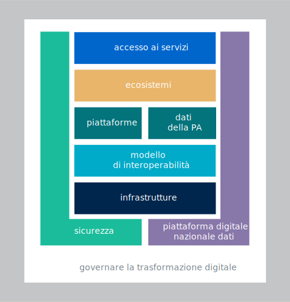
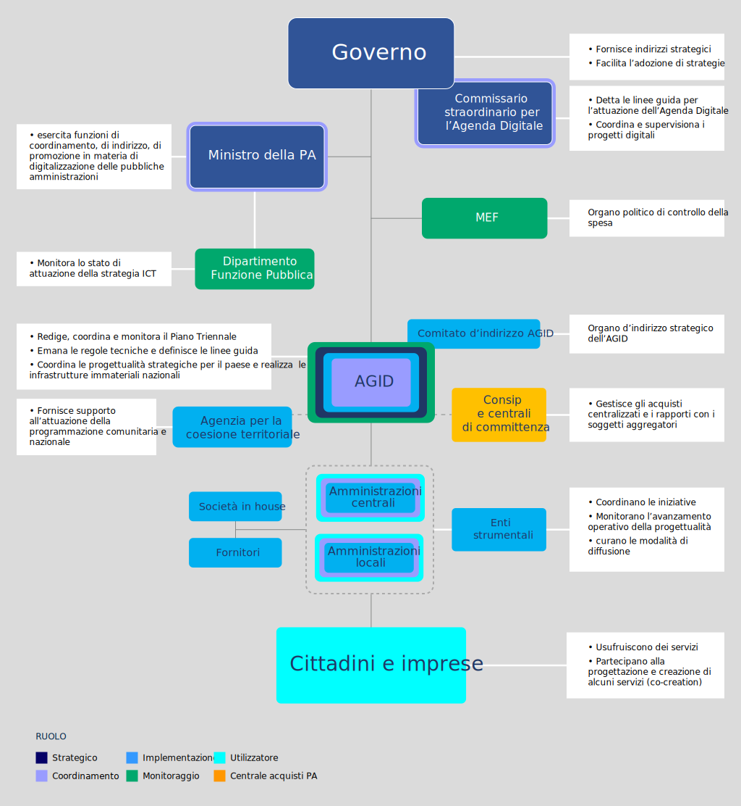

Il Piano Triennale per l’informatica nella Pubblica Amministrazione
===================================================================

Il Piano Triennale per l’informatica della Pubblica Amministrazione (Piano
Triennale o Piano, d’ora in avanti) è uno strumento essenziale per promuovere la
trasformazione digitale dell’amministrazione italiana e del Paese. Tale
trasformazione deve avvenire nel contesto del mercato unico europeo di beni e
servizi digitali [1]_, secondo una strategia che si propone di migliorare
l’accesso online ai beni e servizi in tutta Europa per i consumatori e le
imprese e creare un contesto favorevole affinché le reti e i servizi digitali
possano svilupparsi per massimizzare il potenziale di crescita dell’economia
digitale europea.

.. [1] Comunicazione “A Digital Single Market Strategy for Europe”,
   COM(2015)192, 6.5.2015.

Le aspettative dei cittadini e delle imprese per l’accesso a servizi pubblici
digitali semplici ed efficaci sono, in Italia, al centro del processo di
trasformazione digitale che si trova delineato nella Strategia per la crescita
digitale 2014 - 2020 e nel Piano Nazionale per la Banda Ultralarga, approvati
dal Consiglio dei Ministri, nel rispetto dell’Accordo di partenariato 2014 -
2020. Queste iniziative nazionali accolgono la programmazione dell’Agenda
digitale europea, una delle sette iniziative faro della Strategia Europa 2020,
la quale si propone di sfruttare al meglio il potenziale delle tecnologie ICT
per favorire l’innovazione, la crescita economica e il progresso. Il Piano
Triennale ne è una immediata derivazione.

Strategia per la trasformazione digitale
----------------------------------------

La strategia della trasformazione digitale della Pubblica Amministrazione (PA)
contenuta nel Piano Triennale è pienamente coerente con il Piano di azione
europeo sull’*eGovernment* [2]_, in riferimento al quale gli Stati membri
sono impegnati a definire le proprie politiche interne sulla base dei seguenti
principi:

.. [2] `Comunicazione “EU eGovernment Action Plan 2016 - 2020”, COM (2016) 179,
   19.4.2016.
   <https://eur-lex.europa.eu/legal-content/IT/TXT/PDF/?uri=CELEX:52016DC0179&from=en>`__

- *digital by default*, ovvero “digitale per definizione”: le pubbliche
  amministrazioni devono fornire servizi digitali come opzione predefinita;

- *once only*: le pubbliche amministrazioni devono evitare di chiedere ai
  cittadini e alle imprese informazioni già fornite;

- *digital identity only*, le PA devono condurre azioni propedeutiche
  all’adozione di sistemi generalizzati di identità digitale (le PA italiane
  devono adottare SPID);

- *cloud first*: le pubbliche amministrazioni, in fase di definizione di un
  nuovo progetto, e/o di sviluppo di nuovi servizi, in via prioritaria devono
  valutare l’adozione del paradigma *cloud* prima di qualsiasi altra
  tecnologia, tenendo conto della necessità di prevenire il rischio di
  *lock-in*. Dovranno altresì valutare il ricorso al cloud di tipo pubblico,
  privato o ibrido in relazione alla natura dei dati trattati e ai relativi
  requisiti di confidenzialità

- inclusività e accessibilità dei servizi: le pubbliche amministrazioni devono
  progettare servizi pubblici digitali che siano per definizione inclusivi e
  che vengano incontro alle diverse esigenze delle persone, ad esempio degli
  anziani e delle persone con disabilità.

- Inclusività territoriale: le pubbliche amministrazioni devono progettare
  servizi pubblici digitali che siano inclusivi anche per le minoranze
  linguistiche presenti sul territorio nazionale;

- apertura e trasparenza dei dati e dei processi amministrativi;

- transfrontaliero per definizione: le pubbliche amministrazioni devono rendere
  disponibili a livello transfrontaliero i servizi pubblici digitali rilevanti;

- interoperabile per definizione: i servizi pubblici devono essere progettati
  in modo da funzionare in modalità integrata e senza interruzioni in tutto il
  mercato unico;

- fiducia e sicurezza: sin dalla fase di progettazione devono essere integrati
  i profili relativi alla protezione dei dati personali, alla tutela della vita
  privata e alla sicurezza informatica.

In linea con gli indicatori dell’Agenda digitale europea, l’Italia ha elaborato
una propria strategia nazionale, che enfatizza la complementarietà tra il
livello nazionale, regionale e locale e individua priorità e azioni da compiere
e da misurare sulla base di specifici indicatori.

La sua concreta attuazione è stata avviata con il Piano Triennale per
l’informatica nella Pubblica Amministrazione 2017 - 2019, approvato dal
Presidente del Consiglio il 31 maggio 2017.

Il Piano 2017 - 2019 prende a riferimento il “Modello strategico di evoluzione
del sistema informativo della Pubblica amministrazione” (di seguito “Modello
strategico”) [3]_, sul quale ha innestato i progetti, le iniziative e i
programmi per la trasformazione digitale della PA, descritti anche nel citato
documento Strategia per la crescita digitale 2014 - 2020. In tale documento sono
indicati i requisiti strategici da soddisfare, ovvero:

.. [3] Deliberato dal Comitato di indirizzo di AGID il 04/02/2016

- facilitare il coordinamento di tutti gli interventi di trasformazione
  digitale e l’avvio di un percorso di centralizzazione della programmazione e
  della spesa pubblica in materia;

- considerare prioritario il principio di “digitale per definizione” (*digital
  first*), progettando e implementando i servizi al cittadino, a partire
  dall’utilizzo delle tecnologie digitali;

- agevolare la modernizzazione della Pubblica Amministrazione partendo dai
  processi, superando la logica delle regole tecniche e delle linee guida rigide
  emesse per legge. Esse, invece, dovranno essere dinamiche e puntare alla
  centralità dell’esperienza e ai bisogni dell’utenza;

- adottare un approccio architetturale basato sulla separazione dei livelli di
  *back end* e *front end*, con logiche aperte e standard pubblici che
  garantiscano ad altri attori, pubblici e privati, accessibilità e massima
  interoperabilità di dati e servizi;

- promuovere soluzioni volte a stimolare la riduzione dei costi e a migliorare
  la qualità dei servizi, contemplando meccanismi di remunerazione che possano
  anche incentivare i fornitori a perseguire forme sempre più innovative di
  composizione, erogazione e fruizione dei servizi.

La Strategia per la crescita digitale evidenzia la necessità di un radicale
ripensamento della strategia di progettazione, gestione ed erogazione dei
servizi pubblici in rete che preveda, tra l’altro, l’adozione delle architetture
a più livelli (*multi-layer architecture*) e dei principi che hanno determinato
l’affermazione del modello di *business* della cosiddetta *API economy*.

Il Modello strategico è stato quindi pensato per favorire la realizzazione di un
vero e proprio Sistema informativo della Pubblica Amministrazione (di seguito
“Sistema informativo della PA”) che:

- consideri le esigenze dei cittadini e delle imprese come punto di partenza
  per l’individuazione e la realizzazione di servizi digitali moderni e
  innovativi (servizi di *front office*);

- uniformi e razionalizzi le infrastrutture e i servizi informatici utilizzati
  dalla Pubblica amministrazione (servizi di *back office*);

- favorisca la creazione di un nuovo mercato per quelle imprese private che
  saranno in grado di operare in maniera agile in un contesto non più basato su
  grossi progetti monolitici e isolati ma su servizi a valore aggiunto. Tali
  servizi dovranno rispettare le linee guida del Piano Triennale, essere sempre
  disponibili su dispositivi mobili (approccio *mobile first*) e essere
  costruiti con architetture sicure, scalabili, altamente affidabili e basate su
  interfacce applicative (API) chiaramente definite;

- valorizzi le risorse esistenti della Pubblica Amministrazione al fine di
  salvaguardare gli investimenti già realizzati, anche incoraggiando e creando
  le condizioni per il riuso del software e delle interfacce esistenti di
  qualità;

- non disperda le esperienze maturate nei precedenti progetti di
  digitalizzazione del Paese, con l’obiettivo di prendere a modello i casi di
  successo (*best practice*) e non ripetere errori commessi nel passato;

- migliori la sicurezza grazie ad un’architettura a più livelli che assicuri la
  separazione tra *back end* e *front end* e permetta l’accesso ai *back end*
  solo in modo controllato e tramite API standard;

- promuova la realizzazione di nuovi servizi secondo il principio di
  sussidiarietà (ad es. tramite interazioni API), riducendo tempi di
  realizzazione e impegni economici per le amministrazioni sia in fase di
  sviluppo sia in fase di aggiornamento;

- agevoli il controllo delle spese relative alle tecnologie digitali della
  Pubblica amministrazione, integrando meccanismi per la misurazione dello stato
  di avanzamento delle attività programmate (ad es. tramite sistemi di *project
  management* condivisi);

- abiliti politiche *data-driven* per la pianificazione delle attività future,
  basate sull’ottimizzazione delle spese e degli investimenti.

Mappa del Modello strategico
----------------------------

L’esperienza condotta con le PA nel corso degli anni 2017 - 2018 e l’evoluzione
dei progetti indicati nel Piano 2017 - 2019 porta, nel Piano Triennale 2019 -
2021, ad una rappresentazione del Modello strategico schematicamente
sintetizzabile con la mappa grafica illustrata in :ref:`figura
1.1<mappa-modello-strategico>`.

È importante evidenziare ancora una volta che la Mappa è da intendersi come la
rappresentazione di macro ambiti che aggregano gli elementi omogenei oggetto del
Piano. I macro ambiti indicati non corrispondono a strati di un modello
architetturale a pila (*stack*).

         sistema informativo della pubblica amministrazione attraverso la
         rappresentazione di macro aree che aggregano gli elementi omogenei del
         Piano. Le macro aree che compongono il Modello, dal basso verso l’alto
         sono: Infrastrutture, Modello di interoperabilità, Piattaforme e Dati
         della PA, Ecosistemi e Accesso ai servizi. Trasversali all’intera
         figura ci sono altre tre macro aree: Governare la trasformazione
         digitale, PDND (Piattaforma Digitale Nazionale Dati) e Sicurezza.

   Mappa del modello strategico

In riferimento alla Mappa, così come si vedrà nei successivi capitoli:

- le **infrastrutture** IT nazionali perseguono l’obiettivo di aumentare la
  sicurezza, ridurre il costo delle infrastrutture tecnologiche e migliorare la
  qualità dei servizi della Pubblica Amministrazione, attraverso la
  razionalizzazione dei *data center*, l’adozione sistematica del paradigma
  *cloud* e lo sviluppo della connettività, con particolare riferimento alla
  rete internet nei luoghi pubblici e negli uffici della Pubblica
  Amministrazione;

- il **modello di interoperabilità** definisce i meccanismi che facilitano e
  garantiscono la corretta interazione tra gli attori del sistema (cittadini,
  imprese e pubbliche amministrazioni), favorendo la condivisione trasparente
  di dati, informazioni, piattaforme e servizi. Il modello di interoperabilità
  è pertanto composto da elementi quali linee guida, standard tecnologici e
  profili di interoperabilità che ciascuna Pubblica Amministrazione dovrà
  seguire al fine di garantire l’interoperabilità dei propri sistemi con quelli
  di altri soggetti per l’implementazione complessiva del Sistema informativo
  della PA;

- le **Piattaforme e i dati della PA** incentivano la centralizzazione e la
  razionalizzazione dei sistemi per la gestione dei processi e dei dati,
  riducendo la frammentazione degli interventi:

- nelle **Piattaforme** ricadono tutti quei servizi infrastrutturali (ad es. il
  servizio di identificazione, il servizio di pagamenti, ANPR) che da un lato
  agevolano e riducono i costi per la realizzazione di nuovi servizi,
  dall’altro uniformano gli strumenti utilizzati dagli utenti finali durante la
  loro interazione con la Pubblica Amministrazione. Ad esse afferiscono inoltre
  tutte quelle soluzioni applicative sufficientemente generiche da poter essere
  condivise dalle pubbliche amministrazioni (ad es. il sistema per la gestione
  dei cedolini degli stipendi);

- relativamente ai **Dati della PA** si distinguono: le basi di dati di
  interesse nazionale, gli *open data*, e i vocabolari controllati.
  Quest’ultimo è un *repository* necessario per creare e/o mantenere tutte
  quelle risorse fondamentali per la piena valorizzazione del patrimonio
  informativo della Pubblica Amministrazione.

- la **sicurezza** comprende le attività per la regolazione e
  regolamentazione della *cybersecurity* nella PA per l’*Assessment test* e
  il CERT-PA quale strumento operativo per supportare l’adozione dei
  corretti livelli di sicurezza presso la Pubblica Amministrazione. Sono
  inoltre identificati tutti gli altri aspetti che concorrono a rendere sicuri
  e affidabili i sistemi informatici, nonché le attività di indirizzo e la
  strumentazione correlata agli adempimenti per il rispetto della riservatezza
  (*privacy*);

- gli **ecosistemi** sono i settori o le aree di *policy* in cui si svolge
  l’azione da parte delle pubbliche amministrazioni: dalla sanità
  all’agricoltura, dalla scuola ai beni culturali e così via. Ciascun
  ecosistema può includere diversi domini, coinvolgendo enti e organismi
  pubblici, a partire dai Ministeri di riferimento, ma può anche includere
  soggetti privati che operano nella stessa area di interesse e che, a vario
  titolo, svolgono funzioni importanti all’interno dell’ecosistema stesso. Ad
  esempio, l’ecosistema “Finanza pubblica” comprende l’Agenzia delle Entrate, le
  Regioni, la Guardia di Finanza e, dal lato dei soggetti privati,
  commercialisti, CAF, avvocati fiscalisti, ecc. Gli ecosistemi raggruppano i
  soggetti interessati che interagiscono per il raggiungimento di obiettivi
  comuni attraverso la condivisione delle esigenze e delle modalità
  operative, la condivisione delle differenti competenze, la
  pianificazione e la realizzazione di progetti ICT;

- gli **strumenti per la generazione e diffusione dei servizi digitali:**
  definiscono regole comuni per la progettazione di interfacce, servizi e
  contenuti, migliorando e rendendo coerente la navigazione e l’esperienza del
  cittadino e delle imprese, facilitano il *design*, la realizzazione e la
  diffusione di servizi digitali, definiscono linee guida e kit di
  sviluppo, provvedono alla creazione di comunità di sviluppatori, di
  *designer* e di chiunque voglia scambiare informazioni, collaborare e
  partecipare;

- Il **Governo della trasformazione digitale** è un componente definito per far
  fronte alle necessità di coordinamento, gestione e monitoraggio delle
  attività funzionali allo sviluppo del Piano. È trasversale ad altri
  componenti e aggrega tutte le linee di azione, di *governance* e di supporto
  alle PA coinvolte nella realizzazione del Piano.

Attori
------

Il processo di condivisione del Modello e della Mappa con tutti gli attori
implicati nei processi e nelle linee di azione previste nel Piano Triennale 2017
- 2019 ha fatto sì che venissero meglio a definirsi i ruoli e le interazioni di
ciascuno degli *stakeholder*, come illustrato in :ref:`figura
1.2<attori-trasformazione-digitale>`. Sono attori dei processi di trasformazione
digitale innescati dal Piano Triennale:

- il Governo, che fornisce gli indirizzi strategici della trasformazione
  digitale della Pubblica Amministrazione e, attraverso strumenti normativi, ne
  facilita l’adozione;

- il Ministro per la Pubblica Amministrazione, che, con decreto del Presidente
  del Consiglio dei Ministri, 27 giugno 2018, ha la delega ad esercitare le
  funzioni di coordinamento, di indirizzo, di promozione di iniziative, anche
  normative, amministrative e di codificazione, di vigilanza e verifica, nonché
  ogni altra funzione attribuita dalle vigenti disposizioni al Presidente del
  Consiglio dei Ministri, in materia di digitalizzazione delle pubbliche
  amministrazioni;

- il Dipartimento della Funzione Pubblica, che promuove e coordina le politiche
  di innovazione del settore pubblico. Promuove altresì l’uso di strumenti e
  modelli che realizzino i principi della cittadinanza digitale e dell’open
  government;

- il Ministero dell’Economia e delle Finanze (MEF), che, da una parte è
  l’organo di controllo della spesa, dall’altra è il promotore delle più
  rilevanti iniziative di sviluppo di piattaforme abilitanti e di progetti di
  trasformazione digitale (noiPA, *e-procurement*, Fascicolo sanitario, ecc.);

- l’Agenzia per la Coesione Territoriale che, con l’obiettivo di sostenere,
  promuovere e accompagnare, secondo criteri di efficacia ed efficienza,
  programmi e progetti per lo sviluppo e la coesione economica, fornisce
  supporto all’attuazione della programmazione comunitaria e nazionale
  attraverso azioni di accompagnamento alle amministrazioni centrali e alle
  regionali titolari di programmi e agli enti beneficiari degli stessi, con
  particolare riferimento agli enti locali;

- il Commissario per l’attuazione dell’Agenda digitale che ha il compito di
  coordinare l’attività degli enti, delle agenzie e delle amministrazioni che
  dispongono di deleghe e competenze in materia di innovazione e attuazione
  dell’Agenda digitale, nonché delle società a partecipazione pubblica operanti
  nel settore delle tecnologie dell’informatica e della comunicazione e di
  supportare il Presidente del Consiglio dei Ministri nelle azioni strategiche
  in materia di innovazione tecnologica;

- l’AGID, che traduce gli obiettivi strategici in progettualità, coordina la
  programmazione, la realizzazione delle piattaforme nazionali e dei progetti
  catalizzatori del cambiamento, gestendo la relazione tra gli attori, emanando
  regole tecniche, trasformando le indicazioni del Codice dell’amministrazione
  digitale (CAD) in processi attuativi, regole e progetti che vengono integrati
  nel Piano e monitorando l’attuazione dei progetti da parte delle
  amministrazioni;

- le amministrazioni regionali e le Province autonome che contribuiscono
  all’aggiornamento dell’attuazione e all’adeguamento della programmazione del
  Piano Triennale per l’informatica nella Pubblica Amministrazione. Attraverso
  le strutture tecniche e la rappresentanza politica della Conferenza delle
  Regioni e delle Province autonome e nello specifico con l’azione di
  coordinamento esercitata dalla Commissione speciale Agenda digitale;

- le amministrazioni, tutte, che coordinano le iniziative indicate nel piano e
  governano i singoli progetti. Con l’identificazione del Responsabile per la
  transizione alla modalità operativa digitale, assicurano l’armonizzazione
  della propria strategia ai principi e agli indirizzi del Modello strategico e
  l’implementazione delle proprie progettualità e dello sviluppo delle proprie
  iniziative;

- le società *in house*, che partecipano allo sviluppo dei progetti delle
  singole amministrazioni e allo sviluppo e alla gestione delle piattaforme
  abilitanti, anche per erogare servizi di assistenza e consulenza;

- gli enti strumentali, che sono coinvolti nell’attuazione dell’Agenda digitale
  italiana;

- la società Consip e le centrali di committenza che gestiscono gare e
  stipulano contratti per le amministrazioni centrali e locali. Operano sulla
  base Piano Triennale per aggregare i fabbisogni e la conseguente acquisizione
  di beni e servizi.

La :ref:`figura 1.2<attori-trasformazione-digitale>` evidenzia le relazioni che
intercorrono tra i suddetti attori e ne riassume le funzioni rispetto alla
definizione e attuazione del Piano:

         Piano Triennale 2019 - 2021 e i rispettivi ruoli. In cima agli attori
         c’è il Governo che fornisce gli indirizzi strategici e facilita
         l’adozione di strategie. Immediatamente sotto al Governo, e legato ad
         esso, c’è il Commissario straordinario per l’Agenda Digitale che detta
         le linee guida per l’attuazione dell’agenda digitale e coordina e
         supervisiona i progetti digitali. Sotto al Governo sono posizionati il
         Ministro per la Pubblica Amministrazione che esercita funzioni di
         coordinamento, il Dipartimento Funzione Pubblica che monitora lo stato
         di attuazione della strategia ICT e il Ministero dell’Economia e delle
         Finanze che è organo politico di controllo della spesa. Sotto ai citati
         attori, è collegata ad essi l’Agenzia per l’Italia Digitale che redige,
         coordina e monitora il Piano triennale, emana regole tecniche e
         definisce le linee guida, coordina le progettualità strategiche per il
         Paese e realizza le infrastrutture immateriali nazionali. All’Agenzia è
         collegato il Comitato di indirizzo dell’Agenzia, che è l’organo di
         indirizzo strategico dell’Agenzia. All’Agenzia, sono collegate anche
         l’Agenzia per la coesione territoriale, che fornisce supporto
         all’attuazione della programmazione nazionale e comunitaria, Consip e
         le centrali di committenza, col compito di gestire gli acquisti
         centralizzati e i rapporti con i soggetti aggregatori. Al di sotto di
         questo impianto di attori citati, e legati ad esso, si trovano le
         pubbliche amministrazioni centrali e le pubbliche amministrazioni
         locali, che legandosi a enti strumentali, fornitori e società in-house,
         coordinano le iniziative, monitorano l’avanzamento operativo delle
         progettualità e curano le modalità di diffusione. Al di sotto delle
         amministrazioni centrali e locali, e legati ad esse, ci sono i
         cittadini e le imprese che usufruiscono dei servizi e partecipano alla
         progettazione e creazione di alcuni servizi.

   Gli attori del processo di trasformazione digitale della PA

In questa rappresentazione hanno assunto un ruolo sempre più importante le
amministrazioni locali, i cittadini e le imprese, che hanno fornito feedback e
suggerimenti per il miglioramento del Piano Triennale attraverso forum e altri
strumenti di condivisione dei quali si farà cenno più avanti.

Approccio alla stesura del Piano Triennale
------------------------------------------

Il Piano Triennale 2019 - 2021 è stato costruito insieme con le pubbliche
amministrazioni centrali e locali: incontri periodici, tavoli di lavoro,
strumenti di lavoro cooperativo, forum, iniziative di formazione/divulgazione,
*webinar*, sono state alcune delle modalità attraverso le quali si è
concretizzata tale collaborazione.

Anche per questo Piano Triennale è stata condotta un’attività di rilevazione e
analisi dei dati quantitativi sulla spesa ICT e qualitativi sulle progettualità
ascrivibili alle indicazioni strategiche del Piano. Rispetto a quanto realizzato
per il precedente Piano Triennale, il *panel* è stato ampliato: sono state
coinvolte le amministrazioni centrali, le Regioni, le Città metropolitane e i
loro Comuni capoluogo. In molti casi anche le loro *in house*.

Come già indicato nella precedente edizione, si ribadisce che anche questo Piano
va visto come uno strumento dinamico, la cui implementazione dipende
dall’aggiornamento dei contenuti e da uno scambio trasparente di informazioni
con le pubbliche amministrazioni già coinvolte, oltre che dall’allargamento
progressivo alle altre amministrazioni.

L’attuazione del Piano Triennale prevedeva un percorso graduale di
coinvolgimento delle pubbliche amministrazioni:

- il 2017 è stato l’anno della costruzione attraverso il consolidamento della
  strategia di trasformazione digitale e il completamento del percorso di
  condivisione con le Pubbliche amministrazioni;

- il 2018 è stato l’anno del consolidamento del Piano, che ha visto una
  maggiore partecipazione di amministrazioni e centrali di committenza;

- il 2019 è l’anno di completamento delle azioni del primo ciclo triennale del
  processo, che potrà pertanto essere ulteriormente affinato per il successivo
  triennio;

- il 2020 e il 2021 saranno gli anni della conclusione dei principali progetti
  di trasformazione digitale avviati e dell’integrazione del Piano stesso di una
  visione orientata a cittadini e imprese.

In quest’ottica il Piano, come più volte detto, rappresenta un percorso in
continua evoluzione e per la prossima edizione già si possono prefigurare alcuni
temi che saranno approfonditi alla luce delle attività avviate e che
diventeranno parte integrante dell’intera strategia di trasformazione digitale
della PA:

- il coinvolgimento di alcune grandi amministrazioni per realizzare importanti
  azioni di switch-off verso il digitale;

- la definizione di un modello economico che sottenda il Modello di
  interoperabilità;

- l’attenzione alle tecnologie emergenti, quali blockchain e intelligenza
  artificiale, facendo leva anche sui risultati delle sperimentazioni condotte
  dai laboratori attivi presso AGID e sugli output dei gruppi di esperti
  individuati dal Ministero dello Sviluppo Economico.

Guida alla lettura del Piano Triennale
--------------------------------------

Il Piano Triennale 2019 - 2021 ricalca sostanzialmente la stessa struttura del
Piano precedente, con qualche aggiornamento dovuto alla sua evoluzione nel corso
del biennio 2017 - 2018.

È strutturato in tre parti: nella prima parte, che include anche questo
capitolo, viene dato il quadro di riferimento generale in cui inserire le
iniziative del Piano stesso, nella seconda parte si ripercorre la struttura del
modello con gli aggiornamenti cui si faceva cenno, nella terza parte vengono
proposte considerazioni finali e note di indirizzo per le PA.

In dettaglio:

**Parte prima - Quadro di riferimento:**

- In questo capitolo si elencano le tematiche chiave della trasformazione
  digitale, così come sono rappresentate nel Modello strategico di evoluzione
  dell’informatica nella PA. Si individuano gli attori che hanno contribuito
  all’evoluzione del Piano e alla nuova stesura, illustrandone l’approccio
  seguito;

- nel capitolo 2 viene presentato in modo sintetico il contesto normativo
  europeo e nazionale.

**Parte seconda - Componenti tecnologici e di governo della trasformazione
digitale:**

- i capitoli 3-11 ripercorrono i componenti del Modello strategico, con alcune
  leggere modifiche rispetto al Piano Triennale precedente:

  - è stata invertita la posizione del capitolo sul modello di
    interoperabilità, poiché questo rappresenta la chiave di lettura di ciò
    che segue;

  - è stata modificata la strutturazione – per facilità di lettura e di
    rappresentazione - del precedente capitolo sulle infrastrutture
    immateriali in due capitoli, uno sulle piattaforme e uno sui dati della
    PA.

La struttura di questi capitoli è la seguente:

- scenario - sintetizza alcuni elementi utili a descrivere la situazione in
  essere rispetto ai temi trattati nel capitolo; riassume le azioni svolte alla
  data di pubblicazione del Piano 2019 - 2021 e quelle in corso;

- obiettivi - illustra gli obiettivi strategici e quelli relativi alle
  successive linee di azione;

- linee di azione – descrive le linee di azione necessarie al raggiungimento
  degli obiettivi fissati. Ciascuna linea di azione è così descritta:

  - tempi: si indica la data di avvio dell’azione, ovvero se l’azione è già in
    corso;

  - attori: sono indicati gli attori coinvolti, che collaborano al
    raggiungimento dei risultati;

  - descrizione: si delineano brevemente le attività e/o le fasi di lavoro;

  - risultati: si indicano gli attori in capo ai quali è assegnata la
    responsabilità della linea di azione, i risultati finali e/o intermedi
    attesi, i tempi di rilascio. Per questi ultimi si indica la data finale di
    rilascio dell’*output* oppure si indica se si tratta di un’azione
    ricorrente. I risultati, ove possibile, sono definiti in modo da essere
    misurabili, per individuare indicatori di monitoraggio, da correlare –
    quando appropriato - agli indicatori di Crescita Digitale;

  - aree di intervento: si indicano gli impatti delle linee di azione sulle
    PA, sui cittadini, sulle imprese, su altri soggetti istituzionali e su
    altre categorie di professionisti, specificando se l’impatto è previsto a
    breve termine (entro dicembre 2019), a medio termine (dicembre 2021) o a
    lungo termine (dopo il 2021), ovvero oltre l’arco di efficacia di questo
    Piano Triennale.

**Parte terza – Considerazioni finali e note di indirizzo:**

- il capitolo 12 riporta elementi relativi agli obiettivi di razionalizzazione
  della spesa ICT della PA;

- il capitolo 13 riporta in modo sintetico le azioni che le pubbliche
  amministrazioni dovranno mettere in atto.

La lettura congiunta della prima e della terza parte fornisce indicazioni
sufficienti per sviluppare un’idea generale del Modello strategico e delle
azioni che le pubbliche amministrazioni devono intraprendere.

La lettura della seconda parte è invece utile per acquisire una conoscenza più
approfondita delle attività previste.

L’appendice 1 riporta gli acronimi utilizzati in questo documento e l’appendice
2 (Il Piano Triennale per l’Informatica nella Pubblica Amministrazione, la
misurazione dei risultati e il contesto Paese) approfondisce alcune delle
tematiche affrontate nel capitolo 2.

Il documento contiene infine i seguenti allegati:

- Allegato 1 - Glossario;

- Allegato 2 – Report di sintesi Rilevazione spesa ICT della PA, 2018;

- Allegato 3 - Indicazioni operative per la migrazione dei servizi SP-Coop.
