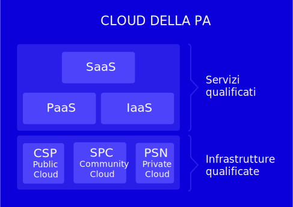

Infrastrutture
==============

Il Capitolo 3 del Piano descrive i componenti del Modello strategico evolutivo
dell’informatica nella PA contenuti nel macro ambito Infrastrutture, ovvero:

- *Cloud* della PA;

- *data center*;

- connettività.

In particolare, si precisa che, al fine di semplificare tale modello e la
struttura del Piano, nel componente **Cloud della PA** del macro ambito
Infrastrutture sono riportate anche indicazioni non strettamente
infrastrutturali, ovvero indicazioni sui servizi cloud e sulla strategia *Cloud
First* che più correttamente rappresentano elementi trasversali a tutto il
modello.

Ciò premesso, sono di seguito descritte le tre principali direttrici:

1. la realizzazione del “modello Cloud della PA” e l’applicazione del principio
   *Cloud First* con cui si intende facilitare la migrazione dei servizi delle
   PA verso tale modello;

2. la razionalizzazione e il consolidamento dei data center della Pubblica
   Amministrazione attraverso la progressiva dismissione dei data center
   obsoleti e inefficienti, con l’obiettivo di ridurre i costi di gestione delle
   infrastrutture IT in favore di maggiori investimenti in nuovi servizi
   digitali;

3. l’adeguamento del modello di connettività al paradigma cloud, favorendo la
   razionalizzazione delle spese per la connettività delle pubbliche
   amministrazioni e la diffusione della connettività nei luoghi pubblici a
   beneficio delle PA, dei cittadini e delle imprese.

Nei paragrafi successivi, per ciascuna delle tre direttrici sopra elencate viene
tracciato lo scenario attuale, che riporta quanto realizzato nel biennio
2017 - 2018. Sono descritte le prospettive future in termini di obiettivi da
conseguire nel breve e nel lungo periodo e sono individuate le linee di azione
concrete e misurabili per il conseguimento degli obiettivi nell’arco del
triennio 2019 - 2021.

Cloud della PA
--------------

Scenario
~~~~~~~~

Il cloud, nell’ambito della trasformazione digitale, rappresenta una delle
tecnologie cosiddette *disruptive*, che comporta notevoli vantaggi in termini di
incremento di affidabilità dei sistemi, qualità dei servizi erogati, risparmi di
spesa realizzabili attraverso l’opportunità della migrazione dei servizi
esistenti verso il cloud e la possibilità di pagare soltanto gli effettivi
consumi (*pay-per-use*). L’adozione del paradigma cloud rappresenta la chiave
della trasformazione digitale consentendo una vera e propria rivoluzione del
modo di pensare i processi di erogazione dei servizi della PA verso i cittadini.

Al fine di incrementare l’adozione del cloud nella PA, il Piano Triennale per
l’informatica nella Pubblica Amministrazione 2017 - 2019 ha introdotto il
Modello Cloud della PA che descrive l’insieme di infrastrutture IT e servizi
cloud qualificati da AGID a disposizione della PA, secondo una strategia che
prevede la realizzazione di tale modello, la definizione e attuazione del
programma nazionale di abilitazione al Cloud della PA e l’applicazione del
principio `cloud first
<https://cloud.italia.it/projects/cloud-italia-docs/it/latest/cloud-enablement.html#il-principio-cloud-first>`__.

La realizzazione di tale strategia consentirà il conseguimento di importanti
benefici in termini di flessibilità e risparmio per le PA, oltre ad un
significativo incremento di qualità, sicurezza e affidabilità dei servizi per
gli utenti dei servizi offerti dalle PA (cittadini e imprese).

         infrastrutture qualificate da AGID che erogano i servizi Cloud
         qualificati consultabili mediante il Cloud Marketplace suddivisi in
         IaaS (Infrastructure as a Service), PaaS (Platform as a Service) e SaaS
         (Software as a Service). In particolare, le infrastrutture qualificate
         si suddividono in: Cloud Service Provider secondo il modello Public
         Cloud, i Poli Strategici Nazionali (PSN) e l’infrastruttura di
         Community Cloud.

   Cloud della PA

Come illustrato in :ref:`figura 3.1<cloud-della-pa>`, il Modello Cloud della PA
è composto da:

- infrastrutture qualificate da AGID che erogano i servizi Cloud qualificati
  descritti nel punto seguente;

- servizi qualificati da AGID consultabili mediante il *Cloud Marketplace*
  suddivisi in *IaaS* (*Infrastructure as a Service*), *PaaS* (*Platform as a
  Service*) e *SaaS* (*Software as a Service*).

In sintesi, i servizi cloud qualificati da AGID abilitano le PA a sviluppare
nuovi servizi digitali, sono esposti mediante il `Cloud Marketplace
<https://cloud.italia.it/marketplace/>`__ (Il catalogo dei servizi cloud
qualificati) e sono erogati mediante le infrastrutture qualificate: i *Cloud
Service Provider (CSP)* qualificati da AGID, i Poli Strategici Nazionali (PSN) e
l’infrastruttura di *Community Cloud* realizzata dal Raggruppamento Temporaneo
di Imprese (RTI) aggiudicatario del `Contratto Quadro Consip SPC Cloud Lotto 1
<https://www.cloudspc.it/>`__, fino al termine del contratto.

Al fine di facilitare l’adozione del Cloud della PA, AGID e Team per la
trasformazione digitale hanno avviato un **Programma nazionale di abilitazione
al Cloud della PA**, anche detto `Cloud Enablement Program
<https://cloud.italia.it/projects/cloud-italia-docs/it/latest/cloud-enablement.html>`__.

Il programma si ispira al principio *Cloud First,* secondo il quale le PA in
fase di definizione di un nuovo progetto e/o di sviluppo di nuovi servizi,
devono, in via prioritaria, valutare l’adozione del paradigma cloud prima di
qualsiasi altra tecnologia (si veda oltre, “Focus Programma di abilitazione al
Cloud”). Il Modello cloud della PA contempla cloud di tipo pubblico, privato e
ibrido. La valutazione sulla scelta della tipologia di modello cloud (pubblico,
privato o ibrido) è guidata principalmente dalla finalità del servizio
all’utente e dalla natura di dati trattati. Le PA devono altresì valutare e
prevenire il rischio di lock-in verso il fornitore cloud. In attuazione di
quanto previsto nel Piano Triennale 2017 - 2019, il Modello Cloud della PA è
stato pubblicato a giugno 2018 sul sito `cloud.italia.it
<http://cloud.italia.it/>`__ dove ne sono descritti i componenti in maggior
dettaglio. Nello stesso sito sono pubblicate le seguenti circolari AGID che
definiscono le procedure e i requisiti per conseguire le qualificazioni di
infrastrutture e servizi:

- `Circolare n. 2/2018
  <https://cloud-pa.readthedocs.io/it/v18.0409/circolari/CSP/circolare_qualificazione_CSP_v1.2.html>`__
  “Criteri per la qualificazione dei *Cloud Service Provider* per la PA” e
  relativi allegati, che definisce i requisiti per la qualificazione dei *Cloud
  Service Provider* (qui di seguito indicati semplicemente CSP) e la relativa
  procedura di qualificazione. Il possesso dei predetti requisiti è presupposto
  per l’inserimento dell’infrastruttura Cloud all’interno del Registro Pubblico
  dei CSP qualificati e dei servizi IaaS e PaaS nel *Cloud Marketplace*;

- `Circolare n. 3/2018
  <https://cloud-pa.readthedocs.io/it/v18.0409/circolari/SaaS/circolare_qualificazione_SaaS_v_4.12.27.html>`__
  “Criteri per la qualificazione di servizi *SaaS* per il Cloud della PA” e
  relativi allegati, che definisce i requisiti per la qualificazione dei
  servizi *SaaS* erogabili sul Cloud della PA e la relativa procedura di
  qualificazione. Il possesso dei predetti requisiti è presupposto per
  l’inserimento dei servizi SaaS nel Cloud *Marketplace.*

La piattaforma *Cloud Marketplace* consente alle amministrazioni di consultare e
confrontare le infrastrutture e i servizi cloud qualificati per la PA sulla base
di parametri tecnici e funzionali, rimandando la fase di acquisizione agli
strumenti previsti dalla normativa vigente.

Consip provvede ad abilitare l’accesso a tutti i propri strumenti di acquisto
(mercato elettronico, convenzioni, accordi quadro, contratti quadro, sistema
dinamico di acquisto) ai soli *Cloud Service Provider* che erogano servizi IaaS,
PaaS e SaaS qualificati da AGID.

A decorrere da sei mesi dall’entrata in vigore delle citate Circolari AGID n. 2
e 3 del 9 aprile 2018, le Amministrazioni acquisiscono esclusivamente servizi
IaaS, PaaS, SaaS qualificati dall’Agenzia e pubblicati sul *Cloud Marketplace*.
Tale termine è stato differito al 1° aprile 2019 (Determina AGID 408/2018).

In coerenza con quanto previsto dalle Circolari AGID n. 2 e 3 del 9 aprile 2018,
in particolare con quanto indicato rispettivamente negli articoli 4 e 5 “Fasi
del processo di qualificazione” e più specificamente nella Fase 3 “Mantenimento
della qualificazione”, AGID può verificare in ogni momento il possesso dei
criteri di ammissibilità e dei requisiti previsti per la qualificazione
conseguita. La perdita del possesso dei criteri di ammissibilità e/o di almeno
uno dei requisiti comporta la revoca della qualificazione.

Obiettivi
~~~~~~~~~~

- Incentivare lo sviluppo di nuovi servizi digitali secondo il principio *Cloud
  First*;

- ridurre il rischio di dipendenza esclusiva dal fornitore *(lock in);*

- migliorare sicurezza e affidabilità dei servizi IT della PA;

- attuare il programma nazionale di abilitazione al Cloud della PA;

- evolvere e consolidare il Modello Cloud della PA;

- definire i requisiti tecnici infrastrutturali per i Poli strategici nazionali
  per il Cloud della PA.

Linee di azione
~~~~~~~~~~~~~~~

.. _la01:

LA01 - Attuazione del Programma nazionale di abilitazione al Cloud della PA
^^^^^^^^^^^^^^^^^^^^^^^^^^^^^^^^^^^^^^^^^^^^^^^^^^^^^^^^^^^^^^^^^^^^^^^^^^^

**Tempi**
  In corso

**Attori**
  AGID, Team per la trasformazione digitale, Consip

**Descrizione**
  Definizione delle linee guida per lo sviluppo di servizi *cloud native* per il
  Cloud della PA e del Modello di abilitazione al Cloud della PA, nell’ambito
  del Programma.

  Pubblicazione da parte di Consip delle gare previste nel `Piano gare
  strategiche ICT 2018
  <http://www.consip.it/media/news-e-comunicati/agid-e-consip-definito-il-quadro-delle-gare-strategiche-ict-per-la-realizzazione-del-piano-triennale-per-l-informatica-nella-pa>`__
  (definito da AGID e Consip) e successiva stipula dei contratti a supporto del
  Programma di abilitazione al Cloud della PA.

**Risultati**
  AGID e Team per la trasformazione digitale pubblicano, in consultazione, le
  Linee guida per lo sviluppo di servizi *cloud native* per il Cloud della PA
  (maggio 2019).

  AGID e Team per la trasformazione digitale pubblicano, in consultazione, le
  Linee guida per il modello di abilitazione e migrazione al Cloud della PA e la
  definizione dei centri di competenze (novembre 2019).

  Consip stipula tramite le gare strategiche “*Public Cloud*: Servizi
  qualificati di Cloud Computing (IaaS/PaaS/SaaS) in un modello di *Public
  Cloud*” e “*Digital Transformation*: Servizi specialistici di supporto al
  piano di trasformazione digitale della PA” i contratti a supporto del
  Programma di abilitazione al Cloud della PA (entro dicembre 2020).

**Aree di intervento**
  Nel medio periodo, impatto sulle PA, su Consip, e sulle imprese che rivestono
  il ruolo di *Cloud Service Provider*.

.. _la02:

LA02 - Migrazione dei sistemi informativi delle PA verso il cloud
^^^^^^^^^^^^^^^^^^^^^^^^^^^^^^^^^^^^^^^^^^^^^^^^^^^^^^^^^^^^^^^^^

**Tempi**
  In corso

**Attori**
  PA, AGID, Team per la trasformazione digitale

**Descrizione**
  Un gruppo di amministrazioni pilota individuate da AGID e Team per la
  trasformazione digitale eseguono i piani di migrazione dei sistemi informativi
  verso il Cloud della PA definiti nell’ambito del Programma nazionale di
  abilitazione al Cloud.

  Nei contratti aventi ad oggetto servizi cloud (IaaS/PaaS/SaaS) qualificati, le
  amministrazioni prevedono gli accordi sulla qualità dei servizi offerti
  utilizzando gli indicatori dei livelli di servizio (SLI - *Service level
  indicator*) previsti nella tabella “Indicatori della Qualità del Servizio ”di
  cui all’Allegato A della Circolare n. 2 del 2018.

**Risultati**
  Migrazione verso il Cloud della PA dei sistemi informativi di un primo gruppo
  di amministrazioni pilota (dicembre 2019).

  Conclusione migrazione verso il Cloud della PA dei sistemi informativi di
  almeno 5 amministrazioni pilota e avvio migrazione di un ulteriore gruppo di
  PA (entro dicembre 2021).

**Aree di intervento**
  Nel breve e medio periodo impatto verso le PA coinvolte e Consip. Nel medio e
  lungo periodo impatto su imprese e professionisti settore IT.

.. _la03:

LA03 - Definizione dei requisiti tecnici delle infrastrutture IT
^^^^^^^^^^^^^^^^^^^^^^^^^^^^^^^^^^^^^^^^^^^^^^^^^^^^^^^^^^^^^^^^

**Tempi**
  In corso

**Attori**
  AGID, Team per la trasformazione digitale

**Descrizione**
  AGID e Team per la trasformazione digitale definiscono lo scopo e le finalità
  dei PSN oltre a dettagliare i requisiti tecnici relativi alle caratteristiche
  dei siti geografici dei data center e alla gestione operativa e tecnica dei
  PSN.

  AGID e Team per la trasformazione digitale eseguono gli *assessment* sulle
  infrastrutture fisiche dei soggetti candidati a PSN e trasmettono al Governo,
  per successivi atti di competenza, un documento di *gap analysis* contenente
  la proposta tecnica di evoluzione delle infrastrutture fisiche appartenenti a
  potenziali PSN.

**Risultati**
  AGID pubblica una circolare in cui:

  - si definiscono lo scopo e le finalità dei PSN;

  - si dettagliano i requisiti tecnici relativi alle caratteristiche dei siti
    geografici dei data center e alla gestione operativa e tecnica dei PSN;

  - si definiscono i requisiti tecnici ai fini della classificazione delle
    infrastrutture IT del gruppo A;

  - si aggiornano le modalità per l’approvazione delle spese in materia di data
    center (giugno 2019).

  AGID e Team per la trasformazione digitale pubblicano in consultazione, le
  Linee guida per la progettazione e realizzazione di *data center* nell’ambito
  dei Poli strategici nazionali (giugno 2019);

  AGID e Team per la trasformazione digitale predispongono un documento di *gap
  analysis* sui candidati a Polo strategico nazionale (dicembre 2019);

  A seguito dell’emanazione del decreto di individuazione dei PSN da parte del
  Governo, AGID dà seguito a quanto previsto e definito all’interno della
  `Circolare AGID n.5/2017
  <https://www.censimentoict.italia.it/it/latest/docs/circolari/2017113005.html>`__
  (dicembre 2021).

**Aree di intervento**
  Nel breve periodo impatto sul Governo per la scelta dei PSN e del modello di
  *governance* degli stessi. Nel medio periodo impatto sulle PA candidabili a
  PSN e sulle imprese del settore ICT.

Data center
-----------

Scenario
~~~~~~~~

Con la Circolare AGID n. 5 del 30 novembre 2017 è stato avviato il `Censimento
del patrimonio ICT della PA
<https://censimentoict.italia.it/it/latest/contents.html>`__, come indicato tra
le linee di azione del Piano Triennale 2017 - 2019.

Hanno partecipato al censimento 778 amministrazioni. 625 di queste hanno
dichiarato di possedere data center, per un totale censito di 927 data center.
Altre 153 amministrazioni hanno dichiarato di non possedere data center, oppure
di avvalersi di servizi IT erogati da altri soggetti.

In base all’analisi dei risultati del Censimento, le infrastrutture censite sono
classificate nelle seguenti categorie:

- candidabili a Poli strategici nazionali, ovvero che rispettano tutti i
  requisiti preliminari indicati all’`Allegato B alla Circolare AGID n. 5 del 30
  novembre 2017
  <https://censimentoict.italia.it/it/latest/docs/circolari/2017113005.html#allegato-b-requisiti-preliminari-per-lidentificazione-dei-soggetti-candidabili-a-psn>`__;

- **Gruppo A** - Data center di qualità non idonei come Poli strategici
  nazionali, oppure con carenze strutturali o organizzative considerate minori.
  Saranno strutture che potranno continuare ad operare ma per esse non potranno
  essere effettuati investimenti di ampliamento o evoluzione sulle
  infrastrutture fisiche. Sarà possibile investire solo per garantire continuità
  dei servizi e *disaster recovery*, fino ad un’eventuale migrazione su altre
  strutture, avvalendosi dei servizi cloud disponibili nell’ambito del Cloud
  della PA. La progressiva dismissione delle infrastrutture fisiche e la
  trasformazione dei servizi secondo il piano di abilitazione nazionale al cloud
  saranno oggetto di specifica attività di programmazione e sviluppo concordata
  con le amministrazioni delle infrastrutture afferenti al gruppo.

- **Gruppo B** - Data center che non garantiscono requisiti minimi di
  affidabilità e sicurezza dal punto di vista infrastrutturale e/o organizzativo
  o non garantiscono la continuità dei servizi, o non rispettano i requisiti per
  essere classificati nelle due precedenti categorie.

Come già indicato nel Piano Triennale 2017 - 2019, durante il periodo di
esecuzione del presente Piano, le PA non possono effettuare spese o investimenti
in materia di data center, secondo le indicazioni e le eccezioni indicate
nella circolare AGID n.2 del 24 giugno 2016 e nella circolare AGID n.5 del 30
novembre 2017.

Obiettivi
~~~~~~~~~

- Definire politiche di razionalizzazione delle infrastrutture IT delle PA
  tramite azioni di consolidamento e dismissione/migrazione verso il Cloud della
  PA.

- incrementare la qualità delle infrastrutture IT in termini di sicurezza,
  resilienza, efficienza energetica e continuità operativa (*business
  continuity*);

- riqualificare la spesa derivante dal consolidamento dei data center e
  migrazione dei servizi verso il cloud.

Gli obiettivi delle linee di azione mirano essenzialmente a pianificare il
consolidamento dei data center del gruppo A e la dismissione di quelli del
gruppo B.

Linee di azione
~~~~~~~~~~~~~~~

.. _la04:

LA04 - Comunicazione dei risultati del censimento del Patrimonio ICT
^^^^^^^^^^^^^^^^^^^^^^^^^^^^^^^^^^^^^^^^^^^^^^^^^^^^^^^^^^^^^^^^^^^^

**Tempi**
  In corso

**Attori**
  AGID

**Descrizione**
  In seguito alla conclusione del censimento del patrimonio ICT della PA, AGID
  comunica alle PA l’esito della classificazione delle infrastrutture fisiche
  secondo le tre categorie (candidabili a PSN, Gruppo A, Gruppo B).

**Risultati**
  AGID comunica i risultati delle fasi 1 e 2 del censimento del Patrimonio ICT
  (entro aprile 2019).

**Aree di intervento**
  Nel breve periodo, impatto sulle PA.

.. _la05:

LA05 - Avvio del consolidamento e della dismissione dei data center di Gruppo A
^^^^^^^^^^^^^^^^^^^^^^^^^^^^^^^^^^^^^^^^^^^^^^^^^^^^^^^^^^^^^^^^^^^^^^^^^^^^^^^

**Tempi**
  In corso

**Attori**
  AGID, Team per la trasformazione digitale, PA

**Descrizione**
  I soggetti detentori delle infrastrutture fisiche delle PA appartenenti al
  Gruppo A pianificano congiuntamente ad AGID e Team per la trasformazione
  digitale il consolidamento dei data center secondo quanto previsto dal
  Programma nazionale di abilitazione al Cloud della PA.

  AGID e Team per la trasformazione digitale assicurano il controllo e
  monitoraggio dei piani di migrazione trasmessi dalle PA.

**Risultati**
  AGID e Team per la trasformazione digitale pubblicano il Primo Rapporto sullo
  stato d’avanzamento della migrazione al Cloud della PA del Gruppo A (novembre
  2019). Le PA del Gruppo A trasmettono ad AGID e i propri piani di migrazione
  al Cloud della PA (novembre 2020)

**Aree di intervento**
  Nel medio periodo, impatto sulle PA appartenenti al Gruppo A e sulle imprese
  ICT.

.. _la06:

LA06 - Dismissione dei data center di Gruppo B
^^^^^^^^^^^^^^^^^^^^^^^^^^^^^^^^^^^^^^^^^^^^^^

**Tempi**
  In corso

**Attori**
  AGID, Team per la trasformazione digitale, PA

**Descrizione**
  Le infrastrutture fisiche delle PA appartenenti al Gruppo B provvedono alla
  migrazione al Cloud della PA secondo quanto previsto dal Programma nazionale
  di abilitazione al Cloud della PA. Le PA comunicano ad AGID il numero dei data
  center dismessi. AGID e Team per la trasformazione digitale elaborano i
  rapporti sullo stato di avanzamento dei data center dismessi.

  AGID assicura il controllo e monitoraggio delle azioni realizzate dalle PA
  pubblicando un report annuale.

**Risultati**
  Le PA del Gruppo B che dismettono i propri data center ne danno comunicazione
  ad AGID (giugno 2020, a seguire con frequenza semestrale);

  AGID e il Team per la trasformazione digitale pubblicano il Primo Rapporto
  annuale sullo stato di dismissione dei data center di Gruppo B (dicembre
  2020).

**Aree di intervento**
  Nel breve periodo, impatto sulle PA appartenenti al Gruppo B e imprese ICT.
  Nel lungo periodo impatto sui professionisti ICT.

Connettività
------------

Scenario
~~~~~~~~

Il fabbisogno di connettività della Pubblica Amministrazione si esprime
attraverso quattro differenti direttrici:

1. l’ampliamento e l’adeguamento della capacità di connessione delle
   amministrazioni, anche avvalendosi di infrastrutture di rete virtualizzate
   che consentano di realizzare un paradigma centralizzato di *routing* e
   processamento del traffico;

2. l’adeguamento della connettività per consentire alle sedi delle pubbliche
   amministrazioni di accedere a internet e ai servizi cloud;

3. l’adeguamento della connettività per interconnettere i Poli Strategici
   Nazionali (PSN) e consentire loro di erogare i servizi cloud;

4. l’adeguamento della connettività per consentire a cittadini e imprese di
   usufruire dei servizi pubblici.

Le pubbliche amministrazioni dovrebbero quindi avviare una ricognizione della
propria connettività ai fini di valutarne l’eventuale adeguamento sia in termini
di capacità complessiva che in termini di sicurezza, tenendo in considerazione
le caratteristiche dei servizi in cooperazione con altre amministrazioni, dei
processi amministrativi interni e dei servizi pubblici rivolti ai cittadini.

L’infrastruttura di rete della Pubblica Amministrazione deve rispondere ai
seguenti principi minimi generali:

- capacità di banda adeguata a soddisfare le necessità interne e di
  cooperazione;

- monitoraggio dell’intera infrastruttura fisica finalizzato a garantire un
  tempestivo intervento in caso di incidente;

- scalabilità della capacità di banda ai fini dell’erogazione di servizi wi-fi
  per uso pubblico;

- conformità dei livelli di sicurezza agli standard internazionali e alle
  raccomandazioni del CERT-PA assicurando almeno il rispetto delle “`Misure
  minime di sicurezza ICT per le pubbliche amministrazioni
  <http://www.gazzettaufficiale.it/eli/id/2017/05/05/17A03060/sg>`__” come
  descritto nel capitolo 8;

- nel caso di infrastrutture che ospitino servizi strategici, necessità di
  garantire una connessione in alta affidabilità, al fine di incrementare la
  resilienza dell’intero sistema, anche sfruttando tecniche di controllo
  centralizzate e virtuali che permettano di gestire le problematiche di
  affidabilità in *real-time*;

- capacità di supportare il protocollo *dual-stack* IPv4/IPv6.

La connettività della PA deve essere finalizzata a garantire:

- l’erogazione e la fruizione dei servizi in interoperabilità;

- l’accesso alla rete internet a tutti i dipendenti della PA per i fini
  istituzionali e come strumento a supporto della produttività, compreso
  l’accesso a strumenti per la comunicazione evoluta;

- l’interconnessione tra le sedi distribuite geograficamente di una stessa
  Amministrazione e tra questa e il PSN di riferimento nei modi e nei tempi di
  realizzazione di quest’ultimo; tali interconnessioni possono essere realizzate
  anche attraverso la virtualizzazione dei servizi di rete in ambienti
  fortemente mutevoli nel tempo;

- l’erogazione dei servizi di connettività della Rete Internazionale della PA
  (S-RIPA);

- l’erogazione di servizi ai cittadini.

Allo stato dell’arte:

- risultano contrattualizzati un migliaio di contratti per i servizi di
  connettività nell’ambito del Sistema pubblico di connettività (SPC), di cui
  circa 50 afferenti alle grandi amministrazioni centrali dello Stato;

- sono concluse le attività di migrazione delle amministrazioni titolari di
  precedenti contratti SPC sui nuovi contratti quadro SPC2 ed è avvenuto il
  rilascio da parte di AGID della nuova infrastruttura QXN2, su cui sono già
  operativi tutti i fornitori della nuova gara di connettività SPC2;

- Consip ha indetto nel dicembre 2017 una gara per la stipula di un accordo
  quadro avente ad oggetto la progettazione della rete e l’erogazione dei
  servizi di connettività della Rete Internazionale della PA;

- è prevista la cessazione, al 31 marzo 2019, dei servizi della vecchia
  infrastruttura QXN utilizzata dalle amministrazioni che si sono avvalse del
  precedente contratto SPC1.

L’adozione del Modello Cloud della PA descritto nel paragrafo 3.1 del presente
Piano Triennale, richiede inoltre un aggiornamento del modello di connettività
che risponda alle esigenze dei diversi scenari e al fine di garantire alle
amministrazioni un accesso ad internet semplice, veloce e affidabile.

Anche in funzione del piano di razionalizzazione delle risorse ICT della PA sono
da segnalare due distinti percorsi, in raccordo con il Piano Nazionale Banda
Ultra Larga:

- per i Poli Strategici Nazionali (PSN), con requisiti di banda e
  caratteristiche trasmissive non riscontrabili nella disponibilità dei
  Contratti Quadro SPC, AGID e Consip hanno inserito nel `piano delle gare
  strategiche
  <http://www.consip.it/media/news-e-comunicati/agid-e-consip-definito-il-quadro-delle-gare-strategiche-ict-per-la-realizzazione-del-piano-triennale-per-l-informatica-nella-pa>`__
  un’apposita gara, le cui attività di definizione puntuale dei contenuti sono
  già state avviate;

- per quanto attiene tutte le PA che non costituiranno un Polo Strategico
  Nazionale, la connettività continuerà ad essere garantita dalle disponibilità
  del Contratto Quadro SPC-Connettività (SPC-Conn) per il quale sono previsti
  meccanismi di aggiornamento ed evoluzione dei servizi o da altre soluzioni di
  mercato qualora l’offerta del Contratto Quadro non soddisfi le esigenze delle
  amministrazioni.

Obiettivi
~~~~~~~~~

- Intervenire sulla capacità di connettività da parte della Pubblica
  Amministrazione perseguendo gli obiettivi previsti dal Piano Nazionale Banda
  Ultra Larga e dalla strategia di razionalizzazione delle risorse ICT della PA,
  promuovendo anche la diffusione del protocollo IPv6 e l’adozione delle reti
  virtuali;

- favorire il processo di aggregazione dei data center, attraverso la
  disponibilità di connettività tra PSN e PA distribuite geograficamente;

- razionalizzare le spese per la connettività attraverso l’utilizzo delle gare
  SPC;

- favorire l’interconnessione delle Regioni a SPC;

- garantire la connettività anche per le sedi estere delle pubbliche
  amministrazioni;

- uniformare e aumentare la diffusione della connettività *wireless* nei luoghi
  pubblici e negli uffici della Pubblica Amministrazione accessibili al
  pubblico, anche al fine di favorire l’accesso ai servizi da parte dei
  cittadini attraverso l’uso di reti wi-fi pubbliche.

Linee di azione
~~~~~~~~~~~~~~~

.. _la07:

LA07 - Aggiornamento del modello di connettività
^^^^^^^^^^^^^^^^^^^^^^^^^^^^^^^^^^^^^^^^^^^^^^^^

**Tempi**
  Marzo 2020

**Attori**
  AGID, Team per la trasformazione digitale

**Descrizione**
  AGID e Team per la trasformazione digitale elaborano un documento che descrive
  lo sviluppo del modello di connettività per la PA al fine di supportare al
  meglio il paradigma cloud e introdurre nuovi servizi nell’ambito della
  connettività.

**Risultati**
  AGID e Team per la trasformazione digitale pubblicano in consultazione un
  documento di indirizzo che descrive l’evoluzione del sistema pubblico di
  connettività. (marzo 2020)

**Aree di intervento**
  Nel lungo periodo, impatto sulle PA e cittadini.

.. _la08:

LA08 - Adeguamento della capacità di connessione della PA
^^^^^^^^^^^^^^^^^^^^^^^^^^^^^^^^^^^^^^^^^^^^^^^^^^^^^^^^^

**Tempi**
  In corso

**Attori**
  PA

**Descrizione**
  Le amministrazioni adeguano la propria capacità di connessione per garantire
  il completo dispiegamento dei servizi e delle piattaforme, adottando
  alternativamente:

- soluzioni di connettività basate sull’adesione ai Contratti quadro SPC, salvo
  i casi in cui le esigenze di banda e le caratteristiche trasmissive richieste
  non trovino potenziale soddisfacimento in tali ambiti contrattuali;

- i servizi resi disponibili, in base al principio della sussidiarietà, nel
  proprio territorio di riferimento dalla Regione o da altro ente pubblico
  locale che abbia già realizzato strutture di connessione territoriali conformi
  ai requisiti dettati da AGID e interconnesse con la rete SPC.

**Risultati**
  Le amministrazioni adeguano la propria capacità di connessione (entro dicembre
  2020).

**Aree di intervento**
  Nel breve periodo, impatto sulle PA.

.. _la09:

LA09 - Operatività dei nuovi contratti per la connettività S-RIPA per le sedi estere delle Pubbliche Amministrazioni
^^^^^^^^^^^^^^^^^^^^^^^^^^^^^^^^^^^^^^^^^^^^^^^^^^^^^^^^^^^^^^^^^^^^^^^^^^^^^^^^^^^^^^^^^^^^^^^^^^^^^^^^^^^^^^^^^^^^

**Tempi**
  In corso

**Attori**
  Sedi estere delle PA, Consip

**Descrizione**
  Consip ha indetto la gara a procedura ristretta per la stipula di un accordo
  quadro avente ad oggetto la progettazione della rete e l’erogazione dei
  servizi di connettività della Rete Internazionale della PA, nonché servizi di
  sicurezza, VoIP, comunicazione evoluta e servizi professionali. È in corso
  l’aggiudicazione. L’accordo quadro avrà una durata di 60 mesi, decorrenti
  dalla data di attivazione. Successivamente, le sedi estere potranno procedere
  con la migrazione e l’utilizzo dei servizi della nuova S-RIPA.

**Risultati**
  Le sedi estere delle amministrazioni, a seguito dell’aggiudicazione della
  nuova gara da parte di Consip, realizzano la migrazione e procedono
  all’utilizzo dei servizi della nuova S-RIPA (dicembre 2021).

**Aree di intervento**
  Nel medio periodo, impatto sulle sedi estere delle PA e nel lungo periodo
  sulle imprese italiane all’estero e cittadini italiani all’estero.

.. _la10:

LA10 - Realizzazione dei servizi in conformità alle Linee guida per la realizzazione di reti wi-fi pubbliche
^^^^^^^^^^^^^^^^^^^^^^^^^^^^^^^^^^^^^^^^^^^^^^^^^^^^^^^^^^^^^^^^^^^^^^^^^^^^^^^^^^^^^^^^^^^^^^^^^^^^^^^^^^^^

**Tempi**
  In corso

**Attori**
  PA

**Descrizione**
  AGID pubblica in consultazione le Linee guida per l’utilizzo delle wi-fi che
  le pubbliche amministrazioni rendono accessibili ai cittadini negli uffici e
  nei luoghi pubblici, redatte anche sulla base delle migliori esperienze di
  wi-fi pubblico già in essere nella PA.

  Le amministrazioni definiscono e realizzano il Piano di adeguamento alle linee
  guida emanate da AGID per le wi-fi.

  AGID adegua periodicamente le linee guida in funzione degli aggiornamenti
  tecnologici e normativi e sulla base di buone pratiche messe in campo dalle
  pubbliche amministrazioni.

**Risultati**
  Pubblicazione di Linee guida wi-fi da parte di AGID (entro settembre 2019).

  Le amministrazioni mettono a disposizione la propria rete wi-fi per la
  fruizione gratuita da parte dei cittadini negli uffici e luoghi pubblici
  (entro agosto 2020)

**Aree di intervento**
  Nel breve periodo, impatto su PA, imprese, professionisti e cittadini.

.. admonition:: Focus. Programma di abilitazione al Cloud

   AGID e Team per la trasformazione digitale hanno progettato un **Programma di
   abilitazione al Cloud**, anche detto *Cloud Enablement*. Con tale
   terminologia si definisce il processo che abilita un’organizzazione a creare,
   operare e mantenere le proprie infrastrutture IT utilizzando tecnologie e
   servizi cloud, favorendo il consolidamento e la razionalizzazione delle
   infrastrutture fisiche e la riorganizzazione dei processi IT della PA (si
   veda `Cloud della PA <https://cloud.italia.it/>`__).

   Nella definizione del Programma di abilitazione al Cloud della PA sono stati
   individuati tre elementi principali che caratterizzano la strategia di questo
   percorso di trasformazione:

   - il principio *Cloud First*, per la definizione di nuovi progetti e per la
     progettazione dei nuovi servizi nell’ambito di nuove iniziative da avviare
     da parte della PA in coerenza con il modello Cloud della PA. In base al
     principio *Cloud First*, le PA in fase di definizione di un nuovo progetto,
     e/o sviluppo di nuovi servizi, devono, in via prioritaria, adottare il
     paradigma cloud e in particolare i servizi SaaS, prima di qualsiasi altra
     opzione tecnologica, in coerenza con il Modello Cloud della PA e le `linee
     guida su acquisizione e riuso di software per le pubbliche amministrazioni
     <https://lg-acquisizione-e-riuso-software-per-la-pa.readthedocs.io/it/latest/>`__;

   - la strategia di *Cloud Enablement*, per la migrazione delle infrastrutture
     e delle applicazioni esistenti verso il modello Cloud della PA;

   - i Centri di Competenza Territoriali, ovvero una comunità allargata di
     tecnici, esperti e *manager* dell’IT che propongono standard e regolamenti
     dei servizi digitali e condividono informazioni, soluzioni e competenze
     utili a mantenere, aggiornare e aumentare l’affidabilità dei sistemi.

   Nell’ambito del principio del *Cloud First*, il **SaaS First** punta a
   favorire l’adozione di soluzioni SaaS, ove disponibili sul *Cloud
   Marketplace*, in modo da ridurre il più possibile l’*overhead* tecnico ed
   amministrativo delle amministrazioni dovuto alla gestione dei servizi IT che
   richiedono competenze specifiche.

   Nell’ambito della strategia di **Cloud Enablement** viene definito il modello
   strategico evolutivo per la migrazione del patrimonio IT esistente verso il
   Cloud della PA mediante due componenti principali:

   - il programma di *Cloud Enablement* nazionale, ovvero l’insieme dei progetti
     specifici che consentiranno alle PA di migrare le applicazioni in ambiente
     cloud;

   - l’ambiente (cd. *framework*) di lavoro del *Cloud Enablement* costituito
     dall’insieme di risorse, strategie operative, metodologie e strumenti
     necessari per attuare il Cloud Enablement Program della PA.

   Nell’ambito dell’attività di costituzione dei Centri di Competenza
   Territoriali (CdCT), illustrata nel cap. 11, AGID fornirà il proprio supporto
   con lo scopo di consolidare il *know how* e l’esperienza relativa ai servizi
   Cloud nella PA. I CdCT svolgono la funzione di **soggetti aggregatori** in
   grado di amministrare i servizi IT per conto di altre PA e AGID potrà mettere
   a disposizione delle amministrazioni, su richiesta, competenze e risorse
   professionali anche nell’ambito dell’Accordo Quadro stipulato a febbraio 2018
   tra AGID e Regioni e Province Autonome.

.. admonition:: Focus. Revisione delle azioni su Cloud e Data Center del Piano
   Triennale 2017 - 2019

   Rispetto alla precedente versione (si veda Piano Triennale 2017 - 2019, Cap.
   3.1) sulla base di considerazioni emerse in fase di attuazione delle azioni
   precedentemente previste è emersa l’opportunità di ricomprendere alcuni
   risultati attesi in azioni di più ampia visione.

   In particolare, l’emanazione delle Linee guida per la razionalizzazione del
   patrimonio ICT delle Pubbliche amministrazioni e dei Piani di
   razionalizzazione del patrimonio ICT delle PA sono state ricomprese
   nell’azione “**Attuazione del Programma nazionale di abilitazione al Cloud
   della PA**” nell’ambito della definizione del Programma.
