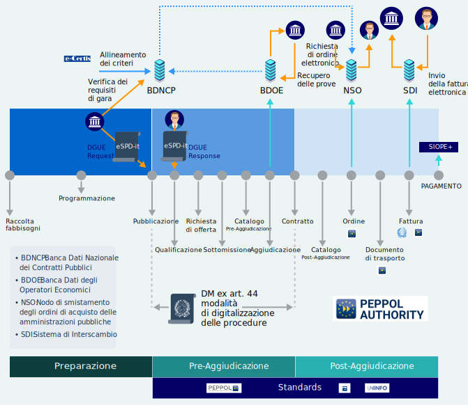
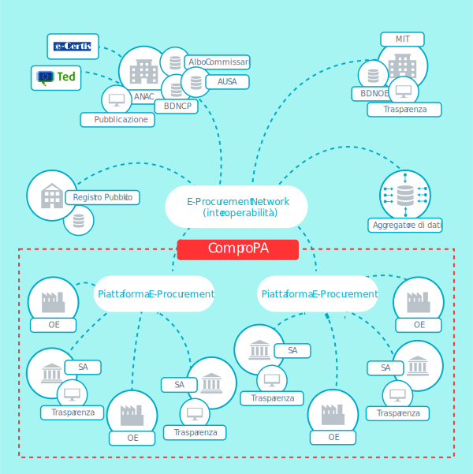
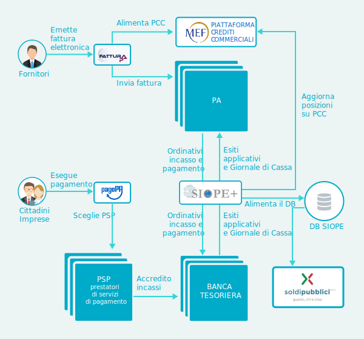
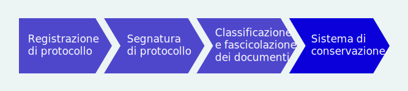
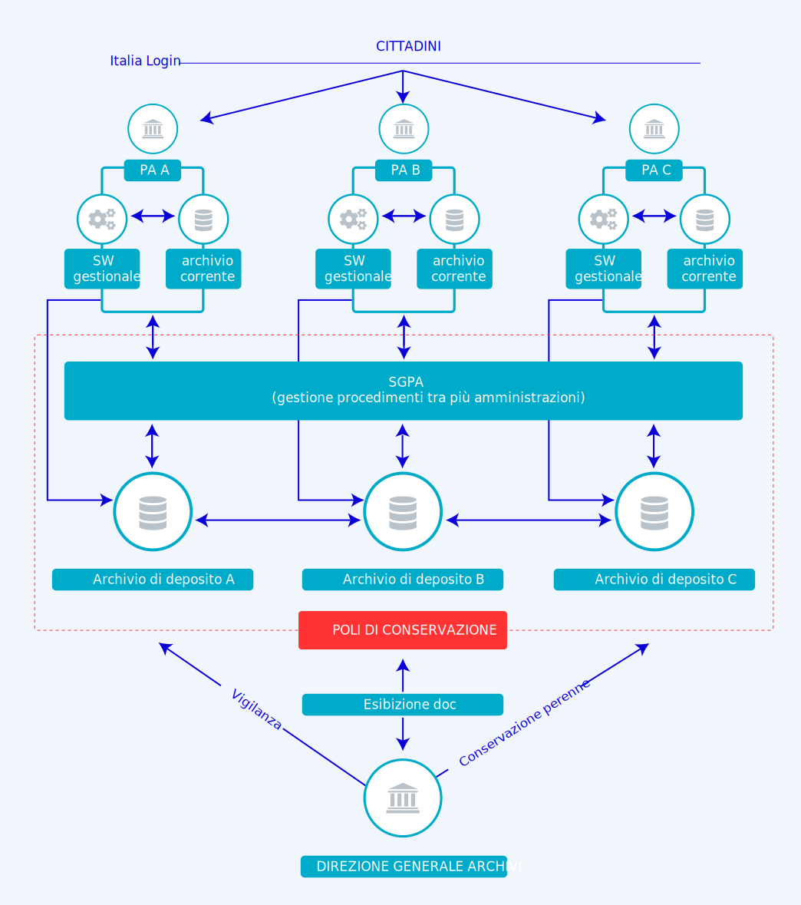

Piattaforme
===========

Le Piattaforme sono soluzioni che offrono funzionalità fondamentali, trasversali
e riusabili nella digitalizzazione dei procedimenti amministrativi delle PA,
uniformandone le modalità di erogazione. Esse sollevano le amministrazioni dalla
necessità di dover realizzare *ex novo* funzionalità, riducendo i tempi e i
costi di realizzazione dei servizi e garantendo maggiore sicurezza informatica.

In una visione funzionale alle scelte delle PA, le Piattaforme sono
suddivisibili nelle seguenti categorie:

- *process service*, l’insieme delle Piattaforme che realizzano digitalmente un
  processo completo (ad esempio l’approvvigionamento realizzato tramite gli
  strumenti di *Public e-procurement*) di cui le PA diventano utilizzatori;

- *task service*, che implementano singole funzionalità trasversali alla
  realizzazione di procedimenti amministrativi digitali (ad esempio
  l’autenticazione degli utenti attraverso SPID) che le PA integrano all’interno
  dei loro sistemi;

- *data service*, che assicurano l’accesso a fonti di dati validati (ad esempio
  l’utilizzo dei dati anagrafici assicurato da ANPR) di cui le PA necessitano
  per dare seguito alle proprie funzioni istituzionali.

Di seguito, in tabella 6.1, una possibile rappresentazione sintetica nella
quale:

- il **modello di implementazione** della Piattaforma indica se le
  funzionalità della stessa sono messe a disposizione da più soggetti (*multiple
  instances*) o da un unico soggetto (*single instance*);

- lo **stato** della Piattaforma indica se la stessa è:

  - disponibile (*available*) per essere utilizzata dalla PA;

  - conclusa la progettazione ed è in fase di implementazione
    (*implementation*);

  - nella fase di progettazione (*design*);

  - pianificata l’evoluzione (*evolution*) della soluzione attualmente
    disponibile.

.. table:: Rappresentazione sintetica del modello di implementazione e dello
           stato delle piattaforme
   :name: modello-stato-piattaforme

   +---------------------+----------------------------------------+------------------------------+------------------+
   | Categoria           | Piattaforma                            | Modello di implementazione   | Stato            |
   +=====================+========================================+==============================+==================+
   | **Process service** | Public e-procurement                   | multiple instances           | *implementation* |
   +                     +----------------------------------------+------------------------------+------------------+
   |                     | NoiPA                                  | single instance              | *evolution*      |
   +                     +----------------------------------------+------------------------------+------------------+
   |                     | SGPA - Sistema di Gestione             | single instance              | *design*         |
   |                     | Procedimenti Amministrativi nazionali  |                              |                  |
   +---------------------+----------------------------------------+------------------------------+------------------+
   | **Task service**    | pagoPA                                 | single instance              | *available*      |
   +                     +----------------------------------------+------------------------------+------------------+
   |                     | SPID                                   | single instance              | *available*      |
   +                     +----------------------------------------+------------------------------+------------------+
   |                     | CIE                                    | single instance              | *available*      |
   +                     +----------------------------------------+------------------------------+------------------+
   |                     | Poli di conservazione                  | multiple instances           | *implementation* |
   +---------------------+----------------------------------------+------------------------------+------------------+
   | **Data service**    | ANPR                                   | single instance              | *available*      |
   +                     +----------------------------------------+------------------------------+------------------+
   |                     | Siope e Siope+                         | single instance              | *evolution*      |
   +---------------------+----------------------------------------+------------------------------+------------------+

Attraverso l’utilizzo delle Piattaforme si favorisce l’attuazione di un modello
uniforme di interazione per i servizi realizzati dalla PA per i cittadini e le
imprese.

Gli obiettivi generali del Piano pertanto sono:

- completare la realizzazione delle Piattaforme abilitanti e favorirne
  l’adozione;

- far evolvere le Piattaforme abilitanti esistenti migliorandole o aggiungendo
  nuove funzionalità, adeguando costantemente la tecnologia utilizzata e il
  livello di sicurezza;

- individuare e realizzare eventuali nuove Piattaforme abilitanti che fungano da
  acceleratori per il processo di digitalizzazione della PA;

- definire il modello di dispiegamento che tenga conto dei differenti livelli
  istituzionali coinvolti (amministrazioni centrali, locali e altre PA) in modo
  da garantire la più ampia partecipazione e condivisione possibile per l’intero
  processo (*Multilevel Governance Deployment Model*).

AGID produce e manutiene l’elenco delle Piattaforme, considerando candidabili a
diventare Piattaforme abilitanti le soluzioni, nuove o esistenti, che
implementano funzionalità di base e trasversali per le pubbliche
amministrazioni.

AGID accompagna le PA destinatarie dei servizi di piattaforma nei loro processi
di dispiegamento e coinvolgimento dei soggetti destinatari finali dei servizi
digitali erogati dalle piattaforme stesse.

Le PA responsabili delle singole Piattaforme devono tener conto nella
pianificazione di aspetti quali:

- i costi di *set-up*, comprensivi di quelli per la realizzazione della
  Piattaforma e di quelli di migrazione e/o adeguamento sostenuti dalle PA che
  aderiscono alla Piattaforma;

- i costi a regime necessari ad assicurare il funzionamento della Piattaforma
  nel tempo;

- i costi di dispiegamento necessari per l’effettiva adozione delle piattaforme;

- i risparmi complessivi derivanti dall’adozione delle Piattaforme e le
  potenzialità introdotte dalle Piattaforme stesse in termini di nuovi servizi
  digitali da erogare verso cittadini, imprese e PA.

Le PA responsabili delle singole Piattaforme, devono garantire durante la
realizzazione e nella fase di esercizio:

- il coordinamento tra le varie iniziative, al fine di favorire la coerenza tra
  tutte le azioni;

- il monitoraggio di ciascun progetto al fine di valorizzare le esperienze
  maturate nelle precedenti iniziative;

- la coerenza della velocità di dispiegamento con l’effettivo livello di
  trasformazione digitale e la conseguente capacità delle singole
  amministrazioni di erogare servizi digitali;

- la conformità tecnica con il Modello di interoperabilità e gli adeguamenti
  evolutivi conseguenti al rilascio di nuove regole;

- la continuità operativa e i livelli di performance adeguati;

- la sicurezza del sistema.

**Tutte le altre PA** si devono attenere alle indicazioni riportate nel capitolo
13 “Indicazioni per le pubbliche amministrazioni” per quanto attiene le spese di
adeguamento e realizzazione di applicazioni che necessitano di funzionalità
offerte dalle Piattaforme abilitanti (ad es. il potenziamento di soluzioni di
pagamento digitale o di servizi di autenticazione).

Public e-procurement
--------------------

Il **sistema nazionale di public e-procurement** è finalizzato a digitalizzare
progressivamente l’intero processo di approvvigionamento di beni e servizi da
parte delle PA, in tutta la catena di valore, cioè dalle fasi di pianificazione
e programmazione dei fabbisogni fino al pagamento. Si tratta di un processo
molto complesso che vede coinvolti una pluralità di attori e di sistemi
informatici diversi, come rappresentato in figura 6.1.

         digitalizzazione degli acquisti. Il processo completo
         dell’approvvigionamento va dalla fase di raccolta dei fabbisogni fino
         alla fase di pagamento ed è suddiviso in tre macro fasi: preparazione,
         pre-aggiudicazione e post-aggiudicazione. In particolare, il Codice dei
         Contratti ha introdotto una sostanziale novità ovvero l’obbligatorietà
         dell’utilizzo di strumenti ICT nella fase di pre-aggiudicazione. L’art.
         44 del Codice, rubricato “Digitalizzazione delle procedure”prevede la
         pubblicazione di un Decreto Ministeriale in cui sono definite le
         modalità di digitalizzazione delle procedure di tutti i contratti
         pubblici. Per quanto riguarda la fase di post-aggiudicazione, si
         sottolinea come i documenti di business afferenti a questa fase
         (ordine, documento di trasporto e fattura) siano gestiti secondo le
         specifiche PEPPOL. Nello scenario complessivo del processo di
         approvvigionamento, il sistema delle banche dati attualmente descritte
         all’interno del Piano triennale, prevede l’interazione nelle varie
         fasi, principalmente con: BDNCP (Banca dati nazionale dei contratti
         pubblici gestita da ANAC), la BDOE (Banca dati degli operatori
         economici) gestita dal Ministero delle infrastrutture, NSO (Nodo di
         smistamento degli ordini) gestito da MEF – Dipartimento Ragioneria
         Generale dello Stato, e SDI (Sistema di interscambio) gestito
         dall’Agenzia delle Entrate. Inoltre, nel processo è previsto che per la
         facilitazione della presentazione delle gare transfrontaliere si
         utilizzi il registro online dei certificati eCertis (servizio messo a
         disposizione dalla Commissione europea) per il quale AGID ha lavorato
         in consorzio con altri partner per la sua integrazione con i
         sisteminazionali nell’ambito del progetto europeo IIeP. Ugualmente,
         secondo il Codice dei contratti, gli operatori presentano il documento
         di gara unico europeo (DGUE) che deve essere fornito esclusivamente in
         forma elettronica. AGID in consorzio con altri partner ha partecipato
         al progetto europeo ESPD per la definizione del formato strutturato XML
         del DGUE.

   Fasi del processo di acquisto e negoziazione

L’**architettura di riferimento del public e-procurement** che sottende il
processo di acquisto e negoziazione di beni e servizi della PA è costituita da
un insieme di regole di funzionamento, processi, standard tecnologici, modelli
semantici, banche dati e sistemi telematici che permetterà di gestire in
digitale l’intero processo di *procurement* delle pubbliche amministrazioni. Il
sistema è costituito da piattaforme di acquisto sia pubbliche che private, da
soggetti istituzionali che gestiscono servizi, piattaforme e banche dati
coinvolti nel processo di acquisto e negoziazione, registri pubblici nazionali
ecc. (si veda figura 6.2).

         si indica (a titolo esemplificativo e non esaustivo) lo scenario di
         cooperazione dei vari soggetti coinvolti nel processo di acquisto e
         negoziazione: i sistemi telematici di acquisto e negoziazione
         (piattaforme); gli operatori economici; i servizi, le piattaforme e le
         banche dati individuati dal Codice dei contratti; i registri pubblici
         nazionali; i soggetti aggregatori di dati e le stazioni appaltanti.
         Inoltre, questi soggetti sono tenuti all’applicazione delle regole
         tecniche emesse da AGID “Regole tecniche sull’interoperabilità per
         garantire il colloquio e la condivisione dei dati tra i sistemi
         telematici di acquisto e negoziazione”.

   Architettura del public e-procurement

Le **componenti** di cui si avvale il sistema sono:

- **ComproPA**: sistema di regole architetturali e di interoperabilità per
  l’interconnessione di tutti i sistemi telematici di acquisto e negoziazione.
  Si inserisce nella fase di pre-aggiudicazione del processo. Il Codice degli
  Appalti prevede infatti che le stazioni appaltanti debbano ricorrere a
  procedure di gara interamente gestite con sistemi telematici di acquisto e di
  negoziazione.

- **Banca Dati degli Operatori Economici (BDOE)**: istituita in base al decreto
  di cui all’articolo 81 del Codice, si inserisce all’interno dell’attività di
  aggiudicazione (fase di pre-aggiudicazione del processo di acquisto e
  negoziazione) come mezzo esclusivo per l’acquisizione dei documenti di
  comprova dei requisiti di gara. La BDOE ha i seguenti obiettivi:

  - semplificare il processo di verifica dei requisiti generali nelle fasi di
    verifica di comprova e di esecuzione del contratto da parte delle stazioni
    appaltanti;

  - consentire la richiesta dei documenti di interesse;

  - automatizzare il processo di ricezione dei documenti attestanti il possesso
    dei requisiti.

  La BDOE non è una vera e propria base dati, ma un orchestratore che opera in
  principio di cooperazione applicativa utilizzando i dati presenti nei registri
  nazionali messi a disposizione da: Agenzia delle Entrate, Unioncamere,
  Ministero della Giustizia, Ministero dell’Interno, ANAC, Ministero del Lavoro,
  INPS, INAIL, Casse Edili, Accredia, InarCassa e altre Casse professionali,
  CIPAG.

- **Nodo di smistamento degli ordini di acquisto delle amministrazioni pubbliche
  (NSO)**: finalizzato alla gestione elettronica degli ordini verso i fornitori
  della PA nella fase post-aggiudicazione del processo di acquisto e
  negoziazione. L’obiettivo generale del NSO è quello di creare, in maniera
  simile a quanto già realizzato per lo scambio delle fatture elettroniche
  attraverso il Sistema di Interscambio (SdI), un **nodo unico per la
  trasmissione degli ordini** [1]_ da parte delle stazioni appaltanti verso gli
  operatori economici. Il NSO permetterà di tenere traccia degli ordini
  effettuati dalle PA nella fase di esecuzione del contratto, contribuendo ad
  arricchire l’insieme dei dati raccolti dalla **Piattaforma dei Crediti
  Commerciali** (**PCC**) del MEF, con la finalità di monitorare l’intero ciclo
  di spesa della PA.

  .. [1] L’obbligo della gestione elettronica degli ordini verso i fornitori è
     sancito dalla Legge di bilancio 2018 articolo 1 commi 441, 412, 413, 414
     che prevede sia l’adozione di appositi regolamenti che disciplinano le
     modalità tecniche che le date di entrata in vigore per l’invio in forma
     elettronica della documentazione attestante l’ordinazione e l’esecuzione
     degli acquisti di beni e servizi.

  Il NSO è attualmente in fase di realizzazione, il primo stadio del progetto è
  focalizzato sul sistema sanitario pubblico che rappresenta uno dei maggiori
  capitoli della spesa pubblica.

- **Fatturazione elettronica:** rientra nella fase post-aggiudicazione del
  processo di acquisto e negoziazione. Prevede la standardizzazione del processo
  di emissione-trasmissione-ricevimento-gestione di documenti fiscali (fatture o
  note) verso la Pubblica Amministrazione ed è obbligatoria in Italia sin da
  marzo 2015 (il dei monitoraggio dei progetti di trasformazione digitale è
  disponibile nella sezione `Avanzamento trasformazione digitale
  <https://avanzamentodigitale.italia.it/it/progetto/fatturazione-elettronica>`__
  del sito AGID). La fattura elettronica è un documento in formato digitale XML
  (**FatturaPA**) trasmesso dal fornitore alla PA tramite il **Sistema di
  Interscambio delle Fatture Elettroniche** (**SdI**). La Direttiva europea
  55/2014, in via di recepimento, prevede l’obbligo per le PA di accettare e
  gestire le fatture elettroniche anche nel formato conforme alla norma europea
  sulla fatturazione elettronica a partire dal 18 aprile 2019. Ciò comporta
  un’evoluzione della piattaforma SdI (Sistema di Interscambio) per consentire
  il recepimento delle fatture elettroniche sia nel formato europeo che nel
  formato FatturaPA. Il Sistema di Interscambio consentirà inoltre di gestire la
  fatturazione elettronica tra privati a partire da gennaio 2019, come previsto
  dalla Legge n. 205/2017 articolo 1, comma 909 (modifica D.Lgs. N. 127/2015
  articolo 1, comma 3). In tale ottica e in previsione dei pagamenti verso la
  PA, verrà istituito un gruppo di lavoro per l’integrazione dei dati legati al
  pagamento tramite pagoPA all’interno del formato della fattura elettronica.

Scenario
~~~~~~~~

AGID sta lavorando, sia a livello nazionale che europeo, ad una serie di
attività che concorrono alla definizione di un quadro complessivo delle
procedure telematiche di acquisto e di negoziazione delle PA e delle banche dati
necessarie al funzionamento dei processi di *procurement*. In particolare,
nell’ambito dell’attività di un gruppo di lavoro in tema di procedure
telematiche di acquisto, è stato prodotto un documento di supporto per la
stesura del Decreto Ministeriale di cui all’articolo 44 del Codice dei Contratti
Pubblici per la definizione delle funzioni e dei flussi scambiati nell’ambito
delle procedure telematiche di acquisto e negoziazione.

A corredo del suddetto decreto dovranno essere redatte delle linee guida per
determinare le specifiche di interoperabilità e i requisiti di sicurezza delle
piattaforme di *e-procurement*. A supporto del completamento del processo di
*e-procurement* sono attivi inoltre alcuni progetti europei finanziati dal
programma CEF Telecom:

- **eIGOR – eInvoicing GO Regional**, che prevede l’adeguamento del processo
  nazionale di fatturazione elettronica verso la PA per l’adozione del
  formato di fatturazione elettronica europea;

- **IIeP – Italian Interoperable eProcurement**, che prevede l’integrazione del
  servizio eCertis (servizio messo a disposizione dalla Commissione europea, che
  raccoglie le equivalenze tra certificati e attestazioni degli Stati membri)
  con il sistema informativo di monitoraggio delle gare (SIMOG) presso ANAC e
  con le piattaforme di *e-procurement*;

- **ESPD – European Single Procurement Document**, che prevede la definizione
  del Documento di Gara Unico Europeo elettronico (eDGUE), documento di
  autodichiarazione dell’operatore economico, utilizzato come evidenza
  preliminare in una procedura di appalto pubblico anche da parte degli
  operatori transfrontalieri;

- **EeISI - European eInvoicing Standard in Italy**, evoluzione del progetto
  eIGOR, che prevede la piena adozione degli standard di fatturazione
  elettronica europea, di messaggistica e di *e-delivery* per lo scambio di dati
  e documenti tra le pubbliche amministrazioni e tra queste e le imprese e i
  cittadini, in una modalità interoperabile, sicura, affidabile e fidata.

Un processo così complesso richiede, per il suo corretto funzionamento, la
definizione di regole condivise e trasparenti nonché l’adozione di standard di
interoperabilità di dati e servizi che permettano l’interscambio e la
comunicazione tra sistemi e soluzioni diversificate. A tal fine gli schemi dei
dati adottati nell’ambito del processo di *public procurement* sono la diretta
applicazione della normativa Europea derivante dall’attività di
standardizzazione in materia di *e-procurement* nell’ambito del Comitato di
standardizzazione Europeo con particolare riferimento al CEN BII Workshop e al
CEN TC 440.

Tra le politiche europee per la creazione del Mercato Unico Digitale Europeo
rientrano anche le *Digital Services Infrastructures* (DSI) definite dalla
Commissione Europea. Le DSI sono dei componenti infrastrutturali messi a
disposizione dei paesi membri per costituire una rete interoperabile per lo
scambio di documenti in formato elettronico.

Tale paradigma è stato utilizzato per creare una rete europea, costituita da
infrastrutture e regole tecniche, per lo scambio di documenti legati al
*procurement* (*business document*): la rete PEPPOL (*Pan European Public
Procurement Online*). PEPPOL, che viene gestita dall’Associazione senza scopo di
lucro OpenPEPPOL, utilizza le regole definite in ambito CEN. AGID è la PEPPOL
*Authority* Italia da settembre 2016 che:

- governa le specificità nazionali dei profili PEPPOL;

- gestisce l’accreditamento dei *service provider* degli *Access Point* (AP) *o
  Service Metadata Publisher* (SMP) PEPPOL;

- monitora l’esercizio e le performance degli AP/SMP provider.

AGID partecipa ai tavoli CEN e OpenPEPPOL per garantire la convergenza degli
standard.

Obiettivi
~~~~~~~~~

- Sostenere una visione orientata principalmente alla trasparenza e alla
  semplificazione dell’intero processo di approvvigionamento pubblico;

- attuare il principio *once only* nel settore pubblico e ottimizzare la spesa
  pubblica complessiva;

- incentivare l’interoperabilità tra i sistemi delle pubbliche amministrazioni
  quale condizione necessaria per incrementare l’efficienza e l’efficacia dei
  servizi pubblici;

- favorire la diffusione di soluzioni innovative nella Pubblica Amministrazione,
  attraverso l’utilizzo di sistemi qualificati, anche in sussidiarietà o riuso;

- coinvolgere tutti i soggetti interessati nell’ambito del sistema di *public
  e-procurement* in reti dinamiche di collaborazione, per capitalizzare le
  esperienze maturate dai diversi soggetti e valorizzare le *best practice*;

- adeguare gli standard nazionali a quelli europei e favorire l’interoperabilità
  anche a livello transfrontaliero.

Linee di azione
~~~~~~~~~~~~~~~

.. _la28:

LA28 - Adeguamento/evoluzione delle piattaforme telematiche
^^^^^^^^^^^^^^^^^^^^^^^^^^^^^^^^^^^^^^^^^^^^^^^^^^^^^^^^^^^

**Tempi**
  In corso

**Attori**
  PA

**Descrizione**
  Le amministrazioni esercitano le proprie funzioni di stazione appaltante
  avvalendosi di sistemi telematici di acquisto e negoziazione (piattaforme
  telematiche). L’utilizzo di tali sistemi avviene nei seguenti termini:

  - utilizzo di una piattaforma già in possesso dell’amministrazione;

  - utilizzo di una piattaforma messa a disposizione da uno dei soggetti
    aggregatori e/o da Centrali di committenza;

  - riuso del software messo a disposizione da altre PA;

  - utilizzo di servizi per le piattaforme offerti in SaaS da operatori di
    mercato.

  Nella fase di adozione delle piattaforme telematiche di *e-procurement*,
  l’Agenzia fornirà supporto alle Regioni nello sviluppo di piattaforme che
  saranno messe a disposizione delle amministrazioni territoriali.

**Risultati**
  Le piattaforme dovranno adeguarsi alle regole tecniche del Decreto
  ministeriale di cui all’articolo 44 del Codice dei Contratti Pubblici (dalla
  data di pubblicazione del decreto attuativo).

**Aree di intervento**
  Nel breve e medio periodo, impatto sulle PA e sulle imprese fornitrici delle
  piattaforme.

.. _la29:

LA29 - Messa in esercizio della BDOE
^^^^^^^^^^^^^^^^^^^^^^^^^^^^^^^^^^^^

**Tempi**
  In corso

**Attori**
  MIT, AGID, ANAC e tutte la PA detentrici di registri pubblici nazionali (*Data
  Provider*), Stazioni appaltanti

**Descrizione**
  A seguito della messa in esercizio della BDOE da parte del MIT, saranno
  individuate le linee di intervento evolutive cui si dovranno adeguare le
  stazioni appaltanti per integrare le proprie piattaforme di acquisto alla
  BDOE.

**Risultati**
  La BDOE verrà messa in esercizio attraverso l’integrazione con le basi dati
  degli enti titolari dei registri pubblici (dalla data di pubblicazione del
  decreto attuativo).

**Aree di intervento**
  Nel breve periodo, impatto su PA e imprese.

.. _la30:

LA30 - Gestione elettronica degli ordini verso i fornitori
^^^^^^^^^^^^^^^^^^^^^^^^^^^^^^^^^^^^^^^^^^^^^^^^^^^^^^^^^^

**Tempi**
  Da ottobre 2019

**Attori**
  MEF – Dipartimento Ragioneria Generale dello Stato (RGS), AGID, Conferenza
  Stato Regioni, Ministero della Salute, Sogei, Aziende Sanitarie Pubbliche,
  Aziende fornitrici

**Descrizione**
  La Legge di Bilancio 2018 prevede - per gli enti del Sistema Sanitario
  Nazionale (SSN) - la trasmissione in forma elettronica dei documenti
  attestanti l’ordinazione e l’esecuzione degli acquisti di beni e servizi. La
  trasmissione è effettuata attraverso il Nodo di smistamento degli ordini.

**Risultati**
  RGS avvia e mette in esercizio il sistema di gestione (Nodo di smistamento
  degli ordini) come da Decreto attuativo ai sensi articolo 1 comma 414 della
  Legge 205/2017 (Legge di Bilancio 2018). Le PA adeguano i propri sistemi per
  emettere e trasmettere ordini elettronici attraverso NSO nel settore sanitario
  (da ottobre 2019).

**Aree di intervento**
  Nel breve periodo, impatto su aziende sanitarie e imprese del settore.

.. _la31:

LA31 - Gestione del formato europeo della Fattura Elettronica (EN)
^^^^^^^^^^^^^^^^^^^^^^^^^^^^^^^^^^^^^^^^^^^^^^^^^^^^^^^^^^^^^^^^^^

**Tempi**
  Da aprile 2019

**Attori**
  MEF, Agenzia delle Entrate, AGID, Sogei, Regioni ANCI

**Descrizione**
  Recepimento, da parte dell’Agenzia delle Entrate, della Direttiva europea
  2014/55 sulla fatturazione elettronica negli appalti pubblici che prevede
  l’obbligo da parte delle PA di accettare le fatture elettroniche anche in
  formato europeo.

**Risultati**
  Adeguamento del Sistema di Interscambio per gestire le fatture elettroniche in
  formato europeo prevedendo la possibile traduzione nel formato FatturaPA.

  Le amministrazioni centrali aggiornano i propri sistemi per la ricezione e
  conservazione delle fatture (da aprile 2019). Le amministrazioni locali
  aggiornano i propri sistemi per la ricezione e conservazione delle fatture (da
  aprile 2020).

**Aree di intervento**
  Nel breve periodo, impatto su amministrazioni centrali. Nel medio periodo,
  impatto su amministrazioni locali.

pagoPA
------

Scenario
~~~~~~~~

Il sistema dei pagamenti elettronici a favore della Pubblica Amministrazione,
pagoPA, garantisce agli utilizzatori finali (privati e aziende) di effettuare
pagamenti elettronici alla PA in modo sicuro e affidabile, semplice, in totale
trasparenza nei costi di commissione e in funzione delle proprie esigenze.

La piattaforma pagoPA è la piattaforma per la gestione del sistema dei pagamenti
pubblici.

L’introduzione della piattaforma pagoPA porta benefici per i cittadini, per la
Pubblica Amministrazione e per l’intero sistema Paese.

Benefici per i cittadini:

- trasparenza e minori costi;

- possibilità di usufruire dei servizi pubblici in maniera più immediata;

- semplificazione del processo di pagamento che consente di usufruire del
  maggior numero di canali e servizi possibili;

- standardizzazione dell’esperienza utente per i pagamenti verso la Pubblica
  Amministrazione;

- standardizzazione delle comunicazioni di avviso di pagamento, riconoscibile su
  tutto il territorio nazionale.

Benefici per la Pubblica Amministrazione:

- riduzione dei tempi di incasso attraverso l’accredito delle somme direttamente
  sui conti dell’Ente Beneficiario entro il giorno successivo al pagamento;

- riduzione dei costi di gestione del contante;

- miglioramento dell’efficienza della gestione degli incassi attraverso la
  riconciliazione automatica;

- superamento della necessità bandire gare per l’acquisizione di servizi di
  incasso, con conseguenti riduzioni di inefficienze e costi di commissione
  fuori mercato;

- riduzione dei costi e tempi di sviluppo delle applicazioni online (riuso
  soluzioni);

- eliminazione della necessità di molteplici accordi di riscossione;

- maggiori controlli automatici per evitare i doppi pagamenti e le conseguenti
  procedure di rimborso.

Benefici per il Sistema Paese:

- completa aderenza agli standard della direttiva PSD2 [2]_;

- incentivazione dell’utilizzo dei pagamenti elettronici a livello nazionale
  attraverso l’utilizzo con le transazioni verso la Pubblica Amministrazione,
  che consente di stimolare il mercato e favorire, a tendere, una maggiore
  concorrenza nel mercato dei servizi di pagamento e un livellamento delle
  commissioni.

.. [2] Direttiva 2015/2366/(UE) sui servizi di pagamento nel mercato interno.

Il Sistema pagoPA è stato realizzato dall’Agenzia per l’Italia Digitale in
attuazione dell’articolo 5 del CAD, il quale precisa che “*al fine di dare
attuazione a quanto disposto dall’articolo 5, l’Agenzia per l’Italia Digitale
(già DigitPA) mette a disposizione, attraverso il Sistema pubblico di
connettività, una piattaforma tecnologica per l’interconnessione e
l’interoperabilità tra le pubbliche amministrazioni e i prestatori di servizi di
pagamento abilitati, al fine di assicurare, attraverso strumenti condivisi di
riconoscimento unificati, l’autenticazione certa dei soggetti interessati
all’operazione in tutta la gestione del processo di pagamento*”[3]_.

.. [3] D.Lgs. n. 82/2005 e successive modificazioni.

IL CAD inoltre ha affidato ad AGID, sentita la Banca d’Italia, il compito di
definire le Linee guida per la specifica delle modalità tecniche e operative per
l’esecuzione dei pagamenti elettronici e introdotto, all’articolo 15, comma 5
bis, del D.L. n. 179/2012, l’obbligatorietà dell’uso di una piattaforma
tecnologica messa a disposizione dall’Agenzia per l’Italia Digitale per le
pubbliche amministrazioni e i gestori di pubblico servizio.

Dal 14 dicembre 2018 con il Decreto Legge n. 135 Disposizioni urgenti in materia
di sostegno e semplificazione per le imprese e per la pubblica amministrazione,
“*la gestione della piattaforma di cui all’articolo 5, comma 2, del decreto
legislativo 7 marzo 2005, n. 82, nonché i compiti, relativi a tale piattaforma,
svolti dall’Agenzia per l’Italia digitale, sono trasferiti alla Presidenza del
Consiglio dei Ministri che a tal fine si avvale, se nominato, del Commissario
straordinario di cui all’articolo 63, comma 1, del decreto legislativo 26 agosto
2016, n. 179*”. Inoltre, per lo svolgimento di queste attività e per dare
impulso alla diffusione della piattaforma, viene disposta la creazione di una
società per azioni partecipata dallo Stato ai sensi dell’articolo 9 del decreto
legislativo n. 175  del 19 agosto 2016. All’interno della norma viene prorogata
al 31 dicembre del 2019 la data di scadenza prevista dall’articolo 65, comma 2,
del Decreto legislativo n. 217 del 13 dicembre 2017 che stabiliva “*l’obbligo
per i prestatori di servizi di pagamento abilitati di utilizzare esclusivamente
la piattaforma di cui all’articolo 5, comma 2, del decreto legislativo n. 82 del
2005 per i pagamenti verso le pubbliche amministrazioni*”.

Il perimetro soggettivo di applicazione dell’obbligo di adesione a pagoPA è
stato nel tempo ampliato dal legislatore nazionale [4]_.

.. [4] Dapprima con la modifica al CAD di cui al D. Lgs. n. 179/2016 (G.U. n.
   214 del 13.9.2016) e, successivamente, con il correttivo al CAD di cui al D.
   Lgs. n. 217/2017 (G.U. n. 9 del 12.01.2018). Fatta tale precisazione, appare
   opportuno segnalare che per identificare i soggetti obbligati ad aderire al
   Sistema pagoPA è necessario fare riferimento, sia all’articolo 5 del CAD, sia
   all’articolo 15, comma 5bis, del D.L. 179/2012, come convertito in legge,
   poiché tale secondo articolo stabilisce che le pubbliche amministrazioni (per
   la cui nozione si rinvia alla circolare interpretativa n. 1 del 9 marzo 2015
   del Ministero dell’Economia e delle Finanze e della Presidenza del Consiglio
   dei Ministri emessa per l’ambito applicativo soggettivo della fatturazione
   elettronica), sono obbligate ad aderire alla piattaforma dei pagamenti.
   L’adesione resta, al pari, obbligatoria per i soggetti di cui all’articolo 2
   del CAD che stabilisce, appunto, l’ambito soggettivo di applicazione
   dell’articolo 5 del CAD e che obbliga all’adesione a pagoPA anche i gestori
   di pubblici servizi e le società a controllo pubblico, come definite nel
   decreto legislativo adottato in attuazione dell’articolo 18 della legge n.
   124 del 2015, escluse le società quotate.

La piattaforma tecnologica di pagoPA è attiva e funzionante dal 2012 mentre
l’obbligo dei soggetti sottoposti all’applicazione del CAD di consentire agli
utenti (cittadini, imprese e professionisti) di eseguire con mezzi elettronici
il pagamento di quanto a qualsiasi titolo dovuto alla Pubblica Amministrazione è
in vigore dal 1° giugno 2013.

In aggiunta, sulla base dell’articolo 8 del decreto legge n. 135 del 14/12/2018,
a partire dal 31/12/2019, prestatori abilitati a offrire servizi di pagamento ai
sensi della PSD2 non potranno in alcun modo eseguire pagamenti che non
transitino per il sistema pagoPA e che abbiano come beneficiario un soggetto
pubblico obbligato all’adesione allo stesso sistema, ad eccezione dei soli
servizi quali:

- la Delega unica F24 (c.d. modello F24) e il Sepa Direct Debit (SDD), sino alla
  loro integrazione con il sistema pagoPA;

- eventuali altri servizi di pagamento non ancora integrati con il sistema
  pagoPA e che non risultino sostituibili con quelli da esso erogati purché una
  specifica previsione di legge ne imponga la messa a disposizione dell’utenza
  per l’esecuzione del pagamento;

- i pagamenti eseguiti per cassa, presso il soggetto che per tale ente svolge il
  servizio di tesoreria o di cassa.

Dall’avvio in produzione del sistema nel 2012, particolare cura è stata dedicata
al miglioramento dell’esperienza utente, soprattutto con l’introduzione di nuove
funzionalità centralizzate che consentono di semplificare il pagamento nel
rispetto delle norme imposte dalla PSD2 e della *Payment Card Industry
Compliance*.

È stato inoltre sviluppato, ed è a disposizione delle pubbliche amministrazioni,
un kit di sviluppo software (SDK - *Software Development Kit*) di semplice
utilizzo per realizzare applicazioni mobili integrate con pagoPA.

Per promuovere l’attivazione di nuovi servizi, sono stati costituiti dei tavoli
permanenti con alcune rilevanti amministrazioni, con gli intermediari regionali
e con alcuni partner tecnologici di particolare rilievo.

Lo stato di avanzamento del livello di adozione della piattaforma è consultabile
nella sezione `Avanzamento trasformazione digitale
<https://avanzamentodigitale.italia.it/it/progetto/pagopa>`__ del sito
dell’Agenzia per l’Italia Digitale.

Obiettivi
~~~~~~~~~

Gli obiettivi nel breve periodo sono:

- elevare il livello di adozione di pagoPA, sia in termini di pubbliche
  amministrazioni aderenti che in termini di servizi attivati, aumentando la
  consapevolezza per le pubbliche amministrazioni che pagoPA è lo strumento
  esclusivo di incasso ed evidenziare i benefici per cittadini e PA;

- comunicare con chiarezza quali sono i soggetti tenuti ad aderire e ad attivare
  servizi su pagoPA;

- monitorare i livelli di servizio degli aderenti al sistema pagoPA allo scopo
  di verificare il rispetto dei valori di soglia attesi per gli indicatori di
  qualità;

- individuare azioni di accompagnamento delle amministrazioni per l’adesione al
  sistema pagoPA;

- continuare ad evolvere i componenti tecnologici del sistema per consentire
  l’implementazione di nuove funzionalità nell’ottica di miglioramento continuo
  della esperienza utente e della scalabilità della piattaforma.

Gli obiettivi di medio/lungo periodo sono:

- incentivare l’integrazione di pagoPA nei processi *end-to-end* della Pubblica
  Amministrazione;

- effettuare una revisione architetturale della piattaforma alla luce delle
  nuove tecnologie.

Linee di azione
~~~~~~~~~~~~~~~

.. _la32:

LA32 - Evoluzione tecnologica della piattaforma
^^^^^^^^^^^^^^^^^^^^^^^^^^^^^^^^^^^^^^^^^^^^^^^

**Tempi**
  In corso

**Attori**
  AGID, Team per la trasformazione digitale e Banca d’Italia

**Descrizione**
  Continuo adeguamento tecnologico della piattaforma agli standard dei servizi
  di pagamento previsti dagli standard europei e internazionali in
  collaborazione e attraverso il coordinamento di Banca d’Italia per ottenere un
  miglioramento continuo dell’esperienza dei cittadini, delle pubbliche
  amministrazioni e dei Prestatori di Servizi di Pagamento.

**Risultati**
  Nuova versione *back end* di pagoPA (giugno 2019).

**Aree di intervento**
  Nel breve periodo impatto, su PA e prestatori di servizi di pagamento.

.. _la33:

LA33 - Completamento dell’adesione alla piattaforma
^^^^^^^^^^^^^^^^^^^^^^^^^^^^^^^^^^^^^^^^^^^^^^^^^^^

**Tempi**
  In corso

**Attori**
  AGID, Team per la trasformazione digitale, soggetti obbligati ad aderire

**Descrizione**
  Completamento dell’attivazione dei servizi da parte di tutti i soggetti
  obbligati all’adesione alla piattaforma dei pagamenti entro i termini previsti
  dal CAD.

  AGID, in collaborazione con le Regioni, svolge attività sul territorio
  indirizzate alla sensibilizzazione dei soggetti obbligati ad aderire, al fine
  di sostenere la risoluzione delle problematiche bloccanti per l’adesione alla
  piattaforma. Sono forniti strumenti informatici e documentazione tecnica per
  favorire l’integrazione con pagoPA e ambienti di test a supporto degli
  sviluppatori; AGID e Team per la trasformazione digitale pubblicano i dati
  sull’evoluzione dell’adesione.

**Risultati**
  I soggetti obbligati ad aderire attivano i servizi nei tempi previsti dal CAD
  (dicembre 2019).

**Aree di intervento**
  Nel breve periodo, impatto su PA e prestatori di servizi di pagamento.

.. _la34:

LA34 - Monitoraggio tecnico e dell’attivazione dei servizi
^^^^^^^^^^^^^^^^^^^^^^^^^^^^^^^^^^^^^^^^^^^^^^^^^^^^^^^^^^

**Tempi**
  In corso

**Attori**
  AGID, Team per la trasformazione digitale, soggetti obbligati ad aderire,
  Prestatori di Servizi di Pagamento aderenti

**Descrizione**
  AGID effettua sia il monitoraggio continuo dello stato di avanzamento
  dell’attivazione dei servizi da parte dei soggetti obbligati ad aderire a
  pagoPA, sia il monitoraggio continuo delle performance del sistema e
  dell’efficacia delle procedure operative, rispetto ad indicatori di qualità
  definiti. Rileva la presenza di problemi, individua le soluzioni e mette in
  atto azioni di accompagnamento.

**Risultati**
  Aumento dei transati a partire dagli attuali 13 milioni, da gennaio 2019, a
  circa 30 milioni. (dicembre 2019).

**Aree di intervento**
  Nel breve periodo, impatto su PA e cittadini.

Siope+
------

Scenario
~~~~~~~~

SIOPE è il **Sistema Informativo sulle Operazioni degli Enti Pubblici** per la
rilevazione degli incassi e dei pagamenti effettuati dai tesorieri di tutte le
amministrazioni pubbliche. È uno strumento fondamentale per il monitoraggio dei
conti pubblici, attraverso la rilevazione in tempo reale del fabbisogno delle
amministrazioni pubbliche e l’acquisizione delle informazioni necessarie ad una
puntuale predisposizione delle statistiche trimestrali di contabilità nazionale,
ai fini della verifica delle regole previste dall’ordinamento comunitario
(procedura su disavanzi eccessivi e Patto di stabilità e crescita).

SIOPE+ è una delle piattaforme che gestiscono il complesso sistema degli incassi
e dei pagamenti della Pubblica Amministrazione, illustrato in figura 6.3 In
particolare SIOPE+ intermedia il flusso degli Ordinativi di Incasso e Pagamento
(OPI) tra le pubbliche amministrazioni e le relative banche tesoriere, e
alimenta altre piattaforme (PCC, BDAP, SIOPE, SOLDIPUBBLICI, ecc.)

         sistema degli incassi e dei pagamenti della PA: 1. I fornitori emettono
         una fattura elettronica e la inviano al Sistema di Interscambio,
         denominato “FatturaPA”, che la inoltra alla Pubblica Amministrazione
         committente per la liquidazione, e alimenta la Piattaforma per i
         Crediti Commerciali; 2. Cittadini e imprese eseguono pagamenti mediante
         il sistema pagoPA e tramite il soggetto prestatore dei servizi di
         pagamento che giornalmente accredita gli incassi ricevuti alla Banca
         Tesoriera; 3. La Pubblica Amministrazione invia gli ordinativi di
         incasso e pagamento (OPI) alla Banca Tesoriera, tramite la piattaforma
         SIOPE+, per la loro esecuzione; 4. La Banca Tesoriera esegue gli OPI e
         trasmette gli esiti applicativi e il giornale di cassa alla Pubblica
         Amministrazione tramite la piattaforma SIOPE+; 5. La piattaforma SIOPE+
         aggiorna la piattaforma dei Crediti Commerciali e la Banca Dati SIOPE.
         Quest’ultima alimenta il portale opendata soldipubblici.gov.it.

   Sistema di pagamenti e incassi della Pubblica Amministrazione

SIOPE+ consente la completa dematerializzazione degli incassi e dei pagamenti,
migliora la qualità dei servizi di tesoreria, favorisce l’eliminazione di
eccessive personalizzazioni nel rapporto ente – tesoriere e rende meno onerosa
per le banche l’erogazione di tali servizi e più contendibile il relativo
mercato. SIOPE+ è la piattaforma che sostituirà SIOPE, una volta completato il
suo processo di diffusione presso tutte le amministrazioni. L’attivazione di
SIOPE+ è regolata e scandita da appositi decreti del Ministero dell’Economia e
delle Finanze che, gradualmente, estenderanno i nuovi adempimenti a tutte le
amministrazioni pubbliche.

La principale finalità di SIOPE+ è di migliorare il monitoraggio dei tempi di
pagamento dei debiti commerciali delle amministrazioni pubbliche attraverso
l’integrazione delle informazioni rilevate con quelle delle fatture passive
registrate dalla Piattaforma elettronica (PCC) e, in prospettiva, di seguire
l’intero ciclo delle entrate e delle spese.

SIOPE+ consente di acquisire informazioni “in automatico”, liberando così gli
enti dall’obbligo di provvedere alla trasmissione alla Piattaforma elettronica
PCC di dati riguardanti il pagamento delle fatture, che costituisce la
principale criticità dell’attuale sistema di monitoraggio dei debiti commerciali
e dei relativi tempi di pagamento.

Il progetto sta procedendo in linea con le previsioni e, man mano che i singoli
Enti andranno a regime, i tesorieri e i cassieri potranno accettare solo ordini
di pagamento e incasso secondo lo standard OPI, trasmessi attraverso il nodo dei
pagamenti SIOPE+.

SIOPE+ è una iniziativa governata dal Ministero Economia e Finanze gestita
sull’infrastruttura IT da Banca d’Italia secondo gli standard e le regole
tecniche emanate da AGID.

Obiettivi
~~~~~~~~~

- Ordinare incassi e pagamenti al proprio tesoriere o cassiere utilizzando
  esclusivamente ordinativi informatici emessi secondo lo standard definito da
  AGID;

- trasmettere gli ordinativi informatici al tesoriere o cassiere solo ed
  esclusivamente per il tramite dell’infrastruttura SIOPE+ gestita dalla Banca
  d’Italia.

Linee di azione
~~~~~~~~~~~~~~~

.. _la35:

LA35 - Dispiegamento del sistema SIOPE+
^^^^^^^^^^^^^^^^^^^^^^^^^^^^^^^^^^^^^^^

**Tempi**
  In corso

**Attori**
  Ragioneria Generale dello Stato, Banca d’Italia, AGID e PA

**Descrizione**
  A fronte della conclusione delle fasi di sperimentazione, chiuse nel 2017, il
  sistema è andato a regime nel 2018 per tutti i Comuni, le Regioni, le ASL e le
  Aziende ospedaliere. Da gennaio 2019 entrano in SIOPE+ anche le Università,
  Enti di Ricerca, Autorità Portuali, Enti Parco e, con successivi decreti,
  verranno individuati gli ulteriori enti (scuole, istituti di formazione,
  ecc.).

  AGID emette le regole tecniche per la gestione dei documenti informatici
  relativi agli ordinativi di incasso e pagamento e le Linee guida intese come
  vademecum per l’adozione delle regole tecniche stesse, secondo un piano di
  attività che prevede un aggiornamento periodico degli standard OPI.

**Risultati**
  AGID emette nuove versioni delle regole tecniche OPI e delle Linee guida
  (luglio 2019).

  MEF-RGS fornisce supporto alle amministrazioni per l’adesione al sistema e per
  l’estensione ad altri Enti pubblici (da gennaio 2019).

  Banca d’Italia gestisce l’infrastruttura IT del sistema (da gennaio 2019).

**Aree di intervento**
  Nel breve periodo, impatto sulle PA.

.. _la36:

LA36 - Revisione della piattaforma open data Soldipubblici
^^^^^^^^^^^^^^^^^^^^^^^^^^^^^^^^^^^^^^^^^^^^^^^^^^^^^^^^^^

**Tempi**
  Da giugno 2019

**Attori**
  Ragioneria Generale dello Stato, Banca d’Italia, AGID e PA

**Descrizione**
  `Soldipubblici <http://soldipubblici.gov.it/it/home>`__ è una piattaforma
  *open data* che rende facilmente accessibili ai cittadini i dati dei pagamenti
  della Pubblica Amministrazione. Fino ad oggi l’obiettivo è stato quello di
  garantire la piena trasparenza e permettere sia ai cittadini che alle stesse
  pubbliche amministrazioni l’analisi e il monitoraggio costante delle spese.

  L’ipotesi di revisione prevede un’evoluzione del ruolo di Soldipubblici verso
  uno strumento, *wizard like*, di aggregazione e visualizzazione di dati ed
  informazioni di previsione, di entrata e di spesa. I dati dei pagamenti della
  PA sono estratti dalle banche dati del sistema informativo SIOPE, il quale
  alimenta anche la Banca Dati delle Amministrazioni Pubbliche (BDAP) che, oltre
  ai dati di incasso e pagamento ha anche molte altre informazioni, previsionali
  e di consuntivo, di natura economico-finanziaria. Esistono poi tutti i
  cataloghi *open data*, in larga parte federati da dati.gov.it, che le
  amministrazioni, sia centrali che locali, hanno prodotto e alimentano
  costantemente. Tutte le fonti di dati possono dare un contributo alla
  costruzione di una informazione strutturata e multilivello di cui
  Soldipubblici potrebbe essere lo strumento di visualizzazione evoluta.

  Gli attori effettuano la revisione della piattaforma integrandola con
  ulteriori servizi di estrazione dati (ad es. per territorio, per categoria di
  ente, per voce di bilancio ecc.)

**Risultati**
  Piattaforma Soldipubblici aggiornata (dicembre 2019).

**Aree di intervento**
  Nel breve periodo, impatto su PA; nel medio periodo, impatto su cittadini e
  imprese.

NoiPA
-----

Scenario
~~~~~~~~

NoiPA è la piattaforma integrata per la gestione dei servizi stipendiali del
personale della Pubblica Amministrazione appartenente ai vari comparti di
contrattazione pubblica tra cui Ministeri, Scuola, Enti locali e Sanità, Forze
di Polizia e Forze Armate. Attraverso tale piattaforma sono erogati, in coerenza
con la normativa vigente, i seguenti servizi:

- elaborazione dei dati giuridico-economici;

- elaborazione e quadratura della rilevazione delle presenze/assenze;

- produzione e distribuzione del cedolino mensile.

Sono erogati altresì ulteriori servizi a favore degli enti creditori per conto
dei quali vengono operate le ritenute mensili sullo stipendio e garantiti i
relativi versamenti.

A partire da gennaio 2018 è già operativa la piattaforma cloud, in termini di
componenti infrastrutturali e prodotti software, sulla quale il nuovo sistema
sarà reso disponibile e fruibile alle amministrazioni, abilitando e
semplificando inoltre l’*onboarding* delle amministrazioni.

È prevista l’evoluzione dell’attuale sistema di gestione del personale NoiPA che
eroga servizi stipendiali alle PA, a cui saranno aggiunte funzionalità per la
gestione dei componenti non economici del personale, anche a supporto della
recente riforma della PA (Legge n. 124/2015 recante “Deleghe al Governo in
materia di riorganizzazione delle amministrazioni pubbliche”). È prevista la
realizzazione di componenti specifici per di valorizzare il patrimonio
informativo gestito, integrando informazioni e servizi erogati da altri
*stakeholder* istituzionali.

Obiettivi
~~~~~~~~~

- Completare la realizzazione del sistema NoiPA, anche integrandolo con le altre
  Piattaforme abilitanti, e favorirne l’adozione da parte di tutte le
  amministrazioni pubbliche;

- rendere fruibile agli *stakeholder*, con gli opportuni livelli di visibilità e
  accessibilità, un patrimonio informativo strutturato e integrato concernente
  tutti i dipendenti pubblici.

Linee di azione
~~~~~~~~~~~~~~~

.. _la37:

LA37 - Evoluzione del sistema NoiPA e valorizzazione del patrimonio informativo gestito
^^^^^^^^^^^^^^^^^^^^^^^^^^^^^^^^^^^^^^^^^^^^^^^^^^^^^^^^^^^^^^^^^^^^^^^^^^^^^^^^^^^^^^^

**Tempi**
  In corso

**Attori**
  MEF, AGID e PA Centrali e Locali, Dipartimento della Funzione Pubblica, INPS

**Descrizione**
  Le attività previste sono:

  - realizzare il nuovo sistema di gestione del personale pubblico a copertura
    di tutti i processi amministrativi di gestione del personale (servizi
    anagrafici, servizi integrati stipendiali, servizi di rilevazione presenze,
    servizi giuridici);

  - realizzare e rilasciare componenti aggiuntivi collegati a esigenze di
    valutazione e sviluppo del personale pubblico;

  - realizzare la base dati del personale della PA;

  - valorizzare il patrimonio informativo gestito attraverso l’implementazione
    di componenti specifici per abilitare l’integrazione con informazioni e
    servizi di altri *stakeholder* istituzionali coinvolti nei processi di
    gestione del personale pubblico.

  Le amministrazioni non ancora aderenti al sistema potranno procedere a
  comunicare entro il 2019 la propria adesione per successivamente migrare ed
  adottare il sistema NoiPA, secondo la programmazione concordata con il MEF.

**Risultati**
  Completamento del nuovo sistema NoiPA (data di rilascio: dicembre 2020).

  Richiesta di adesioni delle PA (entro il 2019).

  Avvio dell’erogazione del servizio (giugno 2019).

  Abilitazione della condivisione del patrimonio informativo gestito (giugno
  2019).

**Aree di intervento**
  Nel breve periodo, impatto sulle PA e *stakeholder* istituzionali coinvolti.

SPID
----

Scenario
~~~~~~~~

SPID, Sistema Pubblico di Identità Digitale, è la soluzione che permette di
accedere a tutti i servizi online della Pubblica Amministrazione con un’unica
identità digitale. È previsto, con Determinazione AGID n.366/2017 “Convenzione
*Service Provider* Privati”, che possano aderire a SPID anche soggetti privati
che intendano avvalersi dell’identità certificata.

Attraverso credenziali classificate su tre livelli di sicurezza, SPID abilita ad
accedere ai servizi della Pubblica Amministrazione e dei privati che aderiranno,
fornendo dati identificativi certificati.

SPID è costituito da un insieme aperto di soggetti pubblici e privati che,
previo accreditamento da parte di AGID, gestiscono i servizi di registrazione e
di messa a disposizione delle credenziali e degli strumenti di accesso in rete,
nei riguardi di cittadini e imprese. Attualmente gli `identity provider
<https://www.agid.gov.it/it/piattaforme/spid/identity-provider-accreditati>`__
(gestori di identità) accreditati sono nove, uno dei quali accreditato nel 2018.

Nel corso dell’ultimo biennio, AGID ha fornito supporto alle PA nelle attività
di interfacciamento dei loro sistemi con SPID. Attualmente il numero di *Service
Provider*, ovvero pubbliche amministrazioni che permettono di accedere ai propri
servizi con SPID, è pari a circa 4.000. Per favorire l’adesione al sistema SPID,
sono state definite convenzioni che prevedono l’adesione dei cosiddetti
“soggetti aggregatori”, intesi come soggetti che offrono alle amministrazioni
aggregate la possibilità di rendere accessibili tramite SPID i propri servizi
online.

L’Agenzia ha, inoltre, svolto attività di divulgazione e informazione nei
confronti di cittadini e utenti per favorirne l’adesione a SPID, fornendo loro
supporto nelle attività di accesso al sistema. I cittadini che hanno acquisito
un’identità digitale sono pari a più di tre milioni, numero in crescita
progressiva, aggiornato nella sezione `Avanzamento trasformazione digitale
<https://avanzamentodigitale.italia.it/it/progetto/spid>`__ del sito
dell’Agenzia per l’Italia Digitale.

A seguito del completamento della procedura di notifica dello SPID, ultimato
dall’Agenzia con la pubblicazione nella Gazzetta Ufficiale dell’Unione Europea
(`GUUE C318
<https://www.agid.gov.it/sites/default/files/repository_files/10_settembre_2018_c318_ita.pdf>`__
e `GUUE C344
<https://eur-lex.europa.eu/legal-content/EN/TXT/?toc=OJ%3AC%3A2018%3A344%3ATOC&uri=uriserv%3AOJ.C_.2018.344.01.0011.01.ENG>`__
del 2018), a partire dal 10 settembre 2019 l’identità digitale SPID potrà essere
usata per l’accesso ai servizi in rete di tutte le pubbliche amministrazioni
dell’Unione.

Obiettivi
~~~~~~~~~

- Evolvere il sistema per consentire la sostenibilità economica e favorire
  l’integrazione anche con soggetti, non pubblici, fornitori di servizi;

- massimizzare il recupero di identità pregresse delle PA per favorire lo
  *switch off* a favore di SPID dei sistemi di autenticazione;

- avviare le *Attribute authority* (fornitori di attributi qualificati);

- consolidare il sistema di controlli integrati attraverso SCIPAFI (banche dati
  per la prevenzione delle frodi nel settore del credito al consumo e del furto
  d’identità);

- aggiornare le regole tecniche SPID;

- automatizzare i processi per le verifiche di interoperabilità e di messa in
  esercizio dei fornitori di servizio.

Linee di azione
~~~~~~~~~~~~~~~

.. _la38:

LA38 - Linee Guida SPID
^^^^^^^^^^^^^^^^^^^^^^^

**Tempi**
  In corso

**Attori**
  AGID

**Descrizione**
  Al fine di favorire l’avvio dell’iter per l’emanazione ai sensi dell’art 71
  del CAD, AGID predispone e pubblica in consultazione Linee guida relative ai
  seguenti argomenti:

  - identità digitali per uso professionale;

  - *user experience*;

  - firma ex articolo 20 del Codice dell’amministrazione digitale;

  - adesione delle *Attribute authority*;

  - *OpenID Connect*.

  A chiusura della fase di consultazione, le linee guida seguiranno le modalità
  di emanazione previste dall’articolo 71 comma 1 del CAD.

**Risultati**
  Linee guida per il rilascio delle identità digitali per uso professionale
  (giugno 2019).

  Linee guida *user experience* (giugno 2019).

  Linee guida per l’implementazione di sistemi per la firma ex articolo 20 del
  Codice dell’amministrazione digitale attraverso SPID (giugno 2019).

  Linee guida per l’adesione in SPID delle *Attribute authority* in qualità di
  gestori di attributi qualificati (giugno 2019).

  Linee guida *OpenID connect* (giugno 2019).

**Aree di intervento**
  Nel breve periodo, impatto sulle PA e sulle imprese (*identity provider* e
  *service provider* privati).

.. _la39:

LA39 - Attività a seguito della notifica di SPID alla Commissione Europea
^^^^^^^^^^^^^^^^^^^^^^^^^^^^^^^^^^^^^^^^^^^^^^^^^^^^^^^^^^^^^^^^^^^^^^^^^

**Tempi**
  In corso

**Attori**
  AGID, Commissione Europea, Stati membri, PA

**Descrizione**
  Riconoscimento del sistema di identificazione elettronica SPID da parte degli
  altri Stati membri e possibilità di utilizzo per l’accesso ai servizi in rete
  della PA.

**Risultati**
  SPID è abilitato all’uso per l’accesso ai servizi online delle PA all’interno
  dell’Unione Europea (ottobre 2019).

**Aree di intervento**
  Nel breve periodo, impatto sulle PA degli Stati membri e sui cittadini.

.. _la40:

LA40 - Integrazione con le identità digitali a livello europeo
^^^^^^^^^^^^^^^^^^^^^^^^^^^^^^^^^^^^^^^^^^^^^^^^^^^^^^^^^^^^^^

**Tempi**
  In corso

**Attori**
  AGID

**Descrizione**
  Le identità digitali, notificate ai sensi del regolamento eIDAS, consentiranno
  di accedere ai servizi offerti da tutti gli Stati membri dell’Unione Europea.
  Attraverso il progetto FICEP è in via di completamento il primo “server
  trasfrontaliero italiano” che consente circolarità delle identità digitali.

**Risultati**
  Messa in esercizio del nodo FICEP.

  Primo report sull’*onboarding* delle pubbliche amministrazioni e dei privati
  (entro dicembre 2019).

**Aree di intervento**
  Nel breve periodo, impatto sulle PA europee e sui cittadini.

.. _la41:

LA41 - Analisi diffusione di SPID ai fini dello switch-off
^^^^^^^^^^^^^^^^^^^^^^^^^^^^^^^^^^^^^^^^^^^^^^^^^^^^^^^^^^

**Tempi**
  In corso

**Attori**
  AGID

**Descrizione**
  AGID sviluppa uno studio sulla stabilità del sistema SPID ai fini del suo
  utilizzo esclusivo quale sistema di identificazione ai servizi online, ai
  sensi dell’articolo 64 del CAD.

**Risultati**
  Pubblicazione studio relativo alla stabilità di SPID ai fini dello
  *switch-off* (ottobre 2019).

**Aree di intervento**
  Nel breve periodo, impatto sulle PA.

Carta d’identità elettronica
----------------------------

Scenario
~~~~~~~~

La Carta d’identità elettronica (CIE) è l’evoluzione digitale del documento di
identità in versione cartacea: consente di comprovare in modo certo l’identità
del titolare, tanto sul territorio nazionale quanto all’estero.

La CIE è utilizzabile per consentire l’autenticazione in rete da parte del
cittadino, finalizzata alla fruizione dei servizi erogati dalle PA e dagli
erogatori di pubblici servizi.

Alla data del 15/12/2018:

- sono state emesse oltre 6,7 milioni di carte;

- i Comuni non in grado di emettere CIE sono solo 23 (su 7954). La percentuale
  dei Comuni in grado di emettere la CIE è pari pertanto al 99,7% dei Comuni,
  con una copertura del 98,7% della popolazione residente.

Obiettivi
~~~~~~~~~

- Completare il dispiegamento, rendendo tutti i Comuni in grado di emettere CIE,
  anche attraverso il completamento dei formati multilingue;

- rendere possibile l’emissione della CIE anche attraverso i Consolati per gli
  italiani residenti all’estero;

- permettere l’accesso con CIE ai servizi online, e relativa notifica eIDAS.

Linee di azione
~~~~~~~~~~~~~~~

.. _la42:

LA42 - Emissione della CIE all’estero
^^^^^^^^^^^^^^^^^^^^^^^^^^^^^^^^^^^^^

**Tempi**
  In corso

**Attori**
  AGID, Ministero dell’Interno, Ministero degli Affari Esteri e della
  Cooperazione Internazionale, Comuni, IPZS

**Descrizione**
  Rendere le sedi di alcuni Consolati pilota in grado di accettare le richieste
  di CIE da parte degli italiani residenti all’estero.

**Risultati**
  Emissione della CIE all’estero nei Consolati pilota (da aprile 2019).

**Aree di intervento**
  Nel breve periodo, impatto su PA e cittadini.

.. _la43:

LA43 - Notifica eIDAS
^^^^^^^^^^^^^^^^^^^^^

**Tempi**
  In corso

**Attori**
  AGID, Ministero dell’Interno, IPZS

**Descrizione**
  Riconoscimento della CIE come strumento di autenticazione ai servizi in rete
  della PA degli altri Stati membri della UE. Predisposizione da parte di AGID
  del processo previsto per la necessaria notifica alla Commissione Europea del
  sistema CIE come mezzo di identificazione elettronica riconosciuto tra gli
  Stati membri della UE, come previsto dall’articolo 9 del Regolamento eIDAS e
  successiva Decisione Esecutiva EU 2015/1984.

**Risultati**
  Avvio da parte di AGID del processo previsto per la notifica alla Commissione
  Europea del sistema CIE come mezzo di identificazione elettronica riconosciuto
  tra gli Stati membri dell’UE, come previsto dall’articolo 9 del Regolamento
  eIDAS e successiva Decisione Esecutiva EU 2015/1984 (da aprile 2019).

**Aree di intervento**
  Nel breve periodo, impatto su PA degli Stati membri dell’UE.

.. _la44:

LA44 - Accesso ai servizi online con CIE
^^^^^^^^^^^^^^^^^^^^^^^^^^^^^^^^^^^^^^^^

**Tempi**
  Dicembre 2019

**Attori**
  AGID, Ministero dell’Interno, IPZS

**Descrizione**
  Realizzazione di un’infrastruttura in grado di permettere la realizzazione di
  servizi online, anche mobile, che utilizzino la CIE come sistema di
  identificazione.

**Risultati**
  Integrazione della CIE come strumento di identificazione nei servizi online
  della PA (entro dicembre 2019).

**Aree di intervento**
  Nel breve periodo, impatto sulle PA.

Sistema di gestione dei procedimenti amministrativi nazionali (SGPA)
--------------------------------------------------------------------

Il Sistema di gestione dei procedimenti amministrativi nazionali (SGPA)
rappresenta una delle piattaforme essenziali per il raggiungimento degli
obiettivi di digitalizzazione, di semplificazione e di efficientamento
dell’azione amministrativa della Pubblica Amministrazione previsti dall’Agenda
digitale italiana e dal CAD.

Il sistema ha l’obiettivo di garantire l’uniformità e l’interoperabilità a
livello nazionale dei flussi documentali associati ai procedimenti
amministrativi: la sua realizzazione va pertanto inquadrata all’interno di un
complesso di azioni che prevedono una sempre maggiore dematerializzazione della
documentazione amministrativa, la diffusione di sistemi di gestione e *workflow*
documentale nelle pubbliche amministrazioni e lo sviluppo della rete nazionale
dei poli di conservazione.

In particolare, la gestione documentale dei procedimenti amministrativi
garantisce che l’intero ciclo di vita del documento, dalla sua produzione fino
alla sua conservazione, si collochi all’interno di un modello unico di
dematerializzazione dei procedimenti che consentirà di predisporre nuove
modalità di comunicazione e interazione con cittadini e imprese offrendo servizi
innovativi attraverso un unico punto di accesso, nel rispetto delle Linee guida
di design dei documenti amministrativi orientate alla semplificazione del
linguaggio per rispondere ai bisogni degli utenti, cittadini, imprese e
dipendenti della Pubblica Amministrazione.

         ingresso nel sistema documentale dell’amministrazione, con relativa
         protocollazione, classificazione e fascicolazione fino alla sua
         conservazione, allorquando il documento abbia esaurito la sua valenza
         amministrativa.

   Il sistema di gestione dei procedimenti amministrativi della PA:
   rappresentazione del ciclo di vita del documento informatico

         con l’evidenza dei diversi ruoli. Il sistema farà da interfaccia da un
         parte ai sistemi di gestione documentale delle singole amministrazioni
         e dall’altra la rete dei poli di conservazione dove confluiranno i
         documenti provenienti dagli archivi delle PA, in particolare quelli
         soggetti a conservazione a lungo termine. Su questa particolare
         tipologia di documenti la Direzione generale Archivi dello Stato
         svolgerà istituzionalmente attività di vigilanza ed esibizione dei
         documenti a favore di studiosi e ricercatori. Le amministrazioni, a
         loro volta, al fine della trasparenza amministrativa, risponderanno ai
         cittadini in merito all’avanzamento dei procedimenti amministrativi che
         li riguardano.

   Il sistema di gestione dei procedimenti amministrativi della PA: architettura
   d’insieme.

Scenario
~~~~~~~~

AGID sta infatti proponendo l’evoluzione del concetto di gestione documentale
verso un nuovo Sistema di Gestione dei Procedimenti Amministrativi (SGPA),
inteso come modello organizzativo e strumentale di riferimento per l’intero
Sistema Documentale della PA.

SGPA è realizzato attraverso la costruzione di uno strato di interoperabilità a
livello nazionale sui procedimenti amministrativi, da implementare tramite la
definizione di regole di interoperabilità dei flussi documentali cui le
pubbliche amministrazioni dovranno adeguarsi. Una volta a regime, SGPA
consentirà di gestire i procedimenti, in particolare quelli che vedono coinvolte
più PA, in modo più efficace e veloce, senza ritardi o perdite di informazioni e
con minore richiesta di informazioni a cittadini e imprese (principio *once
only*). SGPA consentirà inoltre ai cittadini e imprese di conoscere in tempo
reale lo stato dei loro procedimenti e di recuperare in modo veloce e semplice
la documentazione relativa ai vecchi procedimenti, anche attraverso il
collegamento con i sistemi di conservazione.

Nonostante AGID abbia posto in essere molteplici attività al fine di migliorare
la diffusione e la gestione dei documenti informatici nelle pubbliche
amministrazioni, tra cui la redazione di numerose regole tecniche e documenti di
riferimento [5]_, resta ancora molto da fare per garantire l’interoperabilità
dei flussi documentali a livello nazionale.

.. [5] `DPCM 13 novembre 2014 - Regole tecniche in materia di formazione,
   trasmissione, copia, duplicazione, riproduzione e validazione temporale dei
   documenti informatici
   <http://www.agid.gov.it/sites/default/files/leggi_decreti_direttive/dpcm_13_11_2014_regole_tecniche_documento_informatico.pdf>`__;

   `DPCM 3 dicembre 2013 - Regole tecniche protocollo informatico
   <http://www.agid.gov.it/sites/default/files/leggi_decreti_direttive/dpcm_3-12-2013_protocollo.pdf>`__;

   `DPCM 3 dicembre 2013 - Regole tecniche in materia di sistema di
   conservazione
   <https://www.agid.gov.it/sites/default/files/repository_files/leggi_decreti_direttive/dpcm_3-12-2013_conservazione.pdf>`__;

   `Allegato 1 DPCM - Glossario e definizioni
   <https://www.agid.gov.it/sites/default/files/repository_files/leggi_decreti_direttive/dpcm_13_11_2014_allegato_1_glossario_definizioni.pdf>`__;

   `Allegato 2 DPCM - Formati
   <https://www.agid.gov.it/sites/default/files/repository_files/leggi_decreti_direttive/dpcm_13_11_2014_allegato_2_formati.pdf>`__;

   `Allegato 3 DPCM - Standard e specifiche tecniche
   <https://www.agid.gov.it/sites/default/files/repository_files/leggi_decreti_direttive/dpcm_13_11_2014_allegato_3_standard_e_specifiche_tecniche.pdf>`__;

   `Allegato 4 DPCM - Specifiche tecniche del pacchetto di archiviazione
   <https://www.agid.gov.it/sites/default/files/repository_files/leggi_decreti_direttive/dpcm_13_11_2014_allegato_4_specifiche_tecniche_pacchetto_archiviazione.pdf>`__;

   `Allegato 5 DPCM - Metadati
   <https://www.agid.gov.it/sites/default/files/repository_files/leggi_decreti_direttive/dpcm_13_11_2014_allegato_5_metadati.pdf>`__;

   `Istruzioni per la produzione e conservazione del registro giornaliero di
   protocollo
   <https://www.agid.gov.it/sites/default/files/repository_files/documenti_indirizzo/istruzioni_per_la_produzione_e_conservazione_registro_giornaliero_di_protocollo_1.1_marzo_2016.pdf>`__;

   `Circolare n. 60 del 23 gennaio 2013 - Formato e definizioni dei tipi di
   informazioni minime ed accessorie associate ai messaggi scambiati tra le
   pubbliche amministrazioni
   <https://www.agid.gov.it/sites/default/files/repository_files/circolari/circolare_23_gennaio_2013_n.60_segnatura_protocollo_informatico_-_rev_aipa_n.28-2001.pdf>`__;

   `Circolare n. 62 del 30 aprile 2013 - Linee guida per il contrassegno
   generato elettronicamente ai sensi dell’articolo 23-ter, comma 5 del CAD
   <https://www.agid.gov.it/sites/default/files/repository_files/circolari/circolare-62-contrassegno-elettronico_0.pdf>`__;

   `Schemi XML del contrassegno generato elettronicamente
   <https://www.agid.gov.it/sites/default/files/repository_files/documenti_indirizzo/schemi_xml_del_contrassegno_generato_elettronicamente.pdf>`__

AGID sta oggi lavorando all’aggiornamento delle Linee guida per la formazione,
gestione e conservazione dei documenti informatici e, al fine di garantire una
migliore progettazione della piattaforma SGPA, intende avviare nel triennio
2018 - 2020 due attività di studio:

- **assessment sulle informazioni e sui dati gestiti dai sistemi di gestione
  documentale delle PA**, necessario al fine di individuare i requisiti relativi
  alle tipologie di dati, le informazioni in input e in output dei principali
  flussi di dati gestiti all’interno delle amministrazioni, nonché le modalità
  di gestione e di valorizzazione dei dati stessi per una migliore trasparenza.
  L’attività di *assessment* sarà condotta su un campione significativo di
  amministrazioni sia centrali che locali in modo da coprire le differenti
  tipologie di amministrazioni da integrare, in futuro, nel sistema;

- **analisi dei procedimenti amministrativi della PA e dei dati prodotti**: si
  tratta di un’analisi di dettaglio su un campione di procedimenti
  amministrativi della PA, selezionati a partire da quelli di maggior interesse
  ai fini della trasparenza amministrativa per cittadini e imprese. L’analisi
  individuerà i flussi documentali di riferimento sottostanti ai procedimenti
  esaminati, le amministrazioni coinvolte, la quantità e la tipologia di dati
  (informazioni e documenti) scambiati tra le amministrazioni. All’esito di tale
  verifica, saranno definiti i criteri di base a supporto della redazione delle
  linee guida e delle regole tecniche di interoperabilità dei sistemi di
  gestione documentale previste nel presente Piano Triennale.

Obiettivi
~~~~~~~~~

- Sostenere una visione orientata principalmente alla trasparenza e alla
  semplificazione dei procedimenti amministrativi;

- attuare il principio *once only* nel settore pubblico;

- incentivare l’interoperabilità tra i sistemi di gestione e *workflow*
  documentale delle pubbliche amministrazioni;

- favorire la diffusione di soluzioni innovative nella Pubblica Amministrazione;

- sostenere una visione orientata al cittadino e alle imprese che conduca alla
  realizzazione di servizi che semplifichino l’interazione con le pubbliche
  amministrazioni, offrendo un singolo punto di accesso alla documentazione per
  l’utente.

Linee di azione
~~~~~~~~~~~~~~~

.. _la45:

LA45 - Nuove Linee Guida per la formazione, gestione e conservazione dei documenti informatici
^^^^^^^^^^^^^^^^^^^^^^^^^^^^^^^^^^^^^^^^^^^^^^^^^^^^^^^^^^^^^^^^^^^^^^^^^^^^^^^^^^^^^^^^^^^^^^

**Tempi**
  In corso

**Attori**
  AGID, Conferenza Stato-Regioni, Garante Privacy, Amministrazioni centrali
  coinvolte

**Descrizione**
  Attraverso l’analisi dettagliata delle regole tecniche vigenti, si intendono
  aggiornare le attuali Linee guida e addivenire ad un *unicum* che contempli
  tutti gli aspetti previsti all’articolo 71 dal nuovo CAD (ex D.Lgs. 217/2017)
  in materia di formazione, gestione e conservazione del documento digitale.
  Redazione, consultazione, approvazione e pubblicazione delle Linee guida
  (secondo i passaggi istituzionali).

**Risultati**
  Linee guida per la formazione, gestione e conservazione dei documenti
  informatici (giugno 2019).

**Aree di intervento**
  Nel breve periodo, impatto sulle PA e su conservatori accreditati.

.. _la46:

LA46 - Modelli per l'interoperabilità tra sistemi di gestione documentale delle PA
^^^^^^^^^^^^^^^^^^^^^^^^^^^^^^^^^^^^^^^^^^^^^^^^^^^^^^^^^^^^^^^^^^^^^^^^^^^^^^^^^^

**Tempi**
  Da gennaio 2019

**Attori**
  AGID, Amministrazioni, associazioni di categoria e consulenti di settore.

**Descrizione**
  Definizione, progettazione e sviluppo di modelli e applicativi standard,
  conformi alle Linee guida e regole di interoperabilità delle PA che saranno
  definite da AGID entro il 2019. I componenti applicativi sviluppati, una volta
  diffusi all’interno delle PA coinvolte, garantiranno:

  - l’interoperabilità tra i sistemi di gestione documentale già esistenti nelle
    pubbliche amministrazioni;

  - l’integrazione tra sistemi di gestione documentale e poli di conservazione,
    con funzionalità di ricerca e monitoraggio di tipo avanzato.

  Tali moduli potranno essere adottati in sussidiarietà dalle amministrazioni al
  fine di velocizzare la gestione completamente digitale del documento
  amministrativo.

  L’obiettivo è quello di consentire a cittadini e imprese un accesso
  razionalizzato ai documenti prodotti nell’ambito di tali procedimenti.

**Risultati**
  Realizzazione moduli di interoperabilità (giugno 2020).

**Aree di intervento**
  Nel breve periodo, impatto sulle PA e su conservatori accreditati.

Poli di Conservazione
---------------------

Scenario
~~~~~~~~

A tendere, tutte le pubbliche amministrazioni formeranno e gestiranno i propri
documenti amministrativi, in tutto il loro ciclo di vita, completamente in
digitale.

Documenti, banche dati, email, contributi provenienti da sistemi informatici
complessi, dalla rete e dai *social network* costituiranno un enorme patrimonio
di conoscenza della Pubblica Amministrazione, interamente elettronico, e
dovranno essere archiviati e conservati in modo completamente differente da
quanto viene fatto oggi in modalità cartacea: non è possibile, infatti,
realizzare un completo processo di dematerializzazione senza il ricorso a
sistemi di conservazione in grado di garantire l’autenticità dei documenti e la
loro accessibilità a lungo termine, così come previsto dal Regolamento europeo
910/2014 (eiDAS).

Le pubbliche amministrazioni hanno il compito di conservare tutti i documenti, i
fascicoli e gli archivi digitali formati nell’ambito della loro azione
amministrativa, sia come testimonianza diretta della propria attività, sia a
fini di memoria storica (conservazione permanente).

La conservazione digitale, cioè l’attività volta a proteggere e custodire gli
archivi di documenti e dati informatici, si realizza attraverso il ricorso ai
conservatori accreditati da AGID, soggetti pubblici e privati che sono
specializzati nell’offerta di servizi di conservazione per le pubbliche
amministrazioni. Per quanto riguarda la conservazione permanente, cioè a fini di
memoria storica, le amministrazioni possono rivolgersi ai Poli di conservazione,
cioè a quei Poli Strategici Nazionali che svolgono anche funzioni di
conservazione.

La conservazione digitale dei documenti della Pubblica Amministrazione, ad oggi,
è diffusa solo parzialmente. Non tutti i documenti prodotti nel corso
dell’attività amministrativa delle PA vengono inviati in conservazione e, a
livello nazionale, non è ancora garantita l’interoperabilità tra i diversi
sistemi di conservazione (i conservatori utilizzano infatti software di
archiviazione differenti tra loro e manca un linguaggio comune che consenta il
dialogo e l’interscambio di informazioni).

AGID sta lavorando alla definizione di regole di interscambio per
l’interoperabilità tra tutti i sistemi di conservazione a livello nazionale e
alla progettazione di un unico punto di accesso a tutta la documentazione della
Pubblica Amministrazione in conservazione; a tal fine nel marzo 2018 l’Archivio
Centrale di Stato, il Consiglio Nazionale del Notariato, il Ministero della
Difesa e AGID hanno sottoscritto uno specifico accordo di collaborazione.
L’accordo è finalizzato alla condivisione delle esperienze maturate in materia
di conservazione dei documenti informatici, alla sperimentazione di scambio di
pacchetti di conservazione, alla definizione di un modello di riferimento di
Polo di conservazione e, soprattutto, alla definizione di regole per
l’interoperabilità tra i sistemi di conservazione.

Obiettivi
~~~~~~~~~

- Definire le regole di interscambio per l’interoperabilità dei conservatori
  pubblici e privati accreditati, attraverso la definizione di una rete logica e
  di regole tecniche o normative che consentano il collegamento tra i diversi
  sistemi di conservazione, nonché lo scambio di pacchetti tra sistemi
  differenti;

- abilitare la gestione da parte di sistemi di conservazione di tutte le
  possibili tipologie di documenti e oggetti digitali prodotti dalle PA, anche
  quelli soggetti a particolari criticità sia dal punto di vista del trattamento
  dei dati che della sicurezza nazionale, che richiedono pertanto soluzioni ed
  attenzioni particolari;

- costruire un punto unico di accesso ai documenti informatici della PA in
  conservazione, per AGID e Archivio Centrale dello Stato (ACS) che hanno
  compiti di vigilanza e ispezione sulla documentazione in conservazione e per i
  cittadini e le imprese che hanno necessità di accedere ai documenti che la PA
  conserva per loro conto;

- abilitare la conservazione permanente della memoria della comunità nazionale e
  dello Stato, secondo quanto previsto dalle norme archivistiche.

Linee di azione
~~~~~~~~~~~~~~~

.. _la47:

LA47 - Progetto di redazione di linee guida di interoperabilità tra sistemi di conservazione
^^^^^^^^^^^^^^^^^^^^^^^^^^^^^^^^^^^^^^^^^^^^^^^^^^^^^^^^^^^^^^^^^^^^^^^^^^^^^^^^^^^^^^^^^^^^

**Tempi**
  In corso

**Attori**
  AGID, Agenzia Industrie Difesa, Consiglio Nazionale del Notariato, Archivio
  Centrale dello Stato, Direzione generale Archivi

**Descrizione**
  Gli attori condividono le esperienze maturate in materia di conservazione dei
  documenti informatici, con particolare attenzione alle soluzioni
  metodologiche, organizzative e tecniche adottate, nonché all’analisi delle
  tipologie di documenti e oggetti digitali (testo, immagini, filmati) prodotti
  e che dovranno essere oggetto di conservazione da parte della PA (formati,
  procedure di sicurezza, firme, dematerializzazione). È svolta una
  sperimentazione finalizzata a identificare e analizzare eventuali
  problematiche nella trasmissione di pacchetti di conservazione tra le parti e
  a individuare le modalità di comunicazione più idonee adottabili per la
  comunicazione tra diversi sistemi di conservazione. Gli attori definiscono
  infine uno schema architetturale e funzionale di procedure che consentano la
  conservazione permanente e le attività di scarto e di controllo su fascicoli e
  documenti che devono andare in conservazione.

  Il progetto sarà sviluppato in quattro fasi di lavoro:

  1. identificazione delle soluzioni adottabili per garantire l’interoperabilità
     e la comunicazione tra sistemi di conservazione;

  2. definizione delle modalità più opportune per garantire l’invio delle
     diverse tipologie di documenti informatici in conservazione, nel rispetto
     delle caratteristiche di qualità, sicurezza, integrità e immodificabilità;

  3. identificazione delle caratteristiche tecnologico-organizzative della rete
     dei Poli di conservazione e di un punto di accesso ai documenti in
     conservazione per l’Archivio Centrale dello Stato;

  4. identificazione di regole per l’interoperabilità e la trasferibilità dei
     documenti informatici tra i sistemi di conservazione diversi, da mettere in
     consultazione pubblica.

**Risultati**
  Pubblicazione, previa consultazione pubblica, da parte di AGID delle regole di
  interoperabilità per i sistemi di conservazione a livello nazionale (dicembre
  2021).

**Aree di intervento**
  Nel medio periodo, impatto sulle PA.

.. _la48:

LA48 - Progetto di dematerializzazione documenti della PA
^^^^^^^^^^^^^^^^^^^^^^^^^^^^^^^^^^^^^^^^^^^^^^^^^^^^^^^^^

**Tempi**
  In corso

**Attori**
  AGID, PA

**Descrizione**
  Promuovere la piena digitalizzazione dell’attività amministrativa attraverso
  la progressiva dematerializzazione degli archivi correnti. Supportare le
  amministrazioni nell’individuazione di soluzioni e modelli organizzativi
  orientati alla completa digitalizzazione dei processi. Le amministrazioni
  comunicano ad AGID l’avvio e la conclusione del processo di
  dematerializzazione avviato all’interno di ciascuna Area Organizzativa
  Omogenea (AOO). AGID pubblica il primo report a fine 2021.

**Risultati**
  Dematerializzazione degli archivi correnti delle pubbliche amministrazioni
  centrali: il 40% delle PA hanno concluso progetti di dematerializzazione degli
  archivi correnti e quindi risolto contratti di locazione degli spazi di
  stoccaggio degli archivi cartacei. (dicembre 2021).

**Aree di intervento**
  Nel medio periodo, impatto sulle PA.

ANPR
----

L’Anagrafe Nazionale della Popolazione Residente (ANPR) è l’anagrafe centrale
unica di tutti i cittadini e i residenti in Italia. Essa contiene i dati
anagrafici, gli indirizzi di residenza e rappresenta l’archivio di riferimento
per gli altri sistemi della PA delle persone fisiche residenti sul territorio
italiano e dei cittadini italiani residenti all’estero.

Scenario
~~~~~~~~

L’Anagrafe Nazionale della Popolazione Residente (ANPR), è la banca dati
nazionale nella quale confluiranno progressivamente le anagrafi comunali.

È istituita presso il Ministero dell’Interno ai sensi dell’articolo 62 del
D.Lgs. n. 82/2005 (Codice dell’amministrazione digitale).

Il Decreto Ministeriale n. 194 del 10/11/2014 stabilisce i requisiti di
sicurezza, le funzionalità per la gestione degli adempimenti di natura
anagrafica, i servizi per assicurare l’integrazione con i diversi sistemi
informatici delle pubbliche amministrazioni, i gestori dei servizi pubblici e le
società a controllo pubblico che, a tal fine, dovranno sottoscrivere accordi di
servizio con lo stesso Ministero.

ANPR assicura la circolarità anagrafica, garantendo certezza e qualità del dato
anagrafico per tutte le pubbliche amministrazioni. La disponibilità di ANPR,
quale registro unico dei dati anagrafici dei residenti sul territorio
nazionale e dei cittadini italiani residenti all’estero, rende possibile la
creazione del servizio nazionale per la certificazione anagrafica assicurando
omogeneità dello stesso per tutti gli aventi diritto.

Il Regolamento generale sulla protezione dei dati dispone che ogni cittadino
abbia diritto di accedere agevolmente ai propri dati personali gestiti dalle
pubbliche amministrazioni. ANPR rende questo possibile, relativamente ai dati
anagrafici conosciuti dalla PA, attraverso una visura anagrafica online.

Obiettivi
~~~~~~~~~

- Attuare la circolarità anagrafica, tramite la fruizione dei dati presenti in
  ANPR da parte delle amministrazioni pubbliche, dei gestori dei servizi
  pubblici e delle società a controllo pubblico che hanno diritto di accesso ai
  dati ANPR;

- rendere disponibile un servizio di accesso ai propri dati anagrafici (visura
  anagrafica) a tutti i cittadini;

- rendere disponibili servizi digitali per la certificazione anagrafica per
  tutti i cittadini.

Linee di azione
~~~~~~~~~~~~~~~

.. _la49:

LA49 - Promozione della circolarità anagrafica
^^^^^^^^^^^^^^^^^^^^^^^^^^^^^^^^^^^^^^^^^^^^^^

**Tempi**
  In corso

**Attori**
  Ministero dell’Interno, AGID, Sogei, PA, gestori di pubblici servizi, società
  controllate dalle PA

**Descrizione**
  La linea di azione si sviluppa in due fasi:

  1. Definizione di un modello di Accordo di servizio e di un processo
     facilitato per le stipule che indichi:

     - le finalità istituzionali per cui si richiede l’accesso ai dati ANPR;

     - le modalità tecnico-amministrative con cui accedere;

     - la definizione dei *data service* a cui poter accedere.

    Verrà predisposto un sistema web per facilitare l’adesione all’Accordo di
    servizio ai soggetti che ne hanno diritto.

  2. Stipula degli Accordi di servizio.

**Risultati**
  Modello di Accordo di servizio e processo per la stipula degli Accordi
  (gennaio 2019);

  Stipula degli Accordi (da febbraio 2019).

**Aree di intervento**
  Nel breve e medio periodo impatto sulle PA, gestori di pubblici servizi,
  società controllate dalle PA.

.. _la50:

LA50 - Visura anagrafica e Certificazione anagrafica nazionale
^^^^^^^^^^^^^^^^^^^^^^^^^^^^^^^^^^^^^^^^^^^^^^^^^^^^^^^^^^^^^^

**Tempi**
  In corso

**Attori**
  Ministero dell’Interno, AGID, Sogei

**Descrizione**
  ANPR permette a tutti i cittadini di visualizzare, anche attraverso SPID, la
  propria situazione anagrafica (visura anagrafica) e quella della famiglia
  anagrafica in cui è inserito, consultabili tramite *web app* resa disponibile
  a livello nazionale.

  ANPR rende possibile, anche attraverso i servizi fiduciari previsti dal
  regolamento europeo eIDAS, per garantire l’autenticità della fonte, la
  realizzazione di un servizio di certificazione anagrafica nazionale online.

**Risultati**
  Disponibilità visura anagrafica online per i cittadini (gennaio 2019).

  Disponibilità certificazione dei dati anagrafici online per i cittadini
  (dicembre 2019).

**Aree di intervento**
  Visura anagrafica: nel breve periodo sui cittadini le PA locali.

  Certificazione online: nel medio periodo sui cittadini, le PA locali e gli
  ordini professionali.
