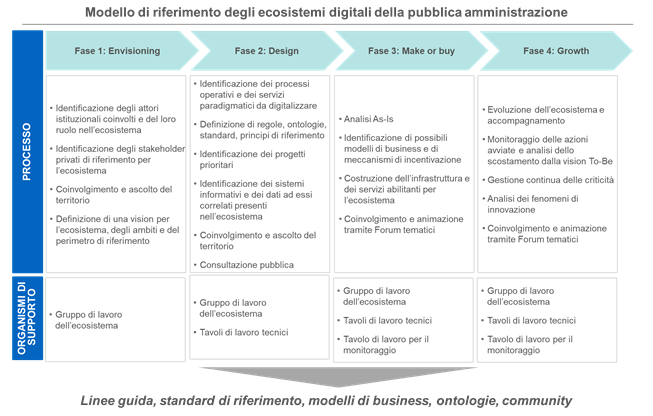

Ecosistemi
==========

Il modello strategico di evoluzione del sistema informativo della Pubblica
Amministrazione, definito nel Piano Triennale 2017 - 2019, ha introdotto il
concetto di “ecosistemi” della Pubblica Amministrazione: aree di intervento
settoriali e omogenee in cui si svolge l’azione delle pubbliche amministrazioni
(dalla sanità all’agricoltura, dalla scuola ai beni culturali) e in cui vengono
erogati servizi a cittadini e imprese attraverso il digitale.

L’identificazione degli ecosistemi digitali della Pubblica Amministrazione e il
supporto al loro sviluppo attraverso la semplificazione e la reingegnerizzazione
dei processi, la definizione di linee guida, regole e convenzioni,
l’individuazione di standard e di modelli di riferimento, la formazione di
competenze e professionalità specifiche, l’adozione di infrastrutture e sistemi
tecnologici innovativi, rappresentano un passaggio necessario per supportare il
processo di crescita e di digitalizzazione del Paese, al fine di garantire
l’interoperabilità tra le piattaforme e i servizi sia della Pubblica
Amministrazione, sia di quei privati che gestiscono o sviluppano servizi in
ambito pubblico.

L’applicazione alla Pubblica Amministrazione di un modello basato su ecosistemi
può facilitare l’integrazione tra le diverse pubbliche amministrazioni o tra la
Pubblica Amministrazione e le imprese, in modo da favorirne la collaborazione e
la co-erogazione di servizi di carattere pubblico - privato. Attraverso
l’adozione degli ecosistemi è inoltre possibile supportare l’interazione tra
privati, regolata o valorizzata dal pubblico, in modo da favorire la crescita di
quei settori di mercato legati al digitale (*start-up*, aziende innovative,
ecc.): i dati prodotti dagli ecosistemi e l’interoperabilità tra diversi ambiti
abiliteranno, infatti, lo sviluppo di nuove tipologie di servizi innovativi per
i cittadini, la collaborazione tra soggetti diversi e lo sviluppo di sistemi a
valore aggiunto.

Negli ecosistemi digitali della Pubblica Amministrazione sono definiti i
processi di riferimento che coinvolgono i diversi attori dell’ecosistema, sia
pubblici che privati, le applicazioni e i servizi eventualmente presenti nel
catalogo e sono identificate le regole generali per l’accesso ai dati e lo
scambio di informazioni e documenti all’interno di tali processi, compresi i
vocabolari di riferimento. Negli ecosistemi viene inoltre garantita l’adozione
del Modello e delle regole di interoperabilità definite da AGID, sia all’interno
del singolo ecosistema, sia nelle relazioni che quest’ultimo ha con gli altri
ecosistemi, in quanto il Modello di interoperabilità rappresenta il linguaggio
comune che abilita la comunicazione e l’interoperabilità tra gli ecosistemi
della Pubblica Amministrazione.

Negli ecosistemi della Pubblica Amministrazione, pertanto:

- gli operatori sono parte di reti dinamiche di collaborazione che, in base alle
  necessità, coinvolgono tutti i livelli: pubbliche amministrazioni, imprese,
  università, centri di competenza e di servizio, cittadini, *communities,*
  ecc.;

- si identificano i progetti e i servizi di riferimento, nonché i dati da
  produrre, i vocabolari e le ontologie di riferimento;

- si realizzano nuovi prodotti e servizi, o si rinnovano prodotti o servizi già
  esistenti, attraverso l’adozione di piattaforme digitali che permettano di
  scambiare dati e condividere servizi tra i diversi soggetti coinvolti;

- sono impiegate diverse tecnologie innovative, al fine di migliorare
  l’interoperabilità e di semplificare l’erogazione di servizi a cittadini ed
  imprese;

- si favorisce il dialogo tra le pubbliche amministrazioni e la circolazione dei
  dati, per ridurre il carico di richieste di informazioni verso cittadini ed
  imprese (principio *once only*);

- sono introdotte `nuove professionalità ICT
  <http://www.agid.gov.it/sites/default/files/professioni-ict.pdf>`__, con
  specifiche competenze in tema di digitalizzazione della Pubblica
  Amministrazione.

Coerentemente con quanto previsto dal Modello di interoperabilità, all’interno
di ogni ecosistema vengono quindi definiti:

- standard tecnologici di riferimento specifici;

- API di settore, raccolte in un opportuno catalogo;

- interfacce di riferimento per tutte le amministrazioni appartenenti
  all’ecosistema;

- glossari, vocabolari e ontologie di riferimento;

- profili di interoperabilità specifici per l’ecosistema.

Questi componenti, nati per garantire l’interoperabilità all’interno del singolo
ecosistema, dovranno essere collegati e coerenti con il Modello di
interoperabilità trasversale descritto nel Piano Triennale di AGID, in modo da
abilitare anche l’interoperabilità e la condivisione di dati tra ecosistemi
differenti e, più in generale, l’interoperabilità tra pubbliche amministrazioni
a livello nazionale. In questo modo si realizza l’ecosistema digitale nazionale
per cittadini e imprese.

Scenario
--------

Tutte le pubbliche amministrazioni, e in particolar modo le amministrazioni
centrali individuate come capofila degli ecosistemi, hanno il compito di
collaborare per garantire lo sviluppo degli ecosistemi della Pubblica
Amministrazione.

Le amministrazioni capofila, in particolare, hanno il compito di definire il
perimetro dell’ecosistema, di individuare e coinvolgere gli *stakeholder*
pubblici e privati di riferimento e di supportare lo sviluppo degli ecosistemi
della PA; questo importante compito può essere svolto attraverso l’applicazione
di un modello di riferimento che descrive un processo di costruzione e di
evoluzione degli ecosistemi, composto da quattro fasi di lavoro (*Envisioning,
Design, Make or Buy e Growth*).

         della Pubblica Amministrazione, un modello pensato per fornire alle
         amministrazioni uno strumento di indirizzo utile per lo sviluppo degli
         ecosistemi. Il modello è composto da un processo di riferimento che
         prevede lo sviluppo di quattro fasi di lavoro: 1. Envisioning. Fase in
         cui vengono identificati gli attori di riferimento e definito il loro
         ruolo nell’ecosistema, in cui vengono avviate iniziative di ascolto del
         territorio al fine di identificare perimetro e vision di riferimento
         per l’ecosistema; 2. Design. Fase in cui si identificano processi
         operativi e servizi paradigmatici di riferimento per l’ecosistema, si
         definiscono regole, ontologie, standard e principi di riferimento
         generali e si identificano le progettualità di riferimento; 3. Make or
         Buy. Fase in cui si realizza e costruisce l’ecosistema, attraverso lo
         sviluppo dell’infrastruttura e dei servizi abilitanti per l’ecosistema.
         Durante questa fase deve essere previsto il coinvolgimento e
         l’animazione del territorio attraverso l’organizzazione di forum
         tematici; 4. Growth. Fase di evoluzione dell’ecosistema, di
         accompagnamento alle amministrazioni nella realizzazione delle attività
         e di monitoraggio delle azioni avviate. A supporto del processo di
         riferimento sono definiti alcuni organismi di supporto operativo: il
         gruppo di lavoro dell’ecosistema, che opera in tutte e quattro le fasi
         del processo, i tavoli di lavoro tecnici, che operano a partire dalla
         fase di design, e il tavolo di lavoro per il monitoraggio dello
         sviluppo delle progettualità dell’ecosistema, che opera a partire dalla
         fase di make or buy. L’applicazione del modello deve supportare lo
         sviluppo di un ecosistema e la definizione di linee guida, standard,
         modelli di business, ontologie a supporto delle amministrazioni che
         operano nell’ecosistema.

   Modello di riferimento degli ecosistemi digitali della Pubblica
   Amministrazione

Si descrivono brevemente le quattro fasi del modello di riferimento degli
ecosistemi digitali:

1. *Envisioning*: fase in cui viene definita la *vision* dell’ecosistema, in cui
   si identificano i soggetti da coinvolgere e il loro ruolo e in cui sono
   definiti gli ambiti e i campi d’azione prioritari. Risulta fondamentale
   nella prima fase di sviluppo di un ecosistema l’istituzione di un gruppo di
   lavoro che curi l’ascolto e identifichi le necessità di tutti quei soggetti
   che saranno coinvolti nello sviluppo e nella fruizione dell’ecosistema stesso
   (PA, cittadini, imprese, soggetti standardizzatori, associazioni dell’ICT,
   comunità open data, società di consulenza ecc.) attraverso audizioni,
   consultazioni pubbliche ecc. Un ecosistema infatti, per poter esser definito
   tale, necessita fin da subito di un concreto coinvolgimento degli
   *stakeholder* che operano nell’ambito dell’ecosistema stesso e che ne
   sviluppano i servizi, secondo un’ottica di co-progettazione.

2. *Design*: fase di individuazione dei processi e dei servizi paradigmatici da
   digitalizzare, di definizione delle piattaforme e dei sistemi informativi
   presenti nell’ecosistema e di quelli da realizzare, di identificazione dei
   progetti di riferimento, da avviare o già esistenti, allo scopo di
   valorizzare le iniziative e gli investimenti già intrapresi. In questa fase,
   inoltre, si procede alla definizione dei dati che è necessario gestire e
   condividere all’interno dell’ecosistema e si avviano specifici tavoli di
   lavoro per l’identificazione e la definizione di standard per lo sviluppo dei
   progetti, dei servizi e per la definizione di regole per l’interoperabilità
   dei dati. Continua e si amplia, in questa fase del processo, il percorso di
   coinvolgimento e ascolto degli *stakeholder* dell’ecosistema avviato nella
   fase dell’*envisioning*; output di questa fase di lavoro dovrà essere un
   documento contenente la *vision*, il perimetro e la strategia di sviluppo
   dell’ecosistema, da sottoporre ad una consultazione pubblica della durata
   minima di 60 giorni.

3. *Make or Buy*: fase in cui si costruiscono le infrastrutture, le piattaforme
   abilitanti e i servizi per l’ecosistema. In questa fase è opportuno
   identificare possibili meccanismi di incentivazione per favorire lo sviluppo
   e l’adozione dei servizi digitali da parte dei cittadini e delle imprese,
   oltre che di *business model* in grado di favorire lo sviluppo da parte dei
   privati e il co-sviluppo di servizi pubblico-privato. La realizzazione delle
   progettualità dell’ecosistema dovrà essere sviluppata coerentemente e in
   sintonia con l’approccio descritto nelle linee guida AGID per
   l’interoperabilità, per la qualificazione dei servizi cloud SaaS al fine di
   garantire l’alimentazione dei cataloghi nazionali (es. catalogo delle API,
   catalogo dei servizi qualificati, ecc.). Negli ecosistemi dovrebbero inoltre
   essere predisposti dei meccanismi continuativi di ascolto del mercato e dei
   cittadini, oltre che di animazione e di coinvolgimento delle comunità di
   riferimento, come ad esempio dei forum tematici.

4. *Growth*: fase di accompagnamento della crescita dell’ecosistema attraverso
   il monitoraggio delle progettualità e dei risultati, l’identificazione di
   eventuali vincoli o limitazioni allo sviluppo o di esigenze normative. In
   questa fase, inoltre, è utile portare avanti attività di studio dei fenomeni
   di innovazione che possono impattare sull’evoluzione futura dell’ecosistema
   (es. introduzione di nuove tecnologie, nuove tipologie di servizi, ecc.) e
   continuare le attività di ascolto e coinvolgimento attraverso i forum
   tematici.

Il processo descritto può essere applicato agli ecosistemi in modo ciclico negli
anni o all’interno di periodi temporali di riferimento più brevi, seguendo
l’evoluzione delle progettualità e delle priorità identificate, pertanto le
azioni declinate nel paragrafo successivo prevedono dei tempi di realizzazione
coerenti con questa impostazione. AGID, attraverso il proprio centro di
competenza sugli ecosistemi, supporta le amministrazioni capofila nello sviluppo
degli ecosistemi attraverso l’applicazione del modello illustrato.

Come precedentemente accennato, per garantire un più rapido e agevole sviluppo
degli ecosistemi, nonché una *governance* e un supporto alle amministrazioni il
più possibile efficace, è necessario che le amministrazioni capofila
istituiscano un Gruppo di lavoro dell’ecosistema, con compiti di *governance*
strategica, di ascolto, di indirizzo e coordinamento. Eventualmente possono
essere attivati tavoli di lavoro tecnici, luoghi di discussione tecnica e di
confronto, di cui uno dedicato alle attività di monitoraggio delle principali
progettualità previste e avviate nell’ecosistema.

I Gruppi di lavoro di ogni ecosistema hanno il compito di avviare azioni di
coinvolgimento e animazione delle comunità territoriali e dei poli di
innovazione presenti nel territorio, sfruttando le competenze diffusamente
presenti negli incubatori, nelle piccole e medie imprese (PMI), nei centri di
formazione e ricerca (es. università e tecnopoli), per fare in modo che lo
sviluppo dell’ecosistema digitale generi anche un indotto economico al sistema
Paese.

Nel corso del 2017 sono state avviate dalle amministrazioni le attività sui 13
ecosistemi descritti dal Piano Triennale; nella tabella seguente, per ognuno dei
13 ecosistemi, si riportano:

- la descrizione aggiornata del perimetro di intervento di ogni ecosistema e
  delle progettualità chiave ad esso associate;

- l’elenco delle amministrazioni da coinvolgere nello sviluppo dell’ecosistema
  con indicazione dell’amministrazione capofila a livello di amministrazioni
  centrali (evidenziata in grassetto). L’amministrazione capofila di ogni
  ecosistema ha il compito di guidare lo sviluppo dell’ecosistema attraverso
  l’istituzione del Gruppo di lavoro e dei tavoli tecnici, di programmare le
  attività e gli obiettivi da raggiungere, di coinvolgere le altre
  amministrazioni e i soggetti privati interessati dallo sviluppo
  dell’ecosistema;

- l’indicazione sintetica dello stato di sviluppo raggiunto da ognuno dei 13
  ecosistemi: la fotografia mostra un quadro molto disomogeneo con ecosistemi
  molto avanti nel processo di sviluppo e altri ancora in fase di avvio.
  Generalmente risultano più avanti nel processo quegli ecosistemi che,
  storicamente, sono più dinamici o beneficiano di tavoli di lavoro descritti da
  una norma (es. Sanità).

.. table:: I 13 ecosistemi individuati
   :name: 13-ecosistemi-individuati

   +-----------------------+--------------------------------------------------------------+-----------------------------+---------------------+
   | Ecosistema            | Descrizione Ecosistema                                       | Principali amministrazioni  | Stato               |
   |                       |                                                              | coinvolte                   | dell’ecosistema     |
   +=======================+==============================================================+=============================+=====================+
   | **Sanità**            | L’ecosistema comprende lo sviluppo dei servizi sanitari per  | **Ministero della Salute,   | L’ecosistema è in   |
   |                       | i cittadini, i professionisti e le aziende sanitarie, nonché | Ministero dell’Economia e   | uno stato di        |
   |                       | l’analisi dei dati sanitari per finalità di ricerca e        | delle Finanze**, ISS,       | sviluppo molto      |
   |                       | governo. Al centro dell’ecosistema si pone il Fascicolo      | Regioni, Aziende sanitarie, | avanzato. Le        |
   |                       | sanitario elettronico (FSE), al quale sono collegati i       | AGID, Istituti              | progettualità sono  |
   |                       | servizi digitali che migliorano la fruibilità delle cure,    | zooprofilattici, AGENAS,    | definite e le       |
   |                       | dei servizi di diagnosi e assistenza oltre che della         | AIFA, INAIL                 | amministrazioni     |
   |                       | consulenza medica a distanza.                                |                             | collaborano nello   |
   |                       |                                                              |                             | sviluppo            |
   |                       |                                                              |                             | dell’ecosistema     |
   +-----------------------+--------------------------------------------------------------+-----------------------------+---------------------+
   | **Finanza pubblica**  | La struttura portante dell’ecosistema è costituita           | **Ministero dell’Economia e | L’amministrazione   |
   |                       | dall’insieme dei sistemi che gestiscono l’intero processo    | delle Finanze**, Ministero  | capofila ha avviato |
   |                       | che va dalla programmazione e pianificazione dei fabbisogni  | dell’Interno, Agenzia delle | diverse             |
   |                       | delle PA, alla gestione delle procedure di acquisto e        | Entrate, Agenzia delle      | progettualità, su   |
   |                       | negoziazione, fino all’esecuzione dei contratti e ai         | Dogane e dei Monopoli,      | cui le              |
   |                       | relativi fatturazione e pagamenti, oltre che alla gestione   | Agenzia del Demanio,        | amministrazioni     |
   |                       | degli incassi provenienti da diverse fonti (es. concessioni, | Ministero delle             | coinvolte stanno    |
   |                       | monopoli ecc.) o dei pagamenti effettuati dai tesorieri di   | Infrastrutture e dei        | lavorando           |
   |                       | tutte le amministrazioni pubbliche. Coinvolge sistemi quali  | Trasporti, Regioni,         |                     |
   |                       | le piattaforme telematiche di acquisto, il Sistema di        | Province, Comuni, ANCI      |                     |
   |                       | Interscambio delle fatture elettroniche, la BDAP, il SICOGE  |                             |                     |
   |                       | (Sistema per la gestione integrata della contabilità         |                             |                     |
   |                       | economica e finanziaria), l’IGRUE (sistema di controllo e    |                             |                     |
   |                       | monitoraggio), SIOPE (gestione dei flussi di cassa) e la     |                             |                     |
   |                       | piattaforma pagoPA                                           |                             |                     |
   +-----------------------+--------------------------------------------------------------+-----------------------------+---------------------+
   | **Sviluppo e          | L’ecosistema opera per il consolidamento a livello nazionale | **Ministero dello Sviluppo  | Con il supporto di  |
   | sostenibilità**       | dei servizi alle imprese (SUAP, SUE ecc.) attraverso         | Economico**, **Ministero    | AGID le             |
   |                       | l’implementazione dei servizi erogati dalle PA, con          | dell’Ambiente e della       | amministrazioni     |
   |                       | specifico riferimento ai procedimenti amministrativi che     | Tutela del Territorio e del | capofila stanno     |
   |                       | interessano l’attività economica e produttiva e              | Mare**, Ministero           | avviando            |
   |                       | l’alimentazione del fascicolo informatico d’impresa e il     | dell’Economia e delle       | l’ecosistema        |
   |                       | Piano impresa 4.0. Ulteriore ambito di riferimento per       | Finanze, Ministero          |                     |
   |                       | l’ecosistema riguarda la parte dei servizi ambientali,       | dell’Istruzione,            |                     |
   |                       | relativa in particolare alla gestione del ciclo dei rifiuti  | dell’Università e della     |                     |
   |                       | e alle valutazioni ambientali (VIA e VAS ecc.)               | Ricerca, ENEA, ANPA, ARPA,  |                     |
   |                       |                                                              | UnionCamere, Regioni,       |                     |
   |                       |                                                              | Province, Comuni, ANCI      |                     |
   +-----------------------+--------------------------------------------------------------+-----------------------------+---------------------+
   | **Giustizia**         | L’ecosistema ruota intorno ai differenti tipi di Processo    | **Ministero della           | L’amministrazione   |
   |                       | telematico (es. civile, penale, tributario) con i relativi   | Giustizia**, Ministero      | capofila ha avviato |
   |                       | sistemi di supporto ai magistrati e agli avvocati (quali ad  | dell’Economia e delle       | diverse             |
   |                       | esempio l’aula delle udienze digitalizzata e la scrivania    | Finanze, INAIL, Avvocatura  | progettualità. Sono |
   |                       | digitale) e alla costituzione dei Punti di accesso, ovvero   | dello Stato, Corte dei      | in corso iniziative |
   |                       | delle strutture tecnologico-organizzative che forniscono ai  | Conti, Consiglio di Stato,  | con le              |
   |                       | soggetti abilitati i servizi di connessione ai sistemi       | Corte di Cassazione, CSM    | amministrazioni     |
   |                       | informatici coinvolti                                        |                             | coinvolte per la    |
   |                       |                                                              |                             | messa a sistema     |
   |                       |                                                              |                             | delle diverse       |
   |                       |                                                              |                             | infrastrutture      |
   +-----------------------+--------------------------------------------------------------+-----------------------------+---------------------+
   | **Beni culturali e    | L’ecosistema fa riferimento allo sviluppo di servizi         | **Ministero dei Beni e      | Con il supporto di  |
   | turismo**             | digitali per la valorizzazione e la promozione del settore   | delle Attività Culturali**, | AGID                |
   |                       | culturale e turistico. Attualmente sono in corso             | **Ministero delle Politiche | l’amministrazione   |
   |                       | collaborazioni tra l’AGID e MiBAC su vari ambiti quali       | Agricole Alimentari e       | capofila sta        |
   |                       | museale, piano di digitalizzazione culturale, infrastrutture | Forestali e del Turismo**,  | definendo il        |
   |                       | digitali per i turisti                                       | Ministero dell’Economia e   | perimetro di        |
   |                       |                                                              | delle Finanze, Regioni,     | riferimento e sta   |
   |                       |                                                              | Province, Comuni, ANCI,     | avviando lo         |
   |                       |                                                              | ENIT, EPT                   | sviluppo            |
   |                       |                                                              |                             | dell’ecosistema     |
   +-----------------------+--------------------------------------------------------------+-----------------------------+---------------------+
   | **Welfare**           | L’ecosistema Welfare fa riferimento a tre macro ambiti che   | **Ministero del Lavoro e    | In fase di avvio    |
   |                       | attengono alle politiche sociali, politiche previdenziali e  | delle Politiche Sociali**,  |                     |
   |                       | politiche del lavoro e dell’occupazione per i quali si opera | Ministero dell’Economia e   |                     |
   |                       | per lo sviluppo di piattaforme digitali in grado di          | delle Finanze, Ministero    |                     |
   |                       | semplificare l’erogazione di servizi per persone e famiglie  | dell’Istruzione,            |                     |
   |                       | in condizioni di bisogno, di disagio e di emarginazione,     | dell’Università e della     |                     |
   |                       | nonché per lavoratori e disoccupati                          | Ricerca, INPS, INAIL,       |                     |
   |                       |                                                              | Ministero della Famiglia e  |                     |
   |                       |                                                              | per la Disabilità, Regioni, |                     |
   |                       |                                                              | Province, ANCI, Comuni,     |                     |
   |                       |                                                              | COVIP                       |                     |
   +-----------------------+--------------------------------------------------------------+-----------------------------+---------------------+
   | **Scuola**            | L’ecosistema Scuola è legato al processo di sviluppo e       | **Ministero                 | In fase di avvio    |
   |                       | innovazione della didattica, digitale, culturale e           | dell’Istruzione,            |                     |
   |                       | organizzativa delle scuole utilizzando gli strumenti del     | dell’Università e della     |                     |
   |                       | Piano Nazionale Scuola Digitale, per realizzare scuole       | Ricerca,** Istituti         |                     |
   |                       | innovative e poli per l’infanzia che tengano conto delle     | scolastici (pubblici e      |                     |
   |                       | nuove metodologie didattiche, e sistemi amministrativi       | parificati), Regioni,       |                     |
   |                       | scolastici più semplici e informatizzati                     | Province, Comuni, ANCI      |                     |
   +-----------------------+--------------------------------------------------------------+-----------------------------+---------------------+
   | **Istruzione          | L’ecosistema fa riferimento alla diffusione di piattaforme e | **Ministero                 | In fase di avvio    |
   | superiore e ricerca** | servizi in grado di rendere più competitivo e attrattivo il  | dell’Istruzione,            |                     |
   |                       | sistema universitario, nonché alla realizzazione di progetti | dell’Università e della     |                     |
   |                       | per il supporto della ricerca scientifica (es. banca dati    | Ricerca**, Sistema          |                     |
   |                       | unica della ricerca, digital library, laboratori di          | Universitario e Istituti    |                     |
   |                       | innovazione ecc.)                                            | Superiori di Ricerca, CNR   |                     |
   +-----------------------+--------------------------------------------------------------+-----------------------------+---------------------+
   | **Difesa, sicurezza e | L’ecosistema fa riferimento alle iniziative di               | **Ministero della Difesa**, | In fase di avvio    |
   | soccorso - Legalità** | ammodernamento, rinnovamento e adeguamento tecnologico dello | **Ministero dell’Interno**, |                     |
   |                       | Strumento Militare, anche attraverso la collaborazione con   | Ministero dell’Economia e   |                     |
   |                       | Università e Industrie, nonché alle iniziative per la        | delle Finanze, Ministero    |                     |
   |                       | sicurezza del territorio e delle coste, la sicurezza         | delle Infrastrutture e dei  |                     |
   |                       | informatica e la difesa cibernetica                          | Trasporti, Ministero delle  |                     |
   |                       |                                                              | Politiche Agricole          |                     |
   |                       |                                                              | Alimentari e Forestali e    |                     |
   |                       |                                                              | del Turismo                 |                     |
   +-----------------------+--------------------------------------------------------------+-----------------------------+---------------------+
   | **Infrastruttura e    | L’ecosistema Infrastruttura e logistica cura il rinnovamento | **Ministero delle           | In fase di avvio    |
   | logistica -           | e il potenziamento delle infrastrutture per la mobilità ed   | Infrastrutture e dei        |                     |
   | Mobilità**            | il trasporto, sia a livello nazionale che locale, su gomma,  | Trasporti**, Ministero      |                     |
   |                       | ferro e navale, nonché le iniziative per la riqualificazione | dell’Economia e delle       |                     |
   |                       | urbana, attraverso le potenzialità che vengono dalle         | Finanze, Regioni, Province, |                     |
   |                       | innovazioni digitali                                         | Comuni, ANCI, ACI, ANSF     |                     |
   +-----------------------+--------------------------------------------------------------+-----------------------------+---------------------+
   | **Comunicazioni**     | L’ecosistema fa riferimento allo sviluppo delle              | **Ministero dello Sviluppo  | In fase di avvio    |
   |                       | infrastrutture e dei servizi di comunicazione elettronica di | Economico**, AGCOM,         |                     |
   |                       | radiodiffusione e postali, nonché alla riduzione             | Ministero delle             |                     |
   |                       | dell’inquinamento elettromagnetico e ai programmi per        | Infrastrutture e dei        |                     |
   |                       | garantire la connettività in banda larga e ultralarga        | Trasporti, Ministero        |                     |
   |                       |                                                              | dell’Economia e delle       |                     |
   |                       |                                                              | Finanze                     |                     |
   +-----------------------+--------------------------------------------------------------+-----------------------------+---------------------+
   | **Agricoltura**       | L’ecosistema Agricoltura fa riferimento alle iniziative di   | **Ministero delle Politiche | In fase di avvio    |
   |                       | innovazione e digitalizzazione dei servizi per la            | Agricole Alimentari e       |                     |
   |                       | semplificazione della politica agricola, sia amministrativa  | Forestali e del Turismo**,  |                     |
   |                       | che di processo, e per la promozione del made in Italy e del | Ministero dell’Economia e   |                     |
   |                       | turismo nazionale                                            | delle Finanze, Regioni      |                     |
   +-----------------------+--------------------------------------------------------------+-----------------------------+---------------------+
   | **L’Italia in Europa  | L’ecosistema fa riferimento alle attività di cooperazione    | **Ministero degli Affari    | In fase di avvio    |
   | e nel Mondo**         | europea e internazionale, allo sviluppo e al sostegno        | Esteri e della Cooperazione |                     |
   |                       | delle aziende e dei cittadini italiani all’estero nonché     | Internazionale**,           |                     |
   |                       | alla promozione della sicurezza internazionale, attraverso   | **Ministero per gli Affari  |                     |
   |                       | la ricerca e l’innovazione e la digitalizzazione dei servizi | Europei**, Ministero        |                     |
   |                       |                                                              | dell’Economia e delle       |                     |
   |                       |                                                              | Finanze, Ministero delle    |                     |
   |                       |                                                              | Infrastrutture e dei        |                     |
   |                       |                                                              | Trasporti, Ministero dello  |                     |
   |                       |                                                              | Sviluppo Economico          |                     |
   +-----------------------+--------------------------------------------------------------+-----------------------------+---------------------+

In sintesi, per quello che riguarda le azioni a carico delle amministrazioni,
tutte le pubbliche amministrazioni cooperano allo sviluppo degli ecosistemi che
le vedono coinvolte; le amministrazioni capofila degli ecosistemi, con il
supporto di AGID, hanno il compito di convocare i Gruppi di lavoro degli
ecosistemi, di definire gli eventuali tavoli di lavoro tecnici e di favorire:

- la definizione del perimetro di riferimento dell’ecosistema;

- il coinvolgimento di tutti gli *stakeholder*, pubblici e privati, afferenti
  all’ecosistema;

- la definizione delle linee guida specifiche per l’ecosistema stesso;

- la definizione di regole condivise e trasparenti per il funzionamento
  dell’ecosistema e l’adozione di standard di interoperabilità di dati e servizi
  che permettano l’interscambio e la comunicazione tra sistemi e soluzioni
  diversificate, al fine di implementare servizi integrati e di limitare le
  richieste di dati a carico di cittadini e imprese;

- l’individuazione di servizi innovativi basati sul cloud e in grado di
  valorizzare i servizi SaaS qualificati, in coerenza con le linee guida AGID
  per la qualificazione dei *Cloud Service Provider* per la PA e per la
  qualificazione di servizi SaaS per il cloud della PA;

- l’utilizzo delle piattaforme abilitanti descritte nel Piano Triennale;

- l’utilizzo di soluzioni innovative, eventualmente attraverso le piattaforme di
  *procurement* per l’innovazione fornite da AGID, scaturite dalle attività di
  *open innovation* della PA (es. *Taskforce AI, Emerging Technologies*, ecc.);

- l’identificazione di set minimi di informazioni da produrre e rendere
  disponibili all’utenza degli ecosistemi e la definizione di vocabolari e
  ontologie di riferimento;

- la definizione di basi di dati di riferimento, di regole di alimentazione
  delle stesse e l’implementazione dei meccanismi di comunicazione con la
  Piattaforma Digitale Nazionale Dati (PDND) descritta nel par. 5.4. È infatti
  importante, nell’ambito di ogni ecosistema, sviluppare architetture
  tecnologiche in grado di raccogliere, mettere a sistema ed esporre i dati
  relativi ai servizi di maggiore rilevanza, con formati aperti (*open data*) e
  interoperabili, al fine di creare ecosistemi federati che permettano di
  valorizzare i contributi di tutti gli attori della filiera (pubblici e
  privati) e abilitino l’integrazione tra applicazioni.

L’Agenzia per l’Italia Digitale supporterà le amministrazioni nelle attività di
avvio degli ecosistemi e nel loro sviluppo, attraverso:

- la definizione del modello di riferimento per lo sviluppo degli ecosistemi e
  la definizione di Linee guida, standard di interoperabilità e regole tecniche
  utili alla progettazione e alla costruzione delle infrastrutture portanti
  degli ecosistemi digitali;

- la predisposizione delle piattaforme abilitanti descritte nel Piano Triennale
  e il supporto alle amministrazioni presenti nei diversi ecosistemi per la
  loro adozione;

- la definizione di Linee guida per lo sviluppo e la qualificazione di servizi
  digitali basati su logica cloud a supporto degli ecosistemi;

- la realizzazione di azioni di accompagnamento alle amministrazioni attraverso
  l’individuazione di un apposito centro di competenza, con compiti di supporto
  per la definizione e la realizzazione dei percorsi di trasformazione digitale;

- la predisposizione di cruscotti di monitoraggio, strumenti definiti a livello
  centrale, per la raccolta dei dati e per la misurazione degli indicatori di
  impatto (DESI), di risultato (Crescita Digitale) e di spesa (legati
  all’utilizzo dei fondi);

- l’affiancamento alle amministrazioni capofila nelle fasi di avvio degli
  ecosistemi e l’identificazione di eventuali opportunità di supporto all’avvio.

Obiettivi
---------

- Sostenere una visione orientata al cittadino e alle imprese per ogni
  ecosistema, che conduca alla realizzazione di servizi che semplifichino
  l’interazione con le pubbliche amministrazioni, offrendo singoli punti di
  accesso per l’utente;

- uniformare l’approccio allo sviluppo dei servizi della Pubblica
  Amministrazione tra i diversi ecosistemi per favorire l’omogeneizzazione dei
  servizi offerti al cittadino. Tali servizi devono essere semplici da usare,
  fondati sull’attenzione alla sicurezza e basati sull’interoperabilità di dati
  e applicazioni;

- incentivare l’interoperabilità tra i sistemi delle pubbliche amministrazioni,
  quale condizione necessaria per incrementare l’efficienza e l’efficacia dei
  servizi pubblici e dei procedimenti amministrativi che vedono coinvolte più
  amministrazioni (ad es. la Conferenza di servizi telematica);

- attuare il principio *once only* nel settore pubblico;

- favorire la diffusione di soluzioni innovative nella Pubblica Amministrazione,
  anche attraverso le piattaforme di *procurement* per l’innovazione fornite da
  AGID;

- coinvolgere tutti i soggetti interessati da ogni ecosistema (pubbliche
  amministrazioni, imprese, università, centri di competenza e di servizio,
  cittadini, ecc.) in reti dinamiche di collaborazione, per capitalizzare le
  esperienze maturate dai diversi soggetti e valorizzare le *best practice*;

- favorire lo sviluppo di nuove competenze in tema di digitalizzazione della
  Pubblica Amministrazione, attraverso il coinvolgimento delle università e
  degli enti di ricerca, e l’introduzione di nuove professionalità.

Linee di azione
---------------

La strategia si pone come obiettivo di favorire l’avvio degli ecosistemi della
Pubblica Amministrazione attraverso la convocazione dei Gruppi di lavoro
specifici per l’applicazione del modello di riferimento. L’obiettivo è di
avviare, nel corso del primo anno di riferimento del presente Piano, le azioni
di seguito descritte su almeno quattro ecosistemi “prioritari”:

1. Ecosistema Finanza pubblica;

2. Ecosistema Sviluppo e sostenibilità;

3. Ecosistema Beni culturali e turismo;

4. Ecosistema *Welfare;*

Proseguono inoltre le attività relative all’Ecosistema Sanità, già avviato e in
fase avanzata di sviluppo.

.. rubric:: **LA51 - Convocazione dei Gruppi di lavoro degli ecosistemi e definizione dei tavoli di lavoro tecnici**
   :class: ref
   :name: la51

**Tempi**
  Da gennaio 2019

**Attori**
  Amministrazioni capofila, AGID

**Descrizione**
  *Fase di envisioning* - Per ciascun ecosistema, l’amministrazione capofila
  istituisce il Gruppo di lavoro, coinvolge gli *stakeholder* di riferimento per
  l’ecosistema (tramite, ad esempio, delle audizioni) e, una volta raccolte le
  loro esigenze, definisce il perimetro di riferimento dell’ecosistema stesso e
  ne descrive la vision con le progettualità e gli interventi prioritari. I
  Gruppi di lavoro inoltre definiscono gli eventuali tavoli tecnici necessari
  allo sviluppo degli ecosistemi.

**Risultati**
  Le Amministrazioni capofila costituiscono, con il supporto di AGID, i Gruppi
  di lavoro per almeno 4 ecosistemi: Finanza pubblica, Sviluppo e sostenibilità,
  Beni culturali e turismo, *Welfare* (entro dicembre 2019).

**Aree di intervento**
  Nel breve periodo, impatto su PA capofila e *stakeholder* dell’ecosistema.

.. rubric:: **LA52 - Design degli ecosistemi**
   :class: ref
   :name: la52

**Tempi**
  Da gennaio 2020

**Attori**
  Gruppi di lavoro e tavoli tecnici degli ecosistemi

**Descrizione**
  Fase di *design* - I Gruppi di lavoro e i tavoli tecnici, attraverso il
  coinvolgimento dei diversi *stakeholder* interessati, identificano le
  progettualità e i servizi prioritari da sviluppare a beneficio dei cittadini
  e delle imprese, gli eventuali progetti già esistenti da integrare nel disegno
  dell’ecosistema, nonché le basi dati e i sistemi informativi da collegare e
  correlare. Output di questa fase di lavoro dovrà essere un documento
  contenente la visione, il perimetro e la strategia di sviluppo
  dell’ecosistema, da sottoporre ad una consultazione pubblica della durata
  minima di 60 giorni.

**Risultati**
  I gruppi di lavoro degli ecosistemi prioritari producono ciascuno un documento
  contenente visione, perimetro e strategie di sviluppo degli ecosistemi - da
  mettere in consultazione pubblica (giugno 2020).

**Aree di intervento**
  Nel breve periodo, impatto su PA coinvolte e *stakeholder* degli ecosistemi.

.. rubric:: **LA53 - Realizzazione delle analisi As-Is degli ecosistemi**
   :class: ref
   :name: la53

**Tempi**
  Da giugno 2020

**Attori**
  Gruppi di lavoro e tavoli tecnici degli ecosistemi

**Descrizione**
  Fase di *Make or Buy* - I Gruppi di lavoro e i tavoli tecnici favoriscono e
  supportano le attività di realizzazione delle progettualità, studiano
  meccanismi di incentivazione all’utilizzo dei servizi digitali e istituiscono
  dei forum tematici per l’ascolto del mercato e dei cittadini. Definiscono e
  condividono una metodologia di monitoraggio delle azioni avviate.

**Risultati**
  I gruppi di lavoro degli ecosistemi monitorano lo sviluppo dell’ecosistema a
  partire dalla situazione di partenza (*As-Is*) e condividono una metodologia
  di monitoraggio. I gruppi di lavoro degli ecosistemi istituiscono inoltre
  Forum tematici (dicembre 2020).

**Aree di intervento**
  Nel breve periodo, impatto su PA coinvolte e *stakeholder* degli ecosistemi.

.. rubric:: **LA54 - Accompagnamento allo sviluppo degli ecosistemi**
   :class: ref
   :name: la54

**Tempi**
  Da gennaio 2021

**Attori**
  Gruppi di lavoro e tavoli tecnici degli ecosistemi

**Descrizione**
  Fase di Crescita (*Growth*) - I Gruppi di lavoro e i tavoli tecnici degli
  ecosistemi accompagnano e monitorano lo sviluppo degli ecosistemi e delle
  diverse progettualità avviate e proseguono con le attività di ascolto e
  coinvolgimento attraverso i forum tematici.

**Risultati**
  I gruppi di lavoro degli ecosistemi avviano azioni di accompagnamento e
  realizzano attività di monitoraggio sullo sviluppo degli ecosistemi (dicembre
  2021).

**Aree di intervento**
  Nel breve periodo, impatto su PA coinvolte e *stakeholder* degli ecosistemi.

.. admonition:: Focus. L’ecosistema digitale dei musei italiani

   *Si ringrazia la Direzione Generale dei Musei del Ministero per i Beni e le
   Attività Culturali (MiBAC) per il contributo alla redazione di questo focus.*

   Il MiBAC, amministrazione capofila dell’ecosistema Beni culturali e turismo,
   attraverso l’operato della Direzione Generale Musei e con la collaborazione
   di AGID, nel corso dell’ultimo anno ha avviato un percorso di costruzione
   dell’ecosistema digitale dei musei italiani, un “sotto-ecosistema” inquadrato
   all’interno del più ampio Ecosistema Beni culturali e turismo.

   .. figure:: media/ecosistema-digitale-musei-italiani.svg
      :name: ecosistema-digitale-musei-italiani
      :alt: Il MiBAC, attraverso l’operato della Direzione Generale Musei e con
            la collaborazione di AGID, nel corso dell’ultimo anno ha avviato un
            percorso di lavoro che, a partire dal processo di implementazione
            del Sistema Museale Nazionale, porterà allo sviluppo di un
            ecosistema digitale dei musei italiani, ecosistema che si porrà al
            centro del più ampio ecosistema “Beni Culturali e Turismo” e che
            vedrà il coinvolgimento di tutti i soggetti che operano nell’ambito
            del Sistema Museale Nazionale. Il modello di riferimento per
            l’ecosistema digitale dei musei, rappresentato nella figura, prevede
            la costruzione di una federazione di soggetti, pubblici e privati,
            che operino all’interno dell’ecosistema attraverso un framework di
            interoperabilità basato su regole, standard, API e sulla
            circolazione di dati aperti secondo modelli condivisi. Un framework
            di interoperabilità consente ai diversi sistemi e servizi presenti
            nell’ecosistema di comunicare senza problematiche o necessità di
            «traduzioni» di formati, e favorisce lo sviluppo di applicazioni
            innovative attraverso l’aggregazione di servizi e soggetti diversi
            senza doversi preoccupare di formati o protocolli di comunicazione.
            L’approccio architetturale per la costruzione dell’ecosistema
            prevede la realizzazione di una architettura orientata ai servizi
            che favorisca lo sviluppo di servizi dedicati agli stakeholder
            esterni e di servizi dedicati ai musei; l’intero ecosistema deve
            pertanto essere supportato da una infrastruttura in grado di
            agevolare l’interazione tra tutti i stakeholder e l’esecuzione di
            processi di miglioramento e valorizzazione, al fine di ottimizzare e
            razionalizzare le azioni intraprese per il miglioramento delle
            offerte fornite dai musei. Nel modello saranno inoltre previsti
            servizi centralizzati e piattaforme di livello nazionale (es. SPID,
            pagoPA). Al centro dell’ecosistema si porrà la Piattaforma di
            integrazione del Sistema Museale Nazionale (SMN), uno strumento che
            abiliterà l’interoperabilità e l’interscambio di dati tra tutti i
            musei italiani ad ogni livello (musei statali, regionali, privati,
            ecclesiastici) e la Direzione generale Musei, e che consentirà di
            offrire nuovi servizi digitali ai turisti e a tutti gli stakeholder
            coinvolti nell’ecosistema.

      L’ecosistema digitale dei musei italiani

   L’ecosistema sta nascendo coerentemente con il modello di riferimento degli
   ecosistemi della PA: nel corso dell’ultimo anno è stato infatti istituito il
   gruppo di lavoro che ha coinvolto i principali *stakeholder* di riferimento,
   pubblici e privati, del Sistema Museale Nazionale; il gruppo di lavoro ha poi
   definito una visione e un perimetro di riferimento, ha analizzato la
   situazione di partenza (*As-Is*) e ha identificato alcuni progetti prioritari
   su cui concentrare le azioni da intraprendere.

   AGID, attraverso la sottoscrizione di uno specifico protocollo di intesa
   nell’ambito del progetto Italia Login, partecipa al Gruppo di lavoro
   dell’ecosistema digitale dei musei italiani, ha affiancato la Direzione
   Generale Musei nella definizione della visione e nell’individuazione delle
   progettualità di riferimento da avviare e sta collaborando alla stesura del
   Piano Triennale per la digitalizzazione dei musei.

   Al centro dell’ecosistema digitale dei musei si porrà la realizzazione della
   Piattaforma di integrazione del Sistema Museale Nazionale (SMN), uno
   strumento che abiliterà l’interoperabilità e l’interscambio di dati tra tutti
   i musei italiani ad ogni livello (musei statali, regionali, privati,
   ecclesiastici) e Direzione generale Musei e che consentirà di offrire nuovi
   servizi digitali ai turisti e a tutti gli *stakeholder* coinvolti
   nell’ecosistema. AGID sta affiancando il MiBAC nella progettazione e nello
   sviluppo della piattaforma nell’ambito del suddetto protocollo di intesa.
