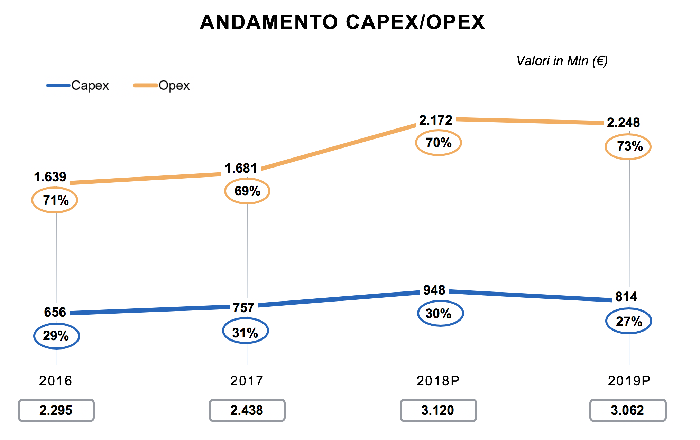

Razionalizzazione della spesa ICT della PA
==========================================

Scenario
--------

Il Piano Triennale è costruito avendo a riferimento quanto indicato nella
Strategia per la crescita digitale, con le azioni, la definizione dei fabbisogni
finanziari e gli indicatori ivi rappresentati. L’obiettivo del Piano è
indirizzare gli investimenti del settore pubblico in ambito ICT, fornendo
indicazioni alle pubbliche amministrazioni, secondo le linee guida del Governo,
per lo snellimento dei procedimenti burocratici, la maggiore trasparenza dei
processi amministrativi, la maggiore efficienza nell’erogazione dei servizi
pubblici e, non ultimo, la razionalizzazione della spesa informatica.

In questo contesto, la stesura del Piano Triennale 2019 - 2021, come già
successo per l’edizione 2017 - 2019, è stata accompagnata dalla Rilevazione
sulla spesa ICT nella PA (di seguito Rilevazione 2018): un’attività di ricerca e
analisi sulla spesa e sulle attività ICT nella PA che, con il diretto
coinvolgimento delle principali PA centrali e locali nella raccolta di dati e
informazioni, fornisce elementi utili alla definizione di una fotografia sempre
aggiornata (seguendo la logica *rolling* del Piano) delle caratteristiche di
questo settore.

Nel precedente Piano Triennale 2017 - 2019, sulla base dei dati disponibili,
principalmente il 3° Osservatorio Assiform ICT nella PA e la Rilevazione 2017
sulla spesa ICT delle Amministrazioni centrali, condotta AGID, era stato
definito il perimetro della spesa “aggredibile” ai fini della *spending review*
definita nella Legge di Stabilità 2016 e, sempre nei termini indicati dalla
legge, la prima valutazione della dimensione economica dei risparmi conseguibili
alla fine del triennio 2016 - 2018 rispetto alla media del triennio precedente
2013 - 2015, in termini di spesa di parte corrente (la cosiddetta spesa Opex)
annuale nazionale.

Fermo restando che, solo quando saranno disponibili i dati consolidati della
spesa a fine triennio 2016 - 2018 sarà possibile misurare gli eventuali risparmi
e verificare se l’obiettivo di risparmio complessivo risulterà conseguito, le
indicazioni per le PA contenute nel Piano Triennale, presente edizione e
precedente, tracciano la strada per la razionalizzazione della spesa, intesa
come percorso di riqualificazione rispetto alla tipologia di spesa e di
ottimizzazione rispetto ai canali di acquisto.

In particolare, alla luce di quanto indicato dall’articolo 14-bis del CAD sulle
funzioni di AGID, gli obiettivi della Rilevazione 2018 sono stati:

- in generale, raccogliere dati e informazioni sulle attività delle pubbliche
  amministrazioni, per supportare l’aggiornamento annuale del Piano Triennale;

- più nello specifico, verificare/valutare, secondo una logica di
  riqualificazione e ottimizzazione, l’andamento della spesa rispetto agli
  obiettivi di digitalizzazione fissati di volta in volta nel Piano Triennale
  analizzando:

  - trend 2016 - 2019 della spesa ICT della PA per aggregati;

  - trend della spesa dentro/fuori Consip e Centrali di committenza;

  - trend della composizione della spesa di investimento (Capex) e spesa
    operativa (Opex);

  - mappa della progettualità più significativa rispetto al Modello strategico
    ICT.

La Rilevazione 2018, condotta nel periodo ottobre 2017 - maggio 2018, è stata
articolata in una fase pilota e in una di *follow up*; ha coinvolto circa 70
amministrazioni, allargando il *panel* della precedente edizione dalle
principali amministrazioni centrali alle amministrazioni locali maggiormente
coinvolte nei processi di trasformazione digitale del Paese e indicati nel Piano
2017 - 2019 quali“aggregatori territoriali”, nello specifico: le Regioni, le
Città Metropolitane e i relativi Comuni capoluogo.

Inoltre, al fine di completare la raccolta di dati e informazioni sulle attività
delle pubbliche amministrazioni, è stata commissionata da AGID un’indagine
campionaria sulle attività delle Centrali Uniche di Committenza (si veda
paragrafo 12.4) con la finalità di misurare il valore del transato per la quota
destinata all’acquisto di beni e servizi in ambiti ICT gestiti direttamente o
tramite piattaforme Consip.

Il risultato è quindi stato la realizzazione di un’analisi quali-quantitativa
dei fenomeni in atto, compresi i cambiamenti rispetto al passato, le cui
principali evidenze sono esposte nel presente capitolo.

Con tale attività, AGID ha avviato un’azione di verifica e valutazione della
spesa ICT nella PA con l’intento di mettere a punto un sistema di monitoraggio e
di classificazione della spesa per obiettivi e non solo per categorie
merceologiche.

Seguendo l’impostazione del Piano 2017 - 2019, la presentazione dei risultati
della Rilevazione 2018 è inquadrata nel contesto più generale dell’andamento
della spesa ICT in tutti i comparti della PA italiana in base alla disponibilità
delle più recenti stime e analisi, come di seguito illustrato.

La spesa ICT nella PA italiana - andamento complessivo e composizione
~~~~~~~~~~~~~~~~~~~~~~~~~~~~~~~~~~~~~~~~~~~~~~~~~~~~~~~~~~~~~~~~~~~~~

Sulla base delle analisi più recenti in questo ambito, nel corso del biennio
2016 - 2017 il mercato digitale della Pubblica Amministrazione ha registrato,
nel suo complesso, un andamento di sostanziale stabilità, attestandosi su valori
medi pari a poco più di 5,5 miliardi di €, in linea con quanto registrato nel
corso del triennio 2013 - 2015.

Nella figura 12.1 è descritto l’andamento per le annualità 2016 e 2017 rispetto
al valore medio del triennio precedente, con evidenza del trend di spesa per
ciascuno dei comparti (definiti nell’ambito dell’Osservatorio ICT nella PA) che
compongono l’ICT pubblico: Amministrazioni Centrali (Settore Statale e altri
Enti dell’Amministrazione centrale), Regioni, Amministrazioni locali (EELL e
altri enti sul territorio), Sanità (compresa la sanità regionale), Education
(scuola/università/ricerca).

.. figure:: media/spesa-ict-pa-italiana.png
   :name: spesa-ict-pa-italiana
   :alt: La figura descrive l’andamento della spesa ICT nella PA italiana per
         le annualità 2016 e 2017 rispetto al valore medio del triennio
         precedente, con evidenza del trend di spesa per ciascuno dei comparti
         (definiti nell’ambito dell’Osservatorio ICT nella PA) che compongono
         l’ICT pubblico: le Pubbliche Amministrazioni Centrali, di seguito PAC,
         che comprendono Settore Statale e altri Enti dell’Amministrazione
         centrale, Regioni, Pubbliche Amministrazioni locali, di seguito PAL,
         che comprendono Enti locali e altri enti sul territorio, Sanità,
         compresa la sanità regionale, ed Education, che include scuola,
         università e ricerca. Nel primo istogramma composito da sinistra sono
         evidenziati i seguenti valori per i suddetti comparti della media della
         spesa ICT della PA italiana nel triennio 2013 - 2015: PAC 2.649 milioni
         di euro, PAL 714 milioni di euro, Regioni 671 milioni di euro, Sanità
         1.160 milioni di euro, Education 344 milioni di euro per un totale
         complessivo di 5.539 milioni di euro. Nel secondo istogramma composito
         da sinistra sono evidenziati i seguenti valori per i suddetti comparti
         della spesa ICT della PA italiana nel 2016: PAC 2.590 milioni di euro,
         PAL 700 milioni di euro, Regioni 665 milioni di euro, Sanità 1.200
         milioni di euro, Education 365 milioni di euro per un totale
         complessivo di 5.520 milioni di euro. Nel terzo istogramma composito da
         sinistra sono evidenziati i seguenti valori per i suddetti comparti
         della spesa ICT della PA italiana nel 2017: PAC 2.585 milioni di euro,
         PAL 690 milioni di euro, Regioni 648 milioni di euro, Sanità 1.220
         milioni di euro, Education 375 milioni di euro per un totale
         complessivo di 5.519 milioni di euro.

   La spesa ICT nella PA italiana (Fonte: NetConsulting cube, 2018)

Scendendo a livello di comparti, è la Pubblica Amministrazione centrale a
generare la maggior parte della spesa, con un valore nel biennio 2016 - 2017
ormai prossimo ai 2,6 miliardi di €, pari a circa il 45% della spesa totale
della PA. Questo comparto, che negli anni precedenti aveva subito una forte
contrazione, nell’ultimo biennio si è mantenuto sostanzialmente stabile. In
particolare, sono i Ministeri e i principali Enti di previdenza ad avere la
spesa media più rilevante con una focalizzazione sui progetti di sistema.

Il secondo comparto in termini di incidenza sulla spesa, pari a circa 25%, è
costituito dalle pubbliche amministrazioni locali, che nel periodo in esame
hanno registrato una spesa media superiore a 1,4 miliardi di €. Nel comparto
sono incluse le Regioni e le Province Autonome (ad esclusione dei sistemi
sanitari regionali la cui spesa è contabilizzata nell’apposita voce Sanità) cui
afferisce poco meno della metà della spesa della PA locale, mentre la restante
parte è relativa a Province, Comuni, Città metropolitane, Consorzi tra
amministrazioni locali, Unioni di Comuni, Comunità montane, Comunità isolane ed
altri Enti locali.

A differenza della spesa di PA Centrale e Locale, la spesa per la Sanità e
l’Education sono comparti che nel periodo 2016 - 2017 registrano una crescita,
rispettivamente dell’1,7% e del 2,7%.

La spesa ICT in Sanità, circa il 20% della spesa PA, è pari a 1,2 miliardi di
€ nel 2017 e afferisce a Regioni (sistemi sanitari regionali), Aziende
sanitarie locali, Aziende ospedaliere/Aziende ospedaliere universitarie,
Policlinici e Istituti di ricovero e cura a carattere scientifico.

Completa il quadro delle macro tipologie della PA, con una spesa media nel
biennio in esame di circa 370 milioni di €, la parte Education, generata da
Università e Istituti di istruzione universitaria pubblici, Scuole statali ed
Enti di ricerca universitari.

In generale, figura 12.2, andando ad osservare per il 2017 la composizione della
spesa per natura economica Capex (spesa in conto capitale) e Opex (spesa di
parte corrente), il mercato nel suo complesso ha evidenziato una prevalenza
della spesa operativa (66%) rispetto a quella in conto capitale (34%); a livello
di comparti Sanità ed Education risultano quelli in cui il componente
d’investimento è percentualmente più rilevante (circa 40%); la PA centrale si
mostra allineata alla media complessiva del mercato, mentre la PA locale risulta
sensibilmente inferiore alla media.

.. figure:: media/composizione-spesa-ict-per-tipologia.png
   :name: composizione-spesa-ict-per-tipologia
   :alt: Nella figura si osserva per il 2017 la composizione della spesa ICT
         per natura economica Capex (spesa in conto capitale) e Opex (spesa di
         parte corrente). Il grafico a torta mostra che il mercato nel suo
         complesso ha evidenziato una prevalenza della spesa operativa pari al
         66% rispetto a quella in conto capitale pari al 34%.

   Composizione spesa per tipologia (Fonte: NetConsulting cube, 2018)

Dal punto di vista della composizione per macro voce di costo, figura 12.3, la
spesa per Servizi (che include, tra l’altro, i componenti legati ai servizi
cloud, alla telefonia e trasmissione dati e alla formazione) rappresenta quasi
la metà della spesa (circa 45%) seguita, in termini di incidenza, dalla spesa
per gli sviluppi applicativi (24%) e, dalla quota parte per manutenzione
hardware e software, inclusi i presidi applicativi, pari al 21% del mercato.

Il segmento Hardware sta evidenziando, così come negli anni passati, una
progressiva e continua contrazione della spesa relativa al componente PC
(desktop) e Printing così come a livello di Telecomunicazioni, che rappresentano
ancora una quota importante della spesa degli Enti, a determinare la contrazione
stanno contribuendo in principali cali nei costi di rete fissa e mobile; sia per
quanto riguarda l’hardware sia per la telefonia il generale calo è dovuto a
rinnovi di convenzioni e accordi quadro, in grado di generare risparmi
significativi per gli Enti.

.. figure:: media/composizione-spesa-ict-macrovoci.png
   :name: composizione-spesa-ict-macrovoci
   :alt: Nella figura si analizza la spesa ICT per macro voci di costi. Nel
         grafico a torta si nota che in ordine di grandezza la spesa ICT è
         composta per il 45% dalla quota servizi, per il 24 % dalla quota
         sviluppi applicativi, per il 21% dalla quota manutenzione hardware e
         software e per il 10% dalla quota acquisti hardware.

   Composizione spesa per macro voci (Fonte: NetConsulting cube, 2018)

Queste dinamiche si inseriscono all’interno di un contesto improntato alla
*spending review*, come indicato inizialmente dalla Legge di Stabilità 2016 e,
successivamente nel Piano Triennale per l’informatica nella Pubblica
Amministrazione 2017 - 2019, che ha delineato una strategia finalizzata ad
ottenere una riqualificazione della spesa informatica.

La Rilevazione AGID 2018 - principali caratteristiche del panel
~~~~~~~~~~~~~~~~~~~~~~~~~~~~~~~~~~~~~~~~~~~~~~~~~~~~~~~~~~~~~~~~

L’insieme delle PA che hanno partecipato, rispondendo *online* al questionario
quali-quantitativo, è così composto:

.. image:: media/mappa-questionario-ict.png
   :name: mappa-questionario-ict
   :scale: 100 %
   :alt: La figura mostra sulla mappa dello stato la posizione delle PA che
         hanno partecipato al questionario.

- 19 Amministrazioni Centrali (Ministeri, Agenzie fiscali, INPS, INAIL e ACI) -
  PA centrali.

- 21 Amministrazioni Regionali e Province Autonome - Regioni.

- 14 Città Metropolitane - PA locale.

- 14 Comuni capoluogo delle Città Metropolitane (sopra i 150.000 abitanti) -
  PA locale.

A tutte le Amministrazioni coinvolte è stato chiesto di fornire i dati
comprensivi della spesa gestita tramite le società in house e regolata sulla
base di uno o più contratti di servizio e/o di convenzioni.

In considerazione della varietà e della complessità del quadro dei rapporti in
essere tra PA e società in house, in alcuni casi è stato realizzato un
approfondimento ad hoc che ha visto direttamente coinvolte alcune società in
house regionali (CSI Piemonte, Lepida, Cup 2000 e Liguria Digitale) e una
centrale, la Sogei spa, nella fase di raccolta e prima lettura dei dati. Questa
attività da un lato ha permesso una maggiore completezza dei dati forniti e,
dall’altro, ha avviato il coinvolgimento di questi soggetti nella più
complessiva attività di monitoraggio prima descritta.

Nel quadro complessivo della spesa ICT nella PA italiana descritto in
precedenza, il panel di PA coinvolto, come rappresentato nella figura
sottostante, rappresenta circa il 72% della spesa totale del perimetro composto
da: Settore statale (Ministeri – Presidenza del Consiglio dei Ministri – Agenzie
Fiscali - Organi Costituzionali), Enti di previdenza, Regioni e Province
Autonome, Comuni sopra i 150.000 abitanti e Città Metropolitane, e non include
la maggior parte della spesa sanitaria (quella territoriale) e della spesa di
Istruzione (Università, Scuole pubbliche, Enti di ricerca universitari).

.. figure:: media/rappresentativita-rilevazione-agid.png
   :name: rappresentativita-rilevazione-agid
   :alt: La figura mostra il panel di PA coinvolto nella Rilevazione AGID.
         Nel grafico sono presenti 2 istogrammi compositi. Nel primo da sinistra
         c’è la rappresentazione della spesa ICT della Pubblica Amministrazione
         che risulta così composta: amministrazioni centrali 2.000 milioni di
         euro, Regioni, inclusa la sanità regionale, 1.085 milioni di euro,
         amministrazioni locali 223 milioni di euro per un totale complessivo di
         3.308 milioni di euro. Nel secondo istogramma composito da sinistra
         viene rappresentato il panel di PA coinvolto nella Rilevazione AGID che
         riguarda una spesa così composta: amministrazioni centrali 1.442
         milioni di euro, Regioni 744 milioni di euro, amministrazioni locali
         180 milioni di euro per un totale complessivo di 2.366 milioni di euro.
         Si rende così evidente che il il panel di PA coinvolto nella
         Rilevazione AGID rappresenta circa il 72% della spesa totale del
         perimetro dettagliato nel primo istogramma composito.

   Rappresentatività panel Rilevazione AGID su perimetro PA di riferimento -
   elaborazione su dati 2016 (Fonte: AGID - NetConsulting cube, 2018)

L’analisi quali-quantitativa di seguito esposta, vuole quindi evidenziare gli
andamenti più significativi relativi ai dati raccolti con le amministrazioni
coinvolte, come utile riferimento per l’osservazione del processo di
trasformazione digitale in atto più in generale nel settore pubblico.

Passando alla lettura dei risultati, la prima riflessione che emerge dal punto
di vista strutturale e organizzativo, è la seguente: a fronte della complessità
del settore pubblico in Italia, compresa la diversità dimensionale tra le
diverse tipologie di enti, la presenza di personale assegnato ai servizi ICT
(figura 12.5), mostra un’incidenza percentuale complessivamente omogenea nel
periodo considerato e, quantificabile complessivamente nell’intorno dell’1,7%
(valore medio sui 4 anni) sul totale del personale in servizio nelle PA
coinvolte.

Un andamento leggermente in crescita rispetto al passato, ma comunque contenuto
se rapportato all’insieme dei processi di digitalizzazione in atto o in fase di
avvio che vedono coinvolte, anche se in diversa misura, tutte le PA.

.. figure:: media/personale-ict.png
   :name: personale-ict
   :alt: La figura mostra la percentuale dei dipendenti ICT sul totale del
         personale in servizio nei 3 comparti delle amministrazioni centrali,
         Regioni e amministrazioni locali nelle 4 annualità che vanno dal 2016
         al 2019. Per quanto riguarda il comparto amministrazioni centrali si
         registrano le seguenti percentuali di dipendenti ICT sul totale del
         personale: nel 2016 l’1,8%, nel 2017 il 2%, nel 2018 l’1,6% e nel 2019
         l’1,4%. Per quanto riguarda il comparto Regioni si registrano le
         seguenti percentuali di dipendenti ICT sul totale del personale: nel
         2016 l’1,9%, nel 2017 il 2,3%, nel 2018 l’2,2% e nel 2019 l’2,3%. Per
         quanto riguarda il comparto amministrazioni locali si registrano le
         seguenti percentuali di dipendenti ICT sul totale del personale: nel
         2016 e nel 2017 l’1,1%, nel 2018 e nel 2019 l’1,2%.

   Personale in servizio per comparti e % dipendenti ICT sul totale del
   personale in servizio (Fonte: AGID, 2018)

Nella tabella sottostante si mette in evidenza, per le diverse tipologie di PA,
la modalità prevalente di gestione dei sistemi informativi per l’anno 2016.

La gestione tramite affidamento alle società in house, risulta prevalente nelle
Regioni dove si attesta al 62%.

Si nota che per le amministrazioni centrali si è verificato un ricorso in egual
misura a in house, *outsourcing* e a una gestione interna, con una leggera
prevalenza di quest’ultima modalità.

Mentre nel caso di Città metropolitane e Comuni è stato molto più frequente il
ricorso a una gestione interna (70%).

.. table:: Modalità di gestione dei servizi informativi (Fonte: AGID, 2018)
   :name: modalita-gestione-servizi-informativi

   +---------------------+----------+------------------+-------------+
   | Tipologia ente      | In house | Gestione interna | Outsourcing |
   +=====================+==========+==================+=============+
   | Amministrazioni     | 31%      | 38%              | 31%         |
   | centrali            |          |                  |             |
   +---------------------+----------+------------------+-------------+
   | Regioni             | 62%      | 33%              | 5%          |
   +---------------------+----------+------------------+-------------+
   | Amministrazioni     | 15%      | 70%              | 15%         |
   | locali              |          |                  |             |
   +---------------------+----------+------------------+-------------+

Mentre per il triennio 2017 - 2019, solo il 15% del panel prevede un cambiamento
nella modalità prevalente di gestione dei sistemi informativi: la metà conta di
passare ad una gestione in *outsourcing*, mentre il 33% di affidarla alla in
house.

Quadro generale e trend della spesa nel periodo 2016 - 2019
-----------------------------------------------------------

I dati raccolti suddivisi per categorie di costo basate sui codici gestionali
del SIOPE e per tipologia di strumenti di Acquisto (Consip/Centrali di
committenza e fuori Consip/Centrali di committenza), sulla base delle assunzioni
dettagliate in allegato 2, hanno permesso di ricostruire l’andamento di seguito
illustrato.

Si ritiene utile sottolineare che le viste d’insieme di seguito proposte, per
qualificare la lettura complessiva soprattutto dei dati previsionali, hanno
richiesto alcune stime e ponderazioni (basate sulle fonti disponibili) sui dati
puntuali comunicati dalle singole PA.

.. figure:: media/spesa-ict-2016-2019.png
   :name: spesa-ict-2016-2019
   :alt: La figura riporta in un grafico di linee in pila l’andamento della
         spesa ICT dal 2016 al 2019. I valori registrati sono i seguenti: nel
         2016 sono stati spesi 2.295 milioni di euro, nel 2017 sono stati spesi
         2.438 milioni di euro, nel 2018 i dati previsionali indicano una spesa
         di 3.120 milioni di euro e nel 2019 i dati previsionali indicano una
         spesa di 3.062 milioni di euro.

   Andamento della spesa ICT 2016 - 2019 del panel PA (Fonte: AGID, 2018)

La figura 12.6 riporta il trend della spesa totale per il panel di riferimento,
mostrando una sostanziale stabilità tra 2016 e 2017 e una crescita, tra il 2017
e il 2018 (dati previsionali) più accentuata e pari a circa 28%, per poi
assestarsi nel 2019 (dati previsionali). È importante sottolineare che le stime
per il 2018 e 2019, essendo frutto di elaborazioni su dati provenienti dai
bilanci di previsione degli enti coinvolti, possono avere solo una valenza
indicativa che andrà verificata nelle prossime attività di rilevazione.

Ad ogni modo, soffermandosi sulla variazione 2017 - 2018 si può con tranquillità
affermare che su di essa pesano le ipotesi al momento formulate dalle diverse PA
per la parte di spesa a valere sui programmi cofinanziati dai fondi comunitari
europei, in particolare dai fondi strutturali attraverso i Programmi Operativi
Nazionali e Regionali dell’attuale periodo di programmazione 2014 - 2020.

Il 2018 infatti, rappresenta una *milestone* per la valutazione della spesa dei
programmi comunitari 2014 - 2020 poiché concentra due scadenze rilevanti:

- la verifica periodica sui singoli programmi sulla base della quale la
  Commissione Europea può decidere di procedere al disimpegno di parte
  dell’importo complessivo (il cosiddetto “n+3”, articolo 136 `Reg CE 1303/2013)
  <https://eur-lex.europa.eu/legal-content/it/ALL/?uri=celex%3A32013R1303>`__;

- la verifica intermedia di efficacia di ciascun programma riscontrata sulla
  spesa certificata e sulle realizzazioni fisiche (output) di ciascun asse dei
  programmi cofinanziati (il cosiddetto *performance frame work*, articoli 21 e
  22 del `Reg CE 1303/2013
  <https://eur-lex.europa.eu/legal-content/IT/TXT/PDF/?uri=CELEX:32013R1303&from=it>`__).

La combinazione di questi due elementi ha con tutta probabilità spinto le PA
coinvolte a concentrare le proprie ipotesi di spesa su questa annualità.

Il trend della spesa pubblica, in ogni caso, è stato sempre fortemente
influenzato dalla spesa comunitaria e dalle sue scadenze. Osservando infatti, a
titolo d’esempio, la figura 12.7, l’andamento della quota parte di spesa
informatica a valere sui fondi comunitari monitorata dal MEF - RGS - IGRUE
nell’ultimo quinquennio, si evidenzia subito un picco per l’anno 2015, che ha
coinciso con la chiusura economico/finanziaria dei programmi cofinanziati nel
periodo di programmazione 2007 - 2013.

.. figure:: media/spesa-ict-programmi-comunitari.png
   :name: spesa-ict-programmi-comunitari
   :alt: La figura mostra l’andamento della quota parte di spesa informatica a
         valere sui fondi comunitari monitorata dal MEF - RGS - IGRUE
         nell’ultimo quinquennio. Nel grafico a colonne si leggono le seguenti
         variazioni percentuali: dal 2013 al 2014 si registra un -2%, dal 2014
         al 2015 si registra un aumento del 105%, dal 2015 al 2016 si registra
         una diminuzione del 33%.

   Andamento spesa ICT Programmi Comunitari (Fonte: OpenCoesione, 2018)

Di seguito viene illustrato, per i singoli comparti delle amministrazioni panel,
l’andamento della spesa relativa a beni e servizi ICT per gli anni oggetto della
rilevazione. I dati sono stati raccolti e classificati per natura in questo
modo:

- **spesa Capex (spesa di investimenti in innovazione tecnologica)**

  - Acquisti hardware:

  - Acquisti servizi di sviluppo software:

- **spesa Opex (spesa per il mantenimento e la gestione operativa delle
  tecnologie)**

  - Acquisti licenza:

  - Manutenzioni hardware/software e assistenza/presidi applicativi:

  - Acquisti altri servizi:

Si ricorda che le macro categorie e le categorie indicate sono state messe in
relazione, attraverso la tabella di transcodifica riportata in allegato, ai dei
codici gestionali SIOPE (versione 2017 Regioni e enti locali).

.. figure:: media/spesa-ict-pac.png
   :name: spesa-ict-pac
   :alt: Nella figura viene illustrata per il comparto amministrazioni centrali
         del panel, l’andamento della spesa relativa a beni e servizi ICT per
         gli anni oggetto della rilevazione e per il valore medio del triennio
         precedente. Nel grafico a colonne si leggono i seguenti valori: nel
         triennio 2013 - 2015 si registra un importo medio di 1.546 milioni di
         euro, nel 2016 si registra un importo di 1.442 milioni di euro, nel
         2017 1.566 milioni di euro, nel 2018 (dati previsionali) si registra un
         importo 1.996 milioni di euro e nel 2019 (dati previsionali) si
         registra un importo di 2.097 milioni di euro.

   Andamento spesa ICT - Pubblica Amministrazione Centrale (Fonte: AGID, 2018)

A fronte di una sostanziale stabilità fino al 2017, con scarti in più o in meno
inferiori all’1%, la variazione nel 2018 risulta in linea con quella generale e
pari a circa al 27%.

Per le previsioni 2018 vale la considerazione appena esposta sulle ipotesi
legate ai programmi cofinanziati dai fondi strutturali. Guardando poi alle
singole Amministrazioni, gli stanziamenti più ingenti sono quelli del Ministero
dell’Interno e dell’Istituto Nazionale Previdenza Sociale (INPS). In
particolare, il Ministero dell’Interno concentra la quasi totalità del propria
spesa su voci rientranti nella tipologia di gestione operativa (Capex), che
arriva a pesare, per questa annualità, per circa il 90% sul totale: le voci
maggiori di costo risultano essere i servizi di telefonia fissa e i servizi di
connettività, fonia e dati. In entrambi i casi, gli acquisti risultano
realizzati in prevalenza fuori strumenti Consip/Centrali di committenza.

I dati forniti dall’INPS per questa annualità, mostrano una ripartizione tra le
diverse voci equamente proporzionata tra spesa di investimento e spesa corrente,
indirizzando le risorse rispettivamente verso l’acquisto di pacchetti software
disponibili sul mercato (Capex) e la gestione e manutenzione software (Capex),
in entrambi casi viene data prevalenza agli acquisti attraverso strumenti
centralizzati.

.. figure:: media/spesa-ict-regioni.png
   :name: spesa-ict-regioni
   :alt: Nella figura viene illustrata per il comparto Regioni del panel,
         l’andamento della spesa relativa a beni e servizi ICT per gli anni
         oggetto della rilevazione e per il valore medio del triennio
         precedente. Nel grafico a colonne si leggono i seguenti valori: nel
         triennio 2013 - 2015 si registra un importo medio di 671 milioni di
         euro, nel 2016 si registra un importo di 673 milioni di euro, nel 2017
         701 milioni di euro, nel 2018 (dati previsionali) si registra un
         importo 956 milioni di euro e nel 2019 (dati previsionali) si registra
         un importo di 818 milioni di euro.

   Andamento spesa ICT - Regioni (Fonte: AGID, 2018)

Per quanto riguarda le amministrazioni regionali, il 2016 ha evidenziato una
spesa in linea con quella registrata in media nel periodo 2013 - 2015, mentre
per il 2017 e soprattutto in base alle previsioni per il 2018 si configura una
crescita significativa, pari al 36%, soprattutto nelle amministrazioni del
Centro-Sud e in particolare per le Regioni Abruzzo, Lazio, Puglia e Sicilia. La
tendenza alla crescita, se sarà confermata, può essere motivato oltre che da
quanto sopra detto sulle scadenze della programmazione dei fondi strutturali,
anche dall’andamento crescente, come illustrato nel precedente paragrafo, della
spesa destinata alla Sanità, compresa quindi anche la quota parte a titolarità
regionale.

Il più rilevante stanziamento di risorse per il 2018 risulta quello previsto
dalla Regione Lombardia con l’obiettivo di orientare la spesa principalmente
verso la gestione e manutenzione software e l’acquisto di altri servizi,
entrambe voci relative alla spesa di parte corrente.

.. figure:: media/spesa-ict-metro.png
   :name: spesa-ict-metro
   :alt: Nella figura viene illustrata per il comparto amministrazioni locali
         del panel, l’andamento della spesa relativa a beni e servizi ICT per
         gli anni oggetto della rilevazione e per il valore medio del triennio
         precedente. Nel grafico a colonne si leggono i seguenti valori: nel
         triennio 2013 - 2015 si registra un importo medio di 210 milioni di
         euro, nel 2016 si registra un importo di 180 milioni di euro, nel 2017
         171 milioni di euro, nel 2018 (dati previsionali) si registra un
         importo 168 milioni di euro e nel 2019 (dati previsionali) si registra
         un importo di 147 milioni di euro.

   Andamento spesa ICT - Città metropolitane e comuni (Fonte: AGID, 2018)

La Pubblica Amministrazione Locale, infine, a differenza dei precedenti
comparti, si caratterizza per un processo di riduzione della spesa per beni e
servizi ICT costante nel tempo e pari a circa il 6,5% in meno per anno [1]_. Da
segnalare tuttavia, le previsioni, per il 2019, della Città metropolitana di
Genova e dei Comuni di Cagliari, Genova e Napoli in controtendenza rispetto
all’andamento complessivo dell’intero campione.

.. [1] Tasso annuo di crescita composto 2016 - 2019: il tasso annuo di crescita
   composto, più comunemente noto come CAGR dall’acronimo anglosassone
   *Compounded Average Growth Rate*, rappresenta la crescita percentuale media
   di una grandezza in un lasso di tempo.

Scendendo nel dettaglio, per quanto riguarda la Città metropolitana di Genova e
il Comune di Napoli, l’aumento previsto delle risorse riguarderà sia la spesa
Capex che quella Capex, mentre il Comune di Genova, pur aumentando la spesa di
investimenti in innovazioni tecnologiche, convoglierà ancora più del 50% delle
proprie risorse nella gestione operativa. Infine, da sottolineare l’inversione
di tendenza del Comune di Cagliari che prevede, nel 2019, una composizione della
propria spesa così ripartita, 32% Capex - 68% Capex rispetto a quella dell’anno
precedente 78% Capex – 22% Capex.

Come si è già detto, le valutazioni sugli andamenti rispetto all’insieme di PA
considerato, saranno oggetto di verifica con le prossime attività di
monitoraggio della spesa ICT.

Tuttavia, si ritiene utile riassumerli e confrontarli con i risultati delle
precedenti attività di rilevazione [2]_ sulle mappe di posizionamento illustrate
in figura 12.11, per osservare i cambiamenti di questa parte del Sistema PA
rispetto agli elementi osservati, la composizione della spesa per tipologia
Capex/Opex e per strumenti di acquisto.

.. [2] 3° Osservatorio Assiform ICT nella PA e Rilevazione 2017 sulla spesa ICT
   AGID sulla spesa delle Amministrazioni centrali.

Nella figura sottostante, sono infatti rappresentati i posizionamenti delle
amministrazioni centrali, delle Regioni e delle amministrazioni locali (Città
Metropolitane e Comuni capoluogo) derivanti rispettivamente da: l’incidenza
della spesa Capex sul totale sull’asse verticale e, l’incidenza della spesa
tramite Consip e Centrali di committenza sempre sul totale sull’asse
orizzontale, nel triennio 2013 - 2015, nel biennio 2016 - 2017 (stima su
consuntivo) e nel biennio 2018 - 2019 (stima su previsioni).

.. figure:: media/mappa-posizionamento-ict.png
   :name: mappa-posizionamento-ict
   :alt: Nella figura sono rappresentati i posizionamenti delle amministrazioni
         centrali, delle Regioni e delle amministrazioni locali (Città
         Metropolitane e Comuni capoluogo) derivanti rispettivamente da:
         l’incidenza della spesa Capex sul totale sull’asse verticale e,
         l’incidenza della spesa tramite Consip e Centrali di Committenza sempre
         sul totale sull’asse orizzontale. Sono presenti 3 grafici a bolle: uno
         per il triennio 2013 - 2015, uno per il biennio 2016 - 2017 (stima su
         consuntivo) e uno per il biennio 2018 - 2019 (stima su previsioni).
         Ogni grafico è diviso in 4 quadranti: il posizionamento nel quadrante I
         rappresenta la situazione ottimale in cui le PA oltre ad incrementare
         l’incidenza sul totale della spesa finalizzata agli investimenti fanno
         un maggior ricorso agli strumenti centralizzati per le proprie
         procedure di acquisto, in linea con le indicazioni del Piano Triennale
         ICT. Nella mappa del triennio 2013 - 2015 (valore medio) le PA
         risultavano tutte concentrate nel quadrante III, con una spesa
         caratterizzata oltre che da una netta prevalenza della componente
         operativa su quella d’investimento anche da un limitato ricorso ai
         canali d’acquisto centralizzati. Nella mappa del biennio 2016 - 2017 le
         amministrazioni centrali si spostano nel quadrante IV, mentre Regioni e
         amministrazioni locali restano nel quadrante III. Nella mappa del
         biennio 2018 - 2019 le PA sono tutte concentrate e quasi sovrapposte
         nel quadrante IV.

   Mappa di posizionamento ICT (Fonte: AGID, 2018)

Come indicato nell’elaborazione grafica, il posizionamento nel quadrante I
rappresenta la situazione ottimale in cui le PA oltre ad incrementare
l’incidenza sul totale della spesa finalizzata agli investimenti fanno un
maggior ricorso agli strumenti centralizzati per le proprie procedure di
acquisto, in linea con le indicazioni del Piano Triennale ICT.

La mappa del triennio 2013 - 2015 (valore medio) identifica la posizione
iniziale, la cosiddetta *baseline* sulla quale sono state costruite le logiche
d’intervento per la riqualificazione e ottimizzazione per i vari comparti e le
diverse PA risultavano tutte concentrate nel quadrante III, con una spesa
caratterizzata oltre che da una netta prevalenza della componente operativa su
quella d’investimento anche da un limitato ricorso ai canali d’acquisto
centralizzati.

Passando alla mappa del biennio 2016 - 2017, coinciso con la fase di costruzione
e avvio della logica d’azione del Piano Triennale 2017 - 2019, è evidente il
movimento delle principali amministrazioni centrali in questo senso, motivato
dal ruolo di traino nella *governance* territoriale e nella rilevanza della
spesa, e dal coinvolgimento previsto e realizzato nel percorso di elaborazione
del Piano stesso.

Osservando il grafico del biennio 2018 - 2019, lo spostamento nel senso indicato
dalla freccia indica un movimento “virtuoso” di coerenza con il Piano Triennale,
in particolare verso un maggiore utilizzo degli strumenti d’acquisto
centralizzati, Consip e le Centrali di committenza, molte delle quali in fase di
concreto avvio di attività come descritto più avanti. Si rileva inoltre, in
ottica di sistema, la maggiore omogeneità nelle scelte dei diversi componenti
del sistema PA, tutte concentrate e quasi sovrapposte nel quadrante IV,
condizione fondamentale per migliorare l’efficacia complessiva dell’intero
disegno.

Andamento Capex/Opex 2016 - 2019
~~~~~~~~~~~~~~~~~~~~~~~~~~~~~~~~

         della PA italiana dal 2016 al 2019. La media in percentuale della spesa
         Capex nei 4 anni oggetto della Rilevazione è del 71%. La media in
         percentuale della spesa Opex nei 4 anni oggetto della Rilevazione è del
         29%.

   Composizione per tipologia (Fonte: AGID, 2018)

Tutti i comparti, negli anni oggetto della rilevazione, hanno evidenziato una
costante prevalenza della spesa operativa rispetto a quella in conto capitale,
tuttavia, le Città metropolitane e i Comuni indicano, nel 2018, un considerevole
aumento della spesa Capex sul totale (per maggiori dettagli si rimanda alle
tavole in allegato 2). Occorre ricordare che dal panel osservato, in termini di
comparti di spesa, sono escluse la spesa per Sanità (soprattutto) e quella per
Education che, come anche sottolineato in precedenza (si veda paragrafo 12.1.1),
generano in percentuale la maggiore spesa in conto capitale.

Andamento Consip Centrali/Fuori Consip Centrali 2016 - 2019
~~~~~~~~~~~~~~~~~~~~~~~~~~~~~~~~~~~~~~~~~~~~~~~~~~~~~~~~~~~

.. figure:: media/spesa-per-canale-acquisto.png
   :name: spesa-per-canale-acquisto
   :alt: Nella figura viene mostrato l’andamento Consip & Centrali di
         Committenza e Fuori Consip & Centrali di Committenza della spesa ICT
         della PA italiana dal 2016 al 2019. La media in percentuale della spesa
         effettuata tramite Consip & Centrali di Committenza nei 4 anni oggetto
         della Rilevazione è del 57%. La media in percentuale della spesa Fuori
         Consip & Centrali di Committenza nei 4 anni oggetto della Rilevazione è
         del 43%.

   Composizione spesa per canale d’acquisto (Fonte: AGID, 2018)

L’andamento della spesa per tipologia di canale d’acquisto - tramite o al di
fuori degli strumenti Consip/Centrali di acquisto - raffigurato nella figura
12.13 indica per il 2018 un netto cambio di rotta nelle modalità di acquisto,
con una crescita dell’utilizzo dei canali centralizzati fino al 66% sul totale
della spesa.

Rispetto al passato, ad accentuare tale differenza, concorrono prevalentemente i
trend delle Amministrazioni regionali e delle amministrazioni locali.

Le Amministrazioni regionali, infatti, tra il 2017 e il 2018 hanno previsto un
incremento di circa 3,3 volte per quanto riguarda la spesa tramite
Consip/Centrali di committenza, in particolare: la Regione Autonoma Sardegna, la
Regione Lombardia, la Regione Basilicata e la Regione Veneto considerano di
cambiare radicalmente il modo di effettuare i propri acquisti.

Stesse tendenze si riscontrano per le Città metropolitane e i Comuni che, tra il
2017 e il 2018, registrano un aumento del 18% per la spesa effettuata tramite
Consip/Centrali di committenza e una diminuzione del 25% per quella realizzata
mediante altri strumenti di *procurement*. Da segnalare la previsione di Roma
Capitale, che indica una decisa inversione di tendenza per quanto riguarda gli
strumenti utilizzati: per i propri acquisti, infatti, il Comune prevede di
raddoppiare approssimativamente la spesa tramite gli strumenti Consip/Centrali
di committenza e di dimezzare quasi quella effettuata fuori Consip/Centrali di
committenza.

Le Pubbliche Amministrazioni Centrali, infine, complessivamente, non prevedono
un cambiamento nella propria modalità di acquisto. Per il 2018, infatti,
contemplano di effettuare la loro spesa prevalentemente tramite Consip/Centrali
di committenza.

.. figure:: media/spesa-capex-opex-consip.png
   :name: spesa-capex-opex-consip
   :alt: Nella figura viene mostrato l’andamento della spesa Capex e Opex
         effettuata tramite Consip e Centrali di Committenza dal 2016 al 2019
         sul totale Capex e Opex. La media in percentuale della spesa Capex
         effettuata tramite Consip e Centrali di Committenza sul totale Capex
         nei 4 anni oggetto della Rilevazione è del 68%. La media in percentuale
         della spesa Opex effettuata tramite Consip e Centrali di Committenza
         sul totale Capex nei 4 anni oggetto della Rilevazione è del 53%.

   Andamento Capex/Opex Consip/Centrali di committenza su totale Capex/Opex
   (Fonte: AGID, 2018)

Osservando poi la composizione rispetto ai singoli componenti Capex e Capex, si
riscontra una crescita più accentuata della parte di investimento. Mettendo a
confronto le medie 2016 - 2017 con quelle 2018 - 2019 si registra infatti un
incremento del 39% sul fronte Capex e del 21% su quello Opex.

Composizioni per macro voci Capex e Opex
~~~~~~~~~~~~~~~~~~~~~~~~~~~~~~~~~~~~~~~~

.. figure:: media/spesa-ict-per-macrovoce.png
   :name: spesa-ict-per-macrovoce
   :alt: Nella figura si analizza la spesa ICT per macro voci di costi per gli
         anni dal 2016 al 2019. Il grafico a colonne conta 4 istogrammi
         compositi, uno per ogni anno. Nel 2016 in ordine di grandezza la spesa
         ICT è composta per il 34% dalla quota servizi, per il 33% dalla quota
         manutenzione hardware e software, per il 21% dalla quota sviluppi
         applicativi, per l’8% dalla quota acquisti hardware e per il 4% alla
         quota acquisti licenze. Nel 2017 in ordine di grandezza la spesa ICT è
         composta per il 34% dalla quota servizi, per il 30% dalla quota
         manutenzione hardware e software, per il 22% dalla quota sviluppi
         applicativi, per il 9% dalla quota acquisti hardware e per il 5% alla
         quota acquisti licenze. Nel 2018 in ordine di grandezza la spesa ICT è
         composta per il 38% dalla quota servizi, per il 27% dalla quota
         manutenzione hardware e software, per il 21% dalla quota sviluppi
         applicativi il 10% dalla quota acquisti hardware e per il 4% alla quota
         acquisti licenze. Nel 2019 in ordine di grandezza la spesa ICT è
         composta per il 48% dalla quota servizi, per il 23% dalla quota
         manutenzione hardware e software, per il 18% dalla quota sviluppi
         applicativi, per l’8% dalla quota acquisti hardware e per il 3% alla
         quota acquisti licenze.

   Composizione spesa ICT per macro voce (Fonte: AGID, 2018)

Dal punto di vista della composizione della spesa Capex/Opex, la macro voce
“Acquisti altri servizi” risulta la più consistente nelle annualità prese in
considerazione, nonché l’unica che fa registrare un aumento del 41% tra il 2016
e il 2019.

In particolare all’interno della suddetta macro voce le variazioni in media più
significative si riscontrano nelle voci “Servizi cloud”, “Servizi di telefonia
fissa” e “Altri servizi ICT (Servizi per le attività di rilevazione,
registrazione e rendicontazione dell’andamento della qualità dei servizi)”.

Segue come rilevanza la voce “Manutenzioni hardware/software e
Assistenza/Presidi Applicativi”, che tuttavia dal 2016 al 2019 segna un
decremento del 30% e che vede prevalenti le voci Manutenzione macchine
d’ufficio, attrezzature e Global service IT e Gestione e Manutenzione software.

Si registra invece un andamento costante per le macro voci “Acquisto Licenze”,
“Acquisti servizi di sviluppo software” e “Acquisti hardware” con medie che si
attestano rispettivamente sul 4%, 21% e 9% sulla composizione totale della
spesa.

La progettualità ICT della PA nel periodo 2017 - 2019
-----------------------------------------------------

Nel corso della rilevazione sono stati censiti 807 progetti, di cui 706 sono
stati oggetto della presente analisi, in base al il set minimo di informazioni
fornito (dettagliato in allegato 2), per un costo pluriennale 2017 - 2019
complessivo di circa 4 miliardi di €.

L’analisi di seguito esposta ha l’obiettivo di fornire un quadro d’insieme
prevalentemente qualitativo sulle scelte operate dalle PA coinvolte in ambito
ICT, secondo l’impostazione data nel Piano Triennale 2017 - 2019, che possa
rappresentare anche un insieme di elementi conoscitivi utili ai fini del
processo decisionale e di gestione/attuazione delle singole attività.

Caratteristiche principali
~~~~~~~~~~~~~~~~~~~~~~~~~~

Per completare il quadro di riferimento per il Piano Triennale, è stata
effettuata una doppia mappatura dei 706 progetti di cui si aveva a disposizione
il set minimo di informazioni: sia rispetto alla tipologia di attività
progettuali della PA, sia rispetto ai macro ambiti del Modello strategico così
come strutturati nei precedenti capitoli.

Nello specifico, il 48% dei progetti in corso o in avvio fanno capo alle
amministrazioni centrali (340), il 31% alle Regioni (220) e il 21% alle
amministrazioni locali (144).

Nella figura 12.16 è rappresentato il numero e il costo complessivo dei 706
progetti distribuiti per tipologia, secondo la seguente classificazione:

- **autoamministrazione**: sviluppo di applicazioni per il funzionamento interno
  (gestione amministrativa del personale, cartellino, bilancio, controllo di
  gestione, ecc.);

- **istituzionali core business**: sviluppo di applicazioni per la gestione di
  compiti istituzionali (gestione base dati, raccolta ed elaborazione info,
  supporto procedimenti amministrativi, supporto poteri di
  vigilanza/autorizzazione);

- **strategici PA digitale verso altre PA**: piattaforme abilitanti,
  infrastrutture cloud, progetti di sicurezza, sviluppo di sistemi/piattaforme
  per l’interoperabilità nell’ecosistema o tra ecosistemi diversi;

- **strategici PA verso cittadini, imprese e altri utenti finali**: sviluppo di
  servizi digitali multicanale;

- **altro:** progetti relativi sia a infrastrutture sia ad applicativi
  trasversali a più tipologie.

.. figure:: media/progetti-ict-per-tipologia.png
   :name: progetti-ict-per-tipologia
   :alt: Nella figura è rappresentata in un grafico a torta la distribuzione in
         termini percentuali dei 706 progetti secondo la seguente
         classificazione: autoamministrazione 24%, istituzionali core business
         36%, strategici PA digitale verso altre PA 10%, strategici PA verso
         cittadini, imprese e altri utenti finali, altro 1%.

   Progetti ICT nella PA per tipologia (Fonte: AGID, 2018)

Le Pubbliche Amministrazioni Centrali hanno rivolto le loro iniziative
progettuali, 340 in tutto per 2,8 miliardi di € complessivi, prevalentemente
agli ambiti“Istituzionali *core business*”, 165 per circa 1,3 miliardi di €
complessivi, e“Autoamministrazione”, 62 interventi per 830 milioni di €
complessivi.

Le Amministrazioni Regionali, 220 in tutto per circa 1 miliardi di €
complessivo, hanno focalizzato la loro attenzione su progetti “Strategici PA
digitale verso cittadini, imprese e altri utenti finali”, 111 per 600 milioni di
€ complessivi, e “Strategici PA digitale verso altre PA”, 50 per 240 milioni di
€ complessivi che rappresentano insieme circa l’82% dell’importo complessivo del
triennio 2017 - 2019.

Infine, anche le Pubbliche Amministrazioni Locali, 144 in tutto per 187 milioni
di € complessivi, hanno orientato i propri investimenti in ambito “Strategici PA
digitale verso cittadini, imprese e altri utenti finali” (67 per 78 milioni di
€) e “Autoamministrazione” (36 per 46 milioni di €) per un importo complessivo
2017 - 2019 di 125 milioni di € sui circa 187 milioni di € totali.

Nella figura 12.17 è invece rappresentato il numero e il costo complessivo dei
706 progetti distribuiti per i macro ambiti del Modello Strategico.

.. figure:: media/progetti-ict-per-macroambiti.png
   :name: progetti-ict-per-macroambiti
   :alt: Nella figura è rappresentata in un grafico a torta la distribuzione in
         termini percentuali dei 706 progetti secondo la seguente
         classificazione per i macro ambiti del Modello Strategico: ecosistemi
         32%, infrastrutture 28%, piattaforme 27%, dati della PA 5%, strumenti
         per l’esposizione dei servizi digitali 4%, sicurezza informatica 3% e
         interoperabilità 1%.

   Progetti ICT nella PA per macro ambiti (Fonte: AGID, 2018)

Come è evidente, gli Ecosistemi, le Infrastrutture e le Piattaforme
rappresentano i principali macro ambiti, sia per importo sia per numerosità,
verso cui le PA orientano la propria progettualità.

In particolare le amministrazioni centrali e le amministrazioni locali,
investono la maggior parte delle proprie risorse nel macro ambito Ecosistemi,
con rispettive quote del 34% e del 45% sugli importi complessivi.

Mentre le Regioni orientano la metà delle loro risorse verso il macro ambito
Infrastrutture 50%.

Infine è da sottolineare che per le Piattaforme, si registra una spesa
considerevole (circa 1 miliardi di €) pur non rappresentando numericamente e per
valore l’ambito di investimento prevalente.

Progetti “Ecosistemi”
~~~~~~~~~~~~~~~~~~~~~

Il grafico di seguito riportato evidenzia la ripartizione della spesa
progettuale per il Macro ambito “Ecosistemi”, che ricopre il 32% della spesa
progettuale complessiva per un totale di circa 1,29 miliardi di €.

I 270 progetti complessivi inerenti gli Ecosistemi sono così ripartiti:

- Amministrazioni centrali: 111 - valore complessivo circa 955 milioni di €;

- Regioni: 94 - valore complessivo circa 251 milioni di €;

- Amministrazioni locali: 65 - valore complessivo circa 84 milioni di €.

.. figure:: media/spesa-progetti-macroambito-ecosistemi.png
   :name: spesa-progetti-macroambito-ecosistemi
   :alt: Nella figura è rappresentata in un grafico a torta la ripartizione
         della spesa progettuale per il macro ambito Ecosistemi: finanza
         pubblica 45%, sanità 16%, difesa sicurezza soccorso e legalità 12%,
         giustizia 8%, sviluppo e sostenibilità 7%, welfare 5%, infrastrutture
         logistica e mobilità 4%, agricoltura 1%, beni culturali e turismo 1%,
         scuola 1%.

   Distribuzione della spesa dei progetti delle PA – Macro ambito “Ecosistemi”
   (Fonte: AGID, 2018)

Ognuna delle diverse categorie di Enti coinvolte nella rilevazione è
caratterizzata da una differente voce principale di spesa:

- Amministrazioni centrali: Ecosistema Finanza Pubblica, 38 progetti per circa
  500 milioni di € complessivi, con progettualità più significativa da parte
  delle Agenzie Dogane e Monopoli, Entrate e Riscossione.

- Regioni: Ecosistema Sanità, 32 progetti per circa 118 milioni di €
  complessivi.

- Amministrazioni locali: Ecosistema Infrastrutture Logistica e Mobilità, 18
  progetti per circa 26 milioni di € complessivi.

Le viste di dettaglio per amministrazioni centrali, Regioni e amministrazioni
locali, sono riportate in allegato 2.

In particolare, le amministrazioni centrali rappresentano il 91% dell’importo
complessivo triennale 2017 - 2019 per la voce Finanza Pubblica mentre il 56%
della spesa in Sanità è di competenza delle Regioni. La Pubblica Amministrazione
Locale, invece, convoglia su di sé il 48% delle risorse finanziarie investite in
Infrastrutture, la logistica e la mobilità.

La quota più rilevante in termini di spesa prevista per i progetti “Ecosistemi”
facenti capo alla Pubblica Amministrazione Centrale è quella di pertinenza
dell’Agenzia delle Entrate (circa 298 milioni di €) seguita da quella
programmata dal Ministero dell’Interno (circa 114 milioni di €), che hanno
investito di più rispettivamente su progetti inerenti il contrasto all’evasione
e sull’aggiornamento tecnologico degli impianti di videosorveglianza delle
Regioni.

Per quanto riguarda le Regioni, le Amministrazioni che prevedono una spesa
maggiore sono la Regione Lazio (43 milioni di €) e la Regione Lombardia (42
milioni di €), le quali hanno maggiormente rivolto i propri investimenti
rispettivamente sulla gestione infrastrutturale della Centrale Operativa del
Numero Unico Europeo e sull’evoluzione dei servizi digitali a supporto delle
politiche agricole.

Infine, tra le Pubbliche Amministrazioni Locali, Roma Capitale è quella con la
maggior spesa prevista (circa 23 milioni di €) per l’attuazione di 7 progetti
sui sistemi informativi di entrate, territorio, scuola, lavori pubblici,
patrimonio e polizia locale.

In termini numerici, invece, è il MEF a prevedere il maggior numero di progetti
(20), seguita in ambito regionale dalla Regione Lazio (15) e in ambito locale
dal Comune di Venezia (13).

In merito invece alla tipologia dei progetti nel caso delle amministrazioni
centrali prevale la categoria “Istituzionali *core business*”, mentre nel caso
di Regioni e amministrazioni locali prevale “Strategici PA digitale verso
cittadini, imprese e altri utenti finali”.

Progetti “Infrastrutture”
~~~~~~~~~~~~~~~~~~~~~~~~~

Il grafico di seguito riportato evidenzia la ripartizione della spesa
progettuale per il Macro ambito “Infrastrutture”, che ricopre il 28% della spesa
progettuale complessiva per un totale di 97 progetti e un ammontare di circa
1,13 miliardi di €.

I 97 progetti complessivi inerenti le Infrastrutture sono così ripartiti:

- Amministrazioni centrali: 57 - valore complessivo circa 600 milioni di €;

- Regioni: 29 - valore complessivo circa 508 milioni di €;

- Amministrazioni locali: 11 - valore complessivo circa 21 milioni di €.

All’interno del suddetto Macro ambito i progetti si differenziano nei due ambiti
Connettività (45 totali) e DataCenter e Cloud (52 totali) con una netta
predominanza in termini di spesa del primo ambito.

.. figure:: media/spesa-progetti-macroambito-infrastrutture.png
   :name: spesa-progetti-macroambito-infrastrutture
   :alt: Nella figura è rappresentata in un grafico a torta la ripartizione
         della spesa progettuale per il macro ambito Infrastrutture:
         connettività 64%, data center e cloud 36%.

   Distribuzione della spesa dei progetti delle PA – Macro ambito
   “Infrastrutture” (Fonte: AGID, 2018)

La quota più rilevante tra le amministrazioni centrali, anche in termini di
spesa prevista, per questi progetti è quella relativa al Ministero dell’Interno
(circa 229 milioni di €), seguono il Ministero della Giustizia (171 milioni di
€) e l’Agenzia delle Dogane e dei Monopoli (circa 98 milioni di €).

Tra le Amministrazioni regionali, la Regione Piemonte prevede di spendere circa
304 milioni di €, il 60% della spesa complessiva che il comparto destina a
questo Macro ambito; infine tra le amministrazioni locali spicca il Comune di
Milano che prevede di stanziare circa 10 milioni di €.

In termini di numerosità l’87% dei progetti del Macro ambito “Infrastrutture”
sono in capo alle amministrazioni centrali e alle amministrazioni locali e
riguardano principalmente la gestione, l’evoluzione e la continuità operativa
della rete e dei sistemi.

Nel comparto Regioni gli investimenti sono invece rivolti prevalentemente al
Piano per la banda ultra larga.

In merito invece alla tipologia dei progetti nel caso delle amministrazioni
centrali prevale la categoria “Istituzionali *core business*”, mentre nel caso
di Regioni e amministrazioni locali prevale la categoria “Strategici PA digitale
verso altre PA”.

Di seguito il dettaglio per tipologia PA sulla distribuzione dei progetti del
Macro ambito “Infrastrutture”.

.. figure:: media/spesa-progetti-macroambito-infrastrutture-dettaglio.png
   :name: spesa-progetti-macroambito-infrastrutture-dettaglio
   :alt: Nella figura viene mostrato il dettaglio per tipologia PA sulla
         distribuzione dei progetti del Macro ambito “Infrastrutture”. Nel caso
         delle amministrazioni centrali: 53% connettività e 47% data center e
         cloud. Nel caso delle Regioni 76% connettività e 24% data center e
         cloud. Nel caso delle amministrazioni locali: 69% connettività e 31%
         data center e cloud.

   Distribuzione della spesa dei progetti delle PA – Macro ambito
   “Infrastrutture” (Fonte: AGID, 2018)

Progetti “Piattaforme”
~~~~~~~~~~~~~~~~~~~~~~

Il grafico di seguito riportato evidenzia la ripartizione della spesa
progettuale per il Macro ambito “Piattaforme”, che ricopre il 27% della spesa
progettuale complessiva per un totale di 142 interventi e un ammontare di poco
più di 1 miliardi di €.

I progetti sono così ripartiti:

- Amministrazioni centrali: 67 - valore complessivo circa 890 milioni di €;

- Regioni: 51 - valore complessivo circa 131 milioni di €;

- Amministrazioni locali: 24 - valore complessivo circa 44 milioni di €.

.. figure:: media/spesa-progetti-macroambito-piattaforme.png
   :name: spesa-progetti-macroambito-piattaforme
   :alt: Nella figura è rappresentata in un grafico a torta la ripartizione
         della spesa progettuale per il macro ambito Piattaforme: conservazione
         48%, public e-procurement 9%, sistemi gestione documentale 8%, CIE 6%,
         NoiPA 6%, sistemi analoghi a NoiPA 3%, pagoPA 1,4%, SPID 0,5%, SIOPE
         0,1% e altro 18%.

   Distribuzione della spesa dei progetti delle PA – Macro ambito “Piattaforme”
   (Fonte: AGID, 2018)

La principale voce di spesa per il Macro ambito “Piattaforme” risulta essere
“Conservazione” per la quasi totalità in capo alla Pubblica Amministrazione
Centrale, dove ha investito di più il Ministero dell’Interno.

È necessario e opportuno soffermarsi sulla voce “Altro” (70% di competenza
amministrazioni centrali, 24% Regioni e 6% amministrazioni locali): l’analisi ha
evidenziato una progettualità piuttosto rilevante per lo sviluppo di piattaforme
che implementano funzionalità di base e trasversali per le PA - diverse da
quelle abilitanti già esistenti - e che riguardano prevalentemente “Controllo di
gestione”, “*Datawarehouse* e *business intelligence* ”e “*Contact center*”.

Infine, l’importo complessivo del triennio 2017 - 2019 destinato a progetti di
“*Public e-procurement*” è composto essenzialmente dagli investimenti delle PA
Centrali (50%) e le Amministrazioni Regionali (49%).

Complessivamente la quota più rilevante, in termini di spesa prevista, per
questi progetti è quella relativa al Ministero dell’Interno (circa 568 milioni
di €), mentre da un punto di vista numerico, il primato spetta al MEF (10
progetti).

In merito alla tipologia dei progetti per amministrazioni centrali, Regioni e
amministrazioni locali prevale la categoria “Autoamministrazione”.

Progetti “Dati della Pubblica Amministrazione”
~~~~~~~~~~~~~~~~~~~~~~~~~~~~~~~~~~~~~~~~~~~~~~

Il grafico di seguito riportato evidenzia la ripartizione della spesa
progettuale per Macro ambito “Dati della Pubblica Amministrazione”, che ricopre
il 5% della spesa progettuale complessiva per un totale di 67 interventi e un
ammontare di poco più di 200 milioni di €.

.. figure:: media/spesa-progetti-macroambito-dati.png
   :name: spesa-progetti-macroambito-dati
   :alt: Nella figura è rappresentata in un grafico a torta la ripartizione
         della spesa progettuale per il macro ambito Dati della PA: basi di
         interesse nazionale 73%, open data 14% e altro 13%.

   Distribuzione della spesa dei progetti delle PA – Macro ambito “Dati della
   PA”(Fonte: AGID, 2018)

La principale voce di spesa per il Macro ambito “Dati della Pubblica
Amministrazione” risulta essere “Basi dati di interesse nazionale” che, da un
punto vista numerico, per più del 50% fa capo alla Pubblica Amministrazione
Centrale che investe complessivamente 112 milioni di € sui propri progetti
inerenti l’ambito. Per quanto riguarda la voce “Dati” (68% di competenza delle
amministrazioni centrali, 25% delle Regioni e 7% delle amministrazioni locali),
l’analisi ha evidenziato una progettualità riferibili sia a basi di dati, sia
per la produzione di *open data*, sia per la definizione di modelli di dati e
ontologie. L’ Agenzia delle Entrate e il Ministero dell’Interno risultano le
Amministrazioni Centrali con la maggior quota sia in termini di spesa prevista
che di numero progetti, rispettivamente circa 47 milioni di € per la
realizzazione di 3 progetti e circa 31 milioni di € destinati allo sviluppo di 7
progetti.

Da segnalare, tra le Regioni, l’amministrazione lombarda che prevede di
stanziare risorse per circa 11 milioni di € (3 progetti). Più esigua, invece, la
spesa prevista dalla PA Locale, in media circa 660.000 € a progetto.

In merito invece alla tipologia dei progetti, nel caso delle amministrazioni
centrali prevale la categoria “Istituzionali *core business*”, mentre nel caso
di Regioni“Autoamministrazione” e per le amministrazioni locali prevale la
categoria “Strategici PA digitale verso cittadini, imprese e altri utenti
finali”.

Di seguito il dettaglio per tipologia PA sulla distribuzione dei progetti del
Macro ambito “Dati della Pubblica Amministrazione”.

.. figure:: media/spesa-progetti-macroambito-dati-dettaglio.png
   :name: spesa-progetti-macroambito-dati-dettaglio
   :alt: Nella figura viene mostrato il dettaglio per tipologia PA sulla
         distribuzione dei progetti del Macro ambito “Dati della Pubblica
         Amministrazione”. Nel caso delle amministrazioni centrali: 76% basi di
         interesse nazionale, 12% open data 12% e 12% altro. Nel caso delle
         Regioni: 66% basi di interesse nazionale, 19% open data 19% e 15%
         altro. Nel caso delle amministrazioni locali: 64% basi di interesse
         nazionale, 20% open data e 16% altro.

   Distribuzione della spesa dei progetti delle PA – Macro ambito “Dati della
   PA”(Fonte: AGID, 2018)

Progetti Strumenti per l’esposizione dei servizi digitali
~~~~~~~~~~~~~~~~~~~~~~~~~~~~~~~~~~~~~~~~~~~~~~~~~~~~~~~~~

.. figure:: media/spesa-progetti-macroambito-servizi.png
   :name: spesa-progetti-macroambito-servizi
   :alt: Nella figura è rappresentata in un grafico a torta la spesa
         progettuale per Macro ambito “Strumenti per l’esposizione dei servizi
         digitali”, che ricopre il 4% della spesa progettuale complessiva.

   Distribuzione della spesa dei progetti delle PA – Macro ambito “Strumenti per
   l’esposizione dei servizi digitali” (Fonte: AGID, 2018)

Per il Macro ambito “Strumenti per l’esposizione dei servizi digitali”, tra i
comparti oggetto di rilevazione, le Pubbliche Amministrazioni Centrali risultano
essere quelle con la spesa maggiore con circa il 55% dell’importo complessivo
triennio 2017 - 2019. Tuttavia, le Amministrazioni Regionali evidenziano una
spesa media per progetto superiore rispetto a quella effettuata dalle altre
categorie di Enti.

La spesa prevista dalle amministrazioni centrali è composta per circa il 29%
dalle risorse stanziate dal solo Ministero della Giustizia, mentre tra le
Amministrazioni Regionali quella con la quota più rilevante, in termini di spesa
prevista, è l’amministrazione veneta che prevede un esborso di circa 16 milioni
di €; tuttavia in questo comparto Regione Molise, Regione Toscana e Regione
Lombardia prevedono una spesa media per progetto maggiore.

Tra le Amministrazioni Locali è il Comune di Bari a prevedere una maggior spesa,
circa 6 milioni di €; anche in questo caso, però, sono altre amministrazioni ad
avere un livello di importo superiore per progetto, nello specifico il Comune di
Milano (5 milioni di €) e il Comune di Bologna (3,5 milioni di €).

In merito invece alla tipologia dei progetti per tutti i comparti prevale la
categoria “Strategici PA digitale verso cittadini, imprese e altri utenti
finali”.

Le viste di dettaglio per amministrazioni centrali, Regioni e amministrazioni
locali, sono riportate in allegato 2.

Progetti “Sicurezza informatica”
~~~~~~~~~~~~~~~~~~~~~~~~~~~~~~~~

È opportuno precisare che la lettura di questa parte della mappatura risulta
fortemente condizionata dalla trasversalità, rappresentata anche sulla mappa del
modello strategico, di questo macro ambito rispetto agli altri.

In altre parole, sia in termini di attività e loro pianificazione sia in termini
economici strettamente, gli interventi di sicurezza risultano strettamente
correlati con quelli dell’*asset* principale e difficilmente isolabili e
quantificabili in termini economici. Inoltre, la spesa in sicurezza risulta per
lo più allocata su attività correnti a garanzia del funzionamento del normale
ciclo operativo piuttosto che su specifici interventi/progetti.

.. figure:: media/spesa-progetti-macroambito-sicurezza.png
   :name: spesa-progetti-macroambito-sicurezza
   :alt: Nella figura è rappresentata in un grafico a torta la ripartizione,
         tra i comparti della PA, della spesa progettuale per il macro ambito
         Sicurezza informatica: 86% amministrazioni centrali, 10% Regioni e 4%
         amministrazioni locali.

   Distribuzione della spesa dei progetti delle PA – Macro ambito “Sicurezza”
   (Fonte: AGID, 2018)

La progettualità più rilevante nel macro ambito Sicurezza Informatica si
registra in capo alle amministrazioni centrali che detengono il primato sia in
termini di importo complessivo nel triennio (86%), sia dal punto di vista
numerico con circa il 70% dei progetti totali.

La quota più rilevante, anche in termini di spesa prevista, per questi progetti
è quella relativa al Ministero dell’Interno (circa 47 milioni di €) e
all’Agenzia delle Entrate (circa 36 milioni di €).

La Regione Puglia e la Regione Autonoma della Sardegna, invece, risultano le due
Amministrazioni regionali con la maggior spesa prevista, rispettivamente circa
6,5 milioni di € e 6 milioni di €. Infine, la PA Locale prevede, in media, una
spesa di circa 970.000 € per progetto.

In merito invece alla tipologia dei progetti per le amministrazioni centrali
prevale la categoria“Istituzionali *core business*”, per le Regioni e le
amministrazioni locali invece “Strategici PA digitale verso altre PA”.

Le viste di dettaglio per amministrazioni centrali, Regioni e amministrazioni
locali, sono riportate in allegato 2.

Progetti “Interoperabilità”
~~~~~~~~~~~~~~~~~~~~~~~~~~~

.. figure:: media/spesa-progetti-macroambito-interoperabilita.png
   :name: spesa-progetti-macroambito-interoperabilita
   :alt: Nella figura è rappresentata in un grafico a torta la ripartizione, tra
         i comparti della PA, della spesa progettuale per il macro ambito
         Interoperabilità: 35% amministrazioni centrali, 55% Regioni e 10%
         amministrazioni locali.

   Distribuzione della spesa dei progetti delle PA – Macro ambito
   “Interoperabilità” (Fonte: AGID, 2018)

Per il Macro ambito “Interoperabilità”, tra i comparti oggetto di rilevazione,
le Pubbliche Amministrazioni Centrali risultano essere quelle con la spesa
maggiore con il 55% dell’importo complessivo triennio 2017 - 2019. Tuttavia, le
Amministrazioni Regionali evidenziano una spesa media per progetto superiore
rispetto a quella effettuata dalle altre categorie di Enti.

La quota più rilevante, anche in termini di spesa prevista, per questi progetti
è infatti quella relativa alla Regione Toscana, alla Regione Siciliana e alla
Regione Calabria (5 progetti per un costo totale di circa 14 milioni di €).

Il MEF risulta tra le amministrazioni centrali, quella con la maggior spesa
prevista che ammonta a circa 4 milioni di € con un progetto dedicato al
Fascicolo Sanitario Elettronico. Infine, tra le amministrazioni locali si
prevede, in media, una spesa di circa 850.000€ per progetto.

In merito invece alla tipologia dei progetti per amministrazioni centrali e
locali prevale la categoria“Strategici PA digitale verso altre PA”, mentre per
le Regioni “Strategici PA digitale verso cittadini, imprese e altri utenti
finali”.

Le viste di dettaglio per amministrazioni centrali, Regioni e amministrazioni
locali, sono riportate in allegato 2.

Considerazioni conclusive sulla progettualità ICT delle PA
~~~~~~~~~~~~~~~~~~~~~~~~~~~~~~~~~~~~~~~~~~~~~~~~~~~~~~~~~~

Dalla lettura incrociata dei progetti delle diverse PA coinvolte per tipologia e
macro ambito del modello ICT, figura 12.27, secondo la doppia classificazione
illustrata all’inizio del paragrafo 12.3, emergono alcuni elementi di
correlazione su come le diverse tipologie di progettualità della PA ritrovino
coerenza nella logica d’impianto del Piano Triennale, soprattutto in base al
proprio ruolo nella *governance* del settore ICT del Sistema PA.

.. figure:: media/progetti-tipologia-macroambito.png
   :name: progetti-tipologia-macroambito
   :alt: Nella figura si registra la lettura incrociata dei progetti delle
         diverse PA coinvolte per tipologia (autoamministrazione, istituzionale
         core business, strategici verso altre PA e strategici verso cittadini e
         imprese) e macro ambito del modello ICT.

   Prospetto riassuntivo dei progetti per tipologia e macro ambito (Fonte: AGID,
   2018) [3]_

.. [3] I progetti classificati come “altro” (si veda il paragrafo 12.3.1), 8 su
   706, non risultano qui rappresentati

Di seguito, alcune riflessioni sulle correlazioni più evidenti:

- **Autoamministrazione**: i progetti di sviluppo e/o adeguamento di soluzioni
  per il funzionamento interno dell’Ente, trovano più frequentemente
  collocazione nella mappa del Modello strategico ICT sul Macro ambito
  “Piattaforme” (56 su 128); dove infatti, accanto alle piattaforme abilitanti
  già esistenti, coesistono soluzioni sviluppate centralmente e localmente da
  prendere in considerazione per la messa punto di nuove implementazioni
  finalizzate alla digitalizzazione standardizzata dei procedimenti di base e
  trasversali delle PA. Un’altra correlazione (20 progetti su 128), risulta
  emergere con il Macro ambito “Infrastrutture”, soprattutto per i progetti che
  le amministrazioni centrali hanno avviato o stanno avviando per adeguare la
  connettività e realizzare il passaggio al cloud.

  I progetti di Regioni e amministrazioni locali inseriti dalla lettura
  incrociata sul Macro ambito“Ecosistemi” possono essere visti come progressivo
  adeguamento delle funzionalità di base alle indicazioni nell’ambito dei gruppi
  di lavoro di costituzione dei vari ecosistemi.

  In generale, non sorprende che siano soprattutto le amministrazioni centrali
  ad aver segnalato progetti dedicati all’autoamministrazione, in considerazione
  della loro massa critica sia dal punto di vista dimensionale sia della
  disponibilità di fondi, che permette loro di fare da “apri pista” in una
  logica di standardizzazione e digitalizzazione dei processi.

- **Istituzionali core business**: come facilmente prevedibile per questa
  tipologia d’intervento la correlazione più forte è quella con il Macro ambito
  “Ecosistemi”, dove è particolarmente evidente la progettualità delle
  amministrazioni centrali, individuate come capofila dei diversi ecosistemi
  che, come descritto nel relativo capitolo (si veda cap. 7), stanno avviando la
  costituzione e/o il consolidamento degli stessi. L’analisi puntuale della
  progettualità ne conferma l’eterogeneità degli stati d’avanzamento.

- **Strategici verso altre PA**: questa tipologia di progetto è l’unica a
  risultare distribuita più o meno uniformemente su tutti gli ambiti del modello
  e può essere letta come conferma alla necessità di intervenire e pianificare
  attività contemporaneamente rispetto a tutti i componenti infrastrutturali e
  non del complessivo macro processo di trasformazione digitale.

- **Strategici verso utenti finali**: la concentrazione di progetti strategici
  verso l’utenza finale sui Macro ambiti “Ecosistemi” (più alta) e “Accesso ai
  servizi” (più bassa) può avere una duplice chiave di lettura: ancora una forte
  esigenza di standardizzazione dei servizi digitali a livello di regole comuni
  per la definizione/progettazione (interoperabilità, vocabolari, ecc.. ), per
  la quale si guarda con consapevolezza e attenzione a quanto si sta facendo o
  si farà per i diversi Ecosistemi; e contestualmente un’attenzione, in questo
  momento/fase, più contenuta verso gli aspetti più legati all’esposizione dei
  servizi stessi.

Da evidenziare come, spostandosi sempre più su progetti finalizzati
all’interazione con altre PA e/o con l’utenza finale, cresca la rilevanza della
progettualità degli Enti territoriali coinvolti, in particolare delle Regioni, a
conferma del loro ruolo di snodo, come soggetti aggregatori territoriali, tra
centro e periferia nei processi di trasformazione digitale in atto.

Focus. Il procurement pubblico e il ruolo delle Centrali di Committenza, indagine sulle attività 2016 - 2018
------------------------------------------------------------------------------------------------------------

Al fine di completare la raccolta di dati e informazioni sulle attività delle
Pubbliche Amministrazioni, incluse anche le aziende sanitarie pubbliche, è stata
realizzata, in collaborazione con NetConsulting cube, una ricognizione sulle
Centrali uniche di committenza. Le Centrali di committenza sono state introdotte
come amministrazioni aggiudicatrici nel 2006 con il D.Lgs. 163 e rappresentano
attualmente uno strumento necessario per gli acquisti sopra soglia comunitaria.

La finalità di tale ricerca è stata quella di misurare il valore del *transato*
(valore complessivo degli ordinativi di fornitura sottoscritti nel corso
dell’anno, indipendentemente dalla durata - infrannuali, annuali, pluriennali)
per la quota destinata all’acquisto di beni e servizi in ambito ICT gestito
dalle Centrali uniche di committenza, sia direttamente, attraverso piattaforme
proprietarie, sia tramite le piattaforme Consip.

Ulteriore elemento che ha indotto a condurre questa analisi è stata la crescente
importanza che la normativa attribuisce a questo strumento; in particolare, le
Centrali uniche di committenza rivestono un ruolo di primaria importanza per il
conseguimento degli obiettivi del nuovo codice dei contratti pubblici relativi
alla riduzione del numero delle stazioni appaltanti, all’aumento del livello di
specializzazione nella gestione delle procedure e alla razionalizzazione della
spesa. Per quanto riguarda l’acquisto di beni e servizi ICT, tale ruolo, oggi
ancora poco rilevante, è destinato a crescere significativamente rispondendo
alla strategia di centralizzazione delle procedure di acquisto.

Ai sensi dell’articolo 3, comma 1, lettera i) del D.Lgs. n. 50/2016 e s.m.i con
D.Lgs. n. 56/2017 la “centrale di committenza” è un’amministrazione
aggiudicatrice o un ente aggiudicatore che fornisce attività di centralizzazione
delle committenze e, se del caso, attività di committenza ausiliarie e,
rappresenta attualmente uno strumento necessario per gli acquisti sopra soglia.

Sempre al comma 1 lettere l) e m) vengono declinate le specifiche attività in
capo a tali soggetti:

- “attività di centralizzazione delle committenze” svolte su base permanente e,
  riguardanti:

   - l’acquisizione di forniture o servizi destinati a stazioni appaltanti;

   - l’aggiudicazione di appalti o la conclusione di accordi quadro per lavori,
     forniture o servizi destinati a stazioni appaltanti;

- “attività di committenza ausiliarie” che consistono nella prestazione di
  supporto alle attività di committenza, in particolare nelle forme seguenti:

   - infrastrutture tecniche che consentano alle stazioni appaltanti di
     aggiudicare appalti pubblici o di concludere accordi quadro per lavori,
     forniture o servizi;

   - consulenza sullo svolgimento o sulla progettazione delle procedure di
     appalto;

   - preparazione delle procedure di appalto in nome e per conto della stazione
     appaltante interessata; gestione delle procedure di appalto in nome e per
     conto della stazione appaltante interessata.

Come definito nell’articolo 37, le Centrali di committenza possono:

- aggiudicare appalti, stipulare ed eseguire contratti per conto delle
  amministrazioni aggiudicatrici e degli enti aggiudicatori;

- stipulare accordi quadro ai quali le stazioni appaltanti qualificate possono
  ricorrere per l’aggiudicazione dei propri appalti;

- gestire sistemi dinamici di acquisizione e mercati elettronici.

.. figure:: media/schema-qualificazione-art38.png
   :name: schema-qualificazione-art38
   :alt: Nella figura è descritto schematicamente il processo di acquisizione:
         per gli acquisti di forniture e servizi con importo inferiore a 40.000
         euro e acquisti di lavori con importo inferiore a 150.000 euro le
         stazioni appaltanti possono procedere direttamente e autonomamente, per
         gli acquisti di forniture e servizi di importo superiore a 40.000 euro
         e inferiori alle soglie di rilevanza comunitaria, nonché per gli
         acquisti di lavori di manutenzione ordinaria di importo superiore a
         150.000 euro e inferiore a 1 milione di euro, nel caso non dispongano
         della necessaria qualificazione , devono procedere ricorrendo a una
         centrale di committenza, ovvero mediante aggregazione con una o più
         stazioni appaltanti aventi la necessaria qualifica.

   Schema di sintesi qualificazione articolo 38 (Fonte: NetConsulting cube,
   2018)

Se infatti per gli acquisti di forniture e servizi con importo inferiore a
40.000 euro e acquisti di lavori con importo inferiore a 150.000 euro le
stazioni appaltanti possono procedere direttamente e autonomamente, per gli
acquisti di forniture e servizi di importo superiore a 40.000 euro e inferiori
alle soglie di rilevanza comunitaria (di cui all’articolo 35), nonché per gli
acquisti di lavori di manutenzione ordinaria di importo superiore a 150.000 euro
e inferiore a 1 milione di euro, nel caso non dispongano della necessaria
qualificazione di cui all’articolo 38 [4]_, devono procedere ricorrendo a una
centrale di committenza, ovvero mediante aggregazione con una o più stazioni
appaltanti aventi la necessaria qualifica.

.. [4] La qualificazione (articolo 38, comma 1) è conseguita in rapporto agli
   ambiti di attività, ai bacini territoriali, alla tipologia e complessità del
   contratto e per fasce d’importo; inoltre, ha ad oggetto (articolo 38, comma
   3) il complesso delle attività che caratterizzano il processo di acquisizione
   di un bene, servizio o lavoro in relazione ai seguenti ambiti:

   - capacità di programmazione e progettazione
   - capacità di affidamento;
   - capacità di verifica sull’esecuzione e controllo dell’intera procedura, ivi
     inclusa il collaudo e la messa in opera.

Presso l’Autorità Nazionale Anticorruzione, che ne assicura la pubblicità, è
istituito un apposito elenco delle stazioni appaltanti qualificate di cui fanno
parte anche le centrali di committenza. Sono iscritti di diritto in questo
elenco, il Ministero delle Infrastrutture e dei Trasporti, compresi i
Provveditorati interregionali per le opere pubbliche, Consip S.p.a., INVITALIA -
Agenzia nazionale per l’attrazione degli investimenti e lo sviluppo d’impresa
S.p.a., nonché i soggetti aggregatori regionali di cui all’articolo 9 del
decreto-legge 24 aprile 2014, n. 66, convertito, con modificazioni, dalla legge
23 giugno 2014, n. 89;

.. figure:: media/soggetti-aggregatori-territoriali.svg
   :name: soggetti-aggregatori-territoriali
   :alt: Nella figura è presente una mappa dell’Italia con l’indicazione per
         ciascuna Regione delle stazioni appaltanti qualificate di cui fanno
         parte anche le centrali di committenza.

   Soggetti aggregatori territoriali pubblicato da ANAC con delibera n. 31 del
   17 gennaio 2018 (Fonte: NetConsulting cube, 2018)

La ricognizione è stata effettuata nei mesi di giugno e luglio 2018 ed ha avuto
come oggetto le Centrali di committenza che nel periodo considerato 2016 - 2018
hanno svolto o svolgeranno funzione di acquisto relativamente a beni e servizi
ICT (tabella Enti in allegato 2). A titolo di esempio, si evidenzia che non è
stata oggetto di indagine l’ACP - Agenzia per i procedimenti e la vigilanza in
materia di contratti pubblici di lavori, servizi e forniture di Bolzano, in
quanto acquisterà questa tipologia di beni e servizi solo a partire dal 2019.

.. table:: Elenco delle strutture rispondenti all’indagine (Fonte: NetConsulting
   cube, 2018)
   :name: elenco-strutture-indagine-centrali-committenza

   +--------------------------------------------------------------+----------------+
   | Centrale di committenza                                      | Regione        |
   +==============================================================+================+
   | ARCA S.p.A.                                                  | Lombardia      |
   +--------------------------------------------------------------+----------------+
   | Azienda zero                                                 | Veneto         |
   +--------------------------------------------------------------+----------------+
   | ESTAR                                                        | Toscana        |
   +--------------------------------------------------------------+----------------+
   | Intercent-ER Agenzia per lo sviluppo dei mercati telematici  | Emilia-Romagna |
   +--------------------------------------------------------------+----------------+
   | Liguria Digitale S.p.A.                                      | Liguria        |
   +--------------------------------------------------------------+----------------+
   | Stazione Unica Appaltante                                    | Basilicata     |
   +--------------------------------------------------------------+----------------+
   | Direzione generale della centrale regionale di committenza   | Sardegna       |
   +--------------------------------------------------------------+----------------+
   | S.C.R. - Piemonte S.p.A.                                     | Piemonte       |
   +--------------------------------------------------------------+----------------+
   | Umbria Salute S.c. a r.l.                                    | Umbria         |
   +--------------------------------------------------------------+----------------+

Trend del transato relativo all’acquisto di beni e servizi in ambito ICT
~~~~~~~~~~~~~~~~~~~~~~~~~~~~~~~~~~~~~~~~~~~~~~~~~~~~~~~~~~~~~~~~~~~~~~~~

Dall’indagine svolta, il transato gestito dalle Centrali di committenza e
destinato all’acquisto di beni e servizi in ambito ICT, pur avendo un valore
ancora marginale, in termini sia assoluti sia di incidenza sulla spesa ICT della
Pubblica Amministrazione, presenta un trend in forte incremento rappresentato da
una crescita percentuale media del 69%.

.. figure:: media/trend-transato-acquisti-ict.png
   :name: trend-transato-acquisti-ict
   :alt: Nella figura in un grafico a colonne viene rappresentato il trend del
         transato destinato all’acquisto di beni e servizi ICT 2016 - 2018
         previsionale che registra una crescita percentuale media del 69%.

   Trend del transato destinato all’acquisto di beni e servizi ICT 2016 - 2018
   previsionale (Fonte: NetConsulting cube, 2018)

Tra gli Enti rispondenti, quelli che hanno evidenziato delle variazioni più
significative tra il 2017 e il 2018 sono risultati essere ESTAR Toscana, con un
raddoppio del valore del transato, e Intercent-ER - Agenzia per lo sviluppo dei
mercati telematici (che vede triplicare il valore di quanto gestito in termini
di acquisti in beni e servizi ICT).

Le due realtà sopra citate, insieme ad ARCA, Azienda Regionale Centrale Acquisti
S.p.A. della Regione Lombardia, rappresentano quelle con maggiore rilevanza a
livello nazionale per il ruolo che svolgono all’interno della propria regione di
riferimento.

In particolare, ESTAR Toscana, Ente di Supporto Tecnico Amministrativo Regionale
che si articola in tre sezioni territoriali di Area Vasta
(Nord-Ovest-Centro-Sud-Est) opera da Centrale di committenza per conto delle
aziende sanitarie e nel triennio 2015 - 2017 ha gestito 94 progetti per quanto
riguarda le tecnologie sanitarie e informatiche.

`Intercent – ER
<https://intercenter.regione.emilia-romagna.it/agenzia/programmazione-attivita/risultati-raggiunti/risultati-raggiunti>`__
(Emilia Romagna), agenzia istituita con la `legge regionale n. 11 del 2004
<http://demetra.regione.emilia-romagna.it/al/articolo?urn=er:assemblealegislativa:legge:2004;11>`__
per la razionalizzazione degli acquisti delle PA regionali, soprattutto delle
aziende sanitarie, utilizza una piattaforma proprietaria per gli acquisti
telematici, denominata SATER, a cui oggi sono abilitati 3.908 fornitori
abilitati (55% regione Emilia-Romagna – 45% altre regioni).

Infine, `ARCA S.p.A.
<http://www.arca.regione.lombardia.it/wps/portal/ARCA/Home/chi-siamo/azienda/risultati#par-gare-aggregate>`__,
società interamente partecipata da Regione Lombardia, supporta gli acquisti
della PA attraverso strumenti digitali come il Negozio elettronico NECA e la
Piattaforma di *e-procurement* SINTEL, piattaforma, quest’ultima, che sarà
utilizzata anche dalla Centrale di committenza di Liguria Digitale S.p.A. per
l’espletamento delle procedure di gara. Sulla piattaforma SINTEL erano attivi
1.784 enti nel 2017 per un totale di 98.523 procedure di acquisto gestite nello
scorso anno.

Composizione per natura del transato
~~~~~~~~~~~~~~~~~~~~~~~~~~~~~~~~~~~~

La composizione del transato vede, in tutti gli anni oggetto della rilevazione,
una prevalenza relativa alla voce “Manutenzioni hardware/software e
Assistenza/Presidi Applicativi” con un peso percentuale pari al 47% nel 2017,
seguita da quella relativa ad “Acquisti altri servizi”, pari 33% nel 2017.
Tuttavia, soprattutto nelle previsioni per il 2018, si evidenzia un
considerevole aumento per la voce“Acquisti servizi di sviluppo software”, che
passa dall’11% al 23%. Questo andamento rappresenta un primo segnale di un
incremento nell’impiego delle centrali di committenza per acquisti finalizzati
ad investimenti.

.. figure:: media/transato-capex-opex.png
   :name: transato-capex-opex
   :alt: Nella figura viene mostrato l’andamento del transato ICT Capex e Opex
         dal 2016 al 2018 (dati previsionali). La media in percentuale della
         spesa Capex nei 3 anni è del 76%. La media in percentuale della spesa
         Opex nei 3 anni è del 24%.

   Transato ICT 2016 - 2018 previsionale per natura di costo (Fonte:
   NetConsulting cube, 2018)

.. figure:: media/transato-tipologia-acquisto.png
   :name: transato-tipologia-acquisto
   :alt: Nella figura si analizza il transato ICT per macro voci di costi per gli
         anni dal 2016 al 2018. Il grafico a colonne conta 3 istogrammi
         compositi, uno per ogni anno. Nel 2016 in ordine di grandezza il
         transato ICT è composto per il 39% dalla quota manutenzione hardware e
         software, per il 32% dalla quota servizi, per il 19% dalla quota
         sviluppi applicativi e per il 10% dalla quota acquisti hardware. Nel
         2017 in ordine di grandezza il transato ICT è composto per il 47% dalla
         quota manutenzione hardware e software, per il 33% dalla quota servizi,
         per l’11% dalla quota sviluppi applicativi, per il 7% dalla quota
         acquisti hardware e per il 3% dalla quota acquisti licenze. Nel 2018 in
         ordine di grandezza il transato ICT è composto per il 42% dalla quota
         manutenzione hardware e software, per il 28% dalla quota servizi, per
         l’23% dalla quota sviluppi applicativi, per il 3% dalla quota acquisti
         hardware e per il 3% dalla quota acquisti licenze.

   Transato ICT 2016 - 2018 previsionale per tipologia di acquisto (Fonte:
   NetConsulting cube, 2018)

Analizzando la composizione degli acquisti destinati alla “manutenzione
hardware/software e assistenza/presidi applicativi” si rileva come, sia per il
2016 che per il 2017, la gestione e la manutenzione dei software rappresenti di
gran lunga la voce con maggiore incidenza, con un valore pari al 95% nel 2016 e
all’89% nel 2017. Si riscontra, in previsione, un aumento della voce
“manutenzione macchine d’ufficio, attrezzature e Global service IT”, che però
resta ancora marginale.

L’analisi relativa alla voce “Acquisti di altri servizi”, che rappresenta la
seconda in termini di incidenza sul totale del transato, evidenzia un radicale
cambiamento nella sua composizione, con un aumento considerevole del peso “Altri
servizi ICT”, “Noleggio macchinari” e “Servizi cloud (utenze e canoni, accesso a
banche dati e a pubblicazioni online)”, su cui si stanno concentrando
maggiormente gli investimenti degli enti. Si riduce in modo altrettanto
significativo il peso dei “servizi di connettività e fonia dati” (dal 47% al
15%) così come i servizi di telefonia fissa, che evidentemente hanno visto nel
2016 una maggiore concentrazione di gare, e gli altri servizi di gestione
documentale.

.. figure:: media/composizione-transato.png
   :name: composizione-transato
   :alt: Nella figura in un grafico a colonne sono presenti 4 istogrammi
         compositi che rappresentano il transato 2016 - 2017 per le voci
         “Manutenzione hardware/software e assistenza/presidi applicativi” e
         “Acquisti di altri servizi”.

   Analisi della composizione del transato 2016 - 2017 (Fonte: NetConsulting
   cube, 2018)

A completare il quadro dell’analisi delle voci che compongono la spesa Opex gli
“acquisti licenze”, per cui si rileva un’inversione di tendenza: infatti, le
licenze software standard e commerciali, nel 2017, riducono considerevolmente il
distacco con le licenze software sviluppate ad hoc, probabilmente soprattutto
per ridurre i tempi di implementazione e usufruire di nuovi aggiornamenti.

.. figure:: media/transato-acquisti-licenze.png
   :name: transato-acquisti-licenze
   :alt: Nella figura in un grafico a colonne sono presenti 2 istogrammi
         compositi in cui viene rappresentato il dettaglio della voce del
         transato ICT 2016 - 2017 “Acquisti licenze”. Nel 2016 le licenze
         software standard e commerciali si attestano al 23% e quelle sviluppate
         ad hoc al 77%. Nel 2017 le licenze software standard e commerciali si
         attestano al 47% e quelle sviluppate ad hoc al 53%.

   Trend transato ICT 2016 - 2017 “Acquisti licenze” (Fonte: NetConsulting cube,
   2018)

Il transato delle Centrali di committenza relativo a spese Capex è composto
dalle voci “Acquisti servizi di sviluppo software” e “Acquisiti hardware”. Se il
2016, per quanto riguarda lo sviluppo software, è prevalsa la spesa per
“applicativi generici” che ha rappresentato il 56%, nel 2017 a predominare è la
voce“pacchetti software disponibili sul mercato”.

Coerentemente con quanto accade con le licenze, l’acquisto di soluzioni software
già presenti sul mercato viene preferito allo sviluppo custom e alla
manutenzione evolutiva, che consentono di avere tempi certi di implementazione e
generalmente un maggior controllo dei costi.

Relativamente agli acquisti hardware è da segnalare, invece, il considerevole
aumento del transato per l’acquisto di PC a discapito soprattutto della voce
“altro hardware”.

.. figure:: media/transato-acquisti-sw-hw.png
   :name: transato-acquisti-sw-hw
   :alt: Nella figura in un grafico a colonne sono presenti 4 istogrammi
         compositi che rappresentano il transato 2016 - 2017 per le voci
         “Acquisti servizi di sviluppo software” e “Acquisti hardware”.

   Trend transato ICT 2016 - 2017 per le voci “Acquisti servizi di sviluppo
   software e acquisti hardware” (Fonte: NetConsulting cube, 2018)

La suddivisione del Transato per tipologia di enti
~~~~~~~~~~~~~~~~~~~~~~~~~~~~~~~~~~~~~~~~~~~~~~~~~~

Gli enti che fanno maggior ricorso alle centrali di committenza per l’acquisto
di beni e servizi ICT risultano essere le ASL e le Aziende Ospedaliere. Questo è
dovuto al maggior impiego di Consip per gli acquisti ICT da parte degli enti
della PA locale (Comuni e Regioni).

.. figure:: media/transato-tipologia-enti.png
   :name: transato-tipologia-enti
   :alt: Nella figura sono rappresentati con 3 grafici a torta, la composizione,
         negli anni 2016, 2017 e 2018, del transato per le seguenti tipologie di
         enti soggetti di acquisto: aziende sanitarie, Regioni, Comuni e altri
         enti. Nel 2016 il transato è così composto in termini percentuali: 48%
         aziende sanitarie, 43% Regioni, 6% Comuni e 3% altri enti. Nel 2017 il
         transato è così composto in termini percentuali: 69% aziende sanitarie,
         28% Regioni, 1% Comuni e 2% altri enti. Nel 2018 il transato è così
         composto in termini percentuali: 74% aziende sanitarie, 17% Regioni, 4%
         Comuni e 6% altri enti.

   Composizione del transato per tipologia di enti soggetti di acquisto (Fonte:
   NetConsulting cube, 2018)

A confermare questo risultato anche la tipologia di Enti con cui le centrali di
committenza hanno in atto o prevedono un Accordo quadro o altre tipologia di
contratti per l’acquisto di beni e servizi ICT.

Il 78% delle centrali coinvolte nella rilevazione, infatti, indicano le aziende
sanitarie (ASL/Aziende Ospedaliere/Aziende Tutela Salute/Aziende Socio Sanitarie
Territoriali) come uno dei principali interlocutori.

Infine, attualmente, tra gli strumenti utilizzati per effettuare le procedure di
acquisto/negoziazioni ICT vengono privilegiate le piattaforme proprietarie (78%
dei casi) rispetto agli strumenti Consip; tra quest’ultimi, risultano essere i
più utilizzati il Mercato elettronico della Pubblica Amministrazione (MEPA) e
gli Accordi quadro.

In particolare, il MEPA, dove le amministrazioni e le imprese possono negoziare
autonomamente contratti di acquisto di forniture e servizi per valori inferiori
alla soglia comunitaria e di lavori per valori inferiori a 1 milione di euro,
nel corso del 2017 ha registrato 600.000 transazioni per un valore complessivo
di 3,1 miliardi di €.

Da segnalare che il 99% delle aziende abilitate all’utilizzo del MEPA risultano
essere delle PMI che, in questo modo, nonostante la propria dimensione, possono
“approvvigionarsi” sul mercato della domanda pubblica.
