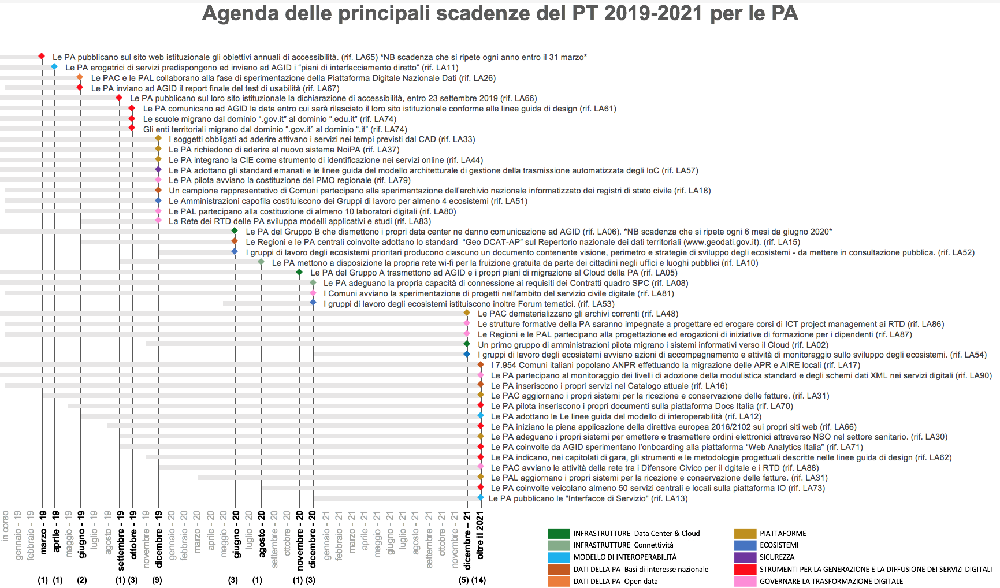

Indicazioni per le pubbliche amministrazioni
============================================

Il Piano Triennale per l’informatica nella PA 2019 - 2021 si propone di
proseguire nel percorso, intrapreso dal precedente Piano, di forte
coinvolgimento di tutte pubbliche amministrazioni nella realizzazione del
processo di digitalizzazione del Paese attraverso le azioni fin qui descritte e
le indicazioni e gli strumenti messi a disposizione da AGID.

Si ricorda che oltre agli strumenti di *procurement* tradizionale, le PA
potranno ricorrere a forme di collaborazione per accelerare i tempi di
realizzazione e diminuire i costi e i rischi di insuccesso. Le amministrazioni
che non sono nella condizione di raggiungere gli obiettivi nei tempi previsti,
potranno ricorrere alle seguenti forme alternative:

- accordi di collaborazione per la gestione dei servizi applicativi:
  partecipazione ad accordi di collaborazione tra amministrazioni che hanno
  deciso di condividere la realizzazione di piattaforme comuni; in questo caso
  ricadono gli accordi di collaborazione già operativi tra alcune regioni;

- soluzioni “sussidiarie”: utilizzo di soluzioni applicative “sussidiare”
  attraverso accordi tra le PA che hanno già sviluppato le iniziative
  strategiche e quelle ancora non operative; tali accordi, che potranno essere
  diversi e, a seconda del progetto, dovranno avere caratteristiche tali da
  garantirne la sostenibilità;

- utilizzo di soluzioni “in riuso”, in alternativa a quelle “sussidiarie”, nei
  casi in cui se ne sia stata valutata la convenienza;

- utilizzo di servizi infrastrutturali resi disponibili da altre
  amministrazioni.

Di seguito si riassumono tutte le azioni che vedono coinvolte le pubbliche
amministrazioni descritte in dettaglio nei capitoli precedenti.

Indicazioni relative alle Infrastrutture
----------------------------------------

.. rubric:: Dal 2019

**Cloud della PA**
  Le PA in fase di definizione di un nuovo progetto, e/o sviluppo di nuovi
  servizi, devono, in via prioritaria, valutare l’adozione del paradigma cloud
  prima di qualsiasi altra tecnologia secondo il Modello cloud della PA che
  contempla cloud di tipo pubblico, privato e ibrido. La valutazione sulla
  scelta della tipologia di modello cloud (pubblico, privato o ibrido) è guidata
  principalmente dalla finalità del servizio all’utente e dalla natura di dati
  trattati. Le PA devono altresì valutare e prevenire il rischio di lock-in
  verso il fornitore cloud.

  Le PA acquisiscono esclusivamente servizi cloud (IaaS/PaaS/SaaS) qualificati
  da AGID e pubblicati sul *Cloud Marketplace*.

  Le PA pilota individuate da AGID e Team per la trasformazione digitale
  eseguono i propri piani di migrazione dei sistemi informativi verso il Cloud
  della PA definiti nell’ambito del Programma nazionale di abilitazione di AGID.
  :ref:`LA02 <la02>`

**Data Center**
  I soggetti detentori delle infrastrutture fisiche delle PA appartenenti al
  Gruppo A pianificano, congiuntamente ad AGID e al Team per la trasformazione
  digitale, il consolidamento dei *data center* e la migrazione al Cloud della
  PA. :ref:`LA05 <la05>`

  Le PA con infrastrutture fisiche appartenenti al Gruppo B provvedono alla
  migrazione al Cloud della PA secondo quanto previsto dal Programma nazionale
  di abilitazione al Cloud della PA. :ref:`LA06 <la06>`

**Connettività**
  Le PA adeguano la propria capacità di connessione per garantire il completo
  dispiegamento dei servizi e delle piattaforme. :ref:`LA08 <la08>`

.. rubric:: 2020

**Data Center**
  Le PA del gruppo A trasmettono ad AGID i propri piani di migrazione al Cloud
  della PA. :ref:`LA05 <la05>`

  Le PA del Gruppo B che dismettono i propri data center ne danno comunicazione
  ad AGID. :ref:`LA06 <la06>`

**Connettività**
  Le PA mettono a disposizione la propria rete wi-fi per la fruizione gratuita
  da parte dei cittadini negli uffici e luoghi pubblici. :ref:`LA10 <la10>`

.. rubric:: 2021

**Cloud della PA**
  Le PA pilota concludono la migrazione verso il Cloud della PA dei propri
  sistemi informativi. :ref:`LA02 <la02>`

  Un altro gruppo di PA avvia la migrazione verso il Cloud della PA dei propri
  sistemi informativi. :ref:`LA02 <la02>`

**Connettività**
  Le sedi estere delle PA, a seguito dell’aggiudicazione della nuova gara da
  parte di Consip, avviano la migrazione e procedono all’utilizzo dei servizi
  della nuova S-RIPA. :ref:`LA09 <la09>`

Indicazioni relative al Modello di interoperabilità
---------------------------------------------------

.. rubric:: 2019

Le PA seguono le indicazioni contenute nelle “Linee guida per transitare al
nuovo modello di interoperabilità” emanate da AGID con Determina 219/2017, per
le piattaforme esistenti e per le attività progettuali in corso. :ref:`LA11
<la11>`

Per dismettere SP-Coop, le PA erogatrici di servizi predispongono e inviano ad
AGID i “piani di interfacciamento diretto” come descritto nelle “Indicazioni
operative per la migrazione dei servizi SP-Coop” in allegato al Piano Triennale.
:ref:`LA11 <la11>`

A partire dal 2019 - al termine del processo di emanazione da parte di AGID - le
PA adottano le Linee guida del modello di interoperabilità. :ref:`LA12 <la12>`

.. rubric:: 2021

Le PA pubblicano le “Interfacce di Servizio”. :ref:`LA13 <la13>`

Indicazioni relative ai Dati della PA
-------------------------------------

.. rubric:: 2019

**Basi di dati di interesse nazionale**
  Le PA inseriscono i propri servizi nel Catalogo (servizi.gov.it) :ref:`LA16
  <la16>`

  I Comuni italiani popolano ANPR effettuando la migrazione delle APR e AIRE
  locali. :ref:`LA17 <la17>`

  Un campione significativo di Comuni partecipa alla sperimentazione per
  realizzazione dell’archivio nazionale informatizzato dei registri di stato
  civile in ANPR. :ref:`LA18 <la18>`

  Le PA e i gestori di pubblici servizi seguono le indicazioni contenute nelle
  Linee Guida IPA. :ref:`LA19 <la19>`

**Riutilizzo dei dati (open data)**
  Le amministrazioni coinvolte, procedono alla raccolta di dati e informazioni
  utili all’indagine sul grado di maturità degli *open data* e lo stato di
  attuazione della direttiva PSI. :ref:`LA21 <la21>`

.. rubric:: 2020

**Basi di dati di interesse nazionale**
  Le PA titolari di basi di dati di interesse nazionale parte dei tavoli di
  lavoro congiunto con AGID redigono un documento programmatico per le linee di
  sviluppo per le basi dati di interesse nazionale. :ref:`LA14 <la14>`

  Le PA centrali coinvolte e le Regioni adottano lo standard “Geo DCAT-AP”.
  :ref:`LA15 <la15>`

**PDND**
  Le PA coinvolte definiscono le modalità di ingestione dei dati e di utilizzo
  della PDND consone alle proprie attività. :ref:`LA27 <la27>`

Indicazioni relative alle Piattaforme
-------------------------------------

.. rubric:: 2019

**Public e-procurement**
  Le stazioni appaltanti - PA aggiudicatrici ed enti aggiudicatori - adottano
  progressivamente le piattaforme telematiche. :ref:`LA28 <la28>`

  Le PA adeguano i propri sistemi per emettere e trasmettere ordini elettronici
  attraverso NSO nel settore sanitario. :ref:`LA30 <la30>`

  Le PA centrali adeguano lo SdI (Sistema di Interscambio) per gestire le
  fatture elettroniche in formato europeo. :ref:`LA31 <la31>`

**pagoPA**
  I soggetti obbligati ad aderire attivano i servizi nei tempi previsti dal CAD.
  :ref:`LA33 <la33>`

**SIOPE e SIOPE+**
  Le amministrazioni coinvolte aderiscono al sistema col supporto di MEF-RGS.
  :ref:`LA35 <la35>`

**NoiPA**
  Le PA non ancora aderenti al sistema procedono a comunicare la propria
  adesione al portale. :ref:`LA37 <la37>`

**SPID**
  Le PA implementano SPID, e permettono l’accesso ai propri servizi online con
  credenziali SPID.

**CIE**
  I consolati pilota accettano le richieste di CIE da parte degli italiani
  residenti all’estero. :ref:`LA42 <la42>`

**Sistema di gestione dei procedimenti amministrativi nazionali (SGPA)**
  Le PA centrali coinvolte adottano le nuove Linee Guida per la formazione,
  gestione e conservazione dei documenti informatici emanate da AGID. :ref:`LA45
  <la45>`

**Poli di conservazione**
  Le PA centrali procedono, progressivamente, alla dematerializzazione degli
  archivi correnti. :ref:`LA48 <la48>`

**ANPR**
  Le PA, i gestori dei servizi pubblici e le società a controllo pubblico
  stipulano accordi di servizio con il Ministero dell’Interno necessari alla
  circolarità anagrafica. :ref:`LA49 <la49>`

.. rubric:: 2020

**Public e-procurement**
  Le PA locali adeguano lo SDI (sistema di interscambio) per gestire le fatture
  elettroniche in formato europeo. :ref:`LA31 <la31>`

**NoiPA**
  Le PA migrano e adottano il sistema NoiPA secondo la programmazione concordata
  con il MEF. :ref:`LA37 <la37>`

**Sistema di gestione dei procedimenti amministrativi nazionali (SGPA)**
  Le PA coinvolte adottano in sussidiarietà i moduli di interoperabilità al fine
  di velocizzare la gestione digitale del documento amministrativo. :ref:`LA46
  <la46>`

Indicazioni relative agli Ecosistemi
------------------------------------

.. rubric:: 2019

Le amministrazioni capofila, per ogni ecosistema, costituiscono il Gruppo di
lavoro e convocano gli altri attori istituzionali coinvolti nello sviluppo
previsti dal Piano Triennale. :ref:`LA51 <la51>`

Il Gruppo di lavoro istituisce gli eventuali tavoli tecnici. :ref:`LA51 <la51>`

.. rubric:: 2020

Il Gruppo di lavoro predispone i meccanismi e gli strumenti di coinvolgimento
degli *stakeholder*, pubblici e privati, dell’ecosistema (es. audizioni) e,
raccolte le loro esigenze, definisce il perimetro di riferimento dell’ecosistema
e ne descrive la *vision* con le progettualità e gli interventi prioritari,
identificando i diversi soggetti pubblici e privati che dovranno essere
coinvolti. :ref:`LA52 <la52>`

Il Gruppo di lavoro pubblica in consultazione il documento contenente la
descrizione della *vision*, del perimetro e della strategia di sviluppo
dell’ecosistema. :ref:`LA52 <la52>`

Il Gruppo di lavoro supportato dai tavoli tecnici svolge l’analisi *As-Is*
dell’ecosistema. :ref:`LA53 <la53>`

Si identificano, attraverso il confronto con gli *stakeholder*, possibili
modelli di business e meccanismi di incentivazione, per favorire la diffusione e
l’adozione dei servizi digitali nell’ecosistema. :ref:`LA53 <la53>`

Il Gruppo di lavoro istituisce i forum tematici per il coinvolgimento e
l’ascolto degli *stakeholder.* :ref:`LA53 <la53>`

.. rubric:: 2021

Il Gruppo di lavoro e i tavoli tecnici supportano i diversi *stakeholder*
dell’ecosistema nello sviluppo delle loro progettualità e analizzano nuove
tecnologie, sistemi e servizi per l’evoluzione dell’ecosistema. :ref:`LA54
<la54>`

Si avviano le attività di monitoraggio e analisi del livello di attuazione degli
ecosistemi. :ref:`LA54 <la54>`

Proseguono le attività dei forum tematici. :ref:`LA54 <la54>`

Indicazioni relative alla Sicurezza informatica
-----------------------------------------------

.. rubric:: 2019

Le PA devono garantire la propria conformità alle “Misure minime per la
sicurezza ICT delle Pubbliche amministrazioni” di AGID.

Le PA, al fine di aderire all’architettura per la trasmissione automatizzata
degli IoC (indicatori di compromissione), adottano gli standard emanati da AGID
e predispongono un piano di adeguamento realizzando i servizi nel rispetto delle
linee guida. :ref:`LA57 <la57>`

Le PA adottano gli standard emanati da AGID e predispongono le proprie
infrastrutture all’utilizzo della piattaforma nazionale di trasmissione
automatizzata degli IoC. :ref:`LA58 <la58>`

Le PA monitorano e segnalano al CERT-PA gli incidenti informatici e ogni
situazione di potenziale rischio, utilizzando i canali di comunicazione sul sito
AGID. :ref:`LA59 <la59>`

.. rubric:: 2020

Le PA seguono le indicazioni contenute nelle linee guida di sicurezza
cibernetica emanate da AGID. :ref:`LA60 <la60>`

Indicazioni relative agli Strumenti per la generazione e la diffusione di servizi digitali
------------------------------------------------------------------------------------------

.. rubric:: 2019

**Designers Italia**
  Le PA centrali indicate nella Determinazione AGID n.36/2018 e non ancora
  aderenti alle Linee guida di design, nonché le PA regionali e locali,
  comunicano ad AGID la data entro cui termineranno i lavori di adeguamento dei
  loro siti web. :ref:`LA61 <la61>`

  Le PA, nei capitolati di gara relativi alla realizzazione di siti e servizi
  online, cominciano a indicare e adottare gli strumenti e le metodologie
  progettuali descritte nelle linee guida di design. :ref:`LA62 <la62>`

  I Comuni e le scuole coinvolti nella sperimentazione pilota con il Team per la
  trasformazione digitale, adottano il kit di design per i propri siti.
  :ref:`LA63 <la63>`

**Accessibilità**
  Le PA pubblicano sul sito web istituzionale gli obiettivi annuali di
  accessibilità (entro il 31 marzo di ogni anno) nella sezione “Amministrazione
  trasparente”. :ref:`LA64 <la64>`

  Le PA pubblicano sul loro sito istituzionale la dichiarazione di accessibilità
  (come previsto dalla Direttiva europea 2016/2102 sull’accessibilità dei siti
  web). :ref:`LA65 <la65>`

  Le PA seguono le nuove prescrizioni in materia di accessibilità per i siti web
  pubblicati dal 23 settembre 2018, a decorrere dal 23 settembre 2019.
  :ref:`LA65 <la65>`

**Usabilità**
  Le PA centrali elencate nella Determinazione AGID n.36/2018 e le
  amministrazioni regionali effettuano dei test di usabilità e inviano ad AGID
  il report finale. :ref:`LA66 <la66>`

**Docs Italia**
  Le pubbliche amministrazioni pilota cominciano ad utilizzare la piattaforma
  Docs Italia per la pubblicazione dei documenti relativi all’attuazione
  dell’Agenda digitale. :ref:`LA69 <la69>`

**Web Analytics Italia**
  Le amministrazioni coinvolte nel progetto pilota effettuano l’analisi dei siti
  web o servizi digitali di propria competenza. :ref:`LA70 <la70>`

**La riorganizzazione del dominio “.gov.it”**
  Le scuole effettuano la migrazione verso il dominio “edu.it” e gli enti
  territoriali verso il dominio “.it” attraverso il portale del CNR,
  Registro.it. :ref:`LA73 <la73>`

.. rubric:: 2020

**Accessibilità**
  Le PA seguono le nuove prescrizioni in materia di accessibilità per i siti web
  pubblicati prima del 23 settembre 2018, a decorrere dal 23 settembre 2020.
  :ref:`LA65 <la65>`

**“IO”: l’app per l’accesso ai servizi digitali della PA**
  Le PA coinvolte veicolano almeno 50 servizi centrali e locali. :ref:`LA72
  <la72>`

.. rubric:: 2021

**Accessibilità**
  Le PA seguono le nuove prescrizioni in materia di accessibilità per le app
  mobile, a decorrere dal 23 giugno 2021. :ref:`LA65 <la65>`

Indicazioni relative ai Modelli e strumenti per l’innovazione
-------------------------------------------------------------

.. rubric:: 2019

**La piattaforma per il procurement dell’innovazione**
  A partire dal 2019 - per il triennio - le PA utilizzano le pratiche per
  appalti di innovazione :ref:`LA76 <la76>`

**Smart Landscape**
  Le PA stipulano accordi di collaborazione ex articolo 15 l.241/90 :ref:`LA77
  <la77>`

Indicazioni relative al Governare la trasformazione digitale
------------------------------------------------------------

.. rubric:: 2019

**Le leve per il coordinamento sul territorio**
  Le PA pilota avviano la costituzione del PMO regionale :ref:`LA79 <la79>`

  Le PA locali e loro aggregazioni partecipano ai laboratori digitali definiti
  dal Dipartimento della Funzione Pubblica e da AGID. :ref:`LA80 <la80>`

**Il Responsabile della transizione alla modalità digitale (RTD)**
  I RTD di PA Centrali, Regioni, Città Metropolitane e relativi Comuni capoluogo
  partecipano alle attività della conferenza permanente costituita e guidata da
  AGID. :ref:`LA82 <la82>`

  La Rete dei RTD sviluppa modelli applicativi e studi e promuove incontri ed
  eventi di formazione e divulgazione. :ref:`LA83 <la83>`

**Monitoraggio**
  Le amministrazioni coinvolte, partecipano al confronto nell’ambito
  “dell’osservatorio sul monitoraggio” per il consolidamento della metodologia.
  :ref:`LA84 <la84>`

  Le amministrazioni coinvolte partecipano alla sperimentazione del modello di
  monitoraggio per la raccolta dei dati utili al calcolo degli indicatori.
  :ref:`LA85 <la85>`

**Il rafforzamento delle competenze**
  A partire dal 2019 - per il triennio - tutte le strutture formative della PA
  saranno impegnate a progettare ed erogare corsi dedicati ai Responsabili della
  transizione al digitale, corsi di approfondimento sui temi del Piano Triennale
  e sulla reingegnerizzazione dei processi. :ref:`LA86 <la86>`

  Le strutture formative delle PA dovranno realizzare, nel triennio, almeno 50
  iniziative di formazione di base e di formazione specialistica per i
  dipendenti delle PA. :ref:`LA87 <la87>`

**Prime iniziative verso cittadini e imprese**
  Le amministrazioni interessate pubblicano sui propri siti web la nuova
  modulistica standardizzata e utilizzano schemi dati XML all’interno dei propri
  servizi digitali. :ref:`LA90 <la90>`

.. rubric:: 2020

**Le leve per il coordinamento sul territorio**
  I Comuni inseriscono progetti di trasformazione digitale e di formazione sul
  digitale all’interno dei bandi per il servizio civile. :ref:`LA81 <la81>`

**Prime iniziative verso cittadini e imprese**
  I Responsabili per la transizione digitale delle PA centrali e il Difensore
  Civico di AGID avviano le attività di sperimentazione di una rete sinergica.
  :ref:`LA88 <la88>`

Nella figura 13.1 sono riportati i tempi delle principali scadenze per le PA
contenute nelle linee d’azione del PT 2019-21. Per ogni scadenza è presente il
riferimento al macro ambito della Mappa del modello strategico e alla linea
d’azione.

   Agenda delle principali scadenze del PT 2019 - 2021 per le PA
