Allegato 2 - Rilevazione spesa ICT della PA 2018 - Report di sintesi
====================================================================

A2.1 Nota Metodologica
----------------------

La Rilevazione sulla spesa ICT della Pubblica Amministrazione che ha
accompagnato la redazione del Piano Triennale 2019 - 2021 si basa sulle seguenti
assunzioni:

- contesto di riferimento:

   - Piano Triennale ICT per l’informatica nella Pubblica Amministrazione
     2017 - 2019;
   - Documento di Strategia per la Crescita Digitale;
   - Codice Amministrazione Digitale (CAD), articolo 14 bis;
   - Legge di stabilità 2016, articolo 1 commi 510-516;

- criterio di classificazione dei costi: le macro voci e le voci sono
  individuate in maniera omogenea per tutte le Pubbliche Amministrazioni a
  partire dal glossario dei codici gestionali SIOPE per Regioni e enti locali,
  versione 2017;

- criterio di imputazione dei costi: competenza finanziaria «potenziata» per il
  consuntivo 2016, quindi i mandati con Esercizio Provenienza Finanziaria 2016;
  competenza economica per gli anni 2017 - 2019, in particolare per il 2017 è
  stato richiesto di indicare gli impegni, mentre per il biennio 2018 - 2019 i
  dati previsionali.

Per facilitarne la compilazione, il questionario è stato configurato su una
piattaforma *on line* e, a supporto degli Enti coinvolti, sono stati predisposti
un manuale utente con i dettagli sulle funzionalità e un servizio di help desk.

Nel periodo ottobre - dicembre 2017 è stata realizzata una fase di
sperimentazione dell’attività di rilevazione coinvolgendo un gruppo pilota di
Enti, rappresentativo delle diverse tipologie che costituiscono il *panel*,
composto da due Amministrazioni centrali, quattro Amministrazioni regionali e
quattro Città Metropolitane, con l’obiettivo di condividere la modalità di
raccolta e verificare l’esaustività del questionario predisposto per la raccolta
dei dati.

La sperimentazione ha previsto più incontri con ogni Ente del gruppo pilota,
grazie ai quali è stato possibile validare la struttura del questionario
proposta, nonché integrare e migliorare il questionario nei contenuti specifici.

La fase di raccolta dati è terminata a marzo 2018, a cui ha fatto seguito una
fase di verifica e consolidamento, per la quale sono stati predisposti report
monografici per la validazione e eventuale integrazione da parte degli Enti
coinvolti.

Struttura del questionario, articolato in 5 sezioni:

1. **Informazioni generali**: dati relativi all’anagrafica dell’Ente e
all’organizzazione interna della funzione ICT al 31/12/2016 e, ove disponibili,
anche per il triennio 2017 - 2019, relative alla dimensione dell’Ente.

2. **Natura e strumenti d’acquisto**: dati relativi alla spesa annuale ICT
suddivisi per

  a. natura, in funzione di categorie e macro categorie definite a partire dal
  glossario dei codici gestionali SIOPE per Regioni e enti locali versione 2017;

  b. canale d’acquisto, tra spesa tramite strumenti Consip/Centrali di
  Committenza e spesa fuori Consip/Centrali di Committenza.

  All’interno di ciascun quesito, la Spesa ICT della Pubblica Amministrazione
  viene articolata in macro categorie per natura di costo:

  - **spesa Capex (spesa di investimenti in innovazione tecnologica)**

    - Acquisti hardware:

      - client PC Desktop, notebook;
      - tablet e apparati telefonici;
      - stampanti e fotocopiatrici;
      - apparati di rete;
      - server e relative componenti;
      - impianti e macchinari;
      - altro hardware.

    - Acquisti servizi di sviluppo software:

      - applicativi generici;
      - pacchetti software disponibili sul mercato;
      - applicativi contact center;
      - applicativi CRM.

  - **spesa Opex (spesa per il mantenimento e la gestione operativa delle
    tecnologie)**

    - Acquisti licenza:

      - licenze software standard e commerciali;
      - licenze software sviluppati ad hoc.

    - Manutenzioni hardware/software e assistenza/presidi applicativi:

      - manutenzione macchine d’ufficio, attrezzature e global service IT;
      - gestione e manutenzione software.

    - Acquisti altri servizi:

      - noleggio macchinari;
      - servizi cloud (utenze e canoni, accesso a banche dati e a pubblicazioni
        on line);
      - servizi cloud (canoni per progetti in partenariato pubblico-privato e
        canoni servizi);
      - servizi di telefonia fissa;
      - servizi di telefonia mobile;
      - servizi connettività fonia e dati;
      - servizi di consulenza direzionale, governance e PMO;
      - interoperabilità e cooperazione;
      - formazione ICT;
      - altri servizi rete e VoIP;
      - altri servizi sicurezza;
      - altri servizi gestione documentale;
      - altri servizi ICT.

3. **Finalità e ambiti**: dati di spesa, suddivisi in base alle macro categorie
   indicate nella sezione “*Natura e strumenti d’acquisto*”, rispetto ai
   componenti del “Modello strategico di evoluzione del sistema informativo
   della P.A.” del Piano Triennale.

4. **Progetti**: dati sulla spesa progettuale ICT riferiti ai progetti di
   dimensione economica più rilevante, sopra la soglia comunitaria, o, se
   inferiori alla soglia, coerenti con i contenuti del Piano Triennale 2017 -
   2019. Nella sezione “Progetti” è stato richiesto all’Ente di inserire i
   progetti (massimo 40) con scadenza nel secondo semestre 2018 o in fase
   d’avvio, Per i progetti in corso relativi all’adeguamento alle piattaforme
   abilitanti è stato richiesto l’inserimento a prescindere dalla conclusione
   successiva al 2018.

5. **Gare**: dati sulle principali gare ICT (massimo 15) sopra soglia
   comunitaria da bandire o in fase di definizione.

Per determinare il totale della spesa di ciascun Ente sono stati elaborati
esclusivamente i dati inseriti nella sezione 2 “Natura e strumenti d’acquisto”.
Mentre i dati e le informazioni delle altre sezioni sono stati utilizzati per le
elaborazioni quali-quantitative, relative alla progettualità di ciascun Ente
rispetto ai contenuti del Modello strategico e in generale funzionali alla
stesura del presente Piano triennale.

I dati e le informazioni così raccolti sono stati standardizzati e resi
omogenei, prima di essere sintetizzati nelle seguenti tavole e figure. Si
sottolinea che nelle elaborazioni dei circa 800 progetti segnalati dalle PA, il
livello minimo di omogeneità dei dati forniti è stato raggiunto per 706,
ricompresi nelle analisi.

A2.2 Figure e tavole
--------------------

Tavola 1.  Informazioni generali
~~~~~~~~~~~~~~~~~~~~~~~~~~~~~~~~

Dati relativi all’anagrafica dell’Ente e all’organizzazione interna della
funzione ICT

+------------------------------+------+------+------+------+
| Personale non dipendente ICT / Personale ICT             |
+------------------------------+------+------+------+------+
| Tipologia ente               | 2016 | 2017 | 2018 | 2019 |
+==============================+======+======+======+======+
| Amministrazioni centrali     | 9%   | 8%   | 10%  | 12%  |
+------------------------------+------+------+------+------+
| Regioni                      | 43%  | 45%  | 51%  | 51%  |
+------------------------------+------+------+------+------+
| Amministrazioni locali       | 12%  | 3%   | 3%   | 3%   |
+------------------------------+------+------+------+------+

Figura 1. Spesa ICT per tipologia Capex/Opex
~~~~~~~~~~~~~~~~~~~~~~~~~~~~~~~~~~~~~~~~~~~~

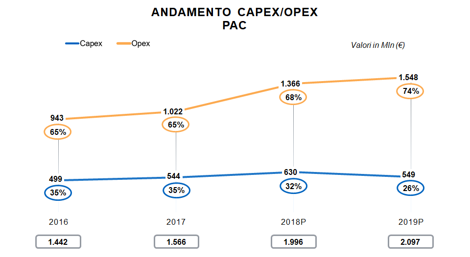
         pubblica amministrazione centrale. Nel 2016 la spesa opex era pari al
         65 per cento mentre la spesa capex era pari al 35 per cento, per un
         totale di 1.442 milioni di euro. Nel 2017 la spesa opex era pari al 65
         per cento mentre la spesa capex era pari al 35 per cento, per un totale
         di 1.566 milioni di euro. Nel 2018 la spesa opex era pari al 68 per
         cento mentre la spesa capex era pari al 32 per cento, per un totale di
         1.996 milioni di euro. Nel 2019  la spesa previsionale opex è pari al
         74 per cento mentre la spesa previsionale capex è pari al 26 per cento,
         per un totale stimato di 2.097 milioni di euro.

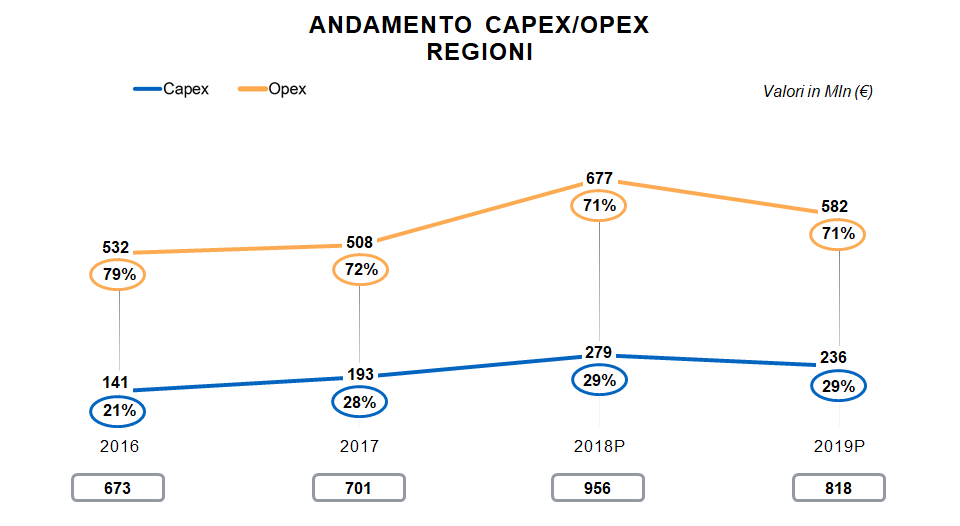
         regioni. Nel 2016 la spesa opex era pari al 79 per cento mentre la
         spesa capex era pari al 21 per cento, per un totale di 673 milioni di
         euro. Nel 2017 la spesa opex era pari al 72 per cento mentre la spesa
         capex era pari al 28 per cento, per un totale di 701 milioni di euro.
         Nel 2018 la spesa opex era pari al 71 per cento mentre la spesa capex
         era pari al 29 per cento, per un totale di 956 milioni di euro. Nel
         2019  la spesa previsionale opex è pari al 71 per cento mentre la spesa
         previsionale capex è pari al 29 per cento, per un totale stimato di 818
         milioni di euro.

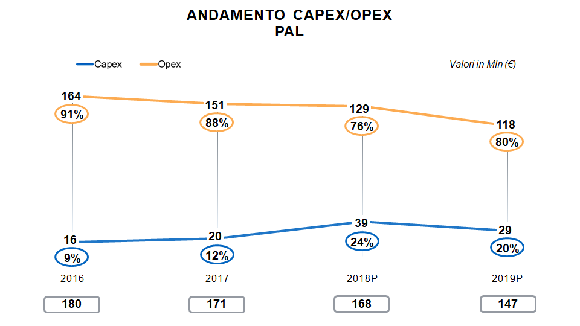
         amministrazioni locali. Nel 2016 la spesa opex era pari al 91 per cento
         mentre la spesa capex era pari al 9 per cento, per un totale di 180
         milioni di euro. Nel 2017 la spesa opex era pari al 88 per cento mentre
         la spesa capex era pari al 12 per cento, per un totale di 171 milioni
         di euro. Nel 2018 la spesa opex era pari al 76 per cento mentre la
         spesa capex era pari al 24 per cento, per un totale di 168 milioni di
         euro. Nel 2019  la spesa previsionale opex è pari al 80 per cento
         mentre la spesa previsionale capex è pari al 20 per cento, per un
         totale stimato di 147 milioni di euro.

Figura 2. Composizione spesa ICT per canale d’acquisto
~~~~~~~~~~~~~~~~~~~~~~~~~~~~~~~~~~~~~~~~~~~~~~~~~~~~~~

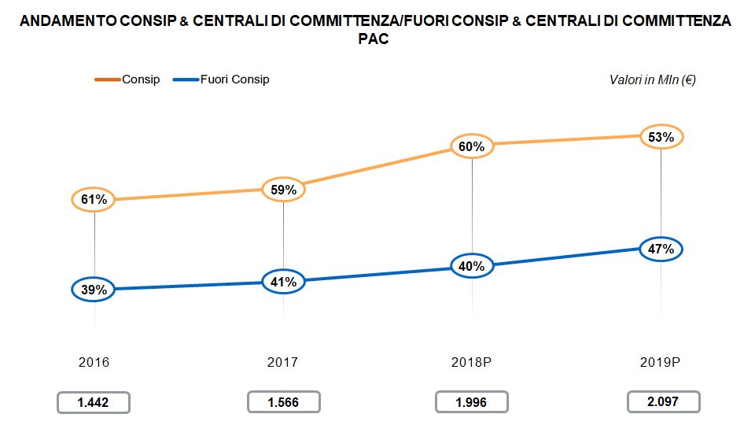
         consip nella amministrazioni centrali. Nel 2016 la spesa consip era
         pari al 61 per cento mentre la spesa fuori consip era pari al 39 per
         cento, per un totale di 1.442 milioni di euro. Nel 2017 la spesa consip
         era pari al 59 per cento mentre la spesa fuori consip era pari al 41
         per cento, per un totale di 1.556 milioni di euro. Nel 2018 la spesa
         consip era pari al 60 per cento mentre la spesa fuori consip era pari
         al 40 per cento, per un totale di 1.996 milioni di euro. Nel 2019 la
         spesa previsionale consip è pari al 53 per cento mentre la spesa
         previsionale fuori consip è pari al 47 per cento, per un totale stimato
         di 2.097 milioni di euro.

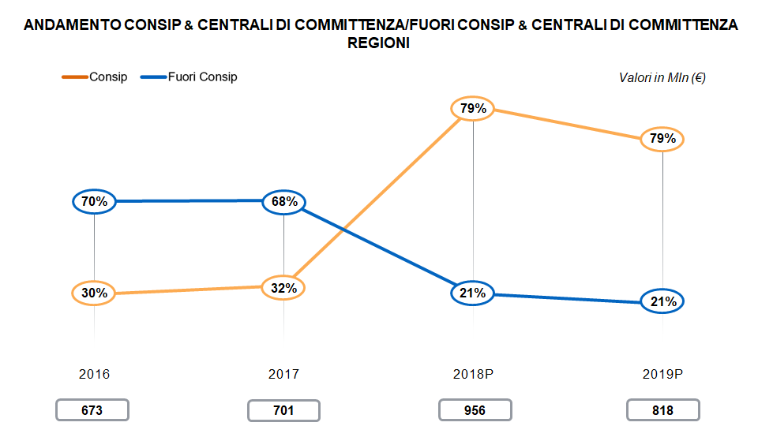
         consip nelle regioni. Nel 2016 la spesa consip era pari al 30 per cento
         mentre la spesa fuori consip era pari al 70 per cento, per un totale di
         673 milioni di euro. Nel 2017 la spesa consip era pari al 32 per cento
         mentre la spesa fuori consip era pari al 68 per cento, per un totale di
         701 milioni di euro. Nel 2018 la spesa consip era pari al 79 per cento
         mentre la spesa fuori consip era pari al 21 per cento, per un totale di
         956 milioni di euro. Nel 2019 la spesa previsionale consip è pari al 79
         per cento mentre la spesa previsionale fuori consip è pari al 21 per
         cento, per un totale stimato di 818 milioni di euro.

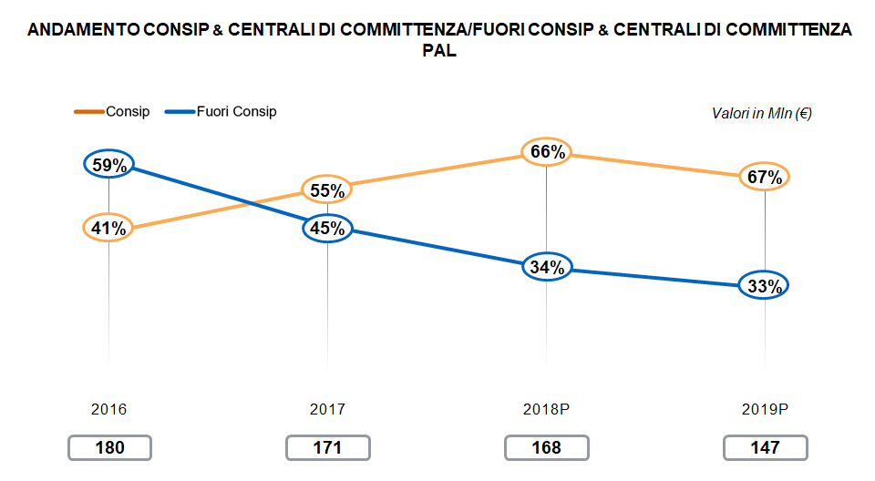
         consip nelle amministrazioni locali. Nel 2016 la spesa consip era pari
         al 41 per cento mentre la spesa fuori consip era pari al 59 per cento,
         per un totale di 180 milioni di euro. Nel 2017 la spesa consip era pari
         al 55 per cento mentre la spesa fuori consip era pari al 45 per cento,
         per un totale di 171 milioni di euro. Nel 2018 la spesa consip era pari
         al 66 per cento mentre la spesa fuori consip era pari al 34 per cento,
         per un totale di 168 milioni di euro. Nel 2019 la spesa previsionale
         consip è pari al 67 per cento mentre la spesa previsionale fuori consip
         è pari al 33 per cento, per un totale stimato di 147 milioni di euro.

Figura 3. Distribuzione dei progetti ICT delle PA per tipologia
~~~~~~~~~~~~~~~~~~~~~~~~~~~~~~~~~~~~~~~~~~~~~~~~~~~~~~~~~~~~~~~

**Amministrazioni centrali**

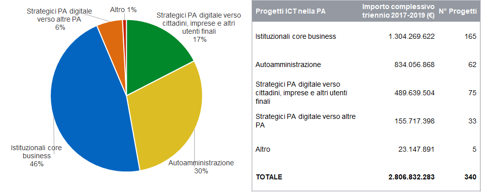
         termini percentuali dei 340 progetti delle amministrazioni centrali
         secondo la seguente classificazione: autoamministrazione 30%,
         istituzionali  core business 46%, strategici PA digitale verso altre PA
         6%, strategici PA verso cittadini, imprese e altri utenti finali 17%,
         altro 1%. L’importo complessivo per il triennio 2017-2019 è pari 2,8
         miliardi di euro.

**Regioni**

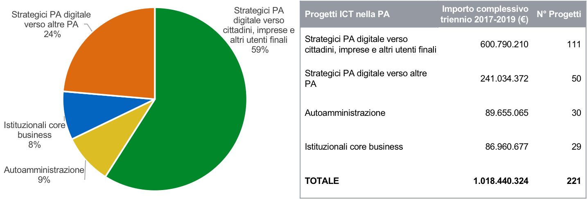
         termini percentuali dei 221 progetti delle regioni secondo la seguente
         classificazione: autoamministrazione 9%, istituzionali core business
         8%, strategici PA digitale verso altre PA 24%, strategici PA verso
         cittadini, imprese e altri utenti finali 59%. L’importo complessivo per
         il triennio 2017-2019 è pari a poco più di 1 miliardo di euro.

**Amministrazioni locali**

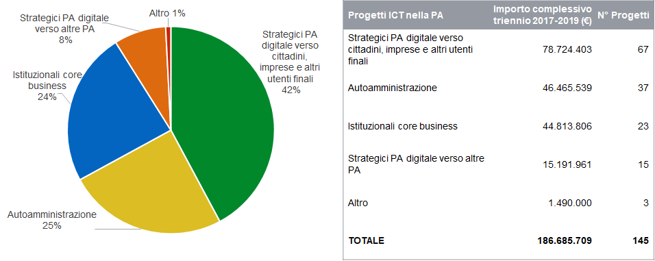
         termini percentuali dei 221 progetti delle regioni secondo la seguente
         classificazione: autoamministrazione 9%, istituzionali core business
         8%, strategici PA digitale verso altre PA 24%, strategici PA verso
         cittadini, imprese e altri utenti finali 59%. L’importo complessivo per
         il triennio 2017-2019 è pari a poco più di 1 miliardo di euro.

Figura 4. Distribuzione dei progetti ICT delle PA per macro ambiti del Modello strategico
~~~~~~~~~~~~~~~~~~~~~~~~~~~~~~~~~~~~~~~~~~~~~~~~~~~~~~~~~~~~~~~~~~~~~~~~~~~~~~~~~~~~~~~~~

**Amministrazioni centrali**

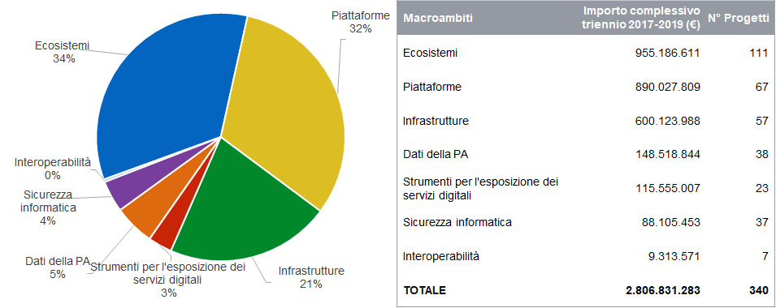
         termini percentuali dei 340 progetti delle amministrazioni centrali
         rispetto ai macro ambiti del Modello Strategico: ecosistemi 34%,
         infrastrutture 21%, piattaforme 32%, dati della PA 5%, strumenti per
         l’esposizione dei servizi digitali 3%, sicurezza informatica 4% e
         interoperabilità 1%.

**Regioni**

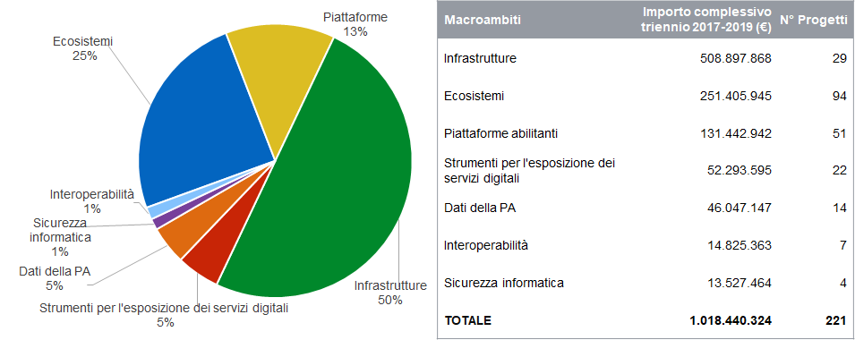
         termini percentuali dei 221 progetti delle regioni rispetto ai macro
         ambiti del Modello Strategico: ecosistemi 25%, infrastrutture 50%,
         piattaforme 13%, dati della PA 5%, strumenti per l’esposizione dei
         servizi digitali 5%, sicurezza informatica 1% e interoperabilità 1%.

**Amministrazioni locali**

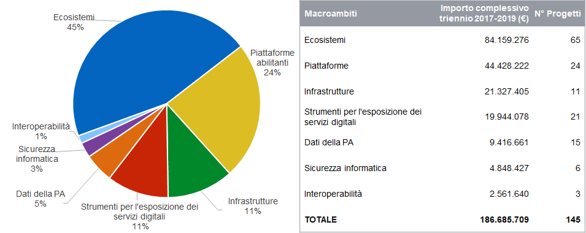
         termini percentuali dei 145 progetti delle amministrazioni locali
         rispetto ai macro ambiti del Modello Strategico: ecosistemi 45%,
         infrastrutture 11%, piattaforme 24%, dati della PA 5%, strumenti per
         l’esposizione dei servizi digitali 11%, sicurezza informatica 3% e
         interoperabilità 1%.

Figura 5. Dettaglio distribuzione dei progetti amministrazioni centrali, Regioni, amministrazioni locali per ciascun Ecosistema
~~~~~~~~~~~~~~~~~~~~~~~~~~~~~~~~~~~~~~~~~~~~~~~~~~~~~~~~~~~~~~~~~~~~~~~~~~~~~~~~~~~~~~~~~~~~~~~~~~~~~~~~~~~~~~~~~~~~~~~~~~~~~~~

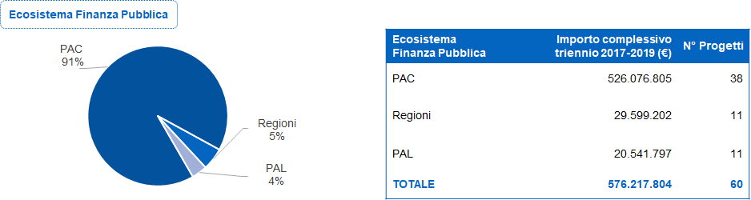
         della spesa progettuale per il macroambito Ecosistema finanza pubblica.
         Su un importo complessivo di oltre 576 milioni di euro per 60 progetti
         la spesa è cosi distribuita: 91% amministrazioni centrali, 5% regioni,
         4% amministrazioni locali.

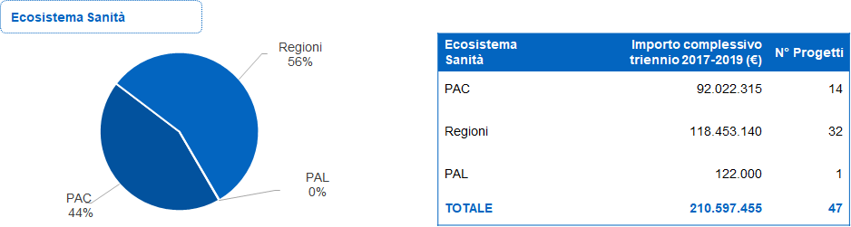
         della spesa progettuale per il macroambito Ecosistema sanità. Su un
         importo complessivo di oltre 210 milioni di euro per 47 progetti la
         spesa è cosi distribuita: 44% amministrazioni centrali, 55% regioni, 1%
         amministrazioni locali.

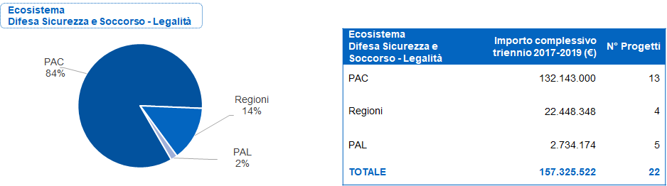
         della spesa progettuale per il macroambito Ecosistema difesa, sicurezza
         e soccorso. Su un importo complessivo di oltre 157 milioni di euro per
         22 progetti la spesa è cosi distribuita: 84% amministrazioni centrali,
         14% regioni, 2% amministrazioni locali.

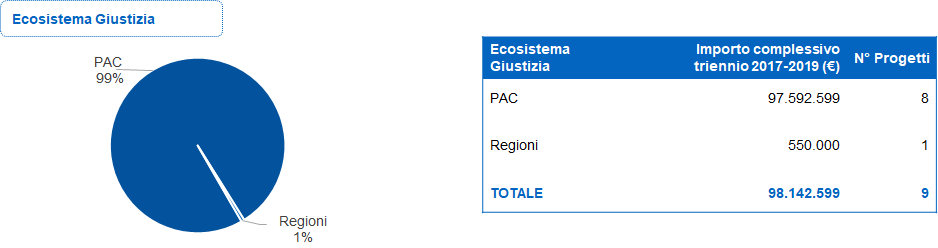
         della spesa progettuale per il macroambito Ecosistema giustizia. Su un
         importo complessivo di oltre 98 milioni di euro per 9 progetti la spesa
         è cosi distribuita: 99% amministrazioni centrali, 1% regioni.

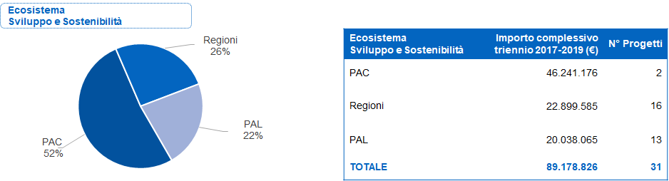
         della spesa progettuale per il macroambito Ecosistema sviluppo e
         sostenibilità. Su un importo complessivo di oltre 89 milioni di euro
         per 31 progetti la spesa è cosi distribuita: 52% amministrazioni
         centrali, 26% regioni, 22% amministrazioni locali.

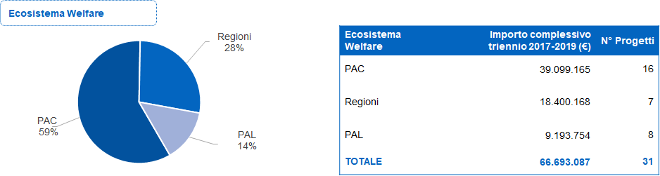
         della spesa progettuale per il macroambito Ecosistema welfare. Su un
         importo complessivo di oltre 66 milioni di euro per 31 progetti la
         spesa è cosi distribuita: 58% amministrazioni centrali, 28% regioni,
         14% amministrazioni locali.

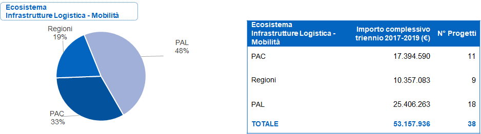
         della spesa progettuale per il macroambito Ecosistema infrastrutture
         logistica-mobilità. Su un importo complessivo di oltre 53 milioni di
         euro per 38 progetti la spesa è cosi distribuita: 33% amministrazioni
         centrali, 19% regioni, 48% amministrazioni locali.

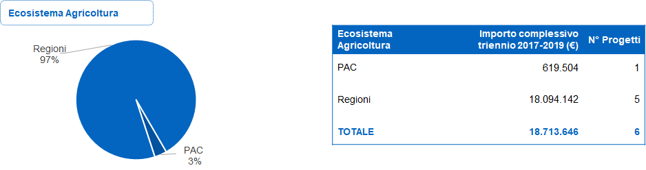
         della spesa progettuale per il macroambito Ecosistema agricoltura. Su
         un importo complessivo di oltre 18 milioni di euro per 6 progetti la
         spesa è cosi distribuita: 3% amministrazioni centrali, 97% regioni.

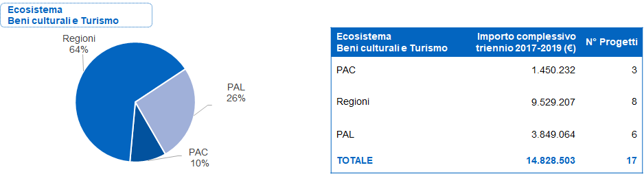
         della spesa progettuale per il macroambito Ecosistema beni culturali e
         turismo. Su un importo complessivo di quasi 15 milioni di euro per 17
         progetti la spesa è cosi distribuita: 10% amministrazioni centrali, 64%
         regioni, 26% amministrazioni locali.

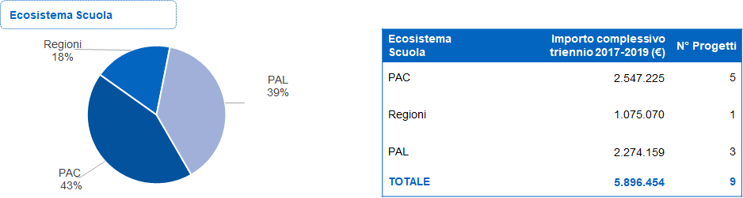
         della spesa progettuale per il macroambito Ecosistema scuola. Su un
         importo complessivo di quasi 6 milioni di euro per 9 progetti la spesa
         è cosi distribuita: 43% amministrazioni centrali, 18% regioni, 39%
         amministrazioni locali.

Figura 6. Dettaglio distribuzione dei progetti del macro ambito “Infrastrutture”
~~~~~~~~~~~~~~~~~~~~~~~~~~~~~~~~~~~~~~~~~~~~~~~~~~~~~~~~~~~~~~~~~~~~~~~~~~~~~~~~

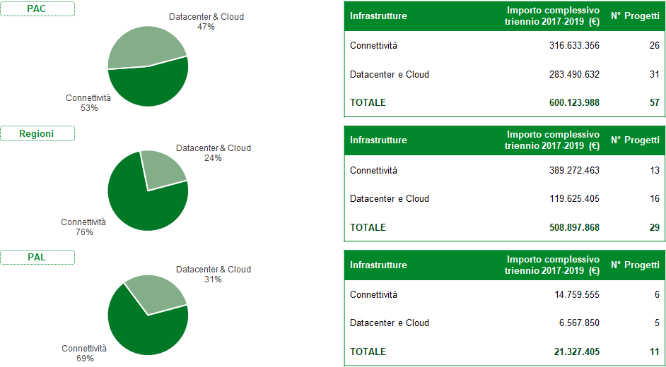
         Amministrazione sulla distribuzione dei progetti del Macroambito
         Infrastrutture. Nel caso delle amministrazioni centrali su un importo
         complessivo di oltre 600 milioni di euro per 57 progetti la spesa è
         cosi distribuita: 53% connettività e 47% data center e cloud. Nel caso
         delle Regioni su un importo complessivo di quasi 509 milioni di euro
         per 29 progetti la spesa è cosi distribuita: 76% connettività e 24%
         data center e cloud. Nel caso delle amministrazioni locali su un
         importo complessivo di oltre 21 milioni di euro per 11 progetti la
         spesa è cosi distribuita: 69% connettività e 31% data center e cloud.

Figura 7. Dettaglio distribuzione dei progetti del macro ambito “Dati della PA”
~~~~~~~~~~~~~~~~~~~~~~~~~~~~~~~~~~~~~~~~~~~~~~~~~~~~~~~~~~~~~~~~~~~~~~~~~~~~~~~

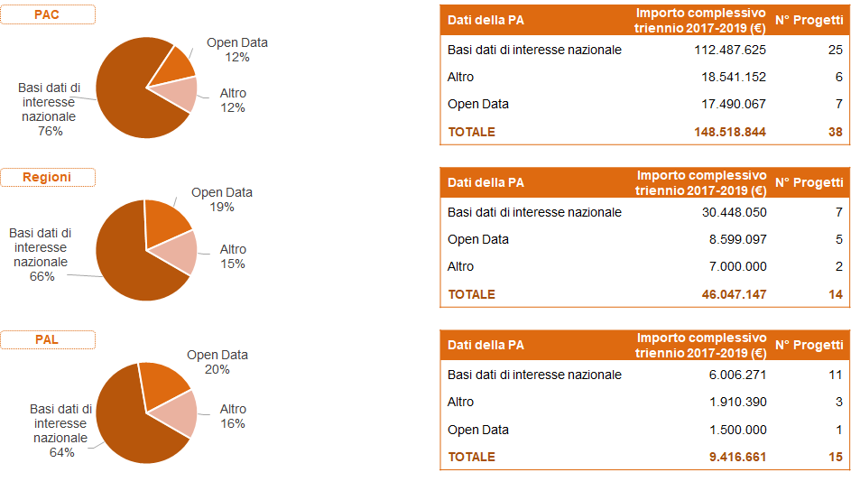
         distribuzione dei progetti del Macroambito “Infrastrutture”. Nel caso
         delle amministrazioni centrali su un importo complessivo di oltre 148
         milioni di euro per 38 progetti la spesa è cosi distribuita: 76% basi
         di interesse nazionale, 12% open data 12% e 12% altro. Nel caso delle
         Regioni, su un importo complessivo di oltre 46 milioni di euro per 14
         progetti la spesa è cosi distribuita: 66% basi di interesse nazionale,
         19% open data 19% e 15% altro. Nel caso delle amministrazioni locali su
         un importo complessivo di oltre 9 milioni di euro per 15 progetti la
         spesa è cosi distribuita: 64% basi di interesse nazionale, 20% open
         data e 16% altro.

Tavola 2. Dettaglio distribuzione dei progetti delle amministrazioni centrali per macro ambito del Modello strategico
~~~~~~~~~~~~~~~~~~~~~~~~~~~~~~~~~~~~~~~~~~~~~~~~~~~~~~~~~~~~~~~~~~~~~~~~~~~~~~~~~~~~~~~~~~~~~~~~~~~~~~~~~~~~~~~~~~~~~

+-------------------------------------------------------------------------------+-----+------------------+-----+----------------+-----+------------------+-----+------------------+-----+------------------+-----+------------------+-----+-----------------+---------+--------------------+
| Amministrazioni centrali                                                      | Infrastrutture         | Interoperabilità     | Dati della PA          | Piattaforme            | Ecosistemi             | Sicurezza informatica  | Strumenti per         | \N.     | Importo totale     |
|                                                                               |                        |                      |                        |                        |                        |                        | l’esposizione dei     | totale  |                    |
|                                                                               |                        |                      |                        |                        |                        |                        | servizi digitali      |         |                    |
+                                                                               +-----+------------------+-----+----------------+-----+------------------+-----+------------------+-----+------------------+-----+------------------+-----+-----------------+         +                    +
|                                                                               | \N. | Importo          | \N. | Importo        | \N. | Importo          | \N. | Importo          | \N. | Importo          | \N. | Importo          | \N. | Importo         |         |                    |
+===============================================================================+=====+==================+=====+================+=====+==================+=====+==================+=====+==================+=====+==================+=====+=================+=========+====================+
| ACI                                                                           | 1   | 1.730.000,00 €   | 0   | \-  €          | 3   | 1.539.692,00 €   | 1   | 771.000,00 €     | 3   | 4.333.705,00 €   | 0   | \-  €            | 5   | 3.399.911,00 €  | 13      | 11.774.308,00 €    |
+-------------------------------------------------------------------------------+-----+------------------+-----+----------------+-----+------------------+-----+------------------+-----+------------------+-----+------------------+-----+-----------------+---------+--------------------+
| Agenzia del Demanio                                                           | 1   | 150.000,00 €     | 0   | \-  €          | 0   | \-  €            | 2   | 2.067.117,00 €   | 0   | \-  €            | 2   | 164.000,00 €     | 3   | 356.399,00 €    | 8       | 2.737.516,00 €     |
+-------------------------------------------------------------------------------+-----+------------------+-----+----------------+-----+------------------+-----+------------------+-----+------------------+-----+------------------+-----+-----------------+---------+--------------------+
| Agenzia delle Dogane e dei Monopoli                                           | 6   | 97.978.892,00 €  | 0   | \-  €          | 1   | 3.388.429,00 €   | 8   | 19.100.045,00 €  | 18  | 94.313.861,00 €  | 2   | 16.500.138,00 €  | 3   | 4.279.651,00 €  | 38      | 235.561.016,00 €   |
+-------------------------------------------------------------------------------+-----+------------------+-----+----------------+-----+------------------+-----+------------------+-----+------------------+-----+------------------+-----+-----------------+---------+--------------------+
| Agenzia delle Entrate                                                         | 0   | \-  €            | 0   | \-  €          | 3   | 46.707.128,93 €  | 3   | 78.476.098,83 €  | 4   | 297.668.269,21 € | 1   | 36.493.547,00 €  | 2   | 19.732.973,00 € | 13      | 479.078.016,97 €   |
+-------------------------------------------------------------------------------+-----+------------------+-----+----------------+-----+------------------+-----+------------------+-----+------------------+-----+------------------+-----+-----------------+---------+--------------------+
| Agenzia delle Entrate  Riscossione                                            | 2   | 4.258.182,00 €   | 1   | 253.524,00 €   | 2   | 150.000,00 €     | 8   | 18.795.731,00 €  | 10  | 90.331.038,00 €  | 1   | 8.658.716,00 €   | 5   | 16.633.560,00 € | 29      | 139.080.751,00 €   |
+-------------------------------------------------------------------------------+-----+------------------+-----+----------------+-----+------------------+-----+------------------+-----+------------------+-----+------------------+-----+-----------------+---------+--------------------+
| Istituto Nazionale per l’Assicurazione contro gli Infortuni sul Lavoro  INAIL | 5   | 21.581.004,00 €  | 0   | \-  €          | 2   | 2.142.249,00 €   | 7   | 5.945.786,00 €   | 9   | 9.436.871,00 €   | 5   | 1.434.000,00 €   | 4   | 2.540.189,00 €  | 32      | 43.080.099,00 €    |
+-------------------------------------------------------------------------------+-----+------------------+-----+----------------+-----+------------------+-----+------------------+-----+------------------+-----+------------------+-----+-----------------+---------+--------------------+
| Istituto Nazionale Previdenza Sociale  INPS                                   | 0   | \-  €            | 0   | \-  €          | 1   | 990.500,00 €     | 2   | 3.061.200,00 €   | 1   | 22.295.820,00 €  | 0   | \-  €            | 0   | \-  €           | 4       | 26.347.520,00 €    |
+-------------------------------------------------------------------------------+-----+------------------+-----+----------------+-----+------------------+-----+------------------+-----+------------------+-----+------------------+-----+-----------------+---------+--------------------+
| Ministero degli Affari Esteri e della Cooperazione Internazionale             | 0   | \-  €            | 0   | \-  €          | 1   | 43.406,00 €      | 0   | \-  €            | 0   | \-  €            | 0   | \-  €            | 0   | \-  €           | 1       | 43.406,00 €        |
+-------------------------------------------------------------------------------+-----+------------------+-----+----------------+-----+------------------+-----+------------------+-----+------------------+-----+------------------+-----+-----------------+---------+--------------------+
| Ministero dei Beni e delle Attivita’ Culturali e del Turismo                  | 1   | 1.500.000,00 €   | 0   | \-  €          | 0   | \-  €            | 3   | 1.900.000,00 €   | 3   | 1.450.232,00 €   | 0   | \-  €            | 1   | 300.000,00 €    | 8       | 5.150.232,00 €     |
+-------------------------------------------------------------------------------+-----+------------------+-----+----------------+-----+------------------+-----+------------------+-----+------------------+-----+------------------+-----+-----------------+---------+--------------------+
| Ministero del Lavoro e delle Politiche Sociali                                | 6   | 16.261.180,00 €  | 0   | \-  €          | 0   | \-  €            | 0   | \-  €            | 7   | 10.017.719,00 €  | 0   | \-  €            | 1   | 99.983,00 €     | 14      | 26.378.882,00 €    |
+-------------------------------------------------------------------------------+-----+------------------+-----+----------------+-----+------------------+-----+------------------+-----+------------------+-----+------------------+-----+-----------------+---------+--------------------+
| Ministero dell’Interno                                                        | 14  | 229.090.000,00 € | 0   | \-  €          | 7   | 30.738.388,00 €  | 4   | 567.760.000,00 € | 11  | 113.543.000,00 € | 4   | 46.640.000,00 €  | 1   | 1.250.000,00 €  | 41      | 989.021.388,00 €   |
+-------------------------------------------------------------------------------+-----+------------------+-----+----------------+-----+------------------+-----+------------------+-----+------------------+-----+------------------+-----+-----------------+---------+--------------------+
| Ministero dell’Istruzione, dell’Universita’ e della Ricerca                   | 1   | 873.121,00 €     | 1   | 538.875,00 €   | 2   | 2.079.300,00 €   | 2   | 1.770.400,00 €   | 5   | 2.547.225,00 €   | 1   | 419.000,00 €     | 2   | 2.334.000,00 €  | 14      | 10.561.921,00 €    |
+-------------------------------------------------------------------------------+-----+------------------+-----+----------------+-----+------------------+-----+------------------+-----+------------------+-----+------------------+-----+-----------------+---------+--------------------+
| Ministero della Difesa                                                        | 9   | 42.244.657,00 €  | 2   | 2.370.000,00 € | 0   | \-  €            | 2   | 980.000,00 €     | 1   | 3.900.000,00 €   | 1   | 1.500.000,00 €   | 0   | \-  €           | 15      | 50.994.657,00 €    |
+-------------------------------------------------------------------------------+-----+------------------+-----+----------------+-----+------------------+-----+------------------+-----+------------------+-----+------------------+-----+-----------------+---------+--------------------+
| Ministero della Giustizia                                                     | 3   | 171.314.350,00 € | 0   | \-  €          | 1   | 15.260.375,00 €  | 2   | 91.674.500,00 €  | 4   | 92.917.021,00 €  | 1   | 750.000,00 €     | 1   | 25.639.344,00 € | 12      | 397.555.590,00 €   |
+-------------------------------------------------------------------------------+-----+------------------+-----+----------------+-----+------------------+-----+------------------+-----+------------------+-----+------------------+-----+-----------------+---------+--------------------+
| Ministero della Salute                                                        | 2   | 1.277.107,00 €   | 1   | 1.130.000,00 € | 2   | 1.880.000,00 €   | 3   | 1.000.000,00 €   | 8   | 4.585.000,00 €   | 0   | \-  €            | 2   | 200.698,00 €    | 18      | 10.072.805,00 €    |
+-------------------------------------------------------------------------------+-----+------------------+-----+----------------+-----+------------------+-----+------------------+-----+------------------+-----+------------------+-----+-----------------+---------+--------------------+
| Ministero delle Infrastrutture e dei Trasporti                                | 1   | 9.470.000,00 €   | 0   | \-  €          | 3   | 1.660.000,00 €   | 1   | 340.000,00 €     | 6   | 22.000.000,00 €  | 0   | \-  €            | 1   | 1.750.000,00 €  | 12      | 35.220.000,00 €    |
+-------------------------------------------------------------------------------+-----+------------------+-----+----------------+-----+------------------+-----+------------------+-----+------------------+-----+------------------+-----+-----------------+---------+--------------------+
| Ministero delle Politiche Agricole, Alimentari e Forestali                    | 1   | 200.000,00 €     | 0   | \-  €          | 0   | \-  €            | 1   | 1.200.000,00 €   | 0   | \-  €            | 0   | \-  €            | 0   | \-  €           | 2       | 1.400.000,00 €     |
+-------------------------------------------------------------------------------+-----+------------------+-----+----------------+-----+------------------+-----+------------------+-----+------------------+-----+------------------+-----+-----------------+---------+--------------------+
| Ministero dello Sviluppo Economico                                            | 1   | 136.640,00 €     | 1   | 793.630,00 €   | 0   | \-  €            | 0   | \-  €            | 1   | 2.347.000,00 €   | 2   | 425.000,00 €     | 0   | \-  €           | 5       | 3.702.270,00 €     |
+-------------------------------------------------------------------------------+-----+------------------+-----+----------------+-----+------------------+-----+------------------+-----+------------------+-----+------------------+-----+-----------------+---------+--------------------+
| Ministero Economia e Finanze                                                  | 3   | 2.058.855,00 €   | 1   | 4.227.542,00 € | 10  | 41.939.376,00 €  | 18  | 95.185.931,00 €  | 20  | 183.499.850,00 € | 3   | 2.570.606,00 €   | 6   | 9.588.745,00 €  | 61      | 339.070.905,00 €   |
+-------------------------------------------------------------------------------+-----+------------------+-----+----------------+-----+------------------+-----+------------------+-----+------------------+-----+------------------+-----+-----------------+---------+--------------------+
| Totale complessivo                                                            | 57  | 600.123.988,00 € | 7   | 9.313.571,00 € | 38  | 148.518.843,93 € | 67  | 890.027.808,83 € | 111 | 955.186.611,21 € | 23  | 115.555.007,00 € | 37  | 88.105.453,00 € | 340     | 2.806.831.282,97 € |
+-------------------------------------------------------------------------------+-----+------------------+-----+----------------+-----+------------------+-----+------------------+-----+------------------+-----+------------------+-----+-----------------+---------+--------------------+

Tavola 3. Dettaglio distribuzione dei progetti delle Regioni per macro ambiti del Modello strategico
~~~~~~~~~~~~~~~~~~~~~~~~~~~~~~~~~~~~~~~~~~~~~~~~~~~~~~~~~~~~~~~~~~~~~~~~~~~~~~~~~~~~~~~~~~~~~~~~~~~~

+----------------------------------------+-----+------------------+-----+-----------------+-----+------------------+-----+------------------+-----+------------------+-----+------------------+-----+-----------------+---------+--------------------+
| Regioni                                | Infrastrutture         | Interoperabilità      | Dati della PA          | Piattaforme            | Ecosistemi             | Sicurezza informatica  | Strumenti per         | \N.     | Importo totale     |
|                                        |                        |                       |                        |                        |                        |                        | l’esposizione dei     | totale  |                    |
|                                        |                        |                       |                        |                        |                        |                        | servizi digitali      |         |                    |
+                                        +-----+------------------+-----+-----------------+-----+------------------+-----+------------------+-----+------------------+-----+------------------+-----+-----------------+---------+--------------------+
|                                        | \N. | Importo          | \N. | Importo         | \N. | Importo          | \N. | Importo          | \N. | Importo          | \N. | Importo          | \N. | Importo         |         |                    |
+========================================+=====+==================+=====+=================+=====+==================+=====+==================+=====+==================+=====+==================+=====+=================+=========+====================+
| Provincia Autonoma di Bolzano          | 2   | 3.934.426,00 €   | 0   | \-  €           | 0   | \-  €            | 3   | 3.990.881,00 €   | 5   | 4.067.006,00 €   | 0   | \-  €            | 1   | 1.036.885,00 €  | 11      | 13.029.198,00 €    |
+----------------------------------------+-----+------------------+-----+-----------------+-----+------------------+-----+------------------+-----+------------------+-----+------------------+-----+-----------------+---------+--------------------+
| Provincia Autonoma di Trento           | 0   | \-  €            | 0   | \-  €           | 1   | 3.568.115,00 €   | 0   | \-  €            | 3   | 5.415.561,00 €   | 0   | \-  €            | 0   | \-  €           | 4       | 8.983.676,00 €     |
+----------------------------------------+-----+------------------+-----+-----------------+-----+------------------+-----+------------------+-----+------------------+-----+------------------+-----+-----------------+---------+--------------------+
| Regione Abruzzo                        | 1   | 4.100.000,00 €   | 0   | \-  €           | 0   | \-  €            | 0   | \-  €            | 0   | \-  €            | 0   | \-  €            | 0   | \-  €           | 1       | 4.100.000,00 €     |
+----------------------------------------+-----+------------------+-----+-----------------+-----+------------------+-----+------------------+-----+------------------+-----+------------------+-----+-----------------+---------+--------------------+
| Regione Autonoma della Sardegna        | 0   | \-  €            | 0   | \-  €           | 0   | \-  €            | 2   | 4.157.800,00 €   | 0   | \-  €            | 1   | 5.860.656,00 €   | 1   | 3.163.869,00 €  | 4       | 13.182.325,00 €    |
+----------------------------------------+-----+------------------+-----+-----------------+-----+------------------+-----+------------------+-----+------------------+-----+------------------+-----+-----------------+---------+--------------------+
| Regione Autonoma Friuli Venezia Giulia | 3   | 12.567.579,00 €  | 1   | 259.013,00 €    | 1   | 7.823.259,00 €   | 5   | 15.210.054,00 €  | 4   | 9.261.261,00 €   | 0   | \-  €            | 0   | \-  €           | 14      | 45.121.166,00 €    |
+----------------------------------------+-----+------------------+-----+-----------------+-----+------------------+-----+------------------+-----+------------------+-----+------------------+-----+-----------------+---------+--------------------+
| Regione Autonoma Valle D’Aosta         | 0   | \-  €            | 0   | \-  €           | 2   | 2.267.621,00 €   | 2   | 671.752,00 €     | 4   | 2.245.315,00 €   | 0   | \-  €            | 1   | 313.015,00 €    | 9       | 5.497.703,00 €     |
+----------------------------------------+-----+------------------+-----+-----------------+-----+------------------+-----+------------------+-----+------------------+-----+------------------+-----+-----------------+---------+--------------------+
| Regione Basilicata                     | 2   | 11.800.000,00 €  | 0   | \-  €           | 0   | \-  €            | 3   | 400.000,00 €     | 4   | 17.859.116,00 €  | 0   | \-  €            | 0   | \-  €           | 9       | 30.059.116,00 €    |
+----------------------------------------+-----+------------------+-----+-----------------+-----+------------------+-----+------------------+-----+------------------+-----+------------------+-----+-----------------+---------+--------------------+
| Regione Calabria                       | 0   | \-  €            | 1   | 2.636.350,00 €  | 0   | \-  €            | 3   | 12.825.264,00 €  | 3   | 20.237.767,00 €  | 0   | \-  €            | 0   | \-  €           | 7       | 35.699.381,00 €    |
+----------------------------------------+-----+------------------+-----+-----------------+-----+------------------+-----+------------------+-----+------------------+-----+------------------+-----+-----------------+---------+--------------------+
| Regione Campania                       | 1   | 8.870.000,00 €   | 0   | \-  €           | 2   | 8.500.000,00 €   | 0   | \-  €            | 9   | 16.375.000,00 €  | 0   | \-  €            | 2   | 1.075.000,00 €  | 14      | 34.820.000,00 €    |
+----------------------------------------+-----+------------------+-----+-----------------+-----+------------------+-----+------------------+-----+------------------+-----+------------------+-----+-----------------+---------+--------------------+
| Regione Emilia Romagna                 | 0   | \-  €            | 0   | \-  €           | 0   | \-  €            | 1   | 11.621.000,00 €  | 0   | \-  €            | 0   | \-  €            | 0   | \-  €           | 1       | 11.621.000,00 €    |
+----------------------------------------+-----+------------------+-----+-----------------+-----+------------------+-----+------------------+-----+------------------+-----+------------------+-----+-----------------+---------+--------------------+
| Regione Lazio                          | 1   | 6.518.094,00 €   | 0   | \-  €           | 0   | \-  €            | 4   | 30.643.799,00 €  | 15  | 43.179.644,00 €  | 0   | \-  €            | 0   | \-  €           | 20      | 80.341.537,00 €    |
+----------------------------------------+-----+------------------+-----+-----------------+-----+------------------+-----+------------------+-----+------------------+-----+------------------+-----+-----------------+---------+--------------------+
| Regione Liguria                        | 2   | 27.533.606,00 €  | 0   | \-  €           | 0   | \-  €            | 2   | 719.330,00 €     | 3   | 4.763.595,00 €   | 1   | 983.606,00 €     | 1   | 491.578,00 €    | 8       | 34.491.715,00 €    |
+----------------------------------------+-----+------------------+-----+-----------------+-----+------------------+-----+------------------+-----+------------------+-----+------------------+-----+-----------------+---------+--------------------+
| Regione Lombardia                      | 1   | 22.207.377,00 €  | 0   | \-  €           | 3   | 10.705.437,00 €  | 3   | 17.025.224,00 €  | 7   | 42.258.644,00 €  | 0   | \-  €            | 2   | 9.298.015,00 €  | 16      | 101.494.697,00 €   |
+----------------------------------------+-----+------------------+-----+-----------------+-----+------------------+-----+------------------+-----+------------------+-----+------------------+-----+-----------------+---------+--------------------+
| Regione Marche                         | 0   | \-  €            | 0   | \-  €           | 0   | \-  €            | 2   | 2.100.000,00 €   | 7   | 12.100.000,00 €  | 0   | \-  €            | 1   | 600.000,00 €    | 10      | 14.800.000,00 €    |
+----------------------------------------+-----+------------------+-----+-----------------+-----+------------------+-----+------------------+-----+------------------+-----+------------------+-----+-----------------+---------+--------------------+
| Regione Molise                         | 0   | \-  €            | 0   | \-  €           | 0   | \-  €            | 0   | \-  €            | 1   | 6.000.000,00 €   | 0   | \-  €            | 1   | 5.000.000,00 €  | 2       | 11.000.000,00 €    |
+----------------------------------------+-----+------------------+-----+-----------------+-----+------------------+-----+------------------+-----+------------------+-----+------------------+-----+-----------------+---------+--------------------+
| Regione Piemonte                       | 2   | 304.539.472,00 € | 0   | \-  €           | 1   | 5.320.997,00 €   | 4   | 12.594.132,00 €  | 7   | 27.563.185,00 €  | 0   | \-  €            | 0   | \-  €           | 14      | 350.017.786,00 €   |
+----------------------------------------+-----+------------------+-----+-----------------+-----+------------------+-----+------------------+-----+------------------+-----+------------------+-----+-----------------+---------+--------------------+
| Regione Puglia                         | 1   | 10.893.872,00 €  | 0   | \-  €           | 0   | \-  €            | 2   | 1.802.900,00 €   | 1   | 1.557.000,00 €   | 1   | 6.503.202,00 €   | 1   | 1.516.000,00 €  | 6       | 22.272.974,00 €    |
+----------------------------------------+-----+------------------+-----+-----------------+-----+------------------+-----+------------------+-----+------------------+-----+------------------+-----+-----------------+---------+--------------------+
| Regione Siciliana                      | 2   | 2.155.622,00 €   | 2   | 4.700.000,00 €  | 2   | 7.290.118,00 €   | 1   | 525.064,00 €     | 11  | 15.763.728,00 €  | 0   | \-  €            | 2   | 230.000,00 €    | 20      | 30.664.532,00 €    |
+----------------------------------------+-----+------------------+-----+-----------------+-----+------------------+-----+------------------+-----+------------------+-----+------------------+-----+-----------------+---------+--------------------+
| Regione Toscana                        | 5   | 39.315.000,00 €  | 2   | 6.830.000,00 €  | 1   | 420.000,00 €     | 7   | 9.652.563,00 €   | 6   | 18.342.561,00 €  | 1   | 180.000,00 €     | 2   | 9.960.000,00 €  | 24      | 84.700.124,00 €    |
+----------------------------------------+-----+------------------+-----+-----------------+-----+------------------+-----+------------------+-----+------------------+-----+------------------+-----+-----------------+---------+--------------------+
| Regione Umbria                         | 3   | 7.907.000,00 €   | 1   | 400.000,00 €    | 0   | \-  €            | 1   | 1.500.000,00 €   | 2   | 3.093.000,00 €   | 0   | \-  €            | 1   | 3.125.360,00 €  | 8       | 16.025.360,00 €    |
+----------------------------------------+-----+------------------+-----+-----------------+-----+------------------+-----+------------------+-----+------------------+-----+------------------+-----+-----------------+---------+--------------------+
| Regione Veneto                         | 3   | 46.555.820,00 €  | 0   | \-  €           | 1   | 151.600,00 €     | 6   | 6.003.179,00 €   | 2   | 1.323.562,00 €   | 0   | \-  €            | 6   | 16.483.873,00 € | 18      | 70.518.034,00 €    |
+----------------------------------------+-----+------------------+-----+-----------------+-----+------------------+-----+------------------+-----+------------------+-----+------------------+-----+-----------------+---------+--------------------+
| Totale complessivo                     | 29  | 508.897.868,00 € | 7   | 14.825.363,00 € | 14  | 46.047.147,00 €  | 51  | 131.442.942,00 € | 94  | 251.405.945,00 € | 4   | 13.527.464,00 €  | 22  | 52.293.595,00 € | 220     | 1.018.440.324,00 € |
+----------------------------------------+-----+------------------+-----+-----------------+-----+------------------+-----+------------------+-----+------------------+-----+------------------+-----+-----------------+---------+--------------------+

Tavola 4. Dettaglio distribuzione dei progetti delle amministrazioni locali per macro ambiti del Modello strategico
~~~~~~~~~~~~~~~~~~~~~~~~~~~~~~~~~~~~~~~~~~~~~~~~~~~~~~~~~~~~~~~~~~~~~~~~~~~~~~~~~~~~~~~~~~~~~~~~~~~~~~~~~~~~~~~~~~~

+----------------------------------------+-----+------------------+-----+-----------------+-----+------------------+-----+------------------+-----+------------------+-----+------------------+-----+-----------------+---------+--------------------+
| Amministrazioni locali                 | Infrastrutture         | Interoperabilità      | Dati della PA          | Piattaforme            | Ecosistemi             | Sicurezza informatica  | Strumenti per         | \N.     | Importo totale     |
|                                        |                        |                       |                        |                        |                        |                        | l’esposizione dei     | totale  |                    |
|                                        |                        |                       |                        |                        |                        |                        | servizi digitali      |         |                    |
+                                        +-----+------------------+-----+-----------------+-----+------------------+-----+------------------+-----+------------------+-----+------------------+-----+-----------------+---------+--------------------+
|                                        | \N. | Importo          | \N. | Importo         | \N. | Importo          | \N. | Importo          | \N. | Importo          | \N. | Importo          | \N. | Importo         |         |                    |
+========================================+=====+==================+=====+=================+=====+==================+=====+==================+=====+==================+=====+==================+=====+=================+=========+====================+
| Città Metropolitana di Bari            | ND  | ND               | ND  | ND              | ND  | ND               | ND  | ND               | ND  | ND               | ND  | ND               | ND  | ND              | ND      | ND                 |
+----------------------------------------+-----+------------------+-----+-----------------+-----+------------------+-----+------------------+-----+------------------+-----+------------------+-----+-----------------+---------+--------------------+
| Città Metropolitana di Bologna         | ND  | ND               | ND  | ND              | ND  | ND               | ND  | ND               | ND  | ND               | ND  | ND               | ND  | ND              | ND      | ND                 |
+----------------------------------------+-----+------------------+-----+-----------------+-----+------------------+-----+------------------+-----+------------------+-----+------------------+-----+-----------------+---------+--------------------+
| Città Metropolitana di Cagliari        | 0   | \-  €            | 0   | \-  €           | 0   | \-  €            | 0   | \-  €            | 0   | \-  €            | 0   | \-  €            | 1   | 360.000,00 €    | 1       | 360.000,00 €       |
+----------------------------------------+-----+------------------+-----+-----------------+-----+------------------+-----+------------------+-----+------------------+-----+------------------+-----+-----------------+---------+--------------------+
| Città Metropolitana di Catania         | 0   | \-  €            | 1   | 901.640,00 €    | 0   | \-  €            | 0   | \-  €            | 2   | 1.803.278,00 €   | 0   | \-  €            | 0   | \-  €           | 3       | 2.704.918,00 €     |
+----------------------------------------+-----+------------------+-----+-----------------+-----+------------------+-----+------------------+-----+------------------+-----+------------------+-----+-----------------+---------+--------------------+
| Città Metropolitana di Firenze         | 0   | \-  €            | 0   | \-  €           | 2   | 736.500,00 €     | 0   | \-  €            | 0   | \-  €            | 0   | \-  €            | 0   | \-  €           | 2       | 736.500,00 €       |
+----------------------------------------+-----+------------------+-----+-----------------+-----+------------------+-----+------------------+-----+------------------+-----+------------------+-----+-----------------+---------+--------------------+
| Città Metropolitana di Genova          | ND  | ND               | ND  | ND              | ND  | ND               | ND  | ND               | ND  | ND               | ND  | ND               | ND  | ND              | ND      | ND                 |
+----------------------------------------+-----+------------------+-----+-----------------+-----+------------------+-----+------------------+-----+------------------+-----+------------------+-----+-----------------+---------+--------------------+
| Città Metropolitana di Messina         | ND  | ND               | ND  | ND              | ND  | ND               | ND  | ND               | ND  | ND               | ND  | ND               | ND  | ND              | ND      | ND                 |
+----------------------------------------+-----+------------------+-----+-----------------+-----+------------------+-----+------------------+-----+------------------+-----+------------------+-----+-----------------+---------+--------------------+
| Città Metropolitana di Milano          | 2   | 1.616.820,00 €   | 0   | \-  €           | 0   | \-  €            | 0   | \-  €            | 1   | 300.000,00 €     | 0   | \-  €            | 0   | \-  €           | 3       | 1.916.820,00 €     |
+----------------------------------------+-----+------------------+-----+-----------------+-----+------------------+-----+------------------+-----+------------------+-----+------------------+-----+-----------------+---------+--------------------+
| Città Metropolitana di Napoli          | 0   | \-  €            | 0   | \-  €           | 0   | \-  €            | 2   | 36.500,00 €      | 0   | \-  €            | 0   | \-  €            | 0   | \-  €           | 2       | 36.500,00 €        |
+----------------------------------------+-----+------------------+-----+-----------------+-----+------------------+-----+------------------+-----+------------------+-----+------------------+-----+-----------------+---------+--------------------+
| Città Metropolitana di Palermo         | ND  | ND               | ND  | ND              | ND  | ND               | ND  | ND               | ND  | ND               | ND  | ND               | 1   | 10.059,00 €     | 1       | 10.059,00 €        |
+----------------------------------------+-----+------------------+-----+-----------------+-----+------------------+-----+------------------+-----+------------------+-----+------------------+-----+-----------------+---------+--------------------+
| Città Metropolitana di Reggio Calabria | 0   | \-  €            | 0   | \-  €           | 0   | \-  €            | 0   | \-  €            | 1   | 260.000,00 €     | 0   | \-  €            | 0   | \-  €           | 1       | 260.000,00 €       |
+----------------------------------------+-----+------------------+-----+-----------------+-----+------------------+-----+------------------+-----+------------------+-----+------------------+-----+-----------------+---------+--------------------+
| Città Metropolitana di Roma Capitale   | 0   | \-  €            | 0   | \-  €           | 0   | \-  €            | 0   | \-  €            | 0   | \-  €            | 0   | \-  €            | 2   | 1.800.000,00 €  | 2       | 1.800.000,00 €     |
+----------------------------------------+-----+------------------+-----+-----------------+-----+------------------+-----+------------------+-----+------------------+-----+------------------+-----+-----------------+---------+--------------------+
| Città Metropolitana di Torino          | 0   | \-  €            | 0   | \-  €           | 1   | 100.000,00 €     | 2   | 400.000,00 €     | 2   | 500.000,00 €     | 0   | \-  €            | 0   | \-  €           | 5       | 1.000.000,00 €     |
+----------------------------------------+-----+------------------+-----+-----------------+-----+------------------+-----+------------------+-----+------------------+-----+------------------+-----+-----------------+---------+--------------------+
| Città Metropolitana di Venezia         | 3   | 1.372.790,00 €   | 0   | \-  €           | 0   | \-  €            | 1   | 144.900,00 €     | 0   | \-  €            | 0   | \-  €            | 1   | 570.096,00 €    | 5       | 2.087.786,00 €     |
+----------------------------------------+-----+------------------+-----+-----------------+-----+------------------+-----+------------------+-----+------------------+-----+------------------+-----+-----------------+---------+--------------------+
| Comune di Bari                         | 0   | \-  €            | 0   | \-  €           | 0   | \-  €            | 4   | 6.296.962,00 €   | 1   | 2.000.000,00 €   | 0   | \-  €            | 3   | 5.612.758,60 €  | 8       | 13.909.720,60 €    |
+----------------------------------------+-----+------------------+-----+-----------------+-----+------------------+-----+------------------+-----+------------------+-----+------------------+-----+-----------------+---------+--------------------+
| Comune di Bologna                      | 0   | \-  €            | 0   | \-  €           | 2   | 1.750.000,00 €   | 3   | 1.800.000,00 €   | 3   | 3.200.000,00 €   | 1   | 1.055.000,00 €   | 1   | 3.500.000,00 €  | 10      | 11.305.000,00 €    |
+----------------------------------------+-----+------------------+-----+-----------------+-----+------------------+-----+------------------+-----+------------------+-----+------------------+-----+-----------------+---------+--------------------+
| Comune di Cagliari                     | 1   | 1.094.060,00 €   | 0   | \-  €           | 1   | 1.336.620,00 €   | 0   | \-  €            | 1   | 1.367.988,00 €   | 0   | \-  €            | 1   | 700.000,00 €    | 4       | 4.498.668,00 €     |
+----------------------------------------+-----+------------------+-----+-----------------+-----+------------------+-----+------------------+-----+------------------+-----+------------------+-----+-----------------+---------+--------------------+
| Comune di Catania                      | 0   | \-  €            | 0   | \-  €           | 1   | 1.416.000,00 €   | 0   | \-  €            | 0   | \-  €            | 0   | \-  €            | 0   | \-  €           | 1       | 1.416.000,00 €     |
+----------------------------------------+-----+------------------+-----+-----------------+-----+------------------+-----+------------------+-----+------------------+-----+------------------+-----+-----------------+---------+--------------------+
| Comune di Firenze                      | 1   | 1.565.000,00 €   | 0   | \-  €           | 0   | \-  €            | 0   | \-  €            | 3   | 4.914.472,00 €   | 0   | \-  €            | 0   | \-  €           | 4       | 6.479.472,00 €     |
+----------------------------------------+-----+------------------+-----+-----------------+-----+------------------+-----+------------------+-----+------------------+-----+------------------+-----+-----------------+---------+--------------------+
| Comune di Genova                       | 1   | 240.000,00 €     | 2   | 1.660.000,00 €  | 1   | 260.000,00 €     | 0   | \-  €            | 3   | 1.470.000,00 €   | 1   | 360.000,00 €     | 1   | 500.000,00 €    | 9       | 4.490.000,00 €     |
+----------------------------------------+-----+------------------+-----+-----------------+-----+------------------+-----+------------------+-----+------------------+-----+------------------+-----+-----------------+---------+--------------------+
| Comune di Messina                      | 1   | 2.700.000,00 €   | 0   | \-  €           | 0   | \-  €            | 0   | \-  €            | 2   | 2.951.000,00 €   | 0   | \-  €            | 0   | \-  €           | 3       | 5.651.000,00 €     |
+----------------------------------------+-----+------------------+-----+-----------------+-----+------------------+-----+------------------+-----+------------------+-----+------------------+-----+-----------------+---------+--------------------+
| Comune di Milano                       | 1   | 10.074.800,00 €  | 0   | \-  €           | 0   | \-  €            | 1   | 8.144.869,00 €   | 0   | \-  €            | 2   | 1.937.100,00 €   | 1   | 5.031.063,00 €  | 5       | 25.187.832,00 €    |
+----------------------------------------+-----+------------------+-----+-----------------+-----+------------------+-----+------------------+-----+------------------+-----+------------------+-----+-----------------+---------+--------------------+
| Comune di Napoli                       | 0   | \-  €            | 0   | \-  €           | 1   | 573.771,00 €     | 1   | 490.000,00 €     | 11  | 11.289.288,00 €  | 1   | 1.086.491,00 €   | 1   | 1.127.049,00 €  | 15      | 14.566.599,00 €    |
+----------------------------------------+-----+------------------+-----+-----------------+-----+------------------+-----+------------------+-----+------------------+-----+------------------+-----+-----------------+---------+--------------------+
| Comune di Palermo                      | 0   | \-  €            | 0   | \-  €           | 0   | \-  €            | 0   | \-  €            | 9   | 16.292.800,00 €  | 0   | \-  €            | 1   | 134.200,00 €    | 10      | 16.427.000,00 €    |
+----------------------------------------+-----+------------------+-----+-----------------+-----+------------------+-----+------------------+-----+------------------+-----+------------------+-----+-----------------+---------+--------------------+
| Comune di Reggio Calabria              | ND  | ND               | ND  | ND              | ND  | ND               | ND  | ND               | ND  | ND               | ND  | ND               | ND  | ND              | ND      | ND                 |
+----------------------------------------+-----+------------------+-----+-----------------+-----+------------------+-----+------------------+-----+------------------+-----+------------------+-----+-----------------+---------+--------------------+
| Comune di Torino                       | 0   | \-  €            | 0   | \-  €           | 2   | 2.600.000,00 €   | 2   | 1.880.000,00 €   | 6   | 7.312.000,00 €   | 0   | \-  €            | 0   | \-  €           | 10      | 11.792.000,00 €    |
+----------------------------------------+-----+------------------+-----+-----------------+-----+------------------+-----+------------------+-----+------------------+-----+------------------+-----+-----------------+---------+--------------------+
| Comune di Venezia                      | 1   | 2.663.935,00 €   | 0   | \-  €           | 4   | 643.770,00 €     | 5   | 614.000,00 €     | 13  | 7.696.963,00 €   | 0   | \-  €            | 6   | 393.934,00 €    | 29      | 12.012.602,00 €    |
+----------------------------------------+-----+------------------+-----+-----------------+-----+------------------+-----+------------------+-----+------------------+-----+------------------+-----+-----------------+---------+--------------------+
| ROMA CAPITALE                          | 0   | \-  €            | 0   | \-  €           | 0   | \-  €            | 3   | 24.620.991,00 €  | 7   | 22.801.487,00 €  | 1   | 409.836,00 €     | 1   | 204.918,00 €    | 12      | 48.037.232,00 €    |
+----------------------------------------+-----+------------------+-----+-----------------+-----+------------------+-----+------------------+-----+------------------+-----+------------------+-----+-----------------+---------+--------------------+
| Totale complessivo                     | 11  | 21.327.405,00 €  | 3   | 2.561.640,00 €  | 15  | 9.416.661,00 €   | 24  | 44.428.222,00 €  | 65  | 84.159.276,00 €  | 6   | 4.848.427,00 €   | 21  | 19.944.077,60 € | 145     | 186.685.708,60 €   |
+----------------------------------------+-----+------------------+-----+-----------------+-----+------------------+-----+------------------+-----+------------------+-----+------------------+-----+-----------------+---------+--------------------+

*“ND”: comprende sia i casi in cui non sono stati segnalati progetti, sia i casi
in cui il set d’informazioni informazioni fornito è risultato assente/non
sufficiente.*
