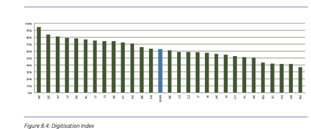
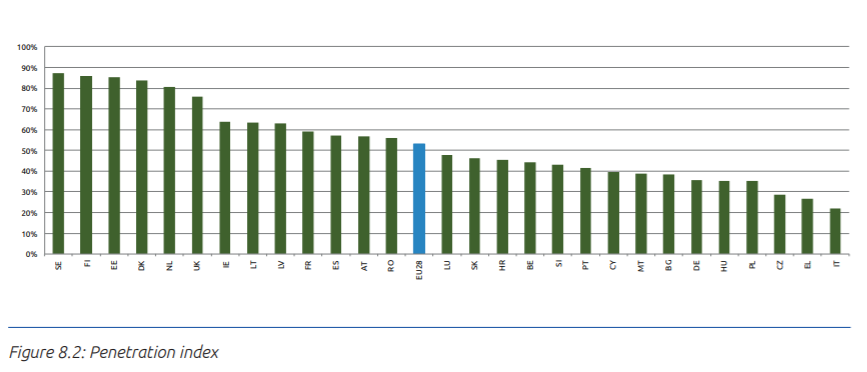
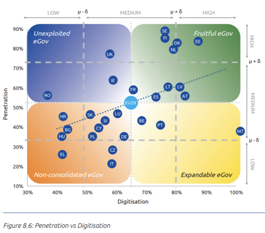
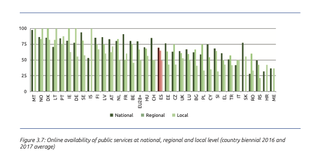

Appendice 2 - Il Piano Triennale per l’Informatica nella Pubblica Amministrazione, la misurazione dei risultati e il contesto Paese
===================================================================================================================================

La `Dichiarazione Ministeriale sull’eGovernment
<https://ec.europa.eu/digital-single-market/en/news/ministerial-declaration-egovernment-tallinn-declaration>`__
sottoscritta dall’Italia a Tallin lo scorso ottobre 2017 impegna il nostro
Paese, così come gli altri Stati Membri, alla realizzazione dei principi e degli
obiettivi dell’`eGovernment Action Plan 2016 - 2020
<https://ec.europa.eu/digital-single-market/en/news/communication-eu-egovernment-action-plan-2016-2020-accelerating-digital-transformation>`__.

Il Piano Triennale per l’Informatica nella Pubblica Amministrazione 2017
recepiva nella strategia della trasformazione digitale della Pubblica
Amministrazione ogni principio/obiettivo del piano europeo. La nuova versione
del Piano Triennale 2019 - 2021 riprende le linee strategiche e progettuali del
precedente e conferma la piena coerenza con i principi in esso contenuti.

Molti dei progetti che nel corso di questi ultimi due anni sono stati rilanciati
o avviati rappresentano infatti un tassello importante per la realizzazione dei
principi, degli obiettivi e delle azioni previste dell’`eGovernment Action Plan
2016 - 2020
<https://ec.europa.eu/digital-single-market/en/news/communication-eu-egovernment-action-plan-2016-2020-accelerating-digital-transformation>`__
e dalla Dichiarazione di Tallinn (si veda l’ `analisi
<https://teamdigitale.governo.it/upload/docs/2017/10/Mapping_Tallin_declaration_to_Italian_Digital%20Transformation_PlanV1.pdf>`__
comparata del Piano Triennale con la Dichiarazione Ministeriale di Tallinn).

Dall’`eGovernment Benchmark 2018
<https://ec.europa.eu/newsroom/dae/item-preview-neutral.cfm?item_id=637963&lang=EN>`__
(media dei dati 2016 - 2017), pubblicato a fine novembre del corrente anno [1]_,
emerge tuttavia come l’Italia sia ancora caratterizzata da una dicotomia. Per
quanto riguarda la digitalizzazione (*digitisation*) ovvero la disponibilità di
servizi pubblici digitali, l’Italia con il 58% è appena al di sotto della media
UE del 63% (2016 - 2017).

.. [1] Per una analisi più approfondita dell’*eGovernment Benchmark 2018* si
   veda “L’Italia nell’eGovernment Benchmark 2018: un problema di maturità
   digitale dei servizi o del Paese?”
   https://medium.com/team-per-la-trasformazione-digitale/italia-egovernment-benchmark-2018-commissione-europea-dg-connect-de38da7b806f

         UE rispetto alla percentuale di servizi pubblici disponibili in
         digitale.

   Digitalizzazione paesi UE

Per quanto riguarda la penetrazione (*penetration*) [2]_ ovvero l’effettivo
utilizzo dei servizi da parte dei cittadini, questa rimane molto bassa, solo il
22% degli individui interagiscono online con la pubblica amministrazione,
rispetto alla media UE del 53%.

.. [2] Per la definizione di *penetration* si veda eGovernment Benchmark 2018,
   p. 101 e nota 3. Per la specifico indicatore si veda
   https://digital-agenda-data.eu/ Indicator: individuals (aged 16-74)
   submitting completed forms to public authorities, over the internet, last 12
   months; Source: Eurostat, (Community Survey on ICT Usage in Households and by
   Individuals - Module C: Use of *eGovernment*): Individuals who used the
   internet for interaction with public authorities; Unit of measure: Percentage
   of individuals who used Internet within the last year.

         UE rispetto alla penetrazione (effettivo utilizzo dei servizi da parte
         dei cittadini).

   Penetrazione paesi UE

         ortogonali digitalizzazione e penetrazione. I paesi UE sono collocati
         sulla mappa in rapporto ai corrispettivi livelli di penetrazione e
         digitalizzazione.

   Penetrazione e digitalizzazione paesi UE

Se si contestualizza la strategia di digitalizzazione dei servizi pubblici
all’interno del Paese, l’efficacia di questa sembra essere fortemente
condizionata da fattori quali l’utilizzo di Internet e le competenze digitali
del Paese. Il miglioramento della disponibilità e la qualità dei servizi
pubblici si scontra infatti con un contesto che è segnato da un forte divario
digitale e da uno scarso interesse nei confronti delle tecnologie digitali.

Un altro indice della digitalizzazione è fornito dal *Digital Economy and
Society Index* - `DESI <https://ec.europa.eu/digital-single-market/en/desi>`__,
un indice composito che valuta l’insieme di 5 “dimensioni” (Connettività,
Capitale umano, Uso di Internet, Integrazione della tecnologia digitale, Servizi
pubblici digitali) che sono costituite, a propria volta, da un insieme di
indicatori che vanno analizzati singolarmente per comprendere correttamente sia
i gap che i miglioramenti.

La scheda Profilo in italiano è consultabile sul `sito della Commissione Europea
<http://ec.europa.eu/information_society/newsroom/image/document/2018-20/it-desi_2018-country-profile-lang_4AA6AC9F-0F0F-0F48-8D21A979E9D5A1B7_52348.pdf>`__

Secondo i dati del `DESI <https://ec.europa.eu/digital-single-market/en/desi>`__
2018 solo il 69% della popolazione italiana utilizza internet contro una media
UE del 81% e ben il 23,2% della popolazione italiana non ha mai utilizzato
internet, a fronte di una media UE del 12,9%. A questo si affianca un altro
importante svantaggio strutturale: solo il 13,5% (13,5 persone su 1.000) ha una
laurea in STEM (*Science, Technology, Engineering and Mathematics*) e rispetto
allo scorso anno la performance è peggiorata; siamo al di sotto della media UE
che si attesta al 19,1% e siamo scivolati indietro nel *ranking* poiché altri
paesi hanno evidentemente migliorato la loro *performance*.

Tuttavia, relativamente al basso utilizzo dei servizi pubblici, non possiamo non
considerare quanto sottolineato dal DESI stesso ovvero che questo sia in parte
determinato da una scarsa qualità dell’offerta; l’utilità, l’usabilità e la
facilità di utilizzo rappresentano infatti una forte motivazione per i cittadini
ad adottare i servizi digitali.

Tutti i servizi pubblici devono non solo essere guidati dal principio della
*user-centricity* (centralità dell’utente), così come ribadito anche nella
Dichiarazione sull’*eGovernment* di Tallinn, sopra richiamata, ma nel corso del
2017 e del corrente anno AGID e il Team hanno lanciato come parte fondante della
strategia di trasformazione digitale numerose iniziative per identificare i gap
di performance e per migliorare l’usabilità e l’accessibilità dei servizi
digitali.

Si ricorda che il Piano Triennale 2017 ha previsto una sezione dedicata ai
servizi digitali con le linee guida per il design dei servizi della PA. AGID
insieme con il Team ha emanato le Linee guida di design per i servizi e i siti
della PA con l’obiettivo di definire regole comuni per la progettazione di
interfacce, servizi e contenuti usabili e accessibili, e di migliorare la
navigazione e l’esperienza dei cittadini.

Il DESI 2018 riconosce questo impegno, menzionando la *best practice* di
“Designers e Developers Italia” che si caratterizza come un centro di competenze
per il design dei servizi che mette a disposizione kit e strumenti per aiutare a
progettare servizi digitali moderni e semplici. Entrambe le piattaforme di
community sono dedicate al disegno e allo sviluppo dei servizi pubblici digitali
mettendo a disposizione documentazione tecnica, linee guida, kit di sviluppo e
di design, ambienti di testi, API e un sistema di *issue tracking* per
contribuire attivamente allo sviluppo delle tecnologie abilitanti del sistema
operativo del Paese da parte degli sviluppatori, dei *designers* e dei fornitori
di tecnologia (SPID, pagoPA, ANPR, ecc).

AGID e il Team hanno lavorato molto per promuovere l’usabilità dei servizi
digitali già esistenti; sono state rilasciate una nuova *User Interface* e una
nuova *User experience* per pagoPA e per SPID. E’ stata delineata una mappa per
l’integrazione di SPID come canale unico o preferenziale di autenticazione
all’interno dei servizi pubblici più utilizzati dai cittadini: SPID è stato
integrato come unico canale di autenticazione all’interno del Bonus 18enni e del
Bonus Insegnanti, ACI ha integrato SPID nei servizi automobilistici, e a breve i
servizi fiscali gestiti dall’Agenzia Entrate e quelli del *welfare* gestiti da
INPS offriranno SPID come canale preferenziale di autenticazione.

Il nostro Paese era e rimane indietro nella curva di crescita rispetto alla
maggior parte degli altri paesi della UE; la strategia digitale richiede
coerenza e continuità per poter misurarne in benefici, laddove l’Italia ha
continuato ad investire con una visione chiara e coerente, i risultati si
vedono. Continuità strategica e di investimento sono necessari per superare il
gap.

Ma non basta poiché lo sforzo non può che essere comune: i risultati negativi
sono spesso la somma di tutte le inefficienze diffuse tra le pubbliche
amministrazioni. La prima fase di digitalizzazione in molti Paesi, incluso il
nostro, è stata caratterizzata da singoli servizi messi a disposizione dalle
singole amministrazioni; le tecnologie digitali sono state “applicate” alle
strutture e procedure tradizionali per fornire servizi analogici su piattaforme
digitali.

Nel corso degli anni, questo approccio ha replicato, nell’attuazione dei
progetti IT, la stessa organizzazione a silos e frammentazione già presente
nella PA, con una conseguente proliferazione di progetti che non si parlano tra
di loro. La frammentazione e la mancanza di una strategia sistemica colpiscono
negativamente le esigenze degli utenti che sono sacrificate alle esigenze
dell’organizzazione, poiché ogni amministrazione fornisce un servizio che
risponde a un solo specifico bisogno erogandolo come se rappresentasse un
prodotto finito.

L’interazione tra amministrazione e utenti richiede una rivoluzione parallela
nel modo in cui le amministrazioni operano. I reali benefici cominceranno
davvero a materializzarsi solo quando si introdurrà un approccio sistemico che
non consideri i singoli progetti separatamente ma come parte di un unico
programma di trasformazione digitale.

Dal punto di vista tecnologico bisognerebbe quindi muovere dai tradizionali
progetti IT silos a strutture orizzontali, capaci di trascendere i singoli enti
della PA, ovvero piattaforme supportate da dati e informazioni comuni: il
cosiddetto “*government as a platform*” così come sperimentato dal Governo
Britannico [3]_. Tutte PPAA devono quindi sforzarsi di lavorare in un’ottica di
integrazione trasversale per raggiungere un obiettivo comune.

.. [3] Vedi
   https://www.gov.uk/government/organisations/government-digital-service

Da ultimo va ricordato che quando si analizzano questi *ranking* nazionali
spesso si dimentica che molti servizi digitali sono offerti a livello locale,
soprattutto, ma non esclusivamente, nei paesi con un’organizzazione
istituzionale molto decentralizzata, come l’Italia. Il recente rapporto della
Commissione europea `eGovernment in local and regional administrations:
guidance, tools and funding for implementation
<https://ec.europa.eu/digital-single-market/en/news/egovernment-local-and-regional-administrations-guidance-tools-and-funding-implementation>`__
dimostra che la strategia digitale nazionale per essere pienamente efficace deve
essere caratterizzata da un forte componente locale, cruciale per la fornitura
dei servizi ai cittadini. Sempre nell’*eGovernment Action Plan Benchmark 2018*
viene evidenziato che la percentuale di servizi digitali disponibili a livello
nazionale (media UE 69%) supera di molto la media dei servizi offerti a livello
regionale (media UE 65%) e locale (media UE 49%), anche se i servizi locali sono
spesso quelli che di fatto fanno la differenza nella vita dei cittadini.

         UE rispetto alla percentuale di servizi pubblici disponibili in
         digitale. Per ogni paese il dato è disaggregato a livello nazionale,
         regionale e locale.

   Disponibilità di servizi pubblici online a livello nazionale, regionale e
   locale.

Il Piano Triennale 2017 aveva già previsto una forte collaborazione livello
nazionale/locale richiedendo che le amministrazioni locali elaborino piani
strategici, coerenti con la visione europea e nazionale.

Per conseguire concretamente questo obiettivo, si è lavorato affinché gli enti
locali possano avere le necessarie risorse finanziare per poter realizzare
concretamente la trasformazione digitale.

Attraverso l’articolo 66 del D.Lgs. n. 217 del 13 dicembre 2017, si è ribadito
un preciso impegno affinché gli enti locali possano richiedere, a partire dal
2019, spazi finanziari anche per investimenti finalizzati all’attuazione del
Piano Triennale.

Insieme con Cassa Depositi e Prestiti, è stato messo a disposizione uno
strumento finanziario - un prestito di importo minimo di €5.000 e di una durata
media di 10 anni - rivolto specificatamente agli enti locali per coprire la
spesa in investimenti in servizi digitali.

In collaborazione con il Dipartimento della Funzione pubblica, sono stati
utilizzate risorse del PON Governance per aiutare gli enti locali nel subentro
in ANPR; i contributi sono riconosciuti in maniera automatica ai Comuni che
effettuano la migrazione in ANPR tra il 6 dicembre 2017 e il 31 dicembre 2018.
