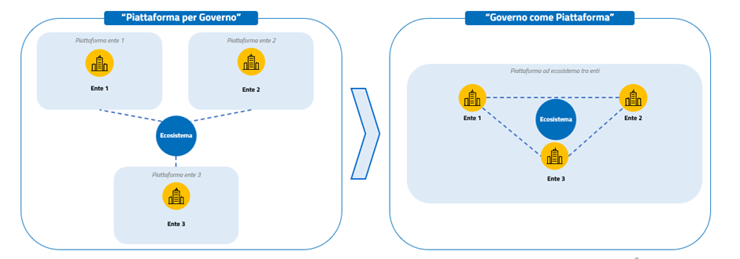

L'ecosistema digitale amministrativo
====================================

La trasformazione digitale richiede un processo integrato, finalizzato
alla costruzione di ecosistemi digitali strutturati sostenuti da
organizzazioni pubbliche semplificate, trasparenti, aperte,
digitalizzate e con servizi di qualità, erogati in maniera proattiva per
anticipare le esigenze del cittadino. Gli ecosistemi vengono quindi qui
intesi con un significato diverso da quello usato in precedenti versioni
del Piano triennale.

È quindi necessario seguire un approccio innovativo che affronti, in
maniera sistematica, tutti gli aspetti legati a organizzazione,
processi, regole, dati e tecnologie. Sono quindi necessari strumenti
utili alla mappatura di tali aspetti ed è necessario agevolare lo
scambio di buone pratiche, rendendo tutti gli operatori pubblici
sviluppatori dell'innovazione amministrativa, attraverso la diffusione
di una cultura amministrativa digitale.

L'art. 6 del Decreto-legge n. 80/2021 introduce il Piano Integrato di
Attività e Organizzazione (PIAO) al fine di "*assicurare la qualità e la
trasparenza dell'attività amministrativa e migliorare la qualità dei
servizi ai cittadini e alle imprese e procedere alla costante e
progressiva semplificazione e reingegnerizzazione dei processi* (..)",
ma sono molteplici le fonti normative che richiamano le amministrazioni
a quella che il CAD definisce, all'art.15, come una "*riorganizzazione
strutturale e gestionale*", finalizzata allo sfruttamento delle
opportunità offerte dal digitale.

Nonostante gran parte dell'attività delle pubbliche amministrazioni sia
già composta da procedimenti e procedure ben definite, non vuol dire che
questa non possa essere reingegnerizzata sia da un punto di vista della
semplificazione che da un punto di vista della digitalizzazione.

Occorre che ogni singolo ente pubblico divenga un "ecosistema
amministrativo digitale", alla cui base ci siano piattaforme
organizzative e tecnologiche, ma in cui il valore pubblico sia generato
in maniera attiva da cittadini, imprese e operatori pubblici.

Essendo l'azione amministrativa composta da processi collettivi è
necessario introdurre dei "processi digitali collettivi" basati su
*e-service,* ovvero interfacce API che scambiano dati/informazioni in
maniera automatica e interoperabile, come illustrato nel capitolo 3 -
Servizi.

Questo permette la realizzazione del principio *once-only* e, al tempo
stesso, consente agli attori pubblici e privati di generare valore
all'interno dell'ecosistema con al centro la singola Pubblica
Amministrazione, che lo regola garantendo correttezza amministrativa,
trasparenza, apertura, sicurezza informatica e protezione dei dati
personali.

Si tratta di passare da una concezione di "*Piattaforma per
Governo*", ovvero piattaforme per singoli scopi dell'ente, a una
visione più profonda del paradigma, ovvero il "*Governo come
Piattaforma*" come riportato anche nella Comunicazione EU (2021)118
sulla Bussola Digitale 2030, secondo cui l'ecosistema non è un elemento
esterno all'ente, ma è qualcosa sostenuto dall'ente pubblico per
abilitare servizi migliori.

         di una "Piattaforma del Governo", che è costituita dalle piattaforme di
         ciascun ente collegate in un ecosistema e in uno schema a destra la
         concezione di "Governo come piattaforma" nella quale tutti gli enti
         fanno parte di una Piattaforma che costituisce l'ecosistema, al cui
         interno gli enti stessi interagiscono.

   Duplice concezione: da Piattaforma per Governo a Governo come Piattaforma

Per facilitare l'innovazione occorre analizzare l'attuale impianto
normativo che impatta sulla trasformazione digitale, per generare
proposte di semplificazione amministrativa in grado di rimuovere gli
ostacoli all'innovazione nelle pubbliche amministrazioni.

Da questo punto di vista, nel corso dei prossimi anni si ritiene
necessario:

-  definire un processo integrato finalizzato alla costruzione di
   ecosistemi digitali strutturati sostenuti da organizzazioni pubbliche
   semplificate, trasparenti, aperte, digitalizzate e con servizi di
   qualità erogati e definire schemi organizzativi per il raccordo tra
   Ufficio del RTD (Responsabile per la transizione al digitale) e il
   resto dell'organizzazione pubblica in cui lo stesso ufficio è
   inserito;

-  definire uno strumento agile per la catalogazione dei macro-processi
   delle singole organizzazioni pubbliche e per la mappatura tra questi
   processi, i servizi erogati e i sottostanti servizi digitali
   applicativi che li sostengono.

In questo sistema risultano fondamentali i processi di collaborazione
istituzionale e il ruolo del Responsabile per la transizione al digitale
e dell'Ufficio transizione digitale (di seguito RTD e UTD), come
funzioni e agenti cruciali del cambiamento, sia di processo che
tecnologico.
