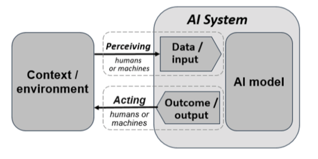

Intelligenza artificiale per la Pubblica Amministrazione
========================================================

Scenario
--------

Per sistema di Intelligenza Artificiale (IA) si intende un sistema
automatico che, per obiettivi espliciti o impliciti, deduce dagli
*input* ricevuti come generare output come previsioni, contenuti,
raccomandazioni o decisioni che possono influenzare ambienti fisici o
virtuali. I sistemi di IA variano nei loro livelli di autonomia e
adattabilità dopo l'implementazione (Fonte: `OECD AI principles
overview <https://oecd.ai/en/ai-principles>`__).

         intelligenza artificiale sopra enunciata ed è tratta dai Principi
         dell'Intelligenza artificiale pubblicati dall'OCSE.

   Sistema di intelligenza artificiale (Fonte OECD)

L'intelligenza artificiale ha il potenziale per essere una tecnologia
estremamente utile, o addirittura dirompente, per la modernizzazione del
settore pubblico. L'IA sembra essere la risposta alla crescente
necessità di migliorare l'efficienza e l'efficacia nella gestione e
nell'erogazione dei servizi pubblici. Tra le potenzialità delle
tecnologie di intelligenza artificiale si possono citare le capacità di:

-  automatizzare attività di ricerca e analisi delle informazioni
   semplici e ripetitive, liberando tempo di lavoro per attività a
   maggior valore;

-  aumentare le capacità predittive, migliorando il processo decisionale
   basato sui dati;

-  supportare la personalizzazione dei servizi incentrata sull'utente,
   aumentando l'efficacia dell'erogazione dei servizi pubblici anche
   attraverso meccanismi di proattività.

L'Unione Europea mira a diventare *leader* strategico nell'impiego
dell'intelligenza artificiale nel settore pubblico. Questa intenzione è
chiaramente espressa nella Comunicazione "Piano Coordinato
sull'Intelligenza Artificiale" COM (2021) 205 del 21 aprile 2021 in cui
la Commissione europea propone specificamente di "rendere il settore
pubblico un pioniere nell'uso dell'IA".

La revisione del Piano sull'intelligenza artificiale è stata
accompagnata dalla "Proposta di Regolamento del Parlamento Europeo e del
Consiglio che stabilisce regole armonizzate sull'intelligenza
artificiale" (*AI Act*) COM (2021) 206 del 21 aprile 2021. La proposta
di regolamento mira ad affrontare i rischi legati all'utilizzo dell'IA,
classificandoli in quattro diversi livelli: rischio inaccettabile
(divieto), rischio elevato, rischio limitato e rischio minimo. Inoltre,
il regolamento intende porre le basi per costruire un ecosistema di
eccellenza nell'IA e rafforzare la capacità dell'Unione Europea di
competere a livello globale.

L'AI Act ha introdotto una importante sfida in materia di normazione
tecnica. La Commissione Europea ha adottato il 25 maggio 2023 la
Decisione C(2023)3215 - *Standardisation request* M/5932 con la quale ha
affidato agli Enti di normazione europei CEN e CENELEC la redazione di
norme tecniche europee a vantaggio dei sistemi di intelligenza
artificiale in conformità con i principi dell'AI Act.

Il "Dispositivo per la ripresa e la resilienza" ha tra gli obiettivi
quello di favorire la creazione di una industria dell'intelligenza
artificiale nell'Unione Europea al fine di assumere un ruolo guida a
livello globale nello sviluppo e nell'adozione di tecnologie di IA
antropocentriche, affidabili, sicure e sostenibili. In Italia il PNRR
prevede importanti misure di finanziamento sia per la ricerca in ambito
di intelligenza artificiale sia per lo sviluppo di piattaforme di IA per
i servizi della Pubblica Amministrazione.

Il DTD di concerto con ACN e AGID promuoverà l'obiettivo di innalzare i
livelli di *cybersecurity* dell'Intelligenza Artificiale per assicurare
che sia progettata, sviluppata e impiegata in maniera sicura, anche in
coerenza con le linee guida internazionali sulla sicurezza
dell'Intelligenza Artificiale. La *cybersecurity* è un requisito
essenziale dell'IA e serve per garantire resilienza, *privacy*,
correttezza ed affidabilità, ovvero un cyberspazio più sicuro.

La Pubblica Amministrazione italiana conta esperienze rilevanti nello
sviluppo e utilizzo di soluzioni di intelligenza artificiale. A titolo
esemplificativo si citano le esperienze di:

-  **Agenzia delle entrate,** utilizzo di algoritmi di *machine
   learning* per analizzare schemi e comportamenti sospetti, aiutando
   nella prevenzione e rilevazione di frodi;

-  **INPS,** adozione di *chatbot* per semplificare e personalizzare
   l'interazione con l'utente, migliorando l'accessibilità e l'usabilità
   dei servizi;

-  **ISTAT,** utilizzo di *foundation models* per generare ontologie a
   partire dalla descrizione in linguaggio naturale del contesto
   semantico al fine di migliorare la qualità della modellazione dei
   dati.

In questo contesto, l'affermarsi dei *foundation models* costituisce un
importante fattore di accelerazione per lo sviluppo e l'adozione di
soluzioni di intelligenza artificiale. Per *foundation models* si
intendono sistemi di grandi dimensioni in grado di svolgere un'ampia
gamma di compiti specifici, come la generazione di video, testi,
immagini, la conversazione in linguaggio naturale, l'elaborazione o la
generazione di codice informatico. L'*AI Act* definisce inoltre come
*foundation models* "ad alto impatto" i modelli addestrati con una
grande quantità di dati e con complessità, capacità e prestazioni
elevate.

*Principi generali per l'utilizzo dell'intelligenza artificiale nella
Pubblica Amministrazione*

Le amministrazioni pubbliche devono affrontare molte sfide nel
perseguire l'utilizzo dell'intelligenza artificiale. Di seguito si
riportano alcuni principi generali che dovranno essere adottati dalle
pubbliche amministrazioni e declinati in fase di applicazione tenendo in
considerazione lo scenario in veloce evoluzione.

1.  **Miglioramento dei servizi e riduzione dei costi.** Le pubbliche
    amministrazioni concentrano l'investimento in tecnologie di
    intelligenza artificiale nell'automazione dei compiti ripetitivi
    connessi ai servizi istituzionali obbligatori e al funzionamento
    dell'apparato amministrativo. Il conseguente recupero di risorse è
    destinato al miglioramento della qualità dei servizi anche mediante
    meccanismi di proattività.

2.  **Analisi del rischio.** Le amministrazioni pubbliche analizzano i
    rischi associati all'impiego di sistemi di intelligenza artificiale
    per assicurare che tali sistemi non provochino violazioni dei
    diritti fondamentali della persona o altri danni rilevanti. Le
    pubbliche amministrazioni adottano la classificazione dei sistemi di
    IA secondo le categorie di rischio definite dall'*AI Act*.

3.  **Trasparenza, responsabilità e informazione.** Le pubbliche
    amministrazioni pongono particolare attenzione alla trasparenza e
    alla interpretabilità dei modelli di intelligenza artificiale al
    fine di garantire la responsabilità e rendere conto delle decisioni
    adottate con il supporto di tecnologie di intelligenza artificiale.
    Le amministrazioni pubbliche forniscono informazioni adeguate agli
    utenti al fine di consentire loro di prendere decisioni informate
    riguardo all'utilizzo dei servizi che sfruttano l'intelligenza
    artificiale.

4.  **Inclusività e accessibilità**. Le pubbliche amministrazioni sono
    consapevoli delle responsabilità e delle implicazioni etiche
    associate all'uso delle tecnologie di intelligenza artificiale. Le
    pubbliche amministrazioni assicurano che le tecnologie utilizzate
    rispettino i principi di equità, trasparenza e non discriminazione.

5.  **Privacy e sicurezza**. Le pubbliche amministrazioni adottano
    elevati standard di sicurezza e protezione della *privacy* per
    garantire che i dati dei cittadini siano gestiti in modo sicuro e
    responsabile. In particolare, le amministrazioni garantiscono la
    conformità dei propri sistemi di IA con la normativa vigente in
    materia di protezione dei dati personali e di sicurezza cibernetica.

6.  **Formazione e sviluppo delle competenze**. Le pubbliche
    amministrazioni investono nella formazione e nello sviluppo delle
    competenze necessarie per gestire e applicare l'intelligenza
    artificiale in modo efficace nell'ambito dei servizi pubblici. A
    tale proposito si faccia riferimento agli obiettivi individuati nel
    Capitolo 1.

7.  **Standardizzazione**. Le pubbliche amministrazioni tengono in
    considerazione, durante le fasi di sviluppo o acquisizione di
    soluzioni basate sull'intelligenza artificiale, le attività di
    normazione tecnica in corso a livello internazionale e a livello
    europeo da CEN e CENELEC con particolare riferimento ai requisiti
    definiti dall'*AI Act*.

8.  **Sostenibilità**: Le pubbliche amministrazioni valutano
    attentamente gli impatti ambientali ed energetici legati
    all'adozione di tecnologie di intelligenza artificiale e adottando
    soluzioni sostenibili dal punto di vista ambientale.

9.  **Foundation Models (Sistemi IA "ad alto impatto").** Le pubbliche
    amministrazioni, prima di adottare *foundation models* "ad alto
    impatto", si assicurano che essi adottino adeguate misure di
    trasparenza che chiariscono l'attribuzione delle responsabilità e
    dei ruoli, in particolare dei fornitori e degli utenti del sistema
    di IA.

10. **Dati.** Le pubbliche amministrazioni, che acquistano servizi di
    intelligenza artificiale tramite API, valutano con attenzione le
    modalità e le condizioni con le quali il fornitore del servizio
    gestisce di dati forniti dall'amministrazione con particolare
    riferimento alla proprietà dei dati e alla conformità con la
    normativa vigente in materia di protezione dei dati e *privacy*.

Dati per l'intelligenza artificiale

La disponibilità di dati di alta qualità e il rispetto dei valori e dei
diritti europei, quali la protezione dei dati personali, la tutela dei
consumatori e la normativa in materia di concorrenza sono i prerequisiti
fondamentali nonché un presupposto per lo sviluppo e la diffusione dei
sistemi di IA. La disponibilità di dati rappresenta peraltro un
requisito chiave per l'adozione di un approccio all'intelligenza
artificiale attento alle specificità nazionali.

La Strategia Europea per i dati è implementata dal punto normativo dagli
atti sopra citati che costituiscono il quadro regolatorio entro il quale
deve muoversi una Pubblica Amministrazione che intende operare con
sistemi di IA sui dati aperti.

Riguardo l'utilizzo dei dati da parte di sistemi di intelligenza
artificiale, l'*AI Act* richiede ai fornitori di sistemi di IA di
adottare una governance dei dati e appropriate procedure di gestione dei
dati (con particolare attenzione alla generazione e alla raccolta dei
dati, alle operazioni di preparazione dei dati, alle scelte di
progettazione e alle procedure per individuare e affrontare le
distorsioni e le potenziali distorsioni per correlazione o qualsiasi
altra carenza pertinente nei dati). L'*AI Act* pone particolare
attenzione agli aspetti qualitativi dei set di dati utilizzati per
addestrare, convalidare e testare i sistemi di IA (tra cui
rappresentatività, pertinenza, completezza e correttezza). La
Commissione Europea ha avviato una specifica attività presso il CEN e il
CENELEC per definire norme tecniche europee per rispondere a tali
esigenze.

Nel contesto nazionale, tenuto conto di una architettura istituzionale
che organizza i territori in regioni e comuni, che devono avere livelli
di servizio omogenei, diventa cruciale progettare e implementare
soluzioni nazionali basate sull'IA. Queste soluzioni devono essere in
grado, da un lato, di superare eventuali disparità che caratterizzano le
diverse amministrazioni territoriali e, dall'altro, di assicurare un
pieno coordinamento tra territori differenti riguardo a servizi chiave
per la società.

Riguardo l'affermarsi dei *foundation models* nel settore pubblico, una
sfida fondamentale consiste nella creazione di dataset di elevata
qualità, rappresentativi della realtà della Pubblica Amministrazione,
con particolare riguardo al corpus normativo nazionale e comunitario, ai
procedimenti amministrativi e alla struttura organizzativa della
Pubblica Amministrazione italiana stessa.

Contesto normativo e strategico
-------------------------------

Riferimenti normativi europei:

-  Comunicazione della Commissione al Parlamento Europeo e al Consiglio,
   "Piano Coordinato sull'Intelligenza Artificiale", COM (2021) 205 del
   21 aprile 2021

-  "Proposta di Regolamento del Parlamento Europeo e del Consiglio che
   stabilisce regole armonizzate sull'intelligenza artificiale" (*AI
   Act*), COM (2021) 206, del 21 aprile 2021

-  Decisione della Commissione "*on a standardisation request to the
   European Committee for Standardisation and the European Committee for
   Electrotechnical Standardisation in support of Union policy on
   artificial intelligence*" C (2023) 3215 del 22 maggio 2023

Obiettivo 5.4 - Aumento della consapevolezza della Pubblica Amministrazione nell'adozione delle tecnologie di intelligenza artificiale
--------------------------------------------------------------------------------------------------------------------------------------

RA5.4.1 - Linee guida per promuovere l'adozione dell'IA nella Pubblica Amministrazione
~~~~~~~~~~~~~~~~~~~~~~~~~~~~~~~~~~~~~~~~~~~~~~~~~~~~~~~~~~~~~~~~~~~~~~~~~~~~~~~~~~~~~~

Linee guida che definiscono i passi metodologici e organizzativi che le
pubbliche amministrazioni devono seguire per definire attività
progettuali di innovazione mediante l'utilizzo di IA. Le Linee guida
forniranno strumenti di valutazione sull'utilizzo dell'intelligenza
artificiale per rispondere alle esigenze delle amministrazioni,
illustrando casi d'uso e promuovendo buone pratiche.

-  **Target 2024** - Redazione delle Linee guida

-  **Target 2025** - Almeno 150 progetti di innovazione mediante IA
   (avviati)

-  **Target 2026** - Almeno 400 progetti di innovazione mediante IA
   (avviati)

RA5.4.2 - Linee guida per il procurement di IA nella Pubblica Amministrazione
~~~~~~~~~~~~~~~~~~~~~~~~~~~~~~~~~~~~~~~~~~~~~~~~~~~~~~~~~~~~~~~~~~~~~~~~~~~~~

Linee guida che hanno l'obiettivo di orientare le pubbliche
amministrazioni nella scelta delle procedure di approvvigionamento e
nella definizione delle specifiche funzionali e non funzionali delle
forniture al fine di garantire: la soddisfazione delle esigenze
dell'amministrazione, adeguati livelli di servizio e la conformità con
il quadro normativo vigente.

Le Linee guida forniranno indicazione sulla gestione dei servizi di IA
da parte della PA.

-  **Target 2024** - Redazione delle Linee guida

-  **Target 2025** - Almeno 100 iniziative di acquisizione di servizi di
   IA

-  **Target 2026** - Almeno 300 iniziative di acquisizione di servizi di
   IA

RA5.4.3 - Linee guida per lo sviluppo di applicazioni di IA per la Pubblica Amministrazione
~~~~~~~~~~~~~~~~~~~~~~~~~~~~~~~~~~~~~~~~~~~~~~~~~~~~~~~~~~~~~~~~~~~~~~~~~~~~~~~~~~~~~~~~~~~

Linee guida che hanno l'obiettivo di fornire alle pubbliche
amministrazioni gli strumenti metodologici necessari per affrontare
progetti di sviluppo di soluzioni IA, compresa la creazione di soluzioni
basate su *foundation models*.

-  **Target 2024** - Redazione delle Linee guida

-  **Target 2025** - Almeno 50 progetti di sviluppo di soluzioni IA

-  **Target 2026** - Almeno 100 progetti di sviluppo di soluzioni IA

RA5.4.4 - Realizzazione di applicazioni di IA a valenza nazionale
~~~~~~~~~~~~~~~~~~~~~~~~~~~~~~~~~~~~~~~~~~~~~~~~~~~~~~~~~~~~~~~~~

Sviluppo e implementazione di soluzioni basate su IA finalizzate al
miglioramento della qualità dei servizi pubblici, con l'obiettivo di
garantire uniformi livelli di servizio su tutto il territorio nazionale.

-  **Target 2024** - Identificazione delle soluzioni nazionali fondate
   sull'IA

-  **Target 2025** - Sviluppo delle soluzioni nazionali

-  **Target 2026** - Dispiegamento nei territori delle soluzioni
   realizzate

Obiettivo 5.5 - Dati per l'intelligenza artificiale
---------------------------------------------------

RA5.5.1 - Basi di dati nazionali strategiche
~~~~~~~~~~~~~~~~~~~~~~~~~~~~~~~~~~~~~~~~~~~~

Sviluppo di raccolte di *dataset* al fine di assicurare una base di
conoscenza condivisa per le soluzioni di Intelligenza Artificiale nella
Pubblica Amministrazione, preservando allo stesso tempo le peculiarità
della Pubblica Amministrazione italiana e le specificità culturali
nazionali.

-  **Target 2024** - Ricognizione delle basi di dati strategiche

-  **Target 2025** - Digitalizzazione delle basi di dati strategiche

-  **Target 2026** - Promozione delle basi di dati strategiche

Linee di azione istituzionali
~~~~~~~~~~~~~~~~~~~~~~~~~~~~~

RA5.4.1
^^^^^^^

-  **Dicembre 2024** - Redazione Linee guida per promuovere l'adozione
   dell'IA nella Pubblica Amministrazione - (AGID) - CAP5.14

RA5.4.2
^^^^^^^

-  **Dicembre 2024** - Redazione Linee guida per il *procurement* di IA
   nella Pubblica Amministrazione - (AGID) - CAP5.15

RA5.4.3
^^^^^^^

-  **Dicembre 2024** - Redazione Linee guida per lo sviluppo di
   applicazioni di IA nella Pubblica Amministrazione - (AGID) - CAP5.16

RA5.4.4
^^^^^^^

-  **Dicembre 2024** - Identificazione delle soluzioni nazionali fondate
   sull'IA - (AGID) - CAP5.17

-  **Dicembre 2025** - Coordinamento delle attività di sviluppo delle
   soluzioni nazionali - (AGID) - CAP5.18

RA5.5.1
^^^^^^^

-  **Dicembre 2024** - Identificazione delle basi di dati nazionali
   strategiche - (AGID) - CAP5.19

-  **Dicembre 2025 -** Coordinamento delle attività di digitalizzazione
   delle basi di dati nazionali strategiche - (AGID) - CAP5.20

Linee di azione per le PA
~~~~~~~~~~~~~~~~~~~~~~~~~

RA5.4.1
^^^^^^^

-  **Dicembre 2025** - Le PA adottano le Linee per promuovere l'adozione
   dell'IA nella Pubblica Amministrazione - CAP5.PA.21

RA5.4.2
^^^^^^^

-  **Dicembre 2025** - Le PA adottano le Linee guida per il
   *procurement* di IA nella Pubblica Amministrazione - CAP5.PA.22

RA5.4.3
^^^^^^^

-  **Dicembre 2025** - Le PA adottano le Linee guida per lo sviluppo di
   applicazioni di IA nella Pubblica Amministrazione - CAP5.PA.23

RA5.4.4
^^^^^^^

-  **Dicembre 2026** - Le PA adottano le applicazioni di IA a valenza
   nazionale - CAP5.PA.24

RA5.5.1
^^^^^^^

-  **Dicembre 2026** - Le PA adottano le basi dati nazionali strategiche
   - CAP5.PA.25
