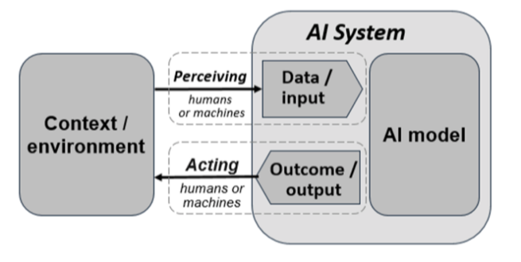

Intelligenza artificiale per la Pubblica Amministrazione
========================================================

Scenario
--------

Per sistema di Intelligenza Artificiale (IA) si intende un sistema
automatico che, per obiettivi espliciti o impliciti, deduce dagli
*input* ricevuti come generare output come previsioni, contenuti,
raccomandazioni o decisioni che possono influenzare ambienti fisici o
virtuali. I sistemi di IA variano nei loro livelli di autonomia e
adattabilità dopo l'implementazione (Fonte: `OECD AI principles
overview <https://oecd.ai/en/ai-principles>`__).

         intelligenza artificiale sopra enunciata ed è tratta dai Principi
         dell'Intelligenza artificiale pubblicati dall'OCSE.

   Sistema di intelligenza artificiale (Fonte OECD)

L'intelligenza artificiale ha il potenziale per essere una tecnologia
estremamente utile, o addirittura dirompente, per la modernizzazione del
settore pubblico. L'IA sembra essere la risposta alla crescente
necessità di migliorare l'efficienza e l'efficacia nella gestione e
nell'erogazione dei servizi pubblici. Tra le potenzialità delle
tecnologie di intelligenza artificiale si possono citare le capacità di:

-  automatizzare attività di ricerca e analisi delle informazioni
   semplici e ripetitive, liberando tempo di lavoro per attività a
   maggior valore;

-  aumentare le capacità predittive, migliorando il processo decisionale
   basato sui dati;

-  supportare la personalizzazione dei servizi incentrata sull'utente,
   aumentando l'efficacia dell'erogazione dei servizi pubblici anche
   attraverso meccanismi di proattività.

L'Unione Europea mira a diventare *leader* strategico nell'impiego
dell'intelligenza artificiale nel settore pubblico. Questa intenzione è
chiaramente espressa nella Comunicazione "Piano Coordinato
sull'Intelligenza Artificiale" COM (2021) 205 del 21 aprile 2021 in cui
la Commissione europea propone specificamente di "rendere il settore
pubblico un pioniere nell'uso dell'IA".

Il Regolamento (UE) 2024/1689 del Parlamento Europeo e del Consiglio del 13
giugno 2024 (AI Act) stabilisce regole armonizzate sull'intelligenza
artificiale. L'AI Act affronta i rischi legati all'utilizzo dell'IA,
classificandoli in quattro diversi livelli: rischio inaccettabile (divieto),
rischio elevato, rischio limitato e rischio minimo. L'AI Act introduce obblighi
di trasparenza per i grandi modelli generalisti di IA e per tutti i sistemi AI 
che interagiscono con persone fisiche. Il regolamento intende
porre le basi per costruire un ecosistema di eccellenza nell'IA e rafforzare la
capacità dell'Unione Europea di competere a livello globale con soluzioni di
intelligenza artificiale affidabile.

La "Comunicazione sulla promozione delle *start-up* e dell'innovazione nell'IA
affidabile", COM (2024) del 24 gennaio 2024, ha lanciato l'iniziativa "GenAI4EU"
che ha l'obiettivo di promuovere lo sviluppo di grandi ecosistemi di innovazione
aperta, favorendo la collaborazione tra *startup* di IA e utilizzatori di IA
nell'industria e nel settore pubblico. L'Unione Europea promuove la cooperazione
tra *startup*, operatori dell'industria delle tecnologie dell'informazione e
pubbliche amministrazioni per lo sviluppo di applicazioni di intelligenza
artificiale generativa affidabile.

L'AI Act ha introdotto una importante sfida in materia di normazione
tecnica. La Commissione Europea ha adottato il 25 maggio 2023 la
Decisione C(2023)3215 - *Standardisation request* M/5932 con la quale ha
affidato agli Enti di normazione europei CEN e CENELEC la redazione di
norme tecniche europee a vantaggio dei sistemi di intelligenza
artificiale in conformità con i principi dell'AI Act.

Il "Dispositivo per la ripresa e la resilienza" ha tra gli obiettivi
quello di favorire la creazione di una industria dell'intelligenza
artificiale nell'Unione Europea al fine di assumere un ruolo guida a
livello globale nello sviluppo e nell'adozione di tecnologie di IA
antropocentriche, affidabili, sicure e sostenibili. In Italia il PNRR
prevede importanti misure di finanziamento sia per la ricerca in ambito
di intelligenza artificiale sia per lo sviluppo di piattaforme di IA per
i servizi della Pubblica Amministrazione.

In applicazione dell'AI Act, il DTD di concerto con ACN e AgID promuoverà 
l'obiettivo di innalzare i livelli di *cybersecurity* dell'Intelligenza 
Artificiale per assicurare che sia progettata, sviluppata e impiegata in 
maniera sicura, anche in coerenza con le linee guida internazionali sulla 
sicurezza dell'Intelligenza Artificiale. La *cybersecurity* è uno dei requisiti 
essenziali dell'IA che, insieme ai requisiti di resilienza, *privacy*,
accuratezza e robustezza, permette un utilizzo sicuro e consapevole di queste 
tecnologie.

La "Strategia italiana per l'intelligenza artificiale 2024-2026" stabilisce gli
obiettivi di promozione e sviluppo dell'IA, suddividendoli in quattro macroaree:
Ricerca, Pubblica Amministrazione, Industria, Formazione. La strategia include,
inoltre, azioni abilitanti specifiche in termini di infrastrutture e
coordinamento. L'obiettivo complessivo è creare un quadro di azioni sinergiche
che consenta di condividere buone pratiche e di favorire uno scambio efficace di
conoscenze e competenze tra il mondo accademico, le imprese e la Pubblica
Amministrazione.

Il Piano triennale declina in linee di azione operative gli obiettivi per la
Pubblica Amministrazione definiti nella "Strategia italiana per l'intelligenza
artificiale 2024-2026".

L'affermarsi dei grandi modelli generalisti di IA costituisce un importante
fattore di accelerazione per lo sviluppo e l'adozione di soluzioni di
intelligenza artificiale. Per grandi modelli generalisti di IA si intendono
sistemi di grandi dimensioni in grado di svolgere un'ampia gamma di compiti
specifici, come la generazione di video, testi, immagini, la conversazione in
linguaggio naturale, l'elaborazione o la generazione di codice informatico. L'AI
Act definisce come grandi modelli generalisti di IA ad elevato impatto i modelli
addestrati con una grande quantità di dati e con complessità, capacità e
prestazioni elevate.

Le amministrazioni pubbliche che intendono adottare soluzioni basate su
intelligenza artificiale valutano le opportunità offerte dalle tecnologie di
*edge computing* in termini di efficienza, reattività e gestione dei dati in
contesti locali con particolare attenzione all'utilizzo di sensoristica,
computazione decentrata e di sistemi realizzati con modelli IA anche di piccole
dimensioni e/o con reti di agenti intelligenti.

Le amministrazioni pubbliche dovranno rispettare le Linee guida sull'Intelligenza 
artificiale in corso di formulazione ed emanazione da parte dell'Agenzia per 
l'Italia Digitale ai sensi del Piano Triennale per l'informatica nella pubblica 
amministrazione.

*Ambienti di sperimentazione e sviluppo*

Per sostenere il raggiungimento degli obiettivi definiti dalla "Strategia
italiana per l'intelligenza artificiale 2024-2026" e del Piano triennale, AgID
intende istituire, gestire e promuove "Ambienti di Sperimentazione e Sviluppo di
Intelligenza Artificiale".

Le finalità degli "Ambienti" sono:

-  accelerare l'apprendimento e lo sviluppo delle competenze delle pubbliche
   amministrazioni nella gestione, acquisizione e sviluppo di soluzioni basate
   sulle tecnologie di IA;

-  aumentare la consapevolezza dei soggetti coinvolti nella catena del valore
   delle soluzioni di IA (Abilitatori, Sperimentatori/Sviluppatori,
   Utilizzatori), circa le modalità tecnico/amministrative più efficaci per la
   conduzione di progetti di IA;

-  promuovere lo sviluppo di *proof of concept* (POC) e di soluzioni basate su
   IA che rispondano alle esigenze e ai casi d'uso di interesse delle pubbliche
   amministrazioni.

I soggetti destinatari degli "Ambienti" sono:

-  abilitatori: soggetti che forniscono tecnologie di IA abilitanti che fungono
   da elementi costitutivi (*building blocks*) per lo sviluppo di soluzioni
   avanzate. Queste tecnologie includono: strumenti di *Machine Learning*,
   *Large Language Models* (LLM), *Small Language Models* (SLM).

-  sperimentatori/sviluppatori: soggetti in grado di sviluppare *proof of
   concept* o soluzioni basate sulle tecnologie di IA abilitanti per soddisfare
   i casi d'uso di interesse delle pubbliche amministrazioni.

-  utilizzatori: pubbliche amministrazioni interessate all'adozione di soluzioni
   basate su tecnologie di intelligenza artificiale.

Il riuso dei risultati degli "Ambienti Sperimentazione e Sviluppo di
Intelligenza Artificiale", inclusi *proof of concept* e soluzioni, sarà promosso
anche attraverso soggetti aggregatori (*Hub*) nazionali e regionali.

*Principi generali per l'utilizzo dell'intelligenza artificiale nella
Pubblica Amministrazione*

Le amministrazioni pubbliche devono affrontare molte sfide nel
perseguire l'utilizzo dell'intelligenza artificiale come, ad 
esempio, evitare che le risposte generate dai sistemi di IA siano 
inquinate da “allucinazioni” o rilascino informazioni fuorvianti 
o errate. Le Pubbliche Amministrazioni adottano i sistemi di IA 
garantendo la *compliance* all'*AI Act*, con particolare attenzione 
al proprio ruolo, che, a seconda del contesto, può ricadere sia 
in quello di *deployer* che di fornitore, con evidenti differenziazioni 
negli obblighi conseguenti.

Di seguito si
riportano alcuni principi generali che dovranno essere adottati dalle
pubbliche amministrazioni e declinati in fase di applicazione tenendo in
considerazione lo scenario in veloce evoluzione.

1.  **Miglioramento dei servizi e riduzione dei costi.** Le pubbliche
    amministrazioni concentrano l'investimento in tecnologie di
    intelligenza artificiale nell'automazione dei compiti ripetitivi
    connessi ai servizi istituzionali obbligatori e al funzionamento
    dell'apparato amministrativo. Il conseguente recupero di risorse è
    destinato al miglioramento della qualità dei servizi anche mediante
    meccanismi di proattività.

2.  **Analisi del rischio.** Le amministrazioni pubbliche analizzano i
    rischi associati all'impiego di sistemi di intelligenza artificiale
    per assicurare che tali sistemi non provochino violazioni dei
    diritti fondamentali della persona o altri danni rilevanti per la 
    salute e la sicurezza dei cittadini. Le pubbliche amministrazioni 
    adottano la classificazione dei sistemi di IA secondo le categorie 
    di rischio definite dall'*AI Act*.

3.  **Trasparenza, responsabilità e informazione.** Le pubbliche
    amministrazioni pongono particolare attenzione alla trasparenza e
    alla interpretabilità dei modelli di intelligenza artificiale al
    fine di garantire la responsabilità e rendere conto delle decisioni
    adottate con il supporto di tecnologie di intelligenza artificiale.
    Le amministrazioni pubbliche forniscono informazioni adeguate agli
    utenti al fine di consentire loro di prendere decisioni informate
    riguardo all'utilizzo dei servizi che sfruttano l'intelligenza
    artificiale.

4.  **Inclusività e accessibilità**. Le pubbliche amministrazioni sono
    consapevoli delle responsabilità e delle implicazioni etiche
    associate all'uso delle tecnologie di intelligenza artificiale. Le
    pubbliche amministrazioni assicurano che le tecnologie utilizzate
    rispettino i principi di equità, trasparenza e non discriminazione.

5.  **Privacy e sicurezza**. Le pubbliche amministrazioni adottano
    elevati standard di sicurezza e protezione della *privacy* per
    garantire che i dati dei cittadini siano gestiti in modo sicuro e
    responsabile. In particolare, le amministrazioni garantiscono la
    conformità dei propri sistemi di IA con la normativa vigente in
    materia di protezione dei dati personali e di sicurezza cibernetica.

6.  **Formazione e sviluppo delle competenze**. Le pubbliche
    amministrazioni investono nella formazione e nello sviluppo delle
    competenze necessarie per gestire e applicare l'intelligenza
    artificiale in modo efficace nell'ambito dei servizi pubblici. A
    tale proposito si faccia riferimento agli obiettivi individuati nel
    Capitolo 1.

7.  **Standardizzazione**. Le pubbliche amministrazioni tengono in
    considerazione, durante le fasi di sviluppo o acquisizione di
    soluzioni basate sull'intelligenza artificiale, le attività di
    normazione tecnica in corso a livello internazionale e a livello
    europeo da CEN e CENELEC con particolare riferimento ai requisiti
    definiti dall'*AI Act*.

8.  **Sostenibilità**: Le pubbliche amministrazioni valutano
    attentamente gli impatti ambientali ed energetici legati
    all'adozione di tecnologie di intelligenza artificiale e adottando
    soluzioni sostenibili dal punto di vista ambientale.

9.  **Foundation Models (Sistemi IA "ad alto impatto").** Le pubbliche
    amministrazioni, prima di adottare *foundation models* "ad alto
    impatto", si assicurano che essi adottino adeguate misure di
    trasparenza che chiariscono l'attribuzione delle responsabilità e
    dei ruoli, in particolare dei fornitori e degli utenti del sistema
    di IA.

10. **Dati.** Fermo restando quanto previsto dalla normativa nazionale ed 
    unionale, le pubbliche amministrazioni, che acquistano servizi di
    intelligenza artificiale tramite API, valutano con attenzione le
    modalità e le condizioni con le quali il fornitore del servizio
    gestisce i dati forniti dall'amministrazione con particolare
    riferimento alla proprietà dei dati e alla conformità con la
    normativa vigente in materia di protezione dei dati e *privacy*.

*Dati per l'intelligenza artificiale*

La disponibilità di dati di alta qualità e il rispetto dei valori e dei
diritti europei, quali la protezione dei dati personali, la tutela dei
consumatori e la normativa in materia di concorrenza sono i prerequisiti
fondamentali nonché un presupposto per lo sviluppo e la diffusione dei
sistemi di IA. La disponibilità di dati rappresenta peraltro un
requisito chiave per l'adozione di un approccio all'intelligenza
artificiale attento alle specificità nazionali.

La Strategia Europea per i dati è implementata dal punto normativo dagli
atti sopra citati che costituiscono il quadro regolatorio entro il quale
deve muoversi una Pubblica Amministrazione che intende operare con
sistemi di IA sui dati aperti.

Riguardo l'utilizzo dei dati da parte di sistemi di intelligenza
artificiale, l'*AI Act* richiede ai fornitori di sistemi di IA di
adottare una governance dei dati e appropriate procedure di gestione dei
dati (con particolare attenzione alla generazione e alla raccolta dei
dati, alle operazioni di preparazione dei dati, alle scelte di
progettazione e alle procedure per individuare e affrontare le
distorsioni e le potenziali distorsioni per correlazione o qualsiasi
altra carenza pertinente nei dati). L'*AI Act* pone particolare
attenzione agli aspetti qualitativi dei set di dati utilizzati per
addestrare, convalidare e testare i sistemi di IA (tra cui
rappresentatività, pertinenza, completezza e correttezza). La
Commissione Europea ha avviato una specifica attività presso il CEN e il
CENELEC per definire norme tecniche europee per rispondere a tali
esigenze.

Con la Comunicazione “Piano di azione per il continente dell'IA”, inoltre, 
la Commissione ha annunciato per la seconda metà del 2025 una nuova Strategia 
dell'Unione sui dati con l'obiettivo di rafforzare l'ecosistema dei dati 
dell'UE, migliorando l'interoperabilità e la disponibilità dei dati tra i 
vari settori, per rispondere alla scarsità di dati di alta qualità per 
l'addestramento e la convalida dei modelli di IA. Il piano prevede azioni 
per costruire infrastrutture di dati e di calcolo dell'IA su larga scala, 
aumentare l'accesso a dati di alta qualità, promuovere l'adozione dell'IA 
in settori strategici, rafforzare le competenze e i talenti in materia di 
IA e facilitare l'attuazione della legge sull'IA. Tra le componenti principali 
figurano la creazione di fabbriche di IA e Gigafactories, la InvestAI Facility 
per stimolare gli investimenti privati e il lancio dell'AI Skills Academy.

Nel contesto nazionale, considerando un'architettura istituzionale che organizza
i territori in regioni e comuni, con l'obiettivo di garantire livelli di
servizio uniformi, diventa cruciale progettare e implementare soluzioni
nazionali basate sull'IA. Queste soluzioni devono essere in grado, da un lato,
di superare eventuali disparità cognitive che caratterizzano le diverse
amministrazioni territoriali e, dall'altro, di assicurare un pieno coordinamento
tra territori differenti riguardo a servizi chiave per la società.

Riguardo l'affermarsi dei *grandi modelli generalisti di IA* nel settore
pubblico, una sfida fondamentale consiste nella creazione di dataset di elevata
qualità, rappresentativi della realtà della Pubblica Amministrazione, con
particolare riguardo al corpus normativo nazionale e comunitario, ai
procedimenti amministrativi e alla struttura organizzativa della Pubblica
Amministrazione italiana stessa.

Contesto normativo e strategico
-------------------------------

Riferimenti normativi europei e nazionali:

-  `Comunicazione della Commissione al Parlamento Europeo e al Consiglio,
   "Piano Coordinato sull'Intelligenza Artificiale", COM (2021) 205 del
   21 aprile 2021 <https://data.consilium.europa.eu/doc/document/ST-8334-2021-INIT/it/pdf>`__;

-  `Decisione della Commissione "*on a standardisation request to the European
   Committee for Standardisation and the European Committee for Electrotechnical
   Standardisation in support of Union policy on artificial intelligence*" C
   (2023) 3215 del 22 maggio 2023
   <https://ec.europa.eu/transparency/documents-register/detail?ref=C(2023)3215&lang=en>`__;

-  `Comunicazione della Commissione al Parlamento Europeo e al Consiglio "Sulla
   promozione delle start-up e dell'innovazione nell'IA affidabile", COM (2024)
   28 del 24 gennaio 2024
   <https://ec.europa.eu/newsroom/dae/redirection/document/101621>`__;

-  `Regolamento del Parlamento europeo e del Consiglio "che stabilisce regole
   armonizzate sull'intelligenza artificiale", (UE) 2024/1689 del 13 giugno 2024
   <https://eur-lex.europa.eu/legal-content/IT/TXT/?uri=OJ%3AL_202401689>`__;

-  Comunicazione della Commissione al Parlamento Europeo, al Consiglio, al 
   Comitato Economico e Sociale Europeo e al Comitato delle Regioni, "Piano 
   d'azione per il continente dell'IA”, COM(2025) 165 final del 9 aprile 2025;

-  `Strategia italiana per l'intelligenza artificiale 2024-2026
   <https://assets.innovazione.gov.it/1721376223-01-strategia-italiana-per-l-intelligenza-artificiale-2024-2026.pdf>`__.

Obiettivo 5.4 - Aumento della consapevolezza della Pubblica Amministrazione nell'adozione delle tecnologie di intelligenza artificiale
--------------------------------------------------------------------------------------------------------------------------------------

RA5.4.1 - Linee guida per promuovere l'adozione dell'IA nella Pubblica Amministrazione
~~~~~~~~~~~~~~~~~~~~~~~~~~~~~~~~~~~~~~~~~~~~~~~~~~~~~~~~~~~~~~~~~~~~~~~~~~~~~~~~~~~~~~

Linee guida che definiscono i passi metodologici e organizzativi che le
pubbliche amministrazioni devono seguire per definire attività
progettuali di innovazione mediante l'utilizzo di IA. Le Linee guida
forniranno strumenti di valutazione sull'utilizzo dell'intelligenza
artificiale per rispondere alle esigenze delle amministrazioni,
illustrando casi d'uso e promuovendo buone pratiche.

-  **Monitoraggio 2024** - Redazione delle Linee guida

-  **Target 2025** - Almeno 150 progetti di innovazione mediante IA
   (avviati)

-  **Target 2026** - Almeno 400 progetti di innovazione mediante IA
   (avviati)

RA5.4.2 - Linee guida per il procurement di IA nella Pubblica Amministrazione
~~~~~~~~~~~~~~~~~~~~~~~~~~~~~~~~~~~~~~~~~~~~~~~~~~~~~~~~~~~~~~~~~~~~~~~~~~~~~

Linee guida che hanno l'obiettivo di orientare le pubbliche
amministrazioni nella scelta delle procedure di approvvigionamento e
nella definizione delle specifiche funzionali e non funzionali delle
forniture al fine di garantire: la soddisfazione delle esigenze
dell'amministrazione, adeguati livelli di servizio e la conformità con
il quadro normativo vigente.

Le Linee guida forniranno indicazione sulla gestione dei servizi di IA
da parte della PA.

-  **Monitoraggio 2024** - Redazione delle Linee guida

-  **Target 2025** - Almeno 100 iniziative di acquisizione di servizi di
   IA

-  **Target 2026** - Almeno 300 iniziative di acquisizione di servizi di
   IA

RA5.4.3 - Linee guida per lo sviluppo di applicazioni di IA per la Pubblica Amministrazione
~~~~~~~~~~~~~~~~~~~~~~~~~~~~~~~~~~~~~~~~~~~~~~~~~~~~~~~~~~~~~~~~~~~~~~~~~~~~~~~~~~~~~~~~~~~

Linee guida che hanno l'obiettivo di fornire alle pubbliche
amministrazioni gli strumenti metodologici necessari per affrontare
progetti di sviluppo di soluzioni IA, compresa la creazione di soluzioni
basate su *foundation models*.

-  **Monitoraggio 2024** - Redazione delle Linee guida

-  **Target 2025** - Almeno 50 progetti di sviluppo di soluzioni IA

-  **Target 2026** - Almeno 100 progetti di sviluppo di soluzioni IA

RA5.4.4 - Realizzazione di applicazioni di IA a valenza nazionale
~~~~~~~~~~~~~~~~~~~~~~~~~~~~~~~~~~~~~~~~~~~~~~~~~~~~~~~~~~~~~~~~~

Sviluppo e implementazione di soluzioni basate su IA finalizzate al
miglioramento della qualità dei servizi pubblici, con l'obiettivo di
garantire uniformi livelli di servizio su tutto il territorio nazionale.

-  **Monitoraggio 2024** - Identificazione delle soluzioni nazionali fondate
   sull'IA

-  **Target 2025** - Sviluppo delle soluzioni nazionali

-  **Target 2026** - Dispiegamento nei territori delle soluzioni
   realizzate

Obiettivo 5.5 - Dati per l'intelligenza artificiale
---------------------------------------------------

RA5.5.1 - Basi di dati nazionali strategiche
~~~~~~~~~~~~~~~~~~~~~~~~~~~~~~~~~~~~~~~~~~~~

Sviluppo di raccolte di *dataset* al fine di assicurare una base di
conoscenza condivisa per le soluzioni di Intelligenza Artificiale nella
Pubblica Amministrazione, preservando allo stesso tempo le peculiarità
della Pubblica Amministrazione italiana e le specificità culturali
nazionali.

-  **Monitoraggio 2024** - n.d.  

-  **Target 2025** - Ricognizione delle basi di dati strategiche

-  **Target 2026:** 

   - Digitalizzazione delle basi di dati strategiche

   - Promozione delle basi di dati strategiche

Linee di azione istituzionali
~~~~~~~~~~~~~~~~~~~~~~~~~~~~~

RA5.4.1
^^^^^^^

-  **Dicembre 2025** - Ricognizione dei progetti di innovazione 
   mediante IA avviati nella PA Pubblica Amministrazione - 
   (AgID) - CAP5.28

-  **Dicembre 2026** - Ricognizione dei progetti di innovazione 
   mediante IA avviati nella PA - (AgID) - CAP5.29

RA5.4.1
^^^^^^^

-  **Dicembre 2025** - Ricognizione delle iniziative di acquisizione 
   di servizi di IA nella PA - (AgID) - CAP5.30

-  **Dicembre 2026** - Ricognizione delle iniziative di acquisizione 
   di servizi di IA nella PA - (AgID) - CAP5.31

RA5.4.3
^^^^^^^

-  **Dicembre 2025** - Ricognizione dei progetti di sviluppo di soluzione 
   di IA nella PA - (AgID) - CAP5.32

-  **Dicembre 2026** - Ricognizione dei progetti di sviluppo di soluzione 
   di IA nella PA - (AgID) - CAP5.33

RA5.4.4
^^^^^^^

-  **Dicembre 2025 \*** - Identificazione delle soluzioni nazionali fondate
   sull'IA - (AgID) - CAP5.17

-  **Dicembre 2026** - Coordinamento delle attività di sviluppo delle
   soluzioni nazionali - (AgID) - CAP5.18

RA5.5.1
^^^^^^^

-  **Dicembre 2025 \*** - Identificazione delle basi di dati nazionali
   strategiche - (AgID) - CAP5.19

-  **Dicembre 2025 -** Coordinamento delle attività di digitalizzazione
   delle basi di dati nazionali strategiche - (AgID) - CAP5.20

Linee di azione per le PA
~~~~~~~~~~~~~~~~~~~~~~~~~

RA5.4.1
^^^^^^^

-  **Da dicembre 2025** - Le PA dovranno rispettare le Linee per 
   promuovere l'adozione dell'IA nella Pubblica Amministrazione - CAP5.PA.21

RA5.4.2
^^^^^^^

-  **Da dicembre 2025** - Le PA dovranno rispettare le Linee guida per il
   *procurement* di IA nella Pubblica Amministrazione - CAP5.PA.22

RA5.4.3
^^^^^^^

-  **Da dicembre 2025** - Le PA dovranno rispettare le Linee guida per lo 
   sviluppo di applicazioni di IA nella Pubblica Amministrazione - CAP5.PA.23

-  **Da luglio 2026** - Le PA trasmettono periodicamente all'AgID i dati 
   fondamentali delle iniziative nell'ambito delle tecnologie di IA - CAP5.PA.27

RA5.4.4
^^^^^^^

-  **Dicembre 2026** - Le PA adottano le applicazioni di IA a valenza
   nazionale - CAP5.PA.24

RA5.5.1
^^^^^^^

-  **Dicembre 2026** - Le PA adottano le basi dati nazionali strategiche
   - CAP5.PA.25
