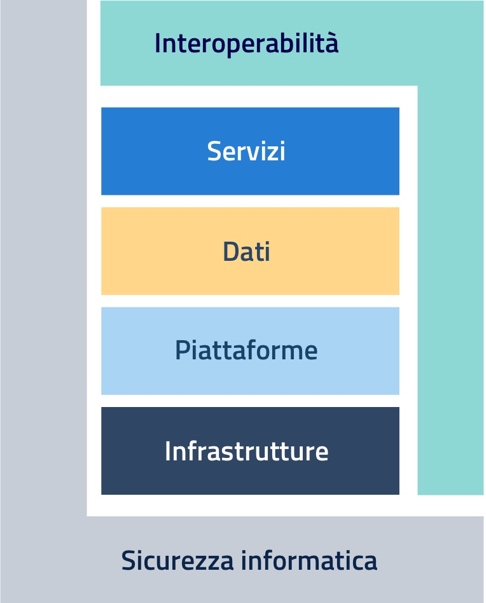

CAPITOLO 9. Indicazioni per le PA
=================================

Il Piano triennale 2020-2022 rappresenta la naturale prosecuzione delle
precedenti edizioni del Piano e se, come anticipato nell’\ *Excutive
summary*, la prima edizione ha posto l’accento sull’introduzione del
Modello strategico e la seconda ha dettagliato l’implementazione del
Modello nel suo complesso, questa edizione si focalizza invece sulla
realizzazione delle azioni previste, guidandone la lettura attraverso
una rappresentazione semplificata del Modello che si concentra sugli
ambiti tecnologici d’intervento ed evidenzia chiaramente i legami
traversali tra di essi. Tale semplificazione è stata resa possibile, in
occasione della terza edizione del Piano, grazie al progressivo processo
di condivisione e affinamento, con le amministrazioni, del linguaggio,
delle finalità e dei riferimenti progettuali.

+-----------------------------------+-----------------------------------+
| |La figura 2 mette a confronto il | |image2|                          |
| Modello strategico di evoluzione  |                                   |
| del sistema informativo della PA  |                                   |
| nel Piano 2019-2021 e la          |                                   |
| rappresentazione semplificata     |                                   |
| contenuta nel Piano 2020-2022. In |                                   |
| particolare, nella parte sinistra |                                   |
| della figura è rappresentato il   |                                   |
| modello strategico del Piano      |                                   |
| triennale 2019-2021 costituito da |                                   |
| 6 livelli orizzontali (accesso ai |                                   |
| servizi, ecosistemi, piattaforme, |                                   |
| dati della PA, modello di         |                                   |
| interoperabilità e                |                                   |
| infrastrutture) e 2 livelli       |                                   |
| verticali (sicurezza informatica  |                                   |
| e piattaforma nazionale digitale  |                                   |
| dati). Nella parte destra della   |                                   |
| figura è inserita la              |                                   |
| rappresentazione semplificata del |                                   |
| Modello strategico costituito da  |                                   |
| quattro livelli orizzontali       |                                   |
| (servizi, dati, piattaforme e     |                                   |
| infrastrutture) e due livelli     |                                   |
| verticali (sicurezza e            |                                   |
| interoperabilità).|               |                                   |
+-----------------------------------+-----------------------------------+

Figura 2 - Modello strategico di evoluzione del sistema informativo
della PA nel Piano 2019-2021 e rappresentazione semplificata nel Piano
2020-2022

Inoltre a completamento di quanto dettagliato nei singoli capitoli, dal
confronto tra le due rappresentazioni, è opportuno sottolineare come la
semplificazione abbia riguardato da un lato, il riconnettere la
Piattaforma Digitale Nazionale Dati alle altre Piattaforme abilitanti e,
dall’altro, il dedicare agli Ecosistemi uno specifico spazio nella
*governance,* con l’obiettivo di qualificarne gli aspetti di
coordinamento operativo tra i diversi attori di ciascun ecosistema e di
interoperabilità tra ecosistemi diversi.

Il nuovo approccio opera uno stretto collegamento con le Linee di azione
espresse nella *roadmap* e i risultati attesi. In particolare, gran
parte delle vecchie linee di azione del Piano 2019-2021 che non hanno
raggiunto la naturale conclusione, ha visto un’evoluzione in linee di
azione riformulate nel nuovo contesto.

Alcune di esse avevano la caratteristica di essere attività continuative
nel tempo, oppure di essere attività che – seppure non concluse – sono
azioni da condurre a regime, azioni consolidate presso AGID e presso le
Amministrazioni, per le quali non risulta più necessario darne evidenza.

Nel capitolo “Dati della Pubblica Amministrazione” del Piano 2019-2021,
la Linea LA22 riguardava l’evoluzione del Catalogo nazionale dati,
prevedendo aggiornamenti e rilasci periodici che continuano nel tempo;
la Linea LA24 - Ruoli e procedure per la gestione del *Registry* è
costituita anch’essa da guide e raccomandazioni che vanno rilasciate nel
tempo e che quindi non costituiscono più un’azione da mantenere in
evidenza nel nuovo Piano. 

Il capitolo “Piattaforme” del Piano 2019-2021 riportava linee di lavoro
ad oggi ben consolidate che continuano il loro naturale percorso: è il
caso della LA28 - Adeguamento/evoluzione delle piattaforme telematiche,
della LA29 - Messa in esercizio della BDOE, della LA30 - Gestione
elettronica degli ordini verso i fornitori, della LA36 - Revisione della
piattaforma open data SOLDIPUBBLICI. 

Analogamente, tutte le linee di azione sulla conservazione e gestione
documentale quali le LA45 - Nuove Linee Guida per la formazione,
gestione e conservazione dei documenti informatici, LA46 - Modelli per
l'interoperabilità tra sistemi di gestione documentale delle PA, LA47 -
Progetto di redazione di linee guida di interoperabilità tra sistemi di
conservazione, LA48 - Progetto di dematerializzazione documenti della
PA, sono attività che proseguono a regime, con ovvi aggiornamenti, e che
trovano la loro esplicitazione in altre sedi.

Per quanto riguarda il capitolo “Sicurezza informatica” del Piano
2019-2021, la LA57 - Adeguamento delle PA agli standard Trasmissione
automatizzata IoC – il relativo documento sarà pubblicato come Guida
Tecnica entro dicembre 2020. Si precisa che a seguito delle modifiche
sulle funzioni introdotte dal DPCM 8 agosto 2019, recante Disposizioni
sull'organizzazione e il funzionamento del *Computer security incident
response team* - CSIRT italiano, alcune linee d’azione del precedente
Piano non prevedono una prosecuzione nell’attuale.

Il capitolo “Strumenti per la generazione di servizi digitali”
prevedeva, tra le altre, due linee di azione LA69 - Evoluzione della
piattaforma Docs Italia e LA70 - Sperimentazione adozione Docs Italia
per documentare progetti pubblici legati all’Agenda digitale: sono
diventate parte di attività consolidate e continuative di cui non
risulta più necessario dare evidenza.

Per ciò che concerne infine il capitolo “Governare la trasformazione
digitale” le attività che facevano parte della Linea di azione LA80 -
Laboratori digitali per i territori sono integrate, nel nuovo Piano,
all’interno di tutte le attività del capitolo omologo che vengono svolte
dalle realtà territoriali mentre la linea LA88 - Interazione della
figura del Difensore Civico per il Digitale con la rete dei Responsabili
per la transizione al digitale costituisce un’attività di rete ormai
divenuta istituzionale.  

L’impostazione dei capitoli di questa terza edizione del Piano fa sì che
risulti chiaro quali siano le linee di azione che ci si aspetta le
amministrazioni mettano in atto, come si è visto nei capitoli
precedenti, con una sequenza temporale successiva alle azioni condotte
da AGID, dal Dipartimento per la Trasformazione Digitale e da altre
amministrazioni *owner* dei processi rappresentati. 

In questo capitolo si è scelto di rappresentare nelle infografiche che
seguono le agende delle PA in termini di avvio e conclusione delle
azioni a loro carico presenti nelle *roadmap* degli 8 capitoli del
Piano.

Le agende delle PA, costruite sulla base dei cluster PA, PAC, Regioni e
Province Autonome e PAL, sono così strutturate:

-  in fig. 3 sono rappresentate le azioni a carico di tutte le PA e che
   hanno avvio e/o conclusione (in questo caso l’azione è preceduta da
   una barra in grigio) nel corso del 2020.

-  nelle fig. 4 e 5 sono rappresentate le azioni a carico di tutte le PA
   e che hanno avvio e/o conclusione (in questo caso l’azione è
   preceduta da una barra in grigio) nel corso del 2021.

-  in fig. 6 sono rappresentate le azioni a carico di tutte le PA e che
   hanno avvio e/o conclusione (in questo caso l’azione è preceduta da
   una barra in grigio) nel corso del 2022.

-  in fig. 7 sono rappresentate le azioni che hanno avvio e/o
   conclusione (in questo caso l’azione è preceduta da una barra in
   grigio) nel triennio 2020-2022 e che sono a carico esclusivamente
   delle Pubbliche Amministrazioni Centrali (Ministeri, Agenzie,
   Authority, enti di previdenza, altri enti e amministrazioni
   centrali).

-  in fig. 8 sono rappresentate le azioni che hanno avvio e/o
   conclusione (in questo caso l’azione è preceduta da una barra in
   grigio) nel triennio 2020-2022 e che sono a carico esclusivamente
   delle Regioni e delle Province Autonome.

-  in fig. 9 sono rappresentate le azioni che hanno avvio e/o
   conclusione (in questo caso l’azione è preceduta da una barra in
   grigio) nel triennio 2020-2022 e che sono a carico esclusivamente
   delle Pubbliche Amministrazioni Locali (Città Metropolitane, Comuni,
   Università, Scuole, ASL, AO…).

**Le azioni 2020 per tutte le Pubbliche Amministrazioni**

|image3|\ |image4|\ [CHART]

Figura 3 - Le azioni 2020 per tutte le Pubbliche Amministrazioni

**Le azioni 2021 per tutte le Pubbliche Amministrazioni (1/2)**

|image5|\ |image6|\ [CHART]

Figura 4 - Le azioni 2021 per tutte le Pubbliche Amministrazioni (1/2)

**Le azioni 2021 per tutte le Pubbliche Amministrazioni (2/2)**

|image7|\ |image8|\ [CHART]

Figura 5 - Le azioni 2021 per tutte le Pubbliche Amministrazioni (2/2)

**Le azioni 2022 per tutte le Pubbliche Amministrazioni**

|image9|\ |image10|\ [CHART]

Figura 6 - Le azioni 2022 per tutte le Pubbliche Amministrazioni

**Le azioni 2020-2022 per le Pubbliche Amministrazioni Centrali (PAC)**

|image11|\ |image12|\ [CHART]

Figura 7 - Le azioni 2020-2022 per le Pubbliche Amministrazioni Centrali
(PAC)

**Le azioni 2020-2022 per le Regioni e le Province Autonome**

|image13|\ |image14|\ [CHART]

Figura 8 - Le azioni 2020-2022 per le Regioni e le Province Autonome

**Le azioni 2020-2022 per le Pubbliche Amministrazioni Locali (PAL)**

|image15|\ |image16|\ [CHART]

Figura 9 - Le azioni 2020-2022 per le Pubbliche Amministrazioni Locali
(PAL)

.. |La figura 2 mette a confronto il Modello strategico di evoluzione del sistema informativo della PA nel Piano 2019-2021 e la rappresentazione semplificata contenuta nel Piano 2020-2022. In particolare, nella parte sinistra della figura è rappresentato il modello strategico del Piano triennale 2019-2021 costituito da 6 livelli orizzontali (accesso ai servizi, ecosistemi, piattaforme, dati della PA, modello di interoperabilità e infrastrutture) e 2 livelli verticali (sicurezza informatica e piattaforma nazionale digitale dati). Nella parte destra della figura è inserita la rappresentazione semplificata del Modello strategico costituito da quattro livelli orizzontali (servizi, dati, piattaforme e infrastrutture) e due livelli verticali (sicurezza e interoperabilità).| image:: ./media/image4.jpeg
   :width: 2.20472in
   :height: 2.7364in

