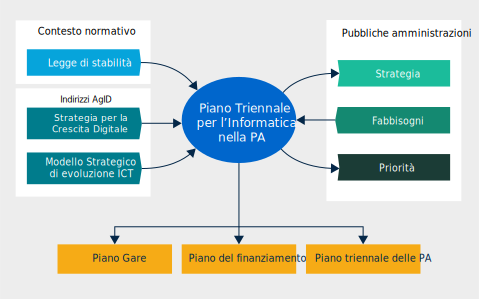
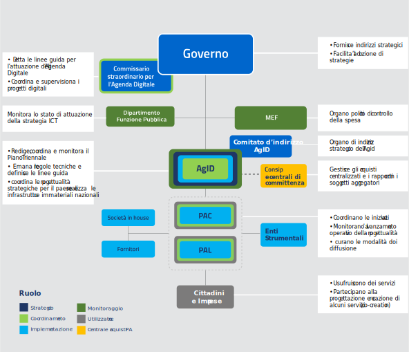

Piano triennale per l'informatica nella Pubblica amministrazione
================================================================

Premessa
--------

Lo sviluppo e il rilancio di un’economia intelligente, sostenibile e
solidale dell’Europa, finalizzato a conseguire elevati livelli di
occupazione, produttività e coesione sociale, è strettamente legato alla
sua crescita digitale. Già dal 2010 la Strategia Europa 2020 si pone
ambiziosi obiettivi in materia di occupazione, innovazione, istruzione,
integrazione sociale e clima/energia ed individua, all’interno di “un
mercato digitale unico europeo” gli obiettivi per sviluppare l'economia
e la cultura digitale in Europa, lasciando a tutti gli Stati membri il
compito di definire le proprie priorità e strategie nazionali.

Le politiche dell’innovazione hanno tradizionalmente pensato a
digitalizzare processi esistenti, mentre il digitale rappresenta una
leva di trasformazione economica e sociale che, mettendo al centro delle
azioni i cittadini e le imprese, rende l'innovazione digitale un
investimento pubblico per una riforma strutturale del Paese.

L’Italia, sulle base delle indicazioni fornite dalla “Agenda digitale
europea”, ha definito una propria strategia nazionale elaborata di
concerto con i Ministeri e in collaborazione con la Conferenza delle
Regioni e delle Province Autonome. Nel 2015 il Consiglio dei Ministri ha
approvato due programmi strategici per il Paese: il `Piano nazionale
Banda Ultra
Larga <http://bandaultralarga.italia.it/piano-bul/strategia/>`__ e la
`Strategia per la Crescita Digitale
2014-2020 <http://www.agid.gov.it/sites/default/files/documenti_indirizzo/strategia_crescita_digitale_ver_def_21062016.pdf>`__ [1]_.

L’attuazione dell’Agenda digitale italiana richiede il coordinamento di
molteplici azioni in capo alla Pubblica amministrazione, alle imprese e
alla società civile e necessita di una gestione integrata delle diverse
fonti di finanziamento nazionali e comunitarie (a livello centrale e
territoriale).

A tal fine l’Agenzia per l’Italia Digitale ha il compito di redigere il
Piano triennale per l’informatica nella Pubblica amministrazione [2]_.

Il Piano che viene di seguito presentato è stato costruito avendo a
riferimento quanto indicato nella Strategia per la crescita digitale,
con le azioni, la definizione dei fabbisogni finanziari e gli indicatori
ivi rappresentati, con l’obiettivo di indirizzare gli investimenti in
ICT del settore pubblico secondo le linee guida del Governo e in
coerenza con gli obiettivi e i programmi europei. Il Piano propone alle
Pubbliche amministrazioni di contribuire allo sviluppo e alla crescita
dell’economia del Paese fornendo loro indicazioni su alcuni strumenti
che permetteranno lo snellimento dei procedimenti burocratici, la
maggiore trasparenza dei processi amministrativi, una maggiore
efficienza nell’erogazione dei servizi pubblici e, non ultimo, la
razionalizzazione della spesa informatica.

Sono questi tutti fattori che contribuiscono alla realizzazione di
norme, condizioni e opportunità uguali per i destinatari primi della
trasformazione digitale del Paese, e cioè tutti i cittadini e tutte le
imprese.

Contesto
--------

Il Piano triennale è costruito sulla base di un Modello
strategico di evoluzione del sistema informativo della Pubblica
amministrazione [3]_ (illustrato nel capitolo 2 “Modello strategico di
evoluzione del sistema informativo della Pubblica amministrazione”) e
indirizza il piano delle gare, il piano dei finanziamenti e i piani
triennali delle singole PA.

   
   Figura 1 - Input e output del Piano triennale

Il Piano propone un modello sistemico, diffuso e condiviso, di gestione
e di utilizzo delle tecnologie digitali più innovative, improntato a uno
stile di management agile ed evolutivo, e basato su una chiara
*governance* dei diversi livelli della Pubblica amministrazione. La
sinergia e l’equilibrio tra le tre direttrici (tecnologie innovative,
stile di management agile e modello di *governance* chiaro ed efficace)
garantisce al sistema Paese un più efficace sfruttamento dei benefici
delle nuove tecnologie e assicura ai cittadini un vantaggio in termini
di semplicità di accesso e miglioramento dei servizi digitali esistenti.

Il Piano deve indirizzare una realtà complessa con livelli di delega di
competenze e di capacità operativa molto diversificate, e caratterizzata
da elevata frammentazione [4]_:

-  32.000 dipendenti pubblici nell’ICT, di cui circa 18.000 nelle
   Pubbliche amministrazioni centrali (PAC) e 14.000 nelle Pubbliche
   amministrazioni locali (PAL), a cui si aggiungono circa 6.000
   dipendenti delle società in house locali e più di 4.000 nelle società
   in house centrali;

-  stima di circa 5,7 miliardi di Euro di spesa esterna ICT;

-  stima di circa 11.000 data center delle Pubbliche amministrazioni;

-  circa 160.000 basi di dati presenti nel catalogo delle basi di dati
   della Pubblica amministrazione di AgID e oltre 200.000 applicazioni
   che utilizzano tali dati secondo quanto rilevato dal censimento
   svolto su 13.822 Amministrazioni; la precisione di questi dati non è
   tanto importante quanto le dimensioni che sottolineano la complessità
   del problema;

-  oltre 25.000 siti web.

Approccio alla stesura del Piano triennale
------------------------------------------

La stesura del Piano triennale ha visto il coinvolgimento delle
Pubbliche amministrazioni locali e centrali, anche attraverso un
processo di rilevazione di dati ed informazioni sia per la condivisione
dell’impostazione scelta e dei principali contenuti del Modello
strategico sia per effettuare una prima ricognizione sul campo delle
iniziative e dei costi ICT. Sono state coinvolte:

-  le Pubbliche amministrazioni centrali, in particolare i ministeri
   comprensivi di tutti gli enti vigilati;

-  le Agenzie fiscali;

-  gli Enti previdenziali;

-  le Regioni;

-  le Città metropolitane;

-  l’ANCI.

   Sono inoltre stati resi partecipi del processo altri stakeholder
   chiave, quali:

-  il Commissario alla spending review;

-  il Ministero dell’Economia e delle Finanze;

-  il Dipartimento della Funzione Pubblica;

-  Sogei;

-  Consip;

-  l’Agenzia per la Coesione Territoriale;

-  la Conferenza Unificata;

-  Assinform e Confindustria.

L’avvio delle attività di rilevazione e analisi dati ha visto
inizialmente coinvolte le amministrazioni centrali (PAC), soprattutto in
considerazione della significatività della loro spesa ICT [5]_.

La rilevazione ha permesso di ottenere una fotografia rispetto a:

-  le principali caratteristiche della spesa ICT per l’anno 2016 e
   confronto con la spesa media annua 2013-2015;

-  la mappatura dei principali progetti in corso o in fase di avvio;

-  i possibili obiettivi di risparmio.

Nel corso della rilevazione, le amministrazioni centrali hanno inoltre
fornito la propria programmazione in materia ICT al fine di evidenziare
le modalità con cui intendono dare seguito ai seguenti obiettivi:

-  realizzazione dei progetti previsti dal Piano crescita digitale;

-  attuazione delle disposizioni della Circolare AgID 24 giugno 2016, n.
   2 che, in via transitoria, anticipava le disposizioni correlate
   all’attuazione del Piano triennale in riferimento al Modello
   strategico di evoluzione del sistema informativo della Pubblica
   amministrazione;

-  attuazione delle disposizioni normative specifiche per la
   realizzazione di uno o più ecosistemi di riferimento.

Le informazioni raccolte sono quindi state utili per:

-  evidenziare i fabbisogni ICT che, pur emergendo dai singoli
   ecosistemi (cfr. capitolo 6 “Ecosistemi"), hanno carattere generale
   per l’intera Pubblica amministrazione;

-  individuare soluzioni già realizzate, in via di realizzazione o
   pianificate che sono da considerare strategiche per l’intera Pubblica
   amministrazione;

-  verificare con i ministeri che il Modello sia condiviso e coerente.

Lo stesso tipo di percorso è stato avviato anche con le Amministrazioni
regionali e le Città metropolitane. Tuttavia, in questa fase,
l’attenzione è stata focalizzata sulle principali PAC, strategiche per:

-  rilevanza della spesa;

-  implementazione di sinergie e di interventi di centralizzazione in
   ottica di ottimizzazione della spesa complessiva;

-  titolarità dei principali sistemi informatici nazionali.

La complessità nella definizione e nella calibratura dei contenuti del
Piano triennale e la continua evoluzione tecnologica inducono a una
gestione che contiene la previsione dei due anni successivi a quello di
presentazione, in una logica di scorrimento continuo. Questo Piano va
visto quindi come uno strumento dinamico, la cui implementazione dipende
dall’aggiornamento dei contenuti e da uno scambio trasparente di
informazioni con le Pubbliche amministrazioni già coinvolte, oltre che
dall’allargamento progressivo alle altre.

L’attuazione del Piano triennale prevede un percorso graduale di
coinvolgimento delle Pubbliche amministrazioni:

-  il 2017 è l’anno della costruzione attraverso il consolidamento della
   strategia di trasformazione digitale e il completamento del percorso
   di condivisione con le Pubbliche amministrazioni;

-  il 2018 è l’anno del consolidamento del Piano che sarà gestito anche
   attraverso strumenti on line che consentiranno alle Pubbliche
   amministrazioni di fornire i propri dati con semplicità. Essi
   permetteranno di gestire i piani triennali delle amministrazioni in
   modo dinamico;

-  il 2019 è l’anno di completamento delle azioni del primo ciclo
   triennale del processo, che potrà pertanto essere ulteriormente
   affinato per il successivo triennio.

Gli attori del processo di trasformazione digitale della PA
-----------------------------------------------------------

Gli attori del processo di trasformazione digitale della PA sono:

-  il Governo, che fornisce gli indirizzi strategici della
   trasformazione digitale della Pubblica amministrazione e, attraverso
   strumenti normativi, ne facilita l’adozione;

-  il Dipartimento della Funzione Pubblica, che è l’organo politico che
   vigila, anche sull’operatività di AgID;

-  il Ministero dell’Economia e delle Finanze (MEF), che è l’organo di
   controllo della spesa e del rispetto degli obiettivi di risparmio;

-  il Commissario per l'attuazione dell'Agenda digitale che è un `organo
   straordinario <http://presidenza.governo.it/AmministrazioneTrasparente/DisposizioniGenerali/AttiGenerali/DpcmOrganismiCollegiali/DPCM_20160916_CommStraord_AgendaDigitale.pdf>`__\  [6]_
   collocato in seno alla Presidenza del Consiglio dei Ministri, con lo
   scopo di dettare le linee guida e porre in essere le azioni ritenute
   opportune e prioritarie al fine dell'attuazione dell'Agenda digitale.
   Il Commissario, per svolgere il suo ruolo di coordinamento e
   supervisione dei progetti digitali e di stimolo allo sviluppo di
   procedure agili e di competenze tecnologiche all'interno della PA, si
   avvale di un contingente di personale posto alle sue dirette
   dipendenze, con particolare qualificazione professionale nei settori
   di attività pertinenti alle funzioni esercitate (Team per la
   trasformazione digitale), oltre che di tutti i soggetti pubblici,
   anche in forma societaria, operanti nel settore delle tecnologie
   dell'informatica e della comunicazione. Esso può inoltre esercitare
   il potere sostitutivo in caso di inadempienze relative all'attuazione
   dell'Agenda digitale. Il Commissario ha un mandato a termine di due
   anni e terminerà le attività il 16 settembre 2018;

-  il Comitato di indirizzo di AgID, che è l'organo di indirizzo
   strategico di AgID che delibera sul Modello strategico,
   individuandone le priorità di intervento anche sulla base delle
   disponibilità finanziarie, e ne monitora l'attuazione;

-  l’AgID, che trasforma gli obiettivi strategici in progettualità,
   coordina la programmazione, la realizzazione delle piattaforme
   nazionali e dei progetti catalizzatori del cambiamento, gestendo la
   relazione tra gli attori, emanando regole tecniche e – laddove
   prevista – gestendo la vigilanza. L’AgID, inoltre, trasforma il
   Codice dell’amministrazione digitale (CAD) [7]_ in processi
   attuativi, regole e progetti che vengono integrati nel Piano e
   monitora l’attuazione dei progetti da parte delle amministrazioni;

-  le Amministrazioni regionali e le Province autonome che
   contribuiscono all’aggiornamento dell’attuazione e all’adeguamento
   della programmazione del Piano triennale per l'informatica nella PA.
   Attraverso le strutture tecniche e la rappresentanza politica della
   Conferenza delle Regioni e delle Province autonome e nello specifico
   con l’azione di coordinamento esercitata dalla Commissione speciale
   Agenda digitale;

-  le Amministrazioni, tutte, che coordinano le iniziative indicate nel
   piano e governano i singoli progetti. Con l’identificazione del
   Responsabile per la transizione alla modalità operativa digitale,
   assicurano l’armonizzazione della propria strategia ai principi e
   agli indirizzi del Modello strategico e l’implementazione delle
   proprie progettualità e dello sviluppo delle proprie iniziative;

-  le società in house, che partecipano allo sviluppo dei progetti delle
   singole amministrazioni e allo sviluppo e alla gestione delle
   piattaforme abilitanti, anche per erogare servizi di assistenza e
   consulenza;

-  gli Enti strumentali, che sono coinvolti nell’attuazione dell’Agenda
   digitale italiana;

-  la società **Consip** e le **centrali di committenza** che gestiscono
   gare e stipulano contratti per le amministrazioni centrali e locali.
   Operano sulla base Piano triennale per aggregare i fabbisogni e la
   conseguente acquisizione di beni e servizi.

La Figura 2 evidenzia le relazioni che intercorrono tra i suddetti
attori e ne riassume le funzioni rispetto alla definizione e attuazione
del Piano:

   Figura 2 – Gli attori del processo di trasformazione digitale della PA

Struttura del documento
-----------------------

Il resto del documento è strutturato come segue:

-  Parte prima - Quadro di riferimento:

   -  il capitolo 2 illustra il *Modello strategico di evoluzione del
      sistema informativo della Pubblica amministrazione*, ovvero la
      visione a medio/lungo termine verso la quale la Pubblica
      amministrazione deve tendere per sfruttare al meglio i benefici
      derivanti da un uso corretto, mirato e consapevole delle
      tecnologie digitali.

-  Parte seconda - Componenti del Modello strategico di evoluzione

   del sistema informativo della PA:

   -  i capitoli dal 3 al 10 presentano le componenti del Modello
      strategico, adottando la seguente struttura:

   -  *scenario attuale* - sintetizza alcuni elementi utili a descrivere
      la situazione in essere rispetto ai temi trattati nel capitolo;

   -  *obiettivi strategici* - illustra gli obiettivi perseguiti in
      coerenza con i requisiti strategici individuati dal contesto
      normativo di riferimento e dalle indicazioni fornite nella
      *Strategia per la crescita digitale 2014-2020*;

   -  *linee di azione* - presenta alcuni principi e indicazioni utili
      all’attuazione del Piano e individua le linee di azione necessarie
      al raggiungimento degli obiettivi fissati.

-  Parte terza - Note di indirizzo:

   -  il capitolo 11 riporta elementi relativi agli obiettivi di
      razionalizzazione della spesa ICT della PA;

   -  il capitolo 12 riporta in modo sintetico le azioni che le
      Pubbliche amministrazioni dovranno mettere in atto;

   -  il capitolo 13 riporta principi, suggerimenti e accorgimenti che
      tutte le Pubbliche amministrazioni devono adottare per la
      realizzazione dei progetti digitali.

La lettura congiunta della *prima* e della *terza parte* fornisce
indicazioni sufficienti per sviluppare un’idea generale del Modello
strategico e delle azioni che le Pubbliche amministrazioni devono
intraprendere.

La lettura della *seconda parte* è invece utile per acquisire una
conoscenza più approfondita delle attività previste.

Il documento contiene infine i seguenti allegati:

-  l’Allegato 1 approfondisce il Contesto di riferimento del Piano
   triennale;

-  l’Allegato 2 riassume gli Strumenti e le risorse per l'attuazione del
   Piano;

-  l’Allegato 3 presenta un Quadro sinottico della spesa ICT nelle PAC;

-  l’Allegato 4 propone un Quadro sinottico dei progetti PAC rispetto al
   Modello;

-  l’Allegato 5 presenta il Paniere dataset open data.

.. rubric:: Note

.. [1]
   Strategia per la crescita digitale 2014-2020
   `www.agid.gov.it/sites/default/files/documenti\_indirizzo/strategia\_crescita\_digitale\_ver\_def\_21062016.pdf <http://www.agid.gov.it/sites/default/files/documenti_indirizzo/strategia_crescita_digitale_ver_def_21062016.pdf>`__

.. [2]
   Cfr.Statuto AgID, Decreto del Presidente del Consiglio dei Ministri 8 gennaio 2014 -
   `http://www.agid.gov.it/notizie/2014/02/14/pubblicato-gazzetta-ufficiale-lo-statuto-dellagid <http://www.agid.gov.it/notizie/2014/02/14/pubblicato-gazzetta-ufficiale-lo-statuto-dellagid>`__
   
   La legge n.208 del 28 dicembre 2016 (Legge di stabilità 2016) prevede
   inoltre che l'Agenzia per l'Italia Digitale (AgID) predisponga - per
   conto della Presidenza del Consiglio dei Ministri – il Piano
   triennale (di seguito Piano) che guidi la trasformazione digitale
   della Pubblica amministrazione.

.. [3]
   Approvato dal Comitato di indirizzo di AgID in data 04/02/2016.

.. [4]
   Dati da fonte AgID, 2016.

.. [5]
   I risultati della rilevazione, effettuata da AgID nel periodo
   aprile-ottobre 2016, sono riportati nell’Allegato 3 “Quadro sinottico
   della spesa ICT nelle Pubbliche amministrazioni centrali”.

.. [6]
   DPCM 16 settembre 2016
   `http://presidenza.governo.it/AmministrazioneTrasparente/DisposizioniGenerali/AttiGenerali/DpcmOrganismiCollegiali/DPCM\_20160916\_CommStraord\_AgendaDigitale.pdf <http://presidenza.governo.it/AmministrazioneTrasparente/DisposizioniGenerali/AttiGenerali/DpcmOrganismiCollegiali/DPCM_20160916_CommStraord_AgendaDigitale.pdf>`__

.. [7]
   Decreto legislativo 7 marzo 2005, n. 82 e s.m.
