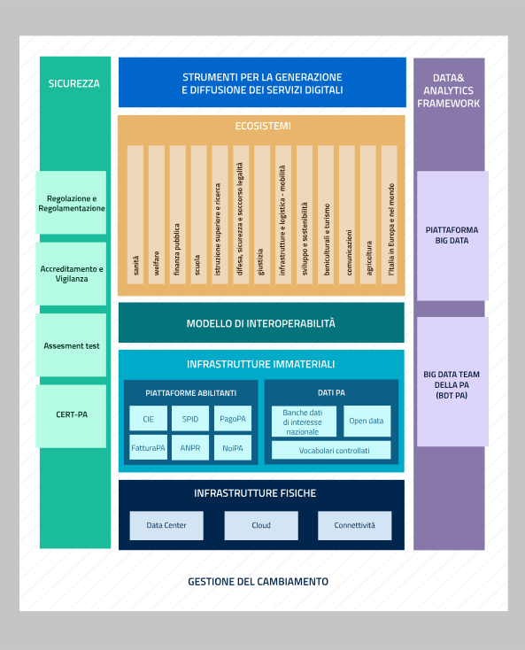

Modello strategico di evoluzione del sistema informativo della Pubblica amministrazione
=======================================================================================

Il Modello strategico di evoluzione del sistema informativo della
Pubblica amministrazione (di seguito “Modello strategico”) [8]_
costituisce il quadro di riferimento su cui innestare e rendere
operativi i progetti, le piattaforme e i programmi descritti nel
documento *Strategia per la crescita digitale 2014-2020* nel quale sono
indicati i requisiti strategici da soddisfare, ovvero:

-  facilitare il coordinamento di tutti gli interventi di trasformazione
   digitale e l’avvio di un percorso di centralizzazione della
   programmazione e della spesa pubblica in materia;

-  considerare prioritario il principio di “digitale per definizione”
   (*digital first*), progettando e implementando i servizi al
   cittadino, a partire dall'utilizzo delle tecnologie digitali;

-  agevolare la modernizzazione della Pubblica amministrazione partendo
   dai processi, superando la logica delle regole tecniche e delle linee
   guida rigide emesse per legge. Esse dovranno essere dinamiche e
   moderne e puntare alla centralità dell'esperienza e ai bisogni
   dell'utenza;

-  adottare un approccio architetturale basato sulla separazione dei
   livelli di *back end* e *front end*, con logiche aperte e standard
   pubblici che garantiscano ad altri attori, pubblici e privati,
   accessibilità e massima interoperabilità di dati e servizi;

-  promuovere soluzioni volte a stimolare la riduzione dei costi e a
   migliorare la qualità dei servizi, contemplando meccanismi di
   remunerazione che possano anche incentivare i fornitori a perseguire
   forme sempre più innovative di composizione, erogazione e fruizione
   dei servizi.

La Strategia per la crescita digitale evidenzia la necessità di un
radicale ripensamento della strategia di progettazione, gestione ed
erogazione dei servizi pubblici in rete che preveda, tra l’altro,
l’adozione delle architetture a più livelli (*multi-layer architecture*)
e dei principi che hanno determinato l’affermazione del modello di
business della cosiddetta *API economy*.

Il Modello strategico è stato quindi pensato per superare l’approccio a
“silos” storicamente adottato dalla Pubblica amministrazione e per
favorire la realizzazione di un vero e proprio sistema informativo della
Pubblica amministrazione (di seguito “Sistema informativo della PA”)
che:

-  consideri le esigenze dei cittadini e delle imprese come punto di
   partenza per l’individuazione e la realizzazione di servizi digitali
   moderni e innovativi (servizi di *front office*);

-  uniformi e razionalizzi le infrastrutture e i servizi informatici
   utilizzati dalla Pubblica amministrazione (servizi di *back office*);

-  favorisca la creazione di un nuovo mercato per quelle imprese private
   che saranno in grado di operare in maniera agile in un contesto non
   più basato su grossi progetti monolitici e isolati ma su servizi a
   valore aggiunto. Tali servizi dovranno (i) rispettare le linee guida
   del Piano triennale, (ii) essere sempre disponibili su dispositivi
   mobili (approccio mobile first) e (iii) essere costruiti con
   architetture sicure, scalabili, altamente affidabili e basate su
   interfacce applicative (API) chiaramente definite;

-  valorizzi le risorse esistenti della Pubblica amministrazione al fine
   di salvaguardare gli investimenti già realizzati, anche incoraggiando
   e creando le condizioni per il riuso del software e delle interfacce
   esistenti di qualità;

-  non disperda le esperienze maturate nei precedenti progetti di
   digitalizzazione del Paese con l’obiettivo di prendere a modello i
   casi di successo (*best practice*) e non ripetere errori commessi nel
   passato;

-  migliori la sicurezza grazie ad un’architettura a più livelli che
   assicuri la separazione tra back end e front end e permetta l’accesso
   ai back end solo in modo controllato e tramite API standard;

-  promuova la realizzazione di nuovi servizi secondo il principio di
   sussidiarietà (ad es. tramite interazioni API), riducendo tempi di
   realizzazione e impegni economici per le amministrazioni sia in fase
   di sviluppo sia in fase di aggiornamento;

-  agevoli il controllo delle spese relative alle tecnologie digitali
   della Pubblica amministrazione, integrando meccanismi per la
   misurazione dello stato di avanzamento delle attività programmate (ad
   es. tramite sistemi di project management condivisi);

-  abiliti politiche *data-driven* per la pianificazione delle attività
   future, basate sull’ottimizzazione delle spese e degli investimenti.

Mappa del Modello strategico
----------------------------

Il Modello strategico può essere schematicamente rappresentato
dalla mappa grafica illustrata in Figura 3.

.. figure:: media/figura3.svg
   :width: 100%

   Figura 3 - Mappa del Modello strategico di evoluzione del sistema informativo della PA

È importante evidenziare che la Mappa è da intendersi come la
rappresentazione di macro-aree che aggregano gli elementi omogenei
oggetto del Piano e non come strati di un modello architetturale a pila
(*stack*).

In riferimento alla Mappa:

-  gli **Strumenti per la generazione e diffusione dei servizi
   digitali** (i) definiscono regole comuni per la progettazione di
   interfacce, servizi e contenuti, migliorando e rendendo coerente la
   navigazione e l’esperienza del cittadino e delle imprese, (ii)
   facilitano il design, la realizzazione e la diffusione di servizi
   digitali, (iii) definiscono linee guida e kit di sviluppo, (iv)
   provvedono alla creazione di community di sviluppatori, di designer e
   di chiunque voglia scambiare informazioni, collaborare e partecipare;

-  gli **Ecosistemi** sono i settori o le aree di policy in cui si
   svolge l’azione da parte delle Pubbliche amministrazioni: dalla
   sanità all’agricoltura, dalla scuola ai beni culturali e così via.
   Ciascun ecosistema può includere diversi domini, coinvolgendo enti e
   organismi pubblici, a partire dai Ministeri di riferimento, ma può
   anche includere soggetti privati che operano nella stessa area di
   interesse e che a vario titolo svolgono funzioni importanti
   all’interno dell’ecosistema stesso. Ad esempio, l’ecosistema “Finanza
   pubblica” comprende l’Agenzia delle Entrate, le Regioni, la Guardia
   di Finanza e, lato soggetti privati, commercialisti, CAF, avvocati
   fiscalisti, ecc. Gli ecosistemi raggruppano i soggetti interessati
   che interagiscono per il raggiungimento di obiettivi comuni
   attraverso (i) la condivisione delle esigenze e delle modalità
   operative, (ii) la condivisione delle differenti competenze, (iii) la
   pianificazione e la realizzazione di progetti ICT;

-  il **Modello di interoperabilità** definisce i meccanismi che
   facilitano e garantiscono la corretta interazione tra gli attori del
   sistema (cittadini, imprese e Pubbliche amministrazioni), favorendo
   la condivisione trasparente di dati, informazioni, piattaforme e
   servizi. Il Modello di interoperabilità è pertanto composto da
   elementi quali linee guida, standard tecnologici e profili di
   interoperabilità che ciascuna Pubblica amministrazione dovrà seguire
   al fine di garantire l’interoperabilità dei propri sistemi con quelli
   di altri soggetti per l’implementazione complessiva del Sistema
   informativo della PA;

-  le **Infrastrutture immateriali** e il **Data & Analytics Framework
   (DAF)** della PA incentivano la centralizzazione e la
   razionalizzazione dei sistemi per la gestione dei processi e dei
   dati, riducendo la frammentazione degli interventi.

   In particolare, le Infrastrutture immateriali facilitano,
   standardizzano e razionalizzano la creazione di servizi ICT e sono
   composte dalle *Piattaforme abilitanti* e dai *Dati della PA*:

   -  nelle *Piattaforme abilitanti* ricadono tutti quei servizi
      infrastrutturali (ad es.: servizio di identificazione,
      servizio di pagamenti, ANPR) che da un lato agevolano e
      riducono i costi per la realizzazione di nuovi servizi,
      dall’altro uniformano gli strumenti utilizzati dagli utenti
      finali durante la loro interazione con la Pubblica
      amministrazione. Ad esso afferiscono inoltre tutte quelle
      soluzioni applicative sufficientemente generiche da poter
      essere condivise dalle Pubbliche amministrazioni (ad es.
      sistema per la gestione dei cedolini degli stipendi);

   -  relativamente ai *Dati della PA* si distinguono: le basi di dati
      di interesse nazionale, gli *open data*, e i vocabolari
      controllati. Quest’ultimo è un *repository* non ancora
      esistente ma considerato necessario per creare e/o mantenere
      tutte quelle risorse fondamentali per la piena valorizzazione
      del patrimonio informativo della Pubblica amministrazione.

   Il *Data & Analytics Framework* è un ambiente centralizzato che
   acquisisce e rende più fruibili i dati pubblici di interesse e ha
   l’obiettivo (i) di rendere più semplice e meno onerosa
   l'interoperabilità dei dati pubblici tra PA e la distribuzione e
   standardizzazione dei dati aperti (*open data*) e (ii) di permettere
   lo studio dei fenomeni sottostanti ai dati pubblici. Inoltre, il
   *Framework* consente lo sviluppo di *data applications*,
   applicazioni software che effettuano operazioni più o meno
   complesse, dal semplice *data retrieval* a tecniche di *machine
   learning*, e mettono le analisi generate a disposizione di un utente
   finale o di un’altra applicazione;

-  le **Infrastrutture fisiche** perseguono l’obiettivo di aumentare la
   sicurezza, ridurre il costo delle infrastrutture tecnologiche e
   migliorare la qualità dei servizi software della Pubblica
   amministrazione, attraverso la razionalizzazione dei *data center*,
   l’adozione sistematica del paradigma *cloud* e lo sviluppo della
   connettività, con particolare riferimento alla rete Internet nei
   luoghi pubblici e negli uffici della Pubblica amministrazione;

-  la **Sicurezza** comprende (i) le attività per la regolazione e
   regolamentazione della cyber security nella PA per l’\ *Assessment
   test* e (ii) il CERT-PA quale strumento operativo per supportare
   l’adozione dei corretti livelli di sicurezza presso la Pubblica
   amministrazione. Sono inoltre identificati anche tutti gli altri
   aspetti che concorrono a rendere sicuri e affidabili i sistemi
   informatici, quali l’accreditamento e la vigilanza, nonché le
   attività di indirizzo e la strumentazione correlata agli adempimenti
   per il rispetto della riservatezza (privacy);

-  la **Gestione del cambiamento** è una componente definita per far
   fronte alle necessità di coordinamento, gestione e monitoraggio delle
   attività funzionali allo sviluppo del Piano. Essa è trasversale alle
   altre componenti e aggrega tutte le linee di azione, di governance e
   di supporto alle PA coinvolte nella realizzazione del Piano.

La Figura 4 dettaglia quanto appena esposto.

La Mappa ha lo scopo di:

-  consolidare la visione di lungo periodo per l’evoluzione dei sistemi
   informativi della PA;

-  rappresentare in modo coerente e sintetico tutte le iniziative in
   corso sul fronte dell’innovazione digitale della PA italiana;

-  fornire un quadro di riferimento per l’identificazione e il governo
   di nuove azioni strategiche;

-  abilitare la definizione di un piano operativo di dettaglio;

-  identificare i soggetti da coinvolgere nell’implementazione della
   strategia e loro responsabilità;

-  consentire il monitoraggio continuativo a più livelli dello stato di
   implementazione degli obiettivi.

Le componenti costituenti la mappa verranno descritte più
dettagliatamente nella Parte seconda del Piano.

   Figura 4 - Mappa di dettaglio del Modello strategico di evoluzione del sistema informativo della PA

.. rubric:: Note

.. [8]
   Deliberato dal Comitato di indirizzo di AgID il 04/02/2016
