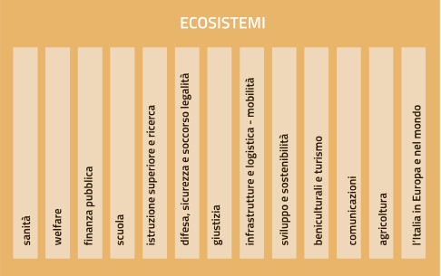

Ecosistemi
==========

Gli ecosistemi sono i settori o aree di intervento in cui si svolge
l’azione delle Pubbliche amministrazioni, dalla sanità all’agricoltura,
dalla scuola ai beni culturali. Il Piano ne individua tredici, che sono
elencati Figura 7 e descritti Tabella 1 nella pagina successiva.

Ciascun ecosistema individua un settore tematico con caratteristiche di
omogeneità. Comprende enti e organismi pubblici e può anche includere
soggetti privati, quali ad esempio le associazioni che, a vario titolo,
svolgono funzioni importanti all’interno dell’ecosistema. Ad esempio,
l’ecosistema “Finanza pubblica” comprende sia soggetti pubblici, come
Ministero dell’Economia e delle Finanze, il Ministero dell’Interno,
l’Agenzia delle Entrate, le Regioni, la Guardia di Finanza, ma anche
soggetti privati come commercialisti, CAF, avvocati fiscalisti.

Al fine di facilitare il coordinamento tra gli attori coinvolti, ogni
ecosistema:

-  definisce le basi di dati di riferimento, le regole di alimentazione
   delle stesse e implementa i meccanismi di comunicazione con il *Data
   & Analytics Framework*;

-  contribuisce alla definizione delle linee guida specifiche per
   l’ecosistema stesso;

-  definisce le regole condivise e trasparenti per il proprio
   funzionamento;

-  utilizza le piattaforme abilitanti;

-  espone i propri servizi attraverso API.

L’applicazione delle regole definite nel Modello di
interoperabilità all’interno di ciascun ecosistema rappresenta il
linguaggio comune che abilita la comunicazione tra gli ecosistemi.

   Figura 7 - Ecosistemi

Scenario attuale
----------------

Al fine di assicurare l’attuazione della Strategia per la crescita
digitale 2014-2020, AgID ha provveduto a una prima definizione degli
ecosistemi sulla base della classificazione `Missioni e
Programmi <http://www.rgs.mef.gov.it/_Documenti/VERSIONE-I/e-GOVERNME1/Contabilit/Pubblicazioni/MissionieProgrammi/%20MissioniProgrammi-2015_10.pdf>`__\  [68]_
indicati nella legge 28 dicembre 2015, n. 209 (Legge di Bilancio 2016).

Sulla base dei criteri sopra indicati sono stati individuati gli
ecosistemi riportati nella seguente tabella, con l’indicazione delle
principali amministrazioni coinvolte:

+-------------------------------------------+-----------------------------------------------------------------------------------------------------------------------------------------------------------------------------------------------------------------------------------------------------------------------------------------------------------------+-------------------------------------------------------------------------------------------------------------------------------------------------------------+
| Ecosistema                                | Descrizione Ecosistema                                                                                                                                                                                                                                                                                          | Principali amministrazioni coinvolte                                                                                                                        |
+-------------------------------------------+-----------------------------------------------------------------------------------------------------------------------------------------------------------------------------------------------------------------------------------------------------------------------------------------------------------------+-------------------------------------------------------------------------------------------------------------------------------------------------------------+
| Sanità                                    | L'ecosistema Sanità è stato definito in accordo alla Missione "Tutela della salute" e con il documento Strategia per la Crescita Digitale 2014-2020 in cui viene identificata l'azione "Sanità digitale".                                                                                                       | Ministero della Salute, MEF, ISS, Regioni, Aziende sanitarie, AgID, Istituti zooprofilattici, AGENAS, AIFA.                                                 |
+-------------------------------------------+-----------------------------------------------------------------------------------------------------------------------------------------------------------------------------------------------------------------------------------------------------------------------------------------------------------------+-------------------------------------------------------------------------------------------------------------------------------------------------------------+
| Welfare                                   | L'ecosistema Welfare comprende le Missioni relative a “Diritti sociali, politiche sociali e famiglia, “Politiche previdenziali” e Politiche per il lavoro”.                                                                                                                                                     | Ministero del Lavoro e delle Politiche Sociali, MEF, MIUR, INPS, INAIL, Regioni, Province e altre aggregazioni di enti territoriali, ANCI, Comuni, COVIP.   |
+-------------------------------------------+-----------------------------------------------------------------------------------------------------------------------------------------------------------------------------------------------------------------------------------------------------------------------------------------------------------------+-------------------------------------------------------------------------------------------------------------------------------------------------------------+
| Finanza pubblica                          | L'ecosistema Finanza Pubblica comprende le Missioni "Politiche economico-finanziarie e di bilancio", "Relazioni finanziarie con le autonomie territoriali" e "Debito pubblico" e l’azione "Fatturazione elettronica PA" presente nel documento Strategia per la Crescita Digitale 2014-2020.                    | MEF, Ministero dell’interno, Agenzia Entrate, Agenzia Dogane e Monopoli Agenzia del Demanio, Equitalia.                                                     |
+-------------------------------------------+-----------------------------------------------------------------------------------------------------------------------------------------------------------------------------------------------------------------------------------------------------------------------------------------------------------------+-------------------------------------------------------------------------------------------------------------------------------------------------------------+
| Scuola                                    | L'ecosistema Scuola è stato definito in accordo alla Missione "Istruzione scolastica", al documento Strategia per la Crescita Digitale 2014-2020 e al D.M. del MIUR del 2015, con cui si avvia il `Piano Nazionale Scuola Digitale <http://www.istruzione.it/scuola_digitale>`__\  [69]_.                       | MIUR e Istituti scolastici (pubblici e parificati), Province e altre aggregazioni di enti territoriali, Comuni, ANCI.                                       |
+-------------------------------------------+-----------------------------------------------------------------------------------------------------------------------------------------------------------------------------------------------------------------------------------------------------------------------------------------------------------------+-------------------------------------------------------------------------------------------------------------------------------------------------------------+
| Istruzione superiore e ricerca            | L'ecosistema Istruzione superiore e ricerca comprende principalmente la Missione "Istruzione universitaria e formazione post-universitaria".                                                                                                                                                                    | MIUR, Sistema Universitario e Istituti Superiori di Ricerca.                                                                                                |
+-------------------------------------------+-----------------------------------------------------------------------------------------------------------------------------------------------------------------------------------------------------------------------------------------------------------------------------------------------------------------+-------------------------------------------------------------------------------------------------------------------------------------------------------------+
| Difesa, sicurezza e soccorso - Legalità   | L'ecosistema Difesa, sicurezza e soccorso comprende principalmente le Missioni "Difesa e sicurezza del territorio", "Ordine pubblico e sicurezza", "Soccorso civile" e "Immigrazione, accoglienza e garanzia dei diritti".                                                                                      | Ministero della Difesa, Ministero dell'Interno, MEF, MIT, MIPAAF                                                                                            |
+-------------------------------------------+-----------------------------------------------------------------------------------------------------------------------------------------------------------------------------------------------------------------------------------------------------------------------------------------------------------------+-------------------------------------------------------------------------------------------------------------------------------------------------------------+
| Giustizia                                 | L'ecosistema Giustizia è stato definito in accordo alla Missione "Giustizia" e al documento Strategia per la Crescita Digitale 2014-2020 in cui è identificata l'azione "Giustizia digitale".                                                                                                                   | Ministero della Giustizia, MEF, INAIL Avvocatura dello Stato, TAR, Commissioni Tributarie, Corte dei Conti, Consiglio di Stato, Corte di Cassazione, CSM.   |
+-------------------------------------------+-----------------------------------------------------------------------------------------------------------------------------------------------------------------------------------------------------------------------------------------------------------------------------------------------------------------+-------------------------------------------------------------------------------------------------------------------------------------------------------------+
| Infrastruttura e logistica - Mobilità     | L'ecosistema Infrastruttura e logistica comprende principalmente le Missioni "Diritto alla mobilità e sviluppo dei sistemi di trasporto", "Infrastrutture pubbliche e logistica" e "Casa e assetto urbanistico".                                                                                                | MIT, MEF, Regioni, Province e altre aggregazioni di enti territoriali, Comuni, ANCI, ACI, ANSF.                                                             |
+-------------------------------------------+-----------------------------------------------------------------------------------------------------------------------------------------------------------------------------------------------------------------------------------------------------------------------------------------------------------------+-------------------------------------------------------------------------------------------------------------------------------------------------------------+
| Sviluppo e sostenibilità                  | L'ecosistema Sviluppo e sostenibilità comprende principalmente le Missioni "Energia e diversificazione delle fonti energetiche", "Competitività e sviluppo delle imprese", "Regolazione dei mercati", "Sviluppo sostenibile e tutela del territorio e dell'ambiente", "Sviluppo e riequilibrio territoriale".   | MISE, MEF, Ministero dell'Ambiente, MIUR, ENEA, ANPA, ARPA, UnionCamere, Regioni, PAL.                                                                      |
+-------------------------------------------+-----------------------------------------------------------------------------------------------------------------------------------------------------------------------------------------------------------------------------------------------------------------------------------------------------------------+-------------------------------------------------------------------------------------------------------------------------------------------------------------+
| Beni culturali e turismo                  | L'ecosistema Beni culturali e turismo è stato definito in accordo alle Missioni "Tutela e valorizzazione dei beni e attività culturali e paesaggistici" e "Giovani e sport", oltre che al documento Strategia per la Crescita Digitale 2014-2020, in cui è identificata l'azione "Turismo digitale".            | MIBACT, MEF, Regioni, Province e altre aggregazioni di enti territoriali, Comuni, ANCI, ENIT, EPT.                                                          |
+-------------------------------------------+-----------------------------------------------------------------------------------------------------------------------------------------------------------------------------------------------------------------------------------------------------------------------------------------------------------------+-------------------------------------------------------------------------------------------------------------------------------------------------------------+
| Comunicazioni                             | L'ecosistema Comunicazioni comprende la Missione "Comunicazioni".                                                                                                                                                                                                                                               | MISE, AGCOM, IPZS, MIT, MEF.                                                                                                                                |
+-------------------------------------------+-----------------------------------------------------------------------------------------------------------------------------------------------------------------------------------------------------------------------------------------------------------------------------------------------------------------+-------------------------------------------------------------------------------------------------------------------------------------------------------------+
| Agricoltura                               | L'ecosistema Agricoltura è stato definito in accordo alla Missione "Agricoltura, politiche agroalimentari e pesca" e al documento Strategia per la Crescita Digitale 2014-2020 in cui è identificata l'azione "Agricoltura digitale".                                                                           | MIPAAF, MEF, Regioni.                                                                                                                                       |
+-------------------------------------------+-----------------------------------------------------------------------------------------------------------------------------------------------------------------------------------------------------------------------------------------------------------------------------------------------------------------+-------------------------------------------------------------------------------------------------------------------------------------------------------------+
| L'Italia in Europa e nel Mondo            | L'ecosistema L'Italia in Europa e nel mondo comprende la Missione "L'Italia in Europa e nel mondo".                                                                                                                                                                                                             | MAE, MEF, MIT, MISE.                                                                                                                                        |
+-------------------------------------------+-----------------------------------------------------------------------------------------------------------------------------------------------------------------------------------------------------------------------------------------------------------------------------------------------------------------+-------------------------------------------------------------------------------------------------------------------------------------------------------------+

Tabella - Elenco ecosistemi

AgID ha effettuato una prima mappatura dei principali progetti relativi
agli ecosistemi in corso o in fase di avvio presso le Pubbliche
amministrazioni centrali. Tale mappatura, come meglio dettagliato
nell’Allegato 4 “Quadro sinottico dei progetti delle Pubbliche
amministrazioni centrali”, deve considerarsi come un’analisi preliminare
in considerazione delle novità legate alla definizione stessa di
ecosistema proposta dal Modello strategico di evoluzione del sistema
informativo della PA.

Si riportano di seguito, a titolo esemplificativo, i risultati [70]_
rilevati nel corso della mappatura dei progetti delle PAC rispetto ai
seguenti quattro ecosistemi:

-  **Ecosistema Sanità:** in tale ecosistema un ruolo centrale è
   ricoperto dal **Fascicolo sanitario elettronico (FSE)** che è lo
   strumento attraverso il quale il cittadino può tracciare, consultare
   e condividere la propria storia sanitaria. La norma stabilisce che
   l’infrastruttura del FSE gestisca l’insieme dei dati e dei documenti
   digitali di tipo sanitario e socio-sanitario generati da eventi
   clinici presenti e trascorsi riguardanti l’assistito. Altre
   soluzioni, attualmente in fase di avvio, che renderanno fruibili
   servizi sanitari informatizzati sono: il **Centro unico di
   prenotazione (CUP)**, il sistema centralizzato informatizzato per la
   prenotazione unificata delle prestazioni, per favorire
   l’accessibilità dell’assistenza e la riduzione dei tempi di attesa;
   il progetto **Telemedicina** per offrire servizi che migliorino la
   fruibilità delle cure, dei servizi di diagnosi e della consulenza
   medica a distanza, oltre al costante monitoraggio di parametri
   vitali.

-  **Ecosistema Finanza pubblica:** la struttura portante di questo
   ecosistema è costituita dalla **BDAP**, la Banca dati delle
   operazioni contabili delle Pubbliche amministrazioni, e dai sistemi
   di supporto ai processi amministrativi contabili quali il **SICOGE**
   (Sistema per la gestione integrata della contabilità economica e
   finanziaria), l’\ **IGRUE** (sistema di controllo e monitoraggio) e
   il **SIOPE** (gestione dei flussi di cassa).

-  **Ecosistema Sviluppo e sostenibilità**: in tale ecosistema, tra le
   altre, sono implementate le azioni per l’attuazione dell’Agenda per
   la semplificazione 2015-2017 e, nello specifico, il consolidamento a
   livello nazionale dei **servizi alle imprese** (SUAP, SUE, …),
   attraverso l'implementazione delle modalità di interlocuzione degli
   imprenditori con la PA, in merito ai procedimenti amministrativi che
   interessano l'attività economica e produttiva e/o l’attività degli
   impianti. AgID, grazie al coinvolgimento dei soggetti interessati
   (Dipartimento per la Funzione Pubblica, Regioni, PAL, Unioncamere,
   ...), favorirà la costituzione e la realizzazione dell’ecosistema.

-  **Ecosistema Giustizia:** tale ecosistema ruota intorno (i) al
   **Processo civile telematico** e (ii) al **Processo tributario
   telematico**, in fase di dispiegamento e consolidamento, (iii) al
   **Processo penale telematico**, in evoluzione anche per le componenti
   attinenti all’esecuzione della pena, (iv) al **Processo
   amministrativo telematico**, in fase di attivazione con i relativi
   sistemi di supporto (come ad esempio la **Multivideoconferenza**) e
   (v) alla costituzione, considerata l’ampiezza e l’eterogeneità
   dell’utenza, dei **Punti di accesso**, ovvero delle strutture
   tecnologico-organizzative che forniscono ai soggetti abilitati
   esterni all’Ecosistema Giustizia i servizi di connessione al portale
   dei servizi telematici.

-  **Ecosistema Sviluppo e Sostenibilità:** È in via di sottoscrizione
   un accordo di collaborazione tra l’Agenzia e il Ministero
   dell’Ambiente e della tutela del territorio e del mare (MATTM) per lo
   sviluppo del sistema Ambiente con interventi volti alla
   razionalizzazione delle infrastrutture presenti sul territorio e al
   supporto ai progetti strategici del Ministero. Ulteriore ambito della
   collaborazione sarà quello del supporto alla definizione del nuovo
   sistema **SISTRI** “Sistema di controllo della tracciabilità dei
   rifiuti” che ha l’obiettivo di informatizzare l’intera filiera dei
   rifiuti speciali a livello nazionale e dei rifiuti urbani per la
   Regione Campania.

-  **Ecosistema Beni culturali e turismo:** È in via di sottoscrizione
   un accordo di collaborazione tra l’Agenzia e il MiBACT per la
   realizzazione di “Interventi per la valorizzazione e promozione del
   settore turistico attraverso la definizione di strategie digitali”.
   In particolare si elaboreranno specifici progetti finalizzati alla
   diffusione gratuita di un sistema unico di accesso ad una federazione
   di reti *wi-fi* messa a disposizione di cittadini e turisti, in
   particolare nei maggiori siti turistici e culturali, accessibili
   anche tramite SPID.

Nel confermare che quanto esemplificato in precedenza non rappresenta un
quadro esaustivo delle evidenze scaturite dalla ricognizione effettuata
da AgID (cfr. paragrafo 1.3), si rimanda al citato Allegato 4 per
l’elenco esaustivo delle iniziative censite, che nel loro insieme
andranno a costituire il primo nucleo di progetti per avviare gli
ecosistemi.

Obiettivi strategici
--------------------

-  Sostenere una visione orientata al cittadino e alle imprese per ogni
   ecosistema, che conduca alla realizzazione di servizi che
   semplifichino l’interazione con le Pubbliche amministrazioni,
   offrendo singoli punti di accesso per l’utente.

-  Uniformare l’approccio allo sviluppo dei servizi della Pubblica
   amministrazione tra i diversi ecosistemi per favorire
   l’omogeneizzazione dei servizi offerti al cittadino. Tali servizi
   devono essere semplici da usare, fondati sull'attenzione alla
   sicurezza e basati sull'interoperabilità di dati e applicazioni (cfr.
   cap.2).

-  Incentivare l’interoperabilità - con un modello basato su API (cfr.
   cap. 5) - tra i sistemi delle Pubbliche amministrazioni quale
   condizione necessaria per incrementare l’efficienza e l’efficacia dei
   servizi pubblici e dei procedimenti amministrativi che vedono
   coinvolti più amministrazioni (ad es. la Conferenza di servizi
   telematica).

-  Capitalizzare le esperienze maturate dalle singole Pubbliche
   amministrazioni attraverso la valorizzazione delle *best practice*.

Linee di azione
---------------

Per ogni ecosistema AgID raccomanda, in coerenza con le priorità
indicate nella Strategia per la crescita digitale 2014-2020, la
costituzione di un *Gruppo di lavoro dell’ecosistema* (di seguito GdL),
che si occupi della gestione e dello sviluppo tecnologico
dell'ecosistema medesimo, definendo i processi operativi da
digitalizzare e le esigenze tecnologiche che caratterizzano l'ecosistema
stesso. Il GdL avrà il compito di:

-  definire le azioni da realizzarsi per l’implementazione
   dell’ecosistema e le loro priorità (roadmap), anche nel rispetto dei
   vincoli normativi;

-  individuare e interagire, qualora necessario, con le amministrazioni
   che possono variare e condizionare il quadro normativo di merito
   dell’ecosistema;

-  definire il Piano di attività attraverso l’individuazione dei
   progetti utili allo sviluppo dell’ecosistema;

-  garantire la diffusione dei temi tecnologici che riguardano
   l’ecosistema attraverso il coinvolgimento di tutti i soggetti
   interessati;

-  verificare la coerenza complessiva con il Piano triennale e in
   particolare con i principi di interoperabilità, API, sicurezza,
   utilizzo delle piattaforme abilitanti, linee di design e sviluppo
   software, come illustrato nel capitolo 2 “Modello strategico di
   evoluzione del sistema informativo della Pubblica amministrazione”;

-  coinvolgere società civile e stakeholder nella definizione dello
   sviluppo dell’ecosistema.

Da un punto di vista più strettamente tecnico, il GdL assicurerà la
realizzazione delle azioni necessarie a:

-  individuare, redigere e pubblicare, secondo quanto definito dal
   Modello di interoperabilità, standard tecnologici e specifiche
   tecniche per gli applicativi, quali, ad esempio, interfacce standard
   per specifiche API di settore, glossari specifici, profili di
   interoperabilità e *best practice*;

-  individuare o definire il modello dei dati, in coerenza con quanto
   già presente nel paragrafo 4.1 “Dati della Pubblica amministrazione”;

-  stimolare e monitorare l’utilizzo delle Piattaforme abilitanti.

+---------------+----------------------------------------------------------------------------------------------------------------------------------------------------------------------------------------------------------------------------------------+
| Oggetto       | Gruppi di Lavoro degli ecosistemi                                                                                                                                                                                                      |
+---------------+----------------------------------------------------------------------------------------------------------------------------------------------------------------------------------------------------------------------------------------+
| Tempi         | Da maggio 2017                                                                                                                                                                                                                         |
+---------------+----------------------------------------------------------------------------------------------------------------------------------------------------------------------------------------------------------------------------------------+
| Attori        | PA, AgID                                                                                                                                                                                                                               |
+---------------+----------------------------------------------------------------------------------------------------------------------------------------------------------------------------------------------------------------------------------------+
| Descrizione   | Per ciascun ecosistema, i GdL danno seguito alle attività operative attraverso l’individuazione degli obiettivi specifici dell’ecosistema stesso, la pianificazione dei progetti e la costituzione di luoghi di discussione tecnica.   |
|               |                                                                                                                                                                                                                                        |
|               | AgID, su richiesta, può supportare le attività dell’ecosistema, in particolare per quanto riguarda la finalizzazione delle attività del GdL.                                                                                           |
+---------------+----------------------------------------------------------------------------------------------------------------------------------------------------------------------------------------------------------------------------------------+
| Risultato     | ---                                                                                                                                                                                                                                    |
+---------------+----------------------------------------------------------------------------------------------------------------------------------------------------------------------------------------------------------------------------------------+

Il modello di gestione e sviluppo tecnologico per gli ecosistemi sopra
declinato ha trovato una prima applicazione nell’Ecosistema Sanità. In
particolare la realizzazione, tuttora in itinere, del Fascicolo
Sanitario Elettronico è sintetizzata nella seguente linea d’azione.

+---------------+--------------------------------------------------------------------------------------------------------------------------------------------------------------------------------------------------------------------------------------------+
| Oggetto       | Evoluzione del Fascicolo sanitario elettronico (FSE)                                                                                                                                                                                       |
+---------------+--------------------------------------------------------------------------------------------------------------------------------------------------------------------------------------------------------------------------------------------+
| Tempi         | In corso                                                                                                                                                                                                                                   |
+---------------+--------------------------------------------------------------------------------------------------------------------------------------------------------------------------------------------------------------------------------------------+
| Attori        | Ministero della Salute , MEF, AgID, Regioni e Asl                                                                                                                                                                                          |
+---------------+--------------------------------------------------------------------------------------------------------------------------------------------------------------------------------------------------------------------------------------------+
| Descrizione   | Il Ministero della Salute, di concerto con il MEF e l’AgID, ha messo a punto il progetto di adeguamento delle infrastrutture alle disposizioni del D.P.C.M. 178/2015.                                                                      |
|               |                                                                                                                                                                                                                                            |
|               | Il decreto ministeriale e le regole di interoperabilità che regolano il funzionamento del sistema sono pubblicate entro giugno 2017.                                                                                                       |
|               |                                                                                                                                                                                                                                            |
|               | Le amministrazioni regionali dovranno procedere alla realizzazione dei propri sistemi di Fascicolo sanitario elettronico regionale, interoperabili con la infrastruttura nazionale, secondo i piani presentati e comunque entro il 2018.   |
|               |                                                                                                                                                                                                                                            |
|               | Le amministrazioni che entro giugno 2017 non avranno completato l’adozione di sistemi autonomi dovranno adottare, secondo il principio di sussidiarietà, le soluzioni messe a disposizione dal MEF.                                        |
|               |                                                                                                                                                                                                                                            |
|               | Le Regioni provvedono a completare la diffusione del Fascicolo sanitario elettronico sul proprio territorio a tutti i propri assistiti.                                                                                                    |
+---------------+--------------------------------------------------------------------------------------------------------------------------------------------------------------------------------------------------------------------------------------------+
| Risultato     | Decreto ministeriale che definisce le regole di interoperabilità *(data di rilascio: giugno 2017)*                                                                                                                                         |
|               | Realizzazione dei sistemi FSE Regionali *(data di rilascio: entro dicembre 2018)*                                                                                                                                                          |
+---------------+--------------------------------------------------------------------------------------------------------------------------------------------------------------------------------------------------------------------------------------------+

.. rubric:: Note

.. [68]
   `http://www.rgs.mef.gov.it/_Documenti/VERSIONE-I/e-GOVERNME1/Contabilit/Pubblicazioni/MissionieProgrammi/MissioniProgrammi-2015_10.pdf <http://www.rgs.mef.gov.it/_Documenti/VERSIONE-I/e-GOVERNME1/Contabilit/Pubblicazioni/MissionieProgrammi/MissioniProgrammi-2015_10.pdf>`__

.. [69]
   `http://www.istruzione.it/scuola\_digitale <http://www.istruzione.it/scuola_digitale>`__

.. [70]
   Per informazioni di dettaglio sui singoli progetti qui richiamati si
   rimanda all’Allegato 4 “Quadro sinottico dei progetti delle Pubbliche
   amministrazioni centrali”
   