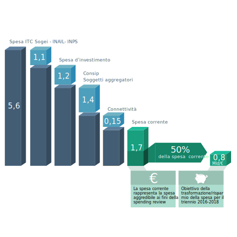

Razionalizzazione della spesa
=============================

Come anticipato nel capitolo 1 “Piano Triennale per l’informatica nella
Pubblica amministrazione”, uno degli obiettivi del Piano triennale è
quello di guidare la razionalizzazione della spesa ICT della Pubblica
amministrazione e il suo riorientamento a livello nazionale nei termini
definiti, in prima istanza, dalla Legge di Stabilità 2016.

La legge stabilisce infatti alcuni principi per il contenimento della
spesa, laddove non esista conflitto con gli obiettivi strategici
dell’Agenda digitale e in particolare:

-  un obiettivo di risparmio, per il triennio 2016-2018, fissato al 50%
   della spesa annuale media, relativa al triennio 2013-2015, per la
   gestione corrente di tutto il settore informatico, al netto dei
   canoni per servizi di connettività;

-  il principio che i risparmi generati saranno utilizzati dalle
   amministrazioni prioritariamente per investimenti in materia di
   innovazione tecnologica;

-  il principio che dall’obiettivo di risparmio è esclusa la spesa
   effettuata tramite Consip e tramite le altre centrali di committenza;

-  il principio che sono escluse le spese di alcuni enti: INPS, INAIL,
   Sogei e Consip (relativamente alle prestazioni e i servizi erogati
   alle amministrazioni loro committenti); il comparto
   dell'Amministrazione della giustizia (in relazione alle spese di
   investimento necessarie al completamento dell'informatizzazione del
   processo civile e penale negli uffici giudiziari).

In termini generali, l'obiettivo di risparmio è qui da intendersi come
riduzione stabile della spesa conseguita nel triennio. Ciò significa che
al termine del triennio la spesa nazionale annuale ("velocità di
uscita") dovrà essere inferiore del 50% rispetto alla spesa annuale
media del triennio precedente.

Tuttavia l’obiettivo da raggiungere dipende in larga parte dal grado di
utilizzo delle centrali di committenza. Infatti, in linea teorica e al
solo scopo di esplicitare ulteriormente il meccanismo messo in essere
con la Legge di Stabilità, se nel triennio 2013-2015 tutta la spesa
fosse transitata dalle centrali di committenza, l’obiettivo di risparmio
richiesto al sistema nazionale sarebbe stato zero.

La legge quindi vuole favorire:

-  un percorso di riqualificazione della spesa favorendo la connettività
   laddove ancora carente e gli investimenti in innovazione, liberando
   risorse oggi impegnate per il finanziamento della spesa corrente;

-  un percorso di ottimizzazione e controllo della spesa facendo
   transitare dalle centrali di committenza tutti i possibili
   fabbisogni.

La spesa ICT della PA
---------------------

Partendo dalle analisi più recenti (cfr. Allegato 3 “Quadro sinottico
della spesa ICT nelle PAC”), compresa quella condotta da AgID sui dati
forniti dalle Pubbliche amministrazioni centrali, è stata fotografata la
situazione di seguito sintetizzata.

La spesa annuale media ICT delle PA nel triennio 2013-2015 è stata pari
a circa € 5,6 Mld. Le spese escluse dagli obiettivi di risparmio, come
indicato nella Legge di Stabilità 2016, sono così quantificabili:

-  spesa ICT effettuata da Sogei, INAIL e INPS, pari a circa € 1,1 Mld;

-  spesa di investimento delle Pubbliche amministrazioni, pari a circa €
   1,2 Mld;

-  spesa corrente effettuata tramite Consip ed altri soggetti
   aggregatori, pari a circa € 1,4 Mld;

-  spese per la connettività, pari a circa € 0,15 Mld.

Ne deriva come risultato che la spesa corrente “aggredibile” ai fini
della spending review è pari a circa € 1,7 Mld.

Sulla base di questi elementi, il punto di partenza per la
definizione dell’obiettivo di risparmio da conseguire alla fine del
triennio 2016-2018 è quindi quello rappresentato Figura 9, ed è
quantificabile in circa € 0,8 Mld, corrispondente al 50% della spesa
corrente. Tale obiettivo deve intendersi come obiettivo complessivo e
non riferito a ciascuna amministrazione (o relative società strumentali
in house). I risparmi individuati saranno ottenuti principalmente
attraverso la riqualificazione della spesa quale frutto del complesso di
azioni previste dalla legge.

   Figura 9 - Elaborazione AgID sulla base di rilevazioni interne e dati 3° Osservatorio Assinform sull’ICT nella Pubblica amministrazione

Gli obiettivi di risparmio derivanti dall’attuazione del Piano Triennale
------------------------------------------------------------------------

Già nel 2016 le amministrazioni hanno ricevuto indicazioni coerenti con
le disposizioni di nuova focalizzazione della spesa previste dalla
legge. In particolare, le azioni messe in campo successivamente alla
pubblicazione della Legge di Stabilità 2016 riguardano:

-  il coinvolgimento delle PA nella condivisione dell’impostazione e dei
   principali contenuti del Modello strategico per una prima
   ricognizione sul campo delle attività mappabili, in particolare per
   ciò che riguarda i piani di adesione alle piattaforme nazionali,
   importante fonte di risparmio perché standardizzano soluzioni e
   tecnologie ed evitano che ciascuna amministrazione sviluppi in
   proprio soluzioni analoghe;

-  emanazione della Circolare AgID 2/2016 che ha anticipato in via
   transitoria le disposizioni correlate all’attuazione del Piano
   triennale, soprattutto per quanto riguarda le spese per la
   costituzione di nuovi *data center* e per l’adeguamento di
   applicazioni relative alle infrastrutture immateriali;

-  avvio della elaborazione e pubblicazione delle regole tecniche per
   quanto previsto nel CAD.

Dall’analisi dell’andamento della spesa ICT per il 2016 rispetto al
triennio 2013-2015, condotta da AgID su 21 amministrazioni centrali,
emergono alcuni elementi dai quali si evince che il percorso di
focalizzazione della spesa sugli obiettivi della Legge di Stabilità 2016
si sta avviando, ed in particolare:

-  a fronte di un incremento del 7% della spesa complessiva, si registra
   una riduzione del 2% della parte di spesa corrente e un incremento
   del 16% della spesa per investimenti;

-  si rileva un incremento del ricorso agli strumenti di acquisto
   Consip, la cui incidenza percentuale nel 2016 passa dal 54% al 65%
   del totale (+ 230 Mln).

In questo quadro, occorre ora rafforzare il percorso nella direzione
indicata dai principi sopra declinati, focalizzando l’azione sulle
seguenti direttrici:

A. per quanto riguarda la spesa corrente:

-  blocco **delle nuove spese sui data center**, a meno di casi
   adeguatamente giustificati verso il *cloud* e/o verso la costruzione
   di Poli nazionali, secondo quanto descritto nel paragrafo 3.1;

-  piena **adesione alle Piattaforme abilitanti** descritte nel
   paragrafo 4.2 e *switch off* delle soluzioni locali:

-  ANPR: progressivo dispiegamento della soluzione nazionale secondo
   quanto descritto nel paragrafo 4.2;

-  SPID: dismissione dei sistemi di autenticazione locali e utilizzo di
   SPID secondo il piano presentato dalle singole amministrazioni, che
   prevede l’adesione di tutte le amministrazioni entro i tempi indicati
   nel paragrafo 4.2;

-  PagoPA: adesione e pieno utilizzo di PagoPA, con l’abbandono delle
   soluzioni locali, entro i tempi indicati nel paragrafo 4.2;

-  NoiPA: dismissione dei sistemi di gestione del personale e adesione
   ai servizi NoiPA, senza oneri per le amministrazioni dello Stato e
   costo unitario manutenzione per le altre.

B. per quanto riguarda le modalità di acquisto tramite Consip e altri
soggetti aggregatori:

-  **licenze software,** sulla base dei dati finora raccolti da AgID,
   emerge l’evidenza di possibili risparmi in questo ambito, attraverso,
   in prima istanza, interventi di IT *asset management*\  [89]_ per
   l’ottimizzazione dei processi di acquisto e di gestione, quali ad
   esempio:

-  acquisto di software in modalità Software as a Service;

-  razionalizzazione e standardizzazione delle applicazioni;

-  uso di software open source.

-  utilizzo estensivo degli strumenti esistenti di Consip e degli altri
   soggetti aggregatori, secondo quanto riportato nell’Allegato 2
   “Strumenti e risorse per l’attuazione del Piano”.

A conferma e verifica di questa impostazione, è stato possibile stimare,
in via cautelativa, un risparmio a fine 2018 generato dall’adesione alle
Piattaforme abilitanti descritte nel paragrafo 4.2 e dall’ottimizzazione
delle licenze, pari a circa 480 milioni, come evidenziato in Tabella 2 -
Obiettivi di risparmio conseguibile a fine 2018

+-------------------------+----------------------------+---------------------+
| Linee di azione         | Base di costo [90]_ 2016   | Risparmio           |
|                         |                            |                     |
|                         | (Valori in €/Mln)          | (Valori in €/Mln)   |
+-------------------------+----------------------------+---------------------+
| Piattaforme nazionali   | 600                        | 400                 |
+-------------------------+----------------------------+---------------------+
| Licenze                 | 380                        | 80                  |
+-------------------------+----------------------------+---------------------+
| TOTALE                  | 980                        | 480                 |
+-------------------------+----------------------------+---------------------+

Tabella - Obiettivi di risparmio conseguibile a fine 2018

È pertanto possibile ipotizzare che l’effetto combinato di azioni di
contenimento e di trasformazione della spesa ICT di parte corrente possa
generare a fine 2018 (a parità di perimetro d’intervento considerato per
la prima definizione dell’obiettivo di risparmio) la seguente
situazione:

-  una contrazione della spesa complessiva per circa 480 milioni;

-  un incremento della parte di spesa per investimenti in linea con il
   trend rilevato nel 2016 per circa 200 mln (+ 15%);

-  un incremento della spesa effettuata tramite Consip e gli altri
   soggetti aggregatori di circa 1.000 mln, ipotizzato tenendo conto che
   le convenzioni e i contratti recentemente stipulati da Consip per i
   prossimi 5 anni prevedono massimali di spesa per oltre 6.000 mln.

.. figure:: media/figura10.svg
   :width: 100%

   Figura 10 - Proiezione AgID su rilevazioni interne e dati 3° Osservatorio Assinform sull’ICT nella Pubblica amministrazione

L’impostazione e le risultanze sopra ipotizzate saranno verificate nelle
prossime attività di ricognizione dei dati sulla spesa, che seguiranno
il monitoraggio dello stato di avanzamento del Piano (cfr. capitolo 10
“Gestione del cambiamento”). In questo modo, nel caso in cui si
dovessero evidenziare andamenti non convergenti, sarà possibile
individuare eventuali misure correttive per salvaguardare l’obiettivo di
trasformazione/risparmio previsto.

.. rubric:: Note

.. [89]
   Fonte Gartner 
   `http://www.gartner.com/binaries/content/assets/events/keywords/symposium/esc28/esc28\_costoptimization.pdf <http://www.gartner.com/binaries/content/assets/events/keywords/symposium/esc28/esc28_costoptimization.pdf>`__

   In questo documento sono evidenziate 10 considerazioni/suggerimenti
   da utilizzare per ottimizzare i costi. In particolare i bullet
   rappresentano interventi gestionali di razionalizzazione degli
   acquisti per realizzare potenzialmente dei saving.

.. [90]
   Si precisa che per l’individuazione della base di costo sulla quale
   calcolare i risparmi, è stata effettuata una proiezione dei dati
   puntuali del campione di PAC coinvolte nella rilevazione sul totale
   della spesa totale della Pubblica amministrazione elaborato
   dall’Osservatorio Assinform.
