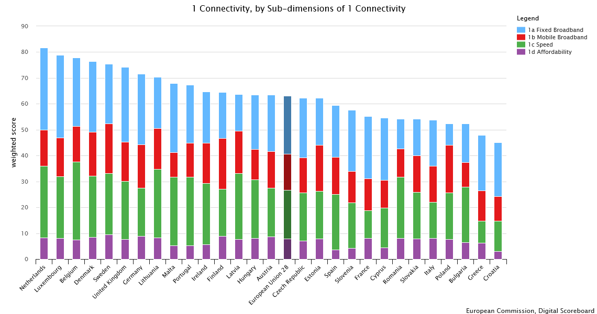
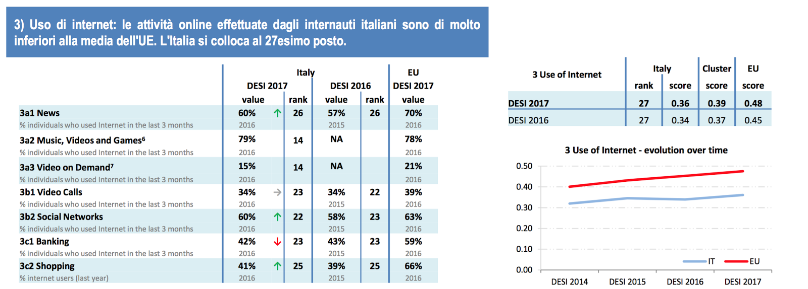
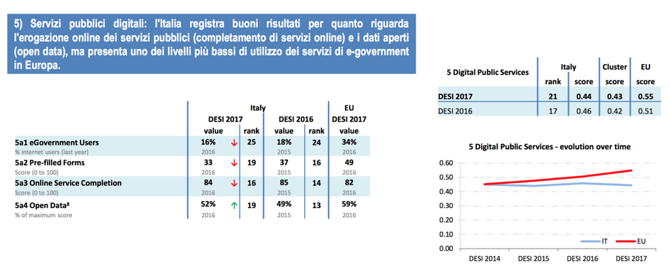

Allegato 1: Il contesto di riferimento del Piano triennale
==========================================================

1. Il contesto normativo
------------------------

L’Agenda digitale europea, sottoscritta da tutti gli Stati membri e
approvata dalla Commissione europea nel 2010, definisce gli obiettivi
per sviluppare l'economia e la cultura digitale in Europa nell'ambito
della strategia Europa 2020.

L’Agenda digitale italiana è stata istituita il 1° marzo 2012: con il
contributo della Conferenza unificata, l’Italia ha elaborato una propria
strategia nazionale, che enfatizza la complementarietà tra il livello
nazionale, regionale e locale e che individua priorità e azioni da
compiere e da misurare sulla base di specifici indicatori, in linea con
gli indicatori della stessa Agenda digitale europea. Nel rispetto
dell’Accordo di partenariato 2014-2020, siglato dall’Italia con la
Commissione europea, il Consiglio dei ministri ha inoltre approvato i
piani nazionali «Piano nazionale banda ultra larga» [1]_ e «Strategia
per la crescita digitale» [2]_.

L'Agenzia per l'Italia Digitale - istituita con decreto legge n.
83/2012, convertito nella legge n. 134/2012 e sottoposta ai poteri di
indirizzo e vigilanza del Presidente del Consiglio dei Ministri o del
Ministro da lui delegato - ha il compito di garantire la realizzazione
degli obiettivi dell’Agenda digitale italiana in coerenza con l’Agenda
digitale europea, come indicato nello statuto approvato con DPCM dell’8
gennaio 2014.

La legge n.208 del 28 dicembre 2015 (Legge di stabilità 2016),
all’art.1, comma 513 prevede che l'Agenzia per l'Italia Digitale
predisponga il Piano triennale per l'informatica nella Pubblica
amministrazione, approvato dal Presidente del Consiglio dei ministri o
dal Ministro delegato, contenente l'elenco dei beni e servizi
informatici e di connettività e dei relativi costi per ciascuna
Amministrazione.

La stessa legge fissa un obiettivo di risparmio di spesa annuale, da
raggiungere alla fine del triennio 2016-2018, pari al 50% della spesa
annuale media per la gestione corrente del solo settore informatico del
triennio 2013-2015, al netto dei canoni per servizi di connettività. Vi
si fissa inoltre il principio che i risparmi generati siano utilizzati
dalle amministrazioni prioritariamente per investimenti in materia di
innovazione tecnologica e che dall’obiettivo di risparmio sia esclusa la
spesa effettuata tramite Consip e tramite le altre centrali di
committenza. Infatti, l’obiettivo da raggiungere dipende dal grado di
utilizzo delle centrali di committenza: in linea teorica e al solo scopo
di esplicitare ulteriormente il meccanismo messo in essere con la legge
di stabilità, se nel triennio 2013-2015 tutta la spesa fosse transitata
dalle centrali di committenza, l’obiettivo di risparmio richiesto al
sistema nazionale sarebbe stato zero.

Successivamente, AgID ha provveduto a mettere in atto le necessarie
azioni preparatorie al Piano attraverso l’emanazione della Circolare n.2
del 2016 [3]_, in cui si definiscono le modalità di acquisizione di beni
e servizi ICT nelle more della definizione del presente Piano e si
individuano i progetti nazionali da assumere come modello di
riferimento.

Il Codice dell'amministrazione digitale (Decreto legislativo n. 82 del 7
marzo 2005 e s.m., di seguito CAD), corpo organico di disposizioni che
presiede all'uso dell'informatica da parte della Pubblica
amministrazione, assegna all'AgID l'attività di proporre le regole
tecniche - in conformità ai requisiti tecnici di accessibilità di cui
all'articolo 11 della legge 9 gennaio 2004 - per l'attuazione di quanto
previsto nel CAD stesso. Relativamente alle citate regole tecniche, il
Decreto Legislativo n. 179 del 26 agosto 2016 prevede che le stesse
siano aggiornate e coordinate.

Infine, è opportuno ricordare che sono entrati recentemente in vigore i
decreti che disciplinano l’attuazione del CAD per quanto concerne
l’intero ciclo di vita del **Documento informatico** nella Pubblica
amministrazione. Sono pertanto maturi i tempi per la realizzazione di
soluzioni applicative che realizzino una effettiva digitalizzazione dei
processi amministrativi delle Pubbliche amministrazioni.

2. Il quadro europeo
--------------------

Il Piano triennale è lo strumento essenziale per promuovere la
trasformazione digitale dell’amministrazione italiana in coerenza con le
strategie europee e costituisce immediata derivazione dalla
programmazione comunitaria e dall’Agenda digitale europea che gli Stati
membri sono vincolati a realizzare.

Di seguito si riepilogano i principali documenti di indirizzo dell’UE:

-  Comunicazione “\ *Europe 2020*\ ”, COM (2010) 2020, 3.3.2010

Europa 2020 è la strategia decennale dell'Unione europea per la crescita
e l’occupazione. Varata nel 2010 per creare le condizioni favorevoli a
una crescita intelligente, sostenibile e inclusiva, la strategia viene
attuata e controllata nell'ambito del semestre europeo e del ciclo
annuale di coordinamento delle politiche economiche e di bilancio dei
paesi dell'UE.

-  Comunicazione “\ *A Digital Agenda for Europe*\ ”, COM (2010) 0245,
   19.5.2010

L’Agenda digitale, presentata nel 2010 dalla Commissione europea, è una
delle sette iniziative faro della strategia Europa 2020. L’Agenda si
propone di sfruttare al meglio il potenziale delle tecnologie ICT per
favorire l’innovazione, la crescita economica e il progresso.

-  Comunicazione “\ *A Digital Single Market Strategy for Europe*\ ”,
   COM (2015) 192, 6.5.2015

Attraverso tale Comunicazione, la Commissione europea si propone di
rimuovere tutte le barriere che impediscono la realizzazione di un
mercato unico di beni e servizi digitali [4]_.

-  Comunicazione “\ *EU eGovernment Action Plan 2016-2020*\ ”, COM
   (2016) 179, 19.4.2016

Il nuovo Piano di azione per l’eGovernment 2016-2020 ha rilevanza sotto
il profilo politico-strategico, in quanto enuncia alcuni principi base
che tutte le amministrazioni di tutti gli Stati membri devono porre a
fondamento delle proprie politiche interne:

-  digitale per definizione (*digital by default*): le Pubbliche
       amministrazioni devono fornire servizi digitali come opzione
       predefinita;

-  principio "una tantum" (*once only principle*): le Pubbliche
       amministrazioni devono evitare di chiedere ai cittadini e alle
       imprese informazioni già fornite;

-  inclusività e accessibilità: le Pubbliche amministrazioni devono
       progettare servizi pubblici digitali che siano per definizione
       inclusivi e che vengano incontro alle diverse esigenze delle
       persone, ad esempio degli anziani e delle persone con disabilità;

-  apertura e trasparenza dei dati e dei processi amministrativi;

-  transfrontaliero per definizione: le pubbliche amministrazioni devono
       rendere disponibili i servizi pubblici digitali rilevanti a
       livello transfrontaliero;

-  interoperabile per definizione: i servizi pubblici devono essere
       progettati in modo da funzionare in modalità integrata e senza
       interruzioni in tutto il mercato unico;

-  fiducia e sicurezza: sin dalla fase di progettazione devono essere
       integrati i profili relativi alla protezione dei dati personali,
       tutela della vita privata e sicurezza informatica.

-  Comunicazione “A New Skills Agenda for Europe”, COM (2016) 381,
   10.6.2016

La Nuova agenda europea per le competenze ha il principale obiettivo di
migliorare la qualità e la pertinenza della formazione di competenze, al
fine di stare al passo con la rapida evoluzione dei fabbisogni del
mercato del lavoro, dotare tutti di un insieme minimo di competenze di
base e rendere le qualifiche più comprensibili, favorire un più facile
spostamento dei lavoratori a all'interno dell'UE.

-  Regolamento 2016/679/UE “\ *General Data Protection*\ ” (*on the
   protection of natural persons with regard to the processing of
   personal data and on the free movement of such data*), 27.4.2016

Il Regolamento europeo sulla Protezione dei dati personali stabilisce
norme relative alla protezione delle persone fisiche con riguardo al
trattamento dei dati personali e alla circolazione di tali dati nel
rispetto dei diritti e delle libertà fondamentali.

-  Comunicazione “\ *Towards a thriving data-driven economy*\ ”, COM
   (2014) 442, 2.7.2014

Nella Comunicazione “Verso una florida economia basata sui dati” la
Commissione europea si prefigge l’obiettivo di creare un adeguato quadro
generale per il mercato unico dei big data (le grandi quantità di dati
prodotti a grande velocità da numerosi tipi di fonti) e del *cloud
computing*. La Commissione spinge verso la realizzazione di una
“economia dell’innovazione guidata dai dati", facendo riferimento alla
capacità delle imprese e degli organismi pubblici di utilizzare le
informazioni derivanti da una migliore analisi dei dati raccolti, al
fine di sviluppare beni e servizi migliori per individui e
organizzazioni, incluse le PMI.

-  Comunicazione “\ *Open Data*\ ”, COM (2011) 882, 12.12.2011

Nella Comunicazione sui dati aperti, ossia quei dati resi liberamente
accessibili a tutti per il riutilizzo a fini commerciali e non, la
Commissione europea presenta un pacchetto di tre tipologie d’intervento,
finalizzate a superare gli ostacoli e la frammentazione che ancora
esistono nell’Unione europea attraverso:

-  l’adeguamento del quadro normativo per il riutilizzo dei dati;

-  la mobilitazione degli strumenti finanziari a sostegno dei “dati
       aperti” e l’attuazione di azioni volte alla creazione di portali
       di dati europei;

-  il coordinamento e la condivisione di esperienze tra gli Stati
       membri.

-  Direttiva 2013/37/UE del Parlamento europeo e del Consiglio del 26
   giugno 2013 recante modifiche alla Direttiva 2003/98/EC sul riuso
   delle informazioni nel settore pubblico.

La direttiva 2013/37/UE interviene in materia di riutilizzo
dell’informazione nel settore pubblico, attraverso la modifica della
direttiva 2003/98/CE, la c.d. direttiva PSI (Public Sector Information),
ed è finalizzata a favorire il riutilizzo dei dati delle pubbliche
amministrazioni dell'Unione europea.

Vi si rende obbligatorio per gli enti pubblici di rendere riutilizzabili
tutte le informazioni in loro possesso, per scopi commerciali e non
commerciali, a condizione che le informazioni non siano escluse dal
diritto di accesso ai sensi del diritto nazionale e in conformità alla
normativa sulla protezione dei dati.

Il riutilizzo delle informazioni del settore pubblico costituisce da
tempo una delle priorità delle politiche dell’Unione europea che si
propone di dare un forte impulso alla già significativa crescita del
settore che si occupa della trasformazione dei dati grezzi che sono alla
base dello sviluppo di molte applicazioni quali mappe, informazioni in
tempo reale sul traffico e le condizioni meteo, strumenti di
comparazione dei prezzi, ecc. [5]_.

3. Lo scenario macroeconomico europeo 
-------------------------------------

Obiettivo principale dall’Agenda digitale europea è quello di dare
origine a una crescita intelligente, sostenibile e inclusiva in Europa.
Il primo dei sette pilastri costitutivi dell’Agenda digitale è la
Strategia per il mercato unico digitale in Europa (*A Digital Single
Market Strategy for Europe*) [6]_, di durata pluriennale e che punta a
diffondere le opportunità insite nelle tecnologie digitali a cittadini e
imprese, al fine di rafforzare la posizione dell’Europa come leader
mondiale nell’economia digitale. La CE ritiene che la DSM possa creare
opportunità per nuove imprese e permettere a quelle esistenti di operare
in un unico mercato di oltre 500 milioni di persone, arrivando a
contribuire per oltre 400 miliardi di Euro annui all’economia europea,
creando nuovi posti di lavoro e trasformando i servizi pubblici.

Secondo la Comunicazione *A Digital Single Market Strategy*, in meno di
un decennio la maggior parte dell'attività economica dipenderà da
ecosistemi digitali che integreranno infrastrutture digitali, hardware e
software, applicazioni e dati. Perché l'UE possa restare competitiva,
mantenere una base industriale solida e gestire la transizione verso
un'economia industriale e di servizio intelligente, sarà necessaria la
digitalizzazione di tutti i settori. Il valore aggiunto dall'economia
digitale proviene per il 75% dalle industrie tradizionali; tuttavia,
l'integrazione della tecnologia digitale nelle imprese è l'anello più
debole: solo l'1,7% delle imprese dell'UE usa le tecnologie digitali
avanzate in tutte le loro possibilità [7]_, mentre il 41% non le usa
affatto. La digitalizzazione offre possibilità senza precedenti anche a
altri comparti dell'economia, come i trasporti (ad es., sistemi di
trasporto intelligenti) o l'energia (ad es., reti intelligenti,
contatori intelligenti) [8]_.

In questo quadro, la presenza *on line* della Pubblica amministrazione è
un elemento essenziale per migliorare l'efficienza in termini di costi e
la qualità dei servizi offerti ai cittadini e alle imprese. A tal fine,
la Commissione europea ha definito un piano d'azione per l'e-Government
2016-2020 [9]_.

Per descrivere in maniera sintetica la posizione dell’Italia nello
scenario europeo con il quale il Piano si deve confrontare, è stato
preso in esame il DESI (*Digital Economy and Society Index*) [10]_, uno
strumento elaborato dalla Commissione europea per valutare annualmente
lo stato di avanzamento dell’economia e della società digitale negli
Stati membri.

L’indice DESI valuta cinque dimensioni (connettività, capitale umano,
uso di internet, integrazione della tecnologia digitale, servizi
pubblici digitali), costituite da un insieme di indicatori che,
analizzati singolarmente, permettono di comprendere l’evoluzione nel
tempo della competitività digitale di ciascuno Stato membro, anche
attraverso il raffronto con gli altri Stati.

.. figure:: media/allegato_1/figura1.png
   :width: 100%

   Figura 1 - Rappresentazione del DESI 2017

Come si vede dalla Figura 1, l’Italia si trova complessivamente in una
situazione di svantaggio in tutte le dimensioni, a dimostrazione del
fatto che sono diversi i problemi strutturali che incidono sensibilmente
sul risultato complessivo.

Se si analizzano i dati per ciascuna dimensione [11]_, si rileva che,
per quanto riguarda la **connettività** (Figura 2), la forbice con il
resto d’Europa si va restringendo (tra il 2016 e il 2017, l’Italia passa
da 15,7 a 9,3 punti di differenza rispetto alla media). Questo dato
conferma che gli investimenti di lungo periodo funzionano: l'Italia ha
compiuto infatti progressi significativi grazie soprattutto al forte
aumento della copertura delle reti NGA (*Next Generation Access*).
Tuttavia, la diffusione della banda larga fissa rimane ancora limitata,
nonostante la diminuzione dei prezzi.

   Figura 2 - Indice DESI, indicatore Connettività per sub dimensioni. DESI 2017

Per quanto riguarda l’\ **uso di Internet**, l’Italia si trova molto
indietro rispetto agli altri Stati membri, come rappresentato in Figura
3, in particolare per quanto riguarda le transazioni commerciali.

.. figure:: media/allegato_1/figura3.png
   :width: 100%

   Figura 3 - Indice DESI, Uso di Internet per sub dimensioni. DESI 2017

Questo ritardo nell’uso di Internet è connesso a molti fattori, tra cui
emerge prepotentemente la scarsa qualità dell’offerta di servizi e
contenuti digitali. Ne è prova il fatto che, in quei settori in cui
l’offerta è stata ampliata è cresciuta anche l’utenza di Internet. Se
infatti prendiamo l’indicatore relativo alla fruizione on line di
musica, video e giochi, come rappresentato in Figura 4, si osserva una
costante crescita nel periodo 2005-2016 e, nel 2017, l’Italia supera,
seppur di poco, la media europea.

   Figura 4 - Uso di Internet, per attività effettuate on line. Anno 2017

Lo svantaggio strutturale dell’Italia è dato anche dalla dimensione
delle nostre imprese, come confermato dal dato relativo all’indicatore
**integrazione delle tecnologie digitali**. Se si analizza l’andamento
dell’indicatore relativo all’e-commerce (Figura 5), l’Italia, dopo una
tendenza positiva, sembra non riuscire a colmare il gap con la media
europea. La scarsità di offerta genera una scarsità di domanda, da qui
il basso livello di uso di internet.

.. figure:: media/allegato_1/figura5.png
   :width: 100%

   Figura 5 - Integrazione delle tecnologie digitali: utilizzo dell’eCommerce
   da parte delle imprese in Italia e nei principali paesi europei. DESI 2017

Analizzando la dimensione negli indicatori di dettaglio (Figura 6),
emerge, in particolare, che la percentuale di piccole e medie imprese
che vendono *on line* rimane molto bassa.

.. figure:: media/allegato_1/figura6.png
   :width: 100%

   Figura 6 - Integrazione delle tecnologie digitali: digitalizzazione delle
   imprese in Italia e nella UE. DESI 2017

Il dato sulla fatturazione elettronica conferma invece che una continua
e coerente politica per la promozione di servizi digitali assicura buoni
risultati.

Altro grosso svantaggio strutturale, che si può correggere solo nel
lungo periodo, è dato dall’indicatore relativo al **capitale umano**.
Nella fascia di età compresa tra i 20 e i 29 anni, solo 15 persone su
1.000 hanno una laurea in discipline tecnico-scientifiche (Figura 7);
siamo molto al di sotto della media EU28 (18,5 persone su 1000), ma
anche molto indietro rispetto a Stati membri con noi comparabili (24
persone su mille).

.. figure:: media/allegato_1/figura7.png
   :width: 100%

   Figura 7 - Laureati in discipline STEM (Science, technology, engineering
   and mathematics) in Italia e nei principali paesi europei. Anno 2017

Per quanto riguarda la dimensione riferita ai **servizi pubblici
digitali**, l'Italia presenta uno dei livelli più bassi di utilizzo dei
servizi in Europa (Figura 8). Anche in questo caso, il dato può
dipendere dal fatto che l’Italia risulta avere una delle percentuali più
basse di utilizzo di Internet in generale. Tuttavia vale anche la pena
sottolineare che l’indice DESI non sempre riesce a cogliere la
situazione reale, poiché gli indicatori impiegati sono di carattere
generale e al loro interno è difficile riconoscere servizi specifici -
anche complessi ed articolati - offerti dalle Pubbliche amministrazioni:
ad esempio, in Italia, il servizio offerto dal Ministero dell’Economia e
delle Finanze, relativo alla compilazione *on line* del 730 sulla base
di un modulo precompilato contenente con tutti i dati di sanità e
catasto non è riconoscibile ai fini del calcolo del DESI.

   Figura 8 - Servizi pubblici digitali: DESI eGovernment in Italia e
   nell’UE. DESI 2017

Nonostante quanto riportato dal DESI, per valutare i progressi fatti e
stimare gli sviluppi futuri è necessario comprendere il punto di
partenza e analizzare il trend di evoluzione. Il nostro Paese è almeno
tre anni indietro nella curva di crescita rispetto alla maggior parte
degli Stati membri UE. Perché i dati di crescita abbiano impatto sugli
indici definiti in Europa è necessario attuare - con continuità nel
tempo - interventi strutturali di lungo periodo. I Paesi che risultano
più avanzati e che hanno indici DESI più alti, infatti, sono quelli che
hanno cominciato ad investire nella digitalizzazione tra la fine degli
anni 90 e gli inizi del 2000. Lo hanno fatto, appunto, con continuità e
sforzo costante, godendo inoltre di un ingrediente fondamentale: una
stabilità politica da cui consegue la volontà politica di attuare le
riforme strutturali di lungo periodo.

4. La cittadinanza digitale 
---------------------------

La cittadinanza digitale può essere definita come il complesso dei
diritti e dei doveri dei cittadini formulati in adattamento allo
sviluppo dell’e-government e della fruizione dei servizi digitali [12]_.
Rispetto alla cittadinanza tradizionale, la cittadinanza digitale dà
luogo a uno spazio giuridico in cui i diritti e doveri di cittadinanza
possono essere esercitati sia nel contesto fisico reale sia in quello
virtuale del web. In questo senso, l’equità di trattamento dei cittadini
comporta una capacità di accesso alla rete uniformemente distribuita,
dove il completo esercizio dei loro diritti si può realizzare con la
minimizzazione del *digital divide*. Tra i principali argomenti normati
in diritto vi sono: l’identità digitale (intesa come la disponibilità di
un’identità digitale unica assegnata ai cittadini dalle
amministrazioni); la protezione dei dati personali; l’accesso e
l’inclusione digitale; la formazione per l’acquisizione delle competenze
digitali; l’informazione e l’utilizzo dei contenuti digitali pubblici;
la partecipazione dei cittadini al processo decisionale politico; la
fruizione quotidiana dei benefici delle tecnologie digitali. Tra i
doveri si individuano invece il rispetto delle regole del web e la messa
in condivisione dei propri contenuti digitali.

La legge delega 7 agosto 2015, n. 124 contiene nell’art. 1 la Carta
della cittadinanza digitale, un forte segnale a supporto dell’intenzione
del legislatore di rafforzare e rendere effettivi i diritti digitali dei
cittadini nei confronti delle amministrazioni pubbliche. Nello
specifico, viene esplicitato l’obiettivo di garantire a cittadini e
imprese il diritto di accedere a tutti i dati, i documenti e i servizi
di loro interesse in modalità digitale, con la finalità di garantire la
semplificazione nell’accesso ai servizi alla persona, riducendo la
necessità dell’accesso fisico agli uffici pubblici. Il decreto
legislativo 26 agosto 2016, n. 179 introduce quindi le modifiche al CAD
finalizzate a dare seguito ai principi e ai criteri individuati nella
citata L. 124/2015. Fra questi emergono (i) l’individuazione di
strumenti per definire il livello minimo di sicurezza, qualità,
fruibilità, accessibilità e tempestività dei servizi online delle
amministrazioni pubbliche, (ii) il principio del digital first, (iii)
l’alfabetizzazione digitale, (iv) la partecipazione con modalità
telematiche ai processi decisionali delle istituzioni pubbliche, (v) la
piena disponibilità dei sistemi di pagamento elettronico e (vi) la
riduzione del digital divide attraverso l’impulso allo sviluppo delle
competenze digitali di base. L’impegno dello Stato nel promuovere una
vera e propria cultura digitale, implica la volontà del legislatore di
diffondere tra i cittadini, con particolare riguardo alle categorie a
rischio di esclusione, non solo conoscenze e competenze informatiche, ma
anche consapevolezza e conoscenza in merito al valore, alle opportunità,
alle regole e ai rischi collegati all’utilizzo delle tecnologie.

In questo modo, si riconosce che le opportunità offerte dalla rete e
dalle tecnologie digitali devono essere a disposizione di tutti e che
l’inclusione, l’informazione e l’alfabetizzazione digitale dei cittadini
sono obiettivi a cui si ispirano le politiche in tema di infrastrutture
e di semplificazione amministrativa, di cui il presente Piano triennale
è architrave, che integra, completa e dà seguito ai documenti Strategia
per la crescita digitale 2014-2020 e Piano nazionale per la banda
ultralarga.

Il futuro del nostro Paese – per i cittadini così come per le imprese –
è sostenibile solo se lo Stato sarà in grado di garantire ai propri
cittadini e alle proprie imprese un accesso concreto, innovativo e non
discriminatorio alle tecnologie digitali, offrendo loro strumenti
culturali, infrastrutturali ed economici per sentirsi parte integrante
della nuova comunità globale, esercitare i nuovi diritti di cittadinanza
digitale e competere alla pari nei mercati internazionali.

L’accesso alla conoscenza, alle relazioni sociali, alle opportunità
economiche e ai servizi pubblici offerti via Internet deve essere
favorito, a partire dall’abbattimento delle barriere fisiche
all’accesso, nell’ambito di una strategia unitaria che prevede
investimenti e utilizzo di tutte le tecnologie necessarie: dalla fibra
alla rete mobile ad alta velocità, dal Wi-Fi nei luoghi pubblici allo
sviluppo del *cloud*, focalizzando l’attenzione sugli aspetti di
security e di tutela dei dati dei cittadini.

In questo quadro, la PA può fungere da modello e rappresentare un
importante volano per la digitalizzazione del Paese, a condizione che
sappia trasformarsi profondamente, abbracciando un approccio
*digital-by-default*. Tutto questo anche grazie alle tecnologie *cloud,*
che consentono di ottimizzare l’efficienza economica degli investimenti
tecnologici e la loro sostenibilità ambientale e alla integrazione
applicativa resa possibile da sistemi interoperabili, che espongono
servizi secondo standard definiti ed accessibili.

Con il superamento dell’eterogeneità dell’offerta attuale e
l’integrazione dei servizi settoriali attraverso le Piattaforme
abilitanti, come il Servizio pubblico d’identità digitale e l’Anagrafe
nazionale della popolazione residente, ogni cittadino italiano avrà un
profilo civico online dal quale potrà accedere alle informazioni e ai
servizi pubblici che lo riguardano. Un luogo di interazione
personalizzato con la Pubblica amministrazione e le sue ramificazioni,
arricchito dalle segnalazioni sulle opportunità e gli obblighi pubblici
che il sistema filtrerà in relazione allo specifico profilo anagrafico.

Ma i diritti di cittadinanza digitale devono essere inclusivi e devono
poter essere esercitati da tutti in particolar modo dalle fasce della
popolazione più disagiate. In base agli ultimi dati disponibili della
*Digital Agenda Scoreboard*\  [13]_, l’uso di Internet negli ultimi 12
mesi riguarda il 71,0% della popolazione, contro una media EU dell’83,5%
e la percentuale di Italiani che non ha mai utilizzato Internet è del
24,7%, a fronte del corrispettivo medio UE del 14,4%.

Il problema del *digital divide* è nel nostro Paese ampio e articolato
al punto che si può parlare di divari caratterizzati da componenti
diverse. Esiste un divario economico che priva importanti fasce della
popolazione e del tessuto micro-imprenditoriale italiano delle
opportunità offerte dalle nuove tecnologie per questioni di reddito.
Esiste un divario culturale, che rende persistenti i comportamenti
“analogici” di lunga tradizione ma oggi inefficienti, precludendo a
cittadini e imprese di esercitare i propri diritti di cittadinanza e di
mercato; usiamo poco Internet e il digitale perché non li conosciamo o
perché non ne abbiamo colto le straordinarie potenzialità o perché non
si è ancora instaurato un clima di fiducia sulla qualità e certezza
delle informazioni e dei servizi pubblicati in rete. C’è infine un
divario infrastrutturale, che esclude dall’accesso alla rete parti della
popolazione e migliaia di imprese. Per quanto riguarda la disponibilità
di connessioni Internet ad alta velocità, solo il 43,9% delle famiglie
italiane risulta coperta da tale offerta, rispetto a una media europea
del 70,9%.

Il problema del *digital divide*, quindi, non è rappresentato solo e
sempre dalla mancanza di un’infrastruttura di rete quanto, più spesso,
dall’assenza di una cultura della rete e dalle mancate condizioni
economiche necessarie a beneficiarne; ne consegue che anche nelle aree
pienamente infrastrutturate, l’effettiva diffusione della connettività
rimane bassa. Solo il 77,1% delle famiglie italiane dispone di una
connessione a Internet in banda larga, a fronte di una media europea del
82,9% e, considerando le sole connessioni in banda larga fissa
(escludendo, quindi, quelle mobili), la percentuale delle famiglie
connesse scende al 55,2%, contro una media UE del 73,8%.

5. Le imprese 
-------------

La “buona idea” destinata a rivoluzionare la storia del mondo – come è
accaduto per le tante idee nate negli ultimi vent’anni e che oggi
rappresentano l’architettura portante di Internet e dei servizi che
utilizziamo quotidianamente – può nascere dallo sforzo creativo e
inventivo della più piccola tra le imprese italiane che deve essere
quindi poter sviluppare la propria attività in una dimensione di
costante e non discriminatoria connessione al tessuto imprenditoriale
globale.

Nonostante i ritardi evidenziati nei paragrafi precedenti, il processo
di digitalizzazione si sta diffondendo rapidamente all’interno delle
imprese italiane e il cambiamento che ne segue rappresenta al tempo
stesso una sfida e un’opportunità. La trasformazione richiesta non è
solo di natura tecnologica ma riguarda l’intera sfera organizzativa e
richiede l’inserimento di nuove competenze spesso difficili da reperire
e che impongono nuovi percorsi formativi.

Per sostenere questa trasformazione, il Ministero dello Sviluppo
economico ha elaborato un Piano nazionale Industria 4.0 2017-2020 [14]_,
con l’obiettivo di favorire l’automazione e l’interconnessione della
produzione industriale.

Tale Piano si basa su 4 direttrici strategiche:

-  stimolare l’investimento privato nell’adozione delle tecnologie
   abilitanti dell’industria 4.0;

-  assicurare adeguate infrastrutture di rete, garantire la sicurezza e
   la protezione dei dati, collaborare alla definizione di standard di
   interoperabilità internazionali;

-  creare competenze e promuovere la ricerca mediante percorsi formativi
   ad hoc;

-  diffondere la conoscenza e il potenziale dell’industria 4.0, e
   garantire una governance pubblico-privata per il raggiungimento degli
   obiettivi prefissati.

Sono soprattutto le piccole e medie imprese che presentano, anche se con
intensità diverse, un ritardo nell’avviare iniziative tecnologiche e di
trasformazione digitale. Esse appaiono concentrate su obiettivi di
riduzione dei costi e di recupero di efficienza, tematiche che si
riflettono anche sulle attività IT, in rapporto sia all’utilizzo di
dotazioni di base, che all’introduzione di soluzioni e piattaforme più
evolute.

Di fatto, il mercato digitale Italiano è - e continuerà ad essere -
sostenuto dagli investimenti delle grandi imprese, previsti in crescita
tra il 2015 ed il 2018 a un tasso medio annuo del 3,1%, al di sopra
dell’andamento complessivo del comparto.

Il Rapporto Assinform 2017 [15]_ evidenzia infatti, nel corso del 2016,
una crescita dell’1,8% del mercato digitale italiano (informatica,
telecomunicazioni e contenuti) rafforzando la tendenza iniziata nel 2015
(+1%) e ribaltando il trend discendente degli anni precedenti. Il trend
positivo di crescita dovrebbe confermarsi anche nel 2017 (circa + 1,7%)
e nel 2018 (circa +2%).

L’andamento atteso è frutto di diversi fattori: il contesto macro
economico (ad es. le previsioni di crescita del PIL), le politiche
governative (ad es. il Piano nazionale banda ultralarga e la Strategia
per la crescita digitale), le dinamiche dell’offerta ICT, lo scenario
tecnologico.

Lo sviluppo di un Piano triennale per l’informatica nella Pubblica
Amministrazione, rappresenta una concreta leva per garantire il positivo
andamento di crescita per le imprese poiché individua le strategie verso
le quali orientare gli investimenti ed assicura un quadro di riferimento
certo in termini temporali ed economici.

.. rubric:: Note

.. [1]
   `http://www.agid.gov.it/sites/default/files/documenti\_indirizzo/StrategiaBandaUltraLarga2014.pdf <http://www.agid.gov.it/sites/default/files/documenti_indirizzo/StrategiaBandaUltraLarga2014.pdf>`__

.. [2]
   `http://www.agid.gov.it/sites/default/files/documenti\_indirizzo/crescita\_digitale\_nov\_2014.pdf <http://www.agid.gov.it/sites/default/files/documenti_indirizzo/crescita_digitale_nov_2014.pdf>`__

.. [3]
   `http://www.agid.gov.it/sites/default/files/documentazione/circolare\_piano\_triennale\_24.6.2016.\_def.pdf <http://www.agid.gov.it/sites/default/files/documentazione/circolare_piano_triennale_24.6.2016._def.pdf>`__

.. [4]
   La strategia poggia su tre pilastri:

   migliorare l'accesso online ai beni e servizi in tutta Europa per i
   consumatori e le imprese — questo implica l'eliminazione in tempi
   rapidi delle differenze fondamentali che separano il mondo online dal
   mondo offline al fine di abbattere le barriere che bloccano
   l'attività online attraverso le frontiere;

   creare un contesto favorevole affinché le reti e i servizi digitali
   possano svilupparsi — questo implica la disponibilità di
   infrastrutture e di servizi contenutistici ad alta velocità protetti
   e affidabili, sostenuti da condizioni regolamentari propizie
   all'innovazione, agli investimenti, alla concorrenza leale e alla
   parità di condizioni;

   massimizzare il potenziale di crescita dell'economia digitale europea
   — questo implica investimenti nelle infrastrutture e tecnologie delle
   TIC, come le nuvole informatiche (*cloud computing*) e i megadati
   (*big data*), ricerca e innovazione per rafforzare la competitività
   industriale e miglioramento dei servizi pubblici, dell'inclusione e
   delle competenze.

.. [5]
   `www.senato.it/japp/bgt/showdoc/17/DOSSIER/777659/index.html?part=dossier\_dossier1-sezione\_sezione33-h1\_h11 <http://www.senato.it/japp/bgt/showdoc/17/DOSSIER/777659/index.html?part=dossier_dossier1-sezione_sezione33-h1_h11>`__

.. [6]
   COM(2015) 192 final,
   `https://ec.europa.eu/digital-single-market/en/the-strategy-dsm <https://ec.europa.eu/digital-single-market/en/the-strategy-dsm>`__

.. [7]
   Compresi internet mobile, nuvole informatiche, reti sociali e
   metadati.

.. [8]
   Cfr. la strategia quadro per un'Unione dell'energia resiliente,
   corredata da una politica lungimirante in materia di cambiamenti
   climatici [COM(2015) 80 final].

.. [9]
   Comunicazione “EU eGovernment Action Plan 2016-2020”, COM (2016) 179

.. [10]
   nel marzo di quest’anno è stato pubblicato l’indice DESI 2017,con
   dati aggiornati all’anno 2016, consultabile all’indirizzo:
   `https://ec.europa.eu/digital-single-market/en/desi <https://ec.europa.eu/digital-single-market/en/desi>`__

.. [11]
   Per la composizione degli indicatori e delle relative sub dimensioni:
   `http://digital-agenda-data.eu/datasets/desi/indicators <http://digital-agenda-data.eu/datasets/desi/indicators>`__

.. [12]
   `http://www.treccani.it/enciclopedia/cittadinanza-digitale\_(Lessico-del-XXI-Secolo)/ <http://www.treccani.it/enciclopedia/cittadinanza-digitale\_(Lessico-del-XXI-Secolo)/>`__

.. [13]
   `http://digital-agenda-data.eu/ <http://digital-agenda-data.eu/>`__

.. [14]
   `www.sviluppoeconomico.gov.it/index.php/it/incentivi/impresa/industria-4-0 <www.sviluppoeconomico.gov.it/index.php/it/incentivi/impresa/industria-4-0>`__

.. [15]
   Rapporto Assinform, Il Digitale in Italia 2017, Mercati, Dinamiche,
   Policy; Osservatorio delle Competenze digitali 2017.
