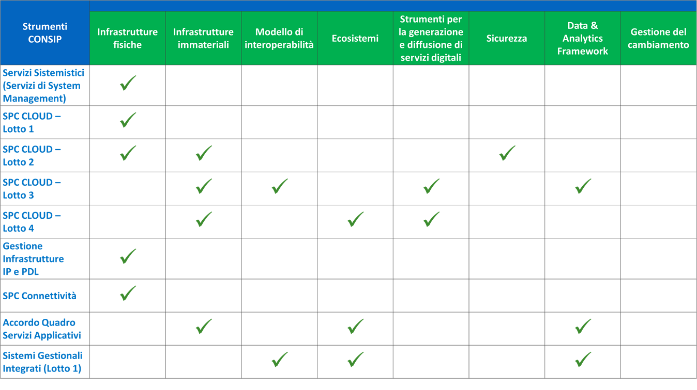

Allegato 2: Strumenti e risorse per l’attuazione del Piano
==========================================================

1. Premessa
-----------

Per favorire la realizzazione dei progetti di innovazione ed accelerare
il processo di ottimizzazione della spesa si propone alle
Amministrazioni:

-  l’attuazione di specifici progetti ad elevato contenuto innovativo e
   coerenti con il modello strategico di evoluzione del sistema
   informativo della PA;

-  la possibilità di ricorrere al supporto di AgID nell’ambito del
   Programma operativo nazionale “Governance e capacità istituzionale
   2014-2020” e specificamente del progetto “Italia Login – La casa del
   cittadino”;

-  la realizzazione degli acquisti utilizzando le iniziative Consip o
   attraverso i soggetti aggregatori per la razionalizzazione della
   spesa, secondo le indicazioni inserite nel capitolo 12.

2. Progetti ad alto contenuto di innovazione e il supporto di AgID
------------------------------------------------------------------

Le amministrazioni pubbliche sono spesso chiamate a definire progetti ad
elevato contenuto di innovazione, volti sia alla razionalizzazione dei
costi di gestione che allo sviluppo dei servizi in un’ottica di
modernizzazione degli stessi.

Relativamente ai progetti digitali, il Piano propone un modello basato
sulla individuazione di servizi (anche microservizi), che, composti tra
loro, realizzano l’obiettivo progettuale. Ciascun servizio è
necessariamente erogato da un *service provider*, che potrà essere un
soggetto istituzionale (tipicamente una amministrazione) o da un
operatore di mercato. I servizi erogati da un operatore di mercato
vengono tipicamente acquisiti attraverso un contratto d’appalto.

Fermo restando l’obbligo di conformità al Modello strategico di
evoluzione del sistema informativo della PA, si evidenziano le seguenti
raccomandazioni rivolte alle amministrazioni che intendono eseguire
appalti ad elevato grado di innovazione:

-  valutare l’opportunità di definire l’oggetto dell’appalto
   privilegiando la specificazione della domanda (cioè del “problema”
   che si intende affrontare) rispetto alla specificazione dell’offerta
   (approccio *demand pull*). Ciò allo scopo di dare adeguato spazio
   alla proposizione di offerte innovative;

-  valutare l’opportunità di svolgere una consultazione di mercato
   preliminarmente all’avvio della procedura di appalto [1]_;

-  valutare l’applicabilità di procedure di appalto “innovative”, quali
   il dialogo competitivo e il partenariato per l’innovazione, nonché di
   concorsi di progettazione e di idee, contratti di concessione e
   contratti di partenariato pubblico privato;

-  verificare la possibilità di suddividere gli appalti in lotti [2]_,
   al fine di favorire l’accesso alle microimprese, piccole e medie
   imprese\ **;**

-  verificare l'adattabilità del criterio del costo del ciclo di
   vita [3]_ quale criterio di valutazione delle offerte.

Nelle situazioni in cui le Pubbliche amministrazioni abbiano esigenze
non adeguatamente soddisfacibili ricorrendo a soluzioni già presenti sul
mercato [4]_ esse possono ricorrere ad **appalti di tipo
pre-commerciale** (noti anche come PCP, acronimo di *pre-commercial
procurement*). Gli appalti di tipo pre-commerciale sono caratterizzati
come segue:

-  hanno ad oggetto prevalente servizi di ricerca e sviluppo
   tecnologico;

-  prevedono la condivisione dei rischi e dei benefici alle condizioni
   di mercato tra acquirente pubblico e soggetti aggiudicatari per lo
   sviluppo di soluzioni innovative, non già presenti sul mercato, a
   partire dall’ideazione fino allo sviluppo iniziale di quantità
   limitate di prodotti o servizi sperimentali idonee a risolvere un
   problema irrisolto e tecnologicamente complesso, posto
   dall’acquirente pubblico;

-  prevedono la clausola di non esclusiva, in funzione della quale la
   stazione appaltante non riserva al suo uso esclusivo i risultati
   derivanti dalle attività di ricerca e sviluppo;

-  prevedono il cofinanziamento da parte degli operatori economici
   aggiudicatari.

Al ricorrere delle condizioni sopra elencate, l’appalto non ricade
nell’ambito oggettivo di applicazione del Codice degli appalti, fermi
restando, ovviamente, i principi fondamentali di cui all’art. 4 del
Codice stesso.

La promozione dell’utilizzo dell’appalto pre-commerciale è tra gli
obiettivi prioritari dell’Agenda digitale italiana, ciò anche al fine di
coinvolgere il tessuto produttivo, mantenere e incrementare la presenza
sul territorio nazionale di significative competenze di ricerca e
innovazione industriale.

Le amministrazioni pubbliche possono realizzare appalti pre-commerciali
utilizzando risorse proprie e/o quelle rese disponibili nell’ambito dei
Programmi operativi nazionali e dei Programmi operativi regionali, ove,
in molti casi\ **,** gli appalti pre-commerciali sono esplicitamente
previsti.

L’Agenzia per l’Italia Digitale (riferimento D.L. 179/2012 art. 19)
offre supporto alle amministrazioni pubbliche che stanno programmando o
intendono realizzare appalti pre-commerciali [5]_. L’AgID, previo
accordo con le amministrazioni, può aggiudicare i singoli appalti quale
centrale di committenza della regione o della diversa amministrazione
pubblica competente alla relativa gestione.

3. Contributo di AgID all’attuazione del Piano e il supporto alle PA 
---------------------------------------------------------------------

AgID contribuirà alla conduzione delle attività utili alla realizzazione
del Piano avvalendosi, prevalentemente, di fondi del PON Governance
2014-2020. Più precisamente, AgID è beneficiaria di un finanziamento
europeo nell’ambito del progetto Italia-Login - La casa del
cittadino [6]_, già approvato dalla Comunità Europea. Al momento della
stesura del Piano, sono inoltre in corso attività per la formalizzazione
di altri due progetti utili alla realizzazione delle Infrastrutture
Fisiche e Infrastrutture Immateriali.

AgID focalizzerà, di concerto con l’Agenzia della Coesione, l’utilizzo
complessivo dei fondi del PON governance su azioni di supporto e
accompagnamento alle PA e alla realizzazione delle soluzioni nazionali
da erogare centralmente.

3.1. PON Governance progetto Italia-Login – La casa del cittadino
~~~~~~~~~~~~~~~~~~~~~~~~~~~~~~~~~~~~~~~~~~~~~~~~~~~~~~~~~~~~~~~~~

Italia-Login è presentato nel documento Crescita Digitale come uno dei
programmi di accelerazione per la digitalizzazione del Paese.

Nell’ambito di Italia-Login saranno finanziate le linee di azione in
carico ad AgID riportate nei capitoli 5, 6, 7, 8 e 10, e nel paragrafo
4.2. La figura successiva riassume graficamente le aree della Mappa su
cui impattano maggiormente le attività di “Italia-login”.

.. figure:: media/allegato_2/figura1.png
   :width: 100%

   Figura 1 - Mappa del Modello strategico e progetto Italia Login

Relativamente alle azioni di supporto e accompagnamento alle PA, AgID
offrirà:

-  supporto tecnico per l’adozione del Modello di Interoperabilità;

-  infrastrutture e ambienti operativi in logica *Cloud* (IaaS e PaaS)
   per la prototipazione e messa in produzione dei servizi innovativi
   ideati all’interno degli Ecosistemi. Inoltre, per le iniziative di
   maggiore impatto, in termini di ricadute socio-economico e diffusione
   della cultura digitale, AgID metterà a disposizione un team di
   supporto allo sviluppo;

-  Servizi di sicurezza quali, ad esempio, il *vulnerability assessment*
   delle Amministrazioni, grazie al progressivo potenziamento del
   CERT-PA;

-  Supporto tecnico per l’adozione di alcune piattaforme abilitanti, tra
   cui SPID e PagoPA.

-  Supporto alle attività di *change management*.

4. Iniziative Consip
--------------------

Consip, nell’ambito del programma per la razionalizzazione degli
acquisti predisposto dal Ministero dell’economia e delle finanze, è
incaricata di analizzare il mercato della domanda e dell’offerta,
sviluppando iniziative di acquisto rispondenti ai bisogni delle
Amministrazioni e mettendo a disposizione competenze e servizi di
consulenza in tema di acquisti, anche per esigenze specifiche.
`Convenzioni/contratti quadro <https://www.acquistinretepa.it/opencms/opencms/main/programma/strumenti/Convenzioni.html>`__\  [7]_,
`Accordi quadro <https://www.acquistinretepa.it/opencms/opencms/main/programma/strumenti/Accordi_Quadro.html>`__\  [8]_,
`Mercato elettronico <https://www.acquistinretepa.it/opencms/opencms/main/programma/strumenti/MePA>`__\  [9]_,
`Sistema dinamico di acquisizione <https://www.acquistinretepa.it/opencms/opencms/main/programma/strumenti/Sistema_Dinamico_di_Acquisizione>`__\  [10]_
sono gli strumenti di procurement attualmente disponibili nell’ambito
del Programma.

La spesa effettuata tramite strumenti di acquisto Consip non rientra
nell’obiettivo di risparmio di spesa annuale previsto dalla Legge di
Stabilità 2016.

Tra le iniziative Consip, quelle che da una prima analisi possono
trovare applicazione nella realizzazione delle linee di azione del Piano
da parte delle PA, sono gli `Accordi
quadro <https://www.acquistinretepa.it/opencms/opencms/main/programma/cosa/modello.html>`__\  [11]_
e le Convenzioni/Contratti quadro secondo lo schema di sintesi qui di
seguito riportato.

   Figura 2 - Copertura degli strumenti Consip sulle componenti del Modello strategico

L'Accordo quadro, definito all’art. 3, comma 1, lettera iii) del D.Lgs.
50/2016, prevede che l’accordo concluso tra una o più stazioni
appaltanti ed uno o più operatori economici, ha lo scopo di stabilire le
clausole, per quanto riguarda prezzi e quantità, relative agli appalti
da aggiudicare durante un periodo massimo ex art. 54 dello stesso Codice
degli appalti di quattro anni nei settori ordinari ed otto anni nei
settori speciali.

Nell’ambito dell’Accordo quadro, le Amministrazioni che hanno effettuato
l'abilitazione al sistema Acquisti in rete, attraverso la contrattazione
di "Appalti specifici", provvedono poi a negoziare i singoli contratti,
personalizzati sulla base delle proprie esigenze.

Le Convenzioni/Contratti quadro, definiti all’art. 26 della Legge
488/99, sono contratti quadro stipulati da Consip, per conto del MEF,
nell’ambito dei quali i fornitori aggiudicatari di gare - esperite in
modalità tradizionale o smaterializzata a seguito della pubblicazione di
`bandi <https://www.acquistinretepa.it/opencms/opencms/main/impresa/strumenti/convenzioni.jsp?orderBy=pubblicazione&sort=desc&pagina=1&__element=paginazione>`__
- si impegnano ad accettare ordinativi di fornitura emessi dalle singole
Amministrazioni che hanno effettuato
l'\ `abilitazione <https://www.acquistinretepa.it/opencms/opencms/menu_livello_I/header/registrazione.html>`__
al sistema Acquisti in rete.

Tale modalità di acquisto, più idonea per approvvigionamenti di beni e
servizi con caratteristiche standard, grazie all’aggregazione della
domanda, permette di ottenere rilevanti economie di scala sia in termini
di processo sia di risparmi sugli acquisti.

4.1. Servizi Sistemistici - System Management
~~~~~~~~~~~~~~~~~~~~~~~~~~~~~~~~~~~~~~~~~~~~~

Accordo quadro organizzato in un unico lotto nazionale utile per
realizzare Infrastrutture fisiche, data center e *Cloud*.

La procedura si svolge con più operatori economici per l’affidamento di
servizi di gestione, manutenzione e supporto specialistico per le
infrastrutture HW e SW, ovvero il complesso dei servizi e delle attività
volti a garantire la piena operatività delle infrastrutture
tecnologiche, la disponibilità e le prestazioni delle applicazioni su di
esse installate e l’integrità dei relativi dati.

Attraverso questo strumento la Pubblica amministrazione può contrattare
i seguenti servizi in Appalto Specifico:

-  **Servizi base:** gestione sistemi, manutenzione sistemi, gestione
   reti, gestione applicativi e basi dati (limitatamente agli aspetti
   sistemistici), gestione della sicurezza logica, sviluppo e
   integrazione sistemi e service management.

-  **Servizi accessori:** gestione sistemi non standard, manutenzione
   hardware, gestione della sicurezza fisica (limitatamente al perimetro
   del *data center*), messa a disposizione degli strumenti di supporto
   alla fornitura e predisposizione della connessione telematica con il
   Centro Servizi del Fornitore.

Procedura di accesso all’Accordo Quadro

Le Amministrazioni, registrate sulla piattaforma “Acquisti in Rete della
PA” come punti ordinanti dotati di firma digitale, potranno accedere
all’Accordo Quadro, esperendo un Appalto Specifico attraverso una
richiesta di offerta (RDO). Lo stato dell’accordo quadro è attivo,
attivato il 30.07.2015 con scadenza al 30.07.2017 con possibile proroga
di 12 mesi.

Nella sezione di Acquisti in Rete dedicata all’Accordo Quadro in
`oggetto <https://www.acquistinretepa.it/opencms/opencms/main/pa/strumenti/dettaglio.jsp?%20tipo_utente=PA&strumento=Accordo%20Quadro&idT=425658&tipoVis=descr&nome=Servizi+di+System+Management&frompage=accordiQuadro.jsp&orderBy=attivazione&sort=desc&__pagina=1&__element=&categoria=1&tipoStrumento=Accordo%20Quadrohttps://www.acquistinretepa.it/opencms/opencms/main/pa/strumenti/dettaglio.jsp?tipo_utente=PA&strumento=Accordo%20Quadro&idT=425658&tipoVis=descr&nome=Servizi+di+System+Management&frompage=accordiQuadro.jsp&orderBy=attivazione&sort=desc&__pagina=1&__element=&categoria=1&tipoStrumento=Accordo%20Quadro>`__  [12]_ è possibile reperire:

-  `una scheda
   riassuntiva <https://www.acquistinretepa.it/opencms/opencms/main/pa/strumenti/dettaglio.jsp?idT=425658&tipoVis=descr&vetrina=PA&idL=&nome=Servizi+di+System+Management&orderBy=attivazione&__pagina=1&__element=&frompage=accordiQuadro.jsp&categoria=1&altribsemp=&nomebsemp=&user_id=9d621efd-c454-39a9-a475-bd1f828bb103&adfgen_menuId=0&id_cat=&numPagina=1&maxPagina=0&maxPaginaBS=0>`__;

-  `informazioni di dettaglio dei
   lotti <https://www.acquistinretepa.it/opencms/opencms/main/pa/strumenti/dettaglio.jsp?idT=425658&tipoVis=lotti&vetrina=PA&idL=&nome=Servizi+di+System+Management&orderBy=attivazione&__pagina=1&__element=&frompage=accordiQuadro.jsp&categoria=1&altribsemp=&nomebsemp=&user_id=9d621efd-c454-39a9-a475-bd1f828bb103&adfgen_menuId=0&id_cat=&numPagina=1&maxPagina=0&maxPaginaBS=0>`__;

-  `la documentazione sull’iniziativa Consip e la documentazione di
   gara <https://www.acquistinretepa.it/opencms/opencms/main/pa/strumenti/dettaglio.jsp?idT=425658&tipoVis=doc&vetrina=PA&idL=&nome=Servizi+di+System+Management&orderBy=attivazione&__pagina=1&__element=&frompage=accordiQuadro.jsp&categoria=1&altribsemp=&nomebsemp=&user_id=9d621efd-c454-39a9-a475-bd1f828bb103&adfgen_menuId=0&id_cat=&numPagina=1&maxPagina=0&maxPaginaBS=0>`__.

Servizi Applicativi

Accordo quadro, suddiviso in 3 lotti geografici Nord, Centro e Sud +
Isole, adatto alla realizzazione di Infrastrutture immateriali – Dati
della Pubblica Amministrazione, Piattaforme abilitanti; Ecosistemi; Data
& Analytics Framework.

Procedura con più operatori economici, sulla quale basare
l’aggiudicazione di appalti specifici per l’affidamento dei servizi
base, complementari ed accessori di seguito elencati, idonei alla
realizzazione, modifica, personalizzazione, parametrizzazione e
mantenimento del software e dei servizi complementari per le Pubbliche
Amministrazioni:

-  **Servizi base** relativi a Sviluppo, manutenzione evolutiva,
   adeguativa, migliorativa di software specifico realizzato su esigenze
   funzionali e tecniche dell’Amministrazione; personalizzazione e
   parametrizzazione di SW commerciale, open source ed in attività volte
   al riuso, adeguamento, customizzazione ed integrazione di software
   già disponibile.

-  **Servizi complementari** relativi ad attività per la gestione delle
   applicazioni e delle loro relative basi dati nonché per la gestione
   dei contenuti dei siti; creazione di diverse tipologie di
   siti/portali siti istituzionali; temporanei; transazionali; Intranet;
   extranet; servizio di manutenzione correttiva. Rimozione delle cause
   e degli effetti dei malfunzionamenti delle procedure e dei programmi
   in esercizio ed in genere di tutti i componenti del sistema non in
   garanzia. servizio di supporto specialistico per un insieme integrato
   di attività di ausilio ai servizi sia realizzativi sia complementari
   al fine di rendere sinergiche ed esaustive tutte le componenti della
   fornitura.

-  **Servizi accessori** per le attività collegate ai servizi
   realizzativi e/o ai servizi complementari funzionali al completamento
   delle esigenze dell’Amministrazione (es. formazione).

Procedura di accesso all’Accordo Quadro

Le Amministrazioni, registrate sulla piattaforma Acquisti in Rete della
PA come punti ordinanti dotati di firma digitale, potranno accedere
all’Accordo Quadro, esperendo un Appalto Specifico attraverso una
richiesta di offerta (RDO). Lo stato dell’accordo quadro è attivo per i
lotti 1 e 2 (Centro e Nord): attivato il 07.06.2016 con scadenza al
06.12.2017 con possibile proroga di 12 mesi.

Nella sezione di Acquisti in Rete dedicata all’Accordo Quadro in
`oggetto <https://www.acquistinretepa.it/opencms/opencms/main/pa/strumenti/dettaglio.jsp?idT=381286&tipoVis=descr&vetrina=PA&idL=&nome=Servizi+Applicativi&orderBy=attivazione&__pagina=1&__element=paginazione&frompage=accordiQuadro.jsp&categoria=1&altribsemp=&nomebsemp=&user_id=9d621efd-c454-39a9-a475-bd1f828bb103&adfgen_menuId=0&id_cat=&numPagina=1&maxPagina=0&maxPaginaBS=0>`__\  [13]_
è possibile reperire:

-  `una scheda
   riassuntiva <https://www.acquistinretepa.it/opencms/opencms/main/pa/strumenti/dettaglio.jsp?idT=381286&tipoVis=descr&vetrina=PA&idL=&nome=Servizi+Applicativi&orderBy=attivazione&__pagina=1&__element=paginazione&frompage=accordiQuadro.jsp&categoria=1&altribsemp=&nomebsemp=&user_id=9d621efd-c454-39a9-a475-bd1f828bb103&adfgen_menuId=0&id_cat=&numPagina=1&maxPagina=0&maxPaginaBS=0>`__;

-  `informazioni di dettaglio dei
   lotti <https://www.acquistinretepa.it/opencms/opencms/main/pa/strumenti/dettaglio.jsp?idT=381286&tipoVis=lotti&vetrina=PA&idL=&nome=Servizi+Applicativi&orderBy=attivazione&__pagina=1&__element=paginazione&frompage=accordiQuadro.jsp&categoria=1&altribsemp=&nomebsemp=&user_id=9d621efd-c454-39a9-a475-bd1f828bb103&adfgen_menuId=0&id_cat=&numPagina=1&maxPagina=0&maxPaginaBS=0>`__;

-  `la documentazione sull’iniziativa Consip e la documentazione di
   gara <https://www.acquistinretepa.it/opencms/opencms/main/pa/strumenti/dettaglio.jsp?idT=381286&tipoVis=doc&vetrina=PA&idL=&nome=Servizi+Applicativi&orderBy=attivazione&__pagina=1&__element=paginazione&frompage=accordiQuadro.jsp&categoria=1&altribsemp=&nomebsemp=&user_id=9d621efd-c454-39a9-a475-bd1f828bb103&adfgen_menuId=0&id_cat=&numPagina=1&maxPagina=0&maxPaginaBS=0>`__.

4.2. SPC CLOUD
~~~~~~~~~~~~~~

`Contratto
quadro <http://consip.it/news_ed_eventi/2016/4/notizia_0019>`__
suddiviso in 4 lotti, di cui i primi 2 in stato attivo, ciascuno
geograficamente nazionale concernente l’affidamento dei servizi di Cloud
Computing, sicurezza, di realizzazione di portali e servizi online e di
cooperazione applicativa per le Pubbliche Amministrazioni come di
seguito specificati.

-  Lotto 1 [14]_
  
   Offre l’affidamento dei servizi di *Cloud* Computing atti a
   realizzare Infrastrutture fisiche, Data Center e Cloud. Più
   precisamente:

   -  **Servizi di calcolo Infrastructure as a Service (IaaS)**:
      servizi di memorizzazione per la fruizione di risorse remote
      virtuali.

   -  **Servizi di middleware Platform as a Service (PaaS)**: servizi
      per lo sviluppo, collaudo, manutenzione ed esercizio di
      applicazioni.

   -  **Servizi applicativi Software as a Service (SaaS)**: servizi
      erogati tramite specifici prodotti software su ambiti
      predefiniti, tra cui quello di conservazione digitale; servizi di
      collaborazione, servizi di produttività individuale, servizi di
      comunicazione unificata, servizi di analisi dei dati e
      reportistica. Tali servizi sono corredati da strumenti di
      gestione e configurazione.

   -  **Servizi professionali Cloud enabling**: servizi a supporto
      di attività progettuali di virtualizzazione di infrastrutture
      delle PA, migrazione delle relative infrastrutture fisiche a
      virtuali (migrazione *Physical to Virtual*).

-  Lotto 2 [15]_
   
   Provvede ai servizi, di seguito elencati, di gestione delle
   identità digitali e sicurezza applicativa idoneo a realizzare
   infrastrutture fisiche, *Data center* e c\ *loud*, Infrastrutture
   immateriali - Piattaforme abilitanti, Sicurezza. 

   -  **Servizi per la gestione delle identità digitali** erogati in
      modalità *as a service* ovvero attraverso i centri servizi del
      fornitore.

   -  **Servizi di firma digitale remota e timbro elettronico** erogati in
      modalità as a service, volti a favorire la dematerializzazione
      dei documenti e la digitalizzazione dei processi amministrativi.

   -  **Servizi di sicurezza** erogati sia in modalità as a service sia on
      premise atti a garantire la sicurezza applicativa e a supportare
      le Amministrazioni nella prevenzione e nella gestione degli
      incidenti informatici e dell'analisi delle vulnerabilità dei
      sistemi informativi.

   -  **Servizi Professionali** supporto alla realizzazione di attività
      nell'ambito della sicurezza applicativa, come ad esempio per le
      attività di supporto ai CERT-PA, e dei servizi di monitoraggio.

-  Lotto 3 [16]_

   Prevede i servizi di interoperabilità per i dati e di cooperazione
   applicativa favore per l’attuazione di Infrastrutture immateriali –
   Dati della Pubblica Amministrazione; Modello di interoperabilità;
   Servizi; *Data & Analytics Framework*.

   -  **Cooperazione Applicativa**: servizio, sviluppo e manutenzione della
      porta di dominio, realizzazione di interfacce *web services*,
      realizzazione client ed orchestrazione dei servizi già presenti
      ed esposti in cooperazione applicativa o nel dominio
      dell’Amministrazione.

   -  **Open data**: supporto di natura progettuale finalizzato alla
      raccolta, strutturazione, codifica e standardizzazione dei dati
      in ottica di massima accessibilità e trasparenza.

   -  **Big data**: supporto alla gestione dei dati in ottica di
      persistenza nel tempo e idoneità e scalabilità dei sistemi
      utilizzati.

-  Lotto 4 [17]_

   Fornisce i Servizi, di seguito indicati, di realizzazione e
   gestione di Portali e Servizi on-line pratico per l’esecuzione di
   Infrastrutture immateriali - Dati della Pubblica Amministrazione,
   Piattaforme abilitanti, Ecosistemi, Servizi.

   -  **Progettazione, sviluppo, MEV di portali**, siti e applicazioni web.
      Realizzazione ex-novo, evoluzione e/o reingegnerizzazione
      portali, applicazioni web e siti mobile.

   -  **Progettazione, sviluppo, MEV** per realizzazione ed evoluzione di
      **APP** per dispositivi mobili.

   -  **Manutenzione correttiva/adeguativa** di portali, siti e
      applicazioni web. Manutenzione correttiva e adeguativa al fine di
      garantire la corretta funzionalità e l’aderenza ai vincoli
      normativi ed istituzionali degli sviluppi afferenti ai siti web,
      portali, applicazioni web.

   -  **Content management** (*as a service/on premise*). Supporto tecnico
      redazionale e di gestione dei contenuti dei siti/portali/app.

   -  **Gestione operativa** (*as a service*). Insieme integrato di
      attività di supporto ai servizi sia realizzativi sia
      complementari.

   -  **Conduzione applicativa.** Risorse e strumenti di supporto per la
      gestione in esercizio di quanto sviluppato, gestito e manutenuto.

   -  **Supporto specialistico.** Fornitura risorse specialistiche per
      tematiche tecnologiche e funzionali specifiche.

Procedura di accesso ai lotti 1 e 2
^^^^^^^^^^^^^^^^^^^^^^^^^^^^^^^^^^^

Per accedere alla documentazione necessaria ed ai riferimenti dei
fornitori per le attività di definizione dei piani dei fabbisogni
oggetto dei lotti 1 e 2 è possibile visionare la `sezione dedicata del
sito Consip <http://www.consip.it/news_ed_eventi/2016/7/notizia_0019>`__.

Procedura di accesso ai lotti 3 e 4 
^^^^^^^^^^^^^^^^^^^^^^^^^^^^^^^^^^^

Per accedere alla documentazione necessaria ed ai riferimenti dei
fornitori è possibile visionare la sezione dedicata del sito Consip. La
procedura è in fase di pubblicazione in quanto i lotti 3 e 4 sono stati
aggiudicati.

4.3. Gestione Infrastrutture IP e PDL 
~~~~~~~~~~~~~~~~~~~~~~~~~~~~~~~~~~~~~

Convenzione relativa ad una procedura aperta in 5 lotti territoriali
ovvero **lotto 1** PAC, **lotto 2** PAL Piemonte, Valle d'Aosta,
Liguria, Lombardia, **lotto 3** PAL Trentino Alto Adige, Veneto, Friuli
Venezia Giulia, Emilia Romagna, **lotto 4** *Toscana, Umbria, Marche,
Lazio, Sardegna*\ **, lotto 5** Abruzzo, Molise, Campania, Basilicata,
Puglia, Calabria, Sicilia. Consiste nella erogazione dei servizi, di
seguito specificati, di gestione e manutenzione nell’ambito delle
infrastrutture IP e delle postazioni di lavoro presenti presso le
Pubbliche Amministrazioni atti a realizzare Infrastrutture fisiche –
Connettività: 

-  **Gestione** di apparati di reti locali, apparati di sicurezza,
   postazioni di lavoro e server.

-  **Manutenzione** di apparati di reti locali, apparati di sicurezza,
   postazioni di lavoro e *server*.

-  **Interventi sul cablaggio** di reti locali e postazioni di lavoro
   (comprensivi delle attività di fornitura dei componenti, messa in
   opera, ripristino e *troubleshooting*).

-  **Presidio** che consiste nella presenza continuativa, durante
   l’orario contrattualizzato (orario base, esteso, continuato), di
   risorse del Fornitore presso le strutture dell’Amministrazione
   Contraente.

-  **Service desk** per le richieste di assistenza e per tutte le
   problematiche di supporto alla loro operatività, relative al
   funzionamento degli apparati e dei sistemi oggetto del servizio di
   gestione contrattualizzato: centrale telefonica, apparati di rete
   locale, cablaggio, sicurezza e server.

Procedura di accesso alla Convenzione 
^^^^^^^^^^^^^^^^^^^^^^^^^^^^^^^^^^^^^

Lo stato della Convenzione è attivo dal 30.11.2016 con scadenza al
30.05.2018 prorogabile per ulteriori 12 mesi. I singoli Contratti,
attuativi della Convenzione, stipulati dalle Amministrazioni Contraenti
mediante Ordinativi di Fornitura, hanno una durata minima di 24 mesi e
massima di 48 mesi, con modularità di un anno, a decorrere dalla data di
Avvio dei Servizi, relativamente al primo servizio contrattualizzato.
Gli Ordinativi di Fornitura, Principali o Collegati, possono essere
emessi esclusivamente entro il periodo di durata della Convenzione e
fino al raggiungimento del suo quantitativo massimo.

Nella sezione di Acquisti in Rete dedicata alla Convenzione in
`oggetto <https://www.acquistinretepa.it/opencms/opencms/main/pa/strumenti/dettaglio.jsp?idT=809180&tipoVis=descr&vetrina=PA&idL=&nome=Servizi+di+gestione+e+manutenzione+di+sistemi+ip+e+postazioni+di+lavoro&orderBy=attivazione&__pagina=1&__element=paginazione&frompage=convenzioni.jsp&categoria=1&altribsemp=&nomebsemp=&user_id=9d621efd-c454-39a9-a475-bd1f828bb103&adfgen_menuId=0&id_cat=&numPagina=1&maxPagina=0&maxPaginaBS=0>`__
è possibile reperire:

-  `una scheda
   riassuntiva <https://www.acquistinretepa.it/opencms/opencms/main/pa/strumenti/dettaglio.jsp?idT=809180&tipoVis=descr&vetrina=PA&idL=&nome=Servizi+di+gestione+e+manutenzione+di+sistemi+ip+e+postazioni+di+lavoro&orderBy=attivazione&__pagina=1&__element=paginazione&frompage=convenzioni.jsp&categoria=1&altribsemp=&nomebsemp=&user_id=9d621efd-c454-39a9-a475-bd1f828bb103&adfgen_menuId=0&id_cat=&numPagina=1&maxPagina=0&maxPaginaBS=0>`__;

-  `informazioni di dettaglio dei
   lotti <https://www.acquistinretepa.it/opencms/opencms/main/pa/strumenti/dettaglio.jsp?idT=809180&tipoVis=lotti&vetrina=PA&idL=&nome=Servizi+di+gestione+e+manutenzione+di+sistemi+ip+e+postazioni+di+lavoro&orderBy=attivazione&__pagina=1&__element=paginazione&frompage=convenzioni.jsp&categoria=1&altribsemp=&nomebsemp=&user_id=9d621efd-c454-39a9-a475-bd1f828bb103&adfgen_menuId=0&id_cat=&numPagina=1&maxPagina=0&maxPaginaBS=0>`__;

-  `la documentazione sull’iniziativa Consip e la documentazione di
   gara <https://www.acquistinretepa.it/opencms/opencms/main/pa/strumenti/dettaglio.jsp?idT=809180&tipoVis=doc&vetrina=PA&idL=&nome=Servizi+di+gestione+e+manutenzione+di+sistemi+ip+e+postazioni+di+lavoro&orderBy=attivazione&__pagina=1&__element=paginazione&frompage=convenzioni.jsp&categoria=1&altribsemp=&nomebsemp=&user_id=9d621efd-c454-39a9-a475-bd1f828bb103&adfgen_menuId=0&id_cat=&numPagina=1&maxPagina=0&maxPaginaBS=0>`__.

4.4. SPC Connettività
~~~~~~~~~~~~~~~~~~~~~

`Contratto
quadro <http://consip.it/news_ed_eventi/2016/4/notizia_0019>`__ a lotto
unico nazionale idoneo alla realizzazione di Infrastrutture fisiche -
Connettività. Procedura ristretta ed aggiudicata a tre fornitori diversi
relativi a tre gruppi distinti di pubbliche amministrazioni, avente ad
oggetto l’affidamento dei servizi di connettività nell’ambito SPC. Il
Sistema pubblico di Connettività costituisce l’infrastruttura portante
dell’intero sistema, assicurando il trasporto dati in protocollo IP tra
le oltre 30.000 sedi della PA sul territorio nazionale e garantendo la
sicurezza e l’interoperabilità dei servizi all’interno del più ampio
sistema di regole definite dall’AgID.

Attraverso l’iniziativa è possibile fruire di servizi di comunicazione,
atti a consentire alle Amministrazioni di effettuare video/conversazioni
o altri servizi, utilizzando il medesimo accesso attraverso il quale
viene fornita la connettività IP ed in particolare:

-  **Servizi di trasporto,** preposti alla trasmissione di dati su
   protocollo *Internet Protocol version* IPv4 e/o IPv6; sono previsti
   servizi wired, basati su portante elettrica o ottica, e servizi
   wireless.

-  **Servizi di sicurezza,** atti a garantire la sicurezza perimetrale
   di ciascuna Amministrazione, prevedendo l’erogazione “as a service”
   di funzionalità quali VPN, *firewalling*, *intrusion detection &
   prevention*; tali servizi includono inoltre funzionalità di
   antivirus, *antispyware*, antispam, *content filtering*,
   *application* e *control*.

-  **Servizi di comunicazione,** idonei a consentire alle
   Amministrazioni di effettuare video/conversazioni o altri servizi,
   utilizzando il medesimo accesso attraverso il quale viene fornita la
   connettività IP.

Procedura di accesso al Contratto Quadro
^^^^^^^^^^^^^^^^^^^^^^^^^^^^^^^^^^^^^^^^

Con ciascun fornitore è stato stipulato un Contratto Quadro della durata
di sette anni. Durante questo periodo, il fornitore si impegna a
stipulare Contratti esecutivi del Contratto Quadro con le singole
Amministrazioni, alle quali viene garantita la fruizione di elevati
livelli di disponibilità dei servizi e delle stesse condizioni
economiche proposte dal miglior offerente.

Per accedere ai servizi oggetto del Contratto Quadro è possibile
visionare la documentazione dell’iniziativa, il Capitolato Tecnico ed
utilizzare la modulistica, frequentemente aggiornata, reperibile nella
`sezione dedicata del sito
Consip <http://www.consip.it/news_ed_eventi/2013/10/notizia_0015>`__\  [18]_.

4.5.Sistemi Gestionali Integrati
~~~~~~~~~~~~~~~~~~~~~~~~~~~~~~~~

`Contratto
quadro <http://consip.it/news_ed_eventi/2016/4/notizia_0019>`__
suddiviso per aree geografiche e per comparti fornitori, ovvero lotto 1
PAC centro, lotto 2 PAL Nord, lotto 3 PAL centro sud e isole, comparto
sanità lotto 4 Nord e lotto 5 centro sud e isole per l’affidamento dei
servizi, sottoindicati, in ambito sistemi gestionali integrati dei
procedimenti amministrativi e di supporto alla semplificazione dei
processi delle Pubbliche Amministrazioni per la realizzazione del
Modello di interoperabilità; Ecosistemi; Data & Analytics Framework.

Utili anche per la reingegnerizzazione e standardizzazione dei
procedimenti amministrativi; digitalizzazione e dematerializzazione dei
processi; riduzione dei tempi di adeguamento dei processi alle
sollecitazioni normative e regolamentari; gestione unitaria dei dati,
degli eventi e dei documenti informatici; definizione di modelli
funzionali che garantiscano multicanalità di accesso.

Attraverso l’iniziativa è possibile fruire di servizi di:

-  **Sviluppo Software:** Il contenuto di questi servizi si distingue
   tra i casi in cui l’applicazione sia basata su software/soluzioni
   commerciali messe a disposizione dall’Amministrazione, oppure sia
   stata realizzata specificamente per l’Amministrazione (Software “ad
   hoc”). In particolare:

   -  Servizio di parametrizzazione e personalizzazione;
   -  Servizio di analisi, progettazione e realizzazione di software ad hoc;
   -  Servizio di manutenzione evolutiva;
   -  Servizio di migrazione dei sistemi e applicazioni.

-  **Servizi di Gestione, Manutenzione e Assistenza:** In questo ambito
   rientrano tutti i servizi di gestione e manutenzione delle
   applicazioni nonché di conduzione operativa dei sistemi e delle
   infrastrutture, inerenti l’oggetto di fornitura, quali a titolo
   esemplificativo:

   -  Servizio di presa in carico dei sistemi esistenti e trasferimento di know how;
   -  Servizio di gestione applicativa e supporto utenti;
   -  Servizio di manutenzione adeguativa e correttiva;
   -  Servizio di assistenza da remoto e supporto specialistico;
   -  Servizio di conduzione tecnica dell’infrastruttura.

-  **Servizi di Supporto Organizzativo:** per Servizi di Supporto Organizzativo si intendono i seguenti servizi:

   -  Servizio di supporto all’analisi ed alla revisione dei processi;
   -  Servizio di supporto architetturale;
   -  Servizio di supporto tematico e funzionale.

Ulteriori informazioni sono disponibili nella `sezione dedicata del
sito Consip <http://www.consip.it/gare/bandi/storico_gare/2015/gara_0008/>`__\  [19]_.

.. rubric:: Note

.. [1]
   cfr. art.66 del Codice degli appalti.

.. [2]
   cfr. art. 51 del Codice degli appalti.

.. [3]
   cfr. art. 95 e 96 del Codice appalti.

.. [4]
   art. 158 del Codice Appalti.

.. [5]
   `http://www.agid.gov.it/agenda-digitale/innovazione-del-mercato <http://www.agid.gov.it/agenda-digitale/innovazione-del-mercato>`__

.. [6]
   Sulla base della Convenzione sottoscritta in data 2 agosto 2016 con
   il Dipartimento della Funzione Pubblica della Presidenza del
   Consiglio, l’Agenzia per l’Italia Digitale è stata individuata come
   beneficiario del progetto “Italia login – La casa del cittadino”
   finanziato dal PON “Governance e Capacità istituzionale 2014-2020”,
   per il perseguimento degli obiettivi tematici Agenda digitale
   (Obiettivo tematico 2), Rafforzamento delle capacità istituzionali
   (OT-11) azioni 1.3.1 e 2.2.1 – Fondi FESR e FSE.

.. [7]
   `https://www.acquistinretepa.it/opencms/opencms/main/programma/strumenti/Convenzioni.html <https://www.acquistinretepa.it/opencms/opencms/main/programma/strumenti/Convenzioni.html>`__

.. [8]
   `https://www.acquistinretepa.it/opencms/opencms/main/programma/strumenti/Accordi\_Quadro.html <https://www.acquistinretepa.it/opencms/opencms/main/programma/strumenti/Accordi_Quadro.html>`__

.. [9]
   `https://www.acquistinretepa.it/opencms/opencms/main/programma/strumenti/MePA <https://www.acquistinretepa.it/opencms/opencms/main/programma/strumenti/MePA>`__

.. [10]
   `https://www.acquistinretepa.it/opencms/opencms/main/programma/strumenti/Sistema\_Dinamico\_di\_Acquisizione.html <https://www.acquistinretepa.it/opencms/opencms/main/programma/strumenti/Sistema_Dinamico_di_Acquisizione.html>`__

.. [11]
   La guida per accedere agli strumenti e-procurement è disponibile sul
   portale acquistinretepa
   `https://www.acquistinretepa.it/opencms/opencms/main/programma/cosa/modello.html <https://www.acquistinretepa.it/opencms/opencms/main/programma/cosa/modello.html>`__

.. [12]
   `https://www.acquistinretepa.it/opencms/opencms/main/pa/strumenti/dettaglio.jsp?%20tipo\_utente=PA&strumento=Accordo%20Quadro&idT=425658&tipoVis=descr&nome=Servizi+di+System+Management&frompage=accordiQuadro.jsp&orderBy=attivazione&sort=desc&\_\_pagina=1&\_\_element=&categoria=1&tipoStrumento=Accordo%20Quadro <https://www.acquistinretepa.it/opencms/opencms/main/pa/strumenti/dettaglio.jsp?%20tipo_utente=PA&strumento=Accordo%20Quadro&idT=425658&tipoVis=descr&nome=Servizi+di+System+Management&frompage=accordiQuadro.jsp&orderBy=attivazione&sort=desc&__pagina=1&__element=&categoria=1&tipoStrumento=Accordo%20Quadro>`__

.. [13]
   `https://www.acquistinretepa.it/opencms/opencms/main/pa/strumenti/dettaglio.jsp?idT=381286&tipoVis=descr&vetrina=PA&idL=&nome=Servizi+Applicativi&orderBy=attivazione&\_\_pagina=1&\_\_element=paginazione&frompage=accordiQuadro.jsp&categoria=1&altribsemp=&nomebsemp=&user\_id=9d621efd-c454-39a9-a475-bd1f828bb103&adfgen\_menuId=0&id\_cat=&numPagina=1&maxPagina=0&maxPaginaBS=0 <https://www.acquistinretepa.it/opencms/opencms/main/pa/strumenti/dettaglio.jsp?idT=381286&tipoVis=descr&vetrina=PA&idL=&nome=Servizi+Applicativi&orderBy=attivazione&__pagina=1&__element=paginazione&frompage=accordiQuadro.jsp&categoria=1&altribsemp=&nomebsemp=&user_id=9d621efd-c454-39a9-a475-bd1f828bb103&adfgen_menuId=0&id_cat=&numPagina=1&maxPagina=0&maxPaginaBS=0>`__

.. [14]
   `http://www.consip.it/news\_ed\_eventi/2016/7/notizia\_0019 <http://www.consip.it/news_ed_eventi/2016/7/notizia_0019>`__

.. [15]
   `http://www.consip.it/news\_ed\_eventi/2017/3/notizia\_0038 <http://www.consip.it/news_ed_eventi/2017/3/notizia_0038>`__

.. [16]
   `http://www.consip.it/gare/bandi/storico\_gare/2014/gara\_0049/ <http://www.consip.it/gare/bandi/storico_gare/2014/gara_0049/>`__

.. [17]
   `http://www.consip.it/gare/bandi/storico\_gare/2014/gara\_0049/ <http://www.consip.it/gare/bandi/storico_gare/2014/gara_0049/>`__

.. [18]
   `http://www.consip.it/news\_ed\_eventi/2013/10/notizia\_0015 <http://www.consip.it/news_ed_eventi/2013/10/notizia_0015>`__

.. [19]
   `http://www.consip.it/gare/bandi/storico\_gare/2015/gara\_0008/ <http://www.consip.it/gare/bandi/storico_gare/2015/gara_0008/>`__
