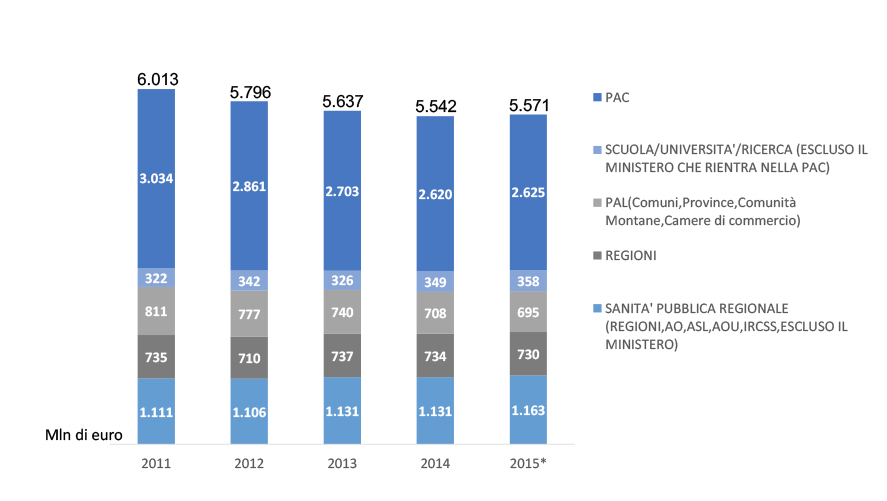
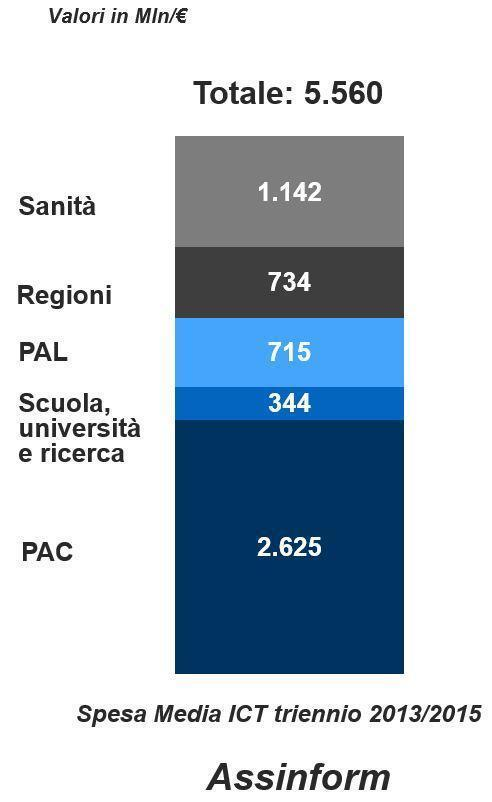
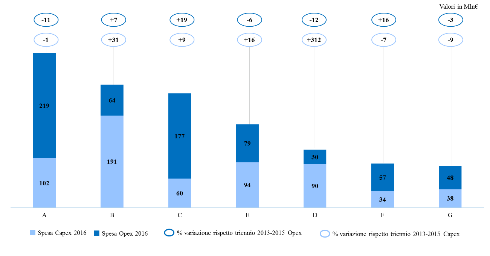
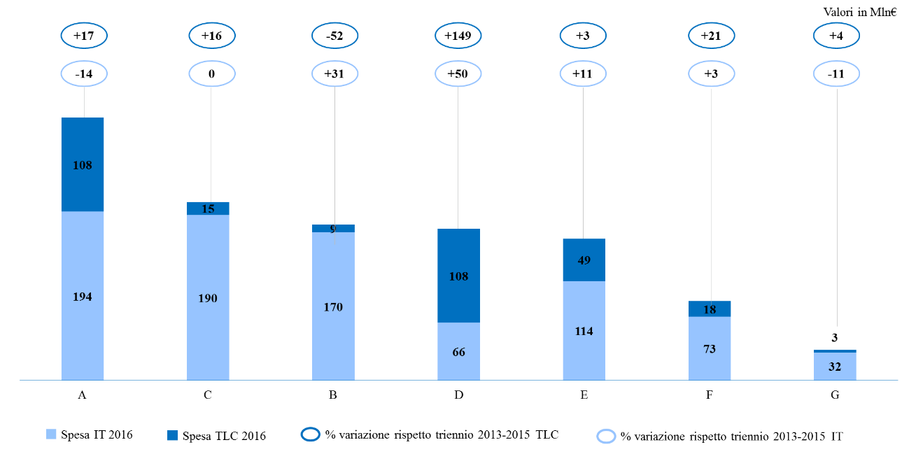

Allegato 3: Quadro sinottico della spesa ICT nelle Pubbliche amministrazioni centrali
=====================================================================================

1. Introduzione
---------------

Il percorso di definizione del Piano Triennale per l’ICT della Pubblica
Amministrazione ha previsto la realizzazione di un’azione di
coinvolgimento delle PA centrali e locali (PAC e PAL) per la raccolta di
dati e informazioni utili all’elaborazione di una fotografia aggiornata
delle principali caratteristiche della spesa e della progettualità in
questo settore.

La prima rilevazione (da adesso in poi “rilevazione AgID 2016”) è stata
condotta nel periodo aprile – novembre 2016: l’attenzione è stata
focalizzata sulla spesa e sulla rilevanza delle attività ICT delle
principali Amministrazioni centrali, secondo le modalità illustrate
nella Nota metodologica in appendice. La rilevazione è stata effettuata
con tutti i Ministeri, alcuni Enti Previdenziali e con le Agenzie
Fiscali, le cui attività sono considerate strategiche per
l’implementazione di sinergie e di interventi di centralizzazione in
un’ottica di ottimizzazione della spesa complessiva.

Ai Ministeri è stato chiesto di rappresentare anche la spesa informatica
delle proprie strutture periferiche e degli enti vigilati e controllati.

Il presente documento riporta le principali evidenze emerse dall’esame
dei dati raccolti, in termini di:

-  andamento della spesa per l’anno 2016 e confronto della stessa con la
   spesa media annua 2013-2015;

-  analisi dei principali progetti in corso e in fase di avvio.

I dati forniti, standardizzati e resi omogenei, sono stati condivisi con
le amministrazioni coinvolte per la loro verifica e validazione.

1.1. Situazione di riferimento – la rilevazione Assinform 2015
~~~~~~~~~~~~~~~~~~~~~~~~~~~~~~~~~~~~~~~~~~~~~~~~~~~~~~~~~~~~~~

Nella seconda metà dell’anno 2015, AgID ha promosso con Assinform [1]_
le attività di realizzazione del Terzo Osservatorio ICT nella Pubblica
Amministrazione:

-  esplicitando i fabbisogni informativi,

-  partecipando alla definizione della metodologia della rilevazione ed
   elaborazione dei dati che hanno costituito il database
   dell’Osservatorio,

-  partecipando alla definizione delle check list per la rilevazione dei
   dati e delle informazioni necessarie allo sviluppo dell’Osservatorio,

-  analizzando le “viste” dei risultati e degli elaborati intermedi e
   del rapporto finale.

Di seguito si propone un quadro di sintesi sul trend della spesa ICT dei
macro comparti della PA, negli ultimi cinque anni.

   Figura 1 - La spesa ICT per tipologia di PA – anni 2011- 2015 (fonte:
   Osservatorio Assinform 2016)

Dall’analisi effettuata da Assinform emerge che:

-  nel 2015 la spesa ICT calcolata è di 5.571 €/Mln (il 47% di questa
   spesa è effettuata dalle PAC e il 21% dagli enti del settore
   sanitario);

-  nel 2015 la spesa per investimenti ricopre circa il 28% della spesa
   totale;

-  nel periodo preso in esame, la spesa per servizi IT e TLC ha
   registrato una contrazione continua fino al 2015. In particolare, per
   le spese TLC la riduzione è stata più significativa e in parte
   attribuibile al progressivo passaggio al VOIP. La componente IT ha
   registrato i risparmi dai processi di razionalizzazione e
   dall’ampliamento del ricorso a strumenti di acquisto e negoziazione
   telematici (ad es. il Mercato Elettronico della P.A. – MePA –
   presente sul sito Consip
   `www.acquistinretepa.it <http://www.acquistinretepa.it>`__) e
   dall’adesione da parte di molti enti alla Convenzione Acquisti (vedi
   sopra, link al sito Consip).

La media triennale delle suddette rilevazioni, che è stata di
seguito utilizzata per definire la *baseline* per la rilevazione AgID
2016, è riportata nel grafico seguente:

   Figura 2 - La spesa ICT per tipologia di PA – media triennio 2013-2015
   (fonte: Osservatorio Assinform 2016)

1.2. La spesa media ICT per il triennio 2013-2015: comparazione tra la rilevazione Assinform e la rilevazione AgID
~~~~~~~~~~~~~~~~~~~~~~~~~~~~~~~~~~~~~~~~~~~~~~~~~~~~~~~~~~~~~~~~~~~~~~~~~~~~~~~~~~~~~~~~~~~~~~~~~~~~~~~~~~~~~~~~~~

L’analisi effettuata da AgID sui dati rilevati dalle principali
Amministrazioni centrali, realizzata secondo le modalità illustrate
nella Nota metodologica riportata in appendice, ha condotto a una
ricostruzione della spesa comparabile con le elaborazioni fornite da
Assinform.

.. figure:: media/allegato_3/figura3.png
   :width: 100%

   Figura 3 - La spesa ICT per tipologia di PA baseline 2013 - 2015 (fonte:
   Osservatorio Assinform 2016 e rilevazione AgID 2016)  [2]_

In particolare, come illustrato in figura 3:

-  la spesa media 2013-2015 complessiva - stimata da Assinform e
   riferita a tutte le Pubbliche amministrazioni – è di circa 5,5 Mld€;

-  la spesa media 2013-2015 complessiva - stimata da Assinform e
   riferita alle Pubbliche amministrazioni centrali – è di circa 2,625
   Mld€ ovvero circa il 50% del valore sopra indicato;

-  la spesa media 2013-2015 - rilevata da AgID - è di 2,6 Mld €;

-  i dati rilevati da AgID, per la media del triennio 2013-2015,
   fotografano una spesa ICT delle Pubbliche amministrazioni centrali di
   circa 2.0 Mld€. Tale valore corrisponde al 77% del totale della spesa
   ICT (vedi oltre) e corrisponde alla somma dei dati puntuali forniti
   dalle amministrazioni e di dati aggregati forniti dalle
   amministrazioni senza ulteriori dettagli.

A questo valore va sommato l’importo – stimato – di ulteriori 600 Ml€,
per un totale di spesa di 2.6 Mld€. I criteri di calcolo sono riportati
nella Nota metodologica in appendice.

I dati delle rilevazioni Assinform e AgID sono quindi allineati e il
valore medio 2013-2015 costituisce pertanto la *baseline* di riferimento
per l’analisi dei dati relativi al 2016.

1.3. Rilevazione AgID 2016
~~~~~~~~~~~~~~~~~~~~~~~~~~

La rilevazione è stata effettuata coinvolgendo le seguenti
amministrazioni: ACI, Agenzia Demanio, Agenzia Dogane, Agenzia Entrate,
Arma dei Carabinieri, Equitalia, INAIL, INPS, Ministero degli Affari
Esteri (MAE), Ministero dell’Economia e delle Finanze (MEF), Ministero
dei Beni e delle Attività Culturali e del Turismo (MiBACT), Ministero
dell’Ambiente, Ministero della Difesa, Ministero della Giustizia,
Ministero dell’Interno, Ministero del Lavoro, Ministero della Salute,
Ministero delle Politiche Agricole, Alimentari e Forestali (MIPAAF),
Ministero dello Sviluppo Economico (MISE), Ministero delle
Infrastrutture e dei Trasporti (MIT), Ministero dell’Istruzione,
dell’Università e della Ricerca (MIUR).

L’analisi dell’andamento complessivo della spesa ICT delle PA per il
2016, illustrata nella successiva tabella, è stata condotta sui dati
forniti dalle PAC coinvolte sulla base dei criteri illustrati nella Nota
metodologica in appendice e sulla base di stime elaborate a partire da
altre fonti informative e *benchmark* di settore.

.. table::
   :widths: 1 1 1 4

   +----------------------------------------------------------+---------------------------------------------------------------------------------------------------+-------------------------+--------------------------------------------------------------------------------------------------------------------------------------------------------------------------------------------------------+
   | **Tipologia di analisi**                                 | **Tipologia dati**                                                                                | **Spesa 2016**          | **Note**                                                                                                                                                                                               |
   |                                                          |                                                                                                   | **(Valori in Mln/€)**   |                                                                                                                                                                                                        |
   +----------------------------------------------------------+---------------------------------------------------------------------------------------------------+-------------------------+--------------------------------------------------------------------------------------------------------------------------------------------------------------------------------------------------------+
   | **Dati PAC rilevati:**                                   | Dati puntuali                                                                                     |                   1.656 | I dati riguardano le 21 PAC che hanno restituito le schede compilate con il set minimo di informazioni richiesto per l’analisi.                                                                        |
   | Informazioni da Amministrazioni del campione esaminato   +---------------------------------------------------------------------------------------------------+-------------------------+--------------------------------------------------------------------------------------------------------------------------------------------------------------------------------------------------------+
   |                                                          | Dati aggregati                                                                                    |                         | I dati sono incrementali rispetto ai dati puntuali e sono relativi a 2 PAC sulle 21 coinvolte:                                                                                                         |
   |                                                          |                                                                                                   |                         |                                                                                                                                                                                                        |
   |                                                          |                                                                                                   |                         | -  il Ministero della Difesa per quanto riguarda la spesa operativa classificata (informazioni secretate);                                                                                             |
   |                                                          |                                                                                                   |                     284 | -  il MIUR per quanto riguarda la spesa del CINECA (Comparto Università) e del Piano Nazionale per la Scuola Nazionale. Tali dati sono stati comunicati privi del dettaglio richiesto per l’analisi.   |
   +----------------------------------------------------------+---------------------------------------------------------------------------------------------------+-------------------------+--------------------------------------------------------------------------------------------------------------------------------------------------------------------------------------------------------+
   | **Sub-totale**                                                                                                                                               |               **1.940** |                                                                                                                                                                                                        |
   +----------------------------------------------------------+---------------------------------------------------------------------------------------------------+-------------------------+--------------------------------------------------------------------------------------------------------------------------------------------------------------------------------------------------------+
   | **Dati PAC stimati**                                     | **Stima dati PAC** coinvolte con dati assenti o incompleti                                        |                         | I dati sono relativi a 2 PAC sulle 21 coinvolte:                                                                                                                                                       |
   |                                                          |                                                                                                   |                         |                                                                                                                                                                                                        |
   |                                                          |                                                                                                   |                         | -  il Ministero dell’Ambiente, per quanto riguarda la spesa per il Sistema di controllo della tracciabilità dei rifiuti (SISTRI) e il Geoportale Nazionale;                                            |
   |                                                          |                                                                                                   |                         | -  il MIPAAF, per quanto di competenza della AGEA (società in house del MIPAAF).                                                                                                                       |
   |                                                          |                                                                                                   |                         |                                                                                                                                                                                                        |
   |                                                          |                                                                                                   |                     200 | Tali dati non sono stati comunicati.                                                                                                                                                                   |
   |                                                          +---------------------------------------------------------------------------------------------------+-------------------------+--------------------------------------------------------------------------------------------------------------------------------------------------------------------------------------------------------+
   |                                                          | Valutazioni da *benchmark* di settore su dati non comunicati e PAC fuori dal campione esaminato   |                         | Dati PAC coinvolte nella rilevazione con dati assenti o incompleti, in particolare per:                                                                                                                |
   |                                                          |                                                                                                   |                         |                                                                                                                                                                                                        |
   |                                                          |                                                                                                   |                         | -  Istituto Poligrafico e Zecca dello Stato                                                                                                                                                            |
   |                                                          |                                                                                                   |                         | -  Guardia di Finanza                                                                                                                                                                                  |
   |                                                          |                                                                                                   |                         | -  Enti vigilati e controllati dai Ministeri presenti nell’elenco ISTAT (es. Infocamere e AIFA)                                                                                                        |
   |                                                          |                                                                                                   |                         | -  ISTAT                                                                                                                                                                                               |
   |                                                          |                                                                                                   |                         |                                                                                                                                                                                                        |
   |                                                          |                                                                                                   |                         | Inoltre:                                                                                                                                                                                               |
   |                                                          |                                                                                                   |                         |                                                                                                                                                                                                        |
   |                                                          |                                                                                                   |                         | -  Presidenza del Consiglio dei Ministri                                                                                                                                                               |
   |                                                          |                                                                                                   |                         | -  Authority                                                                                                                                                                                           |
   |                                                          |                                                                                                   |                     485 | -  CNR                                                                                                                                                                                                 |
   +----------------------------------------------------------+---------------------------------------------------------------------------------------------------+-------------------------+--------------------------------------------------------------------------------------------------------------------------------------------------------------------------------------------------------+
   | **Sub-totale**                                                                                                                                               |                 **685** |                                                                                                                                                                                                        |
   +----------------------------------------------------------+---------------------------------------------------------------------------------------------------+-------------------------+--------------------------------------------------------------------------------------------------------------------------------------------------------------------------------------------------------+
   | **TOTALE**                                                                                                                                                   |               **2.625** |                                                                                                                                                                                                        |
   +----------------------------------------------------------+---------------------------------------------------------------------------------------------------+-------------------------+--------------------------------------------------------------------------------------------------------------------------------------------------------------------------------------------------------+

Tabella 1 - Ricostruzione spesa ICT delle PAC per l’anno 2016

La sintesi dei dati rilevati per il 2016 è pertanto rappresentata in
figura 4.

.. figure:: media/allegato_3/figura4.png
   :width: 100%

   Figura 4 - La spesa ICT per le PAC 2016 – Rilevazione AgID

L’analisi di dettaglio che segue è stata condotta sui dati puntuali che,
come indicato nella precedente figura, complessivamente pesano per il
63% sul totale della spesa stimata per tutte le PAC. Le amministrazioni
coinvolte hanno infatti fornito le informazioni utili agli
approfondimenti successivi per un importo complessivo di 1,6 Mld€.

Si precisa, quindi, che nei successivi paragrafi non sono presi in esame
né i dati aggregati (284 Mln€) né la spesa stimata (685 Mln€).

2. Quadro generale sul trend di spesa ICT nelle PAC
---------------------------------------------------

La Figura 5 evidenzia il dato di spesa totale relativo
all’anno 2016 e la variazione rispetto alla media del triennio
2013-2015.

.. figure:: media/allegato_3/figura5.png
   :width: 100%

   Figura 5 - Spesa totale ICT anno 2016 e confronto con il valore medio
   del triennio 2013-2015

Dalla precedente figura emerge che circa l’82% della spesa analizzata fa
riferimento a 7 amministrazioni su 21. Pertanto alcune delle analisi
proposte nei paragrafi successivi saranno dedicate a tali
amministrazioni, denominate “\ *Big spender”.*

La Figura 6 evidenzia [3]_, relativamente alle 7 PAC *Big spender* 2016,
la rilevanza della spesa della singola Amministrazione sul totale,
nonché il peso percentuale della componente Opex sul totale Capex/Opex e
della componente IT sul totale ICT.

.. figure:: media/allegato_3/figura6.png
   :width: 100%

   Figura 6 - Big spender: rilevanza delle componenti di spesa Opex e IT
   sul totale 2016

Questa prima vista di sintesi permette di evidenziare come, anche
considerando un numero ristretto di Amministrazioni centrali, le scelte
alla base della spesa informatica nella PA presentino logiche non
omogenee, originate anche da scarso livello di coordinamento e di
indirizzo.

La Tabella 2 riporta la spesa totale per le 21 PAC.

Sulla base dei dati puntuali disponibili in questa tabella vengono
presentate: la spesa 2016, il valore medio per gli anni 2013-2015, lo
scostamento in valore assoluto e in percentuale sul totale 2016 (1.656
Mln€) e, nell’ultima colonna, la rilevanza della spesa di ciascuna
amministrazione sul totale 2016.

.. table::
   :widths: 1 2 2 2 1 1

   +------------------------------------------------------------------------+---------------------------+----------------------------------------+------------------------+--------------------+-------------------------------+
   | **PAC**                                                                | **Spesa Totale 2016 (a)** | **Spesa totale media 2013-2015 (b)**   | **Differenza (a-b)**   | **Differenza %**   | **% spesa 2016 sul totale**   |
   +------------------------------------------------------------------------+---------------------------+----------------------------------------+------------------------+--------------------+-------------------------------+
   | A                                                                      | € 320.655.738             | € 348.360.656                          | -€ 27.704.918          | -8%                | 19%                           |
   +------------------------------------------------------------------------+---------------------------+----------------------------------------+------------------------+--------------------+-------------------------------+
   | B                                                                      | € 255.289.656             | € 205.565.274                          | € 49.724.383           | 24%                | 15%                           |
   +------------------------------------------------------------------------+---------------------------+----------------------------------------+------------------------+--------------------+-------------------------------+
   | C                                                                      | € 237.531.900             | € 204.603.329                          | € 32.928.571           | 16%                | 14%                           |
   +------------------------------------------------------------------------+---------------------------+----------------------------------------+------------------------+--------------------+-------------------------------+
   | D                                                                      | € 174.134.690             | € 87.579.864                           | € 86.554.826           | 99%                | 11%                           |
   +------------------------------------------------------------------------+---------------------------+----------------------------------------+------------------------+--------------------+-------------------------------+
   | E                                                                      | € 173.140.000             | € 165.583.490                          | € 7.556.510            | 5%                 | 10%                           |
   +------------------------------------------------------------------------+---------------------------+----------------------------------------+------------------------+--------------------+-------------------------------+
   | F                                                                      | € 90.698.670              | € 85.521.394                           | € 5.177.275            | 6%                 | 5%                            |
   +------------------------------------------------------------------------+---------------------------+----------------------------------------+------------------------+--------------------+-------------------------------+
   | G                                                                      | € 86.381.776              | € 91.476.908                           | -€ 5.095.132           | -6%                | 5%                            |
   +------------------------------------------------------------------------+---------------------------+----------------------------------------+------------------------+--------------------+-------------------------------+
   | H                                                                      | € 63.794.263              | € 67.277.000                           | -€ 3.482.737           | -5%                | 4%                            |
   +------------------------------------------------------------------------+---------------------------+----------------------------------------+------------------------+--------------------+-------------------------------+
   | I                                                                      | € 49.351.834              | € 77.403.457                           | -€ 28.051.623          | -36%               | 3%                            |
   +------------------------------------------------------------------------+---------------------------+----------------------------------------+------------------------+--------------------+-------------------------------+
   | L                                                                      | € 37.340.550              | € 45.791.062                           | -€ 8.450.512           | -18%               | 2%                            |
   +------------------------------------------------------------------------+---------------------------+----------------------------------------+------------------------+--------------------+-------------------------------+
   | M                                                                      | € 34.520.611              | € 32.000.000                           | € 2.520.611            | 8%                 | 2%                            |
   +------------------------------------------------------------------------+---------------------------+----------------------------------------+------------------------+--------------------+-------------------------------+
   | N                                                                      | € 33.112.292              | € 45.571.672                           | -€ 12.459.380          | -27%               | 2%                            |
   +------------------------------------------------------------------------+---------------------------+----------------------------------------+------------------------+--------------------+-------------------------------+
   | O                                                                      | € 21.092.616              | € 18.095.548                           | € 2.997.068            | 17%                | 1%                            |
   +------------------------------------------------------------------------+---------------------------+----------------------------------------+------------------------+--------------------+-------------------------------+
   | P                                                                      | € 17.213.115              | € 17.496.435                           | -€ 283.321             | -2%                | 1%                            |
   +------------------------------------------------------------------------+---------------------------+----------------------------------------+------------------------+--------------------+-------------------------------+
   | Q                                                                      | € 12.508.197              | € 9.836.066                            | € 2.672.131            | 27%                | 1%                            |
   +------------------------------------------------------------------------+---------------------------+----------------------------------------+------------------------+--------------------+-------------------------------+
   | R                                                                      | € 12.491.528              | € 13.235.710                           | -€ 744.181             | -6%                | 1%                            |
   +------------------------------------------------------------------------+---------------------------+----------------------------------------+------------------------+--------------------+-------------------------------+
   | S                                                                      | € 10.942.623              | € 11.475.410                           | -€ 532.787             | -5%                | 1%                            |
   +------------------------------------------------------------------------+---------------------------+----------------------------------------+------------------------+--------------------+-------------------------------+
   | T                                                                      | € 9.240.212               | € 9.306.870                            | -€ 66.658              | -1%                | 1%                            |
   +------------------------------------------------------------------------+---------------------------+----------------------------------------+------------------------+--------------------+-------------------------------+
   | U                                                                      | € 7.195.902               | € 1.686.885                            | € 5.509.016            | 327%               | 0%                            |
   +------------------------------------------------------------------------+---------------------------+----------------------------------------+------------------------+--------------------+-------------------------------+
   | V                                                                      | € 8.048.534               | € 7.173.667                            | € 874.867              | 12%                | 0%                            |
   +------------------------------------------------------------------------+---------------------------+----------------------------------------+------------------------+--------------------+-------------------------------+
   | Z                                                                      | € 1.231.721               | € 1.190.291                            | € 41.430               | 3%                 | 0%                            |
   +------------------------------------------------------------------------+---------------------------+----------------------------------------+------------------------+--------------------+-------------------------------+
   | **Totale con dati puntuali**                                           | **€ 1.655.916.427**       | **€ 1.546.230.987**                    | **€ 109.685.440**      | **7%**             | **100%**                      |
   +------------------------------------------------------------------------+---------------------------+----------------------------------------+------------------------+--------------------+-------------------------------+
   | **Totale ulteriori dati aggregati (Min. Difesa e MIUR)**               | **€ 284.000.000**         |                                        |                        |                    |                               |
   +------------------------------------------------------------------------+---------------------------+----------------------------------------+------------------------+--------------------+-------------------------------+
   | **Totale stima PAC coinvolte e benchmark di settore su altre PAC**     | **€ 685.083.573**         |                                        |                        |                    |                               |
   +------------------------------------------------------------------------+---------------------------+----------------------------------------+------------------------+--------------------+-------------------------------+
   | **TOTALE PAC**                                                         | **€ 2.625.000.000**       |                                        |                        |                    |                               |
   +------------------------------------------------------------------------+---------------------------+----------------------------------------+------------------------+--------------------+-------------------------------+

Tabella 2 - Spesa totale ICT 2016 e confronto con il valore medio del
triennio 2013-2015

La spesa totale del 2016 è in crescita del 7% rispetto alla media del
triennio 2013-2015 e, in particolare, gli incrementi della spesa più
significativi riguardano le amministrazioni D, Q, U, anche se per questi
ultimi l’incremento in termini assoluti è poco significativo.

Di contro si registrano sensibili riduzioni percentuali della spesa
totale per il 2016 rispetto alla media del triennio precedente per le
amministrazioni I ed N. Bisogna comunque tener conto, come illustrato
nella tabella 1, che una parte significativa della spesa di questi
Ministeri non è stata inclusa nelle tabelle di dettaglio perché i dati
sono stati forniti solo a livello aggregato.

Nei paragrafi successivi vengono fornite delle viste di dettaglio sulla
spesa suddivisa per natura contabile in Capex e Opex e per destinazione
della spesa ICT e TLC.

La lettura dei dati deve comunque tenere conto della mancanza di alcune
informazioni di contesto legate alla presenza di società *in-house* per
l’ICT, che influenzano per esempio: la suddivisione tra Capex/Opex e il
dimensionamento di alcune componenti di spesa sia IT sia TLC.

La Tabella 3 riporta l’elenco delle principali società in-house nel
settore ICT relativamente alle PA Centrali del campione.

+--------------------------------------------------------------+------------------------------------------------------+
| **PAC**                                                      | **Principale società in house nel settore ICT**      |
+--------------------------------------------------------------+------------------------------------------------------+
| MEF                                                          | Sogei SpA                                            |
+--------------------------------------------------------------+                                                      |
| Agenzia delle Entrate                                        | IPZS SpA                                             |
+--------------------------------------------------------------+                                                      |
| Agenzia del Demanio                                          |                                                      |
+--------------------------------------------------------------+                                                      |
| Agenzia delle Dogane                                         |                                                      |
+--------------------------------------------------------------+------------------------------------------------------+
| Equitalia                                                    | Sogei SpA (per il 50%)                               |
+--------------------------------------------------------------+------------------------------------------------------+
| ACI                                                          | ACI Informatica SpA                                  |
+--------------------------------------------------------------+------------------------------------------------------+
| Ministero della Difesa                                       | Agenzia Industrie Difesa                             |
+--------------------------------------------------------------+------------------------------------------------------+
| Ministero delle politiche agricole alimentari e forestali    | Agea                                                 |
+--------------------------------------------------------------+------------------------------------------------------+
| Ministero dello Sviluppo Economico                           | Infratel SpA – Infocamere scpa                       |
+--------------------------------------------------------------+------------------------------------------------------+
| Ministero delle Infrastrutture e dei Trasporti               | Uirnet SpA                                           |
+--------------------------------------------------------------+------------------------------------------------------+
| Ministero dell'Istruzione, dell'Università e della Ricerca   | Cineca                                               |
+--------------------------------------------------------------+------------------------------------------------------+

Tabella 3 - Principali società in-house nel settore ICT

3. Analisi della Spesa del 2016
-------------------------------

L’analisi dei dati puntuali è stata articolata secondo le seguenti
viste:

-  ripartizione per tipologia di spesa Capex/Opex;

-  ripartizione per componenti di spesa IT/TLC;

-  ripartizione per modalità di acquisto Consip/Fuori Consip.

3.1. Spesa Capex/Opex
~~~~~~~~~~~~~~~~~~~~~

La tabella 4 riporta della Spesa per investimenti (Capex) e la Spesa per
la gestione corrente (Opex) per il 2016 e le relative incidenze sugli
importi totali.

.. table::
   :widths: 1 2 1 2 1 2

   +--------------+----------------------+-------------------------+----------------------+------------------------+---------------------------+
   | **PAC**      | **Spesa Capex 2016** | **% Capex su totale**   | **Spesa Opex 2016**  | **% Opex su totale**   | **Spesa totale 2016**     |
   +--------------+----------------------+-------------------------+----------------------+------------------------+---------------------------+
   | A            | € 101.639.344        | 32%                     | € 219.016.393        | 68%                    | € 320.655.738             |
   +--------------+----------------------+-------------------------+----------------------+------------------------+---------------------------+
   | B            | € 190.936.535        | 75%                     | € 64.353.122         | 25%                    | € 255.289.656             |
   +--------------+----------------------+-------------------------+----------------------+------------------------+---------------------------+
   | C            | € 60.244.503         | 25%                     | € 177.287.398        | 75%                    | € 237.531.901             |
   +--------------+----------------------+-------------------------+----------------------+------------------------+---------------------------+
   | D            | € 90.546.084         | 75%                     | € 29.810.594         | 25%                    | € 120.356.678             |
   +--------------+----------------------+-------------------------+----------------------+------------------------+---------------------------+
   | E            | € 94.386.000         | 55%                     | € 78.754.000         | 45%                    | € 173.140.000             |
   +--------------+----------------------+-------------------------+----------------------+------------------------+---------------------------+
   | F            | € 33.829.510         | 37%                     | € 56.869.160         | 63%                    | € 90.698.670              |
   +--------------+----------------------+-------------------------+----------------------+------------------------+---------------------------+
   | G            | € 38.295.502         | 44%                     | € 48.086.275         | 56%                    | € 86.381.776              |
   +--------------+----------------------+-------------------------+----------------------+------------------------+---------------------------+
   | H            | € 17.601.749         | 28%                     | € 46.192.513         | 72%                    | € 63.794.263              |
   +--------------+----------------------+-------------------------+----------------------+------------------------+---------------------------+
   | I            | € 41.839.675         | 85%                     | € 7.512.160          | 15%                    | € 49.351.834              |
   +--------------+----------------------+-------------------------+----------------------+------------------------+---------------------------+
   | L            | € 14.850.734         | 40%                     | € 22.489.816         | 60%                    | € 37.340.550              |
   +--------------+----------------------+-------------------------+----------------------+------------------------+---------------------------+
   | M            | € 13.881.582         | 40%                     | € 20.639.029         | 60%                    | € 34.520.611              |
   +--------------+----------------------+-------------------------+----------------------+------------------------+---------------------------+
   | N            | € 5.907.569          | 18%                     | € 27.204.723         | 82%                    | € 33.112.292              |
   +--------------+----------------------+-------------------------+----------------------+------------------------+---------------------------+
   | O            | € 5.628.393          | 27%                     | € 15.464.222         | 73%                    | € 21.092.616              |
   +--------------+----------------------+-------------------------+----------------------+------------------------+---------------------------+
   | P            | € 12.295.082         | 71%                     | € 4.918.033          | 29%                    | € 17.213.115              |
   +--------------+----------------------+-------------------------+----------------------+------------------------+---------------------------+
   | Q            | € 7.180.328          | 57%                     | € 5.327.869          | 43%                    | € 12.508.197              |
   +--------------+----------------------+-------------------------+----------------------+------------------------+---------------------------+
   | R            | € 4.370.265          | 35%                     | € 8.121.263          | 65%                    | € 12.491.528              |
   +--------------+----------------------+-------------------------+----------------------+------------------------+---------------------------+
   | S            | € 4.180.328          | 38%                     | € 6.762.295          | 62%                    | € 10.942.623              |
   +--------------+----------------------+-------------------------+----------------------+------------------------+---------------------------+
   | T            | € 3.834.949          | 42%                     | € 5.405.263          | 58%                    | € 9.240.213               |
   +--------------+----------------------+-------------------------+----------------------+------------------------+---------------------------+
   | U            | € 1.688.525          | 23%                     | € 5.507.377          | 77%                    | € 7.195.902               |
   +--------------+----------------------+-------------------------+----------------------+------------------------+---------------------------+
   | V            | € 4.465.740          | 55%                     | € 3.582.794          | 45%                    | € 8.048.534               |
   +--------------+----------------------+-------------------------+----------------------+------------------------+---------------------------+
   | Z            | € 520.000            | 42%                     | € 711.721            | 58%                    | € 1.231.721               |
   +--------------+----------------------+-------------------------+----------------------+------------------------+---------------------------+
   | **TOTALE**   | **€ 748.122.397**    | **47%**                 | **€ 854.016.020**    | **53%**                | **€ 1.602.138.416(\*)**   |
   +--------------+----------------------+-------------------------+----------------------+------------------------+---------------------------+

:sup:`(\*)` Il totale della spesa non coincide con il totale riportato
nel quadro generale per i motivi illustrati nella Nota metodologica.

Tabella 4 - Spesa Capex-Opex anno 2016 e rilevanza % sul totale

Complessivamente per le PAC rilevate la spesa risulta così ripartita:
47% Capex e 53% Opex.

Si evidenzia che solo per 7 amministrazioni si registrano spese Capex
oltre il 50% con il valore massimo all’85% dell’amministrazione I, che
ha avviato investimenti infrastrutturali di rilievo.

La percentuale di spesa OPEX più rilevante pari all’82% si registra per
l’Amministrazione N che conferma la policy di gestire in completo
outsourcing il proprio sistema informatico.

La Figura 4 evidenzia relativamente ai 7 *Big spender* il dettaglio
della ripartizione Capex/Opex per il 2016 e le relative variazioni
rispetto alla media del triennio 2013-2015.

   Figura 7 - Componenti Capex/Opex per il 2016 e variazioni rispetto al
   triennio 2013-2015

Come anticipato, nel grafico della figura 7, si registra che solo per 3
dei 7 *big spender* si registra un’incidenza della quota Capex superiore
al 50% della spesa totale e, più esattamente, per le amministrazioni D,
B e E, una spesa in crescita rispetto al triennio passato.

Analisi Spesa Capex annua 2016 sulla Media triennio 2013-2015
^^^^^^^^^^^^^^^^^^^^^^^^^^^^^^^^^^^^^^^^^^^^^^^^^^^^^^^^^^^^^

La tabella 5 riporta per ciascuna Amministrazione il confronto tra la
spesa Capex per l’anno 2016 e il valore medio registrato per il triennio
2013-2015, in termini assoluti e percentuali.

+--------------+---------------------+---------------------------+---------------------+-------------------+
| **PAC**      | **Spesa Capex**     | **Spesa Capex**           | **Differenza**      | **Differenza**    |
|              | **2016**            | **media 2013-2015 (b)**   | **(a-b)**           | **(%)**           |
|              | **(a)**             |                           |                     |                   |
+--------------+---------------------+---------------------------+---------------------+-------------------+
| A            | € 101.639.344       | € 102.459.016             | -€ 819.672          | -1%               |
+--------------+---------------------+---------------------------+---------------------+-------------------+
| B            | € 190.936.535       | € 145.247.634             | € 45.688.900        | 31%               |
+--------------+---------------------+---------------------------+---------------------+-------------------+
| C            | € 60.244.503        | € 55.197.811              | € 5.046.693         | 9%                |
+--------------+---------------------+---------------------------+---------------------+-------------------+
| D            | € 90.546.084        | € 21.969.966              | € 68.576.118        | 312%              |
+--------------+---------------------+---------------------------+---------------------+-------------------+
| E            | € 94.386.000        | € 81.532.490              | € 12.853.510        | 16%               |
+--------------+---------------------+---------------------------+---------------------+-------------------+
| F            | € 33.829.510        | € 36.477.206              | -€ 2.647.696        | -7%               |
+--------------+---------------------+---------------------------+---------------------+-------------------+
| G            | € 38.295.502        | € 42.080.526              | -€ 3.785.025        | -9%               |
+--------------+---------------------+---------------------------+---------------------+-------------------+
| H            | € 17.601.749        | € 14.472.000              | € 3.129.749         | 22%               |
+--------------+---------------------+---------------------------+---------------------+-------------------+
| I            | € 41.839.675        | € 56.673.188              | -€ 14.833.513       | -26%              |
+--------------+---------------------+---------------------------+---------------------+-------------------+
| L            | € 14.850.734        | € 17.182.657              | -€ 2.331.922        | -14%              |
+--------------+---------------------+---------------------------+---------------------+-------------------+
| M            | € 13.881.582        | € 12.000.000              | € 1.881.582         | 16%               |
+--------------+---------------------+---------------------------+---------------------+-------------------+
| N            | € 5.907.569         | € 17.856.728              | -€ 11.949.160       | -67%              |
+--------------+---------------------+---------------------------+---------------------+-------------------+
| O            | € 5.628.393         | € 3.380.682               | € 2.247.712         | 66%               |
+--------------+---------------------+---------------------------+---------------------+-------------------+
| P            | € 12.295.082        | € 11.972.832              | € 322.250           | 3%                |
+--------------+---------------------+---------------------------+---------------------+-------------------+
| Q            | € 7.180.328         | € 4.918.033               | € 2.262.295         | 46%               |
+--------------+---------------------+---------------------------+---------------------+-------------------+
| R            | € 4.370.265         | € 3.922.956               | € 447.310           | 11%               |
+--------------+---------------------+---------------------------+---------------------+-------------------+
| S            | € 4.180.328         | € 4.344.262               | -€ 163.934          | -4%               |
+--------------+---------------------+---------------------------+---------------------+-------------------+
| T            | € 3.834.949         | € 5.142.723               | -€ 1.307.774        | -25%              |
+--------------+---------------------+---------------------------+---------------------+-------------------+
| U            | € 1.688.525         | € 1.442.623               | € 245.902           | 17%               |
+--------------+---------------------+---------------------------+---------------------+-------------------+
| V            | € 4.465.740         | € 4.369.772               | € 95.968            | 2%                |
+--------------+---------------------+---------------------------+---------------------+-------------------+
| Z            | € 520.000           | € 514.623                 | € 5.377             | 1%                |
+--------------+---------------------+---------------------------+---------------------+-------------------+
| **TOTALE**   | **€ 748.122.397**   | **€ 643.157.728**         | **€ 104.964.669**   | **16%**           |
+--------------+---------------------+---------------------------+---------------------+-------------------+

Tabella 5 - Confronto Capex anno 2016 e il valore medio triennio
2013-2015

Complessivamente la spesa Capex per l’anno 2016 aumenta del 16% rispetto
alla media del triennio 2013-2015. In particolare, emerge che il maggior
incremento riguarda l’Amministrazione D, con una crescita del 312%; tale
dato trova una prima motivazione sia nel forte incremento della spesa
totale precedentemente evidenziato, sia nella numerosità dei progetti
che l’Amministrazione ha pianificato di avviare nel triennio 2016-2018.
Anche le amministrazioni O e Q presentano un incremento percentuale
elevato, anche se poco significativo in termini assoluti.

Andamento spesa Opex annua 2016 sulla Media triennio 2013-2015
^^^^^^^^^^^^^^^^^^^^^^^^^^^^^^^^^^^^^^^^^^^^^^^^^^^^^^^^^^^^^^

La tabella 6 riporta per ciascuna amministrazione il confronto tra la
spesa Opex per l’anno 2016 e il valore medio registrato per il triennio
2013-2015, in termini assoluti e percentuali.

+--------------+---------------------+-----------------------+---------------------+----------------------+
| **PAC**      | **Spesa Opex**      | **Spesa Opex**        | **Differenza**      | **Differenza (%)**   |
|              | **2016**            | **media 2013-2015**   | **(a-b)**           |                      |
|              | **(a)**             | **(b)**               |                     |                      |
+--------------+---------------------+-----------------------+---------------------+----------------------+
| A            | € 219.016.393       | € 245.901.639         | -€ 26.885.246       | -11%                 |
+--------------+---------------------+-----------------------+---------------------+----------------------+
| B            | € 64.353.122        | € 60.317.640          | € 4.035.482         | 7%                   |
+--------------+---------------------+-----------------------+---------------------+----------------------+
| C            | € 177.287.398       | € 149.405.518         | € 27.881.880        | 19%                  |
+--------------+---------------------+-----------------------+---------------------+----------------------+
| D            | € 29.810.594        | € 34.053.813          | -€ 4.243.218        | -12%                 |
+--------------+---------------------+-----------------------+---------------------+----------------------+
| E            | € 78.754.000        | € 84.051.240          | -€ 5.297.240        | -6%                  |
+--------------+---------------------+-----------------------+---------------------+----------------------+
| F            | € 56.869.160        | € 49.044.189          | € 7.824.971         | 16%                  |
+--------------+---------------------+-----------------------+---------------------+----------------------+
| G            | € 48.086.275        | € 49.396.382          | -€ 1.310.107        | -3%                  |
+--------------+---------------------+-----------------------+---------------------+----------------------+
| H            | € 46.192.513        | € 52.805.000          | -€ 6.612.487        | -13%                 |
+--------------+---------------------+-----------------------+---------------------+----------------------+
| I            | € 7.512.160         | € 20.730.269          | -€ 13.218.110       | -64%                 |
+--------------+---------------------+-----------------------+---------------------+----------------------+
| L            | € 22.489.816        | € 28.608.405          | -€ 6.118.589        | -21%                 |
+--------------+---------------------+-----------------------+---------------------+----------------------+
| M            | € 20.639.029        | € 20.000.000          | € 639.029           | 3%                   |
+--------------+---------------------+-----------------------+---------------------+----------------------+
| N            | € 27.204.723        | € 27.714.943          | -€ 510.220          | -2%                  |
+--------------+---------------------+-----------------------+---------------------+----------------------+
| O            | € 15.464.222        | € 14.714.866          | € 749.356           | 5%                   |
+--------------+---------------------+-----------------------+---------------------+----------------------+
| P            | € 4.918.033         | € 5.523.603           | -€ 605.570          | -11%                 |
+--------------+---------------------+-----------------------+---------------------+----------------------+
| Q            | € 5.327.869         | € 4.918.033           | € 409.836           | 8%                   |
+--------------+---------------------+-----------------------+---------------------+----------------------+
| R            | € 8.121.263         | € 9.312.754           | -€ 1.191.491        | -13%                 |
+--------------+---------------------+-----------------------+---------------------+----------------------+
| S            | € 6.762.295         | € 7.131.148           | -€ 368.852          | -5%                  |
+--------------+---------------------+-----------------------+---------------------+----------------------+
| T            | € 5.405.263         | € 4.164.147           | € 1.241.116         | 30%                  |
+--------------+---------------------+-----------------------+---------------------+----------------------+
| U            | € 5.507.377         | € 244.262             | € 5.263.115         | 2155%                |
+--------------+---------------------+-----------------------+---------------------+----------------------+
| V            | € 3.582.794         | € 2.803.895           | € 778.899           | 28%                  |
+--------------+---------------------+-----------------------+---------------------+----------------------+
| Z            | € 711.721           | € 675.668             | € 36.053            | 5%                   |
+--------------+---------------------+-----------------------+---------------------+----------------------+
| **TOTALE**   | **€ 854.016.020**   | **€ 871.517.414**     | **-€ 17.501.395**   | **-2%**              |
+--------------+---------------------+-----------------------+---------------------+----------------------+

Tabella 6 - Confronto Opex anno 2016 e il valore medio triennio
2013-2015

Complessivamente la spesa Opex per l’anno 2016 subisce un leggero
decremento (-2%) rispetto alla media del triennio 2013-2015.

Gli incrementi di segno positivo più rilevanti riguardano
l’Amministrazione V, con un incremento del 28% rispetto alla media
2013-2015, e l’Amministrazione C con un incremento del 19%. Come
precedentemente indicato, per le Agenzie fiscali l’incidenza di tale
parte di costi è legata alle attività che per loro vengono realizzate
dalla Sogei spa.

Per quanto riguarda l’Amministrazione U, l’incremento percentuale fuori
misura in base alle informazioni raccolte, è dovuto all’impossibilità
per il triennio passato di isolare e conteggiare buona parte dei costi
di funzionamento ICT rispetto al totale delle spese di parte corrente.

Focus spesa per infrastrutture fisiche
^^^^^^^^^^^^^^^^^^^^^^^^^^^^^^^^^^^^^^

La Figura 5 evidenzia relativamente alle singole
amministrazioni la quota parte di spesa per infrastrutture fisiche.

.. figure:: media/allegato_3/figura8.png
   :width: 100%

   Figura 8 - Spesa ICT 2016 delle PAC rilevata su infrastrutture fisiche

   All'interno della voce sono state inserite le seguenti amministrazioni: Min. Ambiente, MISE,
   Agenzia del Demanio, MAE, Min. Lavoro, MIPAAF, Min. Salute, MIBACT, Arma dei Carabinieri.

Per fornire una prima valutazione dell’incidenza della spesa per
infrastrutture fisiche sul totale della spesa ICT nelle PAC, si è
partiti da quanto emerso dall’analisi delle progettualità presentate
dalle amministrazioni stesse: complessivamente l’importo dei progetti,
in corso e in fase di avvio, relativi a infrastrutture fisiche risulta
pesare per circa il 55% sul totale degli importi dichiarati.

Si è quindi assunto di applicare tale peso percentuale sul totale della
spesa 2016 di ciascuna amministrazione.

3.2. Spesa IT/TLC
~~~~~~~~~~~~~~~~~

Per la componente IT sono state considerate le seguenti macro-voci di
spesa:

-  Hardware;

-  Software;

-  Licenze software comprensivo della relativa manutenzione;

-  Servizi IT (es. Servizi gestionali, SPC Cloud).

Per la componente TLC sono state considerate le seguenti macro-voci di
spesa:

-  Apparati e sistemi;

-  Connettività;

-  Servizi voci e dati;

-  Servizi TLC (es. Contact center, Smart Cities).

Si precisa che le analisi effettuate non tengono conto degli
investimenti compiuti sulla Banda ultralarga che produrranno i propri
effetti negli anni futuri.

La tabella 7 riporta il dettaglio della Spesa IT e TLC per il 2016.

.. table::
   :widths: 1 2 1 2 1 2

   +--------------+-----------------------+----------------------------+----------------------+-----------------------------+---------------------------+
   | **PAC**      | **Spesa IT**          | **% Spesa IT su totale**   | **Spesa TLC 2016**   | **% Spesa TLC su totale**   | **Spesa totale**          |
   |              | **2016**              |                            |                      |                             | **2016**                  |
   +--------------+-----------------------+----------------------------+----------------------+-----------------------------+---------------------------+
   | A            | € 194.622.007         | 64%                        | € 108.319.672        | 36%                         | € 302.941.679             |
   +--------------+-----------------------+----------------------------+----------------------+-----------------------------+---------------------------+
   | B            | € 169.912.732         | 95%                        | € 8.728.897          | 5%                          | € 178.641.629             |
   +--------------+-----------------------+----------------------------+----------------------+-----------------------------+---------------------------+
   | C            | € 190.412.185         | 92%                        | € 15.476.471         | 8%                          | € 205.888.656             |
   +--------------+-----------------------+----------------------------+----------------------+-----------------------------+---------------------------+
   | D            | € 66.083.232          | 38%                        | € 108.051.458        | 62%                         | € 174.134.690             |
   +--------------+-----------------------+----------------------------+----------------------+-----------------------------+---------------------------+
   | E            | € 113.913.997         | 70%                        | € 49.191.694         | 30%                         | € 163.105.691             |
   +--------------+-----------------------+----------------------------+----------------------+-----------------------------+---------------------------+
   | F            | € 72.741.541          | 80%                        | € 17.957.129         | 20%                         | € 90.698.670              |
   +--------------+-----------------------+----------------------------+----------------------+-----------------------------+---------------------------+
   | G            | € 32.083.211          | 91%                        | € 3.225.106          | 9%                          | € 35.308.317              |
   +--------------+-----------------------+----------------------------+----------------------+-----------------------------+---------------------------+
   | H            | € 56.566.327          | 89%                        | € 7.227.935          | 11%                         | € 63.794.263              |
   +--------------+-----------------------+----------------------------+----------------------+-----------------------------+---------------------------+
   | I            | € 31.380.011          | 64%                        | € 17.971.823         | 36%                         | € 49.351.834              |
   +--------------+-----------------------+----------------------------+----------------------+-----------------------------+---------------------------+
   | L            | € 35.958.576          | 84%                        | € 6.954.721          | 16%                         | € 42.913.296              |
   +--------------+-----------------------+----------------------------+----------------------+-----------------------------+---------------------------+
   | M            | € 31.453.325          | 91%                        | € 3.067.286          | 9%                          | € 34.520.611              |
   +--------------+-----------------------+----------------------------+----------------------+-----------------------------+---------------------------+
   | N            | € 30.383.558          | 92%                        | € 2.728.734          | 8%                          | € 33.112.292              |
   +--------------+-----------------------+----------------------------+----------------------+-----------------------------+---------------------------+
   | O            | € 12.285.637          | 58%                        | € 8.806.979          | 42%                         | € 21.092.616              |
   +--------------+-----------------------+----------------------------+----------------------+-----------------------------+---------------------------+
   | P            | € 11.319.328          | 66%                        | € 5.893.785          | 34%                         | € 17.213.114              |
   +--------------+-----------------------+----------------------------+----------------------+-----------------------------+---------------------------+
   | Q            | € 8.409.836           | 67%                        | € 4.098.361          | 33%                         | € 12.508.197              |
   +--------------+-----------------------+----------------------------+----------------------+-----------------------------+---------------------------+
   | R            | € 10.155.839          | 81%                        | € 2.335.689          | 19%                         | € 12.491.528              |
   +--------------+-----------------------+----------------------------+----------------------+-----------------------------+---------------------------+
   | S            | € 9.760.029           | 89%                        | € 1.179.229          | 11%                         | € 10.939.258              |
   +--------------+-----------------------+----------------------------+----------------------+-----------------------------+---------------------------+
   | T            | € 9.114.313           | 99%                        | € 125.899            | 1%                          | € 9.240.213               |
   +--------------+-----------------------+----------------------------+----------------------+-----------------------------+---------------------------+
   | U            | € 2.607.872           | 60%                        | € 1.721.311          | 40%                         | € 4.329.184               |
   +--------------+-----------------------+----------------------------+----------------------+-----------------------------+---------------------------+
   | V            | € 6.930.325           | 86%                        | € 1.118.209          | 14%                         | € 8.048.534               |
   +--------------+-----------------------+----------------------------+----------------------+-----------------------------+---------------------------+
   | Z            | € 947.000             | 79%                        | € 253.860            | 21%                         | € 1.200.860               |
   +--------------+-----------------------+----------------------------+----------------------+-----------------------------+---------------------------+
   | **TOTALE**   | **€ 1.097.040.882**   | **75%**                    | **€ 374.434.247**    | **25%**                     | **€ 1.471.475.129(\*)**   |
   +--------------+-----------------------+----------------------------+----------------------+-----------------------------+---------------------------+

(\*) il totale della spesa non coincide con il totale della spesa
Capex/Opex per i motivi illustrati nella Nota metodologica

Tabella 7 - Spesa IT/TLC anno 2016 e rilevanza % sul totale

Dalla tabella 7 si evince che la spesa complessiva per il 2016 presenta
la seguente composizione: 75% IT e 25% TLC.

Per la spesa in ICT i livelli di incidenza inferiori alla media sono
registrati per le amministrazioni O, D e U.

Per quanto riguarda la spesa in TLC, le amministrazioni M, B, H, T, S, N
e le tre Agenzie Fiscali, dichiarano una percentuale di spesa TLC sul
totale decisamente inferiore alla media, e in tutti i casi inferiore al
15%. Per l’Amministrazione B e le Agenzie Fiscali, compresa
l’Amministrazione H anche se in misura minore, tale elemento risulta
fortemente condizionato dalla caratteristica dei rapporti convenzionali
con la Sogei. Nei canoni complessivi corrisposti dalle amministrazioni
alla Sogei infatti è ricompresa una quota parte relativa alle
infrastrutture TLC difficilmente scorporabile.

Per le amministrazioni R ed S, il dato è coerente con la numerosità
delle sedi e alle scelte di passaggio dalla telefonia tradizionale al
VOIP.

Mentre per l’Amministrazione T, i dati disponibili fanno riferimento
alle sole sedi centrali e non contengono i dati delle sedi periferiche.

Il grafico riportato in figura 9 evidenzia, relativamente ai 7
*big spender* 2016, il dettaglio delle componenti IT/TLC per il 2016 e
le relative variazioni rispetto al triennio 2013-2015.

   Figura 9 - IT-TLC 2016 per i 7 big spender - confronto con triennio
   2013-2015

È facilmente rilevabile come per 6 dei 7 *Big spender* la spesa
destinata alle componenti IT sia nettamente superiore alla parte
destinata alle componenti TLC.

Solo per l’Amministrazione D, nell’anno 2016, risulta predominante la
quota parte di spesa TLC (108 Mln/€) rispetto alla quota di spesa IT (66
Mln/€).

Andamento Spesa IT annua 2016 sulla Media triennio 2013-2015
^^^^^^^^^^^^^^^^^^^^^^^^^^^^^^^^^^^^^^^^^^^^^^^^^^^^^^^^^^^^

La tabella 8 riporta per ciascuna Amministrazione il confronto tra la
spesa IT per il 2016 e la spesa media IT rilevata nel triennio
2013-2015, in termini assoluti e percentuali.

.. table::
   :widths: 1 2 2 2 2

   +--------------+-----------------------+------------------------------------+--------------------+----------------------+
   | **PAC**      | **Spesa IT**          | **Spesa IT media 2013-2015 (b)**   | **Differenza**     | **Differenza (%)**   |
   |              | **2016**              |                                    | **(a-b)**          |                      |
   +--------------+-----------------------+------------------------------------+--------------------+----------------------+
   | A            | € 194.622.007         | € 225.061.018                      | -€ 30.439.011      | -14%                 |
   +--------------+-----------------------+------------------------------------+--------------------+----------------------+
   | B            | € 169.912.732         | € 129.357.903                      | € 40.554.829       | 31%                  |
   +--------------+-----------------------+------------------------------------+--------------------+----------------------+
   | C            | € 190.412.185         | € 190.429.381                      | -€ 17.196          | 0%                   |
   +--------------+-----------------------+------------------------------------+--------------------+----------------------+
   | D            | € 66.083.232          | € 44.200.291                       | € 21.882.941       | 50%                  |
   +--------------+-----------------------+------------------------------------+--------------------+----------------------+
   | E            | € 113.913.997         | € 102.961.970                      | € 10.952.027       | 11%                  |
   +--------------+-----------------------+------------------------------------+--------------------+----------------------+
   | F            | € 72.741.541          | € 70.696.796                       | € 2.044.746        | 3%                   |
   +--------------+-----------------------+------------------------------------+--------------------+----------------------+
   | G            | € 32.083.211          | € 36.059.653                       | -€ 3.976.442       | -11%                 |
   +--------------+-----------------------+------------------------------------+--------------------+----------------------+
   | H            | € 56.566.327          | € 59.896.000                       | -€ 3.329.673       | -6%                  |
   +--------------+-----------------------+------------------------------------+--------------------+----------------------+
   | I            | € 31.380.011          | € 43.794.477                       | -€ 12.414.466      | -28%                 |
   +--------------+-----------------------+------------------------------------+--------------------+----------------------+
   | L            | € 35.958.576          | € 36.393.177                       | -€ 434.601         | -1%                  |
   +--------------+-----------------------+------------------------------------+--------------------+----------------------+
   | M            | € 31.453.325          | € 29.100.000                       | € 2.353.325        | 8%                   |
   +--------------+-----------------------+------------------------------------+--------------------+----------------------+
   | N            | € 30.383.558          | € 43.372.866                       | -€ 12.989.308      | -30%                 |
   +--------------+-----------------------+------------------------------------+--------------------+----------------------+
   | O            | € 12.285.637          | € 7.250.960                        | € 5.034.677        | 69%                  |
   +--------------+-----------------------+------------------------------------+--------------------+----------------------+
   | P            | € 11.319.328          | € 11.594.864                       | -€ 275.535         | -2%                  |
   +--------------+-----------------------+------------------------------------+--------------------+----------------------+
   | Q            | € 8.409.836           | € 5.573.770                        | € 2.836.066        | 51%                  |
   +--------------+-----------------------+------------------------------------+--------------------+----------------------+
   | R            | € 10.155.839          | € 10.714.406                       | -€ 558.567         | -5%                  |
   +--------------+-----------------------+------------------------------------+--------------------+----------------------+
   | S            | € 9.760.029           | € 10.072.768                       | -€ 312.739         | -3%                  |
   +--------------+-----------------------+------------------------------------+--------------------+----------------------+
   | T            | € 9.114.313           | € 9.376.479                        | -€ 262.166         | -3%                  |
   +--------------+-----------------------+------------------------------------+--------------------+----------------------+
   | U            | € 2.607.872           | € 2.254.508                        | € 353.364          | 16%                  |
   +--------------+-----------------------+------------------------------------+--------------------+----------------------+
   | V            | € 6.930.325           | € 5.916.551                        | € 1.013.774        | 17%                  |
   +--------------+-----------------------+------------------------------------+--------------------+----------------------+
   | Z            | € 947.000             | € 920.021                          | € 26.979           | 3%                   |
   +--------------+-----------------------+------------------------------------+--------------------+----------------------+
   | **TOTALE**   | **€ 1.097.040.882**   | **€ 1.074.997.861**                | **€ 22.043.021**   | **2%**               |
   +--------------+-----------------------+------------------------------------+--------------------+----------------------+

Tabella 8 - Spesa IT anno 2016 e confronto con il valore medio del
triennio 2013-2015

Nel 2016 i maggiori incrementi di spesa IT in termini percentuali
rispetto al triennio precedente riguardano le Amministrazioni:

-  O, principalmente dovuto all’incremento di acquisti di hardware per
   il rinnovo di apparati obsoleti;

-  Q, principalmente dovuto all’incremento di acquisto di servizi
   applicativi per l’evoluzione del portale ClicLavoro;

-  D, dovuto all’incremento generale della spesa legato, come già detto,
   all’aumento delle progettualità e degli investimenti previsti a
   partire dal 2016.

Andamento spesa TLC annua 2016 sulla Media triennio 2013-2015
^^^^^^^^^^^^^^^^^^^^^^^^^^^^^^^^^^^^^^^^^^^^^^^^^^^^^^^^^^^^^

La tabella 9 riporta per ciascuna amministrazione il confronto tra la
spesa TLC 2016 e la spesa media calcolata per il triennio 2013-2015, in
termini assoluti e percentuali.

.. table::
   :widths: 1 2 2 2 2

   +--------------+----------------------+-------------------------------------+--------------------+----------------------+
   | **PAC**      | **Spesa TLC 2016**   | **Spesa TLC media 2013-2015 (b)**   | **Differenza**     | **Differenza (%)**   |
   |              | **(a)**              |                                     | **(a-b)**          |                      |
   +--------------+----------------------+-------------------------------------+--------------------+----------------------+
   | A            | € 108.319.672        | € 92.215.011                        | € 16.104.661       | 17%                  |
   +--------------+----------------------+-------------------------------------+--------------------+----------------------+
   | B            | € 8.728.897          | € 18.124.222                        | -€ 9.395.325       | -52%                 |
   +--------------+----------------------+-------------------------------------+--------------------+----------------------+
   | C            | € 15.476.471         | € 13.389.981                        | € 2.086.490        | 16%                  |
   +--------------+----------------------+-------------------------------------+--------------------+----------------------+
   | D            | € 108.051.458        | € 43.379.573                        | € 64.671.885       | 149%                 |
   +--------------+----------------------+-------------------------------------+--------------------+----------------------+
   | E            | € 49.191.694         | € 47.737.911                        | € 1.453.783        | 3%                   |
   +--------------+----------------------+-------------------------------------+--------------------+----------------------+
   | F            | € 17.957.129         | € 14.824.599                        | € 3.132.530        | 21%                  |
   +--------------+----------------------+-------------------------------------+--------------------+----------------------+
   | G            | € 3.225.106          | € 3.098.747                         | € 126.359          | 4%                   |
   +--------------+----------------------+-------------------------------------+--------------------+----------------------+
   | H            | € 7.227.935          | € 7.381.000                         | -€ 153.065         | -2%                  |
   +--------------+----------------------+-------------------------------------+--------------------+----------------------+
   | I            | € 17.971.823         | € 33.608.980                        | -€ 15.637.157      | -47%                 |
   +--------------+----------------------+-------------------------------------+--------------------+----------------------+
   | L            | € 6.954.721          | 1697884,85                          | € 5.256.836        | 310%                 |
   +--------------+----------------------+-------------------------------------+--------------------+----------------------+
   | M            | € 3.067.286          | € 2.900.000                         | € 167.286          | 6%                   |
   +--------------+----------------------+-------------------------------------+--------------------+----------------------+
   | N            | € 2.728.734          | 2198805,613                         | € 529.929          | 24%                  |
   +--------------+----------------------+-------------------------------------+--------------------+----------------------+
   | O            | € 8.806.979          | € 10.844.587                        | -€ 2.037.609       | -19%                 |
   +--------------+----------------------+-------------------------------------+--------------------+----------------------+
   | P            | € 5.893.785          | € 5.901.572                         | -€ 7.786           | 0%                   |
   +--------------+----------------------+-------------------------------------+--------------------+----------------------+
   | Q            | € 4.098.361          | € 4.262.295                         | -€ 163.934         | -4%                  |
   +--------------+----------------------+-------------------------------------+--------------------+----------------------+
   | R            | € 2.335.689          | € 2.521.303                         | -€ 185.614         | -7%                  |
   +--------------+----------------------+-------------------------------------+--------------------+----------------------+
   | S            | € 1.179.229          | € 1.391.842                         | -€ 212.613         | -15%                 |
   +--------------+----------------------+-------------------------------------+--------------------+----------------------+
   | T            | € 125.899            | € 6.158.669                         | -€ 6.032.769       | -98%                 |
   +--------------+----------------------+-------------------------------------+--------------------+----------------------+
   | U            | € 1.721.311          | € 1.868.852                         | -€ 147.541         | -8%                  |
   +--------------+----------------------+-------------------------------------+--------------------+----------------------+
   | V            | € 1.118.209          | € 1.257.116                         | -€ 138.907         | -11%                 |
   +--------------+----------------------+-------------------------------------+--------------------+----------------------+
   | Z            | € 253.860            | € 252.103                           | € 1.758            | 1%                   |
   +--------------+----------------------+-------------------------------------+--------------------+----------------------+
   | **TOTALE**   | **€ 374.434.247**    | **€ 315.015.053**                   | **€ 59.419.194**   | **19%**              |
   +--------------+----------------------+-------------------------------------+--------------------+----------------------+

Tabella 9 - Spesa TLC anno 2016 e confronto con il valore medio del
triennio 2013-2015

I maggiori incrementi di spesa TLC 2016 in termini percentuali rispetto
al triennio precedente riguardano le amministrazioni:

-  F, a causa dell’incremento di spesa per infrastrutture di rete legate
   ai CED, ai canoni di connettività (SPC) e all’aumento di traffico
   voce e dati;

-  C, principalmente per l’incremento dei costi per il Contact Center;

-  A, a causa dell’incremento di spesa per infrastrutture di rete legate
   ai CED, agli investimenti in sicurezza di rete e sulle centrali
   telefoniche;

-  D, per l’incremento generale della spesa legato, come già detto,
   all’aumento delle progettualità e degli investimenti previsti;

-  N principalmente per l’incremento di costi per i canoni di
   connettività (SPC).

3.3. Spesa Licenze su Totale IT 2016
~~~~~~~~~~~~~~~~~~~~~~~~~~~~~~~~~~~~

La tabella 10 riporta per ciascuna amministrazione, per l’anno 2016, il
totale della spesa per licenze, il totale della spesa IT e la
percentuale della spesa per licenze sul totale della spesa IT.

.. table::
   :widths: 1 2 2 2 2

   +--------------+-----------------------+---------------------+------------------------------------+---------------------------+
   | **PAC**      | **Spesa totale IT**   | **Spesa licenze**   | **% Spesa licenze su totale IT**   | **Spesa licenze media**   |
   |              | **2016**              | **2016**            |                                    | **2013- 2015**            |
   +--------------+-----------------------+---------------------+------------------------------------+---------------------------+
   | A            | € 194.622.007         | € 35.642.274        | 18%                                | € 71.881.224              |
   +--------------+-----------------------+---------------------+------------------------------------+---------------------------+
   | B            | € 169.912.732         | € 11.913.975        | 7%                                 | € 15.323.083              |
   +--------------+-----------------------+---------------------+------------------------------------+---------------------------+
   | C            | € 190.412.185         | € 4.400.000         | 2%                                 | € 4.917.431               |
   +--------------+-----------------------+---------------------+------------------------------------+---------------------------+
   | D            | € 66.083.232          | € 16.803.679        | 25%                                | € 6.209.225               |
   +--------------+-----------------------+---------------------+------------------------------------+---------------------------+
   | E            | € 113.913.997         | € 39.238.852        | 34%                                | € 31.518.169              |
   +--------------+-----------------------+---------------------+------------------------------------+---------------------------+
   | F            | € 72.741.541          | € 3.711.191         | 5%                                 | € 13.692.623              |
   +--------------+-----------------------+---------------------+------------------------------------+---------------------------+
   | G            | € 32.083.211          | € 2.421.772         | 8%                                 | € 2.380.108               |
   +--------------+-----------------------+---------------------+------------------------------------+---------------------------+
   | H            | € 56.566.327          | € 5.581.813         | 10%                                | € 5.845.000               |
   +--------------+-----------------------+---------------------+------------------------------------+---------------------------+
   | I            | € 31.380.011          | € 9.007.775         | 29%                                | € 5.710.238               |
   +--------------+-----------------------+---------------------+------------------------------------+---------------------------+
   | L            | € 35.958.576          | € 4.911.676         | 14%                                | € 4.684.577               |
   +--------------+-----------------------+---------------------+------------------------------------+---------------------------+
   | M            | € 31.453.325          | € 3.882.269         | 12%                                | € 3.591.799               |
   +--------------+-----------------------+---------------------+------------------------------------+---------------------------+
   | N            | € 30.383.558          | € 230.000           | 1%                                 | € 258.545                 |
   +--------------+-----------------------+---------------------+------------------------------------+---------------------------+
   | O            | € 12.285.637          | € 1.042.838         | 8%                                 | € 847.023                 |
   +--------------+-----------------------+---------------------+------------------------------------+---------------------------+
   | P            | € 11.319.328          | € 614.754           | 5%                                 | € 532.787                 |
   +--------------+-----------------------+---------------------+------------------------------------+---------------------------+
   | Q            | € 8.409.836           | € 2.180.328         | 26%                                | € 1.557.377               |
   +--------------+-----------------------+---------------------+------------------------------------+---------------------------+
   | R            | € 10.155.839          | € 1.565.260         | 15%                                | € 1.548.065               |
   +--------------+-----------------------+---------------------+------------------------------------+---------------------------+
   | S            | € 9.760.029           | € 328.760           | 3%                                 | € 333.558                 |
   +--------------+-----------------------+---------------------+------------------------------------+---------------------------+
   | T            | € 9.114.313           | € 1.885.853         | 21%                                | € 1.413.337               |
   +--------------+-----------------------+---------------------+------------------------------------+---------------------------+
   | U            | € 2.607.872           | € 176.230           | 7%                                 | € 135.246                 |
   +--------------+-----------------------+---------------------+------------------------------------+---------------------------+
   | V            | € 6.930.325           | € 595.660           | 9%                                 | € 415.775                 |
   +--------------+-----------------------+---------------------+------------------------------------+---------------------------+
   | Z            | € 947.000             | € 115.000           | 12%                                | € 126.581                 |
   +--------------+-----------------------+---------------------+------------------------------------+---------------------------+
   | **TOTALE**   | **€ 1.097.040.882**   | **€ 146.249.957**   | **13%**                            | **€ 172.921.771**         |
   +--------------+-----------------------+---------------------+------------------------------------+---------------------------+

Tabella 10 - Spesa Licenze anno 2016, rilevanza sul totale IT e
confronto con il valore medio del triennio 2013-2015

Il dato per il 2016 delle licenze è molto elevato - circa 146 Mln€ -
ovvero il 13% del totale della spesa IT rilevata.

In percentuale, i livelli più alti di spesa per licenze si registrano
presso le amministrazioni E, I, Q, D.

In generale, si precisa che effettuare il confronto tra la media del
triennio 2013-2015 e il solo 2016 sulla spesa per licenze considerando,
quindi, una sola annualità potrebbe non essere indicativo. Infatti, è
necessario considerare che i contratti di licenze solitamente hanno una
durata pluriennale e prevedono sia l’acquisto di licenze, con uscite di
cassa prevalentemente nel primo anno contrattuale, sia la manutenzione
con canoni annuali.

Da tali evidenze emerge l’opportunità di avviare azioni di sistema per
aggregare e uniformare la domanda e l’acquisto di questi software
attraverso la stazione di acquisto centrale Consip.

3.4. Spesa Servizi Voce e Dati su Totale TLC 2016
~~~~~~~~~~~~~~~~~~~~~~~~~~~~~~~~~~~~~~~~~~~~~~~~~

La tabella 11 riporta per ciascuna amministrazione, per l’anno 2016, il
totale della spesa Servizi Voce e dati sul totale TLC, la spesa totale
TLC e la % della spesa Servizi Voce e dati sul totale TLC.

.. table::
   :widths: 1 2 2 2

   +--------------+------------------------+----------------------------------------------------+-------------------------------------------------+
   | **PAC**      | **Spesa totale TLC**   | **Spesa Servizi Voce e dati 2016 su totale TLC**   | **% Spesa Servizi Voce e dati su totale TLC**   |
   |              | **2016**               |                                                    |                                                 |
   +--------------+------------------------+----------------------------------------------------+-------------------------------------------------+
   | A            | € 108.319.672          | € 2.459.016                                        | 2%                                              |
   +--------------+------------------------+----------------------------------------------------+-------------------------------------------------+
   | B            | € 8.728.897            | € 2.345.243                                        | 27%                                             |
   +--------------+------------------------+----------------------------------------------------+-------------------------------------------------+
   | C            | € 15.476.471           | € 1.114.078                                        | 7%                                              |
   +--------------+------------------------+----------------------------------------------------+-------------------------------------------------+
   | D            | € 108.051.458          | € 34.104.395                                       | 32%                                             |
   +--------------+------------------------+----------------------------------------------------+-------------------------------------------------+
   | E            | € 49.191.694           | € 2.383.320                                        | 5%                                              |
   +--------------+------------------------+----------------------------------------------------+-------------------------------------------------+
   | F            | € 17.957.129           | € 0                                                | 0%                                              |
   +--------------+------------------------+----------------------------------------------------+-------------------------------------------------+
   | G            | € 3.225.106            | € 21.600                                           | 1%                                              |
   +--------------+------------------------+----------------------------------------------------+-------------------------------------------------+
   | H            | € 7.227.935            | € 501.127                                          | 7%                                              |
   +--------------+------------------------+----------------------------------------------------+-------------------------------------------------+
   | I            | € 17.971.823           | € 1.387.150                                        | 8%                                              |
   +--------------+------------------------+----------------------------------------------------+-------------------------------------------------+
   | L            | € 6.954.721            | € 242.979                                          | 3%                                              |
   +--------------+------------------------+----------------------------------------------------+-------------------------------------------------+
   | M            | € 3.067.286            | € 163.952                                          | 5%                                              |
   +--------------+------------------------+----------------------------------------------------+-------------------------------------------------+
   | N            | € 2.728.734            | € 187.750                                          | 7%                                              |
   +--------------+------------------------+----------------------------------------------------+-------------------------------------------------+
   | O            | € 8.806.979            | € 6.270.492                                        | 71%                                             |
   +--------------+------------------------+----------------------------------------------------+-------------------------------------------------+
   | P            | € 5.893.785            | € 1.418.375                                        | 24%                                             |
   +--------------+------------------------+----------------------------------------------------+-------------------------------------------------+
   | Q            | € 4.098.361            | € 409.836                                          | 10%                                             |
   +--------------+------------------------+----------------------------------------------------+-------------------------------------------------+
   | R            | € 2.335.689            | € 176.148                                          | 8%                                              |
   +--------------+------------------------+----------------------------------------------------+-------------------------------------------------+
   | S            | € 1.179.229            | € 185.656                                          | 16%                                             |
   +--------------+------------------------+----------------------------------------------------+-------------------------------------------------+
   | T            | € 125.899              | € 3.279                                            | 3%                                              |
   +--------------+------------------------+----------------------------------------------------+-------------------------------------------------+
   | U            | € 1.721.311            | € 540.984                                          | 31%                                             |
   +--------------+------------------------+----------------------------------------------------+-------------------------------------------------+
   | V            | € 1.118.209            | € 0                                                | 0%                                              |
   +--------------+------------------------+----------------------------------------------------+-------------------------------------------------+
   | Z            | € 253.860              | € 0                                                | 0%                                              |
   +--------------+------------------------+----------------------------------------------------+-------------------------------------------------+
   | **TOTALE**   | **€ 374.434.247**      | **€ 53.915.379**                                   | **14%**                                         |
   +--------------+------------------------+----------------------------------------------------+-------------------------------------------------+

Tabella 11 - Spesa Servizi Voce e dati anno 2016 con rilevanza sul
totale TLC

Al momento sulla base dei dati disponibili, la spesa Servizi Voce e Dati
sul totale TLC per il 2016 è di circa 54 Mln€ laddove il totale della
spesa TLC è di circa 374 Mln€. Pertanto la percentuale della spesa
Servizi Voce e dati sul totale TLC è del 14%.

3.5. Spesa Consip/No Consip 
~~~~~~~~~~~~~~~~~~~~~~~~~~~

La tabella 12 riporta il dettaglio della Spesa Consip e No Consip per il
2016 relativamente a tutte le amministrazioni presenti nel campione.

.. table::
   :widths: 1 2 1 2 1 2

   +--------------+-------------------------+--------------------------------+----------------------------+-------------------------+---------------------------+
   | **PAC**      | **Spesa Consip 2016**   | **% Spesa Consip su totale**   | **Spesa No Consip 2016**   | **% Spesa No Consip**   | **Spesa totale**          |
   |              |                         |                                |                            |                         | **2016**                  |
   +--------------+-------------------------+--------------------------------+----------------------------+-------------------------+---------------------------+
   | A            | € 131.396.119           | 43%                            | € 171.545.560              | 57%                     | € 302.941.679             |
   +--------------+-------------------------+--------------------------------+----------------------------+-------------------------+---------------------------+
   | B            | € 178.641.629           | 100%                           | € 0                        | 0%                      | € 178.641.629             |
   +--------------+-------------------------+--------------------------------+----------------------------+-------------------------+---------------------------+
   | C            | € 205.888.656           | 100%                           | € 0                        | 0%                      | € 205.888.656             |
   +--------------+-------------------------+--------------------------------+----------------------------+-------------------------+---------------------------+
   | D            | € 112.625.823           | 65%                            | € 61.508.867               | 35%                     | € 174.134.690             |
   +--------------+-------------------------+--------------------------------+----------------------------+-------------------------+---------------------------+
   | E            | € 124.277.456           | 76%                            | € 38.828.235               | 24%                     | € 163.105.691             |
   +--------------+-------------------------+--------------------------------+----------------------------+-------------------------+---------------------------+
   | F            | € 71.212.738            | 79%                            | € 19.485.932               | 21%                     | € 90.698.670              |
   +--------------+-------------------------+--------------------------------+----------------------------+-------------------------+---------------------------+
   | G            | € 5.749.446             | 16%                            | € 29.558.871               | 84%                     | € 35.308.317              |
   +--------------+-------------------------+--------------------------------+----------------------------+-------------------------+---------------------------+
   | H            | € 42.848.175            | 67%                            | € 20.946.088               | 33%                     | € 63.794.263              |
   +--------------+-------------------------+--------------------------------+----------------------------+-------------------------+---------------------------+
   | I            | € 17.377.832            | 35%                            | € 31.974.002               | 65%                     | € 49.351.834              |
   +--------------+-------------------------+--------------------------------+----------------------------+-------------------------+---------------------------+
   | L            | € 12.890.539            | 30%                            | € 30.022.757               | 70%                     | € 42.913.296              |
   +--------------+-------------------------+--------------------------------+----------------------------+-------------------------+---------------------------+
   | M            | € 7.705.332             | 22%                            | € 26.815.279               | 78%                     | € 34.520.611              |
   +--------------+-------------------------+--------------------------------+----------------------------+-------------------------+---------------------------+
   | N            | € 3.009.253             | 9%                             | € 30.103.039               | 91%                     | € 33.112.292              |
   +--------------+-------------------------+--------------------------------+----------------------------+-------------------------+---------------------------+
   | O            | € 8.778.150             | 42%                            | € 12.314.465               | 58%                     | € 21.092.616              |
   +--------------+-------------------------+--------------------------------+----------------------------+-------------------------+---------------------------+
   | P            | € 11.229.507            | 65%                            | € 5.983.607                | 35%                     | € 17.213.114              |
   +--------------+-------------------------+--------------------------------+----------------------------+-------------------------+---------------------------+
   | Q            | € 6.434.426             | 51%                            | € 6.073.770                | 49%                     | € 12.508.197              |
   +--------------+-------------------------+--------------------------------+----------------------------+-------------------------+---------------------------+
   | R            | € 3.470.132             | 28%                            | € 9.021.397                | 72%                     | € 12.491.528              |
   +--------------+-------------------------+--------------------------------+----------------------------+-------------------------+---------------------------+
   | S            | € 1.750.570             | 16%                            | € 9.188.688                | 84%                     | € 10.939.258              |
   +--------------+-------------------------+--------------------------------+----------------------------+-------------------------+---------------------------+
   | T            | € 2.342.581             | 25%                            | € 6.897.632                | 75%                     | € 9.240.213               |
   +--------------+-------------------------+--------------------------------+----------------------------+-------------------------+---------------------------+
   | U            | € 3.591.479             | 83%                            | € 737.705                  | 17%                     | € 4.329.184               |
   +--------------+-------------------------+--------------------------------+----------------------------+-------------------------+---------------------------+
   | V            | € 8.048.534             | 100%                           | € 0                        | 0%                      | € 8.048.534               |
   +--------------+-------------------------+--------------------------------+----------------------------+-------------------------+---------------------------+
   | Z            | € 1.200.860             | 100%                           | € 0                        | 0%                      | € 1.200.860               |
   +--------------+-------------------------+--------------------------------+----------------------------+-------------------------+---------------------------+
   | **TOTALE**   | **€ 960.469.236**       | **65%**                        | **€ 511.005.893**          | **35%**                 | **€ 1.471.475.129**.      |
   +--------------+-------------------------+--------------------------------+----------------------------+-------------------------+---------------------------+

Tabella 12 - Spesa Consip-No Consip anno 2016 e rilevanza % sul totale

Per la componente di acquisti fuori Consip si registrano i livelli
percentuali più alti per le seguenti amministrazioni:

-  N (91%), dovuto principalmente al contratto in corso per l’acquisto
   di servizi applicativi e infrastrutturali (2013-2017);

-  S (84%), dovuto principalmente al contratto in corso per l’acquisto
   di servizi applicativi e infrastrutturali (2013-2017);

-  R (72%), dovuto principalmente al contratto in corso per l’acquisto
   di servizi applicativi (2013-2018).

In termini assoluti l’Amministrazione A presenta l’importo più alto,
circa 171Mln€. Con riferimento a tale Amministrazione, la spesa fuori
Consip è legata principalmente all’acquisto di hardware (91€/Mln),
servizi applicativi (44 €/Mln), licenze (35 €/Mln).

Il grafico nella figura 10 evidenzia, relativamente alle 7
Amministrazioni *Big spender*, il dettaglio sulle modalità di acquisto
Consip/No Consip per il 2016.

.. figure:: media/allegato_3/figura10.png
   :width: 100%

   Figura 10 - Acquisto Consip – No Consip per le 7 principali
   Amministrazioni anno 2016

Per 5 dei 7 *big spender* la quota parte di spesa Consip 2016 è
superiore al 50% della spesa complessiva.

Solamente per le Amministrazioni G ed A la quota parte della spesa No
Consip è superiore al 50%.

4. Quadro generale sui progetti ICT delle PAC
---------------------------------------------

Nel corso della rilevazione sono stati censiti 496 progetti per un costo
pluriennale complessivo di oltre 1.9 Mld€, dei quali risultano
attualmente in corso o in fase d’avvio 451 per un costo pluriennale
complessivo di circa 1.8Mld€.

Si sottolinea come:

-  gli importi dei progetti ICT di seguito riportati rappresentano il
   costo complessivo pluriennale;

-  l’analisi dei dati relativi al 2016 servirà da base per fornire
   indicazioni utili alla programmazione degli interventi per il biennio
   2017-2018;

-  nell’anno in corso il quadro d’insieme rileva come non siano state
   avviate né attività di razionalizzazione né azioni di
   reindirizzamento sul Modello strategico;

-  le amministrazioni non sempre hanno già avviato iniziative per
   applicare quanto indicato dalle circolari AgID n\ *.2 del 24/06/2016*
   e MEF n.\ *16 del 17/05/2016*.

4.1. Distribuzione dei progetti per finalità
~~~~~~~~~~~~~~~~~~~~~~~~~~~~~~~~~~~~~~~~~~~~

Con l’obiettivo di completare il quadro di riferimento economico per il
Piano Triennale, è stata effettuata una prima mappatura dei 451 progetti
in corso o in avvio rispetto al Modello strategico.

Il risultato di tale mappatura è sintetizzato nella Figura 11, dove è
rappresentato il numero e il costo complessivo dei 451 progetti
distribuiti per finalità rispetto a quanto previsto nei capitoli del
Piano triennale che descrivono gli elementi costituenti del Modello
strategico, oppure rispetto alle attività istituzionali specifiche della
singola amministrazione per svolgere i propri compiti.

.. figure:: media/allegato_3/figura11.png
   :width: 100%

   Figura 11 - Distribuzione dei progetti ICT per finalità

Dei 451 progetti analizzati, attualmente in corso o in fase di avvio, le
progettualità mappate sul Modello strategico (306 progetti) ricoprono a
livello di spesa il 79% del totale, per un importo pari a circa 1.4
Mld€.

I 306 progetti riferibili al Modello strategico risultano distribuiti
come rappresentato nella seguente Figura 12. Si sottolinea come dal
punto di vista economico è risultato opportuno rilevare progetti
relativi all’acquisizione rinnovo di licenze come un insieme a sé
stante, anche se nel Modello strategico questo ambito non viene
evidenziato.

.. figure:: media/allegato_3/figura12.png
   :width: 100%

   Figura 12 - Distribuzione dei progetti ICT per macro-aree analizzate

L’importo di costo complessivo più rilevante risulta essere quello
relativo alle infrastrutture fisiche pari a circa 681 milioni di euro.

A livello di numerosità, dei 306 progetti mappati la maggior parte di
questi risulta riferito alle infrastrutture immateriali (110) e agli
Ecosistemi (98).

4.2. I progetti delle PAC e il Modello strategico dell’ICT della PA 
~~~~~~~~~~~~~~~~~~~~~~~~~~~~~~~~~~~~~~~~~~~~~~~~~~~~~~~~~~~~~~~~~~~

In base a quanto sopra illustrato, si è ritenuto utile proseguire
l’analisi dei progetti riferibili alle infrastrutture fisiche e
immateriali e, sugli Ecosistemi. Nella tabella che segue si riporta il
dettaglio dei relativi 275 progetti per un costo pluriennale complessivo
di circa 1,3 Mld€.

+--------------+-----------------------------------------------------------------+---------------------------------------+------------------------------+---------------------------------+
| **PAC**      | **Infrastrutture fisiche**                                      | **Infrastrutture immateriali**        | **Ecosistemi**               | **Totale**                      |
|              +------------------------------+----------------------------------+-------------------+-------------------+----------+-------------------+-----------+---------------------+
|              | *Num.*                       | *Costo €*                        | *Num.*            | *Costo €*         | *Num.*   | *Costo €*         | *Num.*    | *Costo €*           |
+--------------+------------------------------+----------------------------------+-------------------+-------------------+----------+-------------------+-----------+---------------------+
| A            | 2                            | 0                                | 2                 | 10.491.803        | 5        | 19.836.066        | 9         | 30.327.869          |
+--------------+------------------------------+----------------------------------+-------------------+-------------------+----------+-------------------+-----------+---------------------+
| B            | 6                            | 14.334.142                       | 31                | 87.208.046        | 12       | 75.713.383        | 49        | 177.255.571         |
+--------------+------------------------------+----------------------------------+-------------------+-------------------+----------+-------------------+-----------+---------------------+
| C            | 0                            | 0                                | 2                 | 4.892.732         | 6        | 34.455.176        | 8         | 39.347.908          |
+--------------+------------------------------+----------------------------------+-------------------+-------------------+----------+-------------------+-----------+---------------------+
| D            | 17                           | 246.188.525                      | 9                 | 87.416.896        | 9        | 6.967.213         | 35        | 340.572.634         |
+--------------+------------------------------+----------------------------------+-------------------+-------------------+----------+-------------------+-----------+---------------------+
| E            | 2                            | 32.735.436                       | 10                | 10.425.758        | 10       | 15.085.728        | 22        | 58.246.922          |
+--------------+------------------------------+----------------------------------+-------------------+-------------------+----------+-------------------+-----------+---------------------+
| F            | 7                            | 138.944.278                      | 5                 | 18.553.443        | 15       | 79.617.912        | 27        | 237.115.633         |
+--------------+------------------------------+----------------------------------+-------------------+-------------------+----------+-------------------+-----------+---------------------+
| G            | 0                            | 0                                | 3                 | 1.466.091         | 7        | 5.566.143         | 10        | 7.032.234           |
+--------------+------------------------------+----------------------------------+-------------------+-------------------+----------+-------------------+-----------+---------------------+
| H            | 1                            | 1.561.500                        | 5                 | 90.295.945        | 9        | 16.156.871        | 15        | 108.014.316         |
+--------------+------------------------------+----------------------------------+-------------------+-------------------+----------+-------------------+-----------+---------------------+
| I            | 17                           | 174.266.275                      | 7                 | 12.511.867        |  0       |  0                | 24        | 186.778.142         |
+--------------+------------------------------+----------------------------------+-------------------+-------------------+----------+-------------------+-----------+---------------------+
| L            | 4                            | 60.400.000                       | 10                | 5.285.000         |  0       |  0                | 14        | 65.685.000          |
+--------------+------------------------------+----------------------------------+-------------------+-------------------+----------+-------------------+-----------+---------------------+
| M            | 2                            | 6.520.697                        | 1                 | 1.083.643         | 6        | 12.282.369        | 9         | 19.886.709          |
+--------------+------------------------------+----------------------------------+-------------------+-------------------+----------+-------------------+-----------+---------------------+
| N            | 0                            | 0                                | 5                 | 3.650.772         |  0       |  0                | 5         | 3.650.772           |
+--------------+------------------------------+----------------------------------+-------------------+-------------------+----------+-------------------+-----------+---------------------+
| O            | 3                            | 1.846.236                        | 7                 | 1.237.654         | 3        | 1.160.149         | 13        | 4.244.039           |
+--------------+------------------------------+----------------------------------+-------------------+-------------------+----------+-------------------+-----------+---------------------+
| P            | 1                            | 2.868.852                        | 1                 | 262.295           |  0       |  0                | 2         | 3.131.147           |
+--------------+------------------------------+----------------------------------+-------------------+-------------------+----------+-------------------+-----------+---------------------+
| Q            | 0                            |  0                               |  0                | 0                 | 2        | 10.307.833        | 2         | 10.307.833          |
+--------------+------------------------------+----------------------------------+-------------------+-------------------+----------+-------------------+-----------+---------------------+
| R            | 1                            | 897.839                          | 2                 | 1.624.170         | 13       | 4.819.363         | 16        | 7.341.372           |
+--------------+------------------------------+----------------------------------+-------------------+-------------------+----------+-------------------+-----------+---------------------+
| S            | 1                            | 29.952                           | 7                 | 508.689           |  0       |  0                | 8         | 538.641             |
+--------------+------------------------------+----------------------------------+-------------------+-------------------+----------+-------------------+-----------+---------------------+
| U            | 2                            | 327.869                          | 3                 | 2.012.900         |  0       |  0                | 5         | 2.340.769           |
+--------------+------------------------------+----------------------------------+-------------------+-------------------+----------+-------------------+-----------+---------------------+
| V            | 1                            | 0                                | 0                 | 0                 | 1        | 0                 | 2         | 0                   |
+--------------+------------------------------+----------------------------------+-------------------+-------------------+----------+-------------------+-----------+---------------------+
| **Totale**   | **67**                       | **680.921.601**                  | **110**           | **338.927.704**   | **98**   | **281.968.206**   | **275**   | **1.301.817.511**   |
+--------------+------------------------------+----------------------------------+-------------------+-------------------+----------+-------------------+-----------+---------------------+

Tabella 13 - Distribuzione e costo dei progetti delle PAC per macro-aree
del Modello strategico

Come illustrato nella tabella precedente, a livello di costi, i progetti
più rilevanti si concentrano nelle infrastrutture fisiche, che pesano
per circa il 52% sul totale, per un importo complessivo di 681 Mln di
euro.

4.3. Progetti infrastrutture fisiche
~~~~~~~~~~~~~~~~~~~~~~~~~~~~~~~~~~~~

Questo sottoinsieme ricopre il 52% della spesa progettuale complessiva
per un totale di 67 interventi. All’interno di esso i progetti in ambito
DataCenter (29 totali) e Connettività (25 totali) risultano i più
numerosi. Accanto a questi si è ritenuto utile isolare ed evidenziare
altri due ambiti Telefonia - Voip e Cloud.

.. figure:: media/allegato_3/figura13.png
   :width: 100%

   Figura 13 - Distribuzione della spesa dei progetti delle PAC – focus
   sulle infrastrutture fisiche

Progetti in ambito Data Center
^^^^^^^^^^^^^^^^^^^^^^^^^^^^^^

La tabella seguente riporta l’elenco delle Amministrazioni che hanno
dichiarato progetti in ambito Data Center, con il numero di progetti ed
il costo totale.

+---------------+-----------------------+-------------------------------------+----------------------------+----------------------------+
|     **PAC**   | **Numero progetti**   | **Costo complessivo pluriennale**   | **Durata media in anni**   | **Costo medio unitario**   |
+---------------+-----------------------+-------------------------------------+----------------------------+----------------------------+
| A             | 2                     | € 0                                 | 3                          | NA                         |
+---------------+-----------------------+-------------------------------------+----------------------------+----------------------------+
| B             | 3                     | € 10.760.552                        | 2,7                        | € 3.958.390                |
+---------------+-----------------------+-------------------------------------+----------------------------+----------------------------+
| D             | 7                     | € 102.991.803                       | 2,6                        | € 5.658.890                |
+---------------+-----------------------+-------------------------------------+----------------------------+----------------------------+
| E             | 1                     | € 28.235.607                        | 2,6                        | € 10.589.849               |
+---------------+-----------------------+-------------------------------------+----------------------------+----------------------------+
| F             | 2                     | € 26.077.104                        | NP                         | NA                         |
+---------------+-----------------------+-------------------------------------+----------------------------+----------------------------+
| H             | 1                     | € 1.561.500                         | 3                          | € 520.500                  |
+---------------+-----------------------+-------------------------------------+----------------------------+----------------------------+
| I             | 8                     | € 32.645.111                        | NP                         | NA                         |
+---------------+-----------------------+-------------------------------------+----------------------------+----------------------------+
| L             | 2                     | € 60.000.000                        | NP                         | NA                         |
+---------------+-----------------------+-------------------------------------+----------------------------+----------------------------+
| M             | 1                     | € 6.015.000                         | NP                         | NA                         |
+---------------+-----------------------+-------------------------------------+----------------------------+----------------------------+
| O             | 1                     | € 81.967                            | 1                          | € 81.967                   |
+---------------+-----------------------+-------------------------------------+----------------------------+----------------------------+
| R             | 1                     | € 897.839                           | 2,8                        | € 320.657                  |
+---------------+-----------------------+-------------------------------------+----------------------------+----------------------------+
| **TOTALE**    | **29**                | **€ 269.266.484**                   | **NA**                     | **NA**                     |
+---------------+-----------------------+-------------------------------------+----------------------------+----------------------------+

NP = Non Pervenuto; NA= Non applicabile

Tabella 14 - Infrastrutture fisiche: progetti ambito Data Center

La quota più rilevante, anche in termini di spesa prevista, per questi
progetti è quella relativa all’Amministrazione D (7 progetti per un
costo totale di circa 103 Mln€) e all’Amministrazione I (8 progetti per
un costo totale pari a circa 33 Mln€).

Progetti in ambito Connettività
^^^^^^^^^^^^^^^^^^^^^^^^^^^^^^^

La tabella seguente riporta l’elenco delle Amministrazioni che hanno
dichiarato progetti in ambito Rete e connettività, con il numero di
progetti ed il costo totale.

+--------------+-----------------------+-------------------------------------+----------------------------+----------------------------+
| **PAC**      | **Numero progetti**   | **Costo complessivo pluriennale**   | **Durata media in anni**   | **Costo medio unitario**   |
+--------------+-----------------------+-------------------------------------+----------------------------+----------------------------+
| B            | 1                     | € 1.647.541                         | 3                          | € 549.180                  |
+--------------+-----------------------+-------------------------------------+----------------------------+----------------------------+
| D            | 8                     | € 131.557.377                       | 2,5                        | € 6.577.868                |
+--------------+-----------------------+-------------------------------------+----------------------------+----------------------------+
| F            | 4                     | € 110.162.256                       | NP                         | NA                         |
+--------------+-----------------------+-------------------------------------+----------------------------+----------------------------+
| I            | 6                     | € 126.440.164                       | 6                          | € 3.512.227                |
+--------------+-----------------------+-------------------------------------+----------------------------+----------------------------+
| L            | 1                     | € 0                                 | NP                         | NA                         |
+--------------+-----------------------+-------------------------------------+----------------------------+----------------------------+
| M            | 1                     | € 505.697                           | NP                         | NA                         |
+--------------+-----------------------+-------------------------------------+----------------------------+----------------------------+
| O            | 1                     | € 124.924                           | 1                          | € 124.924                  |
+--------------+-----------------------+-------------------------------------+----------------------------+----------------------------+
| P            | 1                     | € 2.868.852                         | 2,9                        | € 989.259                  |
+--------------+-----------------------+-------------------------------------+----------------------------+----------------------------+
| S            | 1                     | € 29.952                            | NP                         | NA                         |
+--------------+-----------------------+-------------------------------------+----------------------------+----------------------------+
| V            | 1                     | NP                                  | NP                         | NA                         |
+--------------+-----------------------+-------------------------------------+----------------------------+----------------------------+
| **TOTALE**   | **25**                | **€ 373.172.828**                   | **NA**                     | **NA**                     |
+--------------+-----------------------+-------------------------------------+----------------------------+----------------------------+

NP = Non Pervenuto; NA= Non applicabile

Tabella 15 - Infrastrutture fisiche: progetti ambito connettività

La quota più rilevante, anche in termini di spesa, è quella relativa
all’Amministrazione D (8 progetti per un costo totale pari a circa 132
Mln€), all’Amministrazione I (6 progetti per un costo totale pari a
circa 126 Mln€) e all’Amministrazione F (4 progetti per un costo totale
pari a circa 110 Mln€).

Progetti in ambito Telefonia e VOIP
^^^^^^^^^^^^^^^^^^^^^^^^^^^^^^^^^^^

La tabella seguente riporta l’elenco delle amministrazioni che hanno
dichiarato progetti in ambito Telefonia e VOIP, con il numero di
progetti e il costo totale.

+--------------+-----------------------+-------------------------------------+----------------------------+----------------------------+
| **PAC**      | **Numero progetti**   | **Costo complessivo pluriennale**   | **Durata media in anni**   | **Costo medio unitario**   |
+--------------+-----------------------+-------------------------------------+----------------------------+----------------------------+
| B            | 1                     | € 846.050                           | 1                          | € 846.050                  |
+--------------+-----------------------+-------------------------------------+----------------------------+----------------------------+
| D            | 2                     | € 11.639.344                        | 2,5                        | € 2.327.869                |
+--------------+-----------------------+-------------------------------------+----------------------------+----------------------------+
| I            | 3                     | € 15.181.000                        | 5                          | € 1.012.067                |
+--------------+-----------------------+-------------------------------------+----------------------------+----------------------------+
| O            | 1                     | € 1.639.345                         | 1                          | € 1.639.345                |
+--------------+-----------------------+-------------------------------------+----------------------------+----------------------------+
| **TOTALE**   | **7**                 | **€ 29.305.739**                    | **2,4**                    | **€ 1.755.389**            |
+--------------+-----------------------+-------------------------------------+----------------------------+----------------------------+

Tabella 16 - Infrastrutture fisiche: progetti ambito telefonia e Voip

La quota più rilevante dei progetti anche in termini di spesa è quella
relativa all’Amministrazione I (3 progetti per un costo totale pari a
circa 15 Mln€).

Con riferimento alle altre Amministrazioni che non hanno segnalato
progetti in ambito Telefonia e VOIP, si segnala che in molti casi le
Amministrazioni hanno già effettuato il passaggio a VOIP.

Progetti in ambito Cloud
^^^^^^^^^^^^^^^^^^^^^^^^

La tabella seguente riporta l’elenco delle amministrazioni che hanno
dichiarato progetti in ambito Cloud, con il numero di progetti e il
costo totale.

+--------------+-----------------------+-------------------------------------+----------------------------+----------------------------+
| **PAC**      | **Numero progetti**   | **Costo complessivo pluriennale**   | **Durata media in anni**   | **Costo medio unitario**   |
+--------------+-----------------------+-------------------------------------+----------------------------+----------------------------+
| B            | 1                     | € 1.080.000                         | 2                          | € 540.000                  |
+--------------+-----------------------+-------------------------------------+----------------------------+----------------------------+
| E            | 1                     | € 4.499.829                         | 2,8                        | € 1.585.364                |
+--------------+-----------------------+-------------------------------------+----------------------------+----------------------------+
| F            | 1                     | € 2.704.918                         | NP                         | NA                         |
+--------------+-----------------------+-------------------------------------+----------------------------+----------------------------+
| L            | 1                     | € 400.000                           | NP                         | NA                         |
+--------------+-----------------------+-------------------------------------+----------------------------+----------------------------+
| U            | 2                     | € 327.869                           | 1,5                        | € 109.290                  |
+--------------+-----------------------+-------------------------------------+----------------------------+----------------------------+
| **TOTALE**   | **6**                 | **€ 9.012.616**                     | **NA**                     | **NA**                     |
+--------------+-----------------------+-------------------------------------+----------------------------+----------------------------+

NP = Non Pervenuto; NA= Non applicabile

Tabella 17 - Infrastrutture fisiche: progetti ambito Cloud

Si evidenzia che soltanto 5 Amministrazioni hanno comunicato di aver
avviato progetti per il passaggio al Cloud.

4.4. Progetti infrastrutture immateriali
~~~~~~~~~~~~~~~~~~~~~~~~~~~~~~~~~~~~~~~~

I progetti riferiti a questo sottoinsieme ricoprono il 26% della spesa
progettuale totale e tra i principali progetti si citano quelli in
ambito Gestione documentale e conservazione (23 progetti), Sistema di
gestione del personale (18 progetti), Banche dati (15 progetti),
Reingegnerizzazione dei processi amministrativi (14 progetti).

.. figure:: media/allegato_3/figura14.png
   :width: 100%

   Figura 14 - Distribuzione della spesa dei progetti delle PAC – focus
   sulle infrastrutture immateriali

Sebbene siano numericamente tanti progetti in termini di importo
complessivo, gli interventi di questa tipologia risultano determinare
una spesa complessiva inferiore a quella relativa alle infrastrutture
fisiche. Ciò denota, ad una prima riflessione, come le infrastrutture
immateriali non rivestano ancora un ruolo prioritario nelle scelte delle
amministrazioni, in termini di impiego delle risorse disponibili.

Progetti in ambito Gestione documentale e conservazione
^^^^^^^^^^^^^^^^^^^^^^^^^^^^^^^^^^^^^^^^^^^^^^^^^^^^^^^

La tabella seguente riporta l’elenco delle amministrazioni che hanno
dichiarato progetti in tale ambito, con il numero di progetti e il costo
totale.

+--------------+-----------------------+-------------------------------------+----------------------------+----------------------------+
| **PAC**      | **Numero progetti**   | **Costo complessivo pluriennale**   | **Durata media in anni**   | **Costo medio unitario**   |
+--------------+-----------------------+-------------------------------------+----------------------------+----------------------------+
| B            | 4                     | € 8.732.169                         | 2,5                        | € 873.217                  |
+--------------+-----------------------+-------------------------------------+----------------------------+----------------------------+
| F            | 3                     | € 9.127.213                         | NP                         | NA                         |
+--------------+-----------------------+-------------------------------------+----------------------------+----------------------------+
| H            | 1                     | € 2.952.248                         | 3                          | € 984.082                  |
+--------------+-----------------------+-------------------------------------+----------------------------+----------------------------+
| I            | 3                     | € 6.911.128                         | NP                         | NA                         |
+--------------+-----------------------+-------------------------------------+----------------------------+----------------------------+
| L            | 3                     | € 3.935.000                         | NA                         | NA                         |
+--------------+-----------------------+-------------------------------------+----------------------------+----------------------------+
| N            | 2                     | € 1.073.100                         | 2                          | € 268.275                  |
+--------------+-----------------------+-------------------------------------+----------------------------+----------------------------+
| O            | 2                     | € 221.231                           | 1                          | € 110.616                  |
+--------------+-----------------------+-------------------------------------+----------------------------+----------------------------+
| R            | 1                     | € 722.530                           | 1                          | € 881.487                  |
+--------------+-----------------------+-------------------------------------+----------------------------+----------------------------+
| S            | 2                     | € 327.869                           | NP                         | NA                         |
+--------------+-----------------------+-------------------------------------+----------------------------+----------------------------+
| U            | 2                     | € 2.012.900                         | 2,1                        | € 624.342                  |
+--------------+-----------------------+-------------------------------------+----------------------------+----------------------------+
| **TOTALE**   | **23**                | **€ 36.015.387**                    | **NA**                     | **NA**                     |
+--------------+-----------------------+-------------------------------------+----------------------------+----------------------------+

NP = Non Pervenuto; NA= Non applicabile

Tabella 18 - Infrastrutture immateriali: progetti ambito Gestione
documentale e Conservazione

La quota più rilevante dei progetti anche in termini di spesa è quella
relativa ai progetti dell’Amministrazione B (4 progetti per un costo
totale di 9 Mln€), dell’Amministrazione I (3 progetti con un costo
totale 7 Mln€), e dell’Amministrazione F (3 progetti per un costo totale
9 Mln€).

A questi costi vanno aggiunti quelli che tutte le amministrazioni
dovranno affrontare per adeguare i propri sistemi alle regole del CAD
per attuare la digitalizzazione dei procedimenti e la
dematerializzazione dei documenti.

Tali costi non sono stati ancora valorizzati e si aggiungono a quelli
evidenziati in tabella. Emerge l’esigenza di predisporre un progetto
sistemico che razionalizzi la spesa e garantisca il raggiungimento degli
obiettivi strategici.

Progetti in ambito Sistema di gestione del personale
^^^^^^^^^^^^^^^^^^^^^^^^^^^^^^^^^^^^^^^^^^^^^^^^^^^^

La tabella seguente riporta l’elenco delle amministrazioni che hanno
dichiarato progetti riconducibili a tutte le attività inerenti la
gestione del personale, con il numero di progetti e il costo totale.

+--------------+-----------------------+-------------------------------------+----------------------------+----------------------------+
| **PAC**      | **Numero progetti**   | **Costo complessivo pluriennale**   | **Durata media in anni**   | **Costo medio unitario**   |
+--------------+-----------------------+-------------------------------------+----------------------------+----------------------------+
| B            | 9                     | € 24.983.886                        | 2,9                        | € 957.237                  |
+--------------+-----------------------+-------------------------------------+----------------------------+----------------------------+
| D            | 2                     | € 2.213.115                         | 2,5                        | € 885.246                  |
+--------------+-----------------------+-------------------------------------+----------------------------+----------------------------+
| G            | 1                     | € 502.568                           | 1                          | € 502.568                  |
+--------------+-----------------------+-------------------------------------+----------------------------+----------------------------+
| I            | 2                     | € 4.086.080                         | 11                         | € 185.731                  |
+--------------+-----------------------+-------------------------------------+----------------------------+----------------------------+
| O            | 3                     | € 977.079                           | 1                          | € 325.693                  |
+--------------+-----------------------+-------------------------------------+----------------------------+----------------------------+
| S            | 1                     | € 16.885                            | NP                         | NA                         |
+--------------+-----------------------+-------------------------------------+----------------------------+----------------------------+
| **TOTALE**   | **18**                | **€ 32.779.614**                    | **NA**                     | **NA**                     |
+--------------+-----------------------+-------------------------------------+----------------------------+----------------------------+

NP = Non Pervenuto; NA= Non applicabile

Tabella 19 - Infrastrutture immateriali: progetti ambito Sistema di
gestione del personale

In questo ambito sono ricompresi i progetti relativi ai sistemi di
gestione del personale, tra i quali si distinguono:

-  9 indicati dall’Amministrazione B, per un costo totale di 25 Mln€,
   relativi all’adeguamento e all’evoluzione del sistema NoiPA, il
   sistema informativo per la produzione e la gestione del cedolino da
   estendere anche alla gestione delle componenti non economiche del
   personale, supportando quindi la recente riforma della PA e la
   creazione del ruolo unico;

-  3 progetti sui 6 complessivamente indicati, rispettivamente,
   dall’Amministrazione I, dall’Amministrazione O e dall’Amministrazione
   G, per i quali sono in corso approfondimenti per verificarne la
   possibile integrazione al sistema dell’Amministrazione B.

Progetti in ambito Banche Dati
^^^^^^^^^^^^^^^^^^^^^^^^^^^^^^

La tabella seguente riporta l’elenco delle amministrazioni che hanno
dichiarato progetti finalizzati alla creazione/gestione/evoluzione di
Banche Dati, con il numero di progetti e il costo totale.

+--------------+-----------------------+-------------------------------------+----------------------------+----------------------------+
| **PAC**      | **Numero progetti**   | **Costo complessivo pluriennale**   | **Durata media in anni**   | **Costo medio unitario**   |
+--------------+-----------------------+-------------------------------------+----------------------------+----------------------------+
| B            | 6                     | € 13.339.475                        | 1,9                        | € 1.170.129                |
+--------------+-----------------------+-------------------------------------+----------------------------+----------------------------+
| C            | 1                     | € 3.226.321                         | NP                         | NA                         |
+--------------+-----------------------+-------------------------------------+----------------------------+----------------------------+
| D            | 1                     | € 491.804                           | 0,5                        | € 983.606                  |
+--------------+-----------------------+-------------------------------------+----------------------------+----------------------------+
| E            | 1                     | € 1.577.707                         | 2,8                        | € 562.916                  |
+--------------+-----------------------+-------------------------------------+----------------------------+----------------------------+
| H            | 1                     | € 74.014.291                        | 3                          | € 24.671.230               |
+--------------+-----------------------+-------------------------------------+----------------------------+----------------------------+
| L            | 2                     | € 400.000                           | NP                         | NA                         |
+--------------+-----------------------+-------------------------------------+----------------------------+----------------------------+
| N            | 1                     | € 610.500                           | 2                          | € 305.250                  |
+--------------+-----------------------+-------------------------------------+----------------------------+----------------------------+
| R            | 1                     | € 901.639                           | 2                          | € 450.819                  |
+--------------+-----------------------+-------------------------------------+----------------------------+----------------------------+
| U            | 1                     | NP                                  | NP                         | NA                         |
+--------------+-----------------------+-------------------------------------+----------------------------+----------------------------+
| **TOTALE**   | **15**                | **€ 94.561.737**                    | **NA**                     | **NA**                     |
+--------------+-----------------------+-------------------------------------+----------------------------+----------------------------+

NP = Non Pervenuto; NA= Non applicabile

Tabella 20 - infrastrutture immateriali: progetti ambito Banche Dati

Per tali progetti è stato richiesto alle amministrazioni di valutare la
possibile reingegnerizzazione delle anagrafiche in previsione
dell’attuazione della ANPR.

Progetti in ambito Reingegnerizzazione processi amministrativi
^^^^^^^^^^^^^^^^^^^^^^^^^^^^^^^^^^^^^^^^^^^^^^^^^^^^^^^^^^^^^^

La tabella seguente riporta l’elenco delle amministrazioni che hanno
dichiarato progetti in ambito Reingegnerizzazione dei processi
amministrativi in ottica di digitalizzazione, con il numero di progetti
e il costo totale.

+--------------+-----------------------+-------------------------------------+----------------------------+----------------------------+
| **PAC**      | **Numero progetti**   | **Costo complessivo pluriennale**   | **Durata media in anni**   | **Costo medio unitario**   |
+--------------+-----------------------+-------------------------------------+----------------------------+----------------------------+
| D            | 2                     | € 1.106.557                         | 1,6                        | € 345.799                  |
+--------------+-----------------------+-------------------------------------+----------------------------+----------------------------+
| E            | 6                     | € 6.680.302                         | 3,1                        | € 359.526                  |
+--------------+-----------------------+-------------------------------------+----------------------------+----------------------------+
| H            | 1                     | € 1.111.950                         | 3                          | € 370.650                  |
+--------------+-----------------------+-------------------------------------+----------------------------+----------------------------+
| I            | 1                     | € 506.865                           | NP                         | NP                         |
+--------------+-----------------------+-------------------------------------+----------------------------+----------------------------+
| L            | 3                     | € 600.000                           | NP                         | NA                         |
+--------------+-----------------------+-------------------------------------+----------------------------+----------------------------+
| N            | 1                     | € 1.147.500                         | 1,9                        | € 600.053                  |
+--------------+-----------------------+-------------------------------------+----------------------------+----------------------------+
| **TOTALE**   | **14**                | **€ 11.153.175**                    | **NA**                     | **NA**                     |
+--------------+-----------------------+-------------------------------------+----------------------------+----------------------------+

NP = Non Pervenuto; NA= Non applicabile

Tabella 21 - Infrastrutture immateriali: progetti ambito
reingegnerizzazione processi amministrativi

La quota più rilevante dei progetti anche in termini di spesa è quella
relativa all’Amministrazione E (6 progetti per un costo complessivo di 7
Mln€).

Progetti in ambito Adesione e attivazione servizi a SPID
^^^^^^^^^^^^^^^^^^^^^^^^^^^^^^^^^^^^^^^^^^^^^^^^^^^^^^^^

La tabella seguente riporta l’elenco delle amministrazioni che hanno
dichiarato progetti in ambito Adesione e attivazione servizi a SPID, con
il numero di progetti e il costo totale.

+--------------+-----------------------+-------------------------------------+----------------------------+----------------------------+
| **PAC**      | **Numero progetti**   | **Costo complessivo pluriennale**   | **Durata media in anni**   | **Costo medio unitario**   |
+--------------+-----------------------+-------------------------------------+----------------------------+----------------------------+
| B            | 3                     | € 1.259.321                         | 1                          | € 419.774                  |
+--------------+-----------------------+-------------------------------------+----------------------------+----------------------------+
| D            | 1                     | NP                                  | NP                         | NA                         |
+--------------+-----------------------+-------------------------------------+----------------------------+----------------------------+
| F            | 1                     | € 819.672                           | NP                         | NA                         |
+--------------+-----------------------+-------------------------------------+----------------------------+----------------------------+
| L            | 1                     | € 150.000                           | NP                         | NA                         |
+--------------+-----------------------+-------------------------------------+----------------------------+----------------------------+
| O            | 1                     | € 14.754                            | 1,7                        | € 8.679                    |
+--------------+-----------------------+-------------------------------------+----------------------------+----------------------------+
| S            | 2                     | NP                                  | NP                         | NA                         |
+--------------+-----------------------+-------------------------------------+----------------------------+----------------------------+
| **TOTALE**   | **9**                 | **€ 2.243.747**                     | **NP**                     | **NA**                     |
+--------------+-----------------------+-------------------------------------+----------------------------+----------------------------+

NP = Non Pervenuto; NA= Non applicabile

Tabella 22 - Infrastrutture immateriali: progetti ambito Adesione e
attivazione a SPID

I costi per gli interventi relativi allo SPID sono correlati alla
numerosità dei servizi delle PA e delle procedure in essere per
l’identificazione.

Progetti in ambito Adesione e attivazione servizi su PagoPA
^^^^^^^^^^^^^^^^^^^^^^^^^^^^^^^^^^^^^^^^^^^^^^^^^^^^^^^^^^^

La tabella seguente riporta l’elenco delle amministrazioni che hanno
attivato progetti di passaggio su PagoPA.

+--------------+-----------------------+-------------------------------------+----------------------------+----------------------------+
| **PAC**      | **Numero progetti**   | **Costo complessivo pluriennale**   | **Durata media in anni**   | **Costo medio unitario**   |
+--------------+-----------------------+-------------------------------------+----------------------------+----------------------------+
| B            | 2                     | € 517.522                           | 2                          | € 129.380                  |
+--------------+-----------------------+-------------------------------------+----------------------------+----------------------------+
| E            | 1                     | € 523.935                           | 2                          | € 264.138                  |
+--------------+-----------------------+-------------------------------------+----------------------------+----------------------------+
| G            | 1                     | € 447.389                           | 1                          | € 447.389                  |
+--------------+-----------------------+-------------------------------------+----------------------------+----------------------------+
| H            | 1                     | € 1.005.216                         | 3                          | € 335.072                  |
+--------------+-----------------------+-------------------------------------+----------------------------+----------------------------+
| S            | 1                     | € 0                                 | NP                         | NA                         |
+--------------+-----------------------+-------------------------------------+----------------------------+----------------------------+
| **TOTALE**   | **6**                 | **€ 2.494.062**                     | **NP**                     | **NA**                     |
+--------------+-----------------------+-------------------------------------+----------------------------+----------------------------+

NP = Non Pervenuto; NA= Non applicabile

Tabella 23 - infrastrutture immateriali: progetti ambito Adesione e
attivazione servizi su PagoPA

Progetti in ambito Contact Center
^^^^^^^^^^^^^^^^^^^^^^^^^^^^^^^^^

La tabella seguente riporta l’elenco delle amministrazioni che hanno
dichiarato progetti in ambito Contact Center, con il numero di progetti
e il costo totale.

+--------------+-----------------------+-------------------------------------+----------------------------+----------------------------+
| **PAC**      | **Numero progetti**   | **Costo complessivo pluriennale**   | **Durata media in anni**   | **Costo medio unitario**   |
+--------------+-----------------------+-------------------------------------+----------------------------+----------------------------+
| A            | 1                     | € 7.131.148                         | 3                          | € 2.377.049                |
+--------------+-----------------------+-------------------------------------+----------------------------+----------------------------+
| B            | 1                     | € 2.933.606                         | 3                          | € 977.869                  |
+--------------+-----------------------+-------------------------------------+----------------------------+----------------------------+
| E            | 1                     | € 1.422.334                         | 2                          | € 717.060                  |
+--------------+-----------------------+-------------------------------------+----------------------------+----------------------------+
| H            | 1                     | € 11.212.240                        | 3                          | € 3.737.413                |
+--------------+-----------------------+-------------------------------------+----------------------------+----------------------------+
| O            | 1                     | € 24.590                            | 1                          | € 24.590                   |
+--------------+-----------------------+-------------------------------------+----------------------------+----------------------------+
| **TOTALE**   | **5**                 | **€ 22.723.918**                    | **2,4**                    | **€ 1.893.660**            |
+--------------+-----------------------+-------------------------------------+----------------------------+----------------------------+

Tabella 24 - Infrastrutture immateriali: progetti ambito Contact Center

Progetti in ambito Open data
^^^^^^^^^^^^^^^^^^^^^^^^^^^^

La tabella seguente riporta l’elenco delle amministrazioni che hanno
dichiarato progetti in ambito Open data, con il numero di progetti e il
costo totale.

+--------------+-----------------------+-------------------------------------+----------------------------+----------------------------+
| **PAC**      | **Numero progetti**   | **Costo complessivo pluriennale**   | **Durata media in anni**   | **Costo medio unitario**   |
+--------------+-----------------------+-------------------------------------+----------------------------+----------------------------+
| B            | 1                     | € 327.869                           | 2                          | € 163.935                  |
+--------------+-----------------------+-------------------------------------+----------------------------+----------------------------+
| E            | 1                     | € 221.480                           | 2,3                        | € 96.296                   |
+--------------+-----------------------+-------------------------------------+----------------------------+----------------------------+
| M            | 1                     | € 1.083.643                         | NP                         | NA                         |
+--------------+-----------------------+-------------------------------------+----------------------------+----------------------------+
| N            | 1                     | € 819.672                           | 1,5                        | € 546.448                  |
+--------------+-----------------------+-------------------------------------+----------------------------+----------------------------+
| P            | 1                     | € 262.295                           | 1,2                        | € 218.579                  |
+--------------+-----------------------+-------------------------------------+----------------------------+----------------------------+
| **TOTALE**   | **5**                 | **€ 2.714.959**                     | **NA**                     | **NA**                     |
+--------------+-----------------------+-------------------------------------+----------------------------+----------------------------+

NP = Non Pervenuto; NA= Non applicabile

Tabella 25 - Infrastrutture immateriali: progetti ambito Open data

Progetti in ambito ANPR
^^^^^^^^^^^^^^^^^^^^^^^

La tabella seguente riporta il progetto relativo ad ANPR.

+------------------------------------+-----------------------+-------------------------------------+----------------------------+----------------------------+
| **PAC**                            | **Numero progetti**   | **Costo complessivo pluriennale**   | **Durata media in anni**   | **Costo medio unitario**   |
+------------------------------------+-----------------------+-------------------------------------+----------------------------+----------------------------+
| D                                  | 1                     | € 17.000.000                        | 2,5                        | € 6.800.000                |
+------------------------------------+-----------------------+-------------------------------------+----------------------------+----------------------------+
| D (sistema da integrare in ANPR)   | 1                     | € 4.105.420                         | 4,5                        | € 912.315                  |
+------------------------------------+-----------------------+-------------------------------------+----------------------------+----------------------------+
| L                                  | 1                     | € 200.000                           | NP                         | NA                         |
+------------------------------------+-----------------------+-------------------------------------+----------------------------+----------------------------+
| **TOTALE**                         | **3**                 | **€ 21.305.421**                    | **NA**                     | **NA**                     |
+------------------------------------+-----------------------+-------------------------------------+----------------------------+----------------------------+

NP = Non Pervenuto; NA= Non applicabile

Tabella 26 - Infrastrutture immateriali: progetti ambito ANPR

Progetti in ambito Videoconferenza
^^^^^^^^^^^^^^^^^^^^^^^^^^^^^^^^^^

La tabella seguente riporta l’elenco delle amministrazioni che hanno
dichiarato progetti in ambito Videoconferenza, con il numero di progetti
e il costo totale.

+--------------+-----------------------+-------------------------------------+----------------------------+----------------------------+
| **PAC**      | **Numero progetti**   | **Costo complessivo pluriennale**   | **Durata media in anni**   | **Costo medio unitario**   |
+--------------+-----------------------+-------------------------------------+----------------------------+----------------------------+
| F            | 1                     | € 8.606.557                         | NP                         | NA                         |
+--------------+-----------------------+-------------------------------------+----------------------------+----------------------------+
| I            | 1                     | € 1.007.794                         | NP                         | NA                         |
+--------------+-----------------------+-------------------------------------+----------------------------+----------------------------+
| S            | 1                     | € 163.934                           | NP                         | NA                         |
+--------------+-----------------------+-------------------------------------+----------------------------+----------------------------+
| **TOTALE**   | **3**                 | **€ 9.778.285**                     | **NP**                     | NA                         |
+--------------+-----------------------+-------------------------------------+----------------------------+----------------------------+

NP = Non Pervenuto; NA= Non applicabile

Tabella 27 - Infrastrutture immateriali: progetti ambito Videoconferenza

Progetti in ambito Gestione contabile e fatturazione elettronica
^^^^^^^^^^^^^^^^^^^^^^^^^^^^^^^^^^^^^^^^^^^^^^^^^^^^^^^^^^^^^^^^

La tabella seguente riporta l’elenco delle amministrazioni che hanno
dichiarato progetti in ambito Gestione contabile e fatturazione
elettronica, con il numero di progetti e il costo totale.

+--------------+-----------------------+-------------------------------------+----------------------------+----------------------------+
| **PAC**      | **Numero progetti**   | **Costo complessivo pluriennale**   | **Durata media in anni**   | **Costo medio unitario**   |
+--------------+-----------------------+-------------------------------------+----------------------------+----------------------------+
| B            | 1                     | € 2.351.518                         | NP                         | NA                         |
+--------------+-----------------------+-------------------------------------+----------------------------+----------------------------+
| C            | 1                     | € 1.666.412                         | NP                         | NA                         |
+--------------+-----------------------+-------------------------------------+----------------------------+----------------------------+
| G            | 1                     | € 516.134                           | 1                          | € 516.134                  |
+--------------+-----------------------+-------------------------------------+----------------------------+----------------------------+
| **TOTALE**   | **3**                 | **€ 4.534.065**                     | **NP**                     | **NA**                     |
+--------------+-----------------------+-------------------------------------+----------------------------+----------------------------+

NP = Non Pervenuto; NA= Non applicabile

Tabella 28 - Infrastrutture immateriali: progetti ambito Gestione
contabile e fatturazione elettronica

Progetti in ambito ComproPA
^^^^^^^^^^^^^^^^^^^^^^^^^^^

La tabella seguente riporta il progetto relativo a ComproPA alla cui
realizzazione partecipano MIT, MEF, AgID, SOGEI, AG ENTRATE, ANAC,
CONSIP.

+--------------+-----------------------+-------------------------------------+----------------------------+----------------------------+
| **PAC**      | **Numero progetti**   | **Costo complessivo pluriennale**   | **Durata media in anni**   | **Costo medio unitario**   |
+--------------+-----------------------+-------------------------------------+----------------------------+----------------------------+
| B            | 2                     | € 16.260.220                        | 3                          | € 2.710.037                |
+--------------+-----------------------+-------------------------------------+----------------------------+----------------------------+
| **TOTALE**   | **2**                 | **€ 16.260.220**                    | **3**                      | **€ 2.710.037**            |
+--------------+-----------------------+-------------------------------------+----------------------------+----------------------------+

Tabella 29 - Infrastrutture immateriali: progetti ambito ComproPA

Progetti ambito Armonizzazione Piano dei Conti
^^^^^^^^^^^^^^^^^^^^^^^^^^^^^^^^^^^^^^^^^^^^^^

La tabella seguente riporta l’elenco delle amministrazioni che hanno
dichiarato progetti in ambito Armonizzazione Piano dei Conti, con il
numero di progetti e il costo totale.

+--------------+-----------------------+-------------------------------------+----------------------------+----------------------------+
| **PAC**      | **Numero progetti**   | **Costo complessivo pluriennale**   | **Durata media in anni**   | **Costo medio unitario**   |
+--------------+-----------------------+-------------------------------------+----------------------------+----------------------------+
| B            | 2                     | € 16.502.459                        | NP                         | NA                         |
+--------------+-----------------------+-------------------------------------+----------------------------+----------------------------+
| **TOTALE**   | **2**                 | **€ 16.502.459**                    | **NP**                     | **NA**                     |
+--------------+-----------------------+-------------------------------------+----------------------------+----------------------------+

NP = Non Pervenuto; NA= Non applicabile

Tabella 30 - Infrastrutture immateriali: progetti ambito Armonizzazione
Piano dei conti

In questo ambito sono state indicate due progettualità
dall’Amministrazione B. In particolare, si segnala la piattaforma
abilitante SIOPE+ in fase di progettazione: un’evoluzione del sistema
SIOPE (utile alla gestione dei flussi di cassa) al fine di garantire
l’analisi e valutazione della spesa, il monitoraggio e controllo dei
conti pubblici, nonché di favorire l’attuazione del federalismo fiscale,
attraverso attività di armonizzazione e standardizzazione di schemi e
flussi dati.

4.5. Progetti Ecosistemi
~~~~~~~~~~~~~~~~~~~~~~~~

Questo sottoinsieme ricopre il 22% della spesa progettuale complessiva
per un totale di 98 interventi.

All’interno di esso si evidenziano i progetti in ambito Finanza Pubblica
(31).

.. figure:: media/allegato_3/figura12.png
   :width: 100%

   Figura 15 - Distribuzione della spesa dei progetti delle PAC – focus su
   Ecosistemi

Progetti Ecosistema Finanza Pubblica
^^^^^^^^^^^^^^^^^^^^^^^^^^^^^^^^^^^^

La tabella seguente riporta l’elenco delle amministrazioni che hanno
dichiarato progetti in ambito Finanza Pubblica, con il numero di
progetti e il costo totale.

+--------------+-----------------------+-------------------------------------+----------------------------+----------------------------+
| **PAC**      | **Numero progetti**   | **Costo complessivo pluriennale**   | **Durata media in anni**   | **Costo medio unitario**   |
+--------------+-----------------------+-------------------------------------+----------------------------+----------------------------+
| A            | 1                     | € 1.557.377                         | 3                          | € 519.126                  |
+--------------+-----------------------+-------------------------------------+----------------------------+----------------------------+
| B            | 8                     | € 11.963.745                        | 1                          | € 1.495.468                |
+--------------+-----------------------+-------------------------------------+----------------------------+----------------------------+
| C            | 6                     | € 34.455.176                        | NP                         | NA                         |
+--------------+-----------------------+-------------------------------------+----------------------------+----------------------------+
| D            | 1                     | € 901.639                           | 1,75                       | € 515.222                  |
+--------------+-----------------------+-------------------------------------+----------------------------+----------------------------+
| G            | 7                     | € 5.566.142                         | 1                          | € 795.163                  |
+--------------+-----------------------+-------------------------------------+----------------------------+----------------------------+
| H            | 7                     | € 10.720.356                        | 3                          | € 512.146                  |
+--------------+-----------------------+-------------------------------------+----------------------------+----------------------------+
| V            | 1                     | NP                                  | NP                         | NA                         |
+--------------+-----------------------+-------------------------------------+----------------------------+----------------------------+
| **TOTALE**   | **31**                | **€ 65.164.435**                    | **NA**                     | **NA**                     |
+--------------+-----------------------+-------------------------------------+----------------------------+----------------------------+

NP = Non Pervenuto; NA= Non applicabile

Tabella 31 - Ecosistemi: Finanza Pubblica

Progetti Ecosistema Giustizia
^^^^^^^^^^^^^^^^^^^^^^^^^^^^^

La tabella seguente riporta l’elenco delle amministrazioni che hanno
dichiarato progetti in ambito Giustizia, con il numero di progetti e il
costo totale.

+--------------+-----------------------+-------------------------------------+----------------------------+----------------------------+
| **PAC**      | **Numero progetti**   | **Costo complessivo pluriennale**   | **Durata media in anni**   | **Costo medio unitario**   |
+--------------+-----------------------+-------------------------------------+----------------------------+----------------------------+
| B            | 1                     | € 549.633                           | 1                          | € 549.633                  |
+--------------+-----------------------+-------------------------------------+----------------------------+----------------------------+
| E            | 1                     | € 701.489                           | 3                          | € 233.830                  |
+--------------+-----------------------+-------------------------------------+----------------------------+----------------------------+
| F            | 15                    | € 79.617.912                        | NP                         | NA                         |
+--------------+-----------------------+-------------------------------------+----------------------------+----------------------------+
| H            | 2                     | € 5.436.516                         | 3                          | € 906.086                  |
+--------------+-----------------------+-------------------------------------+----------------------------+----------------------------+
| **TOTALE**   | **19**                | **€ 86.305.550**                    | **NP**                     | **NA**                     |
+--------------+-----------------------+-------------------------------------+----------------------------+----------------------------+

NP = Non Pervenuto; NA= Non applicabile

Tabella 32 - Ecosistemi: Giustizia

Progetti Ecosistema Welfare
^^^^^^^^^^^^^^^^^^^^^^^^^^^

La tabella seguente riporta l’elenco delle amministrazioni che hanno
dichiarato progetti in ambito Welfare, con il numero di progetti e il
costo totale.

+--------------+-----------------------+-------------------------------------+----------------------------+----------------------------+
| **PAC**      | **Numero progetti**   | **Costo complessivo pluriennale**   | **Durata media in anni**   | **Costo medio unitario**   |
+--------------+-----------------------+-------------------------------------+----------------------------+----------------------------+
| A            | 4                     | € 18.278.689                        | 3                          | € 1.523.224                |
+--------------+-----------------------+-------------------------------------+----------------------------+----------------------------+
| B            | 1                     | € 627.049                           | 3                          | € 209.016                  |
+--------------+-----------------------+-------------------------------------+----------------------------+----------------------------+
| E            | 9                     | € 14.384.239                        | 2,6                        | € 614.711                  |
+--------------+-----------------------+-------------------------------------+----------------------------+----------------------------+
| Q            | 2                     | € 10.307.833                        | 3,5                        | € 1.472.548                |
+--------------+-----------------------+-------------------------------------+----------------------------+----------------------------+
| **TOTALE**   | **16**                | **€ 43.597.810**                    | **2,9**                    | **€ 939.608**              |
+--------------+-----------------------+-------------------------------------+----------------------------+----------------------------+

Tabella 33 - Ecosistemi: Welfare

Progetti Ecosistema Sanità
^^^^^^^^^^^^^^^^^^^^^^^^^^

La tabella seguente riporta l’elenco delle amministrazioni che hanno
dichiarato progetti in ambito Sanità, con il numero di progetti e il
costo totale.

+--------------+-----------------------+-------------------------------------+----------------------------+----------------------------+
| **PAC**      | **Numero progetti**   | **Costo complessivo pluriennale**   | **Durata media in anni**   | **Costo medio unitario**   |
+--------------+-----------------------+-------------------------------------+----------------------------+----------------------------+
| B            | 2                     | € 62.572.956                        | 3,0                        | € 10.428.826               |
+--------------+-----------------------+-------------------------------------+----------------------------+----------------------------+
| R            | 13                    | € 4.819.363                         | 1,4                        | € 264.800                  |
+--------------+-----------------------+-------------------------------------+----------------------------+----------------------------+
| **TOTALE**   | **15**                | **€ 67.392.320**                    | **1,5**                    | **€ 2.995.214**            |
+--------------+-----------------------+-------------------------------------+----------------------------+----------------------------+

Tabella 34 - Ecosistemi: Sanità

Progetti Ecosistema Difesa, sicurezza e soccorso - legalità
^^^^^^^^^^^^^^^^^^^^^^^^^^^^^^^^^^^^^^^^^^^^^^^^^^^^^^^^^^^

La tabella seguente riporta l’elenco delle amministrazioni che hanno
dichiarato progetti in ambito Difesa, sicurezza e soccorso –
Cittadinanza digitale, con il numero di progetti e il costo totale.

+--------------+-----------------------+-------------------------------------+----------------------------+----------------------------+
| **PAC**      | **Numero progetti**   | **Costo complessivo pluriennale**   | **Durata media in anni**   | **Costo medio unitario**   |
+--------------+-----------------------+-------------------------------------+----------------------------+----------------------------+
| D            | 8                     | € 6.065.574                         | 2,7                        | € 280.813                  |
+--------------+-----------------------+-------------------------------------+----------------------------+----------------------------+
| O            | 3                     | € 1.160.149                         | 1                          | € 386.716                  |
+--------------+-----------------------+-------------------------------------+----------------------------+----------------------------+
| **TOTALE**   | **11**                | **€ 7.225.722**                     | **2,1**                    | **€ 312.801**              |
+--------------+-----------------------+-------------------------------------+----------------------------+----------------------------+

Tabella 35 - Ecosistemi: Difesa, sicurezza e soccorso - legalità

Progetti ambito Infrastrutture e logistica - Mobilità
^^^^^^^^^^^^^^^^^^^^^^^^^^^^^^^^^^^^^^^^^^^^^^^^^^^^^

La tabella seguente riporta l’elenco delle amministrazioni che hanno
dichiarato progetti in ambito Infrastrutture e logistica - Mobilità, con
il numero di progetti e il costo totale.

+--------------+-----------------------+-------------------------------------+----------------------------+----------------------------+
| **PAC**      | **Numero progetti**   | **Costo complessivo pluriennale**   | **Durata media in anni**   | **Costo medio unitario**   |
+--------------+-----------------------+-------------------------------------+----------------------------+----------------------------+
| M            | 6                     | € 12.282.369                        | NP                         | NA                         |
+--------------+-----------------------+-------------------------------------+----------------------------+----------------------------+
| **TOTALE**   | **6**                 | **€ 12.282.369**                    | **NA**                     | **NA**                     |
+--------------+-----------------------+-------------------------------------+----------------------------+----------------------------+

NP = Non Pervenuto; NA= Non applicabile

Tabella 36 - Ecosistemi: Infrastrutture e logistica – Mobilità

Appendice: nota metodologica
----------------------------

Nella rilevazione AgID sono state direttamente coinvolte 21 PAC,
maggiormente significative in termini di spesa ICT.

Alle amministrazioni è stato richiesto, attraverso la compilazione di
schede di dettaglio, di fornire le informazioni di carattere generale
dell’amministrazione, i progetti e i contratti in ambito ICT in essere o
in fase di avvio con costo complessivo pari o superiore alla soglia
comunitaria, la suddivisione della spesa ICT secondo le viste Opex/
Capex, IT/TLC, Consip/No Consip.

Sono stati richiesti dati previsionali per il triennio 2016-2018 e i
valori medi per il triennio 2013-2015.

In relazione ai contributi ricevuti, per il biennio 2017-2018, i dati
risultano ancora incompleti e frutto di stima da parte delle stesse
amministrazioni rendendo l’intervallo di confidenza statistica troppo
ampio per un’analisi attendibile.

Per tale motivo, al momento i risultati dello studio si sono focalizzati
sull’anno 2016 e sul confronto con la spesa media annua del triennio
2013-2015.

Si riporta di seguito il dettaglio delle schede ricevute, per le quali è
indicato il grado di completezza delle informazioni rispetto alle
esigenze conoscitive necessarie ad effettuare una completa analisi dei
dati:

+-----------------------+-------------------------------------------------------------+
| **Amministrazione**   | **Completezza delle informazioni fornite**                  |
+-----------------------+-------------------------------------------------------------+
| A                     | Alta                                                        |
+-----------------------+-------------------------------------------------------------+
| B                     | Alta                                                        |
+-----------------------+-------------------------------------------------------------+
| C                     | Alta                                                        |
+-----------------------+-------------------------------------------------------------+
| D                     | Media                                                       |
+-----------------------+-------------------------------------------------------------+
| E                     | Alta                                                        |
+-----------------------+-------------------------------------------------------------+
| F                     | Alta                                                        |
+-----------------------+-------------------------------------------------------------+
| G                     | Media                                                       |
+-----------------------+-------------------------------------------------------------+
| H                     | Alta                                                        |
+-----------------------+-------------------------------------------------------------+
| I                     | Alta                                                        |
+-----------------------+-------------------------------------------------------------+
| L                     | Alta                                                        |
+-----------------------+-------------------------------------------------------------+
| M                     | Alta                                                        |
+-----------------------+-------------------------------------------------------------+
| N                     | Media                                                       |
+-----------------------+-------------------------------------------------------------+
| O                     | Media                                                       |
+-----------------------+-------------------------------------------------------------+
| P                     | Alta                                                        |
+-----------------------+-------------------------------------------------------------+
| Q                     | Alta                                                        |
+-----------------------+-------------------------------------------------------------+
| R                     | Alta                                                        |
+-----------------------+-------------------------------------------------------------+
| S                     | Media                                                       |
+-----------------------+-------------------------------------------------------------+
| T                     | Bassa                                                       |
+-----------------------+-------------------------------------------------------------+
| U                     | Media                                                       |
+-----------------------+-------------------------------------------------------------+
| V                     | Media                                                       |
+-----------------------+-------------------------------------------------------------+
| Z                     | Bassa                                                       |
+-----------------------+-------------------------------------------------------------+

**Tabella A - Completezza delle informazioni fornite dalle PAC**

Legenda:

- Alta = informazioni fornite 75% - 100% del set richiesto;
- Media = informazioni fornite 50% - 75% del set richiesto;
- Bassa = informazioni fornite <50% del set richiesto.

Assunzioni di base:

-  i dati presentati sono al netto dell’IVA;

-  la ripartizione della spesa per investimento (Capex) e spesa corrente
   (Opex), rispecchiando la classificazione dei dati di bilancio «per
   competenza» sull’anno, è stata scelta per l’individuazione della
   Spesa Totale di ciascuna amministrazione rilevata, anche quando non
   coincidente con l’importo totale della vista della spesa ripartita
   tra ICT e TLC, che rappresenta la spesa «per cassa» con l’unica
   eccezione dell’amministrazione D che, su indicazione
   dell’amministrazione stessa, ha considerato la spesa «per competenza»
   coincidente con quella «per cassa»;

-  il dato complessivo della spesa ripartito tra Capex/Opex non coincide
   con quello ripartito per IT/TLC, perché le prime rappresentano le
   spese di competenza dell’anno e le seconde le spese di «cassa»
   eseguite nell’anno;

-  i dati delle amministrazioni Z, T, D, L e G potrebbero non essere
   completi;

-  tutti gli importi pervenuti attraverso la rilevazione sono stati
   uniformati e arrotondati escludendo i decimali.

Di seguito si riporta il Glossario dei termini e degli acronimi
utilizzati nel presente documento.

+---------------------------+-------------------------------------------------------------------------------------+
| **Termini ed Acronimi**   | **Descrizione**                                                                     |
+---------------------------+-------------------------------------------------------------------------------------+
| AGEA                      | Agenzia per le Erogazioni in Agricoltura                                            |
+---------------------------+-------------------------------------------------------------------------------------+
| AgID                      | Agenzia per l’Italia Digitale                                                       |
+---------------------------+-------------------------------------------------------------------------------------+
| AIFA                      | Agenzia Italiana del Farmaco                                                        |
+---------------------------+-------------------------------------------------------------------------------------+
| ANPR                      | Anagrafe Nazionale Popolazione Residente                                            |
+---------------------------+-------------------------------------------------------------------------------------+
| AO                        | Azienda Ospedaliera                                                                 |
+---------------------------+-------------------------------------------------------------------------------------+
| AOU                       | Azienda Ospedaliera Universitaria                                                   |
+---------------------------+-------------------------------------------------------------------------------------+
| ASL                       | Azienda Sanitaria Locale                                                            |
+---------------------------+-------------------------------------------------------------------------------------+
| CAD                       | Codice dell’Amministrazione Digitale                                                |
+---------------------------+-------------------------------------------------------------------------------------+
| Capex                     | Capital Expenditure (Spesa per investimento)                                        |
+---------------------------+-------------------------------------------------------------------------------------+
| CED                       | Centro elaborazione dati                                                            |
+---------------------------+-------------------------------------------------------------------------------------+
| CINECA                    | Consorzio Interuniversitario per il Calcolo Automatico dell'Italia Nord Orientale   |
+---------------------------+-------------------------------------------------------------------------------------+
| CNR                       | Consiglio Nazionale delle Ricerche                                                  |
+---------------------------+-------------------------------------------------------------------------------------+
| Consip                    | Concessionaria Servizi Informativi Pubblici                                         |
+---------------------------+-------------------------------------------------------------------------------------+
| DL                        | Decreto-legge                                                                       |
+---------------------------+-------------------------------------------------------------------------------------+
| D.Lgs.                    | Decreto legislativo                                                                 |
+---------------------------+-------------------------------------------------------------------------------------+
| DM                        | Decreto ministeriale                                                                |
+---------------------------+-------------------------------------------------------------------------------------+
| DPCM                      | Decreto del Presidente del Consiglio dei ministri della Repubblica Italiana         |
+---------------------------+-------------------------------------------------------------------------------------+
| DURC                      | Documento unico di regolarità contributiva                                          |
+---------------------------+-------------------------------------------------------------------------------------+
| ICT                       | Information and Communication Technologies                                          |
+---------------------------+-------------------------------------------------------------------------------------+
| In-house                  | Prestazione o servizio gestiti internamente                                         |
+---------------------------+-------------------------------------------------------------------------------------+
| IP                        | Internet Protocol                                                                   |
+---------------------------+-------------------------------------------------------------------------------------+
| IPZS                      | Istituto Poligrafico e Zecca dello Stato                                            |
+---------------------------+-------------------------------------------------------------------------------------+
| IRCCS                     | Istituto di ricovero e cura a carattere scientifico                                 |
+---------------------------+-------------------------------------------------------------------------------------+
| ISTAT                     | Istituto nazionale di statistica                                                    |
+---------------------------+-------------------------------------------------------------------------------------+
| IT                        | Information Technology                                                              |
+---------------------------+-------------------------------------------------------------------------------------+
| IVA                       | Imposta sul valore aggiunto                                                         |
+---------------------------+-------------------------------------------------------------------------------------+
| LPR                       | Line Printer Remote protocol                                                        |
+---------------------------+-------------------------------------------------------------------------------------+
| NA                        | Non applicabile                                                                     |
+---------------------------+-------------------------------------------------------------------------------------+
| NC                        | Non completo                                                                        |
+---------------------------+-------------------------------------------------------------------------------------+
| NP                        | Non pervenuto                                                                       |
+---------------------------+-------------------------------------------------------------------------------------+
| Opex                      | Operating Expenditure (Spesa corrente)                                              |
+---------------------------+-------------------------------------------------------------------------------------+
| Outsourcing               | Approvvigionamento esterno di prestazione o servizio                                |
+---------------------------+-------------------------------------------------------------------------------------+
| PA                        | Pubblica Amministrazione                                                            |
+---------------------------+-------------------------------------------------------------------------------------+
| PAC                       | Pubblica Amministrazione Centrale                                                   |
+---------------------------+-------------------------------------------------------------------------------------+
| PAL                       | Pubbliche Amministrazioni Locali                                                    |
+---------------------------+-------------------------------------------------------------------------------------+
| PRA                       | Pubblico registro automobilistico                                                   |
+---------------------------+-------------------------------------------------------------------------------------+
| RENDE                     | Rendiconto Dematerializzato                                                         |
+---------------------------+-------------------------------------------------------------------------------------+
| SCNTT                     | Sistema centralizzato nazionale targhe e transiti                                   |
+---------------------------+-------------------------------------------------------------------------------------+
| SDI                       | Spatial Data Infrastructure                                                         |
+---------------------------+-------------------------------------------------------------------------------------+
| Sogei                     | Società Generale d'Informatica S.p.A.                                               |
+---------------------------+-------------------------------------------------------------------------------------+
| SPC                       | Sistema pubblico di connettività                                                    |
+---------------------------+-------------------------------------------------------------------------------------+
| Spesa Consip              | Spesa effettuata tramite strumenti di acquisto Consip                               |
+---------------------------+-------------------------------------------------------------------------------------+
| Spesa No Consip           | Spesa non effettuata tramite strumenti di acquisto Consip                           |
+---------------------------+-------------------------------------------------------------------------------------+
| SPID                      | Sistema Pubblico di Identità Digitale                                               |
+---------------------------+-------------------------------------------------------------------------------------+
| SSN                       | Sistema sanitario nazionale                                                         |
+---------------------------+-------------------------------------------------------------------------------------+
| TLC                       | Telecomunicazione                                                                   |
+---------------------------+-------------------------------------------------------------------------------------+
| VoIP                      | Voice over Internet Protocol                                                        |
+---------------------------+-------------------------------------------------------------------------------------+

Tabella B - Termini ed acronimi

.. rubric:: Note

.. [1]
   Il 3° Osservatorio ICT nella Pubblica Amministrazione – 2016 – è
   stato stampato nel luglio 2016 e presentato a Roma il 13 luglio 2016,
   le cui elaborazioni si basano su analisi tramite:

   - questionari somministrati a 47 PAC: 19 PAC hanno restituito i
     questionari correttamente compilati;
   - serie storiche;
   - dati raccolti da operatori di mercato (confronto domanda e offerta).

.. [2]
   Dati puntuali: i dati trasferiti dalle amministrazioni coerentemente
   con il set minimo di informazioni richiesto per l’analisi.

   Dati aggregati: i dati trasferiti dalle amministrazioni senza il
   dettaglio necessario per l'analisi.

.. [3]
   Il grafico di posizionamento sopra riportato è suddiviso in 4
   quadranti:

   1. Il quadrante per la spesa Opex superiore al 50% del totale e
      spesa IT inferiore al 50%;

   2. Il quadrante per la spesa Opex superiore al 50% del totale e
      spesa IT superiore al 50%;

   3. Il quadrante per la spesa Opex inferiore al 50% del totale e
      spesa IT inferiore al 50%;

   4. Il quadrante per la spesa Opex superiore al 50% del totale e
      spesa IT superiore al 50%.
