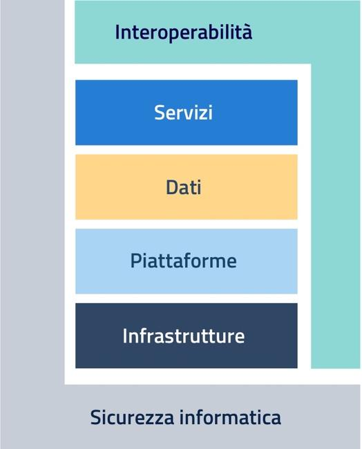

Executive Summary
=================

Il Piano Triennale per l’informatica della Pubblica Amministrazione (di
seguito Piano Triennale o Piano) è uno strumento essenziale per
promuovere la trasformazione digitale del Paese e, in particolare quella
della Pubblica Amministrazione italiana. Tale trasformazione deve
avvenire nel contesto del mercato unico europeo di beni e servizi
digitali, secondo una strategia che in tutta la UE si propone di
migliorare l'accesso *online* ai beni e servizi per i consumatori e le
imprese, e creare le condizioni favorevoli affinché le reti e i servizi
digitali possano svilupparsi per massimizzare il potenziale di crescita
dell'economia digitale europea. 

Per tale motivo, come già indicato dettagliatamente nelle edizioni
precedenti, gli obiettivi del Piano triennale sono basati sulle
indicazioni che emergono dalla nuova programmazione europea 2021-2027,
sui principi dell'\ *eGovernment Action Plan* 2016-2020 e sulle azioni
previste dalla *eGovernment Declaration* di Tallinn (2017-2021), i cui
indicatori misurano il livello di digitalizzazione in tutta l’UE e
rilevano l’effettiva presenza e l’uso dei servizi digitali da parte dei
cittadini e imprese. 

Come noto, l’Italia è caratterizzata da un’elevata decentralizzazione
amministrativa che fa sì che il ruolo delle PA regionali/locali sia
particolarmente rilevante nel processo di innovazione tecnologica.

Gli obiettivi del Piano sono pertanto pianificati affinché le azioni
attuative siano fortemente integrate ai diversi livelli della Pubblica
Amministrazione, fino agli enti locali – che sono caratterizzati da un
contesto di maggiore prossimità - per una più ampia diffusione della
cultura della trasformazione digitale che abbia immediati vantaggi per
cittadini e imprese.

Il Piano Triennale 2020-2022 è nella sua fase di consolidamento: alla
sua terza edizione ha visto una partecipazione attiva della Pubblica
Amministrazione locale, in linea con la strategia *bottom-up*
prefigurata nelle edizioni precedenti. Anche questa edizione, infatti, è
stata costruita con il coinvolgimento attivo e strutturato delle
pubbliche amministrazioni centrali e degli enti locali, che hanno
condiviso la redazione e discussione in bozza del presente documento.

La presente edizione, rappresenta la naturale evoluzione dei due Piani
precedenti: laddove la prima edizione poneva l’accento sull’introduzione
del Modello strategico dell’informatica nella PA e la seconda edizione
si proponeva di dettagliare l’implementazione del modello, questa
edizione si focalizza sulla realizzazione delle azioni previste, avendo
- nell’ultimo triennio - condiviso con le amministrazioni lo stesso
linguaggio, le stesse finalità e gli stessi riferimenti progettuali.

In questa prospettiva, pur ponendosi in continuità con il Piano
precedente, il Piano 2020-2022 introduce un’importante innovazione con
riferimento ai destinatari degli obiettivi individuati per ciascuna
delle tematiche affrontate. Saranno infatti le singole amministrazioni a
dover realizzare gli obiettivi elencati, obiettivi spesso “ambiziosi” ma
sostenibili poiché costruiti sull’esperienza, sul confronto e sulle
esigenze delle amministrazioni destinatarie. Si tratta di obiettivi di
ampio respiro declinati tuttavia in risultati molto concreti. L’elemento
innovativo di questo Piano sta proprio nel forte accento posto sulla
misurazione di tali risultati, introducendo così uno spunto di
riflessione e una guida operativa per tutte le amministrazioni: la
cultura della misurazione e conseguentemente della qualità dei dati
diventa uno dei motivi portanti di questo approccio. A completamento di
tale innovazione sono state introdotte le attività di monitoraggio
descritte nel cap. 8.

La rappresentazione semplificata del Modello strategico consente di
descrivere in maniera funzionale la trasformazione digitale. Tale
rappresentazione è costituita da due livelli trasversali:
l’interoperabilità e la sicurezza dei sistemi informativi e dei livelli
verticali di servizi, dati, piattaforme ed infrastrutture. 

   Modello strategico di evoluzione del sistema informativo della Pubblica Amministrazione

L’impianto generale vede il Piano organizzato in 9 capitoli, completati
da un *executive summary* e da un capitolo dedicato ai principi e
agli obiettivi strategici del Piano stesso. I primi sei capitoli
approfondiscono le componenti tecnologiche: servizi, dati, piattaforme,
infrastrutture, interoperabilità e sicurezza. 

I tre capitoli finali delineano gli strumenti di *governance* che nel
prossimo triennio saranno messi in campo anche per avviare azioni in
coerenza con la “Strategia per l’innovazione tecnologica e la
digitalizzazione del Paese 2025”:

-  il capitolo 7 inquadra i temi dell’innovazione, in termini di modelli
   e strumenti che avranno impatto sulla ricerca e sui territori,

-  Il capitolo 8 affronta i temi rilevanti per il governo della
   trasformazione digitale del Paese (ovvero le azioni condotte con e
   dai territori, il rafforzamento delle competenze digitali, il
   monitoraggio delle azioni),

-  ed infine – come nelle precedenti edizioni – l’ultimo capitolo è
   dedicato ad una sinossi delle azioni in carico alle amministrazioni.

I capitoli hanno la seguente struttura: 

-  L’\ **introduzione** descrive i temi affrontati nel capitolo fornendo
   un raccordo con il Piano precedente e con le azioni già realizzate; 

-  il **Contesto normativo e strategico** elenca i riferimenti sia
   normativi che strategici a cui le amministrazioni devono attenersi,
   in termini di fonti normative con *link* a documenti / siti ufficiali
   e riferimenti ad attività progettuali finanziate. Il riferimento
   diretto alle fonti e i *permalink* permettono una consultazione agile
   e aggiornata;

-  la sezione **Obiettivi e risultati attesi** elenca gli obiettivi
   prefissati, e, per ciascun obiettivo individua i risultati attesi
   (R.A.), che sono stati definiti in modo da essere sostenibili e
   misurabili con *target* possibilmente annuali.  L’individuazione dei
   risultati attesi fa riferimento a strumenti di misurazione
   disponibili/condivisi oppure a strumenti costruiti o da costruire
   sulla base di standard/modelli/metodi di misurazione conosciuti. La
   misurazione e il relativo monitoraggio dei risultati attesi è un
   compito di *governance* dell’intero Piano ed uno dei capitoli
   conclusivi sarà dedicato proprio ai temi del governo della
   trasformazione digitale;

-  la sezione **Cosa devono fare AGID, Dipartimento per la
   Trasformazione Digitale e altri soggetti istituzionali** esplicita
   la *roadmap* – per il triennio 2020-2022 – delle linee d’azione
   (attività) a carico di AGID, Dipartimento per la Trasformazione
   Digitale, e altri soggetti istituzionali per il conseguimento di
   ciascun obiettivo definito nel paragrafo precedente;

-  la sezione **Cosa devono fare le PA** descrive la *roadmap* delle
   attività a carico delle diverse PA, che scaturiscono dalla *roadmap*
   dei soggetti istituzionali sopra indicati o in continuità con quanto
   previsto dal precedente PT;

-  i **riferimenti alla Strategia per l’innovazione tecnologica e la
   digitalizzazione del Paese 2025** riassumono brevemente quali siano i
   collegamenti del Piano Triennale 2020-22 alla Strategia per
   l’innovazione tecnologica e la digitalizzazione del Paese 2025
   pubblicata dal Ministero dell’Innovazione all’inizio del 2020.

L’obiettivo di predisporre un documento snello di consultazione ha fatto
sì che alcune parti del Piano precedente, peraltro rilevanti, siano
state spostate in altri documenti a corredo del Piano. E’ stata
realizzata una collana editoriale del Piano al cui interno saranno
pubblicati, nel corso del 2020: il rapporto sulla spesa ICT delle PA, un
documento di dettaglio sul tema degli indicatori internazionali; un
documento con esempi applicativi e buone pratiche relativi ad obiettivi
e risultati attesi indicati.

Come già indicato nelle precedenti edizioni, si ribadisce che anche
questo Piano va visto come uno strumento dinamico, la cui efficacia
dipende dal coinvolgimento delle amministrazioni sia per la sua
evoluzione sia per la sua attuazione anche grazie ad uno scambio
costante e trasparente di informazioni tra tutti gli attori. Il Piano si
pone infatti come insieme di obiettivi di alto livello e di azioni che
le singole amministrazioni sono invitate a calare all’interno delle
proprie programmazioni operative rafforzandone la coerenza con
l’impianto dello stesso Piano Triennale. 

A conclusione di questo *executive summary*, sulla scorta dei
suggerimenti recepiti dalle Regioni e Province Autonome durante la
condivisione del documento in fase di elaborazione, si ritiene
importante sottolineare alcuni aspetti relativi alla situazione
emergenziale manifestatasi nel mese di marzo 2020: l’emergenza COVID 19
ha imposto alle Amministrazioni di procedere con celerità
all’attivazione delle procedure per lo *smart working* diffuso, che ha
coinvolto oltre il 75% dei dipendenti; il *lockdown* ha comportato per
il dipendente una nuova e repentina condizione di lavoro che ha fatto
emergere alcune criticità nell’uso degli strumenti tecnologici (in
precedenza non rilevabili data la possibilità di ottenere supporto
immediato in ufficio); e, in molti ambiti, ha evidenziato la necessità
di rivedere in modo profondo l’organizzazione dei processi, favorendo la
condivisione in rete di documenti e materiali di lavoro.

Parimenti, tale modalità ha favorito l’emergere di una sensibilità
culturale del dipendente verso nuovi paradigmi di “produttività”
rispetto al canonico concetto di “attestazione di presenza” della
pubblica amministrazione. In tal senso, rappresenta un rilevante
potenziale cambiamento culturale nelle relazioni Ente-dipendente.

Lo *smart working*, se considerato quale modalità di lavoro a regime
anche nella fase post-emergenza, potrebbe costituire un profondo
elemento di innovazione dell’Amministrazione, purché sostenuto da un
sistemico mutamento organizzativo e dall’evoluzione tecnologica dei
sistemi informativi del settore pubblico.

Si rende quindi quanto mai opportuno cogliere l’occasione del Piano
Triennale per avviare una nuova fase – mediata e facilitata dalle figure
dei Responsabili della Transizione al digitale - in cui il paradigma
lavorativo nella PA si possa invertire: è il processo analizzato e
rivisto a guidare l’informatizzazione la quale sarà, quindi, applicata
ad un contesto di cambiamento organizzativo, ottenendo da una parte un
effettivo risparmio e dall’altra generando fiducia nei sistemi
informatici e nelle tecnologie. Ciò permetterà, altresì, al sistema di
accogliere le nuove generazioni in un contesto adeguato ai tempi e
professionalmente appagante.
