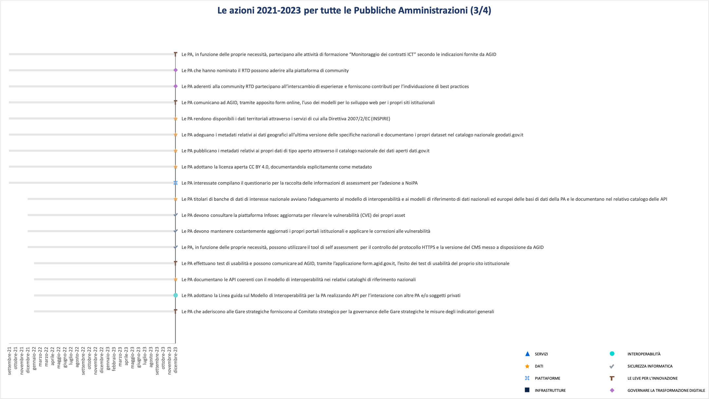

|image0|

Il Piano Triennale per l’informatica nella Pubblica Amministrazione è
frutto della stretta collaborazione tra l’Agenzia per l’Italia Digitale
e il Dipartimento per la Trasformazione Digitale.

Roma, Luglio 2020

Sommario

`PARTE I\ a - IL PIANO TRIENNALE 5 <#parte-ia---il-piano-triennale>`__

`Executive Summary 5 <#executive-summary>`__

`Strategia 9 <#strategia>`__

`Principi guida 9 <#principi-guida>`__

`PARTE II\ a – LE COMPONENTI TECNOLOGICHE
11 <#parte-iia-le-componenti-tecnologiche>`__

`CAPITOLO 1. Servizi 11 <#capitolo-1.-servizi>`__

`Contesto normativo e strategico
12 <#contesto-normativo-e-strategico>`__

`Obiettivi e risultati attesi 13 <#obiettivi-e-risultati-attesi>`__

`Cosa devono fare AGID, Dipartimento per la Trasformazione Digitale e
Consip
14 <#cosa-devono-fare-agid-dipartimento-per-la-trasformazione-digitale-e-consip>`__

`Cosa devono fare le PA 15 <#cosa-devono-fare-le-pa>`__

`I servizi pubblici digitali nella Strategia per l’innovazione
tecnologica e la digitalizzazione del Paese 2025
16 <#i-servizi-pubblici-digitali-nella-strategia-per-linnovazione-tecnologica-e-la-digitalizzazione-del-paese-2025>`__

`CAPITOLO 2. Dati 18 <#capitolo-2.-dati>`__

`Contesto normativo e strategico
18 <#contesto-normativo-e-strategico-1>`__

`Obiettivi e risultati attesi 19 <#obiettivi-e-risultati-attesi-1>`__

`Cosa devono fare AGID, Dipartimento per la Trasformazione Digitale e
titolari della banche dati di interesse nazionale
20 <#cosa-devono-fare-agid-dipartimento-per-la-trasformazione-digitale-e-titolari-della-banche-dati-di-interesse-nazionale>`__

`Cosa devono fare le PA 22 <#cosa-devono-fare-le-pa-1>`__

`La valorizzazione del patrimonio informativo pubblico nella Strategia
per l’innovazione tecnologica e la digitalizzazione del Paese 2025
23 <#la-valorizzazione-del-patrimonio-informativo-pubblico-nella-strategia-per-linnovazione-tecnologica-e-la-digitalizzazione-del-paese-2025>`__

`CAPITOLO 3. Piattaforme 24 <#capitolo-3.-piattaforme>`__

`Contesto normativo e strategico
25 <#contesto-normativo-e-strategico-2>`__

`Obiettivi e risultati attesi 27 <#obiettivi-e-risultati-attesi-2>`__

`Cosa devono fare AGID, Dipartimento per la Trasformazione Digitale e
altri soggetti istituzionali
29 <#cosa-devono-fare-agid-dipartimento-per-la-trasformazione-digitale-e-altri-soggetti-istituzionali>`__

`Cosa devono fare le PA 34 <#cosa-devono-fare-le-pa-2>`__

`Le Piattaforme nella Strategia per l’innovazione tecnologica e la
digitalizzazione del Paese 2025
35 <#le-piattaforme-nella-strategia-per-linnovazione-tecnologica-e-la-digitalizzazione-del-paese-2025>`__

`CAPITOLO 4. Infrastrutture 36 <#capitolo-4.-infrastrutture>`__

`Contesto normativo e strategico
37 <#contesto-normativo-e-strategico-3>`__

`Cosa devono fare AGID, Dipartimento per la Trasformazione Digitale e
Consip
38 <#cosa-devono-fare-agid-dipartimento-per-la-trasformazione-digitale-e-consip-1>`__

`Cosa devono fare le PA 39 <#cosa-devono-fare-le-pa-3>`__

`Le infrastrutture nella Strategia per l’innovazione tecnologica e la
digitalizzazione del Paese 2025
40 <#le-infrastrutture-nella-strategia-per-linnovazione-tecnologica-e-la-digitalizzazione-del-paese-2025>`__

`CAPITOLO 5. Interoperabilità 41 <#capitolo-5.-interoperabilità>`__

`Contesto normativo e strategico
41 <#contesto-normativo-e-strategico-4>`__

`Obiettivi e risultati attesi 42 <#obiettivi-e-risultati-attesi-3>`__

`Cosa devono fare AGID, Dipartimento per la Trasformazione Digitale
42 <#cosa-devono-fare-agid-dipartimento-per-la-trasformazione-digitale>`__

`Cosa devono fare le PA 43 <#cosa-devono-fare-le-pa-4>`__

`Le infrastrutture nella Strategia per l’innovazione tecnologica e la
digitalizzazione del Paese 2025
44 <#le-infrastrutture-nella-strategia-per-linnovazione-tecnologica-e-la-digitalizzazione-del-paese-2025-1>`__

`CAPITOLO 6. Sicurezza informatica
45 <#capitolo-6.-sicurezza-informatica>`__

`Contesto normativo e strategico
45 <#contesto-normativo-e-strategico-5>`__

`Obiettivi e risultati attesi 46 <#obiettivi-e-risultati-attesi-4>`__

`Cosa devono fare AGID e Dipartimento per la Trasformazione Digitale
46 <#cosa-devono-fare-agid-e-dipartimento-per-la-trasformazione-digitale>`__

`Cosa devono fare le PA 47 <#cosa-devono-fare-le-pa-5>`__

`La sicurezza informatica nella Strategia per l’innovazione tecnologica
e la digitalizzazione del Paese 2025
47 <#la-sicurezza-informatica-nella-strategia-per-linnovazione-tecnologica-e-la-digitalizzazione-del-paese-2025>`__

`PARTE III\ a - La governance 48 <#parte-iiia---la-governance>`__

`CAPITOLO 7. Strumenti e modelli per l’innovazione
48 <#capitolo-7.-strumenti-e-modelli-per-linnovazione>`__

`Contesto normativo e strategico 49 <#_2u6wntf>`__

`Obiettivi 50 <#obiettivi>`__

`Cosa devono fare AGID, Dipartimento per la Trasformazione Digitale e
altri soggetti istituzionali
51 <#cosa-devono-fare-agid-dipartimento-per-la-trasformazione-digitale-e-altri-soggetti-istituzionali-1>`__

`Cosa devono fare le PA 51 <#cosa-devono-fare-le-pa-6>`__

`L’innovazione per una Smarter Nation nella Strategia per l’innovazione
tecnologica e la digitalizzazione del Paese 2025
52 <#linnovazione-per-una-smarter-nation-nella-strategia-per-linnovazione-tecnologica-e-la-digitalizzazione-del-paese-2025>`__

`CAPITOLO 8. Governare la trasformazione digitale
53 <#capitolo-8.-governare-la-trasformazione-digitale>`__

`Le leve per l’innovazione delle PA e dei territori
53 <#le-leve-per-linnovazione-delle-pa-e-dei-territori>`__

`Le competenze digitali per la PA e per il Paese e l’inclusione digitale
56 <#le-competenze-digitali-per-la-pa-e-per-il-paese-e-linclusione-digitale>`__

`Gli strumenti per migliorare i processi di trasformazione digitale e di
innovazione della PA
57 <#gli-strumenti-per-migliorare-i-processi-di-trasformazione-digitale-e-di-innovazione-della-pa>`__

`Contesto normativo e strategico
59 <#contesto-normativo-e-strategico-6>`__

`Le leve per l’innovazione delle PA e dei territori
59 <#le-leve-per-linnovazione-delle-pa-e-dei-territori-1>`__

`Le competenze digitali per la PA e per il Paese e l’inclusione digitale
60 <#le-competenze-digitali-per-la-pa-e-per-il-paese-e-linclusione-digitale-1>`__

`Gli strumenti per migliorare i processi di trasformazione digitale e di
innovazione della PA
60 <#gli-strumenti-per-migliorare-i-processi-di-trasformazione-digitale-e-di-innovazione-della-pa-1>`__

`Obiettivi e risultati attesi 60 <#obiettivi-e-risultati-attesi-5>`__

`Cosa devono fare AGID, Dipartimento per la Trasformazione Digitale e
altri soggetti istituzionali
63 <#cosa-devono-fare-agid-dipartimento-per-la-trasformazione-digitale-e-altri-soggetti-istituzionali-2>`__

`Cosa devono fare le PA 67 <#cosa-devono-fare-le-pa-7>`__

`La governance della trasformazione digitale nella Strategia per
l’innovazione tecnologica e la digitalizzazione del Paese 2025
69 <#la-governance-della-trasformazione-digitale-nella-strategia-per-linnovazione-tecnologica-e-la-digitalizzazione-del-paese-2025>`__

`CAPITOLO 9. Indicazioni per le PA
71 <#capitolo-9.-indicazioni-per-le-pa>`__

`Ringraziamenti 74 <#ringraziamenti>`__

`APPENDICE 1. Acronimi 77 <#appendice-1.-acronimi>`__

.. toctree::
  :maxdepth: 3
  :caption: Indice dei contenuti

  parte-ia---il-piano-triennale.rst
  executive-summary.rst
  strategia.rst
  principi-guida.rst
  parte-iia-le-componenti-tecnologiche.rst
  capitolo-1.-servizi.rst
  capitolo-2.-dati.rst
  capitolo-3.-piattaforme.rst
  capitolo-4.-infrastrutture.rst
  capitolo-5.-interoperabilità.rst
  capitolo-6.-sicurezza-informatica.rst
  parte-iiia---la-governance.rst
  capitolo-7.-strumenti-e-modelli-per-linnovazione.rst
  capitolo-8.-governare-la-trasformazione-digitale.rst
  capitolo-9.-indicazioni-per-le-pa.rst
  ringraziamenti.rst
  appendice-1.-acronimi.rst

