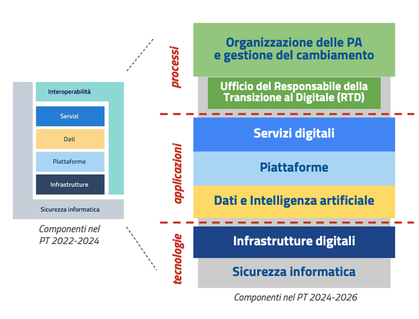

Modello strategico
==================

Il modello strategico del Piano triennale 2024-26 definisce una
architettura organizzativa e tecnologica che ha l'obiettivo di
supportare la collaborazione tra i livelli istituzionali, nel rispetto
dell'autonomia degli stessi enti, come previsto anche dall'art. 14 del
Decreto legislativo 7 marzo 2005, n. 82 (CAD) sui rapporti tra Stato,
Regioni e autonomie locali.

Art. 14 - Rapporti tra Stato, Regioni e autonomie locali

*1.* In attuazione del disposto dell'articolo 117, secondo comma,
lettera r), della Costituzione, lo Stato disciplina il coordinamento
informatico dei dati dell'amministrazione statale, regionale e locale,
dettando anche le regole tecniche necessarie per garantire la sicurezza
e l'interoperabilità dei sistemi informatici e dei flussi informativi
per la circolazione e lo scambio dei dati e per l'accesso ai servizi
erogati in rete dalle amministrazioni medesime.

2. Lo Stato, le regioni e le autonomie locali promuovono le intese e gli
accordi e adottano, attraverso la Conferenza unificata, gli indirizzi
utili per realizzare gli obiettivi dell'Agenda digitale europea e
nazionale e realizzare un processo di digitalizzazione dell'azione
amministrativa coordinato e condiviso e per l'individuazione delle Linee
guida.

La Presidenza del Consiglio dei Ministri, anche avvalendosi dell'AGID,
assicura il coordinamento informatico dell'amministrazione statale,
regionale e locale, con la finalità di progettare e monitorare
l'evoluzione strategica del sistema informativo della Pubblica
Amministrazione, favorendo l'adozione di infrastrutture e standard che
riducano i costi sostenuti dalle amministrazioni e migliorino i servizi
erogati (..).

2-bis. Le regioni promuovono sul territorio azioni tese a realizzare un
processo di digitalizzazione dell'azione amministrativa coordinato e
condiviso tra le autonomie locali.

2-ter. Le regioni e gli enti locali digitalizzano la loro azione
amministrativa e implementano l'utilizzo delle tecnologie
dell'informazione e della comunicazione per garantire servizi migliori
ai cittadini e alle imprese, secondo le modalità di cui al comma 2.

In una logica di miglioramento continuo, il modello strategico del Piano
triennale 2024-26 propone una architettura organizzativa e tecnologica
che ha l'obiettivo di fornire una visione complessiva della Pubblica
Amministrazione digitale che parte dal "sistema informativo" del singolo
ente per arrivare a definire le relazioni con i servizi, le piattaforme
e le infrastrutture nazionali erogate a livello centrale.

Il modello strategico del Piano triennale 2024-26 classifica le sfide
organizzative e tecnologiche che le amministrazioni devono affrontare in
tre macroaree:

-  processi

-  applicazioni

-  tecnologie

Tale modello ha l'obiettivo di indirizzare le sfide legate sia al
funzionamento del sistema informativo di un singolo organismo pubblico,
sia al funzionamento del sistema informativo pubblico complessivo
dell'intero Paese, nell'ottica del principio *cloud-first* e di una
architettura policentrica e federata.

         l'Informatica 2024-2026. Il modello strategico è articolato in 3 macro
         aree: processi, applicazioni e tecnologie. Nella macro area processi si
         fa riferimento a tutte le attività di organizzazione e gestone del
         cambiamento della PA, sottolineando il ruolo del Responsabile della
         transizione digitale. La macro area applicazioni è strutturata in tre
         livelli: servizi digitali, piattaforme e dati e intelligenza
         artificiale. La macroarea tecnologie è costituita dai livelli
         infrastrutture digitali e sicurezza informatica.

   Modello strategico del Piano triennale 2024-26

Per ogni livello dell'architettura è necessario tracciare, a partire dal
Piano triennale, strumenti, regole tecniche e traiettorie evolutive
pluriennali, che permettano una pianificazione degli investimenti su un
piano istituzionale multilivello, a valere su molteplici fonti di
finanziamento.

In questo contesto assume fondamentale rilevanza il Piano integrato di
attività e organizzazione (PIAO), introdotto dall'art. 6 del
Decreto-legge 80/2021 al fine di "*assicurare la qualità e la
trasparenza dell'attività amministrativa e migliorare la qualità dei
servizi ai cittadini e alle imprese e procedere alla costante e
progressiva semplificazione e reingegnerizzazione dei processi
(...)*". Il PIAO implementa quella che il CAD definisce all'art.15
come una "riorganizzazione strutturale e gestionale", per sfruttare le
opportunità offerte dal digitale.

Seguendo tale impostazione, i singoli enti pubblici individuano i propri
specifici obiettivi di digitalizzazione, semplificazione e
reingegnerizzazione all'interno del PIAO, come previsto dal DM 24 giugno
2022, che ormai integra la maggior parte delle forme di pianificazione
delle PA su prospettiva triennale.
