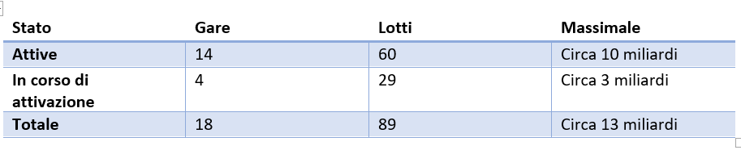
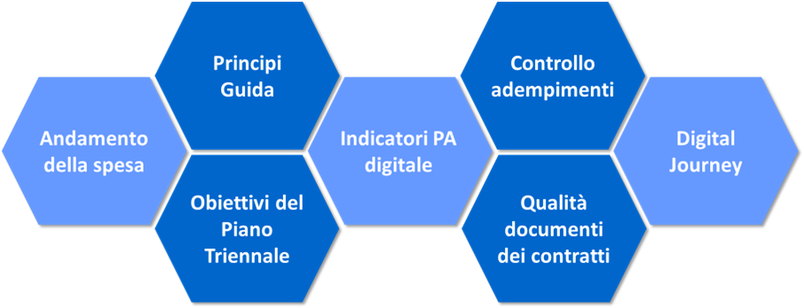
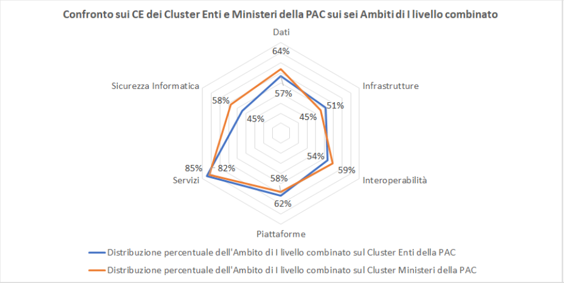
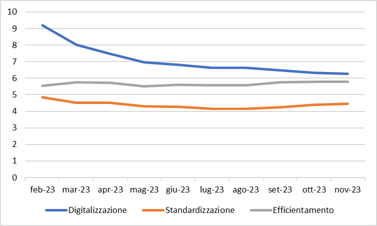

1. Strumento 1 - Approvvigionamento ICT
=======================================

Definire contratti coerenti con gli obiettivi del Piano triennale
attraverso il Piano delle Gare strategiche Consip

*Versione 1.0 del 21/12/2023*

-  Obiettivo

   Il documento fornisce indicazioni operative per la definizione di
   contratti di approvvigionamento ICT coerenti con gli obiettivi del Piano
   triennale attraverso gli strumenti di acquisto di Consip.

-  Destinatari

   Tutte le pubbliche amministrazioni.

-  Crediti

   Il documento è stato redatto in collaborazione con Consip.

1.1. Gli Accordi quadro Consip e gli indicatori di digitalizzazione
-------------------------------------------------------------------

Le iniziative strategiche ICT sono realizzate attraverso appalti
aggiudicati da Consip nella forma dell'Accordo quadro, che consentono a
tutte le Amministrazioni di acquistare rapidamente i servizi necessari
per attuare il percorso di transizione al digitale secondo il paradigma
dell'ordine diretto, ove l'Amministrazione non abbia esigenze
progettuali peculiari ovvero attraverso lo strumento dell'appalto
specifico tra i fornitori selezionati da Consip, con garanzie di qualità
e prezzi vantaggiosi.

In particolare, le Amministrazioni possono accedere, ad oggi, a un piano
molto ricco di gare strategiche che nell'ultimo anno è stato ampliato
con le seconde edizioni di alcune iniziative sulla base dell'andamento
di adesione registrato per le prime edizioni (Figura 4).

         colonna è individuato lo stato delle gare (attive o in corso di
         attivazione), nella seconda il numero delle gare (14 attive e 4 in
         corso di attivazione), la terza colonna individua il numero dei lotti
         di gara (60 su gare attive e 29 su quelle in corso di attivazione) e la
         quarta colonna descrive il massimale economico delle gare strategiche
         (circa 10 miliardi per le gare attive, circa 3 miliardi per quelle in
         attivazione). L'ultima riga della tabella mostra i totali.

   Stato del Piano delle gare strategiche

Le gare attive possono essere raggruppate, a loro volta, in macroaree di
servizi e di seguito è mostrata la distribuzione dei massimali per
ciascuna macroarea.

.. figure:: ../media/figura_5.png
   :name: massimali-macroaree-servizio
   :alt: La figura 5 illustra in un grafico la distribuzione dei massimali per
         le aree dei servizi sui quali si concentrano le gare strategiche. Le
         aree sono Sicurezza (massimale di 1159,50 Milioni di euro), Servizi
         applicativi Cloud (massimale di 5.291,82 Milioni di euro), Sanità
         digitale (massimale di 2.340,00 Milioni di euro), Public Cloud Saas
         (massimale di 658,00 Milioni di euro), Public Cloud Iaas e Paas
         (massimale di 1.287,80 Milioni di euro), Digital Transformation
         (massimale di 795,64 Milioni di euro), Data Management (massimale di
         1.429, 38 Milioni di euro).

   Distribuzione massimali per le macroaree di servizio

Come evidente, l'insieme delle gare strategiche fornisce, quindi, un set
articolato di strumenti per supportare una Pubblica Amministrazione nel
compiere il suo *Digital Journey*, ossia un percorso completo di
attuazione di una trasformazione digitale a partire dalla definizione
della strategia fino alla attuazione attraverso risorse
infrastrutturali, di dati ed applicative (Figura 6).

         completo.

   Cluster di progetti su più gare strategiche per un percorso digitale completo

Le attività di monitoraggio condotte da AGID hanno consentito
l'individuazione, nell'ultimo anno, di più di 20 *Digital Journey*
attraverso la stipula di più di 100 contratti esecutivi.

AGID, inoltre, attraverso i Comitati tecnici, previsti nell'ambito dei
compiti di *governance* degli Organismi di coordinamento e controllo di
cui fa parte, ha avviato delle azioni congiunte con gli aggiudicatari
degli accordi quadro e con le amministrazioni contraenti, finalizzate
alla rilevazione sempre più accurata di elementi indispensabili alla
misurazione della crescita digitale del Paese.

Le Amministrazioni hanno, quindi, attraverso il piano delle gare
strategiche, l'opportunità di definire contratti coerenti con gli
obiettivi del Piano triennale attraverso un modello ben definito di
indicatori di digitalizzazione e di categorie che sono, nell'ambito
delle attività di monitoraggio, oggetto di rilevazione e contribuiscono
alla misurazione dell'incremento del livello di trasformazione digitale
mediante l'utilizzo dei servizi previsti dalle stesse gare strategiche.

Si riportano, in figura 7 gli elementi principali di monitoraggio di
AGID nelle gare strategiche:

         gare strategiche. Il primo elemento rappresentato è andamento della
         spesa, il secondo sono i principi guida e gli obiettivi del Piano
         Triennale, il terzo sono gli indicatori di Pa digitale, il quarto
         rappresenta il controllo adempimenti e qualità dei documenti
         contrattuali e il Digital Journey.

   Gli elementi di monitoraggio di AGID

Il monitoraggio condotto da AGID garantisce quindi alle Amministrazioni
un indirizzo chiaro per l'allineamento alla strategia di crescita
digitale del Paese attraverso l'aderenza ai principali obiettivi del
Piano triennale che devono essere indirizzati all'atto della stipula dei
contratti esecutivi all'interno di ciascun accordo quadro e che sono,
come detto, oggetto di rilevazione e di successive elaborazioni ed
aggregazioni mirate a fornire una misura della digitalizzazione del
Paese.

AGID, nell'ambito del proprio ruolo istituzionale, ha monitorato, a
diversi livelli di aggregazione, in che modo e con quale efficacia il
ricorso alle iniziative strategiche stiano contribuendo al
raggiungimento degli obiettivi del Piano Triennale. Tale analisi è stata
svolta utilizzando i dati estrapolati dai Contratti Esecutivi stipulati
dalle Amministrazioni e mappando:

-  il raggiungimento attraverso l'adesione degli obiettivi di Piano
   Triennale riferiti al Piano triennale per l'Informatica 2020-2022,
   secondo una macro-classificazione in sei ambiti (Servizi, dati,
   piattaforme, infrastrutture, interoperabilità e Sicurezza);

-  il raggiungimento attraverso l'adesione degli obiettivi di Piano
   triennale riferiti al Piano triennale per l'Informatica 2020-2022,
   secondo una classificazione in sotto ambiti di specificazione;

-  la realizzazione dei principi guida, attraverso l'adesione, del Piano
   triennale per l'Informatica 2020-2022;

-  gli Indicatori Generali di Digitalizzazione (IGD) definiti nelle gare
   strategiche.

Per classificare le Amministrazioni contraenti e creare dei *cluster* di
tipologia di pubbliche amministrazioni è stata utilizzata la
classificazione ISTAT che prevede il raggruppamento di PAC e PAL per
tipologia, quali:

-  le PAC sono state aggregate in: Ministeri, Organi Costituzionali,
   Autorità indipendenti, Enti (Enti di Ricerca, Enti Assistenziali e
   Previdenziali, Agenzie nazionali, organizzazioni quali Cassa Depositi
   e Prestiti, Pago PA SPA, Invitalia, ecc.), società ICT in house;

-  le PAL sono state aggregate in: Regioni e Province Autonome, Comuni e
   Province, Sanità, Università e Ricerca, società ICT in house.

Di seguito vengono presentati esempi dell'analisi effettuata che danno
un'idea di quanto lo strumento delle iniziative strategiche stia
aiutando la trasformazione digitale delle PA e gli ambiti ove ciò sia
più significativo. I dati presentati nel seguito rappresentano lo stato
dell'arte a settembre 2023.

         dell'ambito sicurezza informatica rispetto alle diverse
         tipologie-cluster di pubblica amministrazione. Per il cluster Ministeri
         il l'obiettivo sicurezza è perseguito dal 58% delle PA, per gli Organi
         costituzionali dal 57%, per le Università e Regioni e Province autonome
         dal 57%, per le Autorità indipendenti dal 56%, per le società ICT in
         House dal 49%, per Enti e Comuni e Province dal 45%, per la Sanità dal
         43% e per le altre Pa locali dal 41%.

   Obiettivo sicurezza per ciascun cluster di PAC

         ambiti (Dati, Infrastrutture, Interoperabilità, Piattaforme, Servizi e
         Sicurezza informatica) da parte delle amministrazioni centrali e in
         dettaglio dai Ministeri. Più dell'80% delle PAC dichiara di utilizzare
         le iniziative strategiche nell'ambito dei servizi. Quasi il 60% dei
         Ministeri, contro il 45% del resto delle PAC dichiara di
         approvvigionarsi nell'ambito della sicurezza informatica.

   Ambiti di primo livello e PAC

         macro ambiti (Dati, Infrastrutture, Interoperabilità, Piattaforme,
         Servizi e Sicurezza informatica) da parte delle amministrazioni locali,
         divise per aree Nord, Centro e Sud-Isole. Oltre l'80% di tutte le PAL
         dichiara di utilizzare le iniziative strategiche nell'ambito dei
         servizi. Sugli altri ambiti c'è una maggiore variabilità tra i tre
         ambiti geografici, con percentuali che spaziano dal 40 al 75% nei
         diversi ambiti.

   Ambiti di primo livello e PAL

         contratti che afferiscono in ordine crescente alle seguenti
         piattaforme: INAD, Beni culturali, Siope+, NoiPa, Sanità digitale,
         ANPR, App Io, Pagamenti digitali, Identità digitale. Si rileva che il
         31% dei contratti afferiscono all'ambito delle identità digitali.

   Percentuale di contratti che afferiscono alla realizzazione della piattaforma

1.1.1. L'Indicatore di incremento del livello di trasformazione digitale mediante i servizi previsti dalle Gare strategiche (R.A.7.1b - PT 2022-24)
~~~~~~~~~~~~~~~~~~~~~~~~~~~~~~~~~~~~~~~~~~~~~~~~~~~~~~~~~~~~~~~~~~~~~~~~~~~~~~~~~~~~~~~~~~~~~~~~~~~~~~~~~~~~~~~~~~~~~~~~~~~~~~~~~~~~~~~~~~~~~~~~~~~

Rispetto agli obiettivi del Piano Triennale 2022-2024, l'indicatore
**R.A.7.1b** **"Incremento del livello di trasformazione digitale
mediante l'utilizzo dei servizi previsti dalle Gare strategiche"**, è
parte del sistema di monitoraggio AGID dei risultati attesi, appartiene
all'obiettivo "7.1 - Rafforzare le leve per l'innovazione delle PA e dei
territori" e intende rappresentare un'indicazione sul livello di
efficacia degli interventi di digitalizzazione operati dalle PA
attraverso l'utilizzo delle Gare strategiche.

Il modello di calcolo del R.A.7.1b è stato costruito a partire da nove
indicatori generali di digitalizzazione comuni a tutte le iniziative del
programma delle gare strategiche, i quali, a loro volta, sono stati
opportunamente pesati e classificati ed il valore dell'indicatore è
dimensionato per variare su una scala da 0 a 10.

I nove indicatori generali di digitalizzazione sono, infatti,
classificati nei seguenti tre sub-indicatori:

1. **Digitalizzazione:** cui afferiscono gli Indicatori che
   contribuiscono in maniera diretta alla digitalizzazione;

2. **Standardizzazione:** cui afferiscono gli Indicatori propedeutici
   alla digitalizzazione;

3. **Efficientamento:** cui afferiscono gli Indicatori che rappresentano
   i benefici del processo di trasformazione digitale.

Nella seguente tabella (tabella 2) si illustra, nel dettaglio,
l'associazione dei nove indicatori generali di digitalizzazione ai
suddetti tre sub-indicatori e il peso di quest'ultimi nel calcolo del
valore complessivo dell'indicatore R.A.7.1b.

+---------------------------------------------------------------------------------------------------------------------------------------------+-------------------+---------------------+
| Indicatori generali di digitalizzazione delle gare strategiche                                                                              | Sub-indicatori    | Peso attribuito (%) |
+=============================================================================================================================================+===================+=====================+
| Numero servizi aggiuntivi offerti all"utenza interna, esterna (cittadini), esterna (imprese), altre PA.                                     | Digitalizzazione  | 60%                 |
+---------------------------------------------------------------------------------------------------------------------------------------------+-------------------+---------------------+
| Obiettivi CAD raggiunti con l"intervento                                                                                                    | Digitalizzazione  | 60%                 |
+---------------------------------------------------------------------------------------------------------------------------------------------+-------------------+---------------------+
| Integrazione con infrastrutture immateriali                                                                                                 | Digitalizzazione  | 60%                 |
+---------------------------------------------------------------------------------------------------------------------------------------------+-------------------+---------------------+
| Integrazione con Basi Dati di interesse nazionale                                                                                           | Standardizzazione | 30%                 |
+---------------------------------------------------------------------------------------------------------------------------------------------+-------------------+---------------------+
| Riuso di processi per erogazione servizi                                                                                                    | Standardizzazione | 30%                 |
+---------------------------------------------------------------------------------------------------------------------------------------------+-------------------+---------------------+
| Riuso soluzioni tecniche                                                                                                                    | Standardizzazione | 30%                 |
+---------------------------------------------------------------------------------------------------------------------------------------------+-------------------+---------------------+
| Collaborazione con altre Amministrazioni (progetto in coworking, realizzato anche mediante contratti esecutivi diversi per Amministrazione) | Standardizzazione | 30%                 |
+---------------------------------------------------------------------------------------------------------------------------------------------+-------------------+---------------------+
| Riduzione % della spesa per l"erogazione del servizio                                                                                       | Efficientamento   | 10%                 |
+---------------------------------------------------------------------------------------------------------------------------------------------+-------------------+---------------------+
| Riduzione % dei tempi di erogazione del servizio                                                                                            | Efficientamento   | 10%                 |
+---------------------------------------------------------------------------------------------------------------------------------------------+-------------------+---------------------+

*Tabella 2 - Indicatori generali di digitalizzazione delle
gare strategiche, sub-indicatori e peso nel calcolo dell'indicatore R.A.7.1b*

Il valore rilevato per l'indicatore R.A.7.1b è, a novembre 2023, pari a
1. Nel periodo di osservazione, che decorre dalla data di avvio della
misurazione di questo indicatore, si osserva un andamento inizialmente
in calo del valore del R.A.7.1b, dovuto essenzialmente alla concomitante
riduzione del sub-indicatore "Digitalizzazione", per poi stabilizzarsi
intorno al valore 6.

Il fenomeno può essere conseguenza di varie cause come, ad esempio, gli
insiemi di gare/lotti che mutano nel tempo secondo le attivazioni ed il
conseguente ciclo di monitoraggio o, più verosimilmente, per i possibili
effetti dovuti all'opera di sensibilizzazione di AGID verso le PA che ha
portato le stesse ad una valorizzazione più diffusa e accurata degli
indicatori.

         del PT 2022-2024 - RA 7.1.b. "Incremento del livello di trasformazione
         digitale mediante l'utilizzo dei servizi previsti dalle Gare
         strategiche". Il valore, a partire da giugno 2023 si è attestato
         intorno al valore 6 (su un valore massimo pari a 10), con minime
         oscillazioni, rappresentando un andamento positivo.

   Andamento storico dell'indicatore R.A.7.1.b

         dell'indicatore del PT 2022-2024 - R.A.7.1.b. distribuito per ognuno
         dei sub-indicatori (Digitalizzazione, Standardizzazione,
         Efficientamento). Il subindicatore di digitalizzazione ha un andamento
         simile a quello rappresentato in figura 12, per l'indicatore nel suo
         complesso. Per gli altri subindicatori si riporta un valore stabile nel
         tempo intorno al 6 (su un massimo pari a 10).

   Andamento storico dei sub indicatori

1.2. Gli strumenti Consip
-------------------------

Nel seguito si fornisce una vista sintetica delle iniziative attive, che
contribuiscono alla realizzazione degli obiettivi del Piano Triennale, a
disposizione delle Amministrazioni e utilizzabili in alcuni casi anche
con fondi PNRR.

+-------------------------------------------------------+--------------------------------------------------------------------+----------------------------------------------------+-----------------+-----------------------------+
| Capitolo del Piano Triennale 2024-2026 di riferimento | Strumento Consip di acquisizione                                   | Modalità di acquisto                               | Gara strategica | Utilizzabile con fondi PNRR |
+=======================================================+====================================================================+====================================================+=================+=============================+
| Cap. 3 - Servizi                                      | Digital Transformation                                             | Ordine diretto                                     | SI              | SI                          |
+-------------------------------------------------------+--------------------------------------------------------------------+----------------------------------------------------+-----------------+-----------------------------+
| Cap. 3 - Servizi                                      | Sanità digitale-SICA                                               | | Appalto specifico                                | SI              | SI                          |
|                                                       |                                                                    | | Ordine diretto                                   |                 |                             |
+-------------------------------------------------------+--------------------------------------------------------------------+----------------------------------------------------+-----------------+-----------------------------+
| Cap. 3 - Servizi                                      | Sanità digitale- SISSC                                             | | Appalto specifico                                | SI              | SI                          |
|                                                       |                                                                    | | Ordine diretto                                   |                 |                             |
+-------------------------------------------------------+--------------------------------------------------------------------+----------------------------------------------------+-----------------+-----------------------------+
| Cap. 3 - Servizi                                      | Sanità digitale- SIG                                               | | Appalto specifico                                | SI              | SI                          |
|                                                       |                                                                    | | Ordine diretto                                   |                 |                             |
+-------------------------------------------------------+--------------------------------------------------------------------+----------------------------------------------------+-----------------+-----------------------------+
| | Cap. 3 - Servizi                                    | Data Management                                                    | Ordine diretto                                     | SI              | SI                          |
| | Cap. 5 - Dati e intelligenza artificiale            |                                                                    |                                                    |                 |                             |
| | Cap. 4 - Piattaforme                                |                                                                    |                                                    |                 |                             |
+-------------------------------------------------------+--------------------------------------------------------------------+----------------------------------------------------+-----------------+-----------------------------+
| | Cap. 3 - Servizi                                    | Servizi applicativi Cloud                                          | Ordine diretto                                     | SI              | SI                          |
| | Cap. 4 - Piattaforme                                |                                                                    |                                                    |                 |                             |
+-------------------------------------------------------+--------------------------------------------------------------------+----------------------------------------------------+-----------------+-----------------------------+
| | Cap. 3 - Servizi                                    | Cloud Enabling                                                     | Ordine diretto                                     | SI              | SI                          |
| | Cap. 6 - Infrastrutture                             |                                                                    |                                                    |                 |                             |
+-------------------------------------------------------+--------------------------------------------------------------------+----------------------------------------------------+-----------------+-----------------------------+
| Cap. 6 - Infrastrutture                               | Public Cloud IaaS e PaaS                                           | | Appalto specifico                                | SI              | SI (Lotti 2-11)             |
|                                                       |                                                                    | | Ordine diretto                                   |                 |                             |
+-------------------------------------------------------+--------------------------------------------------------------------+----------------------------------------------------+-----------------+-----------------------------+
| Cap. 6 - Infrastrutture                               | S_RIPA                                                             | Ordine diretto                                     | SI              | NO                          |
+-------------------------------------------------------+--------------------------------------------------------------------+----------------------------------------------------+-----------------+-----------------------------+
| Cap. 6 - Infrastrutture                               | Licenze Software Multibrand                                        | Ordine diretto                                     | NO              | SI                          |
+-------------------------------------------------------+--------------------------------------------------------------------+----------------------------------------------------+-----------------+-----------------------------+
| Cap. 6 - Infrastrutture                               | Microsoft Enterprise Agreement                                     | Ordine diretto                                     | NO              | SI                          |
+-------------------------------------------------------+--------------------------------------------------------------------+----------------------------------------------------+-----------------+-----------------------------+
| Cap. 6 - Infrastrutture                               | Public Cloud SaaS - B.I.                                           | | Appalto specifico                                | SI              | SI                          |
|                                                       |                                                                    | | Ordine diretto                                   |                 |                             |
+-------------------------------------------------------+--------------------------------------------------------------------+----------------------------------------------------+-----------------+-----------------------------+
| Cap. 6 - Infrastrutture                               | Public Cloud  SaaS - Pr.In.Co.                                     | | Appalto specifico                                | SI              | SI                          |
|                                                       |                                                                    | | Ordine diretto                                   |                 |                             |
+-------------------------------------------------------+--------------------------------------------------------------------+----------------------------------------------------+-----------------+-----------------------------+
| Cap. 6 - Infrastrutture                               | Public Cloud SaaS - CRM                                            | | Appalto specifico                                | SI              | SI                          |
|                                                       |                                                                    | | Ordine diretto                                   |                 |                             |
+-------------------------------------------------------+--------------------------------------------------------------------+----------------------------------------------------+-----------------+-----------------------------+
| Cap. 6 - Infrastrutture                               | Public Cloud SaaS - IT Service Management                          | | Appalto specifico                                | SI              | SI                          |
|                                                       |                                                                    | | Ordine diretto                                   |                 |                             |
+-------------------------------------------------------+--------------------------------------------------------------------+----------------------------------------------------+-----------------+-----------------------------+
| Cap. 6 - Infrastrutture                               | SPC Connettività                                                   | Ordine diretto                                     | SI              | NO                          |
+-------------------------------------------------------+--------------------------------------------------------------------+----------------------------------------------------+-----------------+-----------------------------+
| Cap. 6 - Infrastrutture                               | Servizi PEC e REM-IT                                               | Ordine diretto                                     | NO              | NO                          |
+-------------------------------------------------------+--------------------------------------------------------------------+----------------------------------------------------+-----------------+-----------------------------+
| Cap. 7 - Sicurezza informatica                        | Sicurezza da remoto                                                | Ordine diretto                                     | SI              | SI                          |
+-------------------------------------------------------+--------------------------------------------------------------------+----------------------------------------------------+-----------------+-----------------------------+
| Cap. 7 - Sicurezza informatica                        | Sicurezza on premise - gestione e protezione                       | Appalto specifico                                  | SI              | SI                          |
+-------------------------------------------------------+--------------------------------------------------------------------+----------------------------------------------------+-----------------+-----------------------------+
| Cap. 7 - Sicurezza informatica                        | Sicurezza on premise - Protezione Perimetrale, endpoint e anti-APT | Ordine diretto (con/senza valutazione preliminare) | SI              | SI                          |
+-------------------------------------------------------+--------------------------------------------------------------------+----------------------------------------------------+-----------------+-----------------------------+

*Tabella 3 - Strumenti Consip di acquisizione*

1.3. Descrizione sintetica degli strumenti Consip
-------------------------------------------------

1.3.1. Servizi applicativi IT
~~~~~~~~~~~~~~~~~~~~~~~~~~~~~

Accordo quadro dedicato allo sviluppo software e ai servizi correlati,
nello specifico comprende:

-  *Sviluppo, Manutenzione evolutiva, adeguativa e migliorativa* di
   software ad hoc;

-  *Personalizzazione e parametrizzazione* di soluzioni commerciali o di
   software open source o di software in riuso;

-  Servizi di *Gestione del portafoglio applicativo*, in particolare
   gestione applicativi e basi dati, gestione dei contenuti di siti web,
   manutenzione correttiva;

-  *Servizi Tecnico-Specialistici*, consistenti in
   progetti/attività/studi di natura ICT e di livello specialistico);

-  *Servizi accessori* (ad es. servizio assistenza in remoto,
   formazione, etc).

1.3.2. Digital Transformation
~~~~~~~~~~~~~~~~~~~~~~~~~~~~~

Accordo Quadro che rende disponibili servizi di indirizzo della
trasformazione digitale e della sua adozione, nei seguenti ambiti:

-  *Strategia della Trasformazione Digitale:* attraverso i servizi di
   disegno strategia digitale, di definizione del Piano Strategico ICT e
   di disegno mappa dei servizi digitali della PA;

-  *Digitalizzazione dei processi:* attraverso i servizi di disegno del
   modello di erogazione del servizio digitale, disegno di processi
   digitali, supporto specialistico per l'implementazione di servizi
   digitali;

-  *Gestione della Transizione al Digitale:* attraverso i servizi di
   *change management* dedicati alla Progettazione della transizione al
   digitale e all'affiancamento alla transizione digitale;

-  *PMO.*

1.3.3. Sanità digitale - SICA
~~~~~~~~~~~~~~~~~~~~~~~~~~~~~

Accordo Quadro dedicato ai sistemi informativi clinico assistenziali,
che rende disponibili servizi per lo sviluppo di soluzioni applicative
in ambito Clinico-Assistenziale, focalizzando l'attenzione sulla
gestione clinica, sulla gestione delle cronicità e sull'assistenza del
cittadino, sia dipartimentale sia da remoto, favorendo nuovi strumenti
di assistenza telematica (medicina personalizzata o di precisione). I
servizi comprendono:

-  *Cartella clinica e Enterprise Imaging:* Piattaforme di Cartella
   Clinica Elettronica CCE multi disciplinare, Sistema di gestione dei
   pazienti e Order Management, Order Entry, Gestione applicativa LIS,
   RIS e PACS, gestione applicativa Anatomia Patologica, Digital
   Patology, Clinical Data Repository;

-  *Telemedicina:* Piattaforme di Telemedicina (Tele-monitoraggio,
   Tele-assistenza, Tele-refertazione, Tele-consul, etc.);

-  *Supporto alla digitalizzazione del SSN:* Servizi di consulenza
   strategica, supporto organizzativo, monitoraggio e PMO.

1.3.4. Sanità digitale - SISSC
~~~~~~~~~~~~~~~~~~~~~~~~~~~~~~

Accordo Quadro dedicato ai sistemi informativi sanitari e servizi al
cittadino, che rende disponibili servizi applicativi per supportare le
PPAA del SSN, focalizzando l'attenzione sulla centralità del cittadino,
l'interoperabilità dei dati e dei servizi attraverso lo sviluppo e
l'implementazione dei documenti sanitari standard riconosciuti a livello
Nazionale. I servizi comprendono:

-  *CUP e interoperabilità dati sanitari:* Sistema centralizzato
   informatizzato di prenotazione delle prestazioni sanitarie,
   piattaforme di interoperabilità dati (ESB, orchestratori, etc.),
   servizi di integrazione (sistema TS, INI, ANA, territoriali, etc.);

-  *Piattaforme applicative, portali ed APP:* Monitoraggio spesa
   Sanitaria, Trasfusionale, Medicina di Base, E-prescription, Sistema
   di Anagrafe Sanitaria Centralizzata, Fascicolo Sanitario Elettronico,
   portali e APP in ambito sanitario, Servizi OnLine per Cittadino ed
   Operatori Sanitari;

-  *Servizi di supporto:* Servizi di consulenza strategica, supporto
   organizzativo, monitoraggio e PMO.

1.3.5. Sanità digitale - SIG
~~~~~~~~~~~~~~~~~~~~~~~~~~~~

Accordo Quadro dedicato ai sistemi informativi gestionali per sviluppare
soluzioni applicative di supporto ai processi amministrativi, alla
gestione e all'interoperabilità dei dati e dei servizi attraverso lo
sviluppo e l'implementazione dei documenti sanitari standard
riconosciuti a livello Nazionale. I servizi comprendono:

-  *Procedimenti amministrativi contabili:* Programmazione, budget,
   acquisti, fatturazione elettronica, controllo di gestione, gestione
   personale, organizzazione e performance management, gestione
   magazzino, farmaci, logistica, procedimenti amministrativi, Work flow
   Management;

-  *Data driven:* Data WareHouse, Business Intelligence, Big Data,
   Analytics, Intelligenza Artificiale, Machine Learning, Sistemi
   Predittivi, Repository, Gestione documentale, protocollo informatico,
   conservazione;

-  *Servizi di supporto:* Servizi di consulenza strategica, supporto
   organizzativo, monitoraggio e PMO.

1.3.6. Data Management
~~~~~~~~~~~~~~~~~~~~~~

Accordo Quadro che mette a disposizione delle PA servizi applicativi e
professionali per la realizzazione di sistemi informativi a supporto dei
processi decisionali. In particolare sono inclusi:

-  *Servizi applicativi:*

   -  In ambito Data Warehouse e Business Intelligence, con
      sviluppo/manutenzione evolutiva software ad hoc, personalizzazione
      pacchetti software di mercato, manutenzione correttiva, gestione
      applicativa e supporto specialistico;

   -  In ambito Big Data/Analytics, con valutazione, analisi e
      acquisizione dei dati, realizzazione del modello di analisi,
      conduzione della soluzione di analisi;

   -  In ambito Open Data, con analisi dei dati, produzione,
      pubblicazione, aggiornamento e conservazione dataset;

   -  In ambito AI/ML tramite supporto specialistico.

-  *PMO e Demand:* Servizi di demand management e PMO per definire ed
   accompagnare la trasformazione digitale nelle PPAA.

1.3.7. Servizi applicativi Cloud
~~~~~~~~~~~~~~~~~~~~~~~~~~~~~~~~

Accordo Quadro che mette a disposizione delle PA un catalogo di servizi
IT per supportare la trasformazione digitale e l'innovazione
tecnologica, attraverso la realizzazione di servizi digitali disegnati
sulla centralità del cittadino, sulla semplificazione delle interazioni
con la PA e che consente di migrare gli applicativi esistenti al Cloud.
L'AQ comprende le seguenti tipologie di servizi:

-  *Servizi applicativi*, con sviluppo e manutenzione evolutiva di
   software, migrazione applicativa al cloud, configurazione e/o
   personalizzazione di software, sviluppo e evoluzione di software in
   modalità co-working tra più amministrazioni, manutenzione correttiva,
   supporto tecnico-specialistico ICT, gestione del portafoglio
   applicativo;

-  *Servizi accessori* con gestione operativa, gestione dell'identità e
   dell'accesso utente, acquisizione e classificazione di dati,
   e-learning e assistenza virtuale, contact center e help desk;

-  *Servizi di demand e PMO,* con project management, supporto al
   monitoraggio, change management, demand management, customer
   satisfaction.

1.3.8. Cloud enabling
~~~~~~~~~~~~~~~~~~~~~

Accordo Quadro che rende disponibili servizi professionali tecnici e di
supporto all'adozione del cloud e PMO, in particolare:

-  *Servizi professionali di supporto* relativi a:

   -  identificazione della strategia di migrazione al cloud;

   -  fattibilità e definizione delle responsabilità e delle competenze
      necessarie;

   -  verifica e monitoraggio dei risultati raggiunti;

   -  PMO.

-  *Servizi professionali tecnologici, comprendenti:*

   -  progettazione dell'architettura e delle risorse tecnologiche
      necessarie per la migrazione,

   -  trasferimento dei dati dai sistemi source ai sistemi target,

   -  implementazione delle policy di sicurezza e di scalabilità delle
      risorse, delle metriche di *alert* e di performance dei sistemi,

   -  supporto alle Amministrazioni nella formazione del personale su
      tematiche tecnologiche cloud.

1.3.9. Public Cloud IaaS e PaaS
~~~~~~~~~~~~~~~~~~~~~~~~~~~~~~~

Accordo Quadro che rende disponibili strumenti e servizi per la
realizzazione del modello strategico Cloud della PA; l'AQ comprende le
seguenti tipologie di servizi:

-  *Servizi Public Cloud Iaas e Paas*, con diverse categorie di servizi
   tra cui spazio archiviazione virtuale, risorse per la creazione di
   reti, prodotti per la sicurezza degli ambienti virtuali, tool per
   sviluppare applicativi, etc.;

-  *Servizi supporto all'adozione e PMO*, per il supporto tematico alla
   Cloud governance (con servizi di Demand e PMO) e alla Cloud Strategy
   (Strategy, Roadmap ed Innovazione);

-  *Servizi tecnologici*, mediante Cloud Solution Design & Architecture,
   Cloud Implementation/Migration, Cloud Service Management.

1.3.10. S-RIPA
~~~~~~~~~~~~~~

Accordo Quadro per la progettazione della rete e l'erogazione dei
servizi di connettività della Rete Internazionale della PA, nonché
servizi di sicurezza, VoIP, comunicazione evoluta e servizi
professionali. Rende disponibili:

-  *Servizi di connettività IP*:

   -  servizi di connettività Satellitare;

   -  servizi di connettività Terrestre Best Effort;

   -  servizi di connettività Terrestre a banda Garantita.

-  *Servizi di sicurezza:*

   -  Next Generation Firewalling;

   -  Data loss/leak prevention;

   -  Anti-APT.

1.3.11. Licenze Software Multibrand
~~~~~~~~~~~~~~~~~~~~~~~~~~~~~~~~~~~

Convenzione che consente alle PA di approvvigionarsi dei prodotti
software dei differenti brand e della relativa manutenzione; comprende:

-  Fornitura di *prodotti software on premise* di tipo proprietario (a
   seconda del lotto/brand sono inclusi licenze, sottoscrizioni,
   prodotti di certificazione da remoto, ecc.);

-  *Rinnovo della manutenzione per i prodotti software* già in uso (solo
   per alcuni lotti/brand);

-  *Servizi connessi*, a seconda del lotto/brand: manutenzione dei
   prodotti software acquistati in Convenzione, consegna via web, call
   center.

1.3.12. Microsoft Enterprise Agreement
~~~~~~~~~~~~~~~~~~~~~~~~~~~~~~~~~~~~~~

Convenzione che rende disponibili licenze per scopi eterogenei afferenti
all'ambito tecnologico Microsoft e comprende *Licenze d'uso di tipo
enterprise* «Microsoft Enterprise Agreement» *on premises*
(installazione del software in locale) *e dual rights* (facoltà
dell'Amministrazione di procedere alla installazione del software su
macchine fisiche ovvero fruizione in modalità cloud). In particolare, la
Convenzione consente l'acquisto di licenze del seguente tipo:

-  **Infrastrutturale** che comprende sistemi operativi, sicurezza,
   system management, piattaforme di sviluppo, unified communication,
   business intelligence;

-  **Applicativo** che comprende collaboration, content management e
   produttività individuale.

Nell'acquisto sono inclusi la consegna, la garanzia di 12 mesi,
l'assistenza e il customer care.

1.3.13. Public Cloud SaaS - B.I.
~~~~~~~~~~~~~~~~~~~~~~~~~~~~~~~~

Accordo quadro che rende disponibili servizi SaaS qualificati
nell'ambito della *Business Intelligence:* si tratta di uno strumento
multi-brand che consente l'acquisto da diversi Cloud Service Provider
(CSP).

Ciascun CSP offre un listino relativo a soluzioni tecnologiche BI SaaS
proprietarie, contenenti almeno le seguenti funzionalità Base:

-  *Data Visualization*

-  *Data Preparation for BI*

-  *Reporting e Dashboard*

-  *Access management and security*

-  *Data Source Integration*

1.3.14. Public Cloud SaaS - Pr.In.Co.
~~~~~~~~~~~~~~~~~~~~~~~~~~~~~~~~~~~~~

Accordo Quadro per la Fornitura di prodotti SaaS per la produttività
individuale e la *collaboration*. Lo strumento consente l'acquisto,
anche in bundle, dei seguenti servizi di produttività e *collaboration*:

-  *Posta Elettronica*

-  *Documentale (gestione documentale e file sharing)*

-  *Collaboration (Instant Messaging e di Audio/Video Conference)*

1.3.15. Public Cloud SaaS - CRM
~~~~~~~~~~~~~~~~~~~~~~~~~~~~~~~

Accordo Quadro che rende disponibili servizi SaaS per il CRM ed il
marketing; lo strumento è multi-brand e consente quindi l'acquisto da
diversi Cloud Service Provider (CSP). In particolare, l'AQ prevede:

-  *CRM 'classico'*, comprendente le funzionalità per la gestione dei
   clienti (in questo caso dei cittadini), i cui utenti sono operatori
   interni all'organizzazione

-  *Marketing*, con funzionalità rivolte alla creazione e gestione di
   campagne di contatto e comunicazione verso l'esterno

1.3.16. Public Cloud SaaS - IT Service Management
~~~~~~~~~~~~~~~~~~~~~~~~~~~~~~~~~~~~~~~~~~~~~~~~~

Accordo quadro per la fornitura di prodotti SaaS di IT Service
Management; in particolare, sono resi disponibili 4 distinti "bundle" di
funzionalità SaaS:

-  *Bundle ITSM*, che comprende la sola componente di Service
   Management, per la gestione dei processi e dei sistemi IT secondo le
   pratiche ITIL;

-  *Bundle Operation management*, che comprende le funzionalità legate
   alle Operation dei Servizi IT;

-  *Bundle Asset management*, che comprende le funzionalità di gestione
   del ciclio di vita degli asset;

-  *Bundle Contract management*, che comprende le funzionalità di
   gestione e pianificazione degli economics dei contratti, delle
   scadenze, dei livelli di Servizio ed i KPI, etc.

1.3.17. SPC Connettività
~~~~~~~~~~~~~~~~~~~~~~~~

Accordo Quadro che implementa quanto prescritto al Capo VIII del Codice
dell'Amministrazione Digitale e rende pertanto disponibili i servizi di
connettività nell'ambito del Sistema Pubblico di Connettività (SPC) per
le Pubbliche Amministrazioni Centrali (PAC) e Territoriali o Locali (PAT
o PAL) ed alcuni servizi aggiuntivi quali la comunicazione evoluta, il
Voip e la Telepresenza. Comprende:

-  *Servizi di Trasporto Dati* (TR):

   -  Servizi di Trasporto Dati wired su portante Elettrica (STDE);

   -  Servizi di Trasporto Dati wired su portante Elettrica (STDO);

   -  Servizi di Trasporto Dati wireless Satellitari (STDS);

-  *Servizi di Sicurezza Perimetrale* (SICP):

   -  Servizi di Sicurezza Perimetrale Unificata (SPUN);

   -  Servizi di Sicurezza Centralizzata (SCEN).

1.3.18. Servizi PEC e REM-IT
~~~~~~~~~~~~~~~~~~~~~~~~~~~~

Convenzione che mette a disposizione delle PA caselle PEC e garantire
alle Amministrazioni il passaggio ai servizi di recapito certificato
REM-IT i cui messaggi sostituiranno - in termini di validità legale - i
messaggi di posta elettronica certificata. La Convenzione comprende:

-  *Servizi PEC:* fornitura di caselle PEC di diversa capacità e
   potenzialità, servizi di supporto operative per la configurazione e
   l'interfacciamento con i sistemi informative dell'Amministrazione;

-  *Servizi REM-IT:* fornitura delle future caselle REM-IT in continuità
   con i servizi PEC e servizi di adeguamento delle caselle PEC ai
   futuri servizi REM.

1.3.19. Sicurezza da remoto
~~~~~~~~~~~~~~~~~~~~~~~~~~~

Accordo Quadro che mette a disposizione delle PA servizi, erogati da
remoto, per la sicurezza dei perimetri tecnologici delle infrastrutture
e servizi per la compliance ed il controllo delle soluzioni di
Sicurezza. L'AQ comprende:

-  *Servizi di sicurezza ''da remoto'':* Next Generation Firewall e Web
   Application Firewall, Gestione dell'identità e dell'accesso utente,
   Firma digitale remota, timbratura, marca temporale e sigillo
   elettronico, Security Operation Centre, Gestione continua delle
   vulnerabilità di sicurezza;

-  *Servizi per la compliance ed il controllo delle soluzioni di
   sicurezza:* Security Strategy, Vulnerability Assessment, Testing del
   codice, Supporto all'analisi e gestione degli incidenti, Penetration
   Testing.

1.3.20. Sicurezza on premise - gestione e protezione
~~~~~~~~~~~~~~~~~~~~~~~~~~~~~~~~~~~~~~~~~~~~~~~~~~~~

Accordo Quadro che mette a disposizione delle PA un insieme di prodotti
che consentono di assicurare la necessaria protezione contro gli
attacchi informatici inerenti la protezione dei dati e dei canali web
e-mail; l'Accordo Quadro fornisce inoltre gli strumenti a supporto della
gestione degli eventi di sicurezza e dell'accesso controllato ai
sistemi. L'AQ prevede:

-  *Fornitura dei seguenti prodotti:* SIEM - Security Information &
   Event Management, SOAR - Security Orchestration, automation &
   response, web application firewall, secure web gateway, secure email
   gateway, database security, data loss prevention, privileged access
   management;

-  *Servizi base* relativi all'installazione e configurazione, alla
   formazione e l'affiancamento, alla manutenzione, al contact center/
   help desk, all'hardening su client e al supporto specialistico;

-  *Servizi aggiuntivi* come hardening su altri sistemi, Data
   Assessment, privileged account assessment, servizi professionali
   erogati dal vendor, servizio di incident response.

1.3.21. Sicurezza on premise - Protezione Perimetrale, endpoint e anti-APT
~~~~~~~~~~~~~~~~~~~~~~~~~~~~~~~~~~~~~~~~~~~~~~~~~~~~~~~~~~~~~~~~~~~~~~~~~~

Accordo Quadro che mette a disposizione delle PA prodotti e servizi
connessi in grado di proteggere da attacchi informatici il perimetro
infrastrutturale ICT e i terminali utente; l'AQ comprende:

-  *Fornitura dei prodotti:* next generation firewall, network access
   control, endpoint protection platform/endpoint detection & response
   server protection platform (SPP), protezione anti APT (Advanced
   Persistent Threats).

-  *Servizi connessi*, relativi a installazione e configurazione
   (inclusi nella fornitura), formazione e affiancamento, manutenzione,
   contact center/help desk.

1.4. Riferimenti
----------------

1. `L'Offerta
Consip <https://www.acquistinretepa.it/opencms/opencms/la_nostra_offerta.html>`__

2. `La vetrina delle iniziative
Consip <https://www.acquistinretepa.it/opencms/opencms/vetrina_iniziative.html>`__

3. `Gare e
contratti <https://www.consip.it/attivit/gare-e-contratti>`__