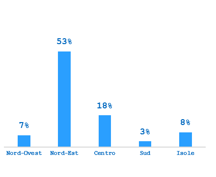
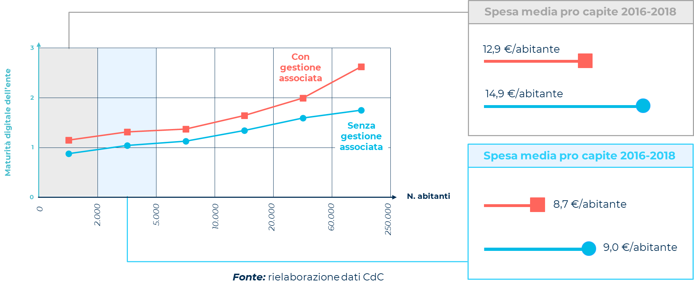

2. Strumento 2 - Gestione associata dell'ICT
============================================

*Versione 1.0 del 21/12/2023*

-  Obiettivo

   Il documento esamina i principi generali della gestione associata
   dell'ICT, con un focus specifico sulle Unioni di Comuni. Inoltre,
   analizza i fattori abilitanti che favoriscono l'implementazione di tali
   sistemi, con particolare attenzione all'organizzazione dei servizi
   intercomunali in gestione associata. Il documento esplora inoltre il
   ruolo delle *community* e della collaborazione digitale, evidenziando
   l'importanza della qualificazione dei centri servizi.

-  Destinatari

   Enti territoriali quali: comuni, province, città metropolitane e
   regioni, comunità montane, comunità isolane, unioni di comuni e consorzi
   fra enti territoriali.

-  Crediti

   Il documento è stato redatto dal Gruppo di ricerca sulla trasformazione
   digitale della PA dell'Osservatorio Agenda Digitale del Politecnico di
   Milano. Parte delle evidenze mostrate all'interno di questo documento
   sono i risultati di una collaborazione sviluppata nell'ambito del
   Progetto Italiae (CUP: J51H17000030007, appartenente al Programma
   Operativo Nazionale "Governance e Capacità Istituzionale" 2014-2020) tra
   il Dipartimento di Ingegneria Gestionale del Politecnico di Milano e il
   Dipartimento per gli Affari Regionali e le Autonomie della Presidenza
   del Consiglio dei Ministri.

2.1. Introduzione
-----------------

La gestione associata è modello organizzativo che permette alle
amministrazioni pubbliche di condividere tra loro risorse e competenze
per l'erogazione di funzioni o di determinati servizi di loro
competenza. La gestione associata della funzione ICT, nello specifico,
può rivelarsi una alternativa vantaggiosa per specifiche tipologie di
enti, in particolare per quelli di dimensione ridotte, caratterizzati da
risorse e competenze specialistiche limitate. In questo contesto,
esistono diverse configurazioni di governance multilivello incentrate
sulla trasformazione digitale che permettono di ottimizzare l'utilizzo
delle risorse disponibili nel mantenimento delle applicazioni e
nell'affrontare le sfide legate alla introduzione ed evoluzione di
soluzioni e infrastrutture, superando le limitazioni tipiche di una
gestione individuale.

In allegato A è riportato un estratto della Ricerca "Innovazione e
tecnologia a supporto del governo locale", svolta nell'ambito del
Progetto "ITALIAE", promosso dal Dipartimento per gli Affari Regionali e
le Autonomie e finanziato con il Programma Operativo Nazionale
"Governance e capacità istituzionale" 2014 - 2020" che offre una
fotografia dello stato dell'arte dell'associazionismo ICT e del ruolo
del Responsabile della Transizione al Digitale (RTD) con particolare
riferimento al modello dell'Unione di Comuni. Tale scelta deriva dalla
rappresentatività di tale forma.

2.1.1. Sistemi intercomunali per la gestione associata dell'ICT
~~~~~~~~~~~~~~~~~~~~~~~~~~~~~~~~~~~~~~~~~~~~~~~~~~~~~~~~~~~~~~~

Sebbene i dati presentati nell'Allegato A dimostrino che la gestione
associata dell'ICT in Unione sia una leva importante per la
trasformazione digitale degli enti, soprattutto quelli di piccole
dimensioni, esistono numerose altre forme di collaborazione sul digitale
che possono portare a risultati simili. Queste forme possono portare a
gradi molto diversi di integrazione tra enti, e dunque avere ricadute
diverse sul livello di digitalizzazione degli stessi.

Nel seguito sono presentate le principali forme di gestione associata
dell'ICT: le Unioni e Comunità Montane, i Consorzi e le Convenzioni.

2.1.2. Le Unioni di Comuni
~~~~~~~~~~~~~~~~~~~~~~~~~~

Le Unioni di Comuni (previste all'art. 32 TUEL), così come le Comunità
Montane, Isolane e d'Arcipelago (artt. 27, 28 e 29 del TUEL) sono una
forma di aggregazione tra due o più Comuni, che porta alla costituzione
di un vero e proprio ente locale. Ai sensi dell'art. 28 D. Lgs.
267/2000, le Unioni possono svolgere l'esercizio associato delle
funzioni delegate dai Comuni afferenti, o quelle individuate dalla
Regione di appartenenza, tra cui anche il servizio informatico e
trasformazione digitale. La creazione di un'Unione o Comunità Montana
comporta dunque un trasferimento di funzioni dai singoli Comuni all'ente
sovracomunale costituito, il quale assume così una piena autonomia
decisionale e gestionale.

La natura del raccordo tra l'ente Unione e i Comuni afferenti può avere
diverse conformazioni, sulla base delle modalità di gestione delle
funzioni associate. Vi è un tipo di configurazione tendente a una
*governance* accentrata, che prevede la gestione attraverso l'Unione
delle funzioni comunali; dunque, una sostituzione *de facto* dell'Unione
agli enti locali nelle funzioni trasferite, di cui assume sia la
titolarità che l'esecuzione. Da un punto di vista operativo, nel caso
più estremo del modello accentrato, i Comuni vedono il proprio personale
dipendente concentrato presso l'Unione. In questi casi, la gestione
associata del digitale si sostanzia tipicamente nella creazione
dell'Ufficio ICT integrato, con la nomina del RTD in capo ad esso, il
quale esercita tutte le sue funzioni per tutti i Comuni aderenti
all'Unione e trasversalmente rispetto agli altri servizi offerti
dall'ente.

Un'altra configurazione può essere invece definita decentrata e prevede
una delega parziale della gestione del servizio ICT, in base alla quale
una parte di attività viene trasferita all'Unione e una parte invece
mantenuta, almeno a livello di titolarità, dai singoli Comuni membri.
Nel caso di una gestione decentrata, il raccordo può essere garantito
attraverso l'istituzione di un tavolo permanente che coinvolge gli enti
locali dell'Unione per l'aggiornamento costante sulle linee guida, sugli
adempimenti normativi e sulla conseguente strategia di intervento degli
enti. Poiché l'integrazione dell'Unione è minore, anche la delega al
digitale è parziale: l'Ufficio ICT ha delega parziale mentre i Comuni
mantengono internamente parte delle attività legate a questa funzione.
Anche in questi casi - tipicamente - la nomina del RTD avviene in capo
all'Unione, ma egli assume un ruolo di regia, definendo obiettivi e
strategie di digitalizzazione e monitorandone il conseguimento. A tal
fine, si interfaccia con i referenti individuati nei Comuni che si
occupano della gestione operativa e dell'attuazione di iniziative
progettuali.

2.1.3. Le forme consortili
~~~~~~~~~~~~~~~~~~~~~~~~~~

Un altro modello di collaborazione intercomunale per la gestione
associata del digitale è rappresentato dalle forme consortili, ovvero
Consorzi e Consorzi obbligatori (art. 31 TUEL), società *in-house* (art.
114 TUEL). I soggetti che possono procedere all'istituzione del
Consorzio possono essere dunque Comuni, Unioni e altri soggetti
territoriali, cui fa spesso capo un ente capofila. Gli enti consorziati
partecipano attraverso il versamento di una quota annua e con modulo di
adesione per la cessione delle funzioni; nel caso delle società
*in-house*, in quanto società di capitali, gli enti pubblici associati
ne detengono una quota azionaria.

La collaborazione sul digitale tra Comuni nell'ambito di Consorzi
prevede tipicamente una delega parziale delle funzioni dell'Ufficio ICT
e una nomina del RTD in seno al Consorzio. Lo stesso può avvenire presso
un ente socio, che viene preposto all'esercizio delle funzioni
associate, assorbendo eventualmente anche unità di personale dal
Consorzio stesso.

I Comuni possono fondare o stringere accordi con Consorzi e società
*in-house* specificamente ed esclusivamente per la gestione del
digitale, e per questa ragione tali istituti hanno la particolarità di
essere in grado di offrire risorse altamente competenti e specializzate.
Le attività più frequentemente gestite dai Comuni tramite i Consorzi
sono infatti altamente specialistiche, come la gestione delle reti
tecnologiche, ovvero della connettività interna al Comune e tra le sue
sedi. A seguire, gli enti gestiscono tramite le società *in-house* anche
l'infrastruttura tecnologica, comprendente quindi acquisto, manutenzione
e aggiornamento hardware. Tra i principali benefici legati a questa
gestione vi è dunque per i Comuni la possibilità di riallocare le
proprie risorse umane su altre attività o funzioni dove ve ne è carenza,
e maggiori competenze e maggiore efficienza per la gestione di beni e
servizi informatici.

Oltre ai Consorzi specificatamente incentrati sul digitale, esistono
casistiche diffuse sul territorio di associazioni nate con scopi diversi
dal digitale, come ad esempio i Consorzi obbligatori, che fanno leva
sulla forma di cooperazione esistente per gestire anche le funzioni ICT
nei confronti degli enti già soci.

2.1.4. Le Convenzioni
~~~~~~~~~~~~~~~~~~~~~

La Convenzione, prevista all'art. 30 TUEL, non prevede la costituzione
di una nuova organizzazione sovraordinata: essa risulta quindi
maggiormente flessibile e reversibile rispetto - ad esempio - all'Unione
di Comuni e rappresenta una forma associativa largamente diffusa tra i
Comuni. All'interno di questa forma di collaborazione, le funzioni
vengono trasferite a uno dei soggetti partecipanti - il cosiddetto "ente
capofila". Le Convenzioni possono essere strette tra enti locali
(Comuni, Unioni, Comunità Montane, Province) e altri enti pubblici
(società partecipate, Agenzie territoriali, Aziende ospedaliere, e così
via).

Per quanto concerne la gestione del digitale, solitamente il RTD e
l'Ufficio ICT associato vengono istituiti presso l'ente "capofila", il
quale esplica le attività concorrenti a tali funzioni, raccordandosi con
il personale individuato presso gli altri enti per l'esecuzione delle
strategie di trasformazione digitale. A questo ente possono essere
trasferite delle unità di personale dagli enti convenzionati. A causa
della struttura fortemente decentrata delle Convenzioni, è necessario
stabilire modelli e occasioni di raccordo e coordinamento fra gli enti.

Proprio per la molteplicità di enti che possono essere coinvolti nello
strumento della Convenzione, la competenza di un Ufficio ICT associato
può essere molto diversificata ed estesa, al punto che esso può divenire
un punto di riferimento territoriale per la transizione digitale, specie
in situazioni periferiche e fortemente frammentate. È il caso, ad
esempio, di alcuni Centri Servizi Territoriali che vedono gli enti
"capofila" individuati nelle Province o nei Comuni capoluogo. Gestiscono
il ciclo di vita dei servizi digitali, dalla definizione del fabbisogno,
al coordinamento dello sviluppo/acquisizione, fino alla manutenzione ed
evoluzione, a favore di ampie platee di enti garantendo una coerenza di
attuazione delle strategie di trasformazione digitale e una forte
omogeneità territoriale.

2.1.5. I fattori abilitanti ai sistemi intercomunali sulla digitalizzazione
~~~~~~~~~~~~~~~~~~~~~~~~~~~~~~~~~~~~~~~~~~~~~~~~~~~~~~~~~~~~~~~~~~~~~~~~~~~

Nel seguito sono presentati i principali fattori critici che possono
garantire maggiore successo e longevità ai sistemi intercomunali
incentrati sul digitale.

-  Forme associative già in essere su funzioni diverse dalla
   trasformazione digitale possono essere strumenti utili per sviluppare
   collaborazioni in materia ICT, facendo leva su strumenti
   amministrativi e modelli organizzativi associativi già esistenti e su
   un legame di fiducia fra gli enti.

-  Dimensione dell'associazione superiore a 20.000 abitanti, dimensione
   minima utile per garantire efficienza negli acquisti di beni e
   servizi, nell'acquisizione e gestione del personale dedicato, negli
   investimenti e nella gestione di soluzioni e infrastrutture IT.

-  Un ente leader della collaborazione, spesso individuabile nel
   capofila di una gestione del servizio in Convenzione o fra i Comuni
   relativamente più grandi della media di quelli associati in Unione,
   può avere un ruolo utile nel creare i presupposti organizzativi e
   tecnologici per l'avvio dei processi di associazionismo, nel gestire
   il processo di cambiamento, fino alla assunzione delle responsabilità
   di gestione a regime della trasformazione digitale.

-  Il presidio politico è presupposto per lo sviluppo
   dell'associazionismo dell'IT, in quanto favorisce forme di
   collaborazione con altri enti e di delega delle attività. Tale
   evidenza è rafforzata dai casi in cui siano presenti Assessori con
   delega all'innovazione e alla digitalizzazione con esperienza e
   *background* tecnico.

-  Gli enti sovraordinati, con specifico riferimento alle Regioni,
   attraverso normative/documenti di indirizzo e gruppi di lavoro
   dedicati a supportare la trasformazione digitale, possono favorire e
   accompagnare lo sviluppo di collaborazioni strutturate, vincolando
   gli enti ad adottare modelli associativi - in termini di strumenti
   amministrativi, area territoriale e attività delegate - di successo.

-  L'omogeneità dei software gestionali tra enti è un fattore che può
   favorire la gestione associata dell'IT, in quanto garantisce una
   semplificazione gestionale, economicità e la riduzione delle
   tempistiche di centralizzazione dei servizi.

-  Iniziativa propria degli enti, le collaborazioni di successo hanno
   maggiore consistenza e prospettiva quando originano da un'iniziativa
   dei membri stessi, in quanto espressione di una esigenza percepita e
   di un percorso di sviluppo consapevole.

2.2. Organizzazione dei sistemi intercomunali con gestione associata
--------------------------------------------------------------------

La dinamica di avvio e sviluppo delle gestioni associate sull'ICT sono
dipendenti dalla storicità (o meno) della forma di cooperazione,
dall'ampiezza delle funzioni gestite, dalla struttura di governance, dal
livello di delega e integrazione fra gli enti.

Di seguito viene proposta una schematizzazione delle fasi "tipo" di
evoluzione della gestione associata del digitale, ovvero a) ricognizione
del fabbisogno digitale degli enti, b) progettazione e c)
implementazione tecnologica, gestionale e organizzativa, d) gestione e
consolidamento delle attività di pertinenza dell'Ufficio ICT associato
ed e) diffusione e ampliamento della forma associativa.

         Ricognizione, Progettazione, Implementazione, Gestione, Espansione.

   Fasi "tipo" del percorso evolutivo dei sistemi intercomunali

a) **Ricognizione**

La fase di ricognizione consiste nell'analisi del fabbisogno di
trasformazione digitale degli enti e della fattibilità di associare la
funzione ICT. In questa fase l'Unione, il Consorzio o l'ente "capofila"
si occupano di approfondire, prevalentemente, questi aspetti:

-  la digitalizzazione dei servizi;

-  gli applicativi utilizzati;

-  il grado di interoperabilità dei dati;

-  le competenze digitali del personale;

-  l'adozione di piattaforme e la dotazione di infrastrutture;

-  la connettività;

-  i processi e l'organizzazione.

b) **Progettazione**

Dopo la fase di approfondimento, viene definito il processo di
associazione della funzione ICT e progettata la gestione associata,
sotto gli aspetti:

-  tecnologici: l'Unione, il Consorzio o l'ente capofila valuta le
   azioni di adeguamento tecnologico (es. omogeneizzazione applicativi,
   introduzione applicativi laddove non in uso, migrazione dei dati,
   adozione delle piattaforme etc.).

-  gestionali: nel caso delle Unioni, viene valutata l'opportunità di
   associare la funzione ICT contestualmente ad altri servizi e/o
   funzioni. A questo segue la stipula degli accordi con gli enti locali
   per la cessione delle funzioni, a valle della quale avviene il
   trasferimento delle funzioni, con l'adozione del relativo modello di
   ripartizione dei costi. Vengono inoltre stabilite la governance e le
   modalità di raccordo con gli enti per le attività specifiche delegate
   all'Ufficio ICT associato.

-  organizzativi: la progettazione della gestione associata dell'ICT per
   gli enti afferenti può comportare la possibilità di migrare la
   funzione ICT verso un ufficio centralizzato, con la contestuale
   adozione di personale, e relativi ruoli, e risorse, con l'eventuale
   trasferimento e riallocazione di unità di personale dai Comuni verso
   l'Unione, il Consorzio o l'ente "capofila".

c) **Implementazione**

In questa fase, coerentemente con la pianificazione, si attua il
processo di associazione della funzione ICT. In questa fase,
coerentemente con la pianificazione, si attua il processo di
associazione della funzione ICT. Vengono quindi adottati i nuovi
regolamenti, conferiti gli incarichi e individuati i referenti di
ciascun ente.

In caso di organizzazioni già esistenti, la nomina del RTD può trovarsi
sia a valle che a monte del processo. Nel primo caso sarà la risultanza
del compimento dell'associazione della funzione ICT, mentre nel secondo
caso sarà proprio questa figura a guidare il processo di
associazionismo.

d) **Gestione**

Completata la fase di associazione della funzione ICT, vengono attuate
le strategie e le azioni di trasformazione digitale degli enti,
coerentemente con lo stato dell'arte rilevato, i bisogni locali e gli
obiettivi regionali e nazionali. Le attività sono monitorate e
aggiornate sulla base del loro svolgimento congiunto con gli enti
associati.

e) **Espansione**

Consolidata la gestione associata dell'ICT, la collaborazione può
espandersi verso: altre attività, funzioni potenzialmente associabili ed
eventualmente altri enti. Nelle Unioni, in particolare, la funzione del
digitale può naturalmente svilupparsi trasversalmente ai diversi servizi
comunali, che possono quindi gradualmente essere gestiti in maniera
associata. Convenzioni e Consorzi possono agevolmente estendere la
collaborazione a nuovi enti, e diventare dunque dei punti di riferimento
per la trasformazione digitale delle amministrazioni coinvolte.

2.3. Le *community* e la collaborazione sul digitale
----------------------------------------------------

Le *community* di innovazione sono gruppi di condivisione di esperienze,
progetti e soluzioni digitali tra enti pubblici di diversi livelli e
ambiti territoriali. Queste non sono disciplinate dalla normativa e di
caratterizzano per un elevato grado di libertà di partecipazione e
adesione. Esse nascono con l'obiettivo di favorire l'innovazione e la
trasformazione digitale della PA, sfruttando le opportunità offerte
dalle tecnologie e dalle reti di relazioni, rispondendo alla necessità
degli enti locali, specialmente i più piccoli, di avere accesso a
conoscenze e competenze ottimizzando le risorse esistenti e di svolgere
progetti ambiziosi di lungo periodo.

Una fattispecie particolare delle *community* di innovazione sono le
*community* di riuso, ovvero reti di conoscenza e collaborazione tra le
PA che adottano delle soluzioni software condivise e aperte. Il riuso di
software è infatti una modalità di acquisizione e cessione di soluzioni
digitali, prevista dal CAD, che prevede la possibilità di riutilizzare
gratuitamente software già sviluppati da altre amministrazioni con
vantaggi in termini di risparmio, efficienza, interoperabilità e
trasparenza.

La *community* di riuso può estendersi fino a diventare un vero e
proprio "*living lab*", uno spazio di confronto e sperimentazione
tra i membri, che permetta di ampliare la soluzione a nuovi scenari e
bisogni, come ad esempio quelli legati ad altre comunità sul territorio.
Il cuore del riuso si costituisce nello sviluppo e arricchimento del
cosiddetto "kit di riuso", ovvero un pacchetto di linee guida, codice,
dati e documentazione che permette ai riusanti di adottare e
personalizzare la soluzione in base alle proprie esigenze. Gli enti
riusanti, nella logica della collaborazione tipica delle *community*, si
impegnano a contribuire all'evoluzione della soluzione adottata
arricchendo, a loro volta, il "kit di riuso".

I vantaggi che le *community* fanno registrare sono riconducibili a:
diffusione di soluzioni standardizzate per gli enti aderenti,
manutenzione continua del software, quali l'aggiornamento tecnico e
normativo, l'assistenza agli enti riusanti.

Nel seguito sono presentati i principali fattori che possono determinare
il successo, in termini di capacità di coinvolgimento e di longevità,
delle *community*:

1. **Governance**: le *community* devono avere obiettivi ben delineati e
   una struttura di responsabilità chiara al loro interno, favorendo
   anche sinergie tra il settore pubblico e il settore privato,
   coinvolgendo ove possibile anche attori quali università, centri di
   ricerca, imprese, associazioni, cittadini etc... Infine, le
   *community* devono avere un ente garante, che possa svolgere il ruolo
   di coordinatore, facilitatore, promotore e valutatore delle attività
   della *community*. Le *community* con una struttura e una rete di
   rapporti consolidata tende a intensificare le relazioni e i risultati
   facendo leva su un sistema di *accountability*.

2. **Orientamento al risultato**: le *community* devono avere un piano
   di lavoro definito e strutturato, che definisca responsabilità e
   risultati attesi. Le *community* devono inoltre condividere i
   risultati raggiunti, sia internamente che esternamente, attraverso
   strumenti di comunicazione e di disseminazione adeguati, attraverso
   attività di sensibilizzazione e di coinvolgimento degli stakeholder.
   Laddove le *community* concorrono alla realizzazione di una strategia
   di lungo periodo, coerente con le prescrizioni regionali e nazionali,
   tendono ad avere una maggiore longevità e capacità di coinvolgimento.

3. **Risorse**: le *community* devono disporre di risorse adeguate a
   svolgere le proprie attività, sia in termini materiali che di
   personale, messo a disposizione dagli enti partecipanti, con
   particolare riferimento all'ente garante. Le *community* con maggiori
   finanziamenti, anche regionali, e con competenze più specifiche
   tendono riescono a raggiungere più efficacemente gli obiettivi di
   innovazione digitale.

4. **Organizzazione e gestione**: l'organizzazione interna deve essere
   chiara e funzionale, prevedendo al contempo una divisione delle
   competenze e delle responsabilità tra gli enti afferenti e tra le
   persone coinvolte. Le *community* devono inoltre avere una *mission*
   concreta e realistica, che possa guidare le scelte e le azioni verso
   il raggiungimento degli obiettivi prefissati. Una piattaforma online,
   che possa facilitare la condivisione di informazioni, documenti,
   codici, feedback etc., e, infine, un'assistenza tecnica da parte
   della *community* stessa e/o dall'ente garante, che possa fornire
   supporto ai partecipanti.

2.4. Qualificazione dei centri servizi sul digitale
---------------------------------------------------

Il modello di cooperazione per la gestione dell'ICT degli enti locali
può prevedere il coinvolgimento di strutture tecniche di servizio, con
particolare riferimento a quelli di piccole e medie dimensioni. Tali
strutture possono fornire competenze manageriali e tecniche necessarie a
orientare e supportare gli enti, assumendo un ruolo attivo nel supporto
nella definizione e attuazione delle strategie di trasformazione
digitale, e come erogatori di servizi.

Le attività svolte dai centri servizi sono riassumibili in:

-  pianificazione e monitoraggio: analizzare le strategie di
   trasformazione digitale locali, nazionali ed europee e definizione e
   monitoraggio di piani coerenti per gli enti territoriali di
   riferimento;

-  informazione: comunicare e aggiornare gli enti territoriali di
   riferimento di novità normative, di evoluzioni del mercato, presenza
   di opportunità, etc.;

-  formazione: attivare percorsi di *assessment* e di potenziamento
   delle competenze digitali del personale degli enti, stimolando uno
   scambio reciproco permanente di conoscenza tra enti di pari o diverso
   ordine;

-  scambio di buone pratiche: *scouting*, qualificazione e circolazione
   di prassi organizzative e tecnologiche;

-  coordinamento di comunità tematiche: coordinare le attività dei
   tavoli di lavoro attivati su specifiche tematiche in ambito ICT;

-  aggregazione della domanda e dei bisogni: avere una visione
   panoramica dei fabbisogni e delle esigenze territoriali svolgendo
   procedure di acquisto di beni e servizi aggregate;

-  fornitura di semi-lavorati: alla luce della conoscenza in ambito ICT,
   predisporre linee guida, bozze, schemi *et similia* (ad es.
   regolamenti, atti) a supporto delle attività di trasformazione
   digitale e di erogazione dei servizi;

-  erogazione diretta di servizi: fornire servizi digitali a favore
   degli enti territoriali;

-  gestione di progetti: supporto al coordinamento e all'attuazione di
   progetti di trasformazione digitale, soprattutto quelli di
   particolare complessità tecnica e amministrativa;

-  accesso a finanziamenti: strutturare Uffici Finanziamenti in grado di
   attuare: ricognizione delle esigenze di finanziamento, *scouting*
   finanziamenti, supporto alla creazione di partenariati, supporto alla
   predisposizione della documentazione di gara, project management e
   rendicontazione di progetti finanziati in ambito ICT.

Nel seguito sono indicati alcuni preliminari elementi di qualificazione
organizzativa e gestionale dei centri servizi che possono guidare la
loro individuazione, prescindendo dalla loro natura istituzionale e dal
loro livello di maturità (ovvero il divario fra la configurazione
ottimale e quella attuale). Alcuni di questi elementi di qualificazione
sono da considerarsi (a) imprescindibili: il possesso di questi è una
condizione necessaria per il riconoscimento dello status di centro
servizi. Altri elementi sono invece (b) acquisibili: ciò significa che
l'ente - potenziale centro servizi - può integrarli progressivamente nel
proprio spettro di competenze.

+-----------------------+-----------------------+-----------------------+
| Macro-requisiti       | Requisiti             | Elemento di           |
|                       | organizzativi e       | qualificazione        |
|                       | gestionali            | *imprescindibile vs.* |
|                       |                       | *acquisibile*         |
+=======================+=======================+=======================+
| Allineamento di       | Aver adottato linee   | IMPRESCINDIBILE       |
| strategia             | di azione, piani,     |                       |
|                       | programmi,            |                       |
|                       | provvedimenti (anche  |                       |
|                       | normativi) ad hoc     |                       |
|                       | riferiti all'ICT      |                       |
+-----------------------+-----------------------+-----------------------+
| Possesso delle        | Esperienza pregressa  | IMPRESCINDIBILE       |
| competenze ICT        | in ICT: dimostrabile  |                       |
|                       | approfondita e        |                       |
|                       | consolidata           |                       |
|                       | conoscenza del tema   |                       |
|                       | (es. informazione /   |                       |
|                       | formazione; linee     |                       |
|                       | guida; regolamenti;   |                       |
|                       | aver                  |                       |
|                       | attivato/contribuito  |                       |
|                       | a progetti inerenti   |                       |
|                       | all'ICT per enti      |                       |
|                       | terzi)                |                       |
+-----------------------+-----------------------+-----------------------+
| Possesso delle        | Competenze interne in | IMPRESCINDIBILE       |
| competenze ICT        | ICT: possesso di      |                       |
|                       | competenze interne    |                       |
|                       | ridondanti (più       |                       |
|                       | persone posseggono le |                       |
|                       | medesime competenze,  |                       |
|                       | per evitare che la    |                       |
|                       | fuoriuscita di una    |                       |
|                       | persona causi il      |                       |
|                       | venire meno di        |                       |
|                       | competenze critiche   |                       |
|                       | per la                |                       |
|                       | collaborazione)       |                       |
+-----------------------+-----------------------+-----------------------+
| Possesso delle        | Capacità di mantenere | IMPRESCINDIBILE       |
| competenze ICT        | e sviluppare          |                       |
|                       | competenze in ICT:    |                       |
|                       | processi consolidati  |                       |
|                       | di aggiornamento e    |                       |
|                       | sviluppo delle        |                       |
|                       | competenze            |                       |
+-----------------------+-----------------------+-----------------------+
| Possesso delle        | Capacità di           | ACQUISIBILE           |
| competenze ICT        | promuovere ed erogare |                       |
|                       | azioni di             |                       |
|                       | disseminazione        |                       |
|                       | riferite al tema ICT  |                       |
+-----------------------+-----------------------+-----------------------+
| Organizzazione        | Possesso di adeguate  | IMPRESCINDIBILE       |
|                       | risorse umane e       |                       |
|                       | infrastrutturali:     |                       |
|                       | dimensionamento delle |                       |
|                       | risorse umane         |                       |
|                       | coerente con le       |                       |
|                       | attività del centro   |                       |
|                       | servizi               |                       |
+-----------------------+-----------------------+-----------------------+
| Organizzazione        | Capacità di           | IMPRESCINDIBILE       |
|                       | procurement: processi |                       |
|                       | di approvvigionamento |                       |
|                       | di beni, servizi e    |                       |
|                       | professionisti        |                       |
|                       | strutturati in grado  |                       |
|                       | di intervenire in     |                       |
|                       | maniera tempestiva e  |                       |
|                       | attingendo a un       |                       |
|                       | mercato ampio         |                       |
+-----------------------+-----------------------+-----------------------+
| Networking            | Possesso e coerente   | IMPRESCINDIBILE       |
|                       | ampiezza di relazioni |                       |
|                       | con enti: esistenza   |                       |
|                       | di relazioni          |                       |
|                       | strutturate e         |                       |
|                       | formalizzate con      |                       |
|                       | enti, anche in ambiti |                       |
|                       | diversi dall'ICT      |                       |
+-----------------------+-----------------------+-----------------------+
| Networking            | Adeguatezza           | ACQUISIBILE           |
|                       | dell'ampiezza         |                       |
|                       | dell'ambito           |                       |
|                       | territoriale di       |                       |
|                       | riferimento           |                       |
+-----------------------+-----------------------+-----------------------+
| Networking            | Gestione della        | ACQUISIBILE           |
|                       | *community*: possesso |                       |
|                       | di modelli e          |                       |
|                       | strumenti di gestione |                       |
|                       | delle relazioni con   |                       |
|                       | altri enti per lo     |                       |
|                       | sviluppo congiunto di |                       |
|                       | iniziative su ICT     |                       |
+-----------------------+-----------------------+-----------------------+
| Networking            | Conoscenza e rapporti | IMPRESCINDIBILE       |
|                       | con soggetti con      |                       |
|                       | competenze in ICT:    |                       |
|                       | consapevolezza dei    |                       |
|                       | detentori di          |                       |
|                       | conoscenze a livello  |                       |
|                       | nazionale ed europeo  |                       |
|                       | e (eventuale)         |                       |
|                       | collaborazione        |                       |
|                       | pregressa             |                       |
+-----------------------+-----------------------+-----------------------+
| Knowledge             | Gestione della        | ACQUISIBILE           |
| management            | conoscenza: adozione  |                       |
|                       | di modelli e          |                       |
|                       | strumenti (es.        |                       |
|                       | piattaforme           |                       |
|                       | collaborative) per la |                       |
|                       | gestione e lo         |                       |
|                       | sviluppo di           |                       |
|                       | conoscenza            |                       |
+-----------------------+-----------------------+-----------------------+

*Tabella 4 - Elementi di qualificazione organizzativa e
gestionale dei centri servizi sul digitale*

2.5. Allegato A - Stato dell'arte dell'associazionismo ICT e benefici
---------------------------------------------------------------------

La maggiore concentrazione di Unioni di Comuni aventi una gestione
associata dell'ICT si trova nell'area nordorientale e nella fascia di
abitanti superiore ai 50.000 (Dati di Open Italiae
(https://openitaliae.it/), elaborazione di Politecnico di Milano, 2023).
Nel Nord-est, infatti, oltre la metà delle Unioni ha associato la
funzione ICT, mentre nelle altre aree la percentuale non supera il 18%.
Delle Unioni con oltre 50.000 abitanti, il 45% gestisce la funzione ICT
in forma associata mentre per le altre fasce di popolazione la
percentuale è inferiore al 17%. (figura 15).

L'area nordorientale potrebbe catturare l'effetto prodotto da politiche
regionali, le quali ricoprono potenzialmente un ruolo determinante nel
ciclo di vita delle Unioni attraverso, ad esempio, regolamentazioni *ad
hoc* e sistemi di incentivazione volti a promuovere l'associazionismo
intercomunale tramite premialità basate sul numero di funzioni svolte in
forma associata o su altri aspetti rilevanti.

         Unioni dell'area. Tra i dati si evince che nella area Nord-Est la quota
         delle Unioni con IVT assocuato è molto alta pari al 53%, seguita dal
         Centro con il 18%, Sud e Isole per 8% e infine Nord-Ovest al 7% e a
         chiudere Sud con il 3%.

   Percentuale di Unioni con ICT associato sul totale delle Unioni dell'area

         Unioni della stessa classe dimensionale. La percentuale è crescente dal
         9% al 12%, 17% fino al 45%.

   Percentuale di Unioni con ICT associato sul totale delle Unioni della stessa
   classe dimensionale

         evidenziando come la quota percentuale più alta pari al 30% sia in Area
         Nord-Est, per poi passare al Centro con 9% e all'area Nord-Ovest al 2%.
         Sud e Isole sono a 0.

   Percentuale di Unioni con ICT e RTD associati sul totale delle Unioni
   dell'area

.. figure:: ../media/figura_18.png
   :name: unioni-ict-rtd-associato-su-totale-classe
   :alt: La figura illustra la percentuale di Unioni con ICT e RTD associati sul
         totale delle Unioni della stessa classe dimensionale.

   Percentuale di Unioni con ICT e RTD associati sul totale delle Unioni della
   stessa classe dimensionale

Le tendenze legate all'area nordorientale e alla fascia di abitanti al
di sopra dei 50.000 abitanti sono ricorrenti anche su funzioni associate
ulteriori rispetto all'ICT. Nello specifico, le Unioni del Nord-est
svolgono mediamente più funzioni e servizi in forma associata rispetto a
quelle di altre aree geografiche del Paese. Oltre al contesto regionale,
si rileva che le Unioni con oltre 50.000 abitanti e con meno di 5.000
abitanti sono quelle che mediamente gestiscono in forma associata il
maggior numero di funzioni e servizi (figura 19). Si legga questo dato
alla luce del fatto che le Unioni con meno di 5.000 abitanti sono
costituite in media da soli 4 Comuni, mentre nelle Unioni di classe
dimensionale pari a 5.000-15.000, 15.000-50.000 e oltre 50.000 abitanti
ve ne sono, in media, rispettivamente 6, 8 e 9. Le Unioni al di sotto di
5.000 abitanti risultano, quindi, composte da Comuni di più piccole
dimensioni, tipicamente più in sofferenza nella gestione delle funzioni
e, dall'altro lato, il ridotto numero di enti aderenti può comportare
minori sforzi di governance rispetto ad aggregazioni più ampie.

         geografica, evidenziando come 10,8 sia il numero massimo presente in
         area Nord-EST, 9,6 area Nord-Ovest, poco superiore all'8,6 area Centro.
         Isole con 6,5 e Sud con 4,5 di numero medio.

   Numero medio di funzioni associate per area geografica

         dimensionale, evidenziando come 10,9 sia per dimensione sopra i 50
         mila, 9,4 fino a 5 mila, 8,6 sorai 5 Mila, e 7,4 sopra i 15 mila.

   Numero medio di funzioni associate per classe dimensionale

L'associazionismo intercomunale sul digitale risulta correlato al numero
di altre funzioni associate. In particolar modo, nella figura
sottostante si può osservare che le Unioni con ICT e RTD gestiti in
forma associata tendono ad avere un numero medio di altre funzioni
associate maggiore rispetto alle Unioni che non collaborano sul
digitale. Si tratta infatti di 18,2 funzioni associate contro le 7,2
delle Unioni senza ICT o senza RTD associati (figura 21).

         provenienti da una elaborazione di Politecnico di Milano su dati di
         Open Italiae, 2023. In figura si illustra come 18,2 sia il numero medio
         per le Unioni con ICT e RTD associati, 15,7 per le Unioni con ICT
         associato, 15,1 per Unioni con RTD associato, per poi scendere a 7,2
         per Unioni senza ICT associato e senza RTD associato.

   Numero medio di funzioni associate. Elaborazione di Politecnico di Milano su
   dati di Open Italiae, 2023

Si può quindi concludere che alle Unioni con maggiore integrazione del
digitale corrisponde anche un numero medio superiore di altre funzioni
associate, il che suggerisce che la gestione associata del digitale -
data la sua natura trasversale rispetto ad altre funzioni - sia capace
di promuovere collaborazioni anche su altri ambiti di competenza degli
enti locali.

La pratica della gestione associata dell'ICT, tuttavia, ha spazi di
ampliamento e sviluppo. Nel caso specifico delle Unioni di Comuni, essa
ricorre in meno di 1 Unione su 5 (Dati di Open Italiae
(https://openitaliae.it/), elaborazione di Politecnico di Milano, 2023 -
figura 22) e la diffusione di tale pratica non è omogenea sul territorio
ma risulta piuttosto concentrata in specifici contesti geografici. Oltre
il 50% delle Unioni di Comuni o Comunità Montane attualmente attive sono
situate nelle aree geografiche del Nord-ovest e Nord-est del Paese (Dati
di Open Italiae (https://openitaliae.it/), elaborazione di Politecnico
di Milano, 2023).

         nelle Unioni di Comuni. Il grafico rappresenta le quote percentuali con
         il 74% delle Unioni di Comuni senza ICT e RTD associato, il 9% con RTD
         associato ma non con ICT associato, il 9% con ICT associato ma non con
         RTD associato e l'8% con ICT e RTD associati.

   Diffusione della gestione associata del digitale nelle Unioni di Comuni.
   Elaborazione di Politecnico di Milano su dati di Open Italiae, 2023

La gestione associata dell'ICT è foriera di benefici, maggiormente
rilevabili negli enti di più piccole dimensioni. Questa è capace di
favorire un maggior livello di digitalizzazione e efficienza di spesa,
espressa come minore spesa pro capite in ICT.

I Comuni più piccoli, nonostante uno scarso livello di digitalizzazione,
spendono relativamente molto di più dei Comuni di maggiori dimensioni, i
quali raggiungono anche livelli di maturità digitale più elevati. Questo
fattore è probabilmente dovuto alle economie di scala che i Comuni di
medio-grandi dimensioni riescono a sfruttare. Oltre un certo numero di
abitanti, la spesa torna nuovamente ad aumentare, a fronte di una
maggior complessità gestionale e organizzativa da gestire. In questi
casi, tuttavia la maggiore strutturazione consente agli enti di ottenere
anche più elevati livelli di maturità digitale.

         ogni cittadino per l'acquisto di soluzioni digitali. Il campione dei
         comuni è suddiviso per densità abitativa. L'immagine rappresenta il
         fatto che i Comuni di piccole dimensioni spendono relativamente molto
         di più dei Comuni di maggiori dimensioni ma con un livello di maturità
         digitale inferiore. I dati sono stati pubblicati dalla Corte dei Conti
         nel 2019 e l'immagine è una rielaborazione dell'Osservatorio Agenda
         Digitale.

   Distribuzione della spesa pro capite annuale in soluzioni digitali per
   densità abitativa a fine 2019. Elaborazione dell'Osservatorio Agenda Digitale
   da Corte dei Conti, 2019

Una governance del digitale che vede il coinvolgimento di più enti,
dunque, rappresenta potenzialmente una leva che le PA locali hanno a
disposizione per "simulare" il comportamento di enti di maggiori
dimensioni, col beneficio di velocizzare e rendere sostenibile il loro
processo di trasformazione digitale.

         spesa in ICT nei Comuni di piccole dimensioni rende la spesa pro-capite
         in soluzioni ICT più efficiente, velocizzando e rendendo sostenibile il
         processo di trasformazione digitale.

   Gestione associata e spesa in ICT nei Comuni per fasce dimensionali.
   Elaborazione dell'Osservatorio Agenda Digitale Politecnico di Milano da Corte
   dei Conti, 2019

Inoltre, i Comuni in Unione tendono a mostrare più frequentemente alti
livelli di digitalizzazione dei servizi: la percentuale di Comuni in
Unione con *front-office* dei servizi digitalizzati tende a superare
quella dei Comuni *non* appartenenti a forme associative, soprattutto
nei servizi rivolti alle imprese. Tale differenza è ancor più netta se
si confrontano i Comuni appartenenti alla fascia fino a 5.000 abitanti
(ad esempio, +23% nel *front-office* del SUAP; +19% nel *front-office*
del SUE). Inoltre, i Comuni che gestiscono l'ICT in forma associata in
Unione hanno il back-office dei servizi digitalizzato più frequentemente
dei Comuni non appartenenti a Unioni o Comunità Montane (differenza
media di circa +25%).

Questi dati sembrano indicare che l'appartenenza a una Unione di Comuni
e la gestione associata dell'ICT in Unione possano influire
positivamente sul livello di digitalizzazione dei Comuni, soprattutto
per quelli più piccoli, e dunque anche favorire il rispetto della
digitalizzazione di servizi determinato da normative (e.g. SUAP). Questo
è dovuto sicuramente alla possibilità degli enti, o l'*obbligatorietà*
nel caso dei Comuni più piccoli, di delegare la titolarità e l'esercizio
delle funzioni legate al digitale a una entità con maggiori competenze,
con il beneficio atteso di una maggiore omogeneizzazione dei sistemi e
una razionalizzazione nell'utilizzo delle risorse.

Infine, i Comuni percepiscono due principali vantaggi legati alla
gestione associata del digitale: da un lato essa contribuisce a una
migliore allocazione interna delle risorse umane degli enti, dall'altro
aumenta le competenze e l'efficienza nella selezione, nell'acquisto e
nella gestione di beni e servizi digitali.

         mostrano più frequentemente alti livelli di digitalizzazione dei
         servizi di front-office rispetto ai Comuni non appartenenti a forme
         associative. Sono rappresentati i dati dei Comuni con più di 5000
         abitanti. I servizi alle imprese rappresentati in ordine decrescente
         per livello di digitalizzazione sono: 1) SCIA SUAP; 2) SCIA SUE; 3)
         SCIA eventi; 4) Domanda di permesso di costruire; 5) Domanda di
         occupazione per tassa rifiuti; 6) Richiesta di autorizzazione per
         organizzazione eventi. I servizi ai cittadini rappresentati in ordine
         decrescente per livello di digitalizzazione sono: 1) Iscrizione mensa
         scolastica; 2) Richiesta di cambio di residenza; 3) Iscrizione al
         trasporto scolastico; 4) Iscrizione asili e scuole comunali; 5)
         Richieste certificato di nascita; 6) Richiesta iscrizione/cancellazione
         Albo scrutatori. I dati sono dell'Osservatorio Agenda Digitale
         Politecnico di Milano.

   Percentuale di Comuni con front-office digitalizzato - Dati Osservatorio
   Agenda Digitale Politecnico di Milano

         mostrano più frequentemente alti livelli di digitalizzazione dei
         servizi di front-office rispetto ai Comuni non appartenenti a forme
         associative. Sono rappresentati i dati dei Comuni con meno di 5000
         abitanti. I servizi alle imprese rappresentati in ordine decrescente
         per livello di digitalizzazione sono: 1) SCIA SUAP; 2) SCIA SUE; 3)
         SCIA eventi; 4) Domanda di permesso di costruire; 5) Domanda di
         occupazione per tassa rifiuti; 6) Richiesta di autorizzazione per
         organizzazione eventi. I servizi ai cittadini rappresentati in ordine
         decrescente per livello di digitalizzazione sono: 1) Iscrizione mensa
         scolastica; 2) Richiesta di cambio di residenza; 3) Iscrizione al
         trasporto scolastico; 4) Iscrizione asili e scuole comunali; 5)
         Richieste certificato di nascita; 6) Richiesta iscrizione/cancellazione
         Albo scrutatori. I dati sono dell'Osservatorio Agenda Digitale
         Politecnico di Milano.

   Percentuale di Comuni con meno di 5.000 abitanti con front-office
   digitalizzato - Dati Osservatorio Agenda Digitale Politecnico di Milano

         mostrano più frequentemente alti livelli di digitalizzazione dei
         servizi di back-office rispetto ai Comuni non appartenenti a forme
         associative. Sono rappresentati i dati dei Comuni senza distinzione
         rispetto al numero di abitanti. I servizi alle imprese rappresentati in
         ordine decrescente per livello di digitalizzazione sono: 1) SCIA SUAP;
         1) SCIA SUE; 3) SCIA eventi; 4) Domanda di permesso di costruire; 5)
         Domanda di occupazione per tassa rifiuti; 6) Richiesta di
         autorizzazione per organizzazione eventi. I servizi ai cittadini
         rappresentati in ordine decrescente per livello di digitalizzazione
         sono: 1) Iscrizione mensa scolastica; 2) Richiesta di cambio di
         residenza; 3) Iscrizione al trasporto scolastico; 4) Iscrizione asili e
         scuole comunali; 5) Richieste certificato di nascita; 6) Richiesta
         iscrizione/cancellazione Albo scrutatori. I dati sono dell'Osservatorio 
         Agenda Digitale Politecnico di Milano.

   Percentuale di Comuni con back-office digitalizzato - Dati Osservatorio
   Agenda Digitale Politecnico di Milano

2.6. Riferimenti
----------------

1.  `(2020). Linee guida acquisizione e riuso software PA.
    <https://www.agid.gov.it/it/design-servizi/riuso-open-source/linee-guida-acquisizione-riuso-software-pa>`__
2.  Codice dell'Amministrazione Digitale. (s.d.). art. 69. *Riuso delle
    soluzioni e standard aperti.*
3.  Commissione Europea. `(2023) Collections. <https://joinup.ec.europa.eu/collections?page=1>`__
4.  Corte dei Conti - Sezione delle autonomie . (2019). Questionario per la
    valutazione dello stato di attuazione del Piano Triennale per l'informatica
    nella PA.
5.  Dipartimento per la Trasformazione Digitale e `AGID. (s.d.). Catalogo
    Software. <https://developers.italia.it/it/search?type=software_reuse&sort_by=release_date&page=0>`__
6.  Enti locali italiani. (2022). "Un modello per quantificare i benefici del
    riuso". (P. d., Intervistatore)
7.  Mola, A. (2020). Ecosistema MyP3. Regione del Veneto - Direzione ICT e
    Agenda Digitale.
8.  Osservatorio Agenda Digitale. (2019). Gestione associata e spesa pro-capite.
    Milano: Politecnico di Milano.
9.  Osservatorio Agenda Digitale. (2022). Diffusione e benefici del riuso. La
    digitalizzazione e il riuso: una panoramica dagli enti locali (p. 35-59).
    Milano: Politecnico di Milano.
10. Politecnico di Milano. (2023, Agosto). Interviste a sistemi intercomunali.
11. Politecnico di Milano. (2023). Questionario sulla digitalizzazione degli
    enti locali.
12. Provincia di Lecco. (2022). `La Provincia di Lecco promuove e coordina la
    gestione di un Centro Servizi Territoriale (CST) di ambito sovraccomunale.
    <https://www.cst.provincia.lecco.it/cit>`__
13. Regione Umbria. (2022). `Puntozero. <https://puntozeroscarl.it/:
    https://puntozeroscarl.it/azienda/>`__
14. Tozzi, Q., Carocci, G., & Labella, B. (2011). Capitolo 2. Cos'è una buona
    pratica. In Buone pratiche per la sicurezza in sanità. Manuale pratico per
    la rappresentazione, la valutazione e la diffusione (p. 39-44). Il Pensiero
    Scientifico Editore.
15. Tramontano, L. (2021). Manuale di diritto degli enti locali. Santarcangelo
    di Romagna (RN): Maggioli.
16. Umbria Digitale. (2019). La buona pratica S.I.SO Sistema Informativo SOciale
    - condivisione delle esperienze e scenari. Perugia.
