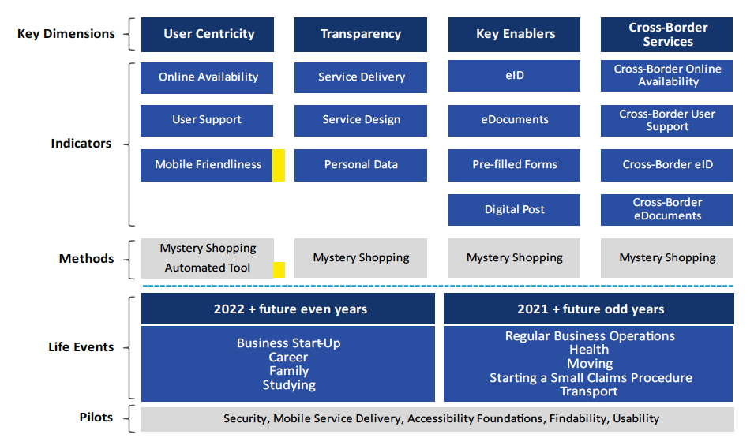

3. Strumento 3 - Servizi prioritari secondo l'*eGovernment benchmark*
=====================================================================

*Versione 1.0 del 21/12/2023*

-  Obiettivo

   Il documento fornisce i principi di base per l'individuazione e
   l'implementazione dei servizi digitali "prioritari" secondo
   l'eGovernment Action Plan Benchmark.

-  Destinatari

   Pubbliche amministrazioni ed enti strumentali che erogano servizi
   digitali per conto delle pubbliche amministrazioni.

-  Crediti

   Il documento è stato redatto in collaborazione con il Dipartimento per
   la Trasformazione Digitale.

3.1. *eGovernment benchmark*
----------------------------

L'*eGovernment benchmark* è il principale strumento di monitoraggio
utilizzato dall'Unione Europea per verificare il raggiungimento degli
obiettivi del Decennio Digitale europeo.

L'*eGovernment benchmark* ha l'obiettivo di misurare il livello di
maturità tecnologica e lo stato di digitalizzazione dei servizi pubblici
di tutti i Paesi Membri e costituisce uno strumento fondamentale
fornendo linee guida e individuando le "*best practice*" a livello
europeo.

Il Benchmark riflette gli obiettivi dell'Unione Europea condivisi nella
Dichiarazione di Tallinn del 2017, che ha definito le linee d'azione per
la creazione di un mercato unico digitale (ivi compreso il monitoraggio
tramite l'*eGovernment benchmark*) e all'interno della Dichiarazione
di Berlino del 2020 con cui gli Stati Membri si sono impegnati a fondare
il concetto stesso di governo digitale sull'inclusione dei cittadini e
sulla creazione di un ambiente digitale sostenibile e rispettoso dei
principi etici.

L'*eGovernment benchmark* Framework è un importante strumento che
valuta l'integrazione e la presenza di alcune caratteristiche peculiari
dei servizi digitali pubblici per verificarne affidabilità, efficienza
ed efficacia per gli utenti.

I servizi digitali offerti ai cittadini che sono oggetto del
monitoraggio effettuato dall'eGovernment vengono valutati in base a
quattro "dimensioni chiave" che si compongono da quattordici indicatori
totali. Le dimensioni chiave sono le seguenti:

-  centralità dell'utente

-  trasparenza

-  disponibilità transfrontaliera

-  fattori chiave abilitanti

ossia le precondizioni tecniche per la fornitura dei servizi digitali.

La Commissione Europea ogni anno effettua test su un campione di
servizi, nazionali e locali, e stila una classifica dei paesi più
virtuosi. Al fine di valutare tutti gli indicatori, l'*eGovernment
benchmark* utilizza i cosiddetti "mystery shoppers", cittadini europei
che, a seguito di specifica formazione, e sulla base di un sistema di
criteri predefiniti, valutano la qualità dei servizi digitali
disponibili in ogni stato membro comportandosi esattamente come
potenziali utenti.

Con riferimento alla performance relativa ai servizi offerti ai
cittadini transfrontalieri, Il "*Single Digital Gateway*" (Sportello
Digitale Unico), permetterà a cittadini e imprese di accedere più
facilmente alle informazioni, alle procedure e ai servizi di assistenza
in diversi settori del mercato interno, consentendo, conseguentemente,
lo sviluppo del mercato unico digitale.

         Framework, articolata in dimensioni chiave, indicatori, metodi di
         rilevazione, eventi della vita da tenere in considerazione, ambiti in
         riferimento sui quali effettuare la valutazione.

   eGovernment benchmark Framework

3.2. *eGovernment benchmark* e DESI
-----------------------------------

Alcuni degli indicatori dell'*eGovernment benchmark* sono inclusi
all'interno del DESI (*Digital Economy and Society Index*), in
particolare l'*eGovernment benchmark* fornisce i dati che alimentano
due dei KPI del Decennio Digitale europeo relativi ai servizi pubblici
digitali: servizi pubblici digitali per i cittadini e servizi pubblici
digitali per le imprese.

+----------+--------------------------------------------------------------------------------------------------------------------------------------------------------------------------------------------------------------+--------------------------------------------------------------------------------------------------------------------------------------------------------------------------------------------------------------------------------------------------------------------------------------------------------------------------------------------------------------------------------------------------------------------------------------------------------------------------------------------------------------------------------------------------------------------------------------------------------------------------------------------------------------------------------------------------------------------------------------------------------------------------------------------------------------------------------------+------------+------------+------------------------------+
| Id       | Indicatore                                                                                                                                                                                                   | Definizione                                                                                                                                                                                                                                                                                                                                                                                                                                                                                                                                                                                                                                                                                                                                                                                                                          | Indicatore | Indicatore | Posizione su 28 Stati membri |
|          |                                                                                                                                                                                                              |                                                                                                                                                                                                                                                                                                                                                                                                                                                                                                                                                                                                                                                                                                                                                                                                                                      | EU 2023    | Italia     |                              |
|          |                                                                                                                                                                                                              |                                                                                                                                                                                                                                                                                                                                                                                                                                                                                                                                                                                                                                                                                                                                                                                                                                      |            | 2023       |                              |
+==========+==============================================================================================================================================================================================================+======================================================================================================================================================================================================================================================================================================================================================================================================================================================================================================================================================================================================================================================================================================================================================================================================================================+============+============+==============================+
| desi_4a1 | `e-Government users <https://digital-decade-desi.digital-strategy.ec.europa.eu/datasets/desi/charts/desi-indicators?indicator=desi_4a1&indicatorGroup=desi2023-4>`__                                         | Persone, con età compresa tra i 16 e i 74 anni, che hanno utilizzato Internet, negli ultimi 12 mesi, per interagire con le autorità pubbliche su siti web o applicazioni mobili. (Punteggio: % utilizzatori di internet). `Fonte: Eurostat – European Union survey on the use of ICT in households and by individuals (ISOC_CIEGI_AC [I_IGOVANYS]) <https://ec.europa.eu/eurostat/web/products-datasets/-/isoc_ciegi_ac>`__                                                                                                                                                                                                                                                                                                                                                                                                          | 74,20%     | 76,26%     | 22                           |
+----------+--------------------------------------------------------------------------------------------------------------------------------------------------------------------------------------------------------------+--------------------------------------------------------------------------------------------------------------------------------------------------------------------------------------------------------------------------------------------------------------------------------------------------------------------------------------------------------------------------------------------------------------------------------------------------------------------------------------------------------------------------------------------------------------------------------------------------------------------------------------------------------------------------------------------------------------------------------------------------------------------------------------------------------------------------------------+------------+------------+------------------------------+
| desi_4a2 | `Digital public services for citizens <https://digital-decade-desi.digital-strategy.ec.europa.eu/datasets/desi/charts/desi-indicators?indicator=desi_4a2&indicatorGroup=desi2023-4>`__                       | La quota di procedimenti amministrativi che possono essere svolti online per i principali eventi della vita (nascita di un figlio, nuova residenza, ecc.) da parte dei cittadini (Punteggio da 0 a 100). `Fonte: eGovernment benchmarking Reports (2012-2022) <https://digital-strategy.ec.europa.eu/en/library/egovernment-benchmark-2022>`__                                                                                                                                                                                                                                                                                                                                                                                                                                                                                       | 77,03      | 67,91      | 21                           |
+----------+--------------------------------------------------------------------------------------------------------------------------------------------------------------------------------------------------------------+--------------------------------------------------------------------------------------------------------------------------------------------------------------------------------------------------------------------------------------------------------------------------------------------------------------------------------------------------------------------------------------------------------------------------------------------------------------------------------------------------------------------------------------------------------------------------------------------------------------------------------------------------------------------------------------------------------------------------------------------------------------------------------------------------------------------------------------+------------+------------+------------------------------+
| desi_4a3 | `Digital public services for businesses <https://digital-decade-desi.digital-strategy.ec.europa.eu/datasets/desi/charts/desi-indicators?indicator=desi_4a3&indicatorGroup=desi2023-4>`__                     | L'indicatore esprime la quota di servizi necessari per avviare un'impresa e condurre operazioni commerciali regolari che sono disponibili online sia per gli utenti nazionali che per quelli stranieri. I servizi erogati interamente in modalità digitale ricevono un punteggio più alto, mentre i servizi che forniscono solo informazioni (ma devono essere completati offline) ricevono un punteggio più limitato. (Punteggio da 0 a 100). `Fonte: eGovernment benchmarking Reports (2012-2022) <https://digital-strategy.ec.europa.eu/en/library/egovernment-benchmark-2022>`__                                                                                                                                                                                                                                                 | 83,73      | 74,71      | 24                           |
+----------+--------------------------------------------------------------------------------------------------------------------------------------------------------------------------------------------------------------+--------------------------------------------------------------------------------------------------------------------------------------------------------------------------------------------------------------------------------------------------------------------------------------------------------------------------------------------------------------------------------------------------------------------------------------------------------------------------------------------------------------------------------------------------------------------------------------------------------------------------------------------------------------------------------------------------------------------------------------------------------------------------------------------------------------------------------------+------------+------------+------------------------------+
| desi_4a4 | `Pre-filled Forms <https://digital-decade-desi.digital-strategy.ec.europa.eu/datasets/desi/charts/desi-indicators?indicator=desi_4a4&indicatorGroup=desi2023-4>`__                                           | Quantità di dati precompilati nei moduli online dei servizi. (Punteggio da 0 a 100). `Fonte: eGovernment benchmarking Reports (2012-2022) <https://digital-strategy.ec.europa.eu/en/library/egovernment-benchmark-2022>`__                                                                                                                                                                                                                                                                                                                                                                                                                                                                                                                                                                                                           | 68,18      | 47,11      | 24                           |
+----------+--------------------------------------------------------------------------------------------------------------------------------------------------------------------------------------------------------------+--------------------------------------------------------------------------------------------------------------------------------------------------------------------------------------------------------------------------------------------------------------------------------------------------------------------------------------------------------------------------------------------------------------------------------------------------------------------------------------------------------------------------------------------------------------------------------------------------------------------------------------------------------------------------------------------------------------------------------------------------------------------------------------------------------------------------------------+------------+------------+------------------------------+
| desi_4a5 | `Transparency of service delivery, design and personal data <https://digital-decade-desi.digital-strategy.ec.europa.eu/datasets/desi/charts/desi-indicators?indicator=desi_4a5&indicatorGroup=desi2023-4>`__ | La misura in cui i processi di servizio sono trasparenti, i servizi sono progettati con il coinvolgimento degli utenti e gli utenti possono gestire i loro dati personali. (Punteggio da 0 a 100). `Fonte: eGovernment benchmarking Reports (2012-2022) <https://digital-strategy.ec.europa.eu/en/library/egovernment-benchmark-2022>`__                                                                                                                                                                                                                                                                                                                                                                                                                                                                                             | 64,73      | 49,2       | 25                           |
+----------+--------------------------------------------------------------------------------------------------------------------------------------------------------------------------------------------------------------+--------------------------------------------------------------------------------------------------------------------------------------------------------------------------------------------------------------------------------------------------------------------------------------------------------------------------------------------------------------------------------------------------------------------------------------------------------------------------------------------------------------------------------------------------------------------------------------------------------------------------------------------------------------------------------------------------------------------------------------------------------------------------------------------------------------------------------------+------------+------------+------------------------------+
| desi_4a6 | `User support <https://digital-decade-desi.digital-strategy.ec.europa.eu/datasets/desi/charts/desi-indicators?indicator=desi_4a6&indicatorGroup=desi2023-4>`__                                               | La misura in cui il supporto online, le funzioni di aiuto e i meccanismi di feedback sono disponibili, anche a livello transfrontaliero. (Punteggio da 0 a 100). `Fonte: eGovernment benchmarking Reports (2012-2022) <https://digital-strategy.ec.europa.eu/en/library/egovernment-benchmark-2022>`__                                                                                                                                                                                                                                                                                                                                                                                                                                                                                                                               | 85,59      | 77,78      | 22                           |
+----------+--------------------------------------------------------------------------------------------------------------------------------------------------------------------------------------------------------------+--------------------------------------------------------------------------------------------------------------------------------------------------------------------------------------------------------------------------------------------------------------------------------------------------------------------------------------------------------------------------------------------------------------------------------------------------------------------------------------------------------------------------------------------------------------------------------------------------------------------------------------------------------------------------------------------------------------------------------------------------------------------------------------------------------------------------------------+------------+------------+------------------------------+
| desi_4a7 | `Mobile friendliness <https://digital-decade-desi.digital-strategy.ec.europa.eu/datasets/desi/charts/desi-indicators?indicator=desi_4a7&indicatorGroup=desi2023-4>`__                                        | La misura in cui i servizi di e-government sono forniti attraverso un'interfaccia mobile-friendly, cioè, un'interfaccia che risponde al dispositivo mobile. (Punteggio da 0 a 100). `Fonte: eGovernment benchmarking Reports (2012-2022) <https://digital-strategy.ec.europa.eu/en/library/egovernment-benchmark-2022>`__                                                                                                                                                                                                                                                                                                                                                                                                                                                                                                            | 93,27      | 91,4       | 20                           |
+----------+--------------------------------------------------------------------------------------------------------------------------------------------------------------------------------------------------------------+--------------------------------------------------------------------------------------------------------------------------------------------------------------------------------------------------------------------------------------------------------------------------------------------------------------------------------------------------------------------------------------------------------------------------------------------------------------------------------------------------------------------------------------------------------------------------------------------------------------------------------------------------------------------------------------------------------------------------------------------------------------------------------------------------------------------------------------+------------+------------+------------------------------+
| desi_4b1 | `Access to e-health records <https://digital-decade-desi.digital-strategy.ec.europa.eu/datasets/desi/charts/desi-indicators?indicator=desi_4b1&indicatorGroup=desi2023-4>`__                                 | La misura di: (1) la disponibilità a livello nazionale di servizi di accesso online per i cittadini ai propri dati di cartelle cliniche elettroniche (tramite un portale per i pazienti o un'applicazione mobile per i pazienti) con misure aggiuntive che consentano ad alcune categorie di persone (ad esempio, tutori per i bambini, persone con disabilità, anziani) di accedere ai propri dati, e (2) la percentuale di individui che hanno la possibilità di ottenere o utilizzare il proprio set minimo di dati relativi alla salute attualmente memorizzati nei sistemi di cartelle cliniche elettroniche (EHR) pubblici e privati. (Punteggio da 0 a 100). `Fonte: Digital decade e-Health indicators development report <https://op.europa.eu/en/publication-detail/-/publication/78938111-461e-11ee-92e3-01aa75ed71a1>`__ | 71,71      | 71,32      | 16                           |
+----------+--------------------------------------------------------------------------------------------------------------------------------------------------------------------------------------------------------------+--------------------------------------------------------------------------------------------------------------------------------------------------------------------------------------------------------------------------------------------------------------------------------------------------------------------------------------------------------------------------------------------------------------------------------------------------------------------------------------------------------------------------------------------------------------------------------------------------------------------------------------------------------------------------------------------------------------------------------------------------------------------------------------------------------------------------------------+------------+------------+------------------------------+

*Tabella 5 - Indicatori DESI riguardanti i servizi pubblici
digitali, valore e posizionamento dell'Italia*

3.3. Servizi prioritari
-----------------------

Il Sistema di monitoraggio dell'*eGovernment benchmark* per la valutazione delle
prestazioni delle Istituzioni governative ha previsto quindi la predisposizione
di un questionario composto da una lista di domande, per la valutazione di
ognuna delle già citate dimensioni chiave, per l'assegnazione ad ogni Stato
coinvolto di un punteggio complessivo per indicare il livello di maturità nel
raggiungimento degli obiettivi dell'*eGovernment benchmark*. Si riport la lista
delle domande che compongono il questionario, nonché dei requisiti misurati
dalla Commissione relativamente ai servizi pubblici digitali.

Per misurare lo stato di avanzamento delle Pubbliche Amministrazioni,
l'*eGovernment benchmark* utilizza nove momenti di vita, ovvero fasi
significative nella vita di un cittadino che rappresentano occasioni di
interazione tra governo e cittadini/imprese.

Nell'ambito del monitoraggio dell'*e-Government benchmark* sono
individuati specifici servizi "prioritari" attraverso i quali i momenti
di vita, considerati nella metodologia come classificazioni di azioni
necessarie più o meno quotidiane, vengono resi operativi e funzionanti
per il cittadino.

Lista dei servizi individuati e distinti per i momenti di vita a cui si
riferiscono.

-  Momenti della vita - Avvio d’impresa:

   -  Servizi monitorati:

      - 1.1 Verificare i requisiti per avviare un'impresa
      - 1.2 Ottenere indicazioni su come scrivere un business plan
      - 1.3 Ottenere indicazioni su come esplorare le possibilità finanziarie
      - 2.1 Ottenere il certificato di assenza di oneri pendenti
      - 3.1 Registrazione della società per la prima volta
      - 4.1 Ottenere la carta/numero di identificazione fiscale
      - 4.2 Ottenere il numero di partita IVA
      - 5.1 Registrazione presso l'Ufficio della sicurezza sociale
      - 5.2 Ottenere indicazioni su come organizzare l'assicurazione pensionistica (obbligatoria)
      - 5.3 Chiedere indicazioni su come stipulare l'assicurazione sanitaria (obbligatoria)
      - 6.1 Registrare la propria azienda come datore di lavoro
      - 6.2 Registrare i dipendenti prima del primo giorno di lavoro
      - 6.3 Verificare gli obblighi contrattuali per l'assunzione dei dipendenti
      - 6.4 Verificare le condizioni di lavoro per l'assunzione dei dipendenti
      - 7.1 Verificare le condizioni per le autorizzazioni ambientali
      - 7.2 Ottenere il permesso di inquinamento/ambiente

-  Momenti della vita - Carriera:

   -  Servizi monitorati:

      - 1.1 Registrazione come disoccupato
      - 1.2 Calcolo dell'indennità di disoccupazione (durata e altezza)
      - 1.3 Richiedere l'indennità di disoccupazione
      - 1.4 Ricorso contro la decisione in caso di mancata concessione dell'indennità di disoccupazione
      - 2.1 Verificare l'ammissibilità a ulteriori indennità di disoccupazione
      - 2.2 Ottenere indicazioni su come ottenere l'indennità di alloggio
      - 2.3 Ottenere indicazioni su come organizzare una consulenza sui debiti
      - 2.4 Ottenere indicazioni su come organizzare programmi di promozione della salute
      - 2.5 Ottenere indicazioni su come organizzare l'assistenza durante l'invalidità, la malattia e gli infortuni sul lavoro
      - 2.6 Richiedere il rimborso delle tasse o di altri sussidi legati alla disoccupazione
      - 3.1 Verificare gli obblighi per il mantenimento dell'indennità di disoccupazione
      - 3.2 Presentare le prove che dimostrano che si sta cercando lavoro
      - 3.3 Registrare le circostanze che impediscono la ricerca di lavoro
      - 4.1 Ottenere indicazioni su come trovare un lavoro
      - 4.2 Registrare l'occupazione per interrompere l'indennità di disoccupazione
      - 4.3 Dichiarare le imposte sul reddito personale
      - 5.1 Calcolare le pensioni future
      - 5.2 Richiedere la pensione statale
      - 5.3 Verificare il diritto alla pensione quando ci si trasferisce all'estero o si rientra da un altro Paese

-  Momenti della vita - Famiglia:

   -  Servizi monitorati:

      - 1.1 Verificare le condizioni per il congedo parentale
      - 1.2 Registrazione del bambino presso l'autorità competente
      - 1.3 Registrare l'autorità parentale (ad es. presso il tribunale in caso di non matrimonio)
      - 1.4 Richiedere gli assegni familiari
      - 2.1 Registrazione presso l'anagrafe civile/locale per sposarsi o chiudere un'unione civile
      - 2.2 Registrare il divorzio all'anagrafe per porre fine al matrimonio o all'unione civile.
      - 3.1 Ottenere il passaporto
      - 3.2 Ottenere il certificato di nascita
      - 4.1 Verificare i requisiti per la registrazione della morte di un parente

-  Momenti della vita - Studio:

   -  Servizi monitorati:

      - 1.1 Controllare i programmi di studio offerti dalle università
      - 1.2 Verificare i requisiti di ammissione per l'iscrizione all'istruzione superiore
      - 2.1 Ottenere il riconoscimento della dichiarazione di diploma
      - 2.2 Iscriversi all'istruzione superiore
      - 2.3 Richiedere le borse di studio
      - 2.4 Calcolare le possibilità finanziarie aggiuntive
      - 2.5 Richiedere prestazioni sociali aggiuntive
      - 3.1 Richiedere la portabilità della borsa di studio (all'estero)
      - 3.2 Monitorare i voti e i dati personali
      - 3.3 Ottenere indicazioni su come organizzare lo studio all'estero (ufficio internazionale)
      - 3.4 Ottenere indicazioni su come organizzare i tirocini e l'inizio della carriera

-  Momenti della vita - Economia:

   -  Servizi monitorati:

      - 1.1 Dichiarare l'imposta sulle società
      - 1.2 Dichiarare i contributi sociali
      - 1.3 Presentare i rapporti finanziari all'ufficio di registrazione delle imprese
      - 1.4 Trasmettere i dati aziendali agli uffici statistici
      - 2.1 Dichiarare l'IVA
      - 2.2 Richiedere il rimborso dell'IVA
      - 2.3 Ricorso contro la decisione sull'IVA
      - 3.1 Registrare la malattia di un dipendente presso l'amministrazione competente
      - 3.2 Registrare la fine del contratto di un dipendente con l'autorità competente
      - 3.3 Registrazione del nuovo indirizzo presso l'autorità competente

-  Momenti della vita - Salute:

   -  Servizi monitorati:

      - 1.1 Ottenere indicazioni e informazioni su dove ottenere assistenza sanitaria
      - 1.2 Monitorare le informazioni online sull'iscrizione all'albo dei medici, sulle specializzazioni e sulle licenze necessarie, ecc.
      - 1.3 Ottenere la tessera europea di assicurazione malattia
      - 2.1 Registrarsi e (ri)fissare un appuntamento in ospedale
      - 2.2 Richiedere un consulto elettronico con un medico dell'ospedale (tele-consulto)
      - 2.3 Ottenere una prescrizione elettronica da un medico dell'ospedale
      - 2.4 Richiedere la cartella clinica elettronica

-  Momenti della vita - Giustizia:

   -  Servizi monitorati:

      - 1.1 Verificare le fasi procedurali per l'avvio di un procedimento per controversie di modesta entità
      - 1.2 Verificare la legislazione pertinente e i diritti di difesa del caso.
      - 2.1 Presentare la procedura per le controversie di modesta entità (presentare il reclamo al tribunale)
      - 2.2 Presentare prove/documenti di supporto
      - 3.1 Monitorare lo stato della causa
      - 3.2 Appello contro la decisione del tribunale

-  Momenti della vita - Mobilità:

   -  Servizi monitorati:

      - 1.1 Monitorare la disponibilità di strutture locali (ad es. scuole, strutture sanitarie, strutture sportive)
      - 1.2 Registrazione del nuovo indirizzo nel registro comunale
      - 1.3 Registrare il nuovo indirizzo presso altre organizzazioni
      - 1.4 Ottenere la prova di residenza
      - 1.5 Registrazione dell'uscita dal vecchio comune
      - 1.6 Richiedere il sussidio per le strutture per disabili o un beneficio simile per coprire le spese di modifica dell'abitazione al fine di continuare a vivere in modo indipendente.
      - 2.1 Verificare i diritti e i doveri per il trasferimento nel Paese
      - 2.2 Ottenere un certificato di registrazione

-  Momenti della vita - Trasporti:

   -  Servizi monitorati:

      - 1.1 Immatricolare un'auto usata
      - 1.2 Richiedere il sostegno del governo per un'auto ad alimentazione alternativa
      - 2.1 Ottenere un permesso di parcheggio
      - 2.2 Dichiarare la tassa di circolazione
      - 2.3 Ottenere il permesso per le strade a pedaggio o le vignette
      - 2.4 Ottenere i bollini per le emissioni
      - 3.1 Controllare le informazioni e pianificare un viaggio (con più tipi di trasporto pubblico)
      - 3.2 Ottenere i biglietti del trasporto pubblico (tariffa standard)
      - 3.3 Fare ricorso e chiedere il rimborso del biglietto

3.4. Il sistema di valutazione
------------------------------

Il Sistema di monitoraggio dell'*eGovernment benchmark* per la
valutazione delle prestazioni delle istituzioni governative ha previsto
quindi la predisposizione di un questionario composto da una lista di
domande, per la valutazione di ognuna delle già citate dimensioni
chiave, per l'assegnazione ad ogni Stato coinvolto di un punteggio
complessivo per indicare il livello di maturità nel raggiungimento degli
obiettivi dell'*eGovernment benchmark*.

Lista delle domande che compongono il questionario di monitoraggio, nonché dei
requisiti misurati dall’Unione europea relativamente ai servizi pubblici
digitali nazionali e regionali.

-  Caratteristiche monitorate - Servizi nazionali e regionali “Disponibilità online dei servizi”

   -  Domande nel questionario:

      1. Le informazioni sul servizio sono disponibili online?
      2. Il servizio vero e proprio è disponibile online?
      3. Il servizio/le informazioni sul servizio è disponibile attraverso (uno dei) portali pertinenti?
      4. Il sito web fornisce un titolo descrittivo? 
      5. Il sito web mostra etichette descrittive nella parte superiore della pagina per navigare verso altre (sotto) pagine?

-  Caratteristiche monitorate - Servizi nazionali e regionali “Supporto all’utente (relativo al monitoraggio dei portali web)”

   -  Domande nel questionario:

      1. Le FAQ sono disponibili?
      2. È disponibile una demo? 
      3. È disponibile una funzionalità di supporto dal vivo?
      4. Il Dipartimento responsabile è identificato? 
      5. Sono disponibili altri canali di accesso?
      6. Sono disponibili meccanismi di feedback?
      7. Esiste un forum di discussione o social media?
      8. È disponibile una procedura di reclamo?

-  Caratteristiche monitorate - Servizi nazionali e regionali “Trasparenza nell'erogazione dei servizi”

   -  Domande nel questionario:

      1. Si riceve una notifica di consegna del completamento della fase del processo online?
      2. Durante il servizio, i progressi vengono monitorati? 
      3. Nel corso del servizio, è possibile salvare il lavoro svolto come bozza?
      4. Il sito comunica le aspettative sulla durata stimata dell'intero processo prima di iniziare il servizio?
      5. Sono chiare le tempistiche di consegna del servizio?
      6. Esiste un limite di tempo massimo entro il quale l'amministrazione deve effettuare la consegna?
      7. Sono disponibili informazioni pubbliche sulle prestazioni del servizio (di qualsiasi tipo: livelli di servizio, valutazione delle prestazioni)?
      8. Quando si inserisce un campo di input in un modulo online, il sito web mostra un messaggio di errore quando l'input identificato è errato?
      9. Quando si inserisce un campo di input in un modulo online, il sito web mostra aiuti visivi e suggerimenti per compilare correttamente il modulo?

-  Caratteristiche monitorate - Servizi nazionali e regionali “Trasparenza dei dati personali (relativo al monitoraggio dei portali web)”

   -  Domande nel questionario:

      1. Qual è il grado di accesso online per gli utenti ai propri dati ritenuti dall’ente pubblico? 

         - nessuno
         - viene data indicazione su come accedere ai propri dati offline
         - i dati sono disponibili su richiesta
         - l'utente è proattivamente informato dei dati che sono ritenuti dall’ente pubblico

      2. Appare una notifica in caso di dati personali errati?
      3. É possibile modificare i dati personali ritenuti dall’ente pubblico online?
      4. È presente una procedura di reclamo riguardante i dati?
      5. È possibile monitorare chi ha consultato i tuoi dati?

-  Caratteristiche monitorate - Servizi nazionali e regionali “Trasparenza del design del servizio (relativo al monitoraggio dei portali web)”

   -  Domande nel questionario:

      1. Sono fornite informazioni sui processi chiave del policy making?
      2. Sono fornite informazioni sulla capacità dell’utente di partecipare al policy making? 
      3. Sono fornite informazioni sul processo di progettazione e design del servizio?
      4. Sono fornite informazioni sulle modalità di partecipazione alla progettazione e design del servizio?

-  Caratteristiche monitorate - Servizi nazionali e regionali “Fattori chiave”

   -  Domande nel questionario:

      1.  È necessario un qualche tipo di autenticazione (online/offline) per accedere o ottenere il servizio? 
      2.  Se è necessaria un'autenticazione, è possibile autenticarsi online? 
      3.  Se è possibile autenticarsi online, si utilizza un identificativo elettronico generico (ad esempio una carta nazionale eID)?
      4.  Se è possibile autenticarsi online per un servizio, è possibile accedere anche a un altro servizio di questo evento di vita (ma fornito da un diverso fornitore di servizi) senza dover rifare l'autenticazione? 
      5.  Se è possibile autenticarsi online per un servizio, si può anche decidere di utilizzare un eID privato (come il token dell'eBanking)? 
      6.  È necessario un qualche tipo di documentazione per accedere o ottenere il servizio? 
      7.  È possibile per l'utente presentare il documento richiesto dal fornitore del servizio per completare le procedure e le formalità necessarie per stabilire o svolgere una fase del processo online (certificato, diploma, prova di registrazione, ecc.)?
      8.  L'utente può ottenere in formato elettronico il documento che il fornitore del servizio deve fornire al destinatario del servizio per completare le procedure e le formalità necessarie per stabilire o eseguire una fase del processo online (certificato, diploma, prova di registrazione, ecc.)? 
      9.  È necessario un qualche tipo di modulo elettronico per accedere o richiedere il servizio?
      10. Quando si richiede questo servizio, i dati personali sono precompilati dal fornitore del servizio (sulla base di dati provenienti da fonti autentiche come il registro nazionale, i registri fiscali, i registri delle società, ecc.)?

Lista delle domande che compongono il questionario di monitoraggio, nonché dei
requisiti misurati dall’Unione europea relativamente ai servizi pubblici
digitali transfrontalieri.

-  Caratteristiche monitorate Servizi Transfrontalieri “Disponibilità online dei servizi transfrontalieri”

   -  Domande nel questionario:

      1. Vi sono informazioni disponibili per cittadini transfrontalieri?
      2. Servizio disponibile per per cittadini transfrontalieri? 
      3. Esiste una barriera nazionale relativa alla necessità di autenticarsi attraverso una eID?	

         - barriera eDoc richiesto
         - barriera traduzione/riconoscimento documenti?
         - barriera problemi linguistici
         - la traduzione è poco chiara o errata
         - barriera mancanza di informazioni
         - barriera necessità di incontro faccia a faccia?
         - altre barriere

-  Caratteristiche monitorate Servizi Transfrontalieri “Supporto all’utente nei servizi transfrontalieri (relativo al monitoraggio dei portali web)”

   -  Domande nel questionario:

      1. Esiste una funzionalità di aiuto per cittadini transfrontalieri?
      2. Esiste un meccanismo di feedback per cittadini transfrontalieri? 
      3. Esiste una procedura di reclamo per cittadini transfrontalieri?

-  Caratteristiche monitorate Servizi Transfrontalieri “Fattori chiave nei servizi transfrontalieri”

   -  Domande nel questionario:

      1. È necessaria un’autenticazione per accedere?
      2. L’autenticazione è richiesta tramite eID nazionale?
      3. È necessaria della documentazione per accedere?
      4. È necessario inviare un documento in forma elettronica? 
      5. È necessario ottenere documento fornito dal servizio straniero 

3.5. Indicazioni per il miglioramento dei servizi della pubblica amministrazione
--------------------------------------------------------------------------------

Di seguito sono elencate alcune funzionalità che dovrebbero essere
integrate nel design dei servizi digitali per migliorare le performance
dei servizi pubblici italiani rispetto al sistema di valutazione
dell'*eGovernment benchmark*.

1. **Utilizzo di identità digitale**

   Garantire l'utilizzo di identità digitali, come SPID (Sistema Pubblico
   di Identità Digitale) o CIE (Carta d'Identità Elettronica), per
   l'accesso ai servizi digitali.

2. **Invio e ricezione di documenti online**

   Verificare la possibilità di inviare e ricevere documenti completamente
   online, semplificando e velocizzando le procedure amministrative.

3. **Moduli pre-compilati**

   Garantire la presenza di moduli pre-compilati disponibili per cittadini
   e imprese, adottando il principio once-only, per semplificare e
   velocizzare le procedure amministrative.

4. **Tracciamento dei Progressi**

   Assicurare un sistema efficace di tracciamento dei progressi relativi
   all'accesso al servizio, consentendo agli utenti di monitorare lo stato
   delle proprie attività.

5. **Funzione "Save as a Draft"**

   Introdurre la possibilità di salvare una transazione in corso come
   bozza, facilitando gli utenti nell'espletamento di transazioni online
   più complesse.

6. **Stima della durata del processo**

   Fornire un'indicazione chiara della durata stimata dell'intero processo
   transattivo, consentendo agli utenti di pianificare in modo più
   efficiente le proprie attività.

7. **Termini di scadenza del servizio**

   Informare gli utenti sui termini di scadenza per la fruizione del
   servizio, garantendo trasparenza e chiarezza riguardo ai tempi
   disponibili.

8. **Termine massimo di azione della PA**

   Specificare se la Pubblica Amministrazione ha un termine massimo entro
   cui agire, contribuendo a stabilire aspettative realistiche da parte
   degli utenti.

9. **Rilascio di Notifica di Completamento**

   Garantire il rilascio di notifiche che confermino il completamento del
   servizio e della transazione effettuata.

10. **Feedback sulla performance**

    Implementare un sistema di feedback che fornisca informazioni sulla
    performance del servizio, consentendo agli utenti di esprimere opinioni
    e suggerimenti.
